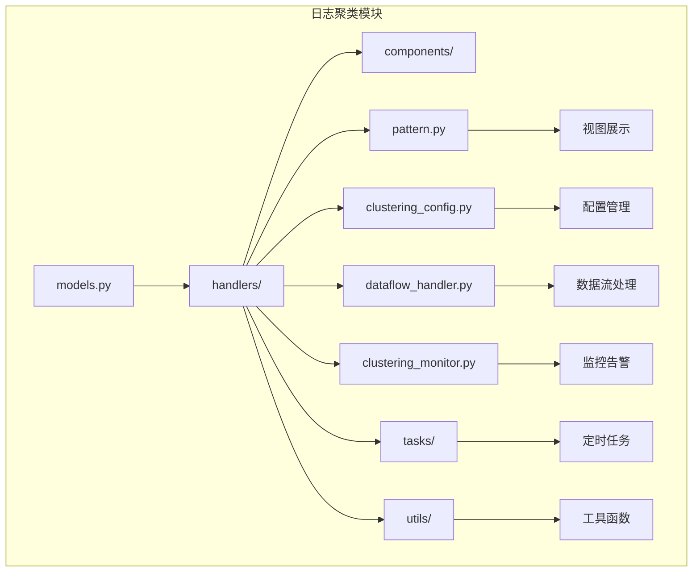
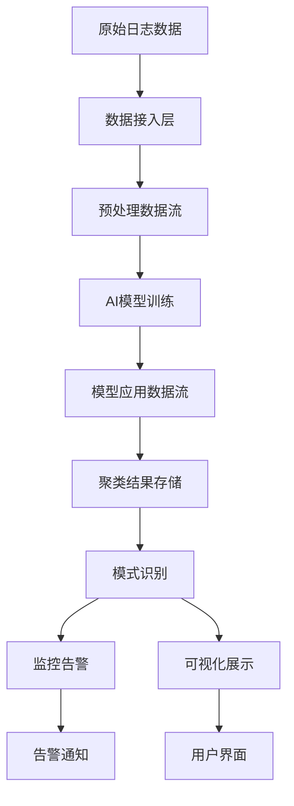
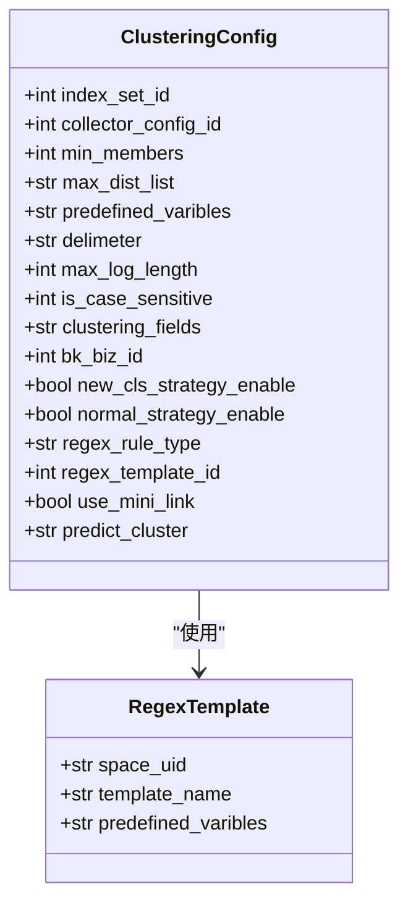
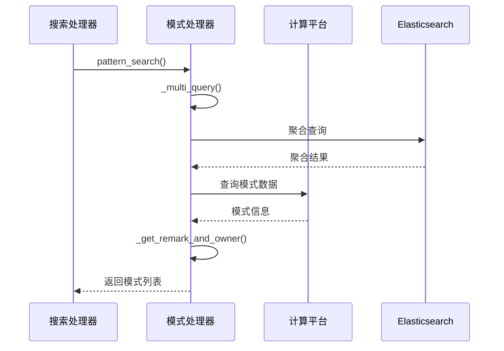
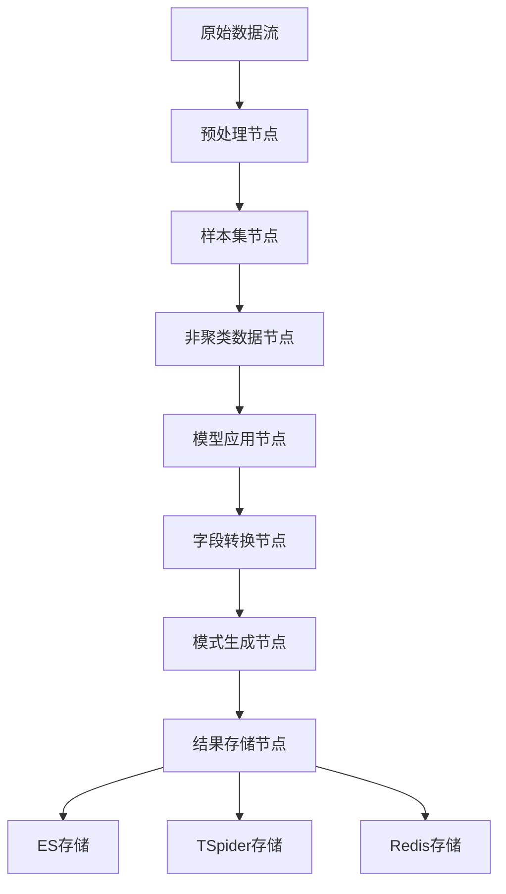
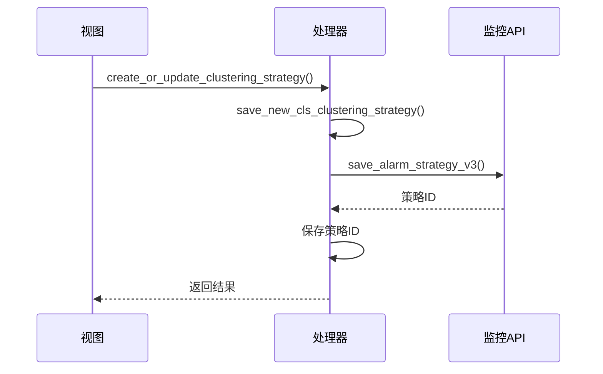
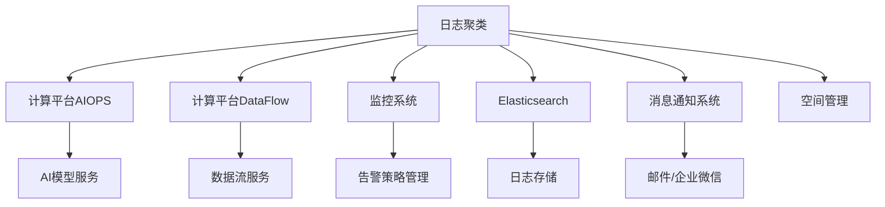

# 日志聚类

<cite>
**本文档引用的文件**   
- [models.py](file://bklog/apps/log_clustering/models.py)
- [constants.py](file://bklog/apps/log_clustering/constants.py)
- [clustering_config.py](file://bklog/apps/log_clustering/handlers/clustering_config.py)
- [pattern.py](file://bklog/apps/log_clustering/handlers/pattern.py)
- [dataflow_handler.py](file://bklog/apps/log_clustering/handlers/dataflow/dataflow_handler.py)
- [clustering_monitor.py](file://bklog/apps/log_clustering/handlers/clustering_monitor.py)
- [clustering_config_views.py](file://bklog/apps/log_clustering/views/clustering_config_views.py)
- [clustering_monitor_views.py](file://bklog/apps/log_clustering/views/clustering_monitor_views.py)
- [subscription.py](file://bklog/apps/log_clustering/tasks/subscription.py)
- [serializers.py](file://bklog/apps/log_clustering/serializers.py)
</cite>

## 目录
1. [引言](#引言)
2. [项目结构](#项目结构)
3. [核心组件](#核心组件)
4. [架构概述](#架构概述)
5. [详细组件分析](#详细组件分析)
6. [依赖分析](#依赖分析)
7. [性能考虑](#性能考虑)
8. [故障排除指南](#故障排除指南)
9. [结论](#结论)

## 引言
日志聚类功能是蓝鲸日志平台的核心功能之一，它利用AI技术对海量日志数据进行模式识别和聚类分析。该功能能够自动发现日志中的常见模式，识别异常行为，并为运维人员提供智能化的故障诊断支持。通过基于AI的模式识别算法，系统可以将相似的日志条目聚合成有意义的模式，大大降低了日志分析的复杂度。

## 项目结构
日志聚类功能主要位于`bklog/apps/log_clustering/`目录下，其结构清晰地划分了不同的功能模块。该功能的核心组件包括模型定义、处理器、任务、工具、视图和序列化器等。

**Diagram sources**
- [models.py](file://bklog/apps/log_clustering/models.py)
- [handlers/](file://bklog/apps/log_clustering/handlers/)
- [tasks/](file://bklog/apps/log_clustering/tasks/)

## 核心组件

日志聚类功能的核心组件主要包括聚类配置管理、模式识别、数据流处理和监控告警等。这些组件协同工作，实现了从日志数据接入到模式识别、再到异常检测的完整流程。

**Section sources**
- [models.py](file://bklog/apps/log_clustering/models.py)
- [clustering_config.py](file://bklog/apps/log_clustering/handlers/clustering_config.py)
- [pattern.py](file://bklog/apps/log_clustering/handlers/pattern.py)

## 架构概述

日志聚类功能的架构设计遵循了模块化和分层的原则，确保了系统的可维护性和可扩展性。整个架构可以分为数据接入层、处理层、存储层和应用层。

**Diagram sources**
- [dataflow_handler.py](file://bklog/apps/log_clustering/handlers/dataflow/dataflow_handler.py)
- [clustering_config.py](file://bklog/apps/log_clustering/handlers/clustering_config.py)
- [clustering_monitor.py](file://bklog/apps/log_clustering/handlers/clustering_monitor.py)

## 详细组件分析

### 聚类配置管理分析
聚类配置管理是日志聚类功能的基础，它负责定义和管理聚类分析的各项参数。

#### 聚类配置模型

**Diagram sources**
- [models.py](file://bklog/apps/log_clustering/models.py#L106-L184)

#### 聚类配置处理器
聚类配置处理器负责处理聚类配置的创建、更新和查询等操作。它通过`ClusteringConfigHandler`类实现了这些功能，确保了配置管理的一致性和可靠性。

**Section sources**
- [clustering_config.py](file://bklog/apps/log_clustering/handlers/clustering_config.py)
- [clustering_config_views.py](file://bklog/apps/log_clustering/views/clustering_config_views.py)

### 模式识别分析
模式识别是日志聚类功能的核心，它利用AI算法从海量日志中发现有意义的模式。

#### 模式识别流程

**Diagram sources**
- [pattern.py](file://bklog/apps/log_clustering/handlers/pattern.py#L85-L232)

### 数据流处理分析
数据流处理组件负责构建和管理日志聚类的数据处理流程。

#### 数据流处理架构

**Diagram sources**
- [dataflow_handler.py](file://bklog/apps/log_clustering/handlers/dataflow/dataflow_handler.py)

### 监控告警分析
监控告警组件负责基于聚类结果生成告警策略，及时发现异常行为。

#### 告警策略创建流程

**Diagram sources**
- [clustering_monitor.py](file://bklog/apps/log_clustering/handlers/clustering_monitor.py#L86-L176)
- [clustering_monitor_views.py](file://bklog/apps/log_clustering/views/clustering_monitor_views.py#L125-L146)

## 依赖分析

日志聚类功能依赖于多个外部系统和内部组件，这些依赖关系确保了功能的完整性和可靠性。

**Diagram sources**
- [dataflow_handler.py](file://bklog/apps/log_clustering/handlers/dataflow/dataflow_handler.py)
- [clustering_monitor.py](file://bklog/apps/log_clustering/handlers/clustering_monitor.py)

**Section sources**
- [dataflow_handler.py](file://bklog/apps/log_clustering/handlers/dataflow/dataflow_handler.py)
- [clustering_monitor.py](file://bklog/apps/log_clustering/handlers/clustering_monitor.py)

## 性能考虑

日志聚类功能在设计时充分考虑了性能因素，通过多种优化策略确保了在大规模数据场景下的高效运行。

1. **缓存机制**：使用Django缓存框架缓存频繁访问的数据，减少数据库查询次数。
2. **异步处理**：将耗时的操作（如数据流创建、模型训练）放入Celery任务队列中异步执行。
3. **批量处理**：在数据查询和处理时采用批量操作，减少网络往返次数。
4. **索引优化**：在关键字段上建立数据库索引，提高查询效率。
5. **资源限制**：对查询结果数量进行限制，防止内存溢出。

## 故障排除指南

### 常见问题及解决方案
1. **聚类接入失败**
   - 检查计算平台相关服务是否正常
   - 确认业务ID是否正确关联
   - 验证存储集群配置

2. **模式识别不准确**
   - 检查正则表达式模板是否合适
   - 调整聚类参数（如敏感度、最小日志数量）
   - 验证日志字段是否正确

3. **告警策略创建失败**
   - 确认监控系统是否正常
   - 检查告警组配置
   - 验证权限设置

**Section sources**
- [clustering_config.py](file://bklog/apps/log_clustering/handlers/clustering_config.py)
- [clustering_monitor.py](file://bklog/apps/log_clustering/handlers/clustering_monitor.py)

## 结论

日志聚类功能通过AI技术实现了日志数据的智能化分析，为运维人员提供了强大的故障诊断工具。该功能的设计充分考虑了可扩展性、可靠性和性能等因素，能够有效应对大规模日志数据的处理需求。通过持续优化算法和架构，日志聚类功能将在未来的运维场景中发挥越来越重要的作用。