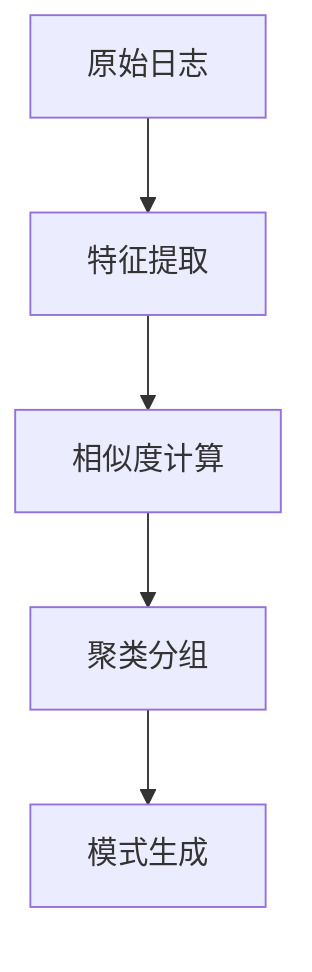
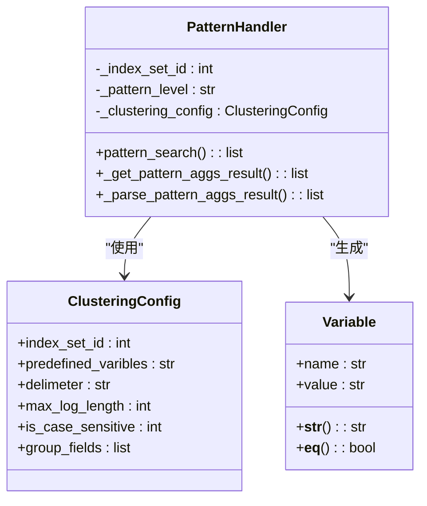
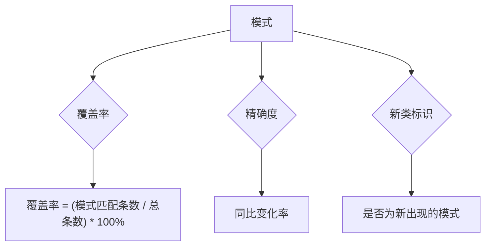
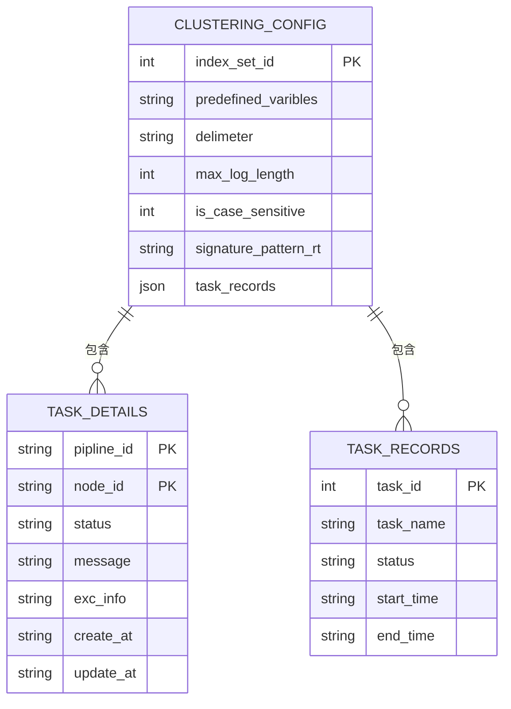
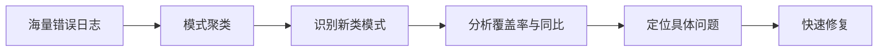

# 模式分析与识别

<cite>
**本文档引用的文件**   
- [pattern.py](file://bklog/apps/log_clustering/handlers/pattern.py)
- [pattern_views.py](file://bklog/apps/log_clustering/views/pattern_views.py)
- [models.py](file://bklog/apps/log_clustering/models.py)
- [constants.py](file://bklog/apps/log_clustering/constants.py)
- [pattern.py](file://bklog/apps/log_clustering/utils/pattern.py)
- [serializers.py](file://bklog/apps/log_clustering/serializers.py)
- [clustering_subscription/clustering_mail.html](file://bklog/templates/clustering_subscription/clustering_mail.html)
- [clustering_subscription/clustering_mail_en.html](file://bklog/templates/clustering_subscription/clustering_mail_en.html)
</cite>

## 目录
1. [引言](#引言)
2. [核心处理流程](#核心处理流程)
3. [模式生成机制](#模式生成机制)
4. [模式质量评估指标](#模式质量评估指标)
5. [模式版本管理](#模式版本管理)
6. [模式匹配API接口](#模式匹配api接口)
7. [模式优化建议](#模式优化建议)
8. [实际应用案例](#实际应用案例)
9. [结论](#结论)

## 引言
模式分析与识别功能是蓝鲸日志平台的核心AI能力之一，旨在通过智能算法对海量日志数据进行聚类分析，自动提取日志模式（Pattern），帮助运维人员快速定位异常和故障。该功能基于日志文本的特征提取、相似度计算和聚类分组等AI算法，将非结构化的原始日志转化为结构化的模式模板，极大地提升了日志分析的效率和准确性。本文档将深入解析该功能的实现原理、核心机制和应用方法。

## 核心处理流程

模式分析与识别的核心处理流程主要包括日志文本的特征提取、相似度计算和聚类分组三个阶段。整个流程始于对原始日志的预处理，通过正则表达式和分词符对日志进行分词和变量提取，将日志文本转化为由固定文本和变量组成的序列。随后，系统计算不同日志序列之间的相似度，基于相似度阈值将相似的日志归为同一类。最后，通过聚类算法对日志进行分组，形成具有代表性的模式模板。



**Diagram sources**
- [pattern.py](file://bklog/apps/log_clustering/handlers/pattern.py#L71-L83)
- [pattern.py](file://bklog/apps/log_clustering/utils/pattern.py#L83-L159)

**Section sources**
- [pattern.py](file://bklog/apps/log_clustering/handlers/pattern.py#L71-L83)
- [pattern.py](file://bklog/apps/log_clustering/utils/pattern.py#L83-L159)

## 模式生成机制

模式生成机制是将原始日志转化为正则表达式模板和变量位置的关键过程。系统首先根据预定义的正则表达式规则（如IP地址、数字、容量等）和分词符对日志进行分词。在分词过程中，匹配到预定义正则表达式的部分被标记为变量（如`#IP#`、`#NUMBER#`），其余部分作为固定文本。对于包含中文的日志，系统还支持中文分词功能，以更精确地识别变量位置。



**Diagram sources**
- [pattern.py](file://bklog/apps/log_clustering/utils/pattern.py#L57-L81)
- [pattern.py](file://bklog/apps/log_clustering/handlers/pattern.py#L71-L83)
- [models.py](file://bklog/apps/log_clustering/models.py#L106-L184)

**Section sources**
- [pattern.py](file://bklog/apps/log_clustering/utils/pattern.py#L57-L81)
- [pattern.py](file://bklog/apps/log_clustering/handlers/pattern.py#L71-L83)

## 模式质量评估指标

为了衡量生成模式的质量，系统定义了多个评估指标，其中最主要的两个是覆盖率和精确度。

**覆盖率**：指某个模式所代表的日志条数占总日志条数的比例。计算公式为：`覆盖率 = (模式匹配的日志条数 / 总日志条数) * 100%`。高覆盖率的模式代表了日志中的主要行为。

**精确度**：指模式的准确性和稳定性。系统通过同比分析来评估模式的精确度，即比较当前时间段内模式的出现次数与历史时间段（如24小时前）的出现次数，计算变化率。异常的突增或突降可能表明模式不够精确或存在新的异常。

此外，系统还提供了“新类”（New Class）标识，用于标记在指定时间段内首次出现的模式，帮助用户发现潜在的新问题。



**Diagram sources**
- [pattern.py](file://bklog/apps/log_clustering/handlers/pattern.py#L344-L348)
- [pattern.py](file://bklog/apps/log_clustering/handlers/pattern.py#L338-L341)
- [constants.py](file://bklog/apps/log_clustering/constants.py#L36-L38)

**Section sources**
- [pattern.py](file://bklog/apps/log_clustering/handlers/pattern.py#L344-L348)
- [pattern.py](file://bklog/apps/log_clustering/handlers/pattern.py#L338-L341)

## 模式版本管理

模式版本管理通过数据库记录和配置管理实现。系统使用`ClusteringConfig`模型来存储每个索引集的聚类配置，包括预定义的正则表达式、分词符、敏感度等参数。这些配置的变更即代表了模式生成算法的版本迭代。

当配置发生变更时，系统会启动新的聚类任务，并将结果存储在不同的结果表中（如`signature_pattern_rt`），从而实现新旧模式的隔离和追溯。用户可以通过查看`task_records`和`task_details`字段来追踪每次聚类任务的执行详情和状态，确保模式迭代过程的可追溯性。



**Diagram sources**
- [models.py](file://bklog/apps/log_clustering/models.py#L106-L154)
- [models.py](file://bklog/apps/log_clustering/models.py#L154-L155)

**Section sources**
- [models.py](file://bklog/apps/log_clustering/models.py#L106-L154)

## 模式匹配API接口

系统提供了RESTful API接口用于查询和验证模式。主要接口如下：

### 模式检索API
- **路径**: `/pattern/{index_set_id}/search/`
- **方法**: POST
- **功能**: 根据索引集ID和查询条件检索日志模式。
- **请求参数**:
  - `pattern_level`: 聚类敏感度级别
  - `start_time`, `end_time`: 时间范围
  - `year_on_year_hour`: 同比周期（小时）
  - `group_by`: 分组字段
  - `remark_config`, `owner_config`: 备注和负责人过滤条件
- **响应示例**:
```json
{
  "result": true,
  "data": [
    {
      "pattern": "Error connecting to #IP#",
      "signature": "a1b2c3d4",
      "count": 150,
      "percentage": 75.0,
      "is_new_class": false,
      "year_on_year_count": 100,
      "year_on_year_percentage": 50.0,
      "remark": ["数据库连接异常"],
      "owners": ["admin"]
    }
  ]
}
```

### 模式备注与负责人管理API
- **设置备注**: `/pattern/{index_set_id}/remark/` (POST)
- **更新备注**: `/pattern/{index_set_id}/update_remark/` (PUT)
- **删除备注**: `/pattern/{index_set_id}/delete_remark/` (DELETE)
- **设置负责人**: `/pattern/{index_set_id}/owner/` (POST)

这些API允许用户通过编程方式对模式进行标注和管理，便于自动化运维和集成。

**Section sources**
- [pattern_views.py](file://bklog/apps/log_clustering/views/pattern_views.py#L49-L132)
- [serializers.py](file://bklog/apps/log_clustering/serializers.py#L40-L68)

## 模式优化建议

为了提高模式质量，可以采取以下优化措施：

### 算法参数调整
- **敏感度（max_dist_list）**: 调整聚类的敏感度，值越小，聚类越严格，生成的模式越多越细；值越大，聚类越宽松，模式越少越粗。
- **相似度阈值（st_list）**: 控制日志序列相似度的判定标准，影响聚类的精度。
- **分词符（delimeter）**: 选择合适的分词符（如空格、制表符）对日志进行分割，直接影响变量提取的准确性。
- **预定义正则表达式（predefined_varibles）**: 根据日志格式自定义正则表达式，如添加特定的业务ID、时间戳格式等，能显著提升模式提取的准确性。

### 特殊日志格式处理
- **中文日志**: 启用中文分词功能（`is_chinese_cut`），利用jieba等分词工具更精确地切分中文文本。
- **大小写敏感**: 根据需要设置`is_case_sensitive`参数，对于不区分大小写的日志（如URL），应关闭大小写敏感。
- **日志长度**: 通过`max_log_length`限制日志处理的最大长度，避免过长的日志影响性能。

**Section sources**
- [models.py](file://bklog/apps/log_clustering/models.py#L114-L118)
- [pattern.py](file://bklog/apps/log_clustering/utils/pattern.py#L83-L159)

## 实际应用案例

在故障定位中，模式识别功能发挥了重要作用。例如，当某个服务出现大量错误时，运维人员可以通过模式分析功能快速将成千上万条错误日志聚类为少数几个模式。系统会自动标记出“新类”模式，提示这些是最近才出现的异常。通过查看模式的覆盖率和同比变化，可以判断问题的严重程度和影响范围。

例如，系统可能识别出一个新模式`"Failed to connect to database #IP# with timeout #NUMBER#ms"`，该模式在过去24小时内出现了1000次，而24小时前为0次，同比变化为100%，被标记为“新类”。运维人员可以立即关注此模式，结合负责人信息联系相关开发人员，并通过日志示例快速定位到具体的数据库连接问题，从而大大缩短了故障排查时间。



**Diagram sources**
- [clustering_subscription/clustering_mail.html](file://bklog/templates/clustering_subscription/clustering_mail.html#L76-L106)
- [clustering_subscription/clustering_mail_en.html](file://bklog/templates/clustering_subscription/clustering_mail_en.html#L76-L106)

**Section sources**
- [clustering_subscription/clustering_mail.html](file://bklog/templates/clustering_subscription/clustering_mail.html#L76-L106)

## 结论
模式分析与识别功能通过先进的AI算法，实现了日志数据的自动化聚类和模式提取，是提升运维效率的关键工具。本文档详细阐述了其从特征提取、模式生成到质量评估的完整流程，并介绍了API接口和优化方法。通过合理配置和使用，该功能能够有效帮助用户从海量日志中快速发现异常，精准定位故障，为系统的稳定运行提供有力保障。