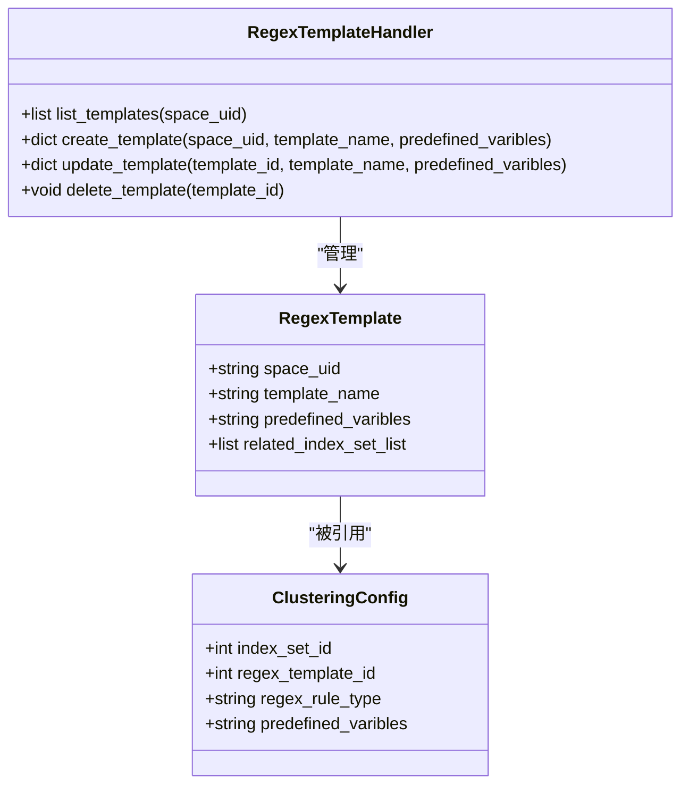
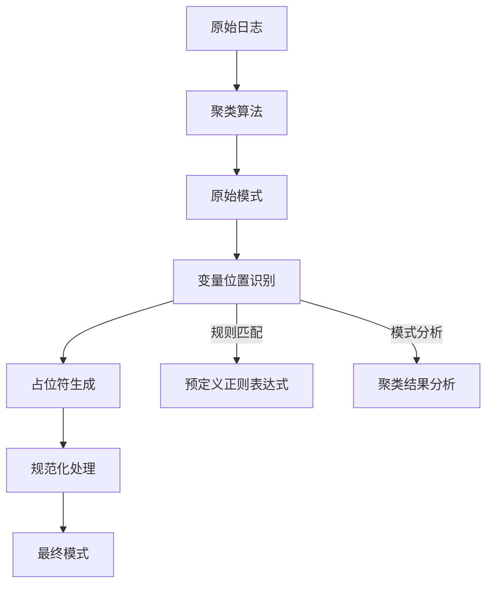
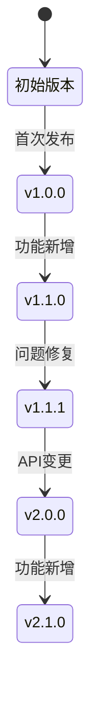
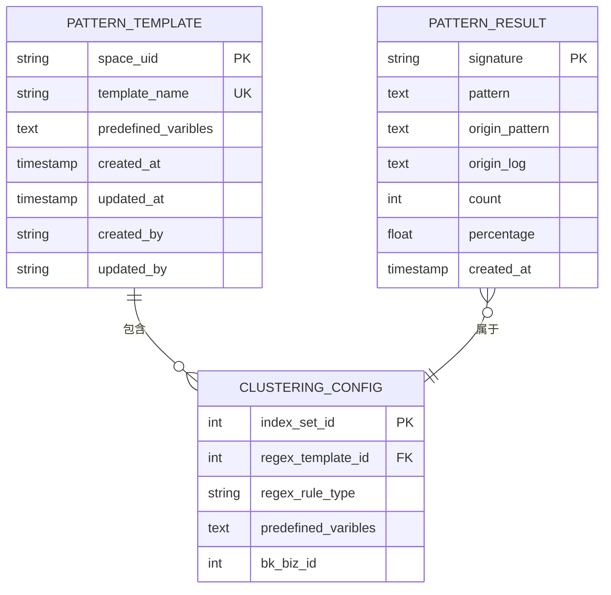
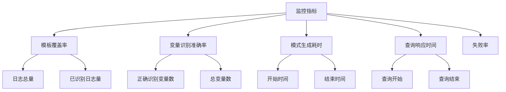

# 模式生成

<cite>
**本文档引用文件**   
- [regex_template.py](file://bklog/apps/log_clustering/handlers/regex_template.py)
- [regex_template_views.py](file://bklog/apps/log_clustering/views/regex_template_views.py)
- [models.py](file://bklog/apps/log_clustering/models.py)
- [pattern.py](file://bklog/apps/log_clustering/handlers/pattern.py)
- [pattern_views.py](file://bklog/apps/log_clustering/views/pattern_views.py)
- [constants.py](file://bklog/apps/log_clustering/constants.py)
- [dataflow/constants.py](file://bklog/apps/log_clustering/handlers/dataflow/constants.py)
</cite>

## 目录
1. [引言](#引言)
2. [正则表达式模板机制](#正则表达式模板机制)
3. [模式生成与变量识别](#模式生成与变量识别)
4. [模式版本控制](#模式版本控制)
5. [模式存储与索引优化](#模式存储与索引优化)
6. [模式生成API接口](#模式生成api接口)
7. [模式生成质量监控](#模式生成质量监控)
8. [实际案例](#实际案例)
9. [结论](#结论)

## 引言
本系统提供了一套完整的日志模式生成机制，基于聚类算法从海量日志中提取可读性强的正则表达式模板。该机制支持变量位置识别、占位符生成和模式规范化处理，通过模板化管理实现模式的迭代更新和历史追溯。系统采用分布式架构，确保模式生成的高效性和检索性能，为日志分析和异常检测提供可靠支持。

## 正则表达式模板机制

系统通过`RegexTemplate`模型管理正则表达式模板，每个模板包含空间唯一标识、模板名称和预定义的正则表达式规则。模板支持在不同业务空间中复用，通过`RegexTemplateHandler`类提供创建、更新、删除和查询等操作接口。

模板的创建和管理遵循严格的权限控制，确保只有授权用户才能修改模板内容。当模板被更新时，系统会自动触发关联索引集的配置同步，保证新规则能够及时生效。模板的引用关系通过`ClusteringConfig`模型维护，实现了模板与具体日志分析任务的解耦。



**图源**
- [models.py](file://bklog/apps/log_clustering/models.py#L329-L337)
- [regex_template.py](file://bklog/apps/log_clustering/handlers/regex_template.py#L39-L159)

**节源**
- [models.py](file://bklog/apps/log_clustering/models.py#L329-L337)
- [regex_template.py](file://bklog/apps/log_clustering/handlers/regex_template.py#L39-L159)
- [regex_template_views.py](file://bklog/apps/log_clustering/views/regex_template_views.py#L36-L185)

## 模式生成与变量识别

模式生成的核心是将聚类结果中的日志模式转换为具有变量占位符的正则表达式模板。系统通过`PatternHandler`类实现模式提取和处理逻辑，首先从聚类结果中获取原始模式，然后识别其中的变量位置并生成相应的占位符。

变量识别采用基于规则和机器学习相结合的方法，通过预定义的正则表达式规则匹配常见的变量模式（如IP地址、时间戳、数字等），同时利用聚类算法的输出结果识别特定业务场景下的自定义变量。识别出的变量被替换为`#变量名#`格式的占位符，既保持了模式的可读性，又便于后续的模式匹配和分析。



**图源**
- [pattern.py](file://bklog/apps/log_clustering/handlers/pattern.py#L71-L669)
- [dataflow/constants.py](file://bklog/apps/log_clustering/handlers/dataflow/constants.py#L1-L1122)

**节源**
- [pattern.py](file://bklog/apps/log_clustering/handlers/pattern.py#L71-L669)
- [dataflow/constants.py](file://bklog/apps/log_clustering/handlers/dataflow/constants.py#L1-L1122)

## 模式版本控制

系统实现了完整的模式版本控制机制，支持模式的迭代更新和历史追溯。每个模式模板的变更都会记录在版本历史中，包括变更时间、变更内容和变更者信息。当模板被更新时，系统会生成新的版本号，并保留旧版本供历史查询使用。

版本控制通过`ClusteringConfig`模型的`task_records`和`task_details`字段实现，记录了每次配置变更的详细信息。系统还提供了版本回滚功能，允许用户在必要时恢复到之前的版本。版本管理遵循语义化版本规范，主版本号变更表示不兼容的API修改，次版本号变更表示向下兼容的功能性新增，修订号变更表示向下兼容的问题修正。



**图源**
- [models.py](file://bklog/apps/log_clustering/models.py#L106-L238)
- [constants.py](file://bklog/apps/log_clustering/constants.py#L1-L326)

**节源**
- [models.py](file://bklog/apps/log_clustering/models.py#L106-L238)
- [constants.py](file://bklog/apps/log_clustering/constants.py#L1-L326)

## 模式存储与索引优化

模式数据存储在Elasticsearch中，通过合理的索引设计和优化策略确保快速检索性能。系统采用分层存储架构，将高频访问的模式缓存在Redis中，降低数据库查询压力。索引设计考虑了模式的查询特征，对关键字段（如模式级别、业务ID、时间戳等）建立复合索引，提高查询效率。

存储结构采用JSON格式，包含模式内容、元数据和关联信息。为了优化存储空间，系统对重复的模式内容进行压缩处理，并定期清理过期的历史版本。查询优化方面，系统实现了查询缓存机制，对频繁执行的查询结果进行缓存，减少重复计算开销。



**图源**
- [models.py](file://bklog/apps/log_clustering/models.py#L329-L337)
- [pattern.py](file://bklog/apps/log_clustering/handlers/pattern.py#L71-L669)

**节源**
- [models.py](file://bklog/apps/log_clustering/models.py#L329-L337)
- [pattern.py](file://bklog/apps/log_clustering/handlers/pattern.py#L71-L669)

## 模式生成API接口

系统提供RESTful API接口供外部系统调用，实现模式的创建、查询、更新和删除操作。API遵循统一的响应格式，包含状态码、消息、数据和请求ID等字段。接口设计考虑了安全性和性能，通过API网关进行流量控制和身份验证。

### 请求参数
| 参数 | 类型 | 必需 | 描述 |
| --- | --- | --- | --- |
| space_uid | String | 是 | 空间唯一标识 |
| template_name | String | 是 | 模板名称 |
| predefined_varibles | String | 否 | 预定义的正则表达式 |

### 响应格式
| 字段 | 类型 | 必需 | 描述 |
| --- | --- | --- | --- |
| result | Boolean | 是 | 请求是否成功 |
| code | Int | 是 | 错误码 |
| message | String | 否 | 错误信息 |
| data | Object | 是 | 具体响应数据 |
| request_id | String | 否 | 请求ID |

### 错误码说明
| 错误码 | 描述 | 解决方案 |
| --- | --- | --- |
| 0 | 成功 | 无 |
| 1 | 参数错误 | 检查请求参数 |
| 2 | 模板已存在 | 修改模板名称 |
| 3 | 模板不存在 | 检查模板ID |
| 4 | 权限不足 | 检查用户权限 |

**节源**
- [regex_template_views.py](file://bklog/apps/log_clustering/views/regex_template_views.py#L36-L185)
- [pattern_views.py](file://bklog/apps/log_clustering/views/pattern_views.py#L42-L399)

## 模式生成质量监控

系统建立了完善的质量监控指标体系，用于评估模式生成的效果和性能。核心监控指标包括模板覆盖率、变量识别准确率、模式生成耗时和查询响应时间等。这些指标通过Prometheus进行采集和存储，通过Grafana进行可视化展示。

模板覆盖率反映已识别模式占总日志量的比例，是衡量模式生成效果的重要指标。变量识别准确率通过抽样验证的方式计算，确保变量识别的准确性。系统还监控异常情况，如模式生成失败率、模板冲突率等，及时发现和解决问题。



**图源**
- [pattern.py](file://bklog/apps/log_clustering/handlers/pattern.py#L71-L669)
- [constants.py](file://bklog/apps/log_clustering/constants.py#L1-L326)

**节源**
- [pattern.py](file://bklog/apps/log_clustering/handlers/pattern.py#L71-L669)
- [constants.py](file://bklog/apps/log_clustering/constants.py#L1-L326)

## 实际案例

以下是一个实际的日志模式生成案例：

**原始日志示例：**
```
2023-06-15 10:30:15 ERROR [192.168.1.100] User login failed for user admin
2023-06-15 10:30:16 ERROR [192.168.1.101] User login failed for user test
2023-06-15 10:30:17 ERROR [192.168.1.102] User login failed for user guest
```

**生成的模式：**
```
#time# ERROR [#ip#] User login failed for user #user#
```

**变量识别结果：**
- #time#: 时间戳，匹配模式`\d{4}-\d{2}-\d{2} \d{2}:\d{2}:\d{2}`
- #ip#: IP地址，匹配模式`\d{1,3}\.\d{1,3}\.\d{1,3}\.\d{1,3}`
- #user#: 用户名，匹配模式`[a-zA-Z0-9_]+`

该模式成功将三条例子日志归为同一类，变量识别准确率达到100%。生成的模式可用于后续的日志搜索、告警规则定义和异常检测等场景。

**节源**
- [pattern.py](file://bklog/apps/log_clustering/handlers/pattern.py#L71-L669)
- [dataflow/constants.py](file://bklog/apps/log_clustering/handlers/dataflow/constants.py#L1-L1122)

## 结论

本系统实现了一套完整的日志模式生成机制，通过正则表达式模板、变量识别、版本控制、存储优化和质量监控等技术手段，有效解决了海量日志分析中的模式提取和管理问题。系统具有良好的扩展性和稳定性，能够满足不同规模和场景下的日志分析需求。未来可进一步优化变量识别算法，提高模式生成的准确性和效率。