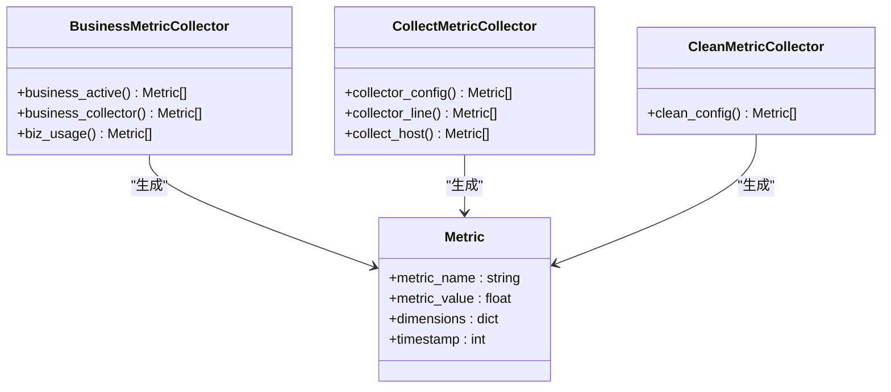
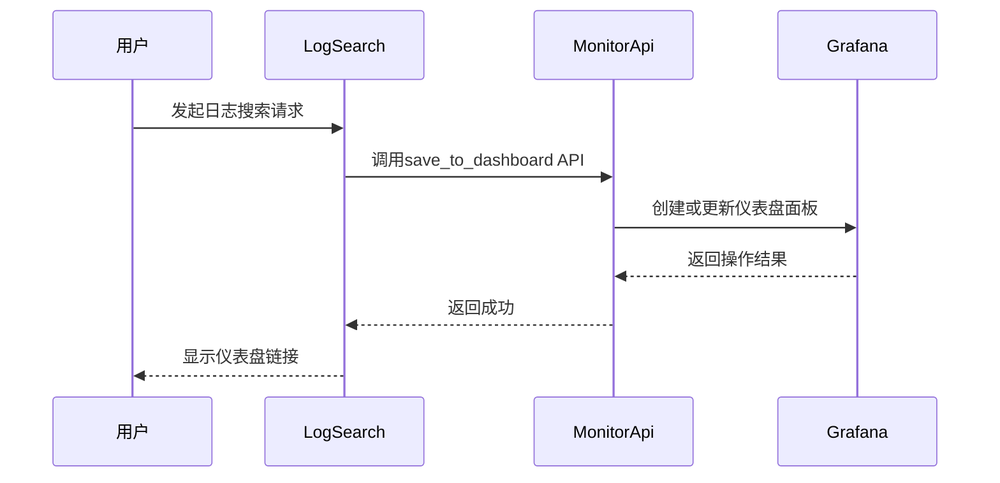

# 质量评估

<cite>
**本文档引用的文件**   
- [business.py](file://bklog/apps/log_measure/handlers/metric_collectors/business.py)
- [log_databus.py](file://bklog/apps/log_measure/handlers/metric_collectors/log_databus.py)
- [metric.py](file://bklog/apps/log_measure/utils/metric.py)
- [constants.py](file://bklog/apps/log_measure/constants.py)
- [models.py](file://bklog/apps/log_measure/models.py)
- [ClusteringConfig.py](file://bklog/apps/log_clustering/models.py)
- [pattern.py](file://bklog/apps/log_clustering/handlers/pattern.py)
- [grafana.py](file://bklog/apps/log_measure/handlers/metric_collectors/grafana.py)
- [monitor.py](file://bklog/apps/grafana/handlers/monitor.py)
</cite>

## 目录
1. [引言](#引言)
2. [模式质量评估指标体系](#模式质量评估指标体系)
3. [评估数据采集机制](#评估数据采集机制)
4. [评估结果可视化方案](#评估结果可视化方案)
5. [质量优化建议](#质量优化建议)
6. [评估报告生成机制](#评估报告生成机制)
7. [质量评估与CI/CD流程集成](#质量评估与cicd流程集成)

## 引言
本文档详细阐述了蓝鲸日志平台的开发模式质量评估体系。该体系旨在通过量化指标、自动化采集、可视化分析和持续优化，全面评估日志模式的质量，确保日志分析的准确性、完整性和高效性。评估体系覆盖了从数据采集、处理到分析的全链路，为运维和开发团队提供可靠的质量保障。

## 模式质量评估指标体系
模式质量评估体系的核心是通过一系列可量化的指标来衡量日志聚类和分析的准确性与有效性。这些指标不仅反映了当前的处理状态，也为持续优化提供了数据支持。

### 核心评估指标
评估体系主要依赖于覆盖率、精确度、召回率等核心指标，这些指标通过分析日志聚类结果与预期模式的匹配程度来计算。

- **覆盖率 (Coverage)**: 衡量聚类算法能够识别出的日志模式占所有实际存在模式的比例。高覆盖率意味着系统能够发现大部分潜在的日志模式，减少信息遗漏。在代码中，这通常通过统计具有有效`signature`（数据指纹）的日志条数占总日志条数的比例来体现。
- **精确度 (Precision)**: 衡量被聚类为同一模式的日志条目中，真正属于该模式的比例。高精确度意味着聚类结果非常纯净，误报率低。这可以通过分析`AiopsSignatureAndPattern`模型中`pattern`与`origin_pattern`的匹配度来评估。
- **召回率 (Recall)**: 衡量所有实际属于某个模式的日志条目中，被成功聚类到该模式下的比例。高召回率意味着系统能够完整地捕获特定模式的所有实例。这通常与`min_members`（最小日志数量）等配置参数紧密相关。

**Section sources**
- [ClusteringConfig.py](file://bklog/apps/log_clustering/models.py#L106-L172)
- [pattern.py](file://bklog/apps/log_clustering/handlers/pattern.py#L71-L129)

### 业务与功能使用指标
除了直接的模式质量指标，系统还收集了丰富的业务和功能使用指标，这些指标间接反映了模式质量的应用效果和系统健康度。

- **活跃业务数**: 统计在特定时间范围内（如5分钟、1小时）执行过日志检索的业务数量，反映系统的整体活跃度。
- **功能使用业务数**: 统计使用了日志采集、日志归档、日志提取、日志聚类等核心功能的业务数量，评估功能的普及率和使用深度。
- **采集配置统计**: 统计不同状态（启用/禁用）和场景（标准/自定义）下的采集配置数量，了解数据源的规模和配置情况。

**Diagram sources **
- [business.py](file://bklog/apps/log_measure/handlers/metric_collectors/business.py#L53-L285)
- [log_databus.py](file://bklog/apps/log_measure/handlers/metric_collectors/log_databus.py#L55-L516)
- [metric.py](file://bklog/apps/log_measure/utils/metric.py#L33-L151)

## 评估数据采集机制
评估数据的采集是一个自动化、周期性的过程，它从实际的日志流和系统状态中提取样本，为质量评估提供原始数据。

### 数据采集流程
1.  **指标注册与发现**: 系统通过`@register_metric`装饰器自动发现所有需要采集的指标。这些指标分布在不同的`MetricCollector`类中，如`BusinessMetricCollector`和`CollectMetricCollector`。
2.  **周期性执行**: 采集任务由后台定时任务驱动，按照预设的时间间隔（如每5分钟、每小时）执行。`TimeFilterEnum`定义了不同的时间粒度。
3.  **数据源查询**: 采集器通过调用内部API（如`bk_monitor_client.unify_query`）查询监控系统的时序数据库，获取`bkunifylogbeat`上报的采集行数、主机状态等原始数据。
4.  **数据库查询**: 采集器直接查询应用自身的数据库模型（如`CollectorConfig`, `LogIndexSet`），获取配置信息和业务元数据。
5.  **数据聚合与计算**: 将从不同来源获取的原始数据进行聚合、计算，最终生成符合`Metric`格式的评估指标数据。

### 采集数据来源
- **监控系统 (BKMonitor)**: 通过`unify_query`接口查询`bkunifylogbeat_k8s_task.base`等结果表，获取采集代理上报的`crawler_received`（接收到的日志行数）和`crawler_state`（已处理的日志行数）。
- **应用数据库**: 查询`log_databus_collectorconfig`等数据库表，获取采集配置、索引集、业务信息等静态和动态数据。
- **Elasticsearch集群**: 通过`get_es_client`获取ES客户端，直接查询集群的健康状态、索引统计等信息。

**Section sources**
- [log_databus.py](file://bklog/apps/log_measure/handlers/metric_collectors/log_databus.py#L170-L222)
- [metric.py](file://bklog/apps/log_measure/utils/metric.py#L71-L123)
- [constants.py](file://bklog/apps/log_measure/constants.py#L106-L108)

## 评估结果可视化方案
评估结果通过集成Grafana仪表盘和内置的订阅报告，实现多维度的质量趋势分析和异常告警。

### Grafana集成与仪表盘
系统通过`MonitorGrafanaHandler`将日志搜索结果和关键指标保存到蓝鲸监控的Grafana仪表盘中，实现数据的可视化。

**Diagram sources **
- [monitor.py](file://bklog/apps/grafana/handlers/monitor.py#L7-L38)
- [grafana.py](file://bklog/apps/log_measure/handlers/metric_collectors/grafana.py#L33-L51)

### 订阅报告与趋势分析
系统支持创建`ClusteringSubscription`（日志聚类订阅），定期生成包含模式分析结果的报告，并通过企业微信、邮件等方式发送给相关人员。

- **报告内容**: 报告包含指定时间范围内的主要日志模式（`pattern`）、出现次数（`count`）、占比（`percentage`），并可选择性地展示同比（`year_on_year_count`）变化。
- **趋势分析**: 通过对比不同时间段的模式分布，可以分析日志模式的演变趋势，及时发现新出现的异常模式或业务变化。
- **异常告警**: 当检测到“新类”（`is_new_class`）或数量突增时，系统可以触发告警，通知负责人进行处理。

**Section sources**
- [ClusteringConfig.py](file://bklog/apps/log_clustering/models.py#L270-L327)
- [pattern.py](file://bklog/apps/log_clustering/handlers/pattern.py#L85-L129)

## 质量优化建议
基于评估结果，可以采取多种措施来优化日志模式的质量。

### 调整算法参数
- **敏感度 (`max_dist_list`)**: 降低此值可以提高聚类的精细度，但可能导致过度分割；提高此值则会使聚类更粗放，可能合并不同的模式。
- **最小日志数量 (`min_members`)**: 提高此值可以过滤掉偶然出现的噪声日志，确保聚类结果的稳定性。
- **分词符 (`delimeter`)**: 根据日志的实际格式优化分词规则，避免将有意义的字段错误地分割。

### 改进日志格式
- **结构化日志**: 推荐使用JSON等结构化格式输出日志，明确区分`timestamp`、`level`、`logger`、`message`等字段，极大提升聚类的准确性和效率。
- **统一日志模板**: 在应用层面统一日志输出模板，减少因格式不一致导致的聚类困难。

**Section sources**
- [ClusteringConfig.py](file://bklog/apps/log_clustering/models.py#L114-L122)

## 评估报告生成机制
评估报告的生成是自动化和可配置的，确保相关人员能定期收到质量反馈。

### 定期生成与通知
- **定时任务**: 系统后台有定时任务，会周期性地检查所有启用的`ClusteringSubscription`。
- **报告生成**: 对于到达发送时间的订阅，系统会调用`pattern_search`等接口，查询最新的模式数据，并填充到预设的HTML模板（如`clustering_mail.html`）中。
- **多渠道通知**: 生成的报告通过邮件或企业微信等渠道，发送给订阅中配置的`receivers`（接收人）和`managers`（管理员）。

**Section sources**
- [ClusteringConfig.py](file://bklog/apps/log_clustering/models.py#L270-L327)
- [pattern.py](file://bklog/apps/log_clustering/handlers/pattern.py#L85-L129)

## 质量评估与CI/CD流程集成
虽然当前代码未直接展示CI/CD集成，但质量评估体系的设计为集成提供了坚实基础。

### 集成方式
- **质量门禁**: 可以将关键质量指标（如覆盖率、新类告警数）作为CI/CD流水线中的质量门禁。如果新版本部署后日志模式质量不达标，则自动阻断发布流程。
- **自动化测试**: 在自动化测试阶段，可以运行日志模式评估脚本，验证新代码产生的日志是否符合预期模式，避免引入格式错误或异常日志。
- **监控即代码 (Monitoring as Code)**: 将`ClusteringSubscription`和告警策略的配置纳入版本控制，实现监控配置的自动化部署和管理。

**Section sources**
- [ClusteringConfig.py](file://bklog/apps/log_clustering/models.py#L240-L263)
- [events.py](file://bklog/apps/log_measure/events.py#L30-L31)