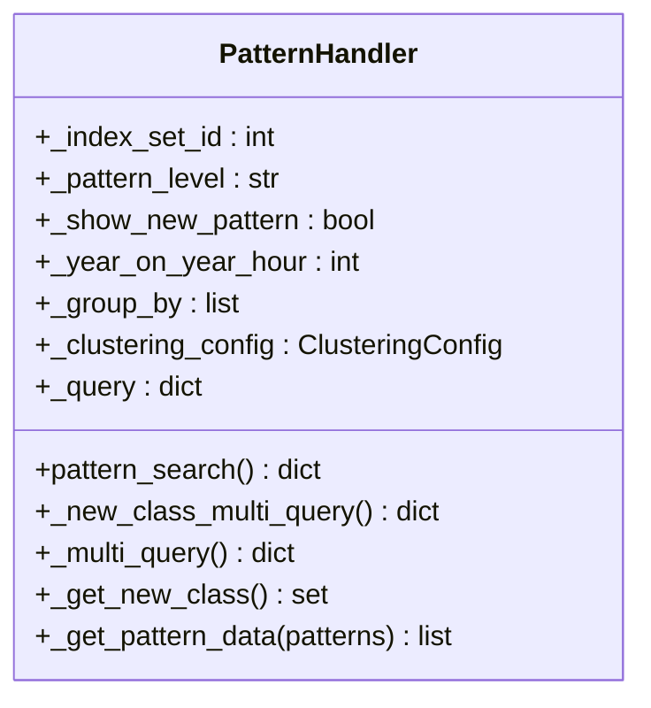
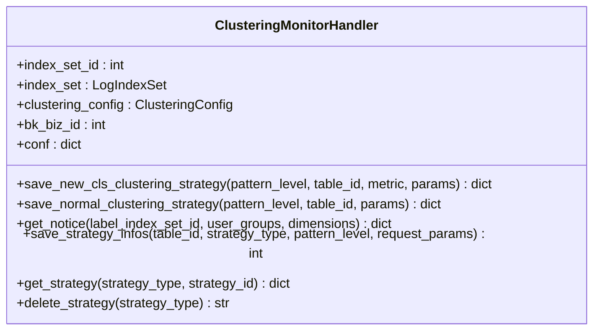
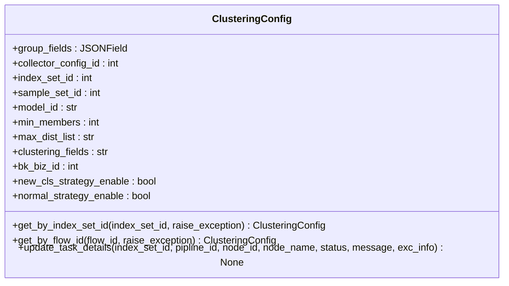
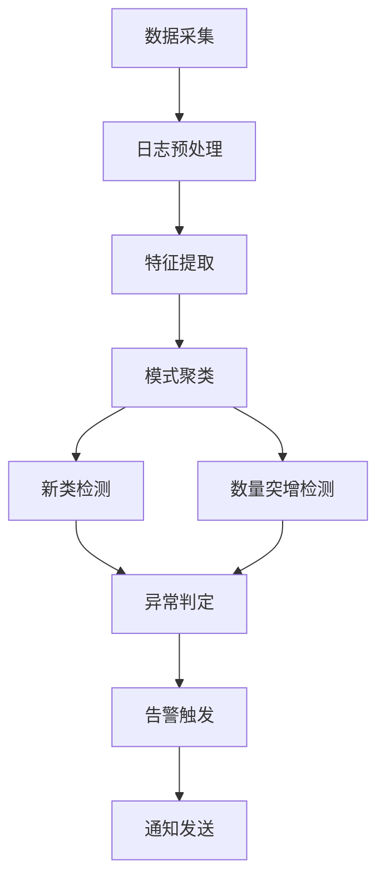
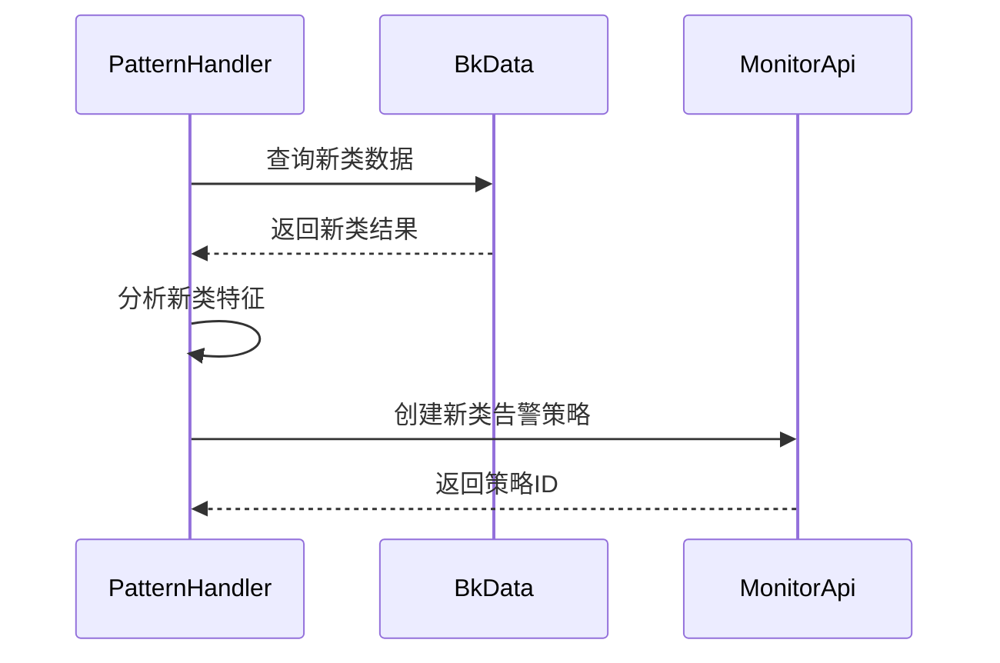

# 异常检测

<cite>
**本文档引用的文件**   
- [pattern.py](file://bklog/apps/log_clustering/handlers/pattern.py)
- [clustering_monitor.py](file://bklog/apps/log_clustering/handlers/clustering_monitor.py)
- [constants.py](file://bklog/apps/log_clustering/constants.py)
- [models.py](file://bklog/apps/log_clustering/models.py)
- [clustering_config.py](file://bklog/apps/log_clustering/handlers/clustering_config.py)
- [monitor.py](file://bklog/apps/log_clustering/utils/monitor.py)
- [subscription.py](file://bklog/apps/log_clustering/tasks/subscription.py)
</cite>

## 目录
1. [引言](#引言)
2. [异常检测机制概述](#异常检测机制概述)
3. [核心组件分析](#核心组件分析)
4. [异常检测执行流程](#异常检测执行流程)
5. [异常分类体系](#异常分类体系)
6. [触发条件与判定阈值](#触发条件与判定阈值)
7. [性能调优建议](#性能调优建议)
8. [实际检测案例](#实际检测案例)
9. [结论](#结论)

## 引言
本文档详细阐述了蓝鲸日志平台中的异常检测机制，重点介绍如何识别新出现的日志模式和异常行为增长趋势。文档深入分析了基于统计学的异常检测算法和基于机器学习的模式识别方法，说明了异常检测的触发条件、判定阈值以及如何区分正常波动和真正异常。同时，文档化了异常事件的分类体系和完整的执行流程，并提供了性能调优建议和实际检测案例。

## 异常检测机制概述
蓝鲸日志平台的异常检测机制主要通过日志聚类技术实现，能够自动识别日志中的新模式和数量突增等异常行为。该机制结合了机器学习算法和统计学方法，对海量日志数据进行分析，及时发现系统故障或安全事件。

异常检测的核心在于日志聚类，通过将相似的日志条目归为一类，形成"数据指纹"（signature）和"模式"（pattern）。系统会持续监控这些聚类模式的变化，当出现新的聚类模式或现有模式的数量发生显著变化时，就会触发异常告警。

**Section sources**
- [pattern.py](file://bklog/apps/log_clustering/handlers/pattern.py#L85-L415)
- [clustering_monitor.py](file://bklog/apps/log_clustering/handlers/clustering_monitor.py#L100-L262)

## 核心组件分析

### 模式处理器（PatternHandler）
模式处理器是异常检测的核心组件，负责处理日志模式的搜索和分析。它通过聚合查询获取日志数据的分布情况，并识别新出现的类。



**Diagram sources **
- [pattern.py](file://bklog/apps/log_clustering/handlers/pattern.py#L71-L669)

### 聚类监控处理器（ClusteringMonitorHandler）
聚类监控处理器负责创建和管理异常检测的告警策略。它能够为新类异常和数量突增异常创建不同的监控策略。



**Diagram sources **
- [clustering_monitor.py](file://bklog/apps/log_clustering/handlers/clustering_monitor.py#L68-L615)

### 聚类配置模型（ClusteringConfig）
聚类配置模型定义了异常检测的各项参数和配置，包括聚类字段、敏感度、最小日志数量等。



**Diagram sources **
- [models.py](file://bklog/apps/log_clustering/models.py#L106-L238)

## 异常检测执行流程
异常检测的执行流程从数据采集开始，经过特征提取、模式识别，最终到异常判定，形成一个完整的链条。



**Diagram sources **
- [pattern.py](file://bklog/apps/log_clustering/handlers/pattern.py#L85-L415)
- [clustering_monitor.py](file://bklog/apps/log_clustering/handlers/clustering_monitor.py#L100-L262)
- [subscription.py](file://bklog/apps/log_clustering/tasks/subscription.py#L1-L200)

### 数据采集与预处理
系统首先从各种数据源采集日志数据，然后进行预处理，包括字段提取、格式化等操作。预处理后的数据会被存储到Elasticsearch中，供后续分析使用。

### 特征提取与模式聚类
在特征提取阶段，系统会根据配置的聚类字段提取日志的关键特征。然后使用机器学习算法对日志进行聚类，将相似的日志归为一类，形成数据指纹和模式。

### 新类检测
新类检测通过查询特定时间范围内的新出现的聚类模式来实现。系统会检查是否存在新的数据指纹，如果发现新的模式且数量超过阈值，就会判定为异常。



**Diagram sources **
- [pattern.py](file://bklog/apps/log_clustering/handlers/pattern.py#L390-L415)
- [clustering_monitor.py](file://bklog/apps/log_clustering/handlers/clustering_monitor.py#L85-L175)

### 数量突增检测
数量突增检测通过监控现有模式的日志数量变化来实现。系统会定期统计各模式的日志数量，并与历史数据进行对比，如果发现数量突增超过阈值，就会触发告警。

## 异常分类体系
异常检测系统将异常事件分为以下几类：

| 异常类型 | 描述 | 触发条件 |
|---------|------|---------|
| 新模式发现 | 系统中出现从未见过的日志模式 | 新的数据指纹出现且数量超过阈值 |
| 高频模式突增 | 已有模式的日志数量突然大幅增加 | 日志数量增长率超过设定阈值 |
| 关键错误模式 | 包含特定错误关键字的日志模式 | 日志内容匹配预定义的关键错误模式 |

**Section sources**
- [constants.py](file://bklog/apps/log_clustering/constants.py#L197-L200)
- [clustering_monitor.py](file://bklog/apps/log_clustering/handlers/clustering_monitor.py#L100-L262)

## 触发条件与判定阈值
异常检测的触发条件和判定阈值是确保检测准确性的关键参数。

### 新类异常触发条件
新类异常的触发条件主要基于以下参数：
- **检测时间窗口**：默认为24小时，可配置
- **最小日志数量**：新类日志数量必须超过此阈值
- **敏感度**：控制聚类的精细程度

```python
# 配置示例
args = {
    "$model_file_id": self.clustering_config.model_output_rt,
    "$new_class_interval": params.get("interval", 30),
    "$new_class_alert_th": params.get("threshold", 1),
}
```

### 数量突增异常触发条件
数量突增异常的触发条件包括：
- **敏感度**：控制检测的灵敏度
- **上升阈值**：日志数量上升的百分比阈值
- **下降阈值**：日志数量下降的百分比阈值

```python
# 配置示例
args = {
    "$alert_down": "1",
    "$sensitivity": params.get("sensitivity", 5),
    "$alert_upward": "1",
    "$alert_slight_shake": "0",
}
```

**Section sources**
- [clustering_monitor.py](file://bklog/apps/log_clustering/handlers/clustering_monitor.py#L100-L149)
- [constants.py](file://bklog/apps/log_clustering/constants.py#L83-L123)

## 性能调优建议
为了平衡检测灵敏度和误报率，建议采取以下调优措施：

### 灵敏度调整
- **高灵敏度**：适用于关键系统，能快速发现异常，但可能增加误报率
- **低灵敏度**：适用于稳定系统，减少误报，但可能漏检轻微异常

### 告警阈值设置
- **动态阈值**：根据历史数据自动调整阈值
- **静态阈值**：根据业务需求手动设置固定阈值

### 数据采样策略
- **全量分析**：对所有日志进行分析，准确性高但资源消耗大
- **抽样分析**：对部分日志进行抽样分析，资源消耗小但可能漏检

### 缓存优化
系统使用缓存来提高查询性能，建议：
- 合理设置缓存过期时间
- 监控缓存命中率
- 定期清理无效缓存

**Section sources**
- [clustering_config.py](file://bklog/apps/log_clustering/handlers/clustering_config.py#L252-L262)
- [monitor.py](file://bklog/apps/log_clustering/utils/monitor.py#L38-L89)

## 实际检测案例

### 案例一：新服务上线导致的新模式发现
某业务系统上线新服务后，产生了大量新的日志模式。异常检测系统在24小时内识别出这些新模式，并触发告警。


### 案例二：数据库连接异常导致的数量突增
数据库出现连接问题后，应用日志中出现了大量"Connection timeout"错误。异常检测系统通过数量突增检测机制及时发现了这一异常。


**Section sources**
- [subscription.py](file://bklog/apps/log_clustering/tasks/subscription.py#L1-L200)
- [clustering_monitor.py](file://bklog/apps/log_clustering/handlers/clustering_monitor.py#L100-L262)

## 结论
蓝鲸日志平台的异常检测机制通过结合机器学习和统计学方法，能够有效识别新出现的日志模式和异常行为增长趋势。系统提供了灵活的配置选项，可以根据不同业务需求调整检测灵敏度和判定阈值。通过合理的性能调优，可以在保证检测准确性的同时，有效控制资源消耗。实际应用表明，该机制能够及时发现系统故障和安全事件，为运维团队提供有力支持。