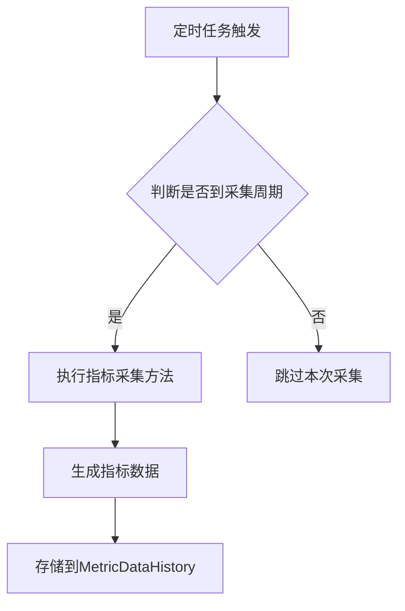
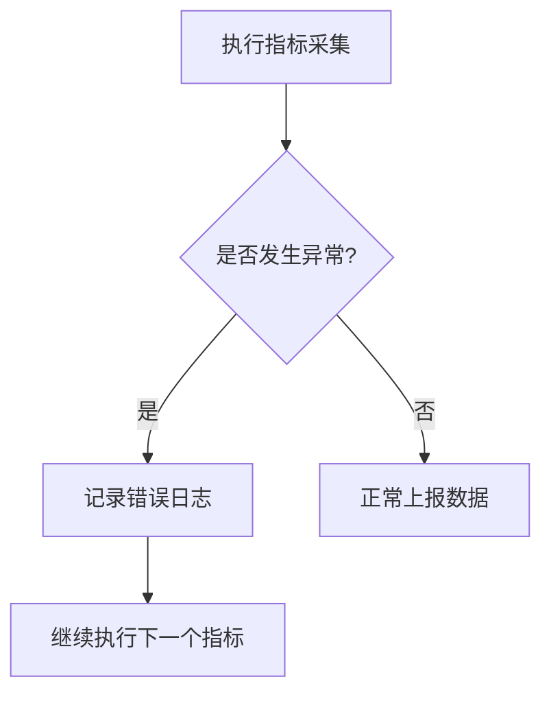
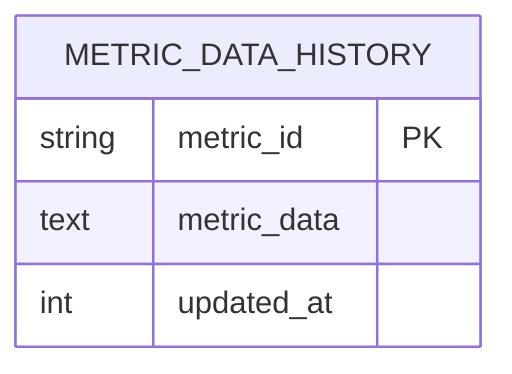
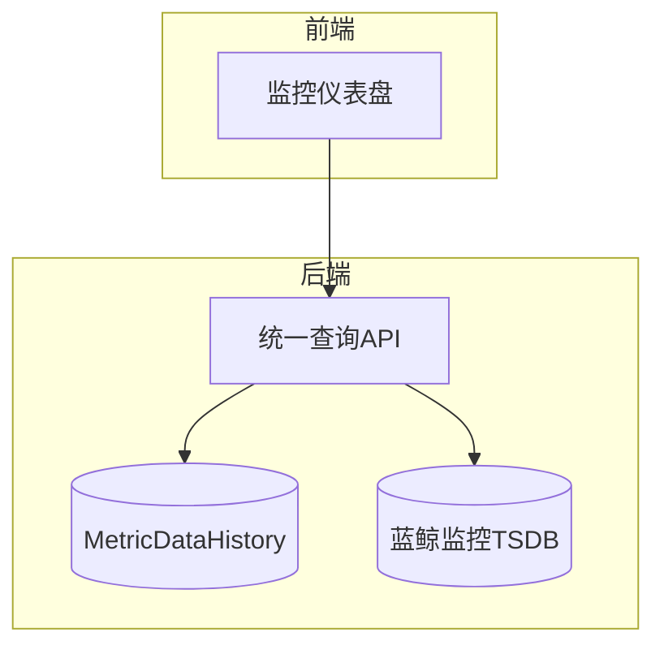

# 监控指标

<cite>
**本文档中引用的文件**  
- [log_clustering.py](file://bklog/apps/log_measure/handlers/metric_collectors/log_clustering.py)
- [metric.py](file://bklog/bk_monitor/utils/metric.py)
- [report.py](file://bklog/apps/log_measure/tasks/report.py)
- [models.py](file://bklog/apps/log_measure/models.py)
- [metric_collectors/log_databus.py](file://bklog/apps/log_measure/handlers/metric_collectors/log_databus.py)
- [metric_collectors/cluster.py](file://bklog/apps/log_measure/handlers/metric_collectors/cluster.py)
- [metric_collectors/user.py](file://bklog/apps/log_measure/handlers/metric_collectors/user.py)
- [metric_collectors/business.py](file://bklog/apps/log_measure/handlers/metric_collectors/business.py)
- [metric_collectors/grafana.py](file://bklog/apps/log_measure/handlers/metric_collectors/grafana.py)
- [metric_collectors/log_search.py](file://bklog/apps/log_measure/handlers/metric_collectors/log_search.py)
- [monitor.py](file://bklog/bk_monitor/handler/monitor.py)
- [metric.py](file://bklog/apps/log_measure/utils/metric.py)
- [es.py](file://bklog/apps/log_measure/utils/es.py)
- [log_clustering/models.py](file://bklog/apps/log_clustering/models.py)
- [clustering_monitor.py](file://bklog/apps/log_clustering/handlers/clustering_monitor.py)
</cite>

## 目录
1. [引言](#引言)
2. [聚类监控关键性能指标](#聚类监控关键性能指标)
3. [指标采集机制与数据来源](#指标采集机制与数据来源)
4. [指标计算逻辑与统计周期](#指标计算逻辑与统计周期)
5. [指标异常波动处理](#指标异常波动处理)
6. [指标数据存储结构与访问方式](#指标数据存储结构与访问方式)
7. [监控指标可视化方案](#监控指标可视化方案)
8. [性能优化建议](#性能优化建议)
9. [结论](#结论)

## 引言

本文档详细阐述了聚类监控指标的实现机制，涵盖了从指标定义、采集、存储到可视化和性能优化的完整流程。系统通过定时任务收集聚类任务的关键性能指标（KPI），包括任务执行周期、成功率、失败率、平均耗时和峰值耗时等，并将这些数据上报至监控平台，支持历史数据查询和趋势分析。文档旨在为开发和运维人员提供全面的技术参考。

## 聚类监控关键性能指标

聚类监控系统定义并采集了一系列关键性能指标（KPI），用于衡量聚类任务的健康状况和执行效率。

### 任务执行周期

任务执行周期指聚类任务从开始到结束所经历的时间。该指标通过定时任务的调度周期来定义，目前系统支持多种时间粒度，如每分钟、每5分钟、每10分钟等。例如，`ClusteringMetricCollector` 类中的 `clustering_count` 方法被配置为每5分钟执行一次。

### 成功率与失败率

成功率和失败率通过监控任务的执行状态来计算。系统在任务执行完成后，会根据执行结果（成功或失败）更新相应的计数器。例如，在 `bk_monitor_report` 任务中，如果任务执行成功，则记录成功日志；如果失败，则记录错误日志并增加失败计数。

### 平均耗时与峰值耗时

平均耗时和峰值耗时是衡量任务性能的重要指标。系统在任务执行过程中记录开始和结束时间戳，计算单次执行的耗时，并在一定统计周期内汇总计算平均值和最大值。例如，在 `collect_metrics` 任务中，通过 `time.time()` 记录任务开始和结束时间，计算耗时并上报。

**Section sources**
- [log_clustering.py](file://bklog/apps/log_measure/handlers/metric_collectors/log_clustering.py#L31-L64)
- [report.py](file://bklog/apps/log_measure/tasks/report.py#L135-L174)
- [monitor.py](file://bklog/bk_monitor/handler/monitor.py#L205-L233)

## 指标采集机制与数据来源

监控指标的采集由一套基于定时任务和指标注册机制的系统完成。

### 采集机制

系统采用基于 Celery 的定时任务框架，通过 `@periodic_task` 和 `@high_priority_periodic_task` 装饰器定义任务的执行频率。核心采集任务 `bk_monitor_collect` 每分钟执行一次，它会遍历所有已注册的指标，并根据指标的 `time_filter` 属性判断是否需要在当前周期执行采集。



**Diagram sources**
- [report.py](file://bklog/apps/log_measure/tasks/report.py#L92-L132)

### 数据来源

指标数据主要来源于以下几个方面：
- **数据库查询**：通过 Django ORM 查询 `ClusteringConfig` 等模型，获取聚类配置和状态信息。
- **外部API调用**：调用蓝鲸监控（BK-Monitor）API、ES（Elasticsearch）集群健康检查API等，获取外部系统的状态数据。
- **内部状态统计**：对系统内部的缓存、队列等进行统计。

**Section sources**
- [log_clustering.py](file://bklog/apps/log_measure/handlers/metric_collectors/log_clustering.py#L35-L40)
- [cluster.py](file://bklog/apps/log_measure/handlers/metric_collectors/cluster.py#L39-L49)
- [metric.py](file://bklog/apps/log_measure/utils/metric.py#L71-L79)

## 指标计算逻辑与统计周期

每个监控指标都有其特定的计算逻辑和统计周期。

### 计算逻辑

指标的计算逻辑封装在具体的 `MetricCollector` 子类中。以 `ClusteringMetricCollector.clustering_count` 为例，其计算逻辑如下：
1.  查询所有 `signature_enable=True` 且 `access_finished=True` 的 `ClusteringConfig` 对象。
2.  按 `bk_biz_id` 分组并计数，生成每个业务的聚类配置数量。
3.  计算所有业务的聚类配置总数。
4.  将结果封装为 `Metric` 对象列表。

```python
metrics.append(
    Metric(
        metric_name="count",
        metric_value=clustering_obj["total"],
        dimensions={
            "bk_biz_id": clustering_obj["bk_biz_id"],
            "bk_biz_name": MetricUtils.get_instance().get_biz_name(clustering_obj["bk_biz_id"]),
        },
        timestamp=MetricUtils.get_instance().report_ts,
    )
)
```

### 统计周期

统计周期由 `@register_metric` 装饰器的 `time_filter` 参数定义，单位为分钟。例如，`TimeFilterEnum.MINUTE5` 表示每5分钟采集一次。系统会根据当前时间与周期的模运算结果来判断是否执行采集。

**Section sources**
- [log_clustering.py](file://bklog/apps/log_measure/handlers/metric_collectors/log_clustering.py#L33-L64)
- [metric.py](file://bklog/bk_monitor/utils/metric.py#L22-L45)

## 指标异常波动处理

系统通过多层次的机制来处理指标异常波动。

### 异常检测

系统本身不直接进行复杂的异常检测算法，而是将原始指标数据上报给蓝鲸监控平台。蓝鲸监控平台具备强大的异常检测能力，可以基于历史数据自动学习基线，并在指标值偏离基线时触发告警。

### 异常处理

当指标采集任务本身出现异常时，系统通过以下方式处理：
- **日志记录**：使用 `logger.exception` 记录详细的错误堆栈，便于问题排查。
- **异常捕获**：在 `collect` 方法中使用 `try...except` 捕获所有异常，防止单个指标的采集失败影响整个任务。
- **重试机制**：依赖 Celery 的任务重试机制，在任务失败后自动重试。



**Section sources**
- [collector.py](file://bklog/bk_monitor/utils/collector.py#L38-L54)
- [report.py](file://bklog/apps/log_measure/tasks/report.py#L169-L173)

## 指标数据存储结构与访问方式

采集到的指标数据被持久化存储，以支持历史查询和趋势分析。

### 存储结构

指标数据主要存储在两个地方：
1.  **MetricDataHistory 模型**：这是核心的存储表，用于存储所有已采集的指标数据。
    - `metric_id` (CharField): 指标的唯一标识符，由 `data_name`, `namespace`, `prefix`, `sub_type` 拼接而成。
    - `metric_data` (TextField): 存储指标数据的 JSON 序列化字符串，包含具体的指标值、维度和时间戳。
    - `updated_at` (IntegerField): 指标数据产生的时间戳（秒）。

2.  **蓝鲸监控平台**：通过 `bk_monitor_client.custom_report` 接口，将数据上报到蓝鲸监控的时间序列数据库，用于长期存储和高性能查询。



**Diagram sources**
- [models.py](file://bklog/apps/log_measure/models.py#L40-L44)
- [monitor.py](file://bklog/bk_monitor/handler/monitor.py#L225-L230)

### 访问方式

- **内部访问**：通过 Django ORM 查询 `MetricDataHistory` 模型，例如 `MetricDataHistory.objects.filter(metric_id=...)`。
- **外部访问**：通过蓝鲸监控平台提供的统一查询API（`unify_query`）来访问上报的数据，支持灵活的聚合和过滤操作。

**Section sources**
- [models.py](file://bklog/apps/log_measure/models.py#L40-L44)
- [log_databus.py](file://bklog/apps/log_measure/handlers/metric_collectors/log_databus.py#L211-L217)

## 监控指标可视化方案

系统利用 Grafana 作为主要的监控数据可视化工具。

### Grafana 集成

系统通过 `GrafanaMetricCollector` 和 `MonitorGrafanaHandler` 等组件与 Grafana 集成。`MonitorGrafanaHandler.save_to_dashboard` 方法可以将查询配置保存到指定的 Grafana 仪表盘面板中。

### 可视化面板

系统可以创建包含多种图表的实时监控面板，例如：
- **折线图**：展示聚类任务成功率、平均耗时等指标随时间的变化趋势。
- **柱状图**：比较不同业务或不同聚类配置的指标值。
- **仪表盘**：直观显示关键指标的当前值。



**Diagram sources**
- [grafana.py](file://bklog/apps/log_measure/handlers/metric_collectors/grafana.py#L33-L51)
- [monitor.py](file://bklog/apps/grafana/handlers/monitor.py#L7-L38)

## 性能优化建议

为了降低监控系统的存储和计算开销，可以采取以下优化策略。

### 指标采样策略

- **差异化采样周期**：对于变化缓慢的指标（如集群总数），可以设置较长的采集周期（如每小时一次）；对于关键性能指标，则保持较短的周期（如每分钟一次）。
- **按需采集**：通过 `FeatureToggle` 功能开关，可以动态启用或禁用某些非核心指标的采集，减少不必要的开销。

### 数据聚合方法

- **预聚合**：在数据上报前，在应用层进行聚合计算。例如，`ClusteringMetricCollector` 在上报前已经计算好了每个业务的总数，而不是上报所有原始记录。
- **分层存储**：将高精度的原始数据和低精度的聚合数据分开存储。原始数据可以设置较短的保留周期，而聚合数据可以长期保留用于趋势分析。

**Section sources**
- [grafana.py](file://bklog/apps/log_measure/handlers/metric_collectors/grafana.py#L36)
- [log_clustering.py](file://bklog/apps/log_measure/handlers/metric_collectors/log_clustering.py#L57-L63)
- [report.py](file://bklog/apps/log_measure/tasks/report.py#L69-L83)

## 结论

本文档详细介绍了聚类监控指标的完整实现方案。系统通过一套灵活的指标注册和采集框架，能够高效地收集、存储和展示聚类任务的各项关键性能指标。结合蓝鲸监控和 Grafana，为系统的稳定运行提供了有力的保障。未来可以进一步探索更智能的异常检测算法和更精细化的性能优化策略。