# 聚类监控与告警

<cite>
**本文档引用文件**   
- [clustering_monitor.py](file://bklog/apps/log_clustering/handlers/clustering_monitor.py)
- [constants.py](file://bklog/apps/log_clustering/constants.py)
- [models.py](file://bklog/apps/log_clustering/models.py)
- [clustering_monitor_views.py](file://bklog/apps/log_clustering/views/clustering_monitor_views.py)
- [pattern.py](file://bklog/apps/log_clustering/handlers/pattern.py)
- [monitor.py](file://bklog/apps/log_clustering/utils/monitor.py)
- [serializers.py](file://bklog/apps/log_clustering/serializers.py)
- [urls.py](file://bklog/apps/log_clustering/urls.py)
</cite>

## 目录
1. [引言](#引言)
2. [聚类任务运行状态监控机制](#聚类任务运行状态监控机制)
3. [异常模式检测逻辑](#异常模式检测逻辑)
4. [告警规则配置](#告警规则配置)
5. [监控数据可视化展示](#监控数据可视化展示)
6. [监控API接口文档](#监控api接口文档)
7. [监控性能优化建议](#监控性能优化建议)
8. [实际监控案例](#实际监控案例)
9. [结论](#结论)

## 引言

本文档详细阐述了聚类监控与告警功能的实现机制。系统通过智能算法对日志数据进行聚类分析，实时监控任务执行状态，并基于预设规则对异常行为进行检测和告警。文档涵盖了从指标采集、异常检测、告警配置到数据可视化的完整流程，旨在为用户提供全面的技术参考和操作指南。

## 聚类任务运行状态监控机制

聚类任务的运行状态监控机制通过采集和分析关键指标来实现，主要包括任务执行周期、成功率和耗时等。

### 关键指标采集

系统通过`ClusteringMonitorHandler`类实现对聚类任务关键指标的采集。该类通过与监控平台API交互，获取并上报任务的执行状态。

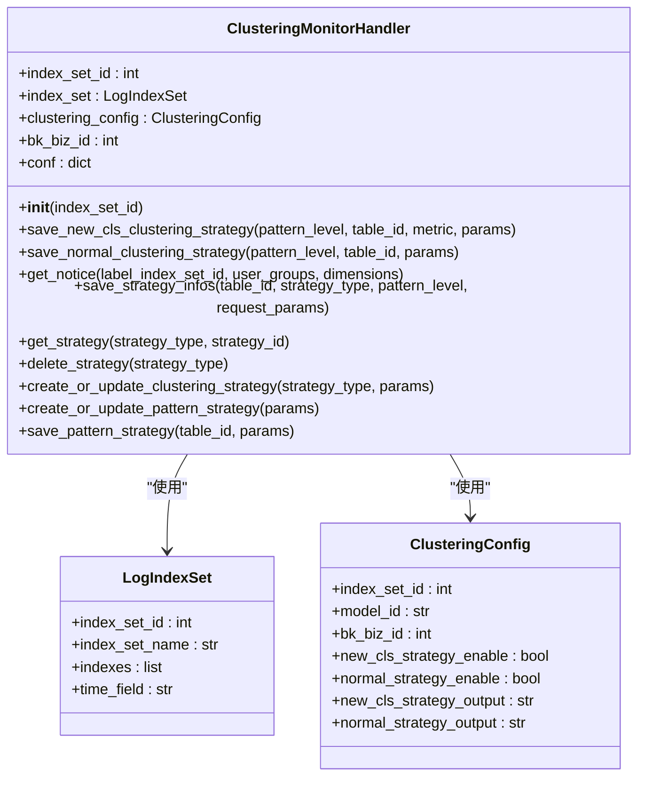

**Diagram sources**
- [clustering_monitor.py](file://bklog/apps/log_clustering/handlers/clustering_monitor.py#L68-L615)
- [models.py](file://bklog/apps/log_clustering/models.py#L106-L172)

**Section sources**
- [clustering_monitor.py](file://bklog/apps/log_clustering/handlers/clustering_monitor.py#L68-L615)

### 指标展示

采集到的指标通过Grafana仪表盘进行可视化展示。系统定期收集监控数据并上报，确保指标的实时性和准确性。

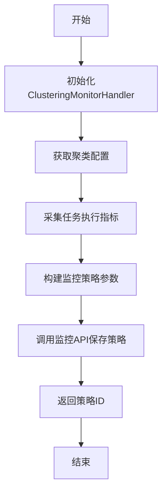

**Diagram sources**
- [clustering_monitor.py](file://bklog/apps/log_clustering/handlers/clustering_monitor.py#L85-L341)

## 异常模式检测逻辑

异常模式检测逻辑是聚类监控系统的核心功能，主要通过识别新出现的日志模式和异常行为增长趋势来实现。

### 新类异常检测

新类异常检测通过比较当前时间段内出现的新日志模式与历史数据，识别出异常的新类。系统使用`PatternHandler`类实现该功能。

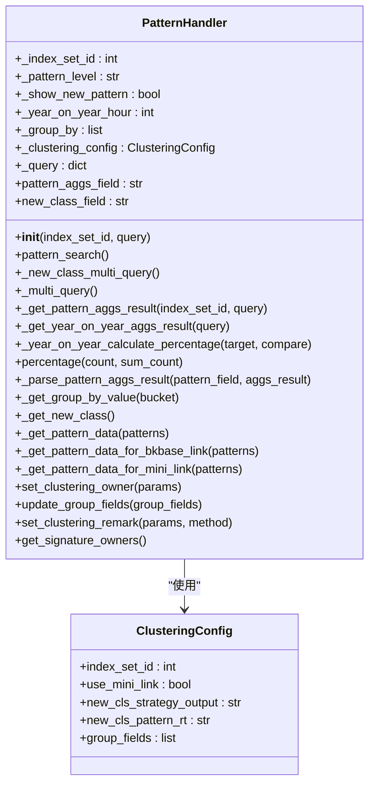

**Diagram sources**
- [pattern.py](file://bklog/apps/log_clustering/handlers/pattern.py#L71-L669)
- [models.py](file://bklog/apps/log_clustering/models.py#L106-L127)

**Section sources**
- [pattern.py](file://bklog/apps/log_clustering/handlers/pattern.py#L71-L669)

### 数量突增异常检测

数量突增异常检测通过监控日志数量的异常增长趋势来识别潜在问题。系统使用智能检测算法分析日志数量的变化。

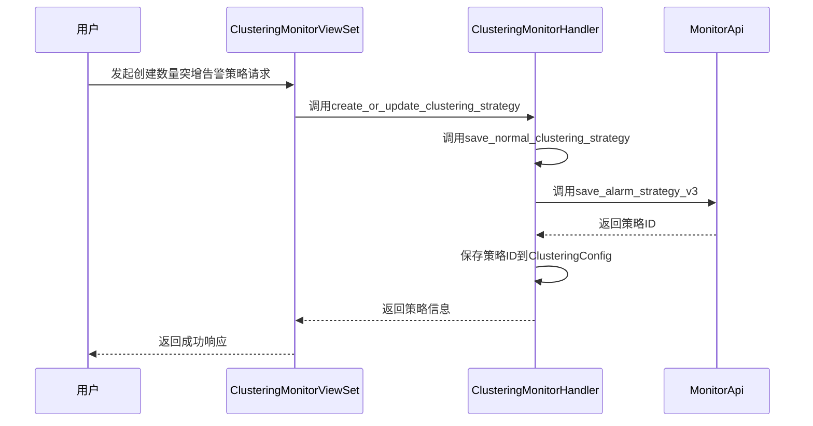

**Diagram sources**
- [clustering_monitor_views.py](file://bklog/apps/log_clustering/views/clustering_monitor_views.py#L148-L170)
- [clustering_monitor.py](file://bklog/apps/log_clustering/handlers/clustering_monitor.py#L177-L262)

## 告警规则配置

告警规则配置允许用户根据业务需求自定义告警策略，包括阈值设置、通知方式和告警级别等。

### 告警级别

系统支持三种告警级别，通过`StrategiesAlarmLevelEnum`枚举类定义：

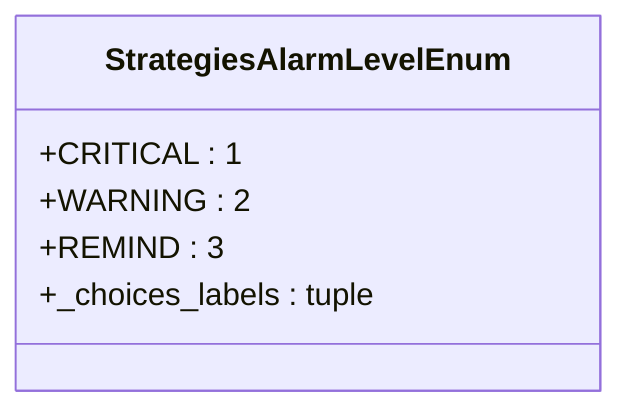

**Diagram sources**
- [constants.py](file://bklog/apps/log_clustering/constants.py#L202-L211)

### 告警策略类型

系统支持两种主要的告警策略类型：

1. **新类异常告警 (new_cls_strategy)**：检测新出现的日志模式
2. **数量突增异常告警 (normal_strategy)**：检测日志数量的异常增长

```python
class StrategiesType:
    NEW_CLS_strategy = "new_cls_strategy"
    NORMAL_STRATEGY = "normal_strategy"
```

### 告警通知配置

告警通知配置包括通知组、通知方式和通知模板等。系统通过`MonitorUtils`类管理通知组的创建和维护。

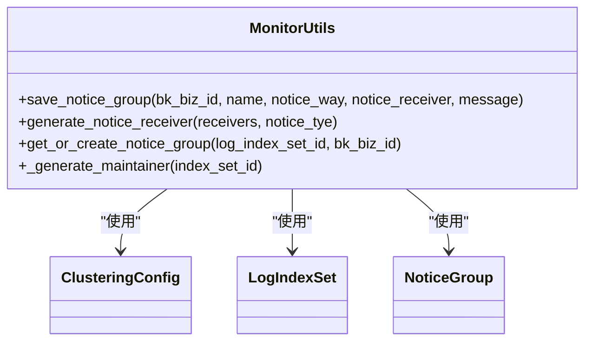

**Diagram sources**
- [monitor.py](file://bklog/apps/log_clustering/utils/monitor.py#L38-L89)
- [models.py](file://bklog/apps/log_clustering/models.py#L264-L268)

## 监控数据可视化展示

监控数据通过多种可视化方式展示，帮助用户直观地理解系统状态和异常情况。

### 模式分布热力图

模式分布热力图展示不同日志模式的分布情况和出现频率。系统通过聚合查询获取模式数据，并计算其占比。

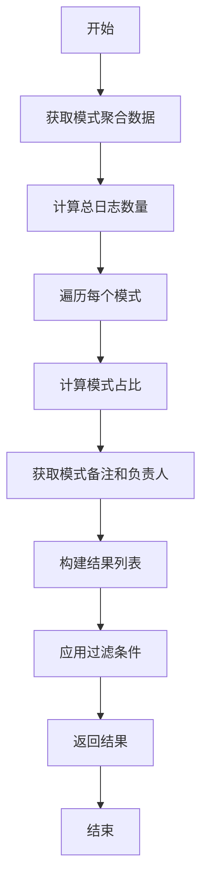

**Diagram sources**
- [pattern.py](file://bklog/apps/log_clustering/handlers/pattern.py#L85-L232)

### 异常趋势曲线图

异常趋势曲线图展示异常事件随时间的变化趋势。系统通过时间序列分析生成趋势数据。

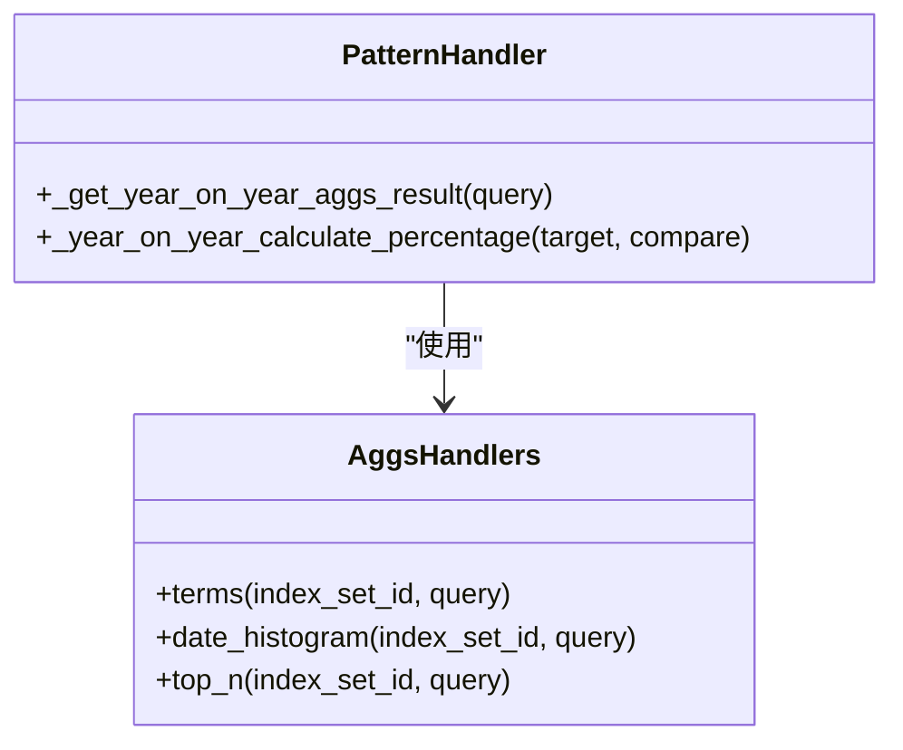

**Diagram sources**
- [pattern.py](file://bklog/apps/log_clustering/handlers/pattern.py#L319-L335)
- [search/aggs_handlers.py](file://bklog/apps/log_search/handlers/search/aggs_handlers.py)

## 监控API接口文档

系统提供RESTful API接口，支持外部系统集成监控数据。

### API路由配置

API路由通过Django REST framework的routers进行配置：

```python
router = routers.DefaultRouter(trailing_slash=True)
router.register(r"pattern", PatternViewSet, basename="pattern_set")
router.register(r"report", ReportViewSet, basename="report")
router.register(r"clustering_config", ClusteringConfigViewSet, basename="clustering_config")
router.register(r"clustering_monitor", ClusteringMonitorViewSet, basename="clustering_monitor")
router.register(r"regex_template", RegexTemplateViewSet, basename="regex_template")
```

**Section sources**
- [urls.py](file://bklog/apps/log_clustering/urls.py#L32-L37)

### 主要API接口

#### 获取告警策略信息

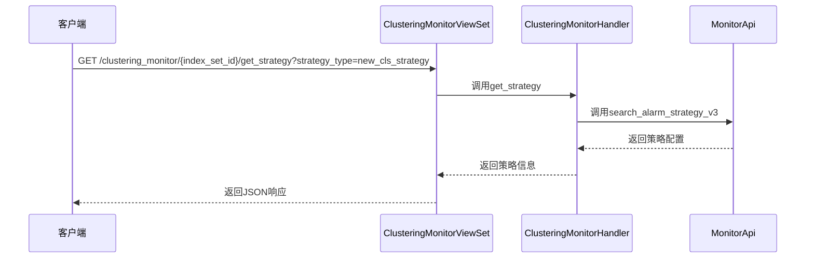

**Diagram sources**
- [clustering_monitor_views.py](file://bklog/apps/log_clustering/views/clustering_monitor_views.py#L89-L123)
- [clustering_monitor.py](file://bklog/apps/log_clustering/handlers/clustering_monitor.py#L343-L368)

#### 创建或更新新类告警策略

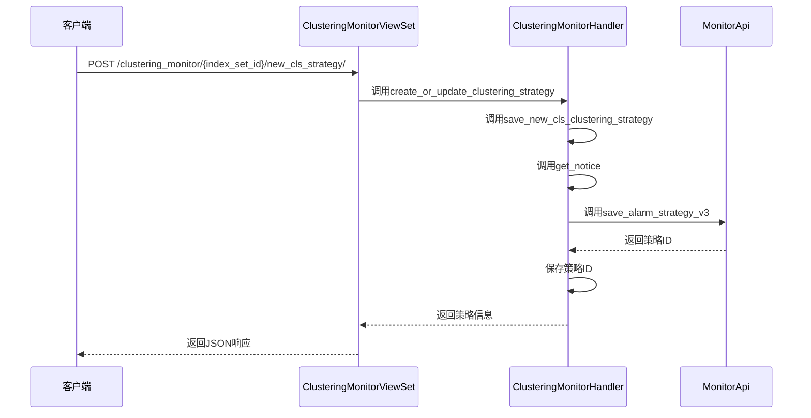

**Diagram sources**
- [clustering_monitor_views.py](file://bklog/apps/log_clustering/views/clustering_monitor_views.py#L125-L146)
- [clustering_monitor.py](file://bklog/apps/log_clustering/handlers/clustering_monitor.py#L85-L175)

## 监控性能优化建议

为确保监控系统的高效运行，提供以下性能优化建议：

### 减少监控数据存储开销

1. **合理设置数据保留周期**：根据业务需求配置合适的数据保留时间，避免存储过多历史数据。
2. **优化索引策略**：使用合适的索引字段和分片策略，提高查询效率。
3. **数据压缩**：启用数据压缩功能，减少存储空间占用。

### 提高告警响应速度

1. **优化查询性能**：通过缓存常用查询结果和优化查询语句，减少响应时间。
2. **异步处理**：将耗时的操作（如通知发送）放入异步任务队列，避免阻塞主流程。
3. **合理设置告警检查窗口**：根据业务特点调整告警检查窗口大小，平衡响应速度和误报率。

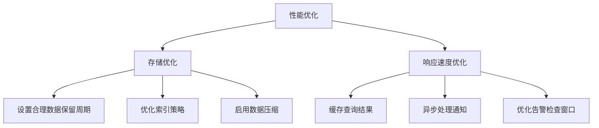

## 实际监控案例

以下是一个实际的监控案例，展示如何通过监控系统及时发现系统异常。

### 案例背景

某业务系统在凌晨2点开始出现大量错误日志，传统监控方式未能及时发现此问题。

### 监控过程

1. **异常检测**：聚类系统检测到大量新的错误日志模式出现。
2. **告警触发**：系统根据预设的告警规则，触发"新类异常告警"。
3. **通知发送**：通过企业微信通知值班人员。
4. **问题定位**：值班人员通过监控仪表盘查看异常趋势和日志示例，快速定位问题。

### 案例结果

通过聚类监控系统，值班人员在异常发生后5分钟内收到告警，比传统监控方式提前了45分钟，有效减少了故障影响时间。

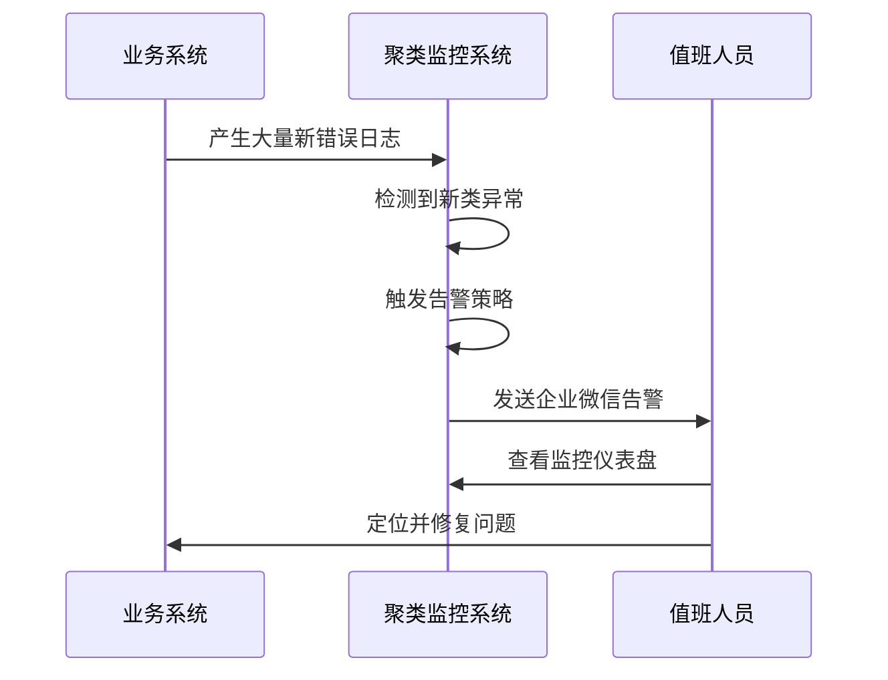

## 结论

聚类监控与告警系统通过智能算法和实时数据分析，为日志监控提供了强大的支持。系统不仅能够及时发现异常模式和数量突增，还能通过灵活的告警配置和丰富的可视化展示，帮助运维人员快速响应和处理问题。通过合理的性能优化，系统能够在保证监控效果的同时，降低资源消耗，提高响应速度。实际案例证明，该系统能够显著提升故障发现和处理的效率，为业务稳定运行提供有力保障。