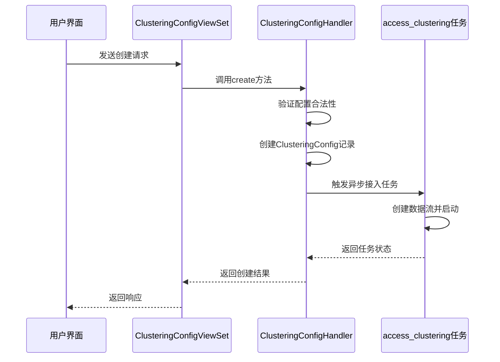
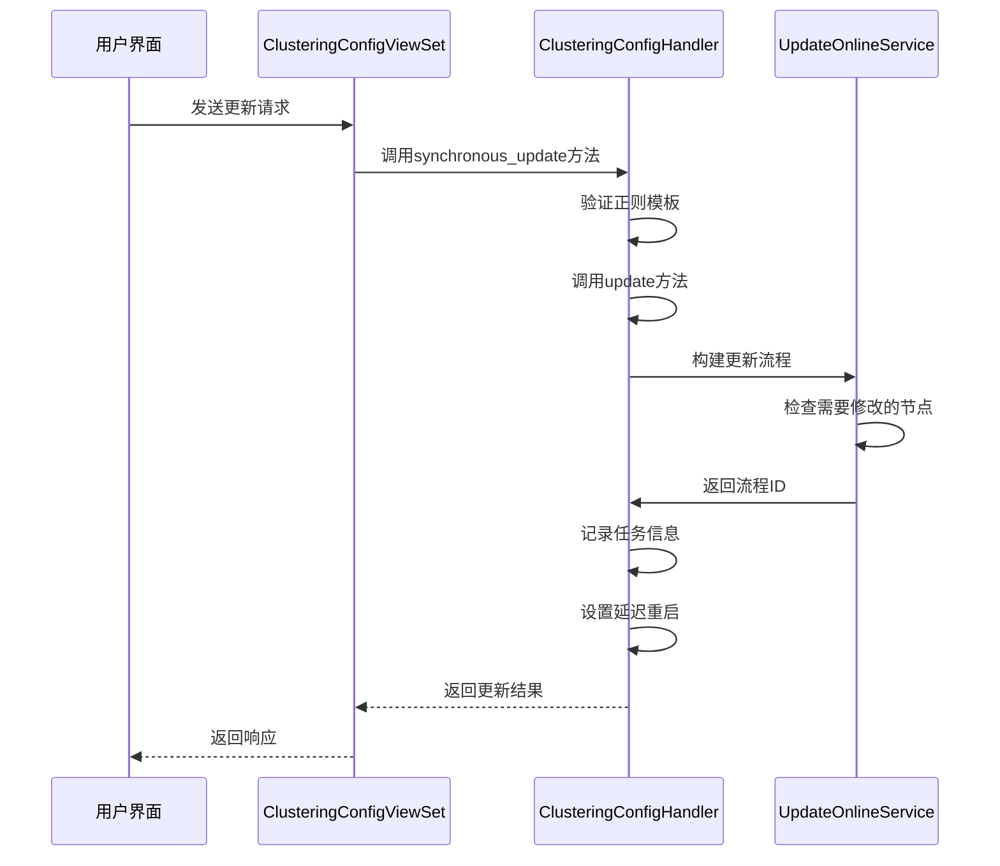
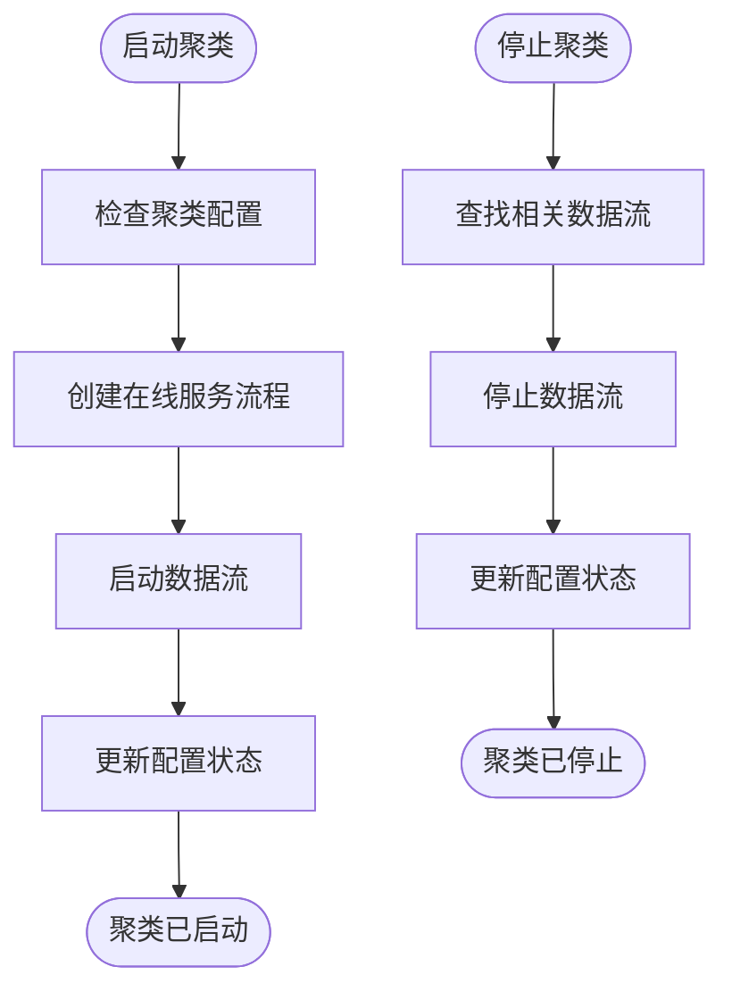
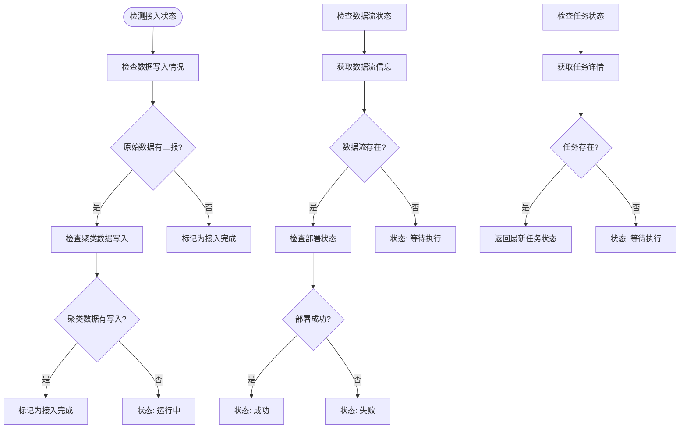
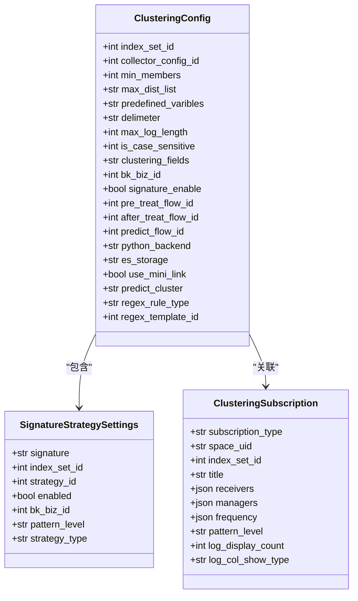
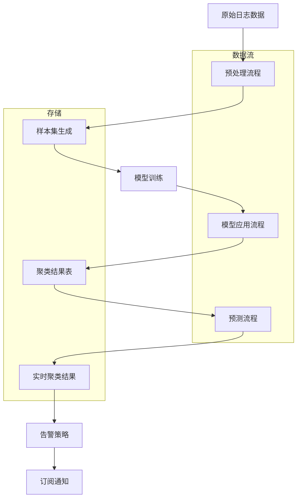
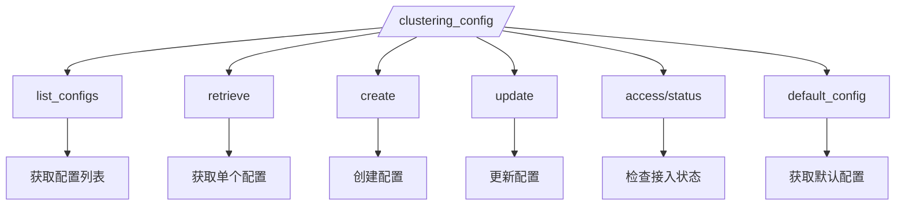

# 聚类配置管理

<cite>
**本文档引用文件**   
- [models.py](file://bklog/apps/log_clustering/models.py)
- [serializers.py](file://bklog/apps/log_clustering/serializers.py)
- [clustering_config.py](file://bklog/apps/log_clustering/handlers/clustering_config.py)
- [dataflow_handler.py](file://bklog/apps/log_clustering/handlers/dataflow/dataflow_handler.py)
- [clustering_config_views.py](file://bklog/apps/log_clustering/views/clustering_config_views.py)
- [constants.py](file://bklog/apps/log_clustering/constants.py)
- [dataflow/constants.py](file://bklog/apps/log_clustering/handlers/dataflow/constants.py)
- [mini_link.py](file://bklog/apps/log_clustering/handlers/mini_link.py)
- [urls.py](file://bklog/apps/log_clustering/urls.py)
</cite>

## 目录
1. [简介](#简介)
2. [聚类配置操作流程](#聚类配置操作流程)
3. [核心配置项详解](#核心配置项详解)
4. [ClusteringConfig模型字段定义](#clusteringconfig模型字段定义)
5. [配置与数据流关联机制](#配置与数据流关联机制)
6. [配置管理API接口文档](#配置管理api接口文档)
7. [配置最佳实践](#配置最佳实践)
8. [实际配置案例](#实际配置案例)

## 简介
聚类配置管理功能是日志平台的核心功能之一，用于对日志数据进行智能聚类分析。该功能通过配置不同的参数来控制日志的采样策略、聚类算法、执行周期等，从而实现对海量日志数据的高效处理和分析。聚类配置与数据接入、预处理流程紧密集成，通过数据流（DataFlow）的方式实现自动化处理。

## 聚类配置操作流程

### 创建聚类配置
创建聚类配置是启用日志聚类功能的第一步。系统通过`ClusteringConfigHandler.create()`方法处理创建请求，主要流程如下：

1. **前置检查**：验证索引集是否支持聚类接入，检查是否已存在聚类配置
2. **参数获取**：从请求参数中获取聚类配置项，包括最小日志数量、敏感度、正则表达式等
3. **配置创建**：在数据库中创建`ClusteringConfig`记录，设置初始状态
4. **异步任务**：触发异步任务`access_clustering.delay()`开始数据流创建流程



**Diagram sources**
- [clustering_config_views.py](file://bklog/apps/log_clustering/views/clustering_config_views.py#L147-L176)
- [clustering_config.py](file://bklog/apps/log_clustering/handlers/clustering_config.py#L98-L204)
- [dataflow_handler.py](file://bklog/apps/log_clustering/handlers/dataflow/dataflow_handler.py)

### 修改聚类配置
修改聚类配置通过`ClusteringConfigHandler.update()`方法实现，流程如下：

1. **参数验证**：验证新的配置参数是否合法
2. **流程构建**：构建更新流程的pipeline
3. **任务记录**：记录更新任务ID和时间
4. **延迟重启**：延迟10分钟重启相关数据流



**Diagram sources**
- [clustering_config_views.py](file://bklog/apps/log_clustering/views/clustering_config_views.py#L231-L233)
- [clustering_config.py](file://bklog/apps/log_clustering/handlers/clustering_config.py#L206-L262)
- [dataflow_handler.py](file://bklog/apps/log_clustering/handlers/dataflow/dataflow_handler.py)

### 启停聚类配置
聚类配置的启停通过数据流的启动和停止操作实现：

- **启动**：调用`online_start()`方法，触发在线服务流程
- **停止**：通过数据流管理接口停止相关flow



**Diagram sources**
- [clustering_config.py](file://bklog/apps/log_clustering/handlers/clustering_config.py#L90-L96)
- [dataflow_handler.py](file://bklog/apps/log_clustering/handlers/dataflow/dataflow_handler.py)

### 接入状态检测
通过`get_access_status()`方法检测聚类配置的接入状态，检查三个关键环节：

1. **数据写入**：检查原始数据和聚类数据是否正常写入
2. **数据流状态**：检查相关数据流的运行状态
3. **任务状态**：检查配置创建或更新任务的执行状态



**Diagram sources**
- [clustering_config.py](file://bklog/apps/log_clustering/handlers/clustering_config.py#L280-L373)
- [dataflow_handler.py](file://bklog/apps/log_clustering/handlers/dataflow/dataflow_handler.py#L375-L411)

**Section sources**
- [clustering_config_views.py](file://bklog/apps/log_clustering/views/clustering_config_views.py#L234-L265)
- [clustering_config.py](file://bklog/apps/log_clustering/handlers/clustering_config.py#L280-L373)

## 核心配置项详解

### 采样策略
采样策略控制日志数据的采集和处理方式，主要配置项包括：

- **min_members**：最小日志数量，用于过滤低频日志模式
- **max_dist_list**：敏感度设置，控制聚类的精细程度
- **st_list**：相似度阈值，影响聚类结果的准确性
- **max_log_length**：最大日志长度，限制处理的日志内容长度

### 算法参数
算法参数定义了聚类算法的具体行为：

- **predefined_varibles**：预先定义的正则表达式，用于日志模式识别
- **delimeter**：分词符，控制日志文本的分割方式
- **depth**：搜索树深度，影响聚类算法的计算复杂度
- **max_child**：搜索树最大子节点数，限制聚类树的规模
- **is_case_sensitive**：是否大小写敏感，影响文本匹配的精确度

### 执行周期
执行周期通过数据流的调度机制实现，系统自动管理以下流程的执行：

- **预处理流程**（pre_treat_flow）：数据清洗和预处理
- **模型应用流程**（after_treat_flow）：应用聚类模型
- **预测流程**（predict_flow）：实时日志聚类预测

### 数据源选择
数据源选择通过索引集（index_set）实现，配置项包括：

- **index_set_id**：索引集ID，标识数据来源
- **collector_config_id**：采集项ID，关联具体的日志采集配置
- **bk_biz_id**：业务ID，确定数据所属的业务范围
- **category_id**：数据分类，用于组织和管理不同类型的日志数据

**Section sources**
- [models.py](file://bklog/apps/log_clustering/models.py#L113-L123)
- [constants.py](file://bklog/apps/log_clustering/constants.py)
- [dataflow/constants.py](file://bklog/apps/log_clustering/handlers/dataflow/constants.py)

## ClusteringConfig模型字段定义

### 模型字段定义
`ClusteringConfig`模型定义了聚类配置的所有字段，以下是关键字段的详细说明：



**Diagram sources**
- [models.py](file://bklog/apps/log_clustering/models.py#L106-L337)

### 关键参数作用
#### pattern_level
`pattern_level`参数定义了聚类的敏感度级别，影响聚类结果的粒度。该参数在`SignatureStrategySettings`和`ClusteringSubscription`模型中都有使用，用于控制：

- 告警策略的触发条件
- 订阅报告的生成范围
- 日志模式的匹配精度

#### python_backend
`python_backend`字段存储模型训练的配置信息，是一个JSON字段，包含：

- 模型训练参数
- 算法配置
- 资源分配设置
- 执行环境配置

该字段用于在Python后端执行聚类算法时提供必要的配置信息。

#### after_treat_flow_id
`after_treat_flow_id`是模型应用流程的ID，用于：

- 标识数据流中的模型应用节点
- 控制模型应用流程的启停
- 监控模型应用流程的执行状态
- 更新模型应用流程的配置

该ID关联到具体的数据流实例，通过数据流API进行管理。

**Section sources**
- [models.py](file://bklog/apps/log_clustering/models.py#L139-L136)
- [constants.py](file://bklog/apps/log_clustering/constants.py)
- [dataflow_handler.py](file://bklog/apps/log_clustering/handlers/dataflow/dataflow_handler.py)

## 配置与数据流关联机制

### 数据流架构
聚类配置与数据流的关联通过多个数据流实现，形成完整的处理链路：



**Diagram sources**
- [dataflow_handler.py](file://bklog/apps/log_clustering/handlers/dataflow/dataflow_handler.py)
- [models.py](file://bklog/apps/log_clustering/models.py)

### 集成方式
#### 数据接入集成
聚类配置与数据接入的集成通过以下方式实现：

1. **索引集关联**：通过`index_set_id`关联到具体的日志索引集
2. **采集项关联**：通过`collector_config_id`关联到具体的采集配置
3. **数据源配置**：通过`log_bk_data_id`指定入库数据源

#### 预处理流程集成
预处理流程的集成通过以下机制实现：

- **预处理流程ID**：`pre_treat_flow_id`字段存储预处理流程的ID
- **流程配置**：`pre_treat_flow`字段存储预处理流程的详细配置
- **自动创建**：在创建聚类配置时自动创建预处理流程

#### 模型应用集成
模型应用流程通过`after_treat_flow_id`和`after_treat_flow`字段与聚类配置关联，实现：

- 模型版本管理
- 流程参数配置
- 执行状态监控
- 异常处理机制

**Section sources**
- [dataflow_handler.py](file://bklog/apps/log_clustering/handlers/dataflow/dataflow_handler.py#L1137-L1149)
- [models.py](file://bklog/apps/log_clustering/models.py#L134-L136)
- [mini_link.py](file://bklog/apps/log_clustering/handlers/mini_link.py)

## 配置管理API接口文档

### API端点
聚类配置管理提供以下API端点：



**Diagram sources**
- [urls.py](file://bklog/apps/log_clustering/urls.py#L35)
- [clustering_config_views.py](file://bklog/apps/log_clustering/views/clustering_config_views.py)

### 请求参数
#### 创建/更新请求参数
| 参数名 | 类型 | 必填 | 描述 |
|-------|------|------|------|
| bk_biz_id | int | 是 | 业务ID |
| clustering_fields | str | 否 | 聚合字段 |
| filter_rules | list | 否 | 过滤规则 |
| min_members | int | 否 | 最小日志数量 |
| predefined_varibles | str | 否 | 预先定义的正则表达式 |
| delimeter | str | 否 | 分词符 |
| max_log_length | int | 否 | 最大日志长度 |
| is_case_sensitive | int | 否 | 是否大小写忽略 |
| new_cls_strategy_enable | bool | 否 | 是否开启新类告警 |
| normal_strategy_enable | bool | 否 | 是否开启数量突增告警 |
| regex_rule_type | str | 否 | 规则类型 |
| regex_template_id | int | 否 | 模板ID |

**Section sources**
- [serializers.py](file://bklog/apps/log_clustering/serializers.py#L96-L111)
- [clustering_config_views.py](file://bklog/apps/log_clustering/views/clustering_config_views.py)

### 响应格式
#### 成功响应
```json
{
    "message": "",
    "code": 0,
    "data": {
        "collector_config_id": 1,
        "collector_config_name_en": "test",
        "index_set_id": 1,
        "min_members": 1,
        "max_dist_list": "0.1,0.2,0.3,0.4,0.5",
        "predefined_varibles": "xxx",
        "delimeter": "xx",
        "max_log_length": 1,
        "is_case_sensitive": 1,
        "clustering_fields": "log",
        "bk_biz_id": 1,
        "new_class_strategy_enable": true,
        "normal_strategy_enable": true,
        "filter_rules": [
            {
                "fields_name": "test",
                "op": "=",
                "value": 1,
                "logic_operator": ""
            }
        ]
    },
    "result": true
}
```

#### 接入状态响应
```json
{
    "message": "",
    "code": 0,
    "data": {
        "flow_create": {
            "status": "SUCCESS",
            "message": "步骤完成"
        },
        "flow_run": {
            "status": "FAILED",
            "message": "步骤执行失败，原因: xxx"
        },
        "data_check": {
            "status": "PENDING",
            "message": "等待执行"
        }
    },
    "result": true
}
```

### 错误码
| 错误码 | 描述 | 可能原因 |
|-------|------|--------|
| 001 | 聚类未开放 | 聚类功能未启用 |
| 005 | 聚类配置不存在 | 指定的配置ID不存在 |
| 006 | 告警策略错误 | 配置关联的告警策略异常 |
| 007 | 索引集不存在 | 指定的索引集ID不存在 |
| 009 | 落地存储不存在 | 计算平台存储配置缺失 |
| 010 | Flow返回异常 | 数据流操作失败 |
| 011 | 正则表达式字段名不符合标准 | 字段名包含非法字符 |

**Section sources**
- [exceptions.py](file://bklog/apps/log_clustering/exceptions.py#L36-L68)
- [clustering_config_views.py](file://bklog/apps/log_clustering/views/clustering_config_views.py)

## 配置最佳实践

### 采样率调整
根据日志量级调整采样率的最佳实践：

- **高流量场景**（>10万条/分钟）：
  - 提高`min_members`值（建议5-10）
  - 使用较低的敏感度（`max_dist_list`取值0.3-0.5）
  - 增加`max_log_length`限制（建议1024-2048）

- **中等流量场景**（1-10万条/分钟）：
  - `min_members`设置为2-5
  - 敏感度适中（`max_dist_list`取值0.2-0.4）
  - `max_log_length`设置为512-1024

- **低流量场景**（<1万条/分钟）：
  - `min_members`可设置为1
  - 使用高敏感度（`max_dist_list`取值0.1-0.3）
  - `max_log_length`可根据需要设置

### 聚类算法参数选择
#### 正则表达式配置
- **自定义规则**：适用于特定业务场景，需要精确控制匹配模式
- **模板规则**：适用于通用场景，可复用预定义的正则模板

#### 分词符选择
- **空格分词**：适用于标准格式日志
- **特殊字符分词**：如`|`、`,`等，适用于特定格式日志
- **正则分词**：使用正则表达式进行复杂分词

#### 搜索树参数
- **depth**：一般设置为5-7，过深会导致计算复杂度指数级增长
- **max_child**：根据数据特征设置，一般为50-200

### 性能优化建议
- **索引优化**：确保聚类字段有适当的索引
- **资源分配**：根据数据量合理分配计算资源
- **缓存策略**：利用缓存减少重复计算
- **批处理**：适当增加批处理大小以提高吞吐量

**Section sources**
- [models.py](file://bklog/apps/log_clustering/models.py)
- [dataflow/constants.py](file://bklog/apps/log_clustering/handlers/dataflow/constants.py)
- [clustering_config.py](file://bklog/apps/log_clustering/handlers/clustering_config.py)

## 实际配置案例

### 通用日志聚类配置
适用于大多数业务场景的通用配置：

```json
{
    "min_members": 3,
    "max_dist_list": "0.2,0.3,0.4",
    "st_list": "0.2,0.3,0.4",
    "predefined_varibles": "\\d+|\\w+|http://[^\\s]+",
    "delimeter": " ",
    "max_log_length": 1024,
    "is_case_sensitive": 0,
    "clustering_fields": "log",
    "new_cls_strategy_enable": true,
    "normal_strategy_enable": true,
    "regex_rule_type": "customize"
}
```

### 高性能场景配置
适用于高流量、高性能要求的场景：

```json
{
    "min_members": 5,
    "max_dist_list": "0.4,0.5",
    "st_list": "0.4,0.5",
    "predefined_varibles": "\\d+|ERROR|WARN|INFO",
    "delimeter": "|",
    "max_log_length": 512,
    "is_case_sensitive": 1,
    "clustering_fields": "log",
    "new_cls_strategy_enable": true,
    "normal_strategy_enable": false,
    "use_mini_link": true,
    "predict_cluster": "high_performance"
}
```

### 精细分析场景配置
适用于需要精细分析的低流量场景：

```json
{
    "min_members": 1,
    "max_dist_list": "0.1,0.15,0.2,0.25,0.3",
    "st_list": "0.1,0.15,0.2,0.25,0.3",
    "predefined_varibles": "\\d+|\\w+|http://[^\\s]+|\"[^\"]*\"|'[^']*'",
    "delimeter": " ",
    "max_log_length": 2048,
    "is_case_sensitive": 0,
    "clustering_fields": "log",
    "new_cls_strategy_enable": true,
    "normal_strategy_enable": true,
    "depth": 7,
    "max_child": 150
}
```

**Section sources**
- [models.py](file://bklog/apps/log_clustering/models.py)
- [dataflow/constants.py](file://bklog/apps/log_clustering/handlers/dataflow/constants.py)
- [mini_link.py](file://bklog/apps/log_clustering/handlers/mini_link.py)