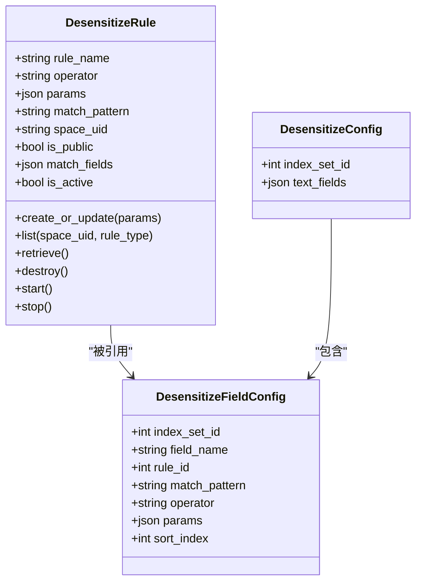
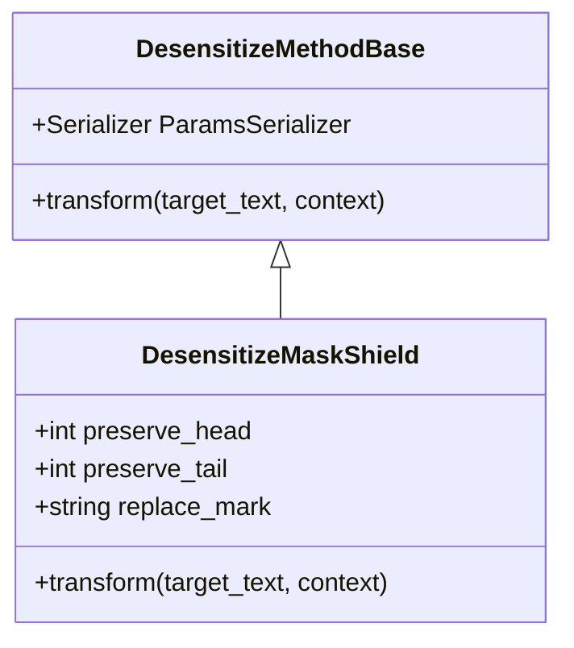
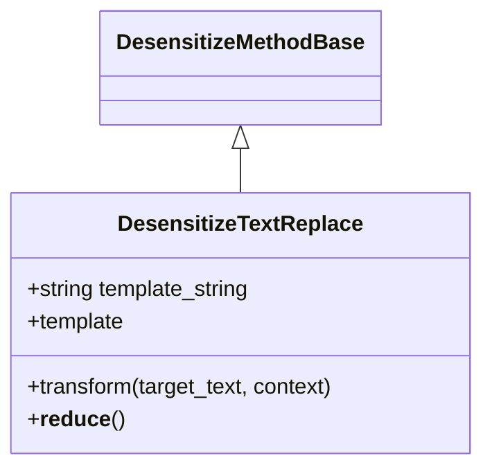
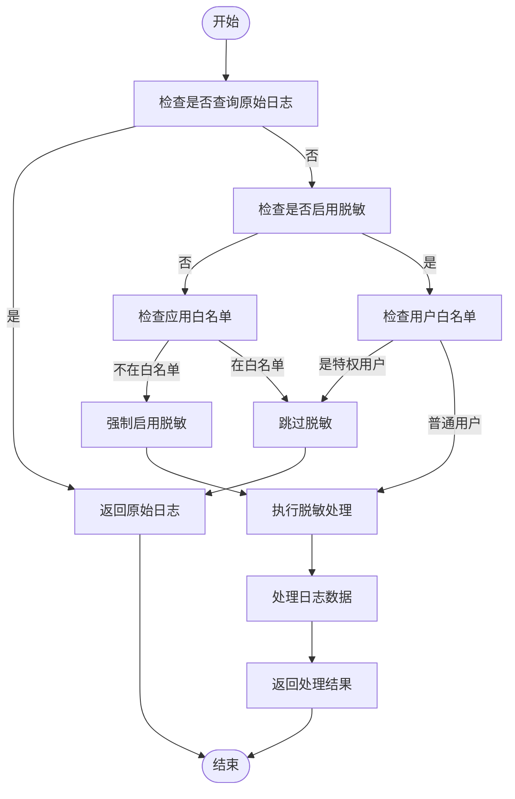
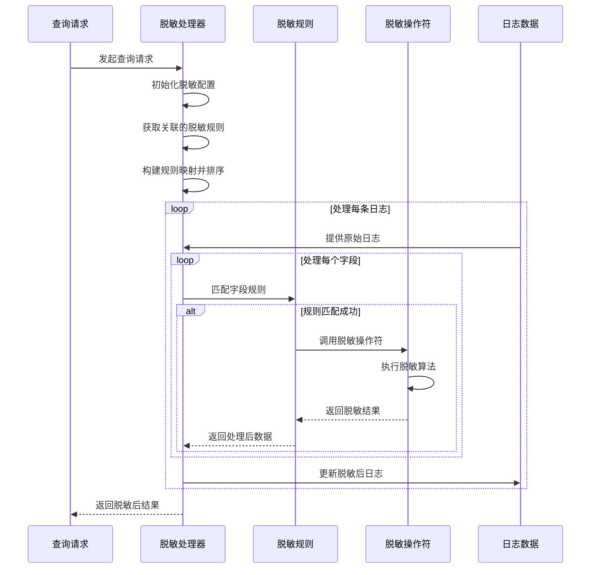

# 日志脱敏

<cite>
**本文档引用的文件**   
- [desensitize.py](file://bklog/apps/log_desensitize/handlers/desensitize.py)
- [models.py](file://bklog/apps/log_desensitize/models.py)
- [constants.py](file://bklog/apps/log_desensitize/constants.py)
- [desensitize_rule_views.py](file://bklog/apps/log_desensitize/views/desensitize_rule_views.py)
- [serializers.py](file://bklog/apps/log_desensitize/serializers.py)
- [mask_shield.py](file://bklog/apps/log_desensitize/handlers/desensitize_operator/mask_shield.py)
- [text_replace.py](file://bklog/apps/log_desensitize/handlers/desensitize_operator/text_replace.py)
- [search_handlers_esquery.py](file://bklog/apps/log_search/handlers/search/search_handlers_esquery.py)
</cite>

## 目录
1. [简介](#简介)
2. [核心组件](#核心组件)
3. [脱敏规则配置](#脱敏规则配置)
4. [内置脱敏操作符](#内置脱敏操作符)
5. [脱敏执行流程](#脱敏执行流程)
6. [策略优先级与冲突处理](#策略优先级与冲突处理)
7. [实际应用示例](#实际应用示例)
8. [性能影响与安全合规](#性能影响与安全合规)
9. [高吞吐量优化建议](#高吞吐量优化建议)

## 简介
日志脱敏功能旨在保护敏感信息，通过配置化的规则对日志中的敏感数据进行处理。该功能支持多种脱敏算法和执行策略，可在查询阶段对日志数据进行动态脱敏处理。系统提供了完整的规则管理、调试预览和权限控制机制，确保在满足安全合规要求的同时，不影响正常的日志查询和分析工作。

## 核心组件

日志脱敏功能由多个核心组件构成，包括脱敏规则管理、脱敏处理器、脱敏操作符和执行策略控制等模块。这些组件协同工作，实现了灵活可配置的脱敏能力。

**本文档引用的文件**   
- [desensitize.py](file://bklog/apps/log_desensitize/handlers/desensitize.py#L46-L691)
- [models.py](file://bklog/apps/log_desensitize/models.py#L29-L79)
- [desensitize_rule_views.py](file://bklog/apps/log_desensitize/views/desensitize_rule_views.py#L42-L494)

## 脱敏规则配置

脱敏规则是日志脱敏功能的核心配置单元，定义了如何识别和处理敏感数据。每个脱敏规则包含以下关键属性：

- **规则名称**: 脱敏规则的标识名称
- **脱敏算子**: 指定使用的脱敏处理方式
- **脱敏参数**: 算子所需的配置参数
- **匹配模式**: 用于识别敏感数据的正则表达式
- **匹配字段名**: 指定在哪些字段上应用此规则
- **是否启用**: 控制规则的激活状态
- **是否为公共规则**: 定义规则的作用范围

脱敏规则通过`DesensitizeRule`模型进行管理，支持创建、更新、删除和查询等操作。规则可以设置为公共规则（全局生效）或业务规则（特定业务范围内生效），并通过权限控制确保只有授权用户才能管理。



**图表来源**
- [models.py](file://bklog/apps/log_desensitize/models.py#L29-L79)

**本节来源**
- [models.py](file://bklog/apps/log_desensitize/models.py#L29-L79)
- [desensitize.py](file://bklog/apps/log_desensitize/handlers/desensitize.py#L254-L522)
- [desensitize_rule_views.py](file://bklog/apps/log_desensitize/views/desensitize_rule_views.py#L165-L246)

## 内置脱敏操作符

系统提供了多种内置的脱敏操作符，每种操作符实现了不同的数据处理方式。操作符通过工厂模式进行管理，支持灵活扩展。

### 掩码屏蔽操作符

掩码屏蔽操作符通过替换字符的方式对敏感数据进行脱敏处理。该操作符支持以下参数配置：

- **保留前几位**: 指定保留数据开头的字符数量
- **保留后几位**: 指定保留数据末尾的字符数量
- **替换符号**: 指定用于替换的字符（默认为*）

例如，手机号码13234345678可以配置为保留前3位和后3位，中间部分用*替换，结果为132*****678。



**图表来源**
- [mask_shield.py](file://bklog/apps/log_desensitize/handlers/desensitize_operator/mask_shield.py#L30-L78)

### 文本替换操作符

文本替换操作符使用模板引擎对敏感数据进行替换处理。该操作符支持以下配置：

- **替换模板格式**: 使用Jinja2模板语法定义替换格式，支持从正则表达式捕获组中提取数据

例如，可以配置模板字符串为"abc${partNum}defg"，当正则表达式匹配到13234345678并捕获中间的3434时，结果为abc3434defg。



**图表来源**
- [text_replace.py](file://bklog/apps/log_desensitize/handlers/desensitize_operator/text_replace.py#L29-L71)

**本节来源**
- [mask_shield.py](file://bklog/apps/log_desensitize/handlers/desensitize_operator/mask_shield.py#L30-L78)
- [text_replace.py](file://bklog/apps/log_desensitize/handlers/desensitize_operator/text_replace.py#L29-L71)
- [base.py](file://bklog/apps/log_desensitize/handlers/desensitize_operator/base.py#L25-L37)

## 脱敏执行流程

日志脱敏在查询阶段执行，确保原始日志数据保持不变，同时为不同权限的用户提供适当级别的数据访问。

### 执行时机判断

系统在处理查询请求时，首先判断是否需要执行脱敏处理。判断逻辑如下：

1. 如果请求明确要求查询原始日志（original_search=True），则跳过脱敏
2. 检查用户是否属于特权用户白名单，特权用户可查看未脱敏数据
3. 检查应用是否在查询白名单中，白名单应用可查看未脱敏数据
4. 根据配置决定是否启用脱敏



**图表来源**
- [search_handlers_esquery.py](file://bklog/apps/log_search/handlers/search/search_handlers_esquery.py#L1997-L2021)

### 脱敏处理流程

脱敏处理流程采用流水线方式，按照优先级顺序应用多个脱敏规则。主要步骤包括：

1. 根据索引集ID获取关联的脱敏配置
2. 构建字段到规则的映射关系
3. 按优先级对规则进行排序
4. 遍历日志字段，应用匹配的脱敏规则
5. 处理嵌套字段和原文字段的特殊逻辑



**图表来源**
- [desensitize.py](file://bklog/apps/log_desensitize/handlers/desensitize.py#L46-L251)

**本节来源**
- [desensitize.py](file://bklog/apps/log_desensitize/handlers/desensitize.py#L46-L251)
- [search_handlers_esquery.py](file://bklog/apps/log_search/handlers/search/search_handlers_esquery.py#L1997-L2021)

## 策略优先级与冲突处理

系统通过明确的优先级机制处理多个脱敏规则之间的冲突，确保脱敏结果的可预测性和一致性。

### 优先级规则

脱敏规则的执行优先级由`sort_index`字段决定，数值越小优先级越高。当多个规则匹配同一数据时，系统按照优先级顺序依次应用规则。

在规则配置中，系统还考虑了以下优先级因素：

1. 精确字段匹配优先于通配符匹配
2. 公共规则和业务规则的权限优先级
3. 规则启用状态的优先级

### 冲突处理机制

当多个规则匹配同一数据片段时，系统采用以下策略处理冲突：

1. **重叠检测**: 系统会检测匹配结果是否存在重叠，避免同一数据被多次处理
2. **流水线处理**: 按照优先级顺序依次处理，后一个规则处理前一个规则的输出
3. **结果合并**: 将非重叠的匹配结果按位置顺序合并，确保所有匹配都被处理

```mermaid
flowchart TD
Start([开始]) --> FindMatches["查找所有匹配项"]
FindMatches --> SortMatches["按起始位置排序"]
SortMatches --> Initialize["初始化结果列表"]
Initialize --> ProcessFirst["处理第一个匹配"]
ProcessFirst --> SetLastEnd["设置最后结束位置"]
loop 处理剩余匹配
ProcessNext["处理下一个匹配"]
ProcessNext --> CheckOverlap["检查是否重叠"]
CheckOverlap --> |不重叠| AddToResult["添加到结果"]
AddToResult --> UpdateLastEnd["更新最后结束位置"]
CheckOverlap --> |重叠| SkipMatch["跳过当前匹配"]
SkipMatch --> ContinueLoop
UpdateLastEnd --> ContinueLoop
ContinueLoop --> HasMore["还有更多匹配?"]
end
HasMore --> |是| ProcessNext
HasMore --> |否| AddTail["添加末尾剩余文本"]
AddTail --> CombineResult["合并所有片段"]
CombineResult --> ReturnResult["返回脱敏结果"]
style ProcessNext fill:#f9f,stroke:#333,stroke-width:2px
style CheckOverlap fill:#bbf,stroke:#f66,stroke-width:2px,color:#fff
</mermaid>
**图表来源**
- [desensitize.py](file://bklog/apps/log_desensitize/handlers/desensitize.py#L204-L227)
**本节来源**
- [desensitize.py](file://bklog/apps/log_desensitize/handlers/desensitize.py#L110-L117)
- [desensitize.py](file://bklog/apps/log_desensitize/handlers/desensitize.py#L204-L227)
## 实际应用示例
以下是几个典型的脱敏规则配置示例，展示如何为不同业务场景配置合适的脱敏规则。
### 手机号码脱敏
```json
{
  "rule_name": "手机号码脱敏",
  "match_fields": ["phone", "mobile"],
  "match_pattern": "1[3-9]\\d{9}",
  "operator": "mask_shield",
  "params": {
    "preserve_head": 3,
    "preserve_tail": 4,
    "replace_mark": "*"
  },
  "is_active": true
}
```

此规则会匹配手机号码字段中的中国手机号码，并保留前3位和后4位，中间部分用*替换。

### 邮箱地址脱敏

```json
{
  "rule_name": "邮箱地址脱敏",
  "match_fields": ["email", "mail"],
  "match_pattern": "([a-zA-Z0-9._%+-]+)@([a-zA-Z0-9.-]+\\.[a-zA-Z]{2,})",
  "operator": "text_replace",
  "params": {
    "template_string": "${1[0]}***@${2}"
  },
  "is_active": true
}
```

此规则使用文本替换操作符，将邮箱用户名的第一个字符保留，其余部分用*替换。

### 身份证号码脱敏

```json
{
  "rule_name": "身份证号码脱敏",
  "match_fields": ["id_card", "identity"],
  "match_pattern": "\\d{6}(\\d{8})\\d{4}",
  "operator": "mask_shield",
  "params": {
    "preserve_head": 6,
    "preserve_tail": 4,
    "replace_mark": "*"
  },
  "is_active": true
}
```

此规则匹配身份证号码，保留前6位地区码和后4位校验码，中间8位生日信息用*替换。

**本节来源**
- [desensitize.py](file://bklog/apps/log_desensitize/handlers/desensitize.py#L651-L691)
- [desensitize_rule_views.py](file://bklog/apps/log_desensitize/views/desensitize_rule_views.py#L408-L493)

## 性能影响与安全合规

### 性能影响评估

日志脱敏功能对系统性能有一定影响，主要体现在以下几个方面：

1. **CPU开销**: 正则表达式匹配和字符串处理需要消耗CPU资源
2. **内存占用**: 脱敏过程中需要维护规则映射和临时数据结构
3. **查询延迟**: 脱敏处理会增加查询响应时间

性能影响程度取决于：
- 日志数据量大小
- 脱敏规则的复杂度
- 匹配模式的效率
- 并发查询数量

### 安全合规性说明

系统设计遵循以下安全合规原则：

1. **最小权限原则**: 只有授权用户才能创建和管理脱敏规则
2. **数据完整性**: 原始日志数据始终保持不变，脱敏仅在查询时动态应用
3. **审计追踪**: 所有脱敏规则的变更操作都会被记录
4. **白名单机制**: 支持特权用户和应用白名单，确保必要时可查看完整数据
5. **规则隔离**: 公共规则和业务规则相互隔离，避免越权访问

**本节来源**
- [desensitize.py](file://bklog/apps/log_desensitize/handlers/desensitize.py#L22-L691)
- [desensitize_rule_views.py](file://bklog/apps/log_desensitize/views/desensitize_rule_views.py#L49-L91)

## 高吞吐量优化建议

在高吞吐量场景下，为确保脱敏功能的性能和稳定性，建议采取以下优化措施：

### 规则优化

1. **简化正则表达式**: 避免使用复杂的正则模式，减少回溯
2. **合理设置优先级**: 将最常用的规则设置为高优先级
3. **精确字段匹配**: 尽量指定具体的字段名，减少不必要的匹配尝试
4. **避免重叠规则**: 确保规则之间没有不必要的重叠

### 系统配置

1. **缓存机制**: 对频繁使用的脱敏配置进行缓存
2. **批量处理**: 在可能的情况下，对多条日志进行批量脱敏处理
3. **异步处理**: 对于非实时查询，可考虑异步脱敏处理
4. **资源隔离**: 为脱敏处理分配独立的计算资源

### 监控与调优

1. **性能监控**: 监控脱敏处理的CPU、内存和响应时间
2. **规则审计**: 定期审查脱敏规则的有效性和必要性
3. **负载测试**: 在生产环境部署前进行充分的负载测试
4. **渐进式启用**: 新规则先在小范围内测试，再逐步扩大应用范围

**本节来源**
- [desensitize.py](file://bklog/apps/log_desensitize/handlers/desensitize.py#L46-L251)
- [search_handlers_esquery.py](file://bklog/apps/log_search/handlers/search/search_handlers_esquery.py#L1997-L2021)