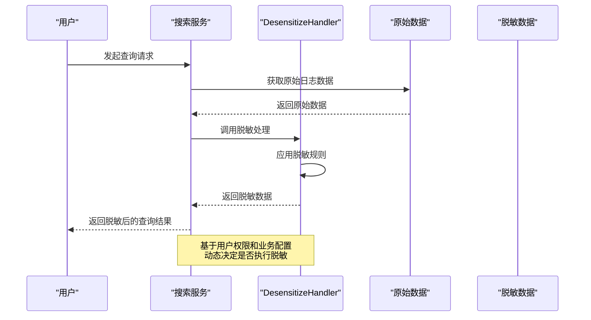
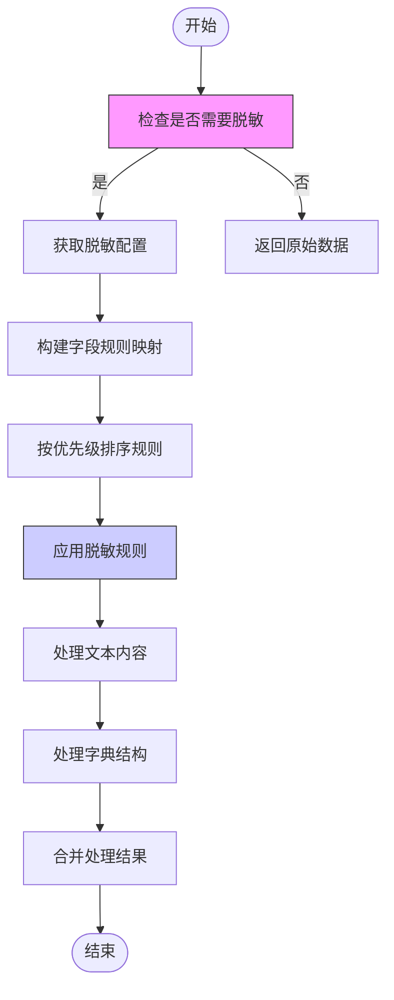
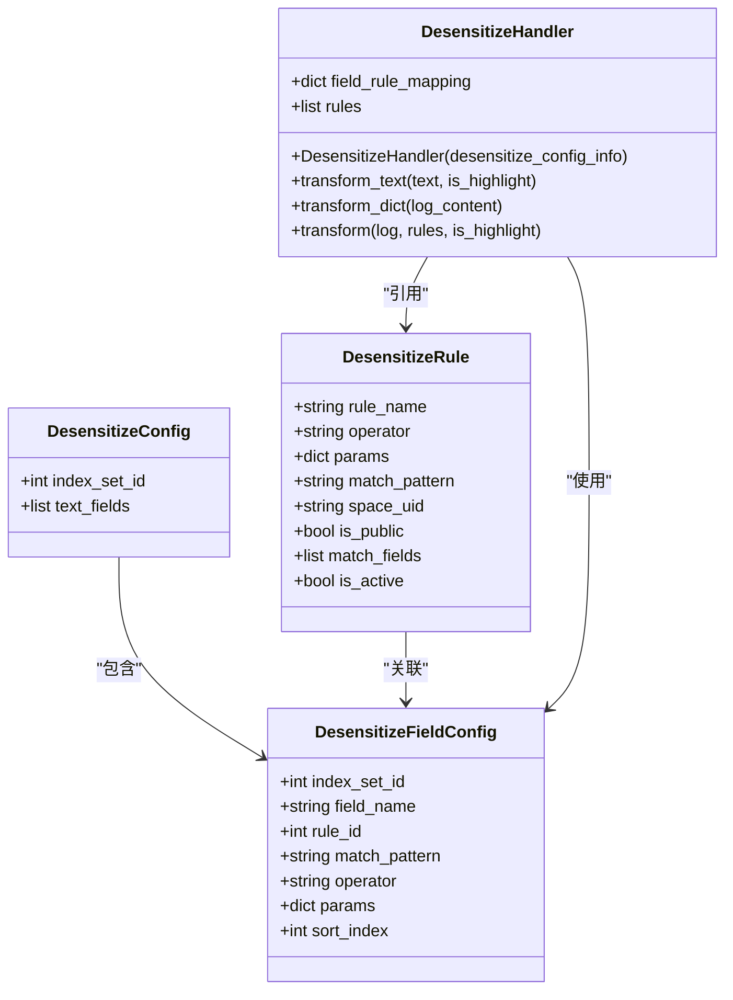
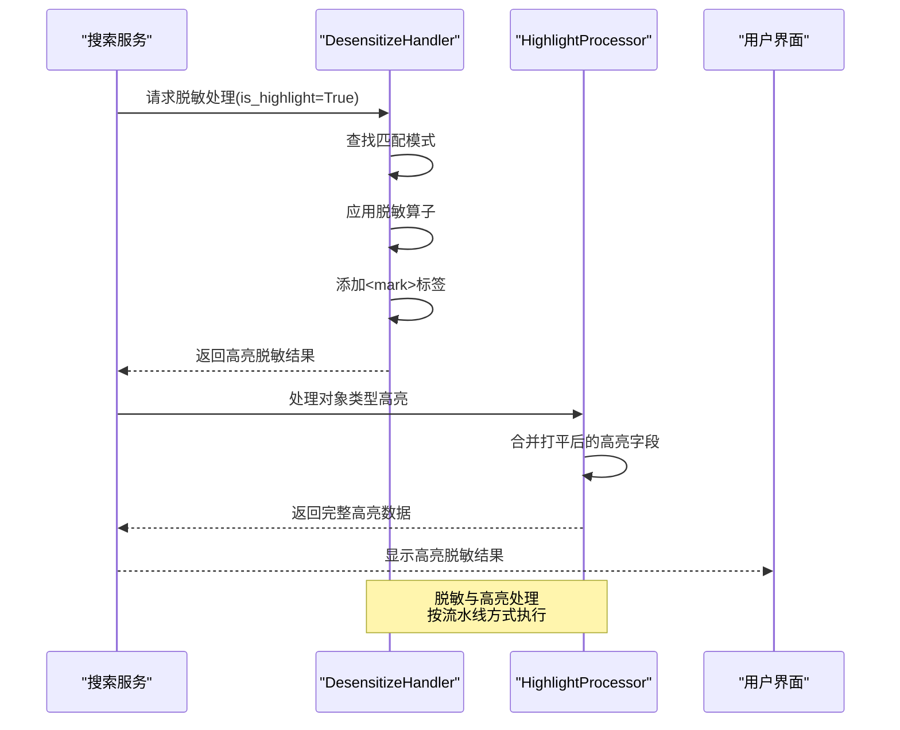
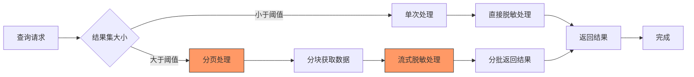
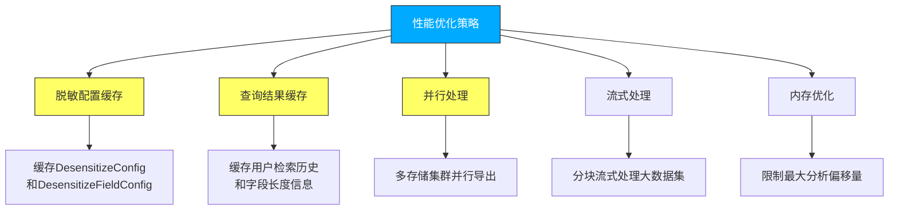
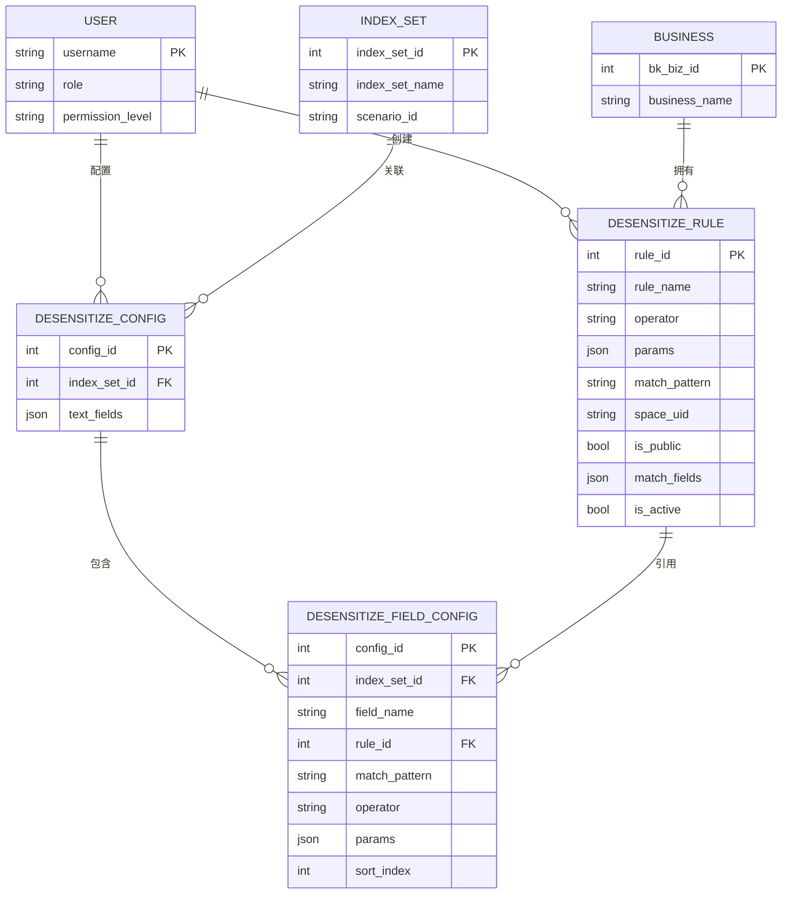

# 查询阶段脱敏流程

<cite>
**本文档引用文件**  
- [desensitize.py](file://bklog/apps/log_desensitize/handlers/desensitize.py)
- [base.py](file://bklog/apps/log_unifyquery/handler/base.py)
- [models.py](file://bklog/apps/log_desensitize/models.py)
- [constants.py](file://bklog/apps/log_desensitize/constants.py)
- [utils.py](file://bklog/apps/log_desensitize/utils.py)
- [search_handlers_esquery.py](file://bklog/apps/log_search/handlers/search/search_handlers_esquery.py)
- [async_export.py](file://bklog/apps/log_search/tasks/async_export.py)
- [unify_query_async_export.py](file://bklog/apps/log_search/tasks/unify_query_async_export.py)
- [desensitize_rule_views.py](file://bklog/apps/log_desensitize/views/desensitize_rule_views.py)
</cite>

## 目录
1. [引言](#引言)
2. [查询阶段脱敏机制](#查询阶段脱敏机制)
3. [脱敏处理流程](#脱敏处理流程)
4. [脱敏策略与权限控制](#脱敏策略与权限控制)
5. [高亮显示与脱敏协同](#高亮显示与脱敏协同)
6. [大规模查询处理](#大规模查询处理)
7. [缓存与性能优化](#缓存与性能优化)
8. [实际应用示例](#实际应用示例)
9. [结论](#结论)

## 引言
查询阶段脱敏是在用户查询日志数据时动态执行的敏感信息保护机制。该机制在获取原始数据后、返回用户前进行实时脱敏处理，确保敏感信息不会被未授权用户访问。本文档详细介绍了查询阶段脱敏的实现原理、处理流程、权限控制策略以及性能优化方案。

## 查询阶段脱敏机制

查询阶段脱敏机制通过在搜索服务中集成DesensitizeHandler，在获取原始数据后、返回用户前进行实时脱敏处理。该机制具有高度灵活性，可根据用户权限动态调整脱敏策略。

**图示来源**
- [base.py](file://bklog/apps/log_unifyquery/handler/base.py#L147-L177)
- [desensitize.py](file://bklog/apps/log_desensitize/handlers/desensitize.py#L52-L117)

**本节来源**
- [base.py](file://bklog/apps/log_unifyquery/handler/base.py#L147-L177)
- [desensitize.py](file://bklog/apps/log_desensitize/handlers/desensitize.py#L52-L117)

## 脱敏处理流程

脱敏处理流程包括初始化脱敏配置、构建脱敏规则映射、执行脱敏操作等关键步骤。系统首先检查是否需要进行脱敏，然后根据索引集ID获取相应的脱敏配置，最后应用脱敏规则处理数据。

**图示来源**
- [base.py](file://bklog/apps/log_unifyquery/handler/base.py#L147-L177)
- [desensitize.py](file://bklog/apps/log_desensitize/handlers/desensitize.py#L52-L117)

**本节来源**
- [base.py](file://bklog/apps/log_unifyquery/handler/base.py#L147-L177)
- [desensitize.py](file://bklog/apps/log_desensitize/handlers/desensitize.py#L52-L117)

## 脱敏策略与权限控制

脱敏策略与权限控制机制确保只有授权用户才能查看未脱敏的敏感信息。系统通过多层次的权限检查来决定是否执行脱敏处理，包括应用白名单检查、特权用户检查等。

**图示来源**
- [models.py](file://bklog/apps/log_desensitize/models.py#L29-L80)
- [desensitize.py](file://bklog/apps/log_desensitize/handlers/desensitize.py#L52-L117)

**本节来源**
- [base.py](file://bklog/apps/log_unifyquery/handler/base.py#L527-L547)
- [desensitize.py](file://bklog/apps/log_desensitize/handlers/desensitize.py#L52-L117)
- [models.py](file://bklog/apps/log_desensitize/models.py#L29-L80)

## 高亮显示与脱敏协同

高亮显示功能与脱敏处理协同工作，确保在进行文本高亮的同时正确处理脱敏逻辑。系统能够在高亮匹配内容的同时，对敏感信息进行脱敏处理，提供更好的用户体验。

**图示来源**
- [desensitize.py](file://bklog/apps/log_desensitize/handlers/desensitize.py#L494-L507)
- [base.py](file://bklog/apps/log_unifyquery/handler/base.py#L813-L819)

**本节来源**
- [desensitize.py](file://bklog/apps/log_desensitize/handlers/desensitize.py#L494-L507)
- [base.py](file://bklog/apps/log_unifyquery/handler/base.py#L813-L819)

## 大规模查询处理

针对大规模查询结果集，系统实现了分页处理和流式脱敏策略，确保在处理大量数据时的性能和内存效率。通过分块处理和流式传输，系统能够高效处理海量日志数据的脱敏需求。

**图示来源**
- [async_export.py](file://bklog/apps/log_search/tasks/async_export.py#L424-L448)
- [unify_query_async_export.py](file://bklog/apps/log_search/tasks/unify_query_async_export.py#L553-L568)

**本节来源**
- [search_handlers_esquery.py](file://bklog/apps/log_search/handlers/search/search_handlers_esquery.py#L1335-L1361)
- [async_export.py](file://bklog/apps/log_search/tasks/async_export.py#L424-L448)
- [unify_query_async_export.py](file://bklog/apps/log_search/tasks/unify_query_async_export.py#L553-L568)

## 缓存与性能优化

系统通过多种缓存策略和性能优化技术来提升查询阶段脱敏的效率。包括脱敏配置缓存、查询结果缓存、并行处理等机制，有效降低了脱敏处理的性能开销。

**图示来源**
- [base.py](file://bklog/apps/log_unifyquery/handler/base.py#L57-L58)
- [search_handlers_esquery.py](file://bklog/apps/log_search/handlers/search/search_handlers_esquery.py#L2171-L2188)

**本节来源**
- [base.py](file://bklog/apps/log_unifyquery/handler/base.py#L57-L58)
- [search_handlers_esquery.py](file://bklog/apps/log_search/handlers/search/search_handlers_esquery.py#L2171-L2188)
- [async_export.py](file://bklog/apps/log_search/tasks/async_export.py#L322-L759)

## 实际应用示例

以下示例展示了不同用户角色查询同一数据时的差异化脱敏效果。系统根据用户权限和业务配置，动态调整脱敏策略，确保数据安全的同时提供适当的访问权限。

**图示来源**
- [desensitize_rule_views.py](file://bklog/apps/log_desensitize/views/desensitize_rule_views.py#L49-L91)
- [base.py](file://bklog/apps/log_unifyquery/handler/base.py#L527-L547)

**本节来源**
- [desensitize_rule_views.py](file://bklog/apps/log_desensitize/views/desensitize_rule_views.py#L49-L91)
- [base.py](file://bklog/apps/log_unifyquery/handler/base.py#L527-L547)
- [test_desensitize_handle.py](file://bklog/apps/tests/log_desensitize/test_desensitize_handle.py#L28-L61)

## 结论

查询阶段脱敏流程提供了一种灵活、安全的日志数据保护机制。通过在查询时动态执行脱敏处理，系统能够根据用户权限和业务需求精确控制敏感信息的可见性。该机制具有以下优势：

1. **灵活性高**：支持基于用户权限动态调整脱敏策略
2. **安全性强**：多层次权限检查确保数据安全
3. **性能优化**：通过缓存和流式处理降低性能开销
4. **易于管理**：集中化的脱敏规则配置和管理

未来可进一步优化的方向包括：
- 增强脱敏规则的实时更新能力
- 优化大规模数据集的流式处理性能
- 提供更细粒度的权限控制策略
- 增强脱敏效果的可视化和审计功能