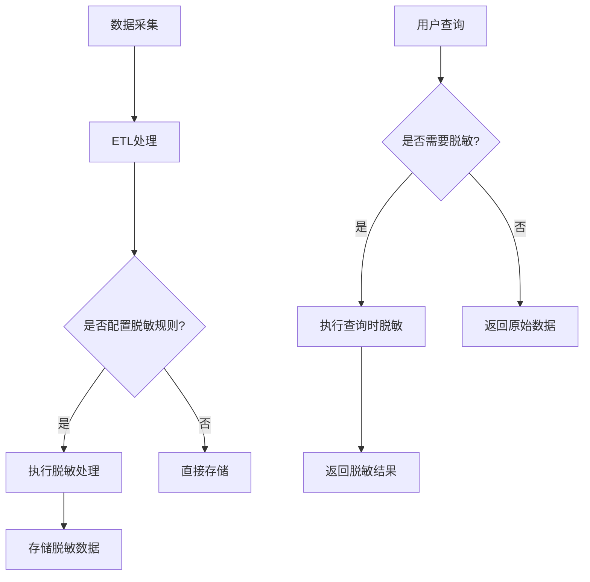
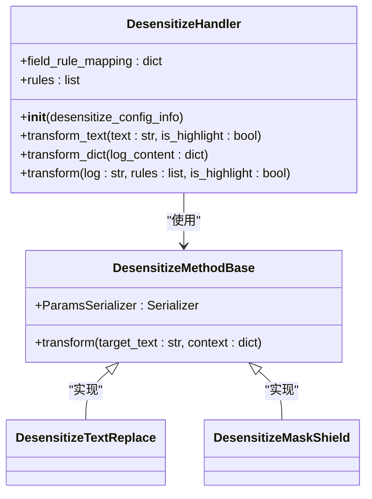
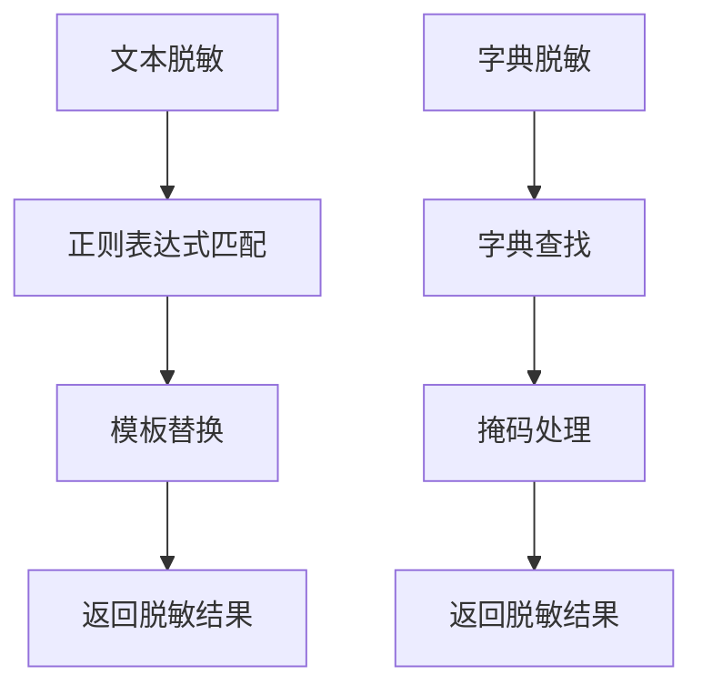
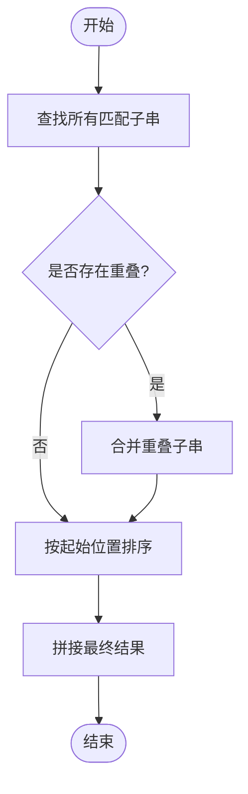
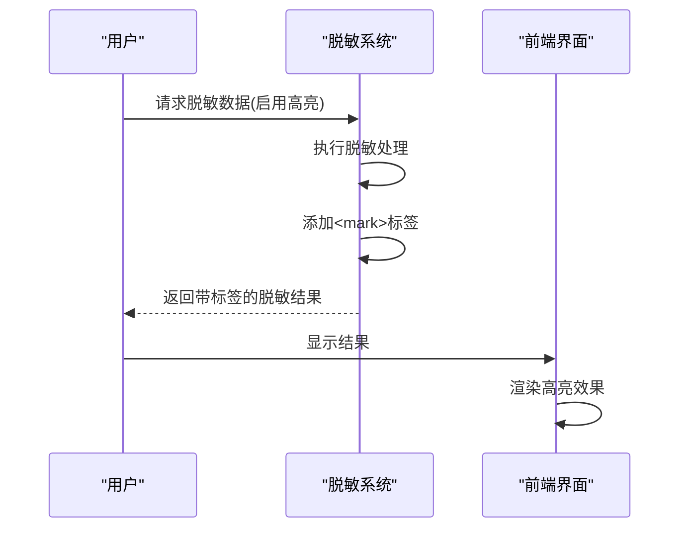
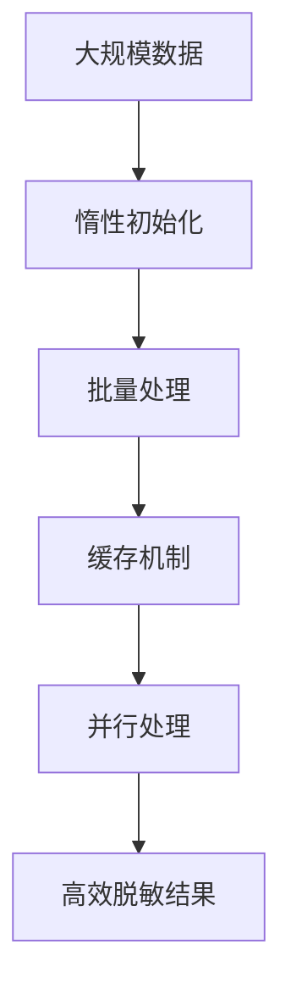
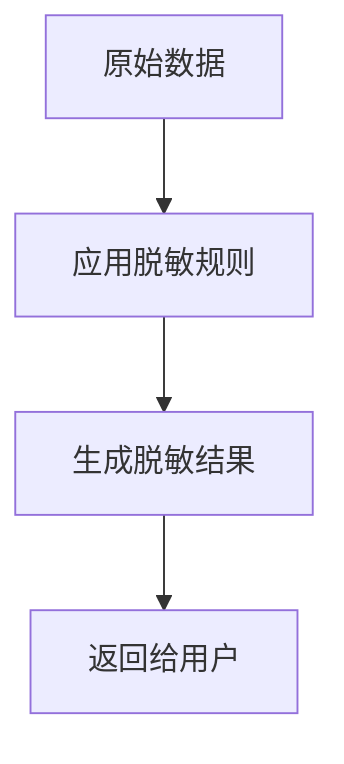
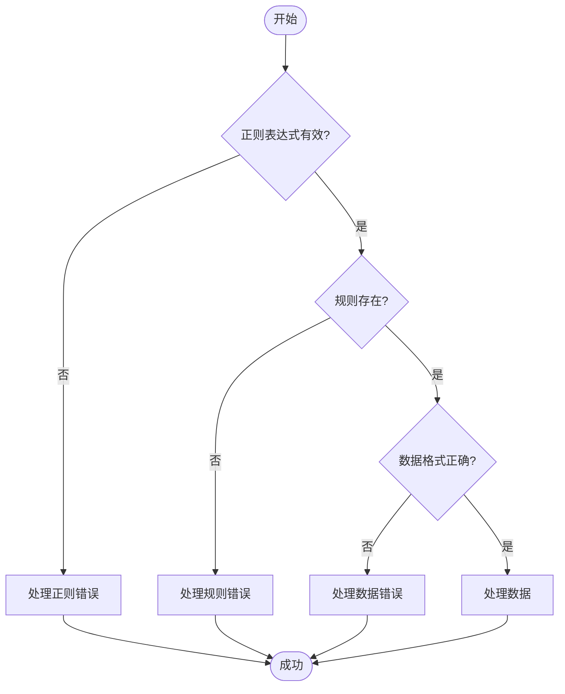

# 脱敏执行流程

<cite>
**本文档引用的文件**   
- [desensitize.py](file://bklog/apps/log_desensitize/handlers/desensitize.py)
- [text_replace.py](file://bklog/apps/log_desensitize/handlers/desensitize_operator/text_replace.py)
- [mask_shield.py](file://bklog/apps/log_desensitize/handlers/desensitize_operator/mask_shield.py)
- [base.py](file://bklog/apps/log_desensitize/handlers/desensitize_operator/base.py)
- [desensitize_rule_views.py](file://bklog/apps/log_desensitize/views/desensitize_rule_views.py)
- [utils.py](file://bklog/apps/log_desensitize/utils.py)
- [constants.py](file://bklog/apps/log_desensitize/constants.py)
- [models.py](file://bklog/apps/log_desensitize/models.py)
- [search_handlers_esquery.py](file://bklog/apps/log_search/handlers/search/search_handlers_esquery.py)
</cite>

## 目录
1. [引言](#引言)
2. [脱敏执行时机与流程](#脱敏执行时机与流程)
3. [DesensitizeHandler工厂类工作机制](#desensitizehandler工厂类工作机制)
4. [文本脱敏与字典脱敏实现差异](#文本脱敏与字典脱敏实现差异)
5. [重叠匹配子串合并处理算法](#重叠匹配子串合并处理算法)
6. [高亮显示功能实现原理](#高亮显示功能实现原理)
7. [大规模数据处理性能优化策略](#大规模数据处理性能优化策略)
8. [实际应用示例](#实际应用示例)
9. [错误处理与异常应对方案](#错误处理与异常应对方案)
10. [结论](#结论)

## 引言
本文档详细介绍了日志脱敏系统的执行流程，涵盖数据采集阶段（ETL过程）和查询阶段的脱敏处理机制。文档重点分析了DesensitizeHandler工厂类的核心工作原理，包括规则匹配、流水线处理和嵌套字段处理等关键逻辑。同时，文档还阐述了文本脱敏和字典脱敏两种模式的实现差异，以及重叠匹配子串的合并处理算法。此外，文档还说明了高亮显示功能的实现原理和在大规模数据处理场景下的性能优化策略，并提供了实际应用示例和错误处理方案。

## 脱敏执行时机与流程
日志脱敏处理在两个主要阶段执行：数据采集阶段（ETL过程）和查询阶段。

在数据采集阶段，当数据通过ETL（Extract, Transform, Load）流程进行处理时，系统会根据配置的脱敏规则对数据进行预处理。这一阶段的脱敏处理确保了敏感数据在存储之前就已经被保护。

在查询阶段，当用户请求数据时，系统会根据用户的权限和配置的脱敏规则对查询结果进行实时脱敏处理。这种机制确保了即使数据在存储时未完全脱敏，用户在查询时也只能看到经过脱敏处理的数据。

**Diagram sources**
- [desensitize.py](file://bklog/apps/log_desensitize/handlers/desensitize.py)
- [search_handlers_esquery.py](file://bklog/apps/log_search/handlers/search/search_handlers_esquery.py)

**Section sources**
- [desensitize.py](file://bklog/apps/log_desensitize/handlers/desensitize.py#L46-L692)
- [search_handlers_esquery.py](file://bklog/apps/log_search/handlers/search/search_handlers_esquery.py#L1997-L2021)

## DesensitizeHandler工厂类工作机制
DesensitizeHandler是日志脱敏的核心工厂类，负责接收配置规则列表，进行规则匹配，并调用相关的脱敏算子进行处理。规则列表以流水线的方式处理，确保了脱敏操作的顺序性和一致性。

该类的主要工作机制包括：
1. **规则初始化**：在初始化时，构建字段绑定的规则映射，并对规则按照优先级排序。
2. **规则匹配**：根据字段名和正则表达式匹配规则，确定哪些规则适用于当前数据。
3. **流水线处理**：将匹配的规则以流水线的方式依次应用到数据上，每个规则的输出作为下一个规则的输入。
4. **嵌套字段处理**：支持处理嵌套字段，通过展开和合并嵌套数据结构来实现对复杂数据的脱敏。

**Diagram sources**
- [desensitize.py](file://bklog/apps/log_desensitize/handlers/desensitize.py#L46-L692)
- [base.py](file://bklog/apps/log_desensitize/handlers/desensitize_operator/base.py#L25-L36)

**Section sources**
- [desensitize.py](file://bklog/apps/log_desensitize/handlers/desensitize.py#L46-L692)

## 文本脱敏与字典脱敏实现差异
系统支持两种主要的脱敏模式：文本脱敏和字典脱敏，它们在实现上有显著差异。

**文本脱敏**主要通过正则表达式匹配和模板替换来实现。系统使用`DesensitizeTextReplace`算子，根据预定义的模板字符串对匹配的文本进行替换。例如，可以将手机号码中的中间四位替换为星号。

**字典脱敏**则是基于预定义的字典进行替换。系统使用`DesensitizeMaskShield`算子，根据字典中的规则对特定字段进行掩码处理。例如，可以将身份证号码的出生日期部分替换为星号。

**Diagram sources**
- [text_replace.py](file://bklog/apps/log_desensitize/handlers/desensitize_operator/text_replace.py#L29-L71)
- [mask_shield.py](file://bklog/apps/log_desensitize/handlers/desensitize_operator/mask_shield.py#L30-L78)

**Section sources**
- [text_replace.py](file://bklog/apps/log_desensitize/handlers/desensitize_operator/text_replace.py#L29-L71)
- [mask_shield.py](file://bklog/apps/log_desensitize/handlers/desensitize_operator/mask_shield.py#L30-L78)

## 重叠匹配子串合并处理算法
在处理文本时，可能会出现多个规则匹配到同一段文本的情况，即重叠匹配。为了确保脱敏结果的正确性，系统实现了重叠匹配子串的合并处理算法。

该算法的主要步骤如下：
1. **查找所有匹配**：使用正则表达式的`finditer()`函数找到所有匹配的子串及其起止位置。
2. **合并重叠子串**：遍历所有匹配的子串，如果发现重叠，则保留优先级较高的规则的处理结果。
3. **排序和拼接**：将处理后的子串按照起始位置排序，并拼接成最终的脱敏结果。

**Diagram sources**
- [desensitize.py](file://bklog/apps/log_desensitize/handlers/desensitize.py#L204-L226)

**Section sources**
- [desensitize.py](file://bklog/apps/log_desensitize/handlers/desensitize.py#L204-L226)

## 高亮显示功能实现原理
高亮显示功能用于在脱敏结果中突出显示被处理的文本部分，帮助用户直观地了解哪些内容被脱敏。

实现原理如下：
1. **标记处理**：在脱敏处理过程中，如果启用了高亮显示，系统会在处理后的文本前后添加`<mark>`标签。
2. **正则调试**：在正则调试功能中，系统会将所有匹配的子串用`<mark>`标签高亮显示，以便用户验证正则表达式的正确性。
3. **结果返回**：最终返回的脱敏结果包含HTML标签，前端渲染时会自动显示为高亮效果。

**Diagram sources**
- [desensitize.py](file://bklog/apps/log_desensitize/handlers/desensitize.py#L160-L173)
- [desensitize_rule_views.py](file://bklog/apps/log_desensitize/views/desensitize_rule_views.py#L318-L320)

**Section sources**
- [desensitize.py](file://bklog/apps/log_desensitize/handlers/desensitize.py#L160-L173)
- [desensitize_rule_views.py](file://bklog/apps/log_desensitize/views/desensitize_rule_views.py#L318-L320)

## 大规模数据处理性能优化策略
在处理大规模数据时，系统采用了多种性能优化策略以确保高效运行。

1. **惰性初始化**：对于复杂的对象（如Jinja2模板），采用惰性初始化策略，只有在首次使用时才创建实例，减少内存占用。
2. **批量处理**：在处理大量日志时，采用批量处理方式，减少I/O操作次数。
3. **缓存机制**：对常用的脱敏规则和配置进行缓存，避免重复查询数据库。
4. **并行处理**：在可能的情况下，使用并行处理技术加速数据处理速度。

**Diagram sources**
- [text_replace.py](file://bklog/apps/log_desensitize/handlers/desensitize_operator/text_replace.py#L53-L61)
- [desensitize.py](file://bklog/apps/log_desensitize/handlers/desensitize.py#L52-L117)

**Section sources**
- [text_replace.py](file://bklog/apps/log_desensitize/handlers/desensitize_operator/text_replace.py#L53-L61)
- [desensitize.py](file://bklog/apps/log_desensitize/handlers/desensitize.py#L52-L117)

## 实际应用示例
以下是一些脱敏流程在不同业务场景下的执行效果示例。

**场景1：手机号码脱敏**
- 原始数据：`13234345678`
- 脱敏规则：保留前3位和后3位，中间用星号替换
- 脱敏结果：`132*****678`

**场景2：邮箱地址脱敏**
- 原始数据：`user@example.com`
- 脱敏规则：将`@`符号前的部分替换为"***"
- 脱敏结果：`***@example.com`

**场景3：身份证号码脱敏**
- 原始数据：`110101199003071234`
- 脱敏规则：保留前6位和后4位，中间用星号替换
- 脱敏结果：`110101********1234`

**Diagram sources**
- [desensitize.py](file://bklog/apps/log_desensitize/handlers/desensitize.py#L118-L157)
- [test_desensitize_handle.py](file://bklog/apps/tests/log_desensitize/test_desensitize_handle.py#L28-L61)

**Section sources**
- [desensitize.py](file://bklog/apps/log_desensitize/handlers/desensitize.py#L118-L157)
- [test_desensitize_handle.py](file://bklog/apps/tests/log_desensitize/test_desensitize_handle.py#L28-L61)

## 错误处理与异常应对方案
系统在设计时充分考虑了各种可能的错误和异常情况，并提供了相应的应对方案。

1. **正则表达式编译错误**：当用户输入的正则表达式无法编译时，系统会抛出`DesensitizeRuleRegexCompileException`异常，并返回详细的错误信息。
2. **规则不存在**：当尝试使用不存在的脱敏规则时，系统会抛出`DesensitizeRuleNotExistException`异常。
3. **数据格式错误**：当输入的数据格式不符合预期时，系统会抛出`DesensitizeDataErrorException`异常。
4. **权限不足**：当用户尝试访问无权访问的脱敏规则时，系统会返回相应的权限错误。

**Diagram sources**
- [desensitize.py](file://bklog/apps/log_desensitize/handlers/desensitize.py#L92-L101)
- [desensitize_rule_views.py](file://bklog/apps/log_desensitize/views/desensitize_rule_views.py#L60-L65)

**Section sources**
- [desensitize.py](file://bklog/apps/log_desensitize/handlers/desensitize.py#L92-L101)
- [desensitize_rule_views.py](file://bklog/apps/log_desensitize/views/desensitize_rule_views.py#L60-L65)

## 结论
本文档全面介绍了日志脱敏系统的执行流程和核心机制。通过分析DesensitizeHandler工厂类的工作原理，我们了解了规则匹配、流水线处理和嵌套字段处理等关键技术。文档还详细说明了文本脱敏和字典脱敏的实现差异，以及重叠匹配子串的合并处理算法。此外，高亮显示功能的实现原理和大规模数据处理的性能优化策略也为系统的高效运行提供了保障。最后，通过实际应用示例和错误处理方案，展示了系统在不同业务场景下的应用效果和可靠性。