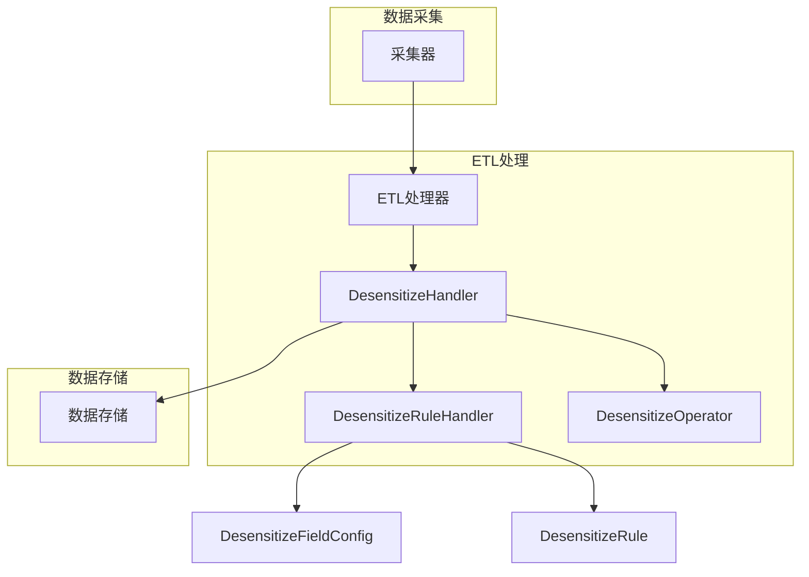
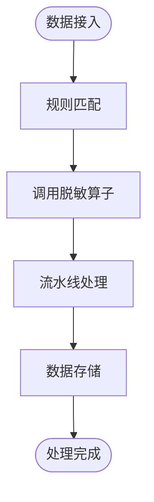

# 采集阶段脱敏流程

<cite>
**本文档引用的文件**   
- [desensitize.py](file://bklog/apps/log_desensitize/handlers/desensitize.py)
- [desensitize_operator/__init__.py](file://bklog/apps/log_desensitize/handlers/desensitize_operator/__init__.py)
- [mask_shield.py](file://bklog/apps/log_desensitize/handlers/desensitize_operator/mask_shield.py)
- [text_replace.py](file://bklog/apps/log_desensitize/handlers/desensitize_operator/text_replace.py)
- [base.py](file://bklog/apps/log_desensitize/handlers/desensitize_operator/base.py)
- [models.py](file://bklog/apps/log_desensitize/models.py)
- [constants.py](file://bklog/apps/log_desensitize/constants.py)
- [utils.py](file://bklog/apps/log_desensitize/utils.py)
- [desensitize_rule_views.py](file://bklog/apps/log_desensitize/views/desensitize_rule_views.py)
- [test_desensitize_handle.py](file://bklog/apps/tests/log_desensitize/test_desensitize_handle.py)
</cite>

## 目录
1. [引言](#引言)
2. [脱敏处理架构](#脱敏处理架构)
3. [核心组件分析](#核心组件分析)
4. [ETL阶段脱敏处理流程](#etl阶段脱敏处理流程)
5. [脱敏规则配置与管理](#脱敏规则配置与管理)
6. [性能影响与数据完整性](#性能影响与数据完整性)
7. [批量数据处理与内存管理](#批量数据处理与内存管理)
8. [常见问题与解决方案](#常见问题与解决方案)
9. [结论](#结论)

## 引言

在数据采集和ETL（Extract, Transform, Load）过程中，数据脱敏是保护敏感信息的重要环节。本文档详细介绍了在数据采集和ETL过程中执行脱敏处理的机制，包括数据接入时的实时脱敏处理流程。我们将深入探讨ETL阶段如何调用DesensitizeHandler进行字段匹配和内容替换，以及处理流水线的执行顺序。此外，文档还将说明在数据存储前完成脱敏处理的优势和限制，包括性能影响和数据完整性保障。通过本文档，读者将全面了解脱敏处理的各个方面，包括配置方式、内存管理和错误恢复机制。

## 脱敏处理架构

### 架构概述

脱敏处理架构主要由以下几个核心组件构成：

- **DesensitizeHandler**：日志脱敏工厂，负责接收配置规则的列表，进行规则匹配，并调用相关的脱敏算子进行处理。
- **DesensitizeRuleHandler**：脱敏规则处理器，负责创建、更新、删除和查询脱敏规则。
- **DesensitizeOperator**：脱敏算子，包括掩码屏蔽（mask_shield）和文本替换（text_replace）两种类型。
- **DesensitizeFieldConfig**：脱敏字段配置，用于定义字段与脱敏规则的关联关系。
- **DesensitizeRule**：脱敏规则，定义了具体的脱敏逻辑，包括匹配模式、操作符和参数。

### 架构图



**图源**
- [desensitize.py](file://bklog/apps/log_desensitize/handlers/desensitize.py)
- [desensitize_rule_views.py](file://bklog/apps/log_desensitize/views/desensitize_rule_views.py)

## 核心组件分析

### DesensitizeHandler

DesensitizeHandler是脱敏处理的核心组件，负责接收配置规则的列表，进行规则匹配，并调用相关的脱敏算子进行处理。其主要功能包括：

- **规则匹配**：根据配置规则列表，匹配需要脱敏的字段。
- **算子调用**：调用相应的脱敏算子（如掩码屏蔽或文本替换）进行处理。
- **流水线处理**：规则列表以流水线的方式处理，确保每个规则都能按顺序应用。

#### 初始化

```python
def __init__(self, desensitize_config_info):
    # 构建字段绑定的规则mapping
    self.field_rule_mapping = dict()
    self.rules = list()

    rule_ids = [_info["rule_id"] for _info in desensitize_config_info if _info.get("rule_id")]

    # 过滤出当前脱敏配置的关联规则中启用的规则 包含已删除的规则
    effective_rule_objs = DesensitizeRule.origin_objects.filter(id__in=rule_ids, is_active=True)
    effective_rule_mapping = {_obj.id: model_to_dict(_obj) for _obj in effective_rule_objs}

    for _config in desensitize_config_info:
        # 如果绑定了脱敏规则  判断绑定的规则当前是否启用
        rule_id = _config.get("rule_id")

        if rule_id and rule_id not in effective_rule_mapping:
            continue

        field_name = _config.get("field_name")

        if rule_id and field_name:
            match_fields = effective_rule_mapping[rule_id]["match_fields"]
            if match_fields and field_name not in match_fields:
                continue

        operator = _config["operator"]

        if not operator:
            continue

        # 生成配置对应的算子实例
        if operator not in OPERATOR_MAPPING:
            raise ValidationError(_("{} 算子能力尚未实现").format(operator))

        operator_cls = OPERATOR_MAPPING[operator]

        # 实例化算子
        _config["operator_obj"] = operator_cls() if not _config["params"] else operator_cls(**_config["params"])

        # 编译正则表达式
        try:
            _config["__regex__"] = (
                None if not _config.get("match_pattern") else re.compile(_config["match_pattern"])
            )
        except re.error:
            raise DesensitizeRuleRegexCompileException(
                DesensitizeRuleRegexCompileException.MESSAGE.format(
                    rule_id=rule_id, pattern=_config["match_pattern"]
                )
            )

        if field_name and field_name not in self.field_rule_mapping:
            self.field_rule_mapping[field_name] = list()
        if field_name:
            self.field_rule_mapping[field_name].append(_config)
        else:
            self.rules.append(_config)

    if self.field_rule_mapping:
        # 对字段绑定的规则按照优先级排序 sort_index 越小的优先级越高
        for _field_name, _config in self.field_rule_mapping.items():
            self.field_rule_mapping[_field_name] = sorted(_config, key=lambda x: x["sort_index"])

    if self.rules:
        self.rules = sorted(self.rules, key=lambda x: x["sort_index"])
```

**节源**
- [desensitize.py](file://bklog/apps/log_desensitize/handlers/desensitize.py#L52-L117)

### DesensitizeRuleHandler

DesensitizeRuleHandler负责管理脱敏规则的生命周期，包括创建、更新、删除和查询。其主要功能包括：

- **创建规则**：创建新的脱敏规则。
- **更新规则**：更新现有脱敏规则。
- **删除规则**：删除脱敏规则。
- **查询规则**：列出所有脱敏规则。

#### 创建规则

```python
def create_or_update(self, params: dict):
    """
    创建更新脱敏规则
    """
    # 重名校验
    query_params = {"rule_name": params["rule_name"]}

    if not self.data:
        # 创建
        if params["is_public"]:
            query_params.update({"is_public": True})
        else:
            query_params.update({"space_uid": params["space_uid"]})
        _qs = DesensitizeRule.objects.filter(**query_params)
    else:
        # 更新
        if self.data.is_public:
            query_params.update({"is_public": True})
        else:
            query_params.update({"space_uid": self.data.space_uid})
        _qs = DesensitizeRule.objects.filter(**query_params).exclude(id=self.rule_id)

    if _qs.exists():
        raise DesensitizeRuleNameExistException(
            DesensitizeRuleNameExistException.MESSAGE.format(name=params["rule_name"])
        )

    model_field = {
        "rule_name": params["rule_name"],
        "operator": params["operator"],
        "params": params["operator_params"],
        "match_pattern": params["match_pattern"],
        "match_fields": params["match_fields"],
    }

    if not self.data:
        # 创建脱敏规则
        model_field.update({"is_public": params["is_public"]})

        if not params["is_public"]:
            model_field.update({"space_uid": params.get("space_uid") or ""})

        obj = DesensitizeRule.objects.create(**model_field)
        return model_to_dict(obj)
    else:
        # 更新脱敏规则
        DesensitizeRule.objects.filter(id=self.rule_id).update(**model_field)
        return {"id": self.rule_id}
```

**节源**
- [desensitize.py](file://bklog/apps/log_desensitize/handlers/desensitize.py#L268-L315)

### DesensitizeOperator

DesensitizeOperator是脱敏算子的基类，定义了所有脱敏算子的公共接口。目前支持两种脱敏算子：掩码屏蔽（mask_shield）和文本替换（text_replace）。

#### 掩码屏蔽算子

```python
class DesensitizeMaskShield(DesensitizeMethodBase):
    """
    掩码屏蔽算子
    """

    class ParamsSerializer(serializers.Serializer):
        """
        脱敏配置参数
        """

        preserve_head = serializers.IntegerField(label=_("保留前几位"), required=False, min_value=0)
        preserve_tail = serializers.IntegerField(label=_("保留后几位"), required=False, min_value=0)
        replace_mark = serializers.CharField(label=_("替换符号"), required=False)

    def __init__(self, preserve_head: int = 0, preserve_tail: int = 0, replace_mark: str = "*", **kwargs):
        """
        params: preserve_head 保留前 preserve_head 位
        params: preserve_tail 保留后 preserve_tail 位
        params: replace_mark 替换符号
        """
        self.preserve_head = preserve_head
        self.preserve_tail = preserve_tail
        self.replace_mark = replace_mark

    def transform(self, target_text: str = "", context: dict = None):
        """
        场景示例: 13234345678 -> 132******78
        params: target_text
        """
        # 参数校验逻辑
        if not target_text:
            return ""
        if self.preserve_head == self.preserve_tail == 0:
            # 替换所有字符
            return self.replace_mark * len(target_text)

        if self.preserve_head + self.preserve_tail >= len(target_text):
            # 不进行掩码屏蔽
            return target_text

        tail_text = target_text[-self.preserve_tail :] if self.preserve_tail > 0 else ''

        return (
            target_text[: self.preserve_head]
            + self.replace_mark * (len(target_text) - self.preserve_head - self.preserve_tail)
            + tail_text
        )  # noqa
```

**节源**
- [mask_shield.py](file://bklog/apps/log_desensitize/handlers/desensitize_operator/mask_shield.py#L30-L78)

#### 文本替换算子

```python
class DesensitizeTextReplace(DesensitizeMethodBase):
    """
    优化后的文本替换算子（支持 pickle 序列化）
    """

    class ParamsSerializer(serializers.Serializer):
        template_string = serializers.CharField(label=_("替换模板格式"), required=False)

        def validate(self, attrs):
            attrs = super().validate(attrs)
            try:
                # 仅验证语法，不保留 Template 对象
                Environment(
                    variable_start_string="${",
                    variable_end_string="}",
                ).from_string(attrs.get("template_string"))
            except Exception as e:
                raise ValidationError(_("替换模板格式不正确: {}").format(e))
            return attrs

    def __init__(self, template_string: str, **kwargs):
        self.template_string = template_string
        self._template = None  # 延迟初始化

    @property
    def template(self):
        """惰性初始化模板"""
        if self._template is None:
            self._template = Environment(
                variable_start_string="${",
                variable_end_string="}",
            ).from_string(self.template_string)
        return self._template

    def transform(self, target_text: str = None, context: dict = None):
        if not target_text:
            return ""
        return self.template.render(**(context or {}))

    def __reduce__(self):
        """支持 pickle 序列化"""
        return self.__class__, (self.template_string,)
```

**节源**
- [text_replace.py](file://bklog/apps/log_desensitize/handlers/desensitize_operator/text_replace.py#L29-L71)

## ETL阶段脱敏处理流程

### 处理流程

在ETL阶段，脱敏处理流程主要包括以下几个步骤：

1. **数据接入**：数据通过采集器接入系统。
2. **规则匹配**：DesensitizeHandler根据配置规则列表，匹配需要脱敏的字段。
3. **算子调用**：调用相应的脱敏算子进行处理。
4. **流水线处理**：规则列表以流水线的方式处理，确保每个规则都能按顺序应用。
5. **数据存储**：处理后的数据存储到目标位置。

### 流程图



**图源**
- [desensitize.py](file://bklog/apps/log_desensitize/handlers/desensitize.py)

### 代码示例

```python
# 示例：调用DesensitizeHandler进行脱敏处理
param_1 = {
    "field_name": "test_field_1",
    "rule_id": 0,
    "operator": DesensitizeOperator.MASK_SHIELD.value,
    "params": {
        "preserve_head": 3,
        "preserve_tail": 3,
    },
    "match_pattern": "",
    "sort_index": 0
}
param_2 = {
    "field_name": "test_field_2",
    "rule_id": 0,
    "operator": DesensitizeOperator.TEXT_REPLACE.value,
    "params": {
        "template_string": "abc${partNum}defg",
    },
    "match_pattern": r"\d{3}(?P<partNum>\d{4})\d{4}",
    "sort_index": 1
}

text = {"test_field_1": "13234345678", "test_field_2": "13234345678"}
desensitize_config_info = [param_1, param_2]

result = DesensitizeHandler(desensitize_config_info=desensitize_config_info).transform_dict(text)

self.assertEqual(result.get("test_field_1"), "132*****678")
self.assertEqual(result.get("test_field_2"), "abc3434defg")
```

**节源**
- [test_desensitize_handle.py](file://bklog/apps/tests/log_desensitize/test_desensitize_handle.py#L32-L61)

## 脱敏规则配置与管理

### 配置方式

脱敏规则的配置通过DesensitizeRuleHandler进行管理。用户可以通过API创建、更新、删除和查询脱敏规则。配置规则时，需要指定规则名称、匹配模式、操作符和参数。

### 配置示例

```json
{
    "space_uid": "bkcc__2",
    "rule_name": "测试脱敏规则",
    "match_fields": ["phone", "number"],
    "match_pattern": "\\d+",
    "operator": "mask_shield",
    "operator_params": {
        "preserve_head": 1,
        "preserve_tail": 2,
        "replace_mark": "*"
    },
    "is_public": false
}
```

**节源**
- [desensitize_rule_views.py](file://bklog/apps/log_desensitize/views/desensitize_rule_views.py#L182-L194)

### 管理接口

- **创建规则**：`POST /api/v1/desensitize/rule/`
- **更新规则**：`PUT /api/v1/desensitize/rule/$rule_id/`
- **删除规则**：`DELETE /api/v1/desensitize/rule/$rule_id/`
- **查询规则**：`GET /api/v1/desensitize/rule/`

**节源**
- [desensitize_rule_views.py](file://bklog/apps/log_desensitize/views/desensitize_rule_views.py)

## 性能影响与数据完整性

### 性能影响

脱敏处理在ETL阶段引入了一定的性能开销，主要体现在以下几个方面：

- **规则匹配**：需要遍历所有配置规则，进行字段匹配和正则表达式匹配。
- **算子调用**：调用脱敏算子进行处理，特别是文本替换算子可能涉及复杂的模板渲染。
- **流水线处理**：规则列表以流水线的方式处理，增加了处理时间。

### 数据完整性

脱敏处理确保了数据的完整性，具体表现在：

- **字段一致性**：确保所有匹配的字段都经过脱敏处理。
- **数据完整性**：处理后的数据保持原有的结构和格式，不会丢失重要信息。
- **错误处理**：在处理过程中，如果遇到错误，会记录错误日志并继续处理其他数据。

### 优化建议

- **规则优化**：尽量减少规则数量，避免复杂的正则表达式。
- **并行处理**：在可能的情况下，使用并行处理提高效率。
- **缓存机制**：对于频繁使用的规则，可以考虑使用缓存机制减少重复计算。

**节源**
- [desensitize.py](file://bklog/apps/log_desensitize/handlers/desensitize.py)

## 批量数据处理与内存管理

### 批量处理

在批量数据处理场景下，脱敏处理需要考虑内存管理和错误恢复机制。主要策略包括：

- **分批处理**：将大量数据分成小批次进行处理，避免内存溢出。
- **内存监控**：实时监控内存使用情况，及时释放不再使用的资源。
- **错误恢复**：在处理过程中，如果遇到错误，记录错误日志并尝试恢复处理。

### 内存管理

- **对象复用**：复用已创建的对象，减少对象创建和销毁的开销。
- **垃圾回收**：定期进行垃圾回收，释放不再使用的内存。
- **资源释放**：在处理完成后，及时释放占用的资源。

### 错误恢复

- **重试机制**：对于临时性错误，可以设置重试机制。
- **日志记录**：记录详细的错误日志，便于问题排查。
- **状态保存**：在处理过程中，保存当前状态，以便在恢复时从断点继续处理。

**节源**
- [desensitize.py](file://bklog/apps/log_desensitize/handlers/desensitize.py)

## 常见问题与解决方案

### 编码转换错误

**问题描述**：在处理包含特殊字符的数据时，可能会出现编码转换错误。

**解决方案**：
- **统一编码**：确保所有输入数据使用统一的编码格式（如UTF-8）。
- **编码检测**：在处理前检测数据的编码格式，并进行必要的转换。

### 大文本处理超时

**问题描述**：处理大文本数据时，可能会因为处理时间过长而导致超时。

**解决方案**：
- **分段处理**：将大文本数据分段处理，每段处理完成后保存中间结果。
- **异步处理**：使用异步处理机制，避免阻塞主线程。
- **超时设置**：合理设置处理超时时间，避免无限等待。

### 正则表达式编译失败

**问题描述**：正则表达式编译失败，导致脱敏规则无法应用。

**解决方案**：
- **语法检查**：在配置规则时，进行正则表达式语法检查。
- **错误提示**：提供详细的错误提示，帮助用户修正正则表达式。

**节源**
- [desensitize.py](file://bklog/apps/log_desensitize/handlers/desensitize.py#L92-L101)

## 结论

本文档详细介绍了在数据采集和ETL过程中执行脱敏处理的机制，包括数据接入时的实时脱敏处理流程。我们深入探讨了ETL阶段如何调用DesensitizeHandler进行字段匹配和内容替换，以及处理流水线的执行顺序。文档还说明了在数据存储前完成脱敏处理的优势和限制，包括性能影响和数据完整性保障。通过本文档，读者可以全面了解脱敏处理的各个方面，包括配置方式、内存管理和错误恢复机制。希望本文档能为开发人员提供有价值的参考，帮助他们在实际项目中更好地实现数据脱敏。