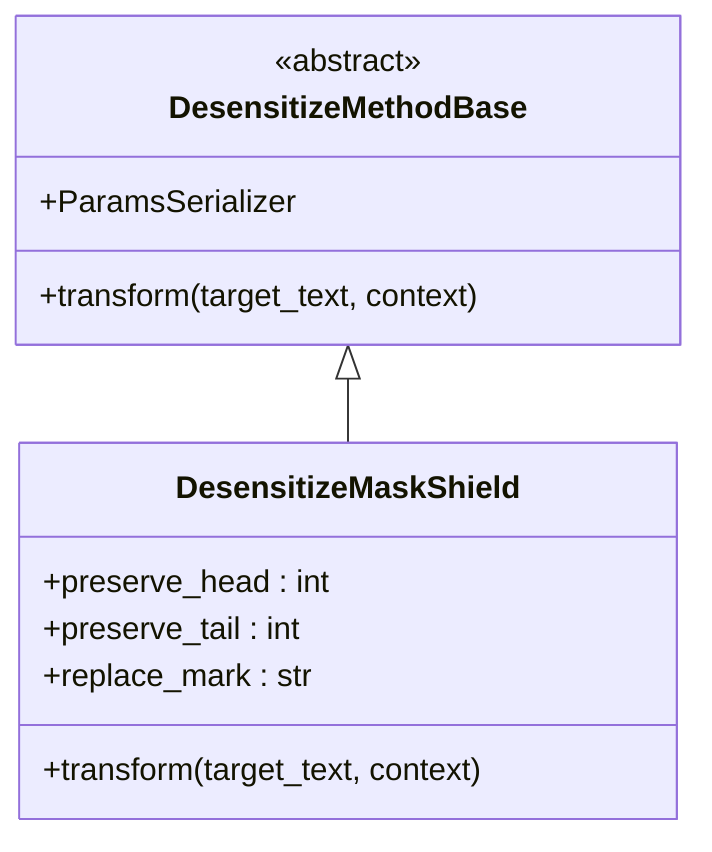
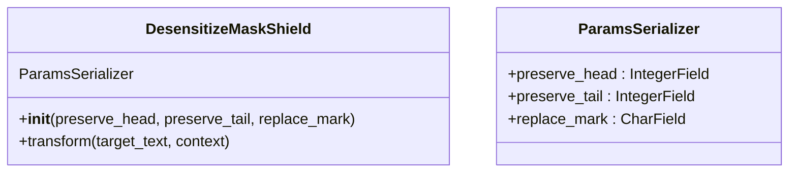
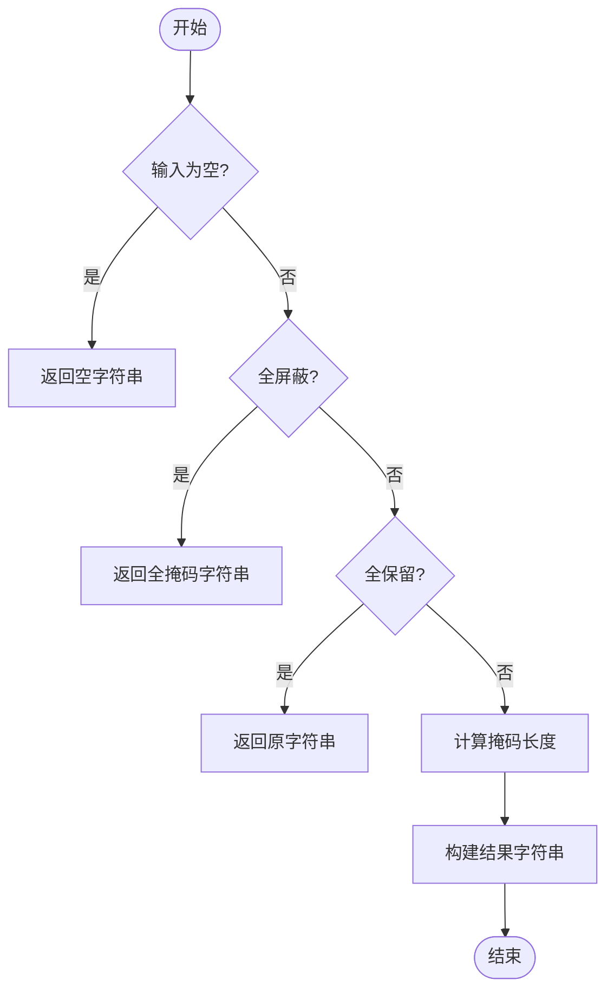
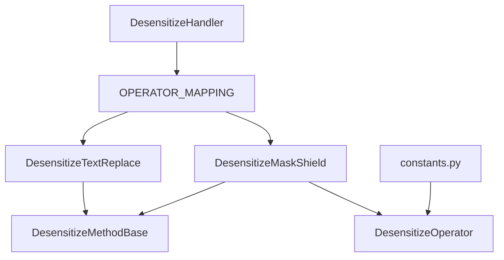

# 掩码屏蔽操作符

<cite>
**本文档引用的文件**
- [mask_shield.py](file://bklog/apps/log_desensitize/handlers/desensitize_operator/mask_shield.py)
- [base.py](file://bklog/apps/log_desensitize/handlers/desensitize_operator/base.py)
- [constants.py](file://bklog/apps/log_desensitize/constants.py)
- [desensitize.py](file://bklog/apps/log_desensitize/handlers/desensitize.py)
- [test_desensitize_operator.py](file://bklog/apps/tests/log_desensitize/test_desensitize_operator.py)
- [models.py](file://bklog/apps/log_desensitize/models.py)
</cite>

## 目录
1. [简介](#简介)
2. [核心组件](#核心组件)
3. [架构概述](#架构概述)
4. [详细组件分析](#详细组件分析)
5. [依赖分析](#依赖分析)
6. [性能考量](#性能考量)
7. [故障排除指南](#故障排除指南)
8. [结论](#结论)

## 简介
掩码屏蔽操作符是蓝鲸日志平台中用于敏感数据脱敏的核心组件之一。该操作符通过将敏感信息的部分字符替换为指定的掩码字符（如*、#等），同时保留前后指定数量的字符，实现对敏感数据的安全保护。本文档深入解析了MaskShieldOperator类的实现原理，包括其继承关系、核心算法、配置参数以及在实际应用中的使用场景。

## 核心组件

掩码屏蔽操作符的核心实现位于`DesensitizeMaskShield`类中，该类继承自`DesensitizeMethodBase`基类，并实现了`transform`方法来执行具体的脱敏逻辑。主要功能包括：
- 根据配置参数决定保留前后字符的数量
- 使用指定的掩码字符替换中间部分
- 处理边界情况，如全屏蔽或不屏蔽

**本节来源**
- [mask_shield.py](file://bklog/apps/log_desensitize/handlers/desensitize_operator/mask_shield.py#L30-L77)
- [base.py](file://bklog/apps/log_desensitize/handlers/desensitize_operator/base.py#L25-L36)

## 架构概述



**图表来源**
- [mask_shield.py](file://bklog/apps/log_desensitize/handlers/desensitize_operator/mask_shield.py#L30-L77)
- [base.py](file://bklog/apps/log_desensitize/handlers/desensitize_operator/base.py#L25-L36)

## 详细组件分析

### DesensitizeMaskShield 类分析

#### 类结构与继承
`DesensitizeMaskShield`类继承自`DesensitizeMethodBase`基类，遵循算子设计模式。这种设计允许系统通过工厂模式动态创建不同类型的脱敏算子实例。



**图表来源**
- [mask_shield.py](file://bklog/apps/log_desensitize/handlers/desensitize_operator/mask_shield.py#L35-L43)

#### 核心算法实现
`transform`方法实现了掩码屏蔽的核心逻辑：

1. **空值处理**：如果输入文本为空，则直接返回空字符串。
2. **全屏蔽处理**：当`preserve_head`和`preserve_tail`都为0时，将整个字符串替换为掩码字符。
3. **全保留处理**：当保留的前后字符总数大于等于原字符串长度时，不进行任何修改。
4. **正常掩码处理**：计算需要替换的字符数量，并构建新的掩码字符串。



**图表来源**
- [mask_shield.py](file://bklog/apps/log_desensitize/handlers/desensitize_operator/mask_shield.py#L54-L77)

### 配置参数详解

| 参数 | 描述 | 默认值 | 使用场景 |
|------|------|--------|---------|
| preserve_head | 保留前几位字符 | 0 | 保留手机号前3位 |
| preserve_tail | 保留后几位字符 | 0 | 保留身份证后4位 |
| replace_mark | 替换符号 | "*" | 可根据需求选择*、#等 |

**本节来源**
- [mask_shield.py](file://bklog/apps/log_desensitize/handlers/desensitize_operator/mask_shield.py#L40-L42)

### 实际应用案例

#### 手机号脱敏
```python
# 配置：保留前3后4位，使用*作为掩码
config = {
    "preserve_head": 3,
    "preserve_tail": 4,
    "replace_mark": "*"
}
# 输入：13812345678
# 输出：138****5678
```

#### 身份证号脱敏
```python
# 配置：保留前6后4位，使用*作为掩码
config = {
    "preserve_head": 6,
    "preserve_tail": 4,
    "replace_mark": "*"
}
# 输入：110101199003071234
# 输出：110101********1234
```

#### 银行卡号脱敏
```python
# 配置：保留前6后4位，使用*作为掩码
config = {
    "preserve_head": 6,
    "preserve_tail": 4,
    "replace_mark": "*"
}
# 输入：6222081234567890
# 输出：622208******7890
```

**本节来源**
- [test_desensitize_operator.py](file://bklog/apps/tests/log_desensitize/test_desensitize_operator.py#L30-L93)

## 依赖分析



**图表来源**
- [desensitize.py](file://bklog/apps/log_desensitize/handlers/desensitize.py#L86-L89)
- [__init__.py](file://bklog/apps/log_desensitize/handlers/desensitize_operator/__init__.py#L26-L29)
- [constants.py](file://bklog/apps/log_desensitize/constants.py#L27-L38)

## 性能考量

掩码屏蔽操作符的设计注重性能和安全性之间的平衡：
- **时间复杂度**：O(n)，其中n为输入字符串长度
- **空间复杂度**：O(n)，用于存储结果字符串
- **正则预编译**：在初始化时预编译正则表达式，避免重复编译开销
- **边界优化**：对全屏蔽和全保留等特殊情况进行优化处理

虽然没有直接的基准测试数据，但从代码实现可以看出，该操作符采用了高效的字符串切片和连接操作，避免了不必要的内存分配和复制。

**本节来源**
- [mask_shield.py](file://bklog/apps/log_desensitize/handlers/desensitize_operator/mask_shield.py#L60-L77)
- [desensitize.py](file://bklog/apps/log_desensitize/handlers/desensitize.py#L93-L95)

## 故障排除指南

### 常见问题及解决方案

1. **问题**：掩码后字符数不正确
   - **原因**：`preserve_head`和`preserve_tail`之和超过原字符串长度
   - **解决方案**：检查配置参数，确保保留字符总数不超过原字符串长度

2. **问题**：特殊字符导致异常
   - **原因**：输入包含非预期的特殊字符
   - **解决方案**：在调用前进行输入验证和清理

3. **问题**：性能下降
   - **原因**：频繁创建算子实例
   - **解决方案**：考虑缓存算子实例，重用已创建的对象

**本节来源**
- [mask_shield.py](file://bklog/apps/log_desensitize/handlers/desensitize_operator/mask_shield.py#L67-L69)
- [desensitize.py](file://bklog/apps/log_desensitize/handlers/desensitize.py#L88-L89)

## 结论
掩码屏蔽操作符通过简洁而高效的设计，实现了敏感数据的脱敏处理。其基于继承的算子设计模式使得系统具有良好的扩展性，可以轻松添加新的脱敏算法。配置参数的灵活性使其能够适应多种敏感数据类型的处理需求。尽管缺乏详细的性能基准测试数据，但从代码实现来看，该组件在性能和安全性之间取得了良好的平衡，适合在生产环境中使用。