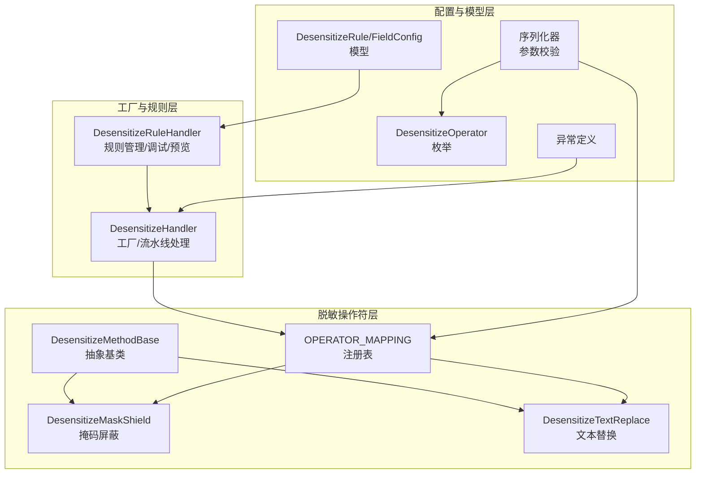
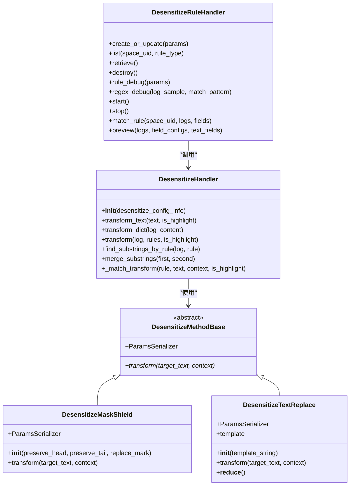
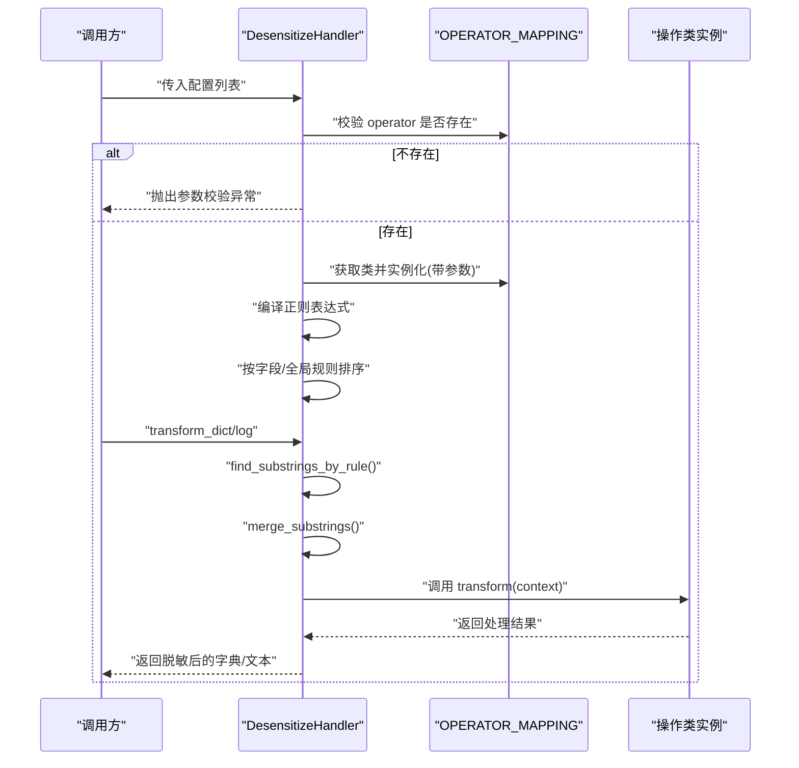
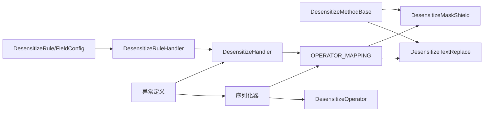
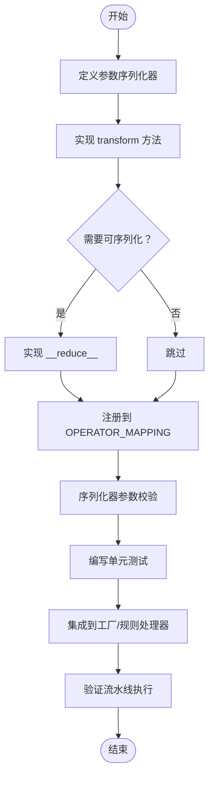

# 操作符基类架构

<cite>
**本文引用的文件**
- [base.py](file://bklog/apps/log_desensitize/handlers/desensitize_operator/base.py)
- [__init__.py](file://bklog/apps/log_desensitize/handlers/desensitize_operator/__init__.py)
- [mask_shield.py](file://bklog/apps/log_desensitize/handlers/desensitize_operator/mask_shield.py)
- [text_replace.py](file://bklog/apps/log_desensitize/handlers/desensitize_operator/text_replace.py)
- [desensitize.py](file://bklog/apps/log_desensitize/handlers/desensitize.py)
- [constants.py](file://bklog/apps/log_desensitize/constants.py)
- [exceptions.py](file://bklog/apps/log_desensitize/exceptions.py)
- [models.py](file://bklog/apps/log_desensitize/models.py)
- [serializers.py](file://bklog/apps/log_desensitize/serializers.py)
- [test_desensitize_operator.py](file://bklog/apps/tests/log_desensitize/test_desensitize_operator.py)
- [test_desensitize_handle.py](file://bklog/apps/tests/log_desensitize/test_desensitize_handle.py)
</cite>

## 目录
1. [简介](#简介)
2. [项目结构](#项目结构)
3. [核心组件](#核心组件)
4. [架构总览](#架构总览)
5. [详细组件分析](#详细组件分析)
6. [依赖关系分析](#依赖关系分析)
7. [性能考量](#性能考量)
8. [故障排查指南](#故障排查指南)
9. [结论](#结论)
10. [附录：扩展指南](#附录扩展指南)

## 简介
本文件围绕“脱敏操作符基类架构”展开，系统梳理并深入解析以下主题：
- 抽象基类设计理念与职责边界
- desensitize 抽象方法、参数验证机制与异常处理策略
- OPERATOR_MAPPING 注册与查找机制
- 基类提供的公共能力（日志记录、性能监控、配置验证）如何保障一致性与可靠性
- 如何通过继承基类扩展自定义脱敏操作符
- 完整的扩展流程与最佳实践

## 项目结构
脱敏相关代码主要位于 apps/log_desensitize 下，其中操作符基类与具体实现位于 handlers/desensitize_operator；工厂与规则处理逻辑位于 handlers/desensitize；常量、序列化器、模型与异常定义分别在 constants.py、serializers.py、models.py、exceptions.py 中。

图表来源
- [base.py](file://bklog/apps/log_desensitize/handlers/desensitize_operator/base.py#L25-L37)
- [mask_shield.py](file://bklog/apps/log_desensitize/handlers/desensitize_operator/mask_shield.py#L30-L78)
- [text_replace.py](file://bklog/apps/log_desensitize/handlers/desensitize_operator/text_replace.py#L29-L71)
- [__init__.py](file://bklog/apps/log_desensitize/handlers/desensitize_operator/__init__.py#L22-L30)
- [desensitize.py](file://bklog/apps/log_desensitize/handlers/desensitize.py#L46-L117)
- [constants.py](file://bklog/apps/log_desensitize/constants.py#L27-L40)
- [models.py](file://bklog/apps/log_desensitize/models.py#L29-L80)
- [serializers.py](file://bklog/apps/log_desensitize/serializers.py#L70-L100)
- [exceptions.py](file://bklog/apps/log_desensitize/exceptions.py#L31-L59)

章节来源
- [desensitize.py](file://bklog/apps/log_desensitize/handlers/desensitize.py#L46-L117)
- [__init__.py](file://bklog/apps/log_desensitize/handlers/desensitize_operator/__init__.py#L22-L30)
- [constants.py](file://bklog/apps/log_desensitize/constants.py#L27-L40)

## 核心组件
- 抽象基类 DesensitizeMethodBase：定义统一的 transform 接口，约束子类实现；提供 ParamsSerializer 可选参数序列化器入口。
- 具体操作符：
  - DesensitizeMaskShield：掩码屏蔽，支持保留前/后若干位，其余用替换符号填充。
  - DesensitizeTextReplace：文本替换，基于模板渲染，支持延迟初始化与可序列化。
- 工厂与规则处理器 DesensitizeHandler：负责规则解析、正则编译、字段匹配、流水线执行与高亮输出。
- 注册表 OPERATOR_MAPPING：将操作符枚举值映射到具体类，实现动态实例化。
- 常量与模型：DesensitizeOperator 枚举、DesensitizeRule/DesensitizeFieldConfig 模型。
- 序列化器与异常：对参数进行严格校验，抛出标准化异常。

章节来源
- [base.py](file://bklog/apps/log_desensitize/handlers/desensitize_operator/base.py#L25-L37)
- [mask_shield.py](file://bklog/apps/log_desensitize/handlers/desensitize_operator/mask_shield.py#L30-L78)
- [text_replace.py](file://bklog/apps/log_desensitize/handlers/desensitize_operator/text_replace.py#L29-L71)
- [desensitize.py](file://bklog/apps/log_desensitize/handlers/desensitize.py#L46-L117)
- [constants.py](file://bklog/apps/log_desensitize/constants.py#L27-L40)
- [models.py](file://bklog/apps/log_desensitize/models.py#L29-L80)
- [serializers.py](file://bklog/apps/log_desensitize/serializers.py#L70-L100)
- [exceptions.py](file://bklog/apps/log_desensitize/exceptions.py#L31-L59)

## 架构总览
整体采用“抽象基类 + 注册表 + 工厂”的分层架构：
- 基类层：统一接口与参数校验入口
- 注册层：枚举值到类的映射
- 工厂层：规则解析、正则编译、字段匹配、流水线执行
- 配置层：模型与序列化器负责参数与规则持久化与校验
- 异常层：统一错误码与消息

图表来源
- [base.py](file://bklog/apps/log_desensitize/handlers/desensitize_operator/base.py#L25-L37)
- [mask_shield.py](file://bklog/apps/log_desensitize/handlers/desensitize_operator/mask_shield.py#L30-L78)
- [text_replace.py](file://bklog/apps/log_desensitize/handlers/desensitize_operator/text_replace.py#L29-L71)
- [desensitize.py](file://bklog/apps/log_desensitize/handlers/desensitize.py#L46-L117)
- [desensitize.py](file://bklog/apps/log_desensitize/handlers/desensitize.py#L118-L252)

## 详细组件分析

### 抽象基类 DesensitizeMethodBase
- 设计理念
  - 通过抽象方法 transform 统一不同脱敏算法的调用入口，强制子类实现具体逻辑。
  - 提供 ParamsSerializer 可选入口，便于子类定义参数序列化器，实现参数校验与规范化。
- 关键点
  - transform 方法签名固定，便于工厂层统一调用。
  - 子类可通过 ParamsSerializer 定义参数校验逻辑，提升配置安全性。
- 适用场景
  - 所有自定义脱敏操作符均应继承该基类，遵循统一接口与参数规范。

章节来源
- [base.py](file://bklog/apps/log_desensitize/handlers/desensitize_operator/base.py#L25-L37)

### 具体操作符实现

#### 掩码屏蔽 DesensitizeMaskShield
- 功能要点
  - 支持保留前/后若干位，其余用替换符号填充。
  - 参数校验：保留位数非负，当保留位总数不小于文本长度时直接返回原文本。
- 参数序列化器
  - 通过 ParamsSerializer 定义保留位数与替换符号的校验规则。
- 复杂度
  - 时间复杂度 O(n)，空间复杂度 O(1)。

章节来源
- [mask_shield.py](file://bklog/apps/log_desensitize/handlers/desensitize_operator/mask_shield.py#L30-L78)

#### 文本替换 DesensitizeTextReplace
- 功能要点
  - 基于模板渲染，使用占位符 ${var} 从上下文注入变量。
  - 惰性初始化模板，避免无用开销；支持 __reduce__ 以便 pickle 序列化。
- 参数序列化器
  - 在 validate 中对模板字符串进行语法校验，防止运行期错误。
- 复杂度
  - 时间复杂度 O(n)（渲染），空间复杂度 O(n)（输出）。

章节来源
- [text_replace.py](file://bklog/apps/log_desensitize/handlers/desensitize_operator/text_replace.py#L29-L71)

### 注册表 OPERATOR_MAPPING
- 作用
  - 将 DesensitizeOperator 枚举值映射到具体操作类，实现动态实例化。
- 使用方式
  - 工厂在初始化时检查 operator 是否存在于映射表，不存在则抛出参数校验异常。
  - 序列化器在创建/调试规则时也依赖该映射进行参数校验与实例化。
- 可扩展性
  - 新增操作符只需在注册表中添加映射即可被工厂识别。

章节来源
- [__init__.py](file://bklog/apps/log_desensitize/handlers/desensitize_operator/__init__.py#L22-L30)
- [desensitize.py](file://bklog/apps/log_desensitize/handlers/desensitize.py#L77-L90)
- [serializers.py](file://bklog/apps/log_desensitize/serializers.py#L70-L100)

### 工厂 DesensitizeHandler：规则解析与流水线执行
- 初始化阶段
  - 解析 desensitize_config_info，构建字段规则映射与全局规则列表。
  - 校验 operator 是否在 OPERATOR_MAPPING 中，否则抛出参数校验异常。
  - 编译正则表达式，非法正则抛出专用异常。
  - 按 sort_index 排序，保证处理顺序。
- 文本/字典处理
  - transform_text：对纯文本按规则流水线处理。
  - transform_dict：对字典逐字段处理，支持嵌套字段（以点号分隔）。
- 匹配与合并
  - find_substrings_by_rule：根据正则提取匹配片段及起止位置。
  - merge_substrings：合并重叠片段，避免重复处理。
  - transform：按起止位置拼接原文与处理后的片段。
- 高亮输出
  - _match_transform：在 is_highlight 为真时对命中片段加标记。

图表来源
- [desensitize.py](file://bklog/apps/log_desensitize/handlers/desensitize.py#L77-L117)
- [desensitize.py](file://bklog/apps/log_desensitize/handlers/desensitize.py#L118-L252)
- [__init__.py](file://bklog/apps/log_desensitize/handlers/desensitize_operator/__init__.py#L22-L30)

章节来源
- [desensitize.py](file://bklog/apps/log_desensitize/handlers/desensitize.py#L46-L117)
- [desensitize.py](file://bklog/apps/log_desensitize/handlers/desensitize.py#L118-L252)

### 参数验证与异常处理
- 参数验证
  - 序列化器在创建/调试规则时对 operator、match_pattern、operator_params 进行校验。
  - 正则表达式在序列化器与工厂层双重校验，确保规则可用。
- 异常处理
  - 规则不存在、名称冲突、正则编译失败、正则未匹配等均有明确异常类型与错误码。
  - 工厂在 operator 未注册时抛出参数校验异常，避免未知操作符进入处理链。

章节来源
- [serializers.py](file://bklog/apps/log_desensitize/serializers.py#L70-L100)
- [desensitize.py](file://bklog/apps/log_desensitize/handlers/desensitize.py#L77-L101)
- [exceptions.py](file://bklog/apps/log_desensitize/exceptions.py#L31-L59)

### 公共功能与一致性保障
- 日志记录
  - 工厂在调试与预览场景中输出高亮结果，便于定位问题。
- 性能监控
  - 通过正则匹配与片段合并减少重复处理，提高整体效率。
- 配置验证
  - 序列化器与工厂层的双重校验确保配置合法，降低运行期风险。
- 一致性
  - 统一的 transform 接口与参数序列化器，保证所有操作符行为一致、易于维护与扩展。

章节来源
- [desensitize.py](file://bklog/apps/log_desensitize/handlers/desensitize.py#L118-L252)
- [serializers.py](file://bklog/apps/log_desensitize/serializers.py#L70-L100)

## 依赖关系分析
- 基类与具体操作符：继承关系清晰，职责单一。
- 注册表与工厂：工厂依赖注册表完成动态实例化。
- 序列化器与注册表：序列化器依赖注册表进行参数校验与实例化。
- 模型与规则处理器：规则处理器依赖模型进行持久化与查询。
- 异常与工厂/序列化器：异常作为统一错误出口，贯穿配置与运行期。

图表来源
- [base.py](file://bklog/apps/log_desensitize/handlers/desensitize_operator/base.py#L25-L37)
- [__init__.py](file://bklog/apps/log_desensitize/handlers/desensitize_operator/__init__.py#L22-L30)
- [desensitize.py](file://bklog/apps/log_desensitize/handlers/desensitize.py#L46-L117)
- [serializers.py](file://bklog/apps/log_desensitize/serializers.py#L70-L100)
- [models.py](file://bklog/apps/log_desensitize/models.py#L29-L80)
- [exceptions.py](file://bklog/apps/log_desensitize/exceptions.py#L31-L59)

章节来源
- [desensitize.py](file://bklog/apps/log_desensitize/handlers/desensitize.py#L46-L117)
- [serializers.py](file://bklog/apps/log_desensitize/serializers.py#L70-L100)
- [models.py](file://bklog/apps/log_desensitize/models.py#L29-L80)

## 性能考量
- 正则匹配与片段合并
  - 通过 finditer 与合并重叠片段，避免重复处理，提升吞吐。
- 惰性初始化
  - 文本替换模板惰性初始化，减少不必要的解析成本。
- 排序与流水线
  - 按 sort_index 排序，确保规则执行顺序可控，避免多次回溯。
- 建议
  - 控制正则复杂度，避免回溯灾难。
  - 合理设置保留位数，避免过度掩码导致可读性下降。

[本节为通用性能建议，无需特定文件来源]

## 故障排查指南
- 常见问题与定位
  - 算子未注册：检查 OPERATOR_MAPPING 是否包含对应枚举值。
  - 正则不合法：序列化器与工厂层均会校验，查看异常信息中的规则 ID 与模式。
  - 参数校验失败：确认 ParamsSerializer 的字段与取值范围。
  - 规则不存在或名称冲突：查看规则处理器的异常提示。
- 调试手段
  - 使用规则处理器的 rule_debug 与 regex_debug，快速定位正则与算子效果。
  - 在 transform 时开启 is_highlight，观察命中片段高亮。

章节来源
- [desensitize.py](file://bklog/apps/log_desensitize/handlers/desensitize.py#L461-L486)
- [desensitize.py](file://bklog/apps/log_desensitize/handlers/desensitize.py#L487-L508)
- [exceptions.py](file://bklog/apps/log_desensitize/exceptions.py#L31-L59)

## 结论
该架构通过抽象基类统一接口、注册表实现动态扩展、工厂完成规则解析与流水线执行，辅以严格的参数校验与异常体系，确保了脱敏系统的可维护性与可靠性。新操作符的扩展仅需继承基类并完善参数序列化器与 transform 实现，即可无缝融入现有体系。

[本节为总结性内容，无需特定文件来源]

## 附录：扩展指南

### 扩展步骤
1. 定义参数序列化器
   - 在新类中定义 ParamsSerializer，定义字段与校验逻辑。
   - 若涉及模板语法校验，可在 validate 中进行语法检查。
2. 实现 transform
   - 按照基类约定实现 transform(target_text, context)。
   - 注意空值与边界条件处理。
3. 可选：支持序列化
   - 如需 pickle 序列化，实现 __reduce__ 返回构造所需参数。
4. 注册到 OPERATOR_MAPPING
   - 在注册表中添加枚举值到类的映射。
5. 配置与校验
   - 在序列化器中使用 OPERATOR_MAPPING 进行参数校验。
6. 测试
   - 编写单元测试覆盖 transform 行为与边界条件。
7. 集成到工厂
   - 使用 DesensitizeHandler 传入配置列表，验证流水线执行效果。

图表来源
- [base.py](file://bklog/apps/log_desensitize/handlers/desensitize_operator/base.py#L25-L37)
- [__init__.py](file://bklog/apps/log_desensitize/handlers/desensitize_operator/__init__.py#L22-L30)
- [serializers.py](file://bklog/apps/log_desensitize/serializers.py#L70-L100)
- [desensitize.py](file://bklog/apps/log_desensitize/handlers/desensitize.py#L46-L117)

章节来源
- [mask_shield.py](file://bklog/apps/log_desensitize/handlers/desensitize_operator/mask_shield.py#L30-L78)
- [text_replace.py](file://bklog/apps/log_desensitize/handlers/desensitize_operator/text_replace.py#L29-L71)
- [__init__.py](file://bklog/apps/log_desensitize/handlers/desensitize_operator/__init__.py#L22-L30)
- [serializers.py](file://bklog/apps/log_desensitize/serializers.py#L70-L100)
- [test_desensitize_operator.py](file://bklog/apps/tests/log_desensitize/test_desensitize_operator.py#L1-L116)
- [test_desensitize_handle.py](file://bklog/apps/tests/log_desensitize/test_desensitize_handle.py#L24-L61)