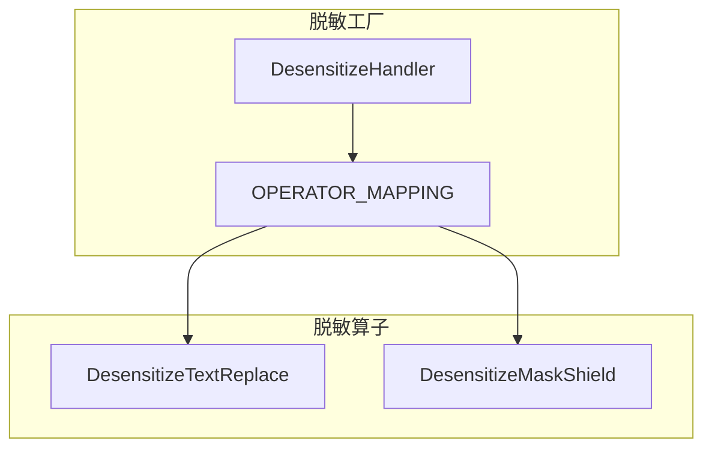
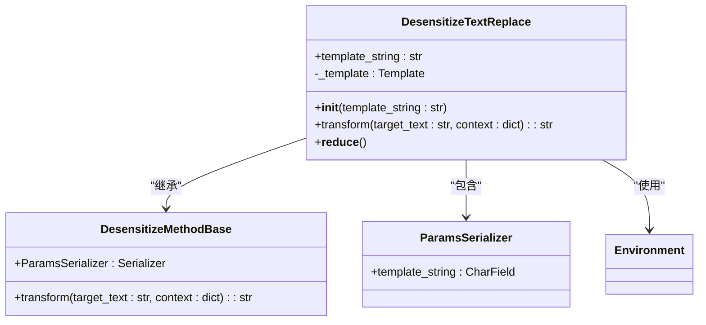
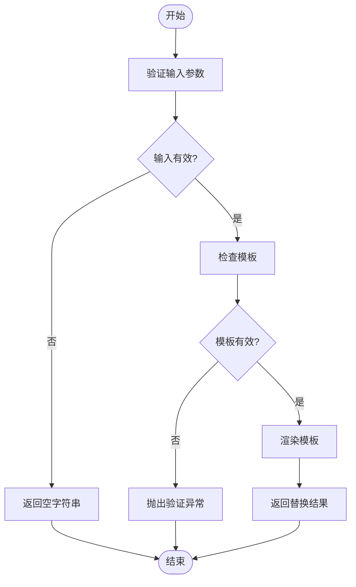
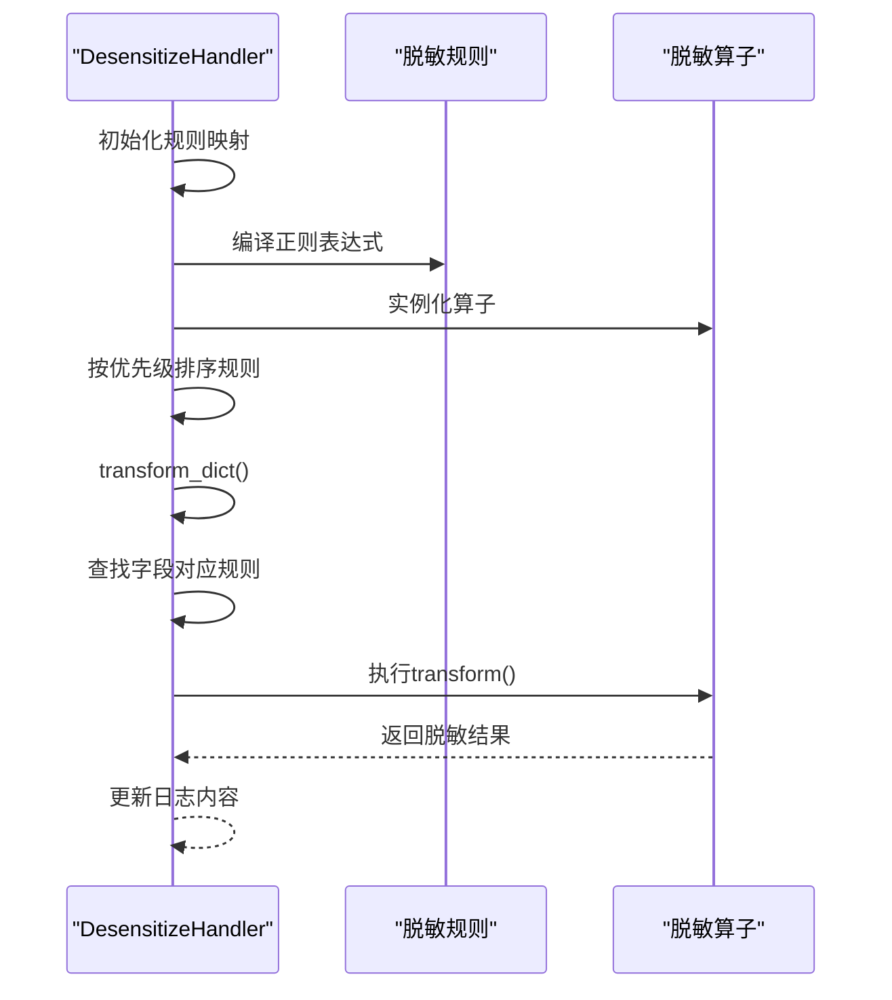
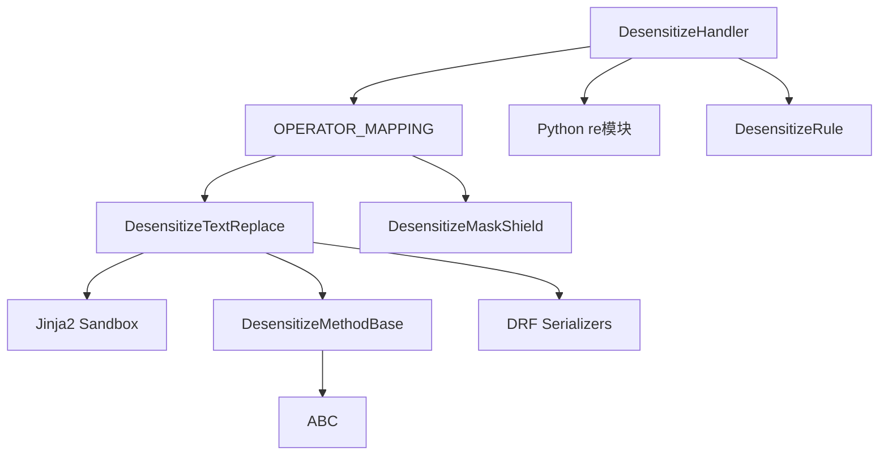

# 文本替换操作符

<cite>
**本文档引用的文件**
- [text_replace.py](file://bklog/apps/log_desensitize/handlers/desensitize_operator/text_replace.py)
- [base.py](file://bklog/apps/log_desensitize/handlers/desensitize_operator/base.py)
- [desensitize.py](file://bklog/apps/log_desensitize/handlers/desensitize.py)
- [constants.py](file://bklog/apps/log_desensitize/constants.py)
- [__init__.py](file://bklog/apps/log_desensitize/handlers/desensitize_operator/__init__.py)
- [test_desensitize_operator.py](file://bklog/apps/tests/log_desensitize/test_desensitize_operator.py)
- [mask_shield.py](file://bklog/apps/log_desensitize/handlers/desensitize_operator/mask_shield.py)
</cite>

## 目录
1. [简介](#简介)
2. [核心组件](#核心组件)
3. [架构概述](#架构概述)
4. [详细组件分析](#详细组件分析)
5. [依赖分析](#依赖分析)
6. [性能考虑](#性能考虑)
7. [故障排除指南](#故障排除指南)
8. [结论](#结论)

## 简介
文本替换操作符是蓝鲸日志平台中用于数据脱敏的核心组件之一，主要用于对日志中的敏感信息进行替换和脱敏处理。该操作符支持正则表达式匹配、固定文本替换和动态占位符替换等多种功能，能够有效保护用户隐私并满足GDPR等法规要求。通过灵活的配置参数，用户可以定义复杂的替换规则，实现对邮箱、IP地址、密码等敏感信息的精准替换。

## 核心组件

文本替换操作符的核心实现位于`DesensitizeTextReplace`类中，该类继承自`DesensitizeMethodBase`基类，实现了文本替换功能。操作符通过Jinja2沙箱环境处理模板字符串，支持动态占位符替换，并提供了参数验证机制确保配置的正确性。

**本节来源**
- [text_replace.py](file://bklog/apps/log_desensitize/handlers/desensitize_operator/text_replace.py#L29-L71)
- [base.py](file://bklog/apps/log_desensitize/handlers/desensitize_operator/base.py#L25-L37)

## 架构概述

文本替换操作符作为脱敏工厂的一部分，与其他脱敏算子（如掩码屏蔽）共同工作，形成完整的数据脱敏解决方案。操作符通过配置映射表`OPERATOR_MAPPING`注册到系统中，由`DesensitizeHandler`统一调用和管理。

**图表来源**
- [desensitize.py](file://bklog/apps/log_desensitize/handlers/desensitize.py#L52-L117)
- [__init__.py](file://bklog/apps/log_desensitize/handlers/desensitize_operator/__init__.py#L26-L29)

## 详细组件分析

### 文本替换操作符分析

`DesensitizeTextReplace`类实现了文本替换的核心功能，支持通过模板字符串进行动态替换。操作符使用Jinja2沙箱环境处理模板，确保安全性的同时提供灵活的替换能力。

#### 类图

**图表来源**
- [text_replace.py](file://bklog/apps/log_desensitize/handlers/desensitize_operator/text_replace.py#L29-L71)
- [base.py](file://bklog/apps/log_desensitize/handlers/desensitize_operator/base.py#L25-L37)

#### 处理流程

**图表来源**
- [text_replace.py](file://bklog/apps/log_desensitize/handlers/desensitize_operator/text_replace.py#L63-L66)
- [desensitize.py](file://bklog/apps/log_desensitize/handlers/desensitize.py#L118-L251)

**本节来源**
- [text_replace.py](file://bklog/apps/log_desensitize/handlers/desensitize_operator/text_replace.py#L29-L71)
- [test_desensitize_operator.py](file://bklog/apps/tests/log_desensitize/test_desensitize_operator.py#L95-L115)

### 脱敏工厂分析

`DesensitizeHandler`类作为脱敏工厂，负责管理所有脱敏规则和算子的执行流程。它通过配置信息实例化相应的脱敏算子，并按照优先级顺序执行脱敏操作。

#### 处理流程

**图表来源**
- [desensitize.py](file://bklog/apps/log_desensitize/handlers/desensitize.py#L52-L251)
- [test_desensitize_handle.py](file://bklog/apps/tests/log_desensitize/test_desensitize_handle.py#L32-L61)

**本节来源**
- [desensitize.py](file://bklog/apps/log_desensitize/handlers/desensitize.py#L52-L251)
- [test_desensitize_handle.py](file://bklog/apps/tests/log_desensitize/test_desensitize_handle.py#L28-L61)

## 依赖分析

文本替换操作符依赖于多个核心组件和库，形成了完整的依赖关系网络。

**图表来源**
- [text_replace.py](file://bklog/apps/log_desensitize/handlers/desensitize_operator/text_replace.py#L22-L26)
- [__init__.py](file://bklog/apps/log_desensitize/handlers/desensitize_operator/__init__.py#L22-L29)
- [desensitize.py](file://bklog/apps/log_desensitize/handlers/desensitize.py#L22-L43)

**本节来源**
- [text_replace.py](file://bklog/apps/log_desensitize/handlers/desensitize_operator/text_replace.py#L22-L26)
- [__init__.py](file://bklog/apps/log_desensitize/handlers/desensitize_operator/__init__.py#L22-L29)
- [desensitize.py](file://bklog/apps/log_desensitize/handlers/desensitize.py#L22-L43)

## 性能考虑

文本替换操作符在处理大规模日志数据时，通过以下策略优化性能：

1. **延迟初始化**: 模板对象采用惰性初始化策略，仅在首次使用时创建，减少内存占用。
2. **正则编译缓存**: 在`DesensitizeHandler`中，正则表达式在初始化时编译并缓存，避免重复编译开销。
3. **流水线处理**: 脱敏规则以流水线方式处理，减少中间结果的内存占用。
4. **优先级排序**: 规则按优先级排序，确保高效执行。

这些优化策略使得文本替换操作符能够高效处理大规模日志数据，满足生产环境的性能要求。

## 故障排除指南

### 常见问题及解决方案

1. **模板语法错误**
   - **现象**: 替换操作失败，抛出"替换模板格式不正确"异常
   - **原因**: 模板字符串语法错误或占位符格式不正确
   - **解决方案**: 检查模板字符串，确保占位符格式为`${variable}`

2. **替换结果不符合预期**
   - **现象**: 替换后的文本与预期不符
   - **原因**: 上下文参数缺失或正则匹配模式不准确
   - **解决方案**: 使用调试功能验证正则表达式匹配结果，确保上下文参数完整

3. **性能问题**
   - **现象**: 处理大量日志时响应缓慢
   - **原因**: 规则过多或正则表达式过于复杂
   - **解决方案**: 优化规则优先级，简化正则表达式，减少不必要的匹配操作

**本节来源**
- [text_replace.py](file://bklog/apps/log_desensitize/handlers/desensitize_operator/text_replace.py#L37-L47)
- [desensitize.py](file://bklog/apps/log_desensitize/handlers/desensitize.py#L91-L101)
- [test_desensitize_operator.py](file://bklog/apps/tests/log_desensitize/test_desensitize_operator.py#L95-L115)

## 结论

文本替换操作符是蓝鲸日志平台中功能强大且安全的数据脱敏工具。通过Jinja2沙箱环境和严格的参数验证，确保了模板处理的安全性，有效防止了代码注入等安全风险。操作符支持灵活的动态替换功能，能够满足各种复杂的脱敏需求。与掩码屏蔽等其他脱敏算子协同工作，形成了完整的数据脱敏解决方案，帮助用户满足GDPR等法规要求，保护敏感信息的安全。