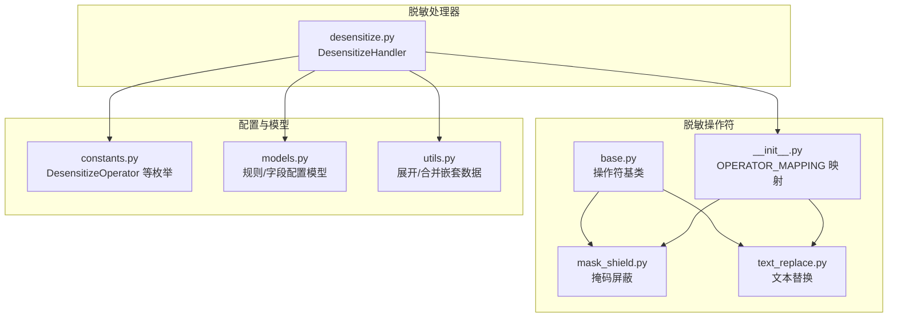
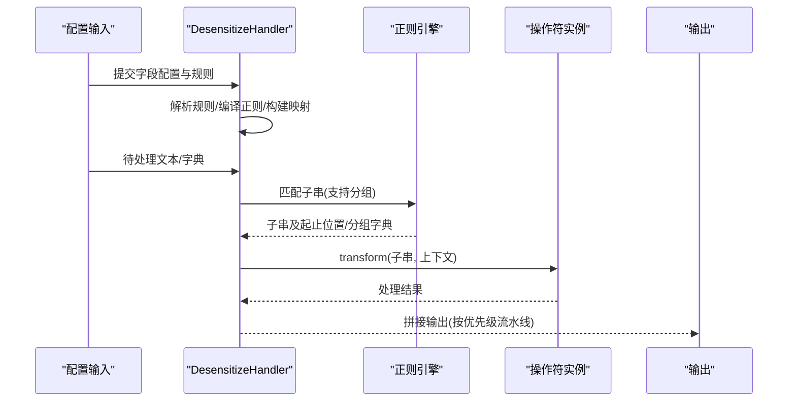
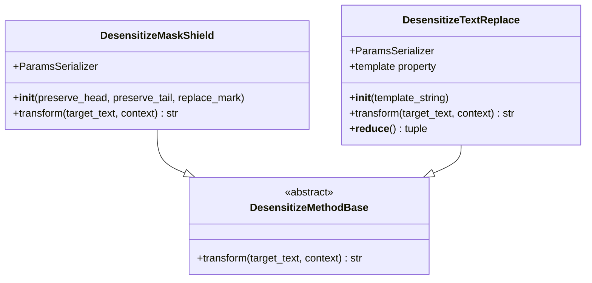
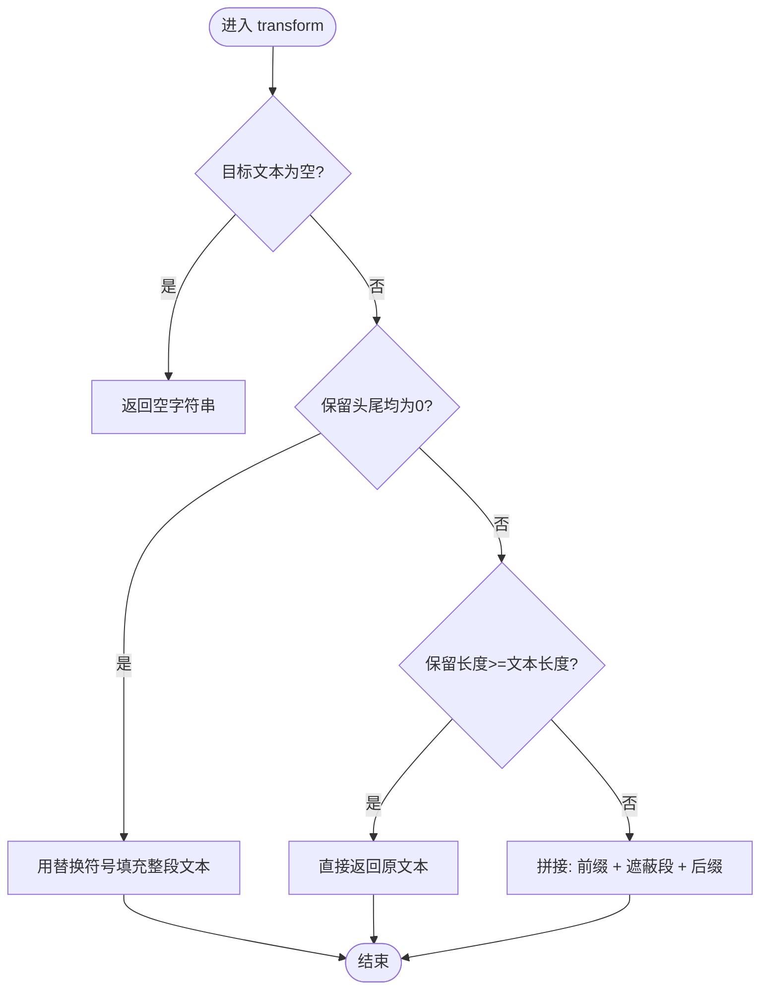
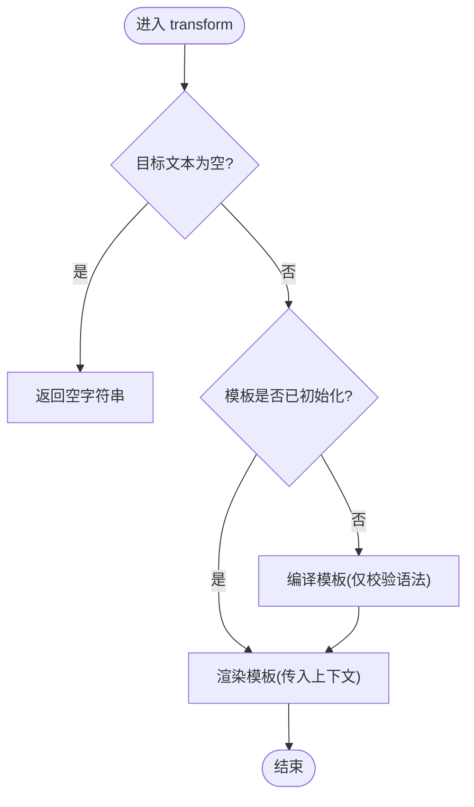
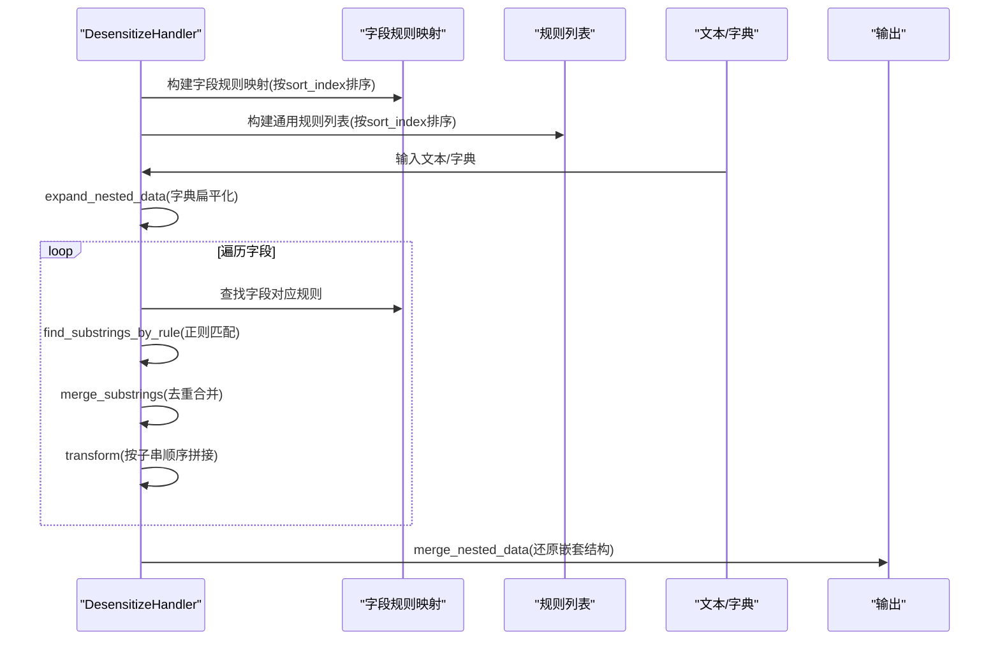
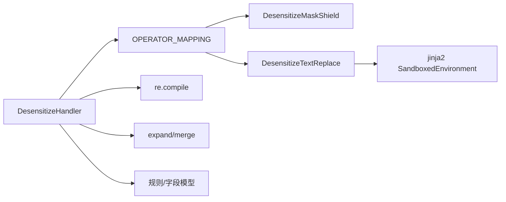

# 脱敏操作符

<cite>
**本文引用的文件**
- [apps/log_desensitize/handlers/desensitize_operator/base.py](file://apps/log_desensitize/handlers/desensitize_operator/base.py)
- [apps/log_desensitize/handlers/desensitize_operator/mask_shield.py](file://apps/log_desensitize/handlers/desensitize_operator/mask_shield.py)
- [apps/log_desensitize/handlers/desensitize_operator/text_replace.py](file://apps/log_desensitize/handlers/desensitize_operator/text_replace.py)
- [apps/log_desensitize/handlers/desensitize_operator/__init__.py](file://apps/log_desensitize/handlers/desensitize_operator/__init__.py)
- [apps/log_desensitize/constants.py](file://apps/log_desensitize/constants.py)
- [apps/log_desensitize/handlers/desensitize.py](file://apps/log_desensitize/handlers/desensitize.py)
- [apps/log_desensitize/models.py](file://apps/log_desensitize/models.py)
- [apps/log_desensitize/utils.py](file://apps/log_desensitize/utils.py)
- [apps/tests/log_desensitize/test_desensitize_operator.py](file://apps/tests/log_desensitize/test_desensitize_operator.py)
- [apps/tests/log_desensitize/test_desensitize_handle.py](file://apps/tests/log_desensitize/test_desensitize_handle.py)
</cite>

## 目录
1. [简介](#简介)
2. [项目结构](#项目结构)
3. [核心组件](#核心组件)
4. [架构总览](#架构总览)
5. [详细组件分析](#详细组件分析)
6. [依赖关系分析](#依赖关系分析)
7. [性能考量](#性能考量)
8. [故障排查指南](#故障排查指南)
9. [结论](#结论)
10. [附录](#附录)

## 简介
本文件系统性地梳理了蓝鲸日志平台中的“脱敏操作符”能力，覆盖内置操作符类型（掩码屏蔽、文本替换）、操作符基类设计与扩展机制、规则与字段配置、正则匹配与流水线处理流程、性能与安全合规建议，以及常见问题排查方法。读者可据此理解如何通过配置与组合不同操作符实现复杂脱敏需求，并在生产环境中安全、稳定地落地。

## 项目结构
脱敏相关代码主要位于日志模块下的脱敏子应用，核心文件组织如下：
- 操作符基类与内置实现：desensitize_operator 目录
- 脱敏处理器：desensitize.py
- 常量与模型：constants.py、models.py
- 工具函数：utils.py
- 测试用例：apps/tests/log_desensitize/

图表来源
- [apps/log_desensitize/handlers/desensitize_operator/base.py](file://apps/log_desensitize/handlers/desensitize_operator/base.py#L25-L37)
- [apps/log_desensitize/handlers/desensitize_operator/mask_shield.py](file://apps/log_desensitize/handlers/desensitize_operator/mask_shield.py#L30-L78)
- [apps/log_desensitize/handlers/desensitize_operator/text_replace.py](file://apps/log_desensitize/handlers/desensitize_operator/text_replace.py#L29-L71)
- [apps/log_desensitize/handlers/desensitize_operator/__init__.py](file://apps/log_desensitize/handlers/desensitize_operator/__init__.py#L22-L30)
- [apps/log_desensitize/handlers/desensitize.py](file://apps/log_desensitize/handlers/desensitize.py#L46-L117)
- [apps/log_desensitize/constants.py](file://apps/log_desensitize/constants.py#L27-L39)
- [apps/log_desensitize/models.py](file://apps/log_desensitize/models.py#L29-L80)
- [apps/log_desensitize/utils.py](file://apps/log_desensitize/utils.py#L25-L64)

章节来源
- [apps/log_desensitize/handlers/desensitize_operator/base.py](file://apps/log_desensitize/handlers/desensitize_operator/base.py#L25-L37)
- [apps/log_desensitize/handlers/desensitize_operator/__init__.py](file://apps/log_desensitize/handlers/desensitize_operator/__init__.py#L22-L30)
- [apps/log_desensitize/handlers/desensitize.py](file://apps/log_desensitize/handlers/desensitize.py#L46-L117)
- [apps/log_desensitize/constants.py](file://apps/log_desensitize/constants.py#L27-L39)
- [apps/log_desensitize/models.py](file://apps/log_desensitize/models.py#L29-L80)
- [apps/log_desensitize/utils.py](file://apps/log_desensitize/utils.py#L25-L64)

## 核心组件
- 操作符基类：定义统一的 transform 接口，约束子类实现。
- 内置操作符：
  - 掩码屏蔽（mask_shield）：支持保留前/后若干字符，其余用替换符号遮蔽。
  - 文本替换（text_replace）：基于模板渲染，支持从上下文提取分组并拼接输出。
- 操作符映射：通过 OPERATOR_MAPPING 将枚举值与具体类绑定，便于工厂创建。
- 脱敏处理器：解析配置、编译正则、按字段与优先级流水线执行、支持原文字段与嵌套字段处理。
- 配置与模型：规则表、字段配置表、枚举常量；支持公共/业务空间规则、启用状态、匹配字段与正则。
- 工具函数：展开/合并嵌套字典，便于处理深层字段。

章节来源
- [apps/log_desensitize/handlers/desensitize_operator/base.py](file://apps/log_desensitize/handlers/desensitize_operator/base.py#L25-L37)
- [apps/log_desensitize/handlers/desensitize_operator/mask_shield.py](file://apps/log_desensitize/handlers/desensitize_operator/mask_shield.py#L30-L78)
- [apps/log_desensitize/handlers/desensitize_operator/text_replace.py](file://apps/log_desensitize/handlers/desensitize_operator/text_replace.py#L29-L71)
- [apps/log_desensitize/handlers/desensitize_operator/__init__.py](file://apps/log_desensitize/handlers/desensitize_operator/__init__.py#L22-L30)
- [apps/log_desensitize/handlers/desensitize.py](file://apps/log_desensitize/handlers/desensitize.py#L46-L117)
- [apps/log_desensitize/constants.py](file://apps/log_desensitize/constants.py#L27-L39)
- [apps/log_desensitize/models.py](file://apps/log_desensitize/models.py#L29-L80)
- [apps/log_desensitize/utils.py](file://apps/log_desensitize/utils.py#L25-L64)

## 架构总览
脱敏处理采用“规则驱动 + 操作符工厂”的架构。配置层定义字段与规则，运行时由处理器构建操作符实例，按优先级顺序对文本进行匹配与替换，支持正则分组上下文传递给操作符。

图表来源
- [apps/log_desensitize/handlers/desensitize.py](file://apps/log_desensitize/handlers/desensitize.py#L118-L175)
- [apps/log_desensitize/handlers/desensitize.py](file://apps/log_desensitize/handlers/desensitize.py#L176-L251)
- [apps/log_desensitize/handlers/desensitize_operator/__init__.py](file://apps/log_desensitize/handlers/desensitize_operator/__init__.py#L22-L30)

## 详细组件分析

### 操作符基类与扩展机制
- 基类职责：定义抽象 transform 接口，确保所有操作符具备一致的调用契约。
- 扩展方式：新增子类继承基类并实现 transform；在 OPERATOR_MAPPING 中注册映射键值，即可被工厂识别与实例化。

图表来源
- [apps/log_desensitize/handlers/desensitize_operator/base.py](file://apps/log_desensitize/handlers/desensitize_operator/base.py#L25-L37)
- [apps/log_desensitize/handlers/desensitize_operator/mask_shield.py](file://apps/log_desensitize/handlers/desensitize_operator/mask_shield.py#L30-L78)
- [apps/log_desensitize/handlers/desensitize_operator/text_replace.py](file://apps/log_desensitize/handlers/desensitize_operator/text_replace.py#L29-L71)

章节来源
- [apps/log_desensitize/handlers/desensitize_operator/base.py](file://apps/log_desensitize/handlers/desensitize_operator/base.py#L25-L37)
- [apps/log_desensitize/handlers/desensitize_operator/__init__.py](file://apps/log_desensitize/handlers/desensitize_operator/__init__.py#L22-L30)

### 掩码屏蔽（mask_shield）
- 功能概述：对目标文本中间部分进行遮蔽，保留前/后若干字符，其余以替换符号填充。
- 关键参数：
  - preserve_head：保留开头若干字符
  - preserve_tail：保留结尾若干字符
  - replace_mark：遮蔽使用的替换符号
- 行为特征：
  - 当 preserve_head 与 preserve_tail 均为 0 时，全量遮蔽
  - 当保留长度之和大于等于文本长度时，不进行遮蔽
  - 支持空文本返回空字符串
- 适用场景：手机号、身份证号、卡号等需要保留前后缀以便辨识但隐藏中间数字的场景。

图表来源
- [apps/log_desensitize/handlers/desensitize_operator/mask_shield.py](file://apps/log_desensitize/handlers/desensitize_operator/mask_shield.py#L54-L78)

章节来源
- [apps/log_desensitize/handlers/desensitize_operator/mask_shield.py](file://apps/log_desensitize/handlers/desensitize_operator/mask_shield.py#L30-L78)
- [apps/tests/log_desensitize/test_desensitize_operator.py](file://apps/tests/log_desensitize/test_desensitize_operator.py#L27-L54)

### 文本替换（text_replace）
- 功能概述：基于模板字符串进行渲染，模板变量来源于正则分组上下文，支持延迟初始化与序列化。
- 关键参数：
  - template_string：模板字符串，变量以 ${var} 形式占位
- 行为特征：
  - 初始化时仅校验模板语法，不保留模板对象，避免循环引用
  - 惰性加载模板，首次渲染时构建
  - 支持 pickle 序列化，便于缓存或跨进程传输
  - 空文本返回空字符串
- 适用场景：需要根据上下文动态生成固定格式的脱敏文本，如拼接标识、编号等。

图表来源
- [apps/log_desensitize/handlers/desensitize_operator/text_replace.py](file://apps/log_desensitize/handlers/desensitize_operator/text_replace.py#L29-L71)

章节来源
- [apps/log_desensitize/handlers/desensitize_operator/text_replace.py](file://apps/log_desensitize/handlers/desensitize_operator/text_replace.py#L29-L71)
- [apps/tests/log_desensitize/test_desensitize_handle.py](file://apps/tests/log_desensitize/test_desensitize_handle.py#L24-L61)

### 规则与字段配置
- 规则模型：包含规则名称、算子类型、参数、匹配模式、匹配字段、是否启用等。
- 字段配置模型：将规则绑定到具体字段，支持优先级排序与原文字段处理。
- 枚举常量：DesensitizeOperator 定义内置算子枚举值，供模型与映射使用。

章节来源
- [apps/log_desensitize/models.py](file://apps/log_desensitize/models.py#L29-L80)
- [apps/log_desensitize/constants.py](file://apps/log_desensitize/constants.py#L27-L39)

### 脱敏处理器（DesensitizeHandler）
- 职责：接收配置列表，构建字段规则映射，编译正则，按优先级流水线处理文本或字典。
- 关键流程：
  - 构建 field_rule_mapping 与 rules，分别按 sort_index 排序
  - transform_dict：遍历字典字段，支持嵌套字段（点号路径），将 None 转为空字符串再处理
  - transform：对文本进行子串匹配与合并，按起始位置拼接处理结果
  - _match_transform：根据 is_highlight 控制是否高亮处理结果
- 嵌套字段：expand_nested_data 将嵌套对象扁平化，merge_nested_data 再还原为嵌套结构，保证字段路径与最终输出一致。

图表来源
- [apps/log_desensitize/handlers/desensitize.py](file://apps/log_desensitize/handlers/desensitize.py#L118-L175)
- [apps/log_desensitize/handlers/desensitize.py](file://apps/log_desensitize/handlers/desensitize.py#L176-L251)
- [apps/log_desensitize/utils.py](file://apps/log_desensitize/utils.py#L25-L64)

章节来源
- [apps/log_desensitize/handlers/desensitize.py](file://apps/log_desensitize/handlers/desensitize.py#L46-L117)
- [apps/log_desensitize/handlers/desensitize.py](file://apps/log_desensitize/handlers/desensitize.py#L118-L175)
- [apps/log_desensitize/handlers/desensitize.py](file://apps/log_desensitize/handlers/desensitize.py#L176-L251)
- [apps/log_desensitize/utils.py](file://apps/log_desensitize/utils.py#L25-L64)

### 预览与调试
- 规则调试：支持对单条日志样本进行高亮展示，帮助验证匹配与替换效果。
- 正则调试：输出匹配片段的高亮位置，辅助定位正则问题。
- 预览接口：结合字段配置与规则，对多条日志进行批量预览，支持原文字段与其他字段的联动替换。

章节来源
- [apps/log_desensitize/handlers/desensitize.py](file://apps/log_desensitize/handlers/desensitize.py#L461-L486)
- [apps/log_desensitize/handlers/desensitize.py](file://apps/log_desensitize/handlers/desensitize.py#L487-L508)
- [apps/log_desensitize/handlers/desensitize.py](file://apps/log_desensitize/handlers/desensitize.py#L591-L692)

## 依赖关系分析
- 组件耦合：
  - DesensitizeHandler 依赖 OPERATOR_MAPPING、正则编译、模型与工具函数
  - 操作符类之间低耦合，通过基类统一接口
- 外部依赖：
  - 正则引擎（re）
  - 模板引擎（jinja2，仅在文本替换中使用）
  - Django 序列化器（rest_framework）用于参数校验
- 潜在环路：
  - 无直接循环导入，模块间通过常量与映射间接协作

图表来源
- [apps/log_desensitize/handlers/desensitize.py](file://apps/log_desensitize/handlers/desensitize.py#L46-L117)
- [apps/log_desensitize/handlers/desensitize_operator/__init__.py](file://apps/log_desensitize/handlers/desensitize_operator/__init__.py#L22-L30)
- [apps/log_desensitize/handlers/desensitize_operator/text_replace.py](file://apps/log_desensitize/handlers/desensitize_operator/text_replace.py#L29-L71)

章节来源
- [apps/log_desensitize/handlers/desensitize.py](file://apps/log_desensitize/handlers/desensitize.py#L46-L117)
- [apps/log_desensitize/handlers/desensitize_operator/__init__.py](file://apps/log_desensitize/handlers/desensitize_operator/__init__.py#L22-L30)
- [apps/log_desensitize/handlers/desensitize_operator/text_replace.py](file://apps/log_desensitize/handlers/desensitize_operator/text_replace.py#L29-L71)

## 性能考量
- 时间复杂度
  - 正则匹配：finditer 对文本进行一次扫描，复杂度近似 O(n)，其中 n 为文本长度
  - 子串合并：合并去重过程与匹配数量相关，最坏 O(k^2)，k 为匹配子串数
  - 拼接输出：按子串顺序拼接，整体 O(n)
- 空间复杂度
  - 存储匹配子串与上下文，约为 O(k)
  - 模板惰性初始化仅在首次渲染时占用额外内存
- 优化建议
  - 合理设置保留长度，避免过长保留导致误判
  - 正则尽量精确，减少重叠匹配，降低合并成本
  - 对高频字段可考虑缓存模板与规则映射
  - 在大批量日志处理时，优先使用字段级规则，减少全局规则扫描

## 故障排查指南
- 常见异常与定位
  - 算子未实现：当配置 operator 不在 OPERATOR_MAPPING 时抛出校验错误
  - 正则编译失败：match_pattern 语法错误时抛出异常
  - 规则不存在/重名：规则 CRUD 过程中可能触发不存在或重名异常
  - 数据展开/合并异常：嵌套数据处理异常时抛出错误
- 调试手段
  - 使用规则调试接口对样本日志进行高亮预览
  - 使用正则调试接口查看匹配片段
  - 通过预览接口对比字段间联动替换效果
- 单元测试参考
  - 掩码屏蔽与文本替换的单元测试覆盖了典型行为与边界条件

章节来源
- [apps/log_desensitize/handlers/desensitize.py](file://apps/log_desensitize/handlers/desensitize.py#L82-L101)
- [apps/log_desensitize/handlers/desensitize.py](file://apps/log_desensitize/handlers/desensitize.py#L461-L508)
- [apps/tests/log_desensitize/test_desensitize_operator.py](file://apps/tests/log_desensitize/test_desensitize_operator.py#L27-L54)
- [apps/tests/log_desensitize/test_desensitize_handle.py](file://apps/tests/log_desensitize/test_desensitize_handle.py#L24-L61)

## 结论
该脱敏体系以“规则 + 操作符”的方式实现灵活、可扩展的文本处理能力。掩码屏蔽与文本替换两类内置操作符分别适用于“保留前后缀 + 遮蔽中间”与“模板化动态替换”的典型场景。通过 OPERATOR_MAPPING 与 DesensitizeHandler 的流水线处理，可在字段级与原文字段级实现复杂组合脱敏，满足多样化的合规与安全需求。

## 附录

### 配置参数与使用要点
- 掩码屏蔽（mask_shield）
  - preserve_head：保留开头字符数（默认 0）
  - preserve_tail：保留结尾字符数（默认 0）
  - replace_mark：遮蔽符号（默认 “*”）
- 文本替换（text_replace）
  - template_string：模板字符串，变量以 ${var} 引用正则分组
- 规则与字段
  - operator：算子类型（mask_shield 或 text_replace）
  - params：对应算子参数
  - match_pattern：可选正则，用于限定处理范围
  - sort_index：优先级，越小越先执行
  - match_fields：可选字段白名单，限制命中范围

章节来源
- [apps/log_desensitize/handlers/desensitize_operator/mask_shield.py](file://apps/log_desensitize/handlers/desensitize_operator/mask_shield.py#L35-L43)
- [apps/log_desensitize/handlers/desensitize_operator/text_replace.py](file://apps/log_desensitize/handlers/desensitize_operator/text_replace.py#L34-L47)
- [apps/log_desensitize/models.py](file://apps/log_desensitize/models.py#L29-L80)
- [apps/log_desensitize/handlers/desensitize.py](file://apps/log_desensitize/handlers/desensitize.py#L606-L650)

### 实际应用示例（路径指引）
- 组合掩码屏蔽与文本替换：参考单元测试中的配置与断言
  - 掩码屏蔽：保留前 3 位与后 3 位，中间以星号遮蔽
  - 文本替换：使用模板拼接捕获组，如将中间数字拼接到固定前缀/后缀
- 嵌套字段处理：通过 expand/merge 工具函数确保深层字段路径正确

章节来源
- [apps/tests/log_desensitize/test_desensitize_handle.py](file://apps/tests/log_desensitize/test_desensitize_handle.py#L24-L61)
- [apps/log_desensitize/utils.py](file://apps/log_desensitize/utils.py#L25-L64)