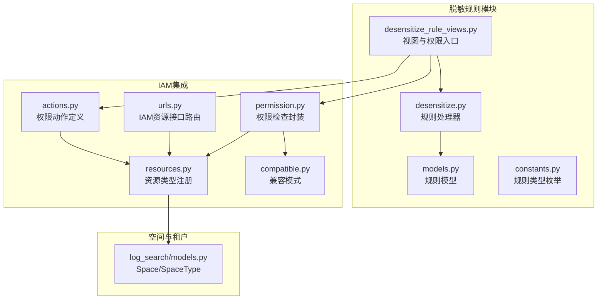
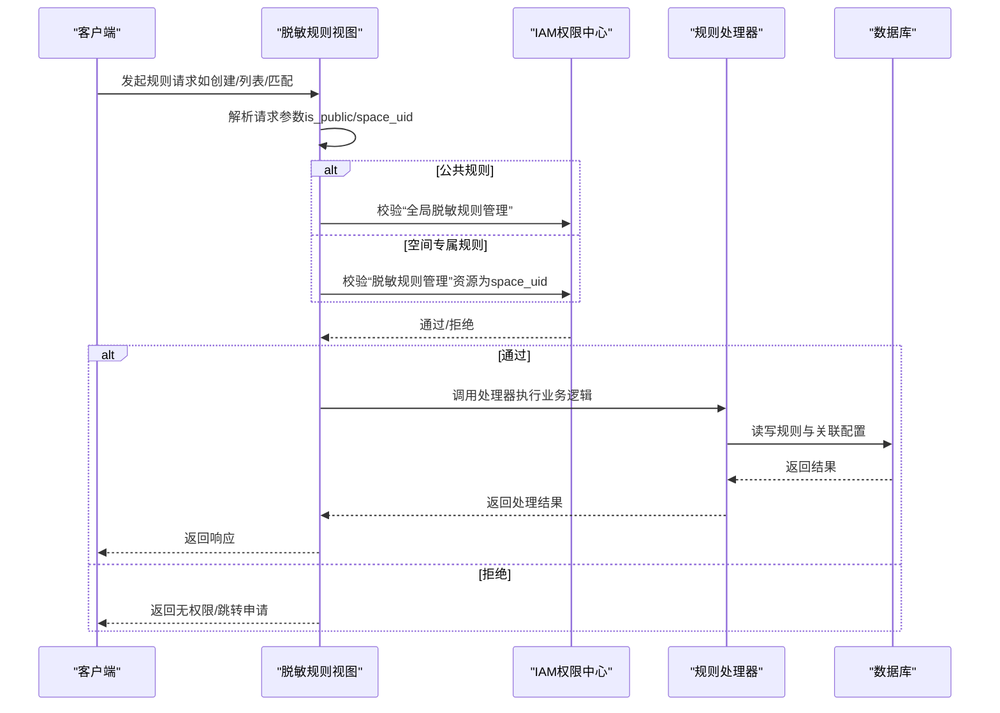
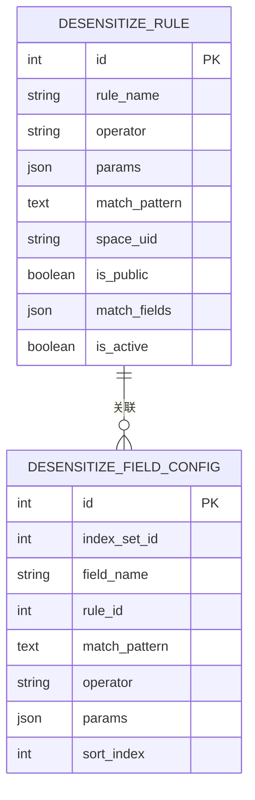
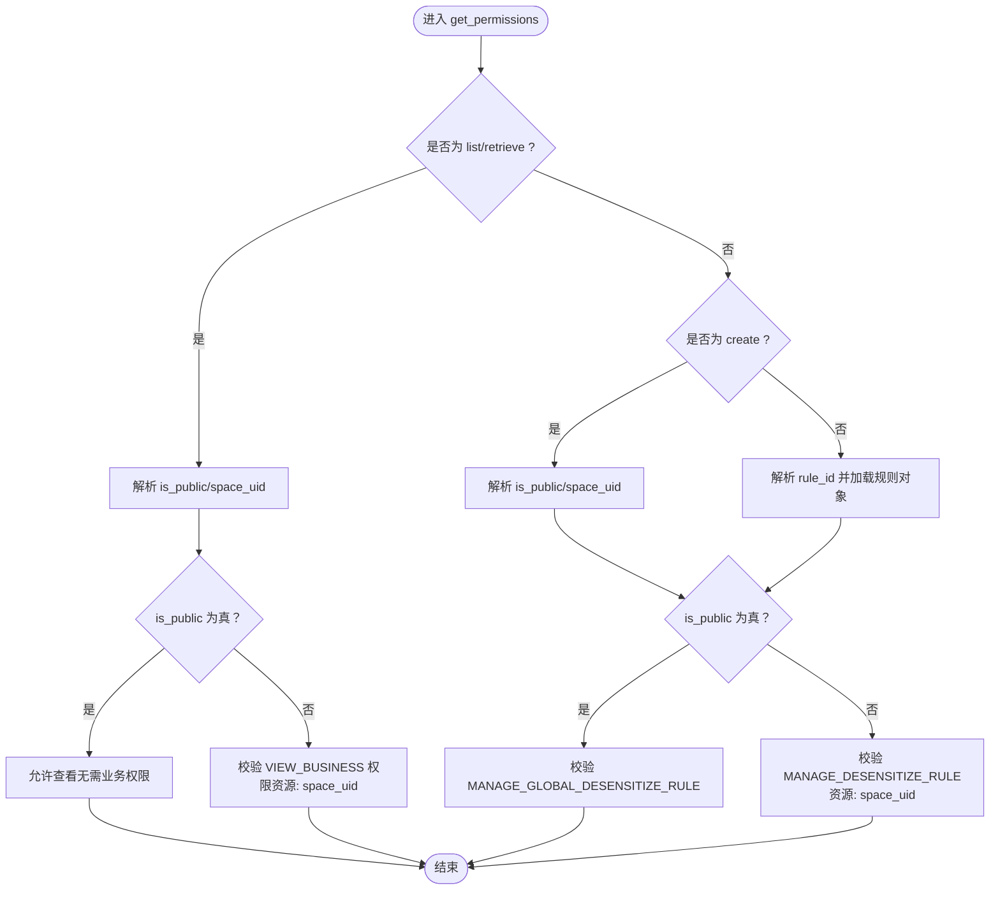
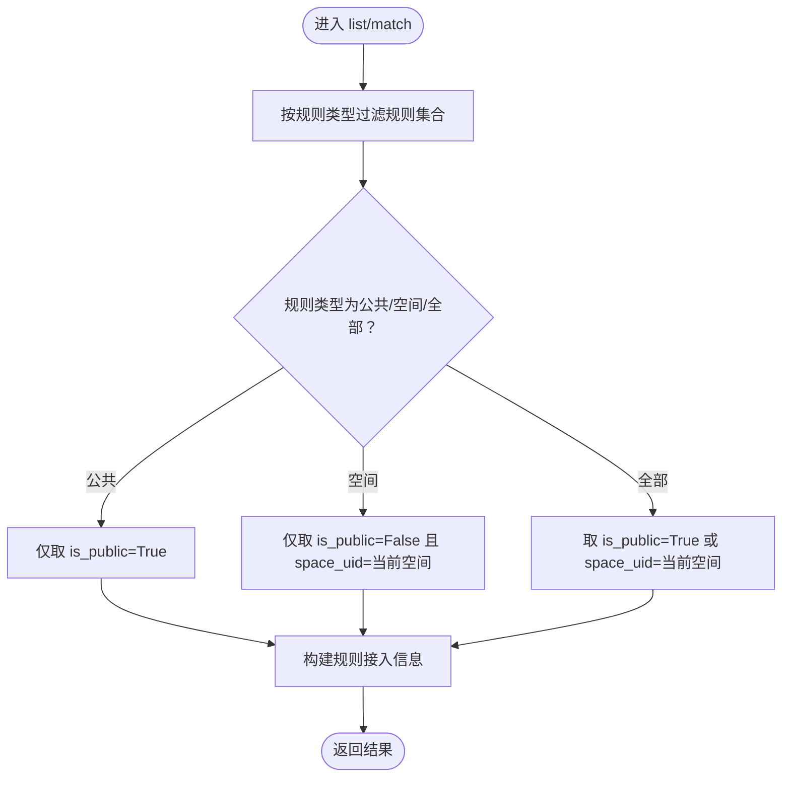
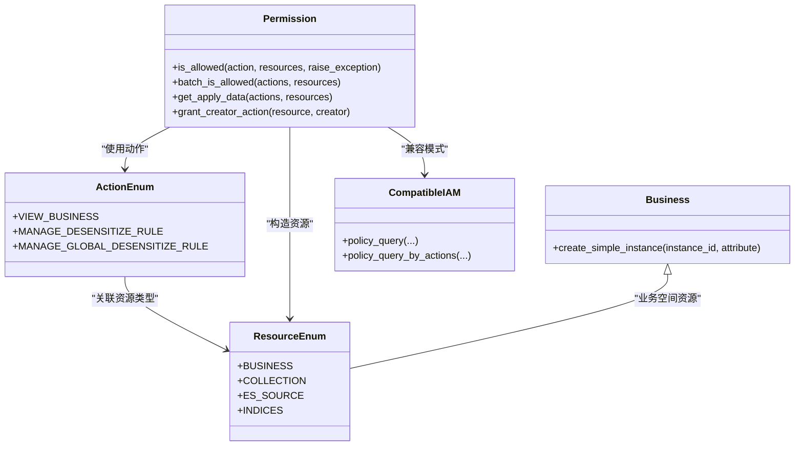
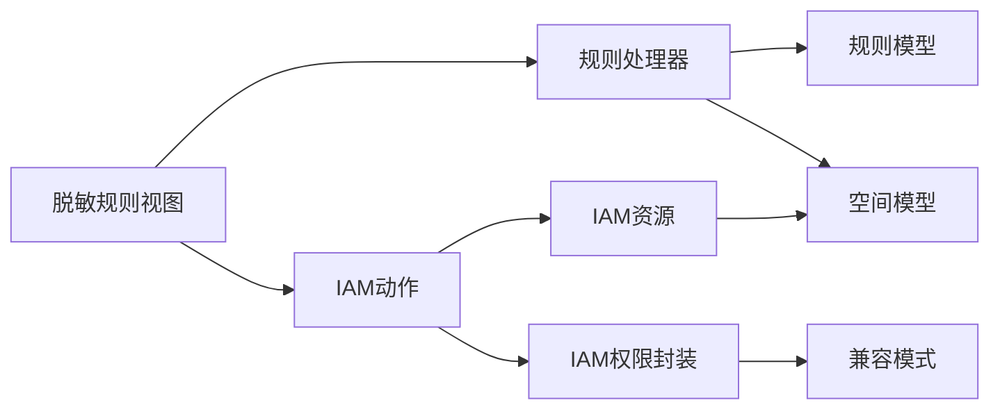

# 权限与隔离机制

<cite>
**本文引用的文件**
- [models.py](file://bklog/apps/log_desensitize/models.py)
- [desensitize_rule_views.py](file://bklog/apps/log_desensitize/views/desensitize_rule_views.py)
- [desensitize.py](file://bklog/apps/log_desensitize/handlers/desensitize.py)
- [constants.py](file://bklog/apps/log_desensitize/constants.py)
- [actions.py](file://bklog/apps/iam/handlers/actions.py)
- [permission.py](file://bklog/apps/iam/handlers/permission.py)
- [resources.py](file://bklog/apps/iam/handlers/resources.py)
- [compatible.py](file://bklog/apps/iam/handlers/compatible.py)
- [urls.py](file://bklog/apps/iam/urls.py)
- [models.py](file://bklog/apps/log_search/models.py)
</cite>

## 目录
1. [简介](#简介)
2. [项目结构](#项目结构)
3. [核心组件](#核心组件)
4. [架构总览](#架构总览)
5. [详细组件分析](#详细组件分析)
6. [依赖关系分析](#依赖关系分析)
7. [性能考量](#性能考量)
8. [故障排查指南](#故障排查指南)
9. [结论](#结论)
10. [附录](#附录)

## 简介
本文件面向“脱敏规则权限管理”，系统性阐述公共规则与空间专属规则的权限控制机制，覆盖规则创建、编辑、删除、启用/停用、查看与使用等全生命周期的权限校验逻辑；解释基于业务空间（space）的数据隔离实现方式与跨空间规则引用的安全策略；梳理IAM权限系统与脱敏规则模块的集成点，包括权限操作定义、资源类型注册与权限检查流程；最后给出多租户环境下共享与管理脱敏规则的最佳实践。

## 项目结构
围绕脱敏规则权限与隔离的关键目录与文件如下：
- 规则模型与视图：bklog/apps/log_desensitize/models.py、bklog/apps/log_desensitize/views/desensitize_rule_views.py、bklog/apps/log_desensitize/handlers/desensitize.py
- IAM集成：bklog/apps/iam/handlers/actions.py、bklog/apps/iam/handlers/permission.py、bklog/apps/iam/handlers/resources.py、bklog/apps/iam/handlers/compatible.py、bklog/apps/iam/urls.py
- 空间与租户：bklog/apps/log_search/models.py（Space、SpaceType、SpaceProperty等）
- 规则类型常量：bklog/apps/log_desensitize/constants.py

图表来源
- [desensitize_rule_views.py](file://bklog/apps/log_desensitize/views/desensitize_rule_views.py#L49-L91)
- [desensitize.py](file://bklog/apps/log_desensitize/handlers/desensitize.py#L254-L428)
- [models.py](file://bklog/apps/log_desensitize/models.py#L29-L80)
- [constants.py](file://bklog/apps/log_desensitize/constants.py#L74-L84)
- [actions.py](file://bklog/apps/iam/handlers/actions.py#L197-L215)
- [permission.py](file://bklog/apps/iam/handlers/permission.py#L57-L120)
- [resources.py](file://bklog/apps/iam/handlers/resources.py#L80-L126)
- [compatible.py](file://bklog/apps/iam/handlers/compatible.py#L29-L127)
- [urls.py](file://bklog/apps/iam/urls.py#L22-L51)
- [models.py](file://bklog/apps/log_search/models.py#L1250-L1346)

章节来源
- [desensitize_rule_views.py](file://bklog/apps/log_desensitize/views/desensitize_rule_views.py#L49-L91)
- [desensitize.py](file://bklog/apps/log_desensitize/handlers/desensitize.py#L254-L428)
- [models.py](file://bklog/apps/log_desensitize/models.py#L29-L80)
- [constants.py](file://bklog/apps/log_desensitize/constants.py#L74-L84)
- [actions.py](file://bklog/apps/iam/handlers/actions.py#L197-L215)
- [permission.py](file://bklog/apps/iam/handlers/permission.py#L57-L120)
- [resources.py](file://bklog/apps/iam/handlers/resources.py#L80-L126)
- [compatible.py](file://bklog/apps/iam/handlers/compatible.py#L29-L127)
- [urls.py](file://bklog/apps/iam/urls.py#L22-L51)
- [models.py](file://bklog/apps/log_search/models.py#L1250-L1346)

## 核心组件
- 规则模型与类型
  - 规则模型包含规则名称、算子、参数、匹配模式、匹配字段、是否启用、是否公共、所属空间等字段，支撑公共与空间专属两类规则的存储与查询。
  - 规则类型枚举支持“全局”“业务空间”“全部”三种列表过滤模式，用于前端筛选与后端查询。
- 视图层权限入口
  - 视图根据REST动作（如list/retrieve/create/update/destroy/start/stop）动态决定权限校验策略，区分公共规则与空间专属规则。
- 规则处理器
  - 提供规则创建/更新、列表、详情、删除、启用/停用、正则/规则调试、命中匹配、预览等功能；列表与匹配均结合空间维度进行过滤。
- IAM集成
  - 定义权限动作（如“脱敏规则管理”“全局脱敏规则管理”）、资源类型（业务空间）、权限检查封装（Permission）、兼容模式（CompatibleIAM），并提供IAM资源接口路由。

章节来源
- [models.py](file://bklog/apps/log_desensitize/models.py#L29-L80)
- [constants.py](file://bklog/apps/log_desensitize/constants.py#L74-L84)
- [desensitize_rule_views.py](file://bklog/apps/log_desensitize/views/desensitize_rule_views.py#L49-L91)
- [desensitize.py](file://bklog/apps/log_desensitize/handlers/desensitize.py#L254-L428)
- [actions.py](file://bklog/apps/iam/handlers/actions.py#L197-L215)
- [permission.py](file://bklog/apps/iam/handlers/permission.py#L57-L120)
- [resources.py](file://bklog/apps/iam/handlers/resources.py#L80-L126)
- [compatible.py](file://bklog/apps/iam/handlers/compatible.py#L29-L127)
- [urls.py](file://bklog/apps/iam/urls.py#L22-L51)

## 架构总览
脱敏规则权限与隔离的整体流程如下：
- 用户发起规则相关请求（创建/更新/删除/启用/停用/列表/详情/匹配/预览等）。
- 视图层根据REST动作与请求参数（如is_public、space_uid）选择权限校验策略：
  - 公共规则：使用全局动作（如“全局脱敏规则管理”）。
  - 空间专属规则：使用业务动作（如“脱敏规则管理”），并以space_uid作为资源约束。
- 权限检查通过后，进入规则处理器执行具体业务逻辑；处理器在列表与匹配阶段按空间维度过滤数据，确保数据隔离。
- IAM侧完成动作与资源的注册、兼容模式适配与批量鉴权。

图表来源
- [desensitize_rule_views.py](file://bklog/apps/log_desensitize/views/desensitize_rule_views.py#L49-L91)
- [permission.py](file://bklog/apps/iam/handlers/permission.py#L249-L284)
- [desensitize.py](file://bklog/apps/log_desensitize/handlers/desensitize.py#L317-L428)

## 详细组件分析

### 规则模型与数据隔离
- 关键字段
  - is_public：标记规则是否为公共规则。
  - space_uid：空间唯一标识，用于空间专属规则与数据隔离。
  - match_fields/match_pattern/operator/params：规则匹配与执行所需的核心配置。
- 数据隔离策略
  - 列表与匹配逻辑均依据space_uid过滤空间专属规则，确保不同空间之间互不可见。
  - 公共规则不受space_uid限制，但受全局动作权限控制。

图表来源
- [models.py](file://bklog/apps/log_desensitize/models.py#L29-L80)

章节来源
- [models.py](file://bklog/apps/log_desensitize/models.py#L29-L80)
- [desensitize.py](file://bklog/apps/log_desensitize/handlers/desensitize.py#L317-L428)

### 视图层权限校验逻辑
- 查看（list/retrieve）
  - 若规则为公共规则，无需业务空间权限，直接放行。
  - 若规则为空间专属规则，需具备“业务访问”权限（对应空间）。
- 写操作（create/update/destroy/start/stop）
  - 公共规则：需“全局脱敏规则管理”权限。
  - 空间专属规则：需“脱敏规则管理”权限（资源为space_uid）。

图表来源
- [desensitize_rule_views.py](file://bklog/apps/log_desensitize/views/desensitize_rule_views.py#L49-L91)

章节来源
- [desensitize_rule_views.py](file://bklog/apps/log_desensitize/views/desensitize_rule_views.py#L49-L91)

### 规则处理器与空间过滤
- 列表与匹配
  - 列表：根据规则类型（全部/公共/空间）过滤规则集合，并统计规则接入场景与数量。
  - 匹配：仅对当前空间与公共规则生效，优先公共规则再叠加空间专属规则。
- 预览与调试
  - 预览：支持字段级与原文字段的脱敏预览，内部构建脱敏配置并执行流水线处理。
  - 调试：提供正则命中高亮与规则脱敏效果预览。

图表来源
- [desensitize.py](file://bklog/apps/log_desensitize/handlers/desensitize.py#L317-L428)

章节来源
- [desensitize.py](file://bklog/apps/log_desensitize/handlers/desensitize.py#L317-L428)

### IAM权限系统集成点
- 权限动作定义
  - “脱敏规则管理”（业务空间）与“全局脱敏规则管理”（公共规则）分别用于空间专属与公共规则的写操作。
- 资源类型注册
  - 业务空间资源（space）注册到IAM，支持从space_uid或bk_biz_id解析并生成路径。
- 权限检查流程
  - Permission封装了动作与资源的请求构造、批量鉴权、无权限跳转申请数据生成、演示业务豁免等。
  - CompatibleIAM提供兼容模式，支持v1/v2动作与资源表达式的转换与合并，便于平滑升级。
- IAM资源接口
  - IAM路由注册资源提供器（如collection/es_source/indices），并提供meta与resource接口。

图表来源
- [actions.py](file://bklog/apps/iam/handlers/actions.py#L197-L215)
- [permission.py](file://bklog/apps/iam/handlers/permission.py#L249-L314)
- [resources.py](file://bklog/apps/iam/handlers/resources.py#L80-L126)
- [compatible.py](file://bklog/apps/iam/handlers/compatible.py#L29-L127)
- [urls.py](file://bklog/apps/iam/urls.py#L22-L51)

章节来源
- [actions.py](file://bklog/apps/iam/handlers/actions.py#L197-L215)
- [permission.py](file://bklog/apps/iam/handlers/permission.py#L249-L314)
- [resources.py](file://bklog/apps/iam/handlers/resources.py#L80-L126)
- [compatible.py](file://bklog/apps/iam/handlers/compatible.py#L29-L127)
- [urls.py](file://bklog/apps/iam/urls.py#L22-L51)

### 跨空间规则引用与安全策略
- 当前实现
  - 规则列表与匹配逻辑仅对当前空间与公共规则生效，避免跨空间直接引用。
  - 规则处理器在预览与匹配阶段均以空间维度过滤，确保不会越权使用其他空间的规则。
- 安全建议
  - 若未来需要跨空间引用，应在规则模型中引入“引用关系”字段，并在权限校验时对目标空间追加“业务访问”权限检查。
  - 引用关系应记录来源空间与目标空间，便于审计与回收。

章节来源
- [desensitize.py](file://bklog/apps/log_desensitize/handlers/desensitize.py#L317-L428)

## 依赖关系分析
- 视图依赖规则处理器与IAM权限封装，处理器依赖规则模型与空间模型。
- IAM动作与资源类型相互绑定，资源解析依赖空间模型与工具函数。
- 兼容模式贯穿权限检查，保证v1/v2策略的兼容与合并。

图表来源
- [desensitize_rule_views.py](file://bklog/apps/log_desensitize/views/desensitize_rule_views.py#L49-L91)
- [desensitize.py](file://bklog/apps/log_desensitize/handlers/desensitize.py#L254-L428)
- [models.py](file://bklog/apps/log_desensitize/models.py#L29-L80)
- [models.py](file://bklog/apps/log_search/models.py#L1250-L1346)
- [actions.py](file://bklog/apps/iam/handlers/actions.py#L197-L215)
- [permission.py](file://bklog/apps/iam/handlers/permission.py#L249-L314)
- [resources.py](file://bklog/apps/iam/handlers/resources.py#L80-L126)
- [compatible.py](file://bklog/apps/iam/handlers/compatible.py#L29-L127)

章节来源
- [desensitize_rule_views.py](file://bklog/apps/log_desensitize/views/desensitize_rule_views.py#L49-L91)
- [desensitize.py](file://bklog/apps/log_desensitize/handlers/desensitize.py#L254-L428)
- [models.py](file://bklog/apps/log_desensitize/models.py#L29-L80)
- [models.py](file://bklog/apps/log_search/models.py#L1250-L1346)
- [actions.py](file://bklog/apps/iam/handlers/actions.py#L197-L215)
- [permission.py](file://bklog/apps/iam/handlers/permission.py#L249-L314)
- [resources.py](file://bklog/apps/iam/handlers/resources.py#L80-L126)
- [compatible.py](file://bklog/apps/iam/handlers/compatible.py#L29-L127)

## 性能考量
- 列表与匹配阶段的数据库查询应尽量使用索引字段（如space_uid、index_set_id、rule_id）以减少扫描范围。
- 批量权限检查（batch_is_allowed）可显著降低多次IAM调用开销，建议在批量场景中使用。
- 兼容模式下的策略合并与表达式计算可能带来额外CPU消耗，建议在高频路径中缓存策略结果或减少重复计算。

## 故障排查指南
- 无权限/跳转申请
  - 当权限检查失败时，系统会生成无权限交互数据与申请URL，可通过日志定位具体动作与资源。
- 演示业务豁免
  - 在演示业务场景下，读权限可能被豁免，写权限默认关闭，注意区分演示与生产环境差异。
- 兼容模式问题
  - v1/v2动作与资源表达式转换失败时，检查兼容模式开关与策略合并逻辑，必要时回退至v1策略或修正表达式。

章节来源
- [permission.py](file://bklog/apps/iam/handlers/permission.py#L174-L223)
- [permission.py](file://bklog/apps/iam/handlers/permission.py#L249-L314)
- [compatible.py](file://bklog/apps/iam/handlers/compatible.py#L29-L127)

## 结论
本方案通过“公共规则+空间专属规则”的双轨制与严格的IAM权限控制，实现了脱敏规则在多租户环境下的安全隔离与可控共享。视图层按动作与规则属性动态选择权限校验策略，处理器在列表与匹配阶段严格遵循空间维度过滤，确保跨空间不可见与不可用。IAM侧通过动作与资源注册、兼容模式与批量鉴权，提供了稳定可靠的权限检查能力。未来如需跨空间引用，可在现有基础上扩展引用关系与权限校验，保持安全边界清晰。

## 附录
- 最佳实践
  - 公共规则仅用于通用、低风险场景，空间专属规则用于业务定制化需求。
  - 创建规则时明确is_public与space_uid，避免误配导致越权。
  - 对频繁调用的列表与匹配接口，优先使用批量权限检查与缓存策略。
  - 在多租户环境下，建议为每个租户配置独立的IAM系统与资源命名空间，避免冲突。