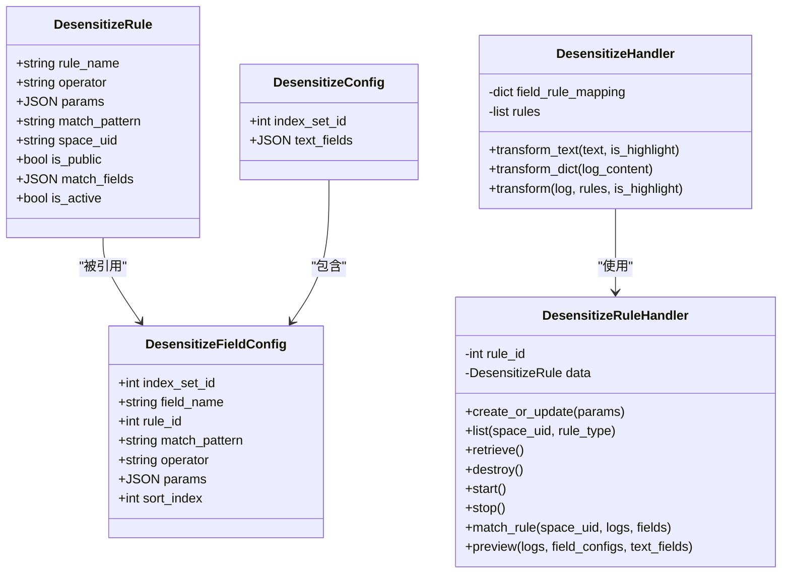
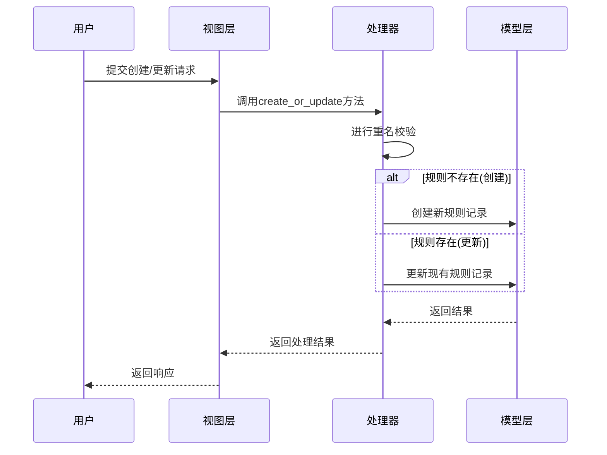
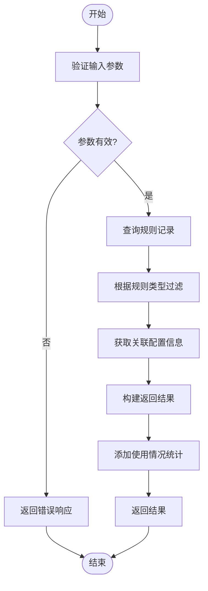
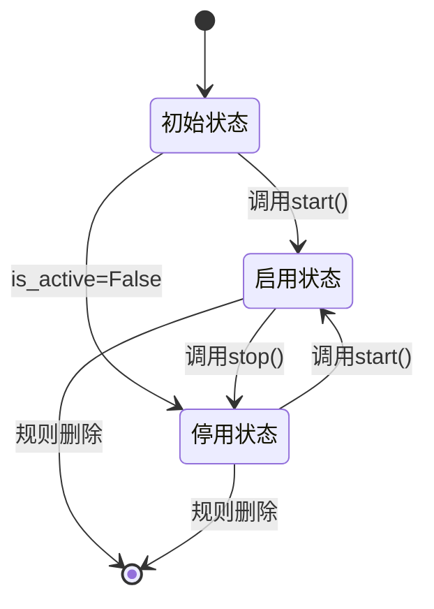
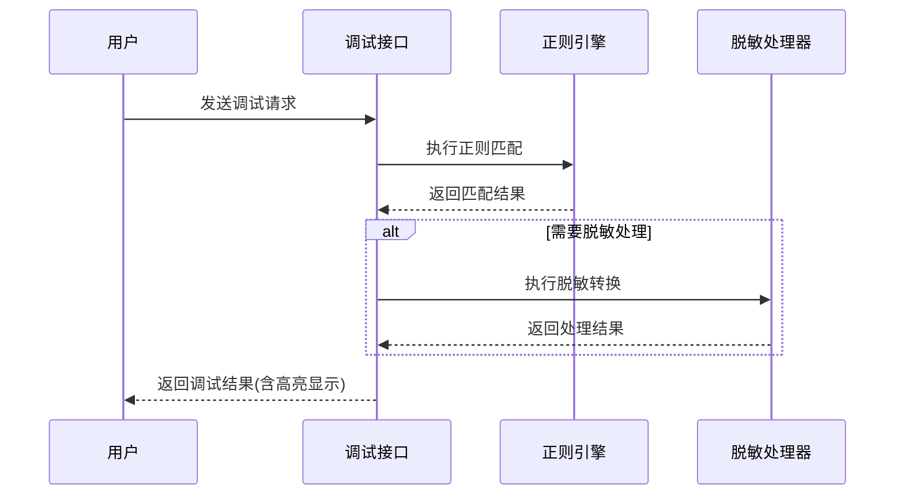
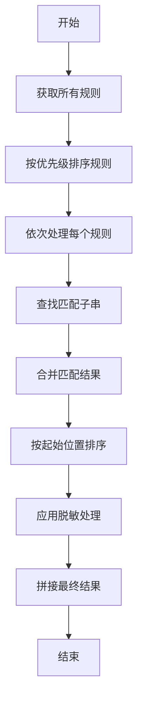
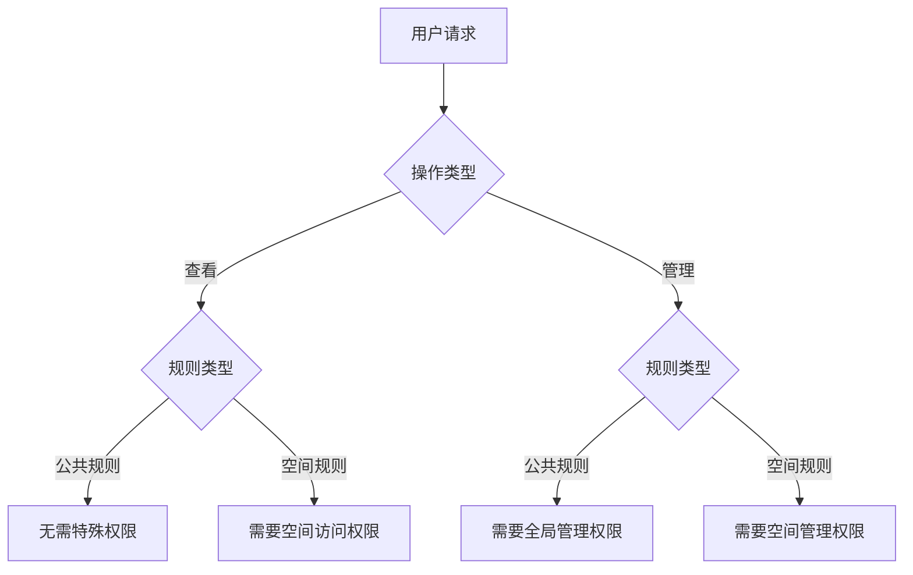
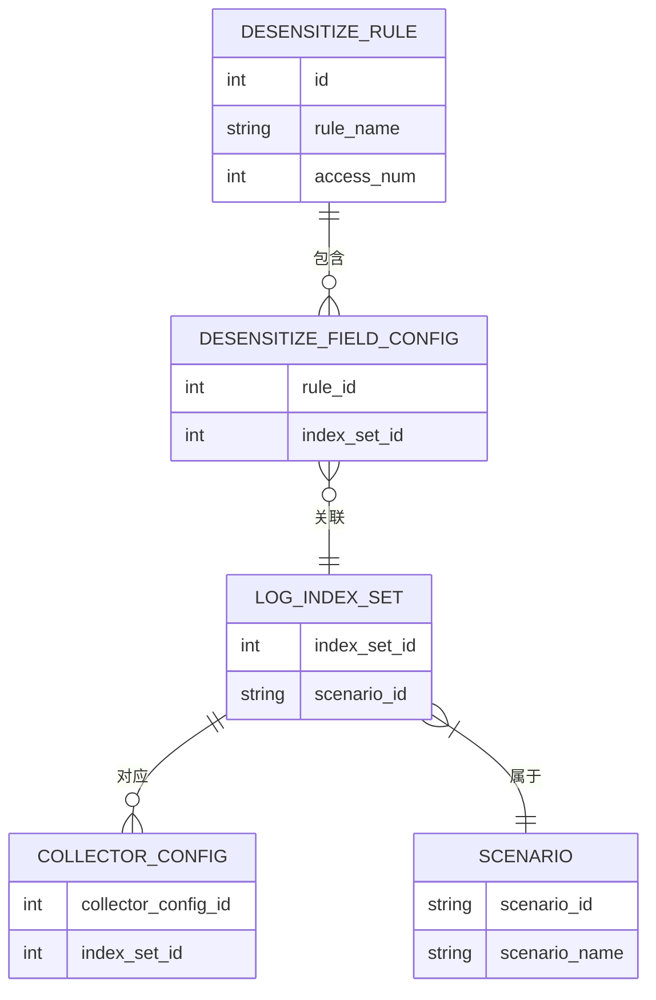

# 脱敏规则管理

<cite>
**本文档引用文件**  
- [models.py](file://bklog/apps/log_desensitize/models.py)
- [desensitize.py](file://bklog/apps/log_desensitize/handlers/desensitize.py)
- [desensitize_rule_views.py](file://bklog/apps/log_desensitize/views/desensitize_rule_views.py)
- [serializers.py](file://bklog/apps/log_desensitize/serializers.py)
- [constants.py](file://bklog/apps/log_desensitize/constants.py)
</cite>

## 目录
1. [简介](#简介)
2. [核心功能](#核心功能)
3. [规则创建与更新](#规则创建与更新)
4. [规则查询与删除](#规则查询与删除)
5. [启用/停用状态管理](#启用停用状态管理)
6. [规则调试与正则测试](#规则调试与正则测试)
7. [规则优先级与冲突处理](#规则优先级与冲突处理)
8. [权限控制机制](#权限控制机制)
9. [使用情况统计](#使用情况统计)
10. [实际应用示例](#实际应用示例)
11. [常见正则表达式参考](#常见正则表达式参考)

## 简介
脱敏规则管理功能为日志平台提供了一套完整的敏感信息保护机制。该功能允许用户创建、更新、删除和查询脱敏规则，通过定义规则名称、匹配模式、匹配字段等配置项来实现对敏感数据的识别和处理。系统支持公共规则与空间专属规则两种类型，具备规则启用/停用状态管理、规则调试和正则表达式测试等辅助功能。本文档将全面介绍脱敏规则管理的各项功能及其使用方法。

## 核心功能
脱敏规则管理功能主要包括规则的增删改查操作、状态管理、调试测试、优先级处理、权限控制和使用统计等核心模块。系统通过`DesensitizeRule`模型存储规则基本信息，包括规则名称、算子类型、参数配置、匹配模式、匹配字段、空间标识、是否为公共规则以及是否启用等属性。规则的处理逻辑由`DesensitizeHandler`类实现，该类负责根据配置规则列表以流水线方式处理日志数据。



**图源**  
- [models.py](file://bklog/apps/log_desensitize/models.py)
- [desensitize.py](file://bklog/apps/log_desensitize/handlers/desensitize.py)

**本节来源**  
- [models.py](file://bklog/apps/log_desensitize/models.py)
- [desensitize.py](file://bklog/apps/log_desensitize/handlers/desensitize.py)

## 规则创建与更新
脱敏规则的创建和更新操作通过`DesensitizeRuleHandler`类的`create_or_update`方法实现。在创建或更新规则时，系统会进行重名校验，确保在同一作用域内规则名称的唯一性。规则的作用域由`is_public`字段决定，当其值为`true`时表示该规则为公共规则，否则为特定空间的专属规则。

创建规则时需要提供以下配置项：
- **规则名称**(rule_name)：规则的标识名称
- **匹配模式**(match_pattern)：用于匹配敏感信息的正则表达式
- **匹配字段**(match_fields)：指定需要应用此规则的字段名列表
- **脱敏算子**(operator)：选择具体的脱敏处理方式
- **算子参数**(operator_params)：根据所选算子提供的具体参数配置
- **是否为公共规则**(is_public)：定义规则的作用范围

系统支持两种脱敏算子：掩码屏蔽(mask_shield)和文本替换(text_replace)。掩码屏蔽算子可配置保留前后位数及替换符号，文本替换算子则可设置替换模板字符串。



**图源**  
- [desensitize.py](file://bklog/apps/log_desensitize/handlers/desensitize.py#L268-L315)
- [desensitize_rule_views.py](file://bklog/apps/log_desensitize/views/desensitize_rule_views.py#L165-L246)

**本节来源**  
- [desensitize.py](file://bklog/apps/log_desensitize/handlers/desensitize.py#L268-L315)
- [desensitize_rule_views.py](file://bklog/apps/log_desensitize/views/desensitize_rule_views.py#L165-L246)

## 规则查询与删除
脱敏规则的查询功能支持根据空间标识和规则类型进行筛选，可获取公共规则、特定空间规则或两者合并的结果。查询接口通过`DesensitizeRuleHandler`类的`list`方法实现，该方法接受`space_uid`和`rule_type`两个参数来确定查询范围。

规则删除操作通过`destroy`方法实现，执行后将从数据库中移除对应的规则记录。在查询结果中，系统还会包含规则的使用情况统计信息，如接入项总数和具体的接入场景详情。

查询时可指定的规则类型包括：
- **public**：仅返回全局公共规则
- **space**：仅返回指定空间的业务规则
- **all**：返回全局规则和指定空间规则的合并结果



**图源**  
- [desensitize.py](file://bklog/apps/log_desensitize/handlers/desensitize.py#L317-L428)
- [desensitize_rule_views.py](file://bklog/apps/log_desensitize/views/desensitize_rule_views.py#L93-L163)

**本节来源**  
- [desensitize.py](file://bklog/apps/log_desensitize/handlers/desensitize.py#L317-L428)
- [desensitize_rule_views.py](file://bklog/apps/log_desensitize/views/desensitize_rule_views.py#L93-L163)

## 启用/停用状态管理
脱敏规则的启用和停用状态通过`is_active`字段进行管理。系统提供了专门的接口来切换规则的状态，分别对应`start`（启用）和`stop`（停用）操作。这两个操作都通过更新规则记录的`is_active`字段值来实现。

当规则处于启用状态时(`is_active=True`)，它将参与日志数据的脱敏处理流程；当规则被停用时(`is_active=False`)，即使其他条件匹配，该规则也不会被执行。这种机制使得管理员可以灵活地控制哪些规则生效，而无需删除规则定义。

状态管理接口的特点：
- **原子性操作**：状态变更是一次数据库更新操作
- **即时生效**：状态变更后立即影响后续的日志处理
- **可逆性**：可以在启用和停用状态之间自由切换



**图源**  
- [desensitize.py](file://bklog/apps/log_desensitize/handlers/desensitize.py#L509-L521)
- [desensitize_rule_views.py](file://bklog/apps/log_desensitize/views/desensitize_rule_views.py#L349-L379)

**本节来源**  
- [desensitize.py](file://bklog/apps/log_desensitize/handlers/desensitize.py#L509-L521)
- [desensitize_rule_views.py](file://bklog/apps/log_desensitize/views/desensitize_rule_views.py#L349-L379)

## 规则调试与正则测试
系统提供了规则调试和正则表达式测试功能，帮助用户验证规则配置的正确性。正则测试功能通过`regex_debug`方法实现，它接受日志样例和正则表达式作为输入，返回匹配结果并用`<mark>`标签高亮显示匹配部分。

规则调试功能则更进一步，不仅测试正则匹配，还实际执行脱敏处理。通过`rule_debug`方法，用户可以预览在指定算子和参数配置下，日志样例经过脱敏处理后的效果。这对于验证复杂规则的处理逻辑非常有用。

调试功能的主要用途：
- 验证正则表达式的匹配准确性
- 预览脱敏处理的实际效果
- 调试算子参数配置的合理性
- 快速迭代规则配置



**图源**  
- [desensitize.py](file://bklog/apps/log_desensitize/handlers/desensitize.py#L487-L507)
- [desensitize_rule_views.py](file://bklog/apps/log_desensitize/views/desensitize_rule_views.py#L297-L348)

**本节来源**  
- [desensitize.py](file://bklog/apps/log_desensitize/handlers/desensitize.py#L487-L507)
- [desensitize_rule_views.py](file://bklog/apps/log_desensitize/views/desensitize_rule_views.py#L297-L348)

## 规则优先级与冲突处理
脱敏规则的优先级通过`sort_index`字段进行管理，数值越小表示优先级越高。系统在处理规则时会按照优先级顺序执行，确保高优先级规则先于低优先级规则应用。

当多个规则可能同时匹配同一段文本时，系统采用合并子串匹配结果的策略来处理冲突。具体流程如下：
1. 分别找出每个规则匹配的所有子串
2. 按起始位置排序所有匹配结果
3. 合并重叠的匹配区域，优先保留先匹配到的内容
4. 按顺序应用各个规则的脱敏处理

这种处理方式保证了规则执行的确定性和可预测性，避免了因规则顺序不同而导致的处理结果差异。

优先级处理的关键特性：
- **确定性**：相同输入总是产生相同输出
- **可预测性**：用户可以根据优先级设置预期处理结果
- **灵活性**：支持复杂的规则组合和嵌套处理



**图源**  
- [desensitize.py](file://bklog/apps/log_desensitize/handlers/desensitize.py#L110-L116)
- [desensitize.py](file://bklog/apps/log_desensitize/handlers/desensitize.py#L228-L251)

**本节来源**  
- [desensitize.py](file://bklog/apps/log_desensitize/handlers/desensitize.py#L110-L116)
- [desensitize.py](file://bklog/apps/log_desensitize/handlers/desensitize.py#L228-L251)

## 权限控制机制
脱敏规则管理系统实现了细粒度的权限控制机制，区分公共规则和空间专属规则的不同访问权限。权限控制主要体现在以下几个方面：

对于**查看权限**：
- 公共规则：所有用户可见
- 空间专属规则：需要具备相应空间的访问权限

对于**管理权限**：
- 公共规则：需要具备全局脱敏规则管理权限
- 空间专属规则：需要具备相应空间的脱敏规则管理权限

系统通过`get_permissions`方法动态确定当前操作所需的权限，根据操作类型（查看、创建、更新、删除等）和规则类型（公共或专属）来返回相应的权限要求。

权限控制策略：
- **最小权限原则**：只授予完成操作所必需的最低权限
- **分离关注点**：公共规则和业务规则的管理权限分离
- **基于角色的访问控制**：通过预定义的操作枚举来管理权限



**图源**  
- [desensitize_rule_views.py](file://bklog/apps/log_desensitize/views/desensitize_rule_views.py#L49-L91)

**本节来源**  
- [desensitize_rule_views.py](file://bklog/apps/log_desensitize/views/desensitize_rule_views.py#L49-L91)

## 使用情况统计
系统为每条脱敏规则提供了详细的使用情况统计信息，帮助管理员了解规则的实际应用范围。统计信息包括接入项总数和具体的接入场景详情。

统计信息的获取流程：
1. 查询与规则关联的字段配置记录
2. 获取关联的索引集ID集合
3. 查询索引集对象以确定接入场景
4. 根据场景类型获取对应的采集配置信息
5. 汇总统计结果并构建返回数据

返回的统计信息包含以下内容：
- **接入项总数**(access_num)：使用该规则的索引集总数
- **接入场景详情**(access_info)：按场景分类的详细使用情况
  - 场景ID(scenario_id)
  - 场景名称(scenario_name)
  - 具体ID列表(ids)

这些统计信息对于评估规则的影响范围、优化规则配置以及进行容量规划都非常有价值。



**图源**  
- [desensitize.py](file://bklog/apps/log_desensitize/handlers/desensitize.py#L340-L427)
- [models.py](file://bklog/apps/log_desensitize/models.py)

**本节来源**  
- [desensitize.py](file://bklog/apps/log_desensitize/handlers/desensitize.py#L340-L427)
- [models.py](file://bklog/apps/log_desensitize/models.py)

## 实际应用示例
以下是一些典型的脱敏规则应用场景示例：

### 手机号脱敏
```json
{
  "rule_name": "手机号脱敏",
  "match_fields": ["phone", "mobile"],
  "match_pattern": "1[3-9]\\d{9}",
  "operator": "mask_shield",
  "params": {
    "preserve_head": 3,
    "preserve_tail": 4,
    "replace_mark": "*"
  },
  "is_public": true
}
```
此规则用于处理手机号字段，保留前3位和后4位，中间部分用星号替换。

### 邮箱地址脱敏
```json
{
  "rule_name": "邮箱脱敏",
  "match_fields": ["email", "mail"],
  "match_pattern": "[a-zA-Z0-9._%+-]+@[a-zA-Z0-9.-]+\\.[a-zA-Z]{2,}",
  "operator": "text_replace",
  "params": {
    "template_string": "邮箱信息已脱敏"
  },
  "is_public": true
}
```
此规则将完整的邮箱地址替换为固定的提示文本。

### 身份证号脱敏
```json
{
  "rule_name": "身份证号脱敏",
  "match_fields": ["id_card", "identity"],
  "match_pattern": "\\d{6}[\\*]{8}\\d{3}[0-9X]",
  "operator": "mask_shield",
  "params": {
    "preserve_head": 6,
    "preserve_tail": 3,
    "replace_mark": "*"
  },
  "is_public": true
}
```
此规则处理18位身份证号码，保留前6位和地区码，中间8位用星号替换。

这些示例展示了如何根据不同业务需求创建合适的脱敏规则，保护敏感个人信息的同时保持数据的可用性。

**本节来源**  
- [desensitize.py](file://bklog/apps/log_desensitize/handlers/desensitize.py)
- [serializers.py](file://bklog/apps/log_desensitize/serializers.py)

## 常见正则表达式参考
以下是常用敏感信息的正则表达式模式参考：

| 敏感信息类型 | 正则表达式模式 | 说明 |
|------------|-------------|------|
| 手机号码 | `1[3-9]\d{9}` | 匹配11位手机号，首位为1，第二位3-9 |
| 固定电话 | `(?:\d{3}-?\d{8}|\d{4}-?\d{7})` | 匹配区号+号码格式，支持有无连字符 |
| 邮箱地址 | `[a-zA-Z0-9._%+-]+@[a-zA-Z0-9.-]+\.[a-zA-Z]{2,}` | 标准邮箱格式匹配 |
| 身份证号 | `\d{6}[0-9Xx]\d{8}[0-9Xx]` | 匹配18位身份证号码，含校验位 |
| 银行卡号 | `\d{16,19}` | 匹配16-19位数字的银行卡号 |
| IP地址 | `\b(?:[0-9]{1,3}\.){3}[0-9]{1,3}\b` | 匹配IPv4地址格式 |
| MAC地址 | `([0-9A-Fa-f]{2}[:-]){5}([0-9A-Fa-f]{2})` | 匹配标准MAC地址格式 |
| URL链接 | `https?://[^\s]+` | 匹配HTTP/HTTPS协议的URL |
| 日期格式 | `\d{4}-\d{2}-\d{2}` | 匹配YYYY-MM-DD格式日期 |
| 时间格式 | `\d{2}:\d{2}:\d{2}` | 匹配HH:MM:SS格式时间 |

使用这些正则表达式时需要注意：
- 根据实际数据格式调整表达式细节
- 在生产环境使用前充分测试验证
- 考虑性能影响，避免过于复杂的正则表达式
- 定期审查和更新正则表达式以适应数据变化

**本节来源**  
- [desensitize.py](file://bklog/apps/log_desensitize/handlers/desensitize.py)
- [serializers.py](file://bklog/apps/log_desensitize/serializers.py)