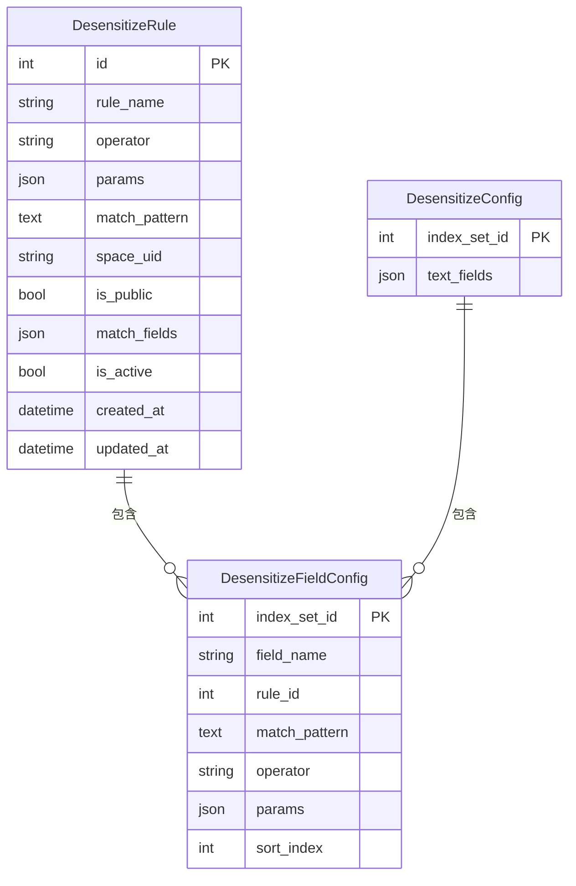
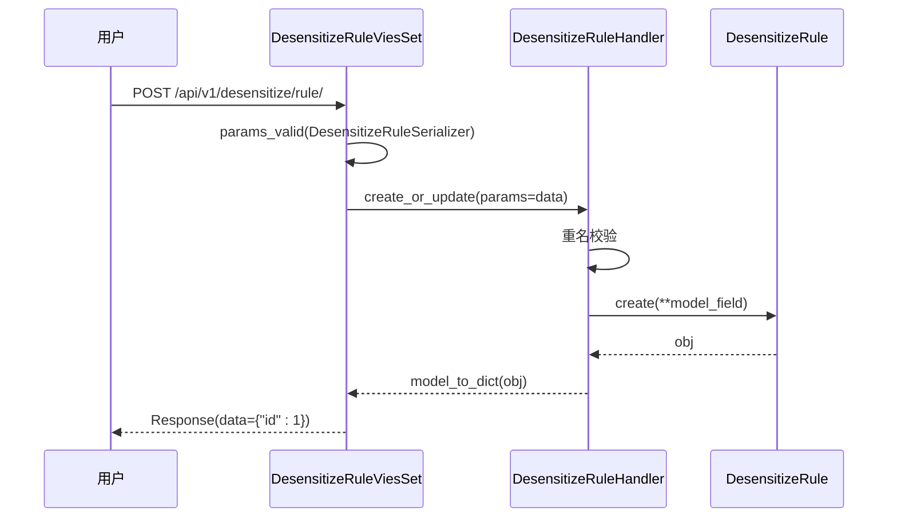
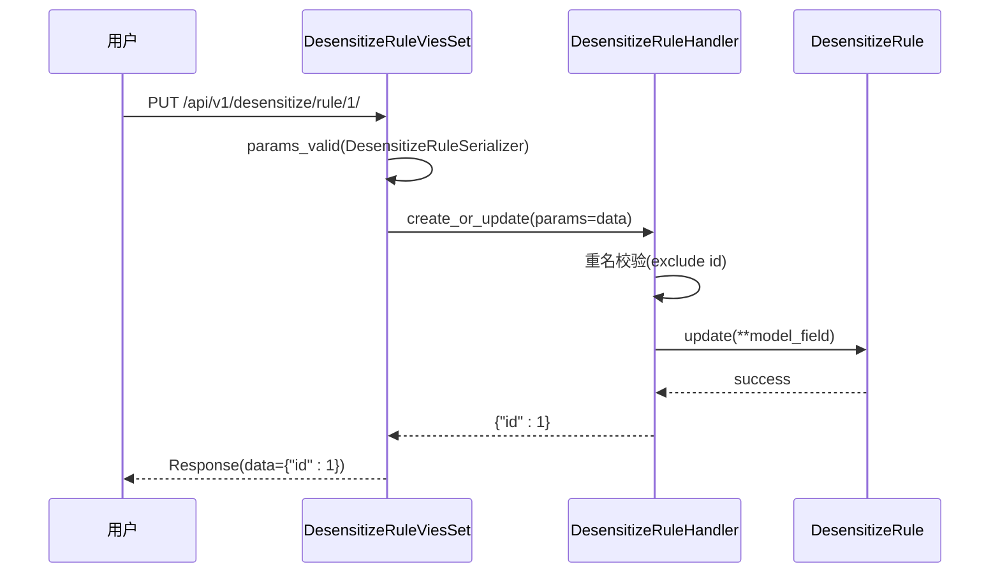
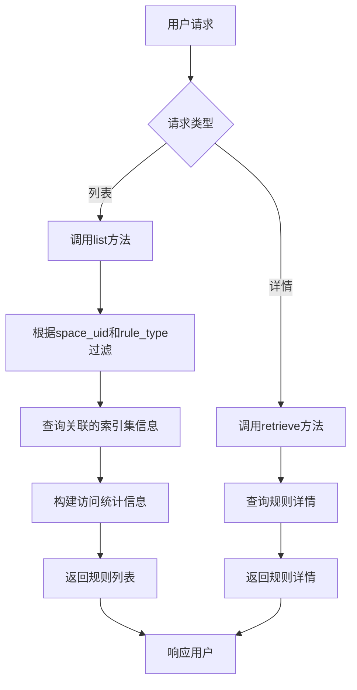
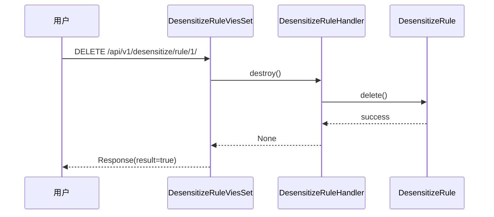
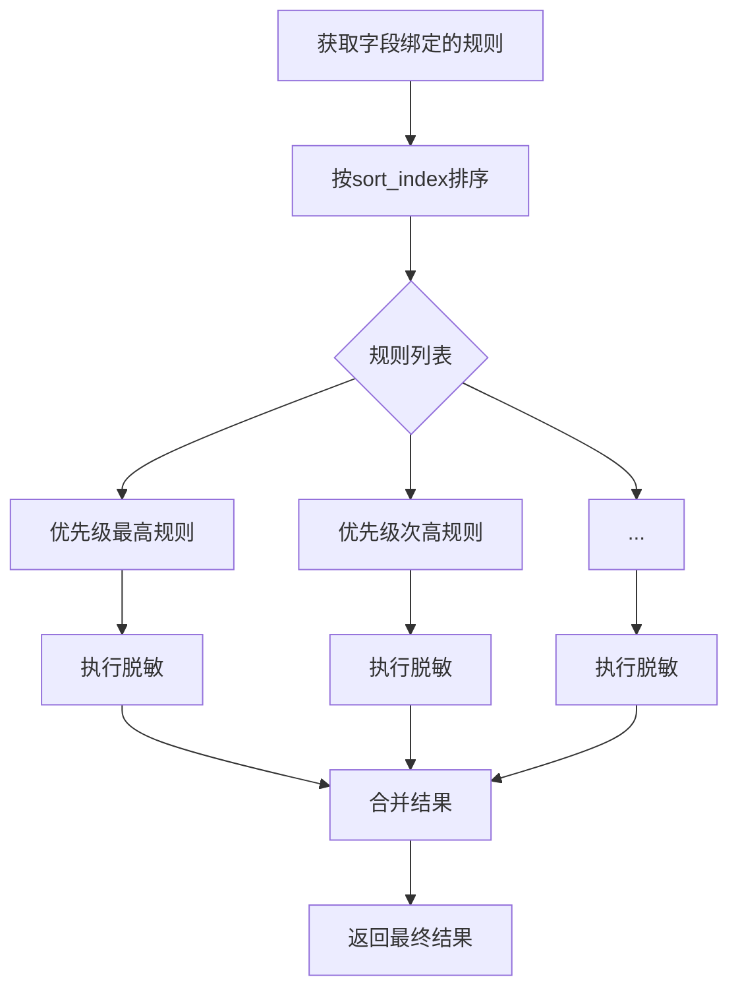
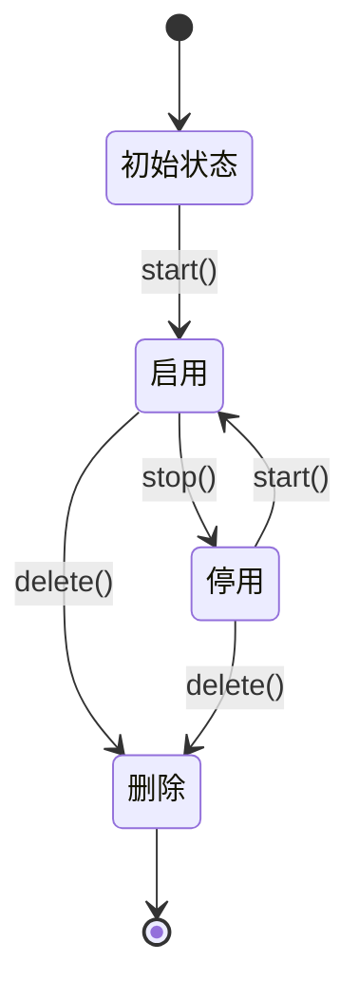
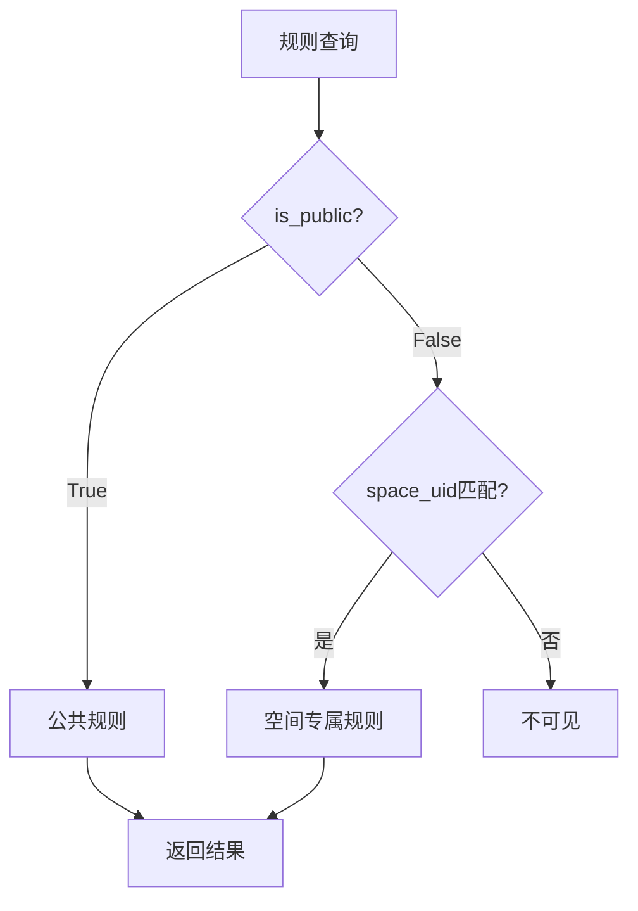

# 脱敏规则配置

<cite>
**本文档引用文件**  
- [models.py](file://bklog/apps/log_desensitize/models.py)
- [desensitize.py](file://bklog/apps/log_desensitize/handlers/desensitize.py)
- [desensitize_rule_views.py](file://bklog/apps/log_desensitize/views/desensitize_rule_views.py)
- [serializers.py](file://bklog/apps/log_desensitize/serializers.py)
- [constants.py](file://bklog/apps/log_desensitize/constants.py)
</cite>

## 目录
1. [简介](#简介)
2. [核心数据模型](#核心数据模型)
3. [规则操作接口](#规则操作接口)
4. [规则优先级与冲突处理](#规则优先级与冲突处理)
5. [规则状态管理](#规则状态管理)
6. [公共规则与空间专属规则](#公共规则与空间专属规则)
7. [实际应用示例](#实际应用示例)
8. [常见正则表达式模式参考](#常见正则表达式模式参考)

## 简介

脱敏规则配置功能为日志平台提供了灵活的数据脱敏能力，允许用户创建、更新、删除和查询脱敏规则。该功能支持通过匹配模式、匹配字段和脱敏操作类型等核心配置项来定义规则，并提供了规则优先级处理、启用/停用状态管理以及公共规则与空间专属规则的区分机制。本文档将全面介绍这些功能的实现细节和使用方法。

## 核心数据模型

脱敏规则系统由三个核心模型构成：脱敏规则（DesensitizeRule）、脱敏配置（DesensitizeConfig）和脱敏字段配置（DesensitizeFieldConfig）。这些模型共同定义了脱敏规则的存储结构和数据关系。



**图源**  
- [models.py](file://bklog/apps/log_desensitize/models.py#L29-L80)

### 脱敏规则（DesensitizeRule）

脱敏规则是脱敏系统的核心实体，定义了具体的脱敏逻辑。其主要字段包括：

- **规则名称（rule_name）**：规则的唯一标识名称，用于区分不同的脱敏规则。
- **脱敏算子（operator）**：执行脱敏操作的类型，目前支持"掩码屏蔽"和"文本替换"两种类型。
- **脱敏参数（params）**：根据脱敏算子类型而定的参数配置，如掩码屏蔽的保留位数和替换符号。
- **匹配模式（match_pattern）**：用于匹配需要脱敏内容的正则表达式。
- **匹配字段（match_fields）**：指定规则适用的字段名称列表。
- **是否公共（is_public）**：标识规则是否为公共规则，公共规则可被所有空间使用。
- **是否启用（is_active）**：控制规则的启用状态，停用的规则不会被执行。

**节源**  
- [models.py](file://bklog/apps/log_desensitize/models.py#L29-L47)

### 脱敏配置（DesensitizeConfig）

脱敏配置关联到特定的索引集，定义了该索引集下的脱敏设置。主要包含：

- **索引集ID（index_set_id）**：关联的索引集唯一标识。
- **日志原文字段（text_fields）**：需要进行脱敏处理的日志原文字段列表。

**节源**  
- [models.py](file://bklog/apps/log_desensitize/models.py#L49-L61)

### 脱敏字段配置（DesensitizeFieldConfig）

脱敏字段配置定义了字段与脱敏规则之间的绑定关系，以及执行优先级。其关键字段有：

- **字段名称（field_name）**：应用脱敏规则的具体字段名。
- **规则ID（rule_id）**：关联的脱敏规则ID。
- **优先级（sort_index）**：规则执行的优先级，数值越小优先级越高。
- **匹配模式（match_pattern）**：字段级别的匹配模式，可覆盖规则级别的设置。

**节源**  
- [models.py](file://bklog/apps/log_desensitize/models.py#L63-L80)

## 规则操作接口

系统提供了完整的RESTful API接口来管理脱敏规则，包括创建、读取、更新和删除操作。

### 创建规则

通过POST请求创建新的脱敏规则，需要提供规则名称、匹配模式、匹配字段、脱敏算子和参数等信息。



**图源**  
- [desensitize_rule_views.py](file://bklog/apps/log_desensitize/views/desensitize_rule_views.py#L165-L207)
- [desensitize.py](file://bklog/apps/log_desensitize/handlers/desensitize.py#L268-L312)

### 更新规则

通过PUT请求更新现有脱敏规则，使用规则ID作为路径参数。



**图源**  
- [desensitize_rule_views.py](file://bklog/apps/log_desensitize/views/desensitize_rule_views.py#L208-L246)
- [desensitize.py](file://bklog/apps/log_desensitize/handlers/desensitize.py#L268-L315)

### 查询规则

通过GET请求获取脱敏规则列表或详情，支持按空间和规则类型进行过滤。



**图源**  
- [desensitize_rule_views.py](file://bklog/apps/log_desensitize/views/desensitize_rule_views.py#L93-L281)
- [desensitize.py](file://bklog/apps/log_desensitize/handlers/desensitize.py#L317-L428)

### 删除规则

通过DELETE请求删除指定的脱敏规则。



**图源**  
- [desensitize_rule_views.py](file://bklog/apps/log_desensitize/views/desensitize_rule_views.py#L282-L296)
- [desensitize.py](file://bklog/apps/log_desensitize/handlers/desensitize.py#L434-L437)

## 规则优先级与冲突处理

系统通过优先级机制来处理多个规则之间的执行顺序和潜在冲突。

### 优先级处理逻辑

规则的执行优先级由`sort_index`字段控制，数值越小优先级越高。系统在处理脱敏时会按照优先级顺序执行规则。



**图源**  
- [desensitize.py](file://bklog/apps/log_desensitize/handlers/desensitize.py#L111-L116)

### 冲突解决策略

当多个规则匹配同一内容时，系统采用流水线处理方式，按优先级顺序依次执行。后执行的规则会在前一个规则处理后的结果上继续处理。

```python
def transform(self, log: str, rules: list, is_highlight: bool = False):
    substrings = []
    for rule in rules:
        rule_substrings = self.find_substrings_by_rule(log, rule)
        substrings = self.merge_substrings(substrings, rule_substrings)
    substrings.sort(key=lambda x: x["start"])
    
    # 按顺序应用规则
    last_end = 0
    outputs = []
    for substring in substrings:
        outputs.append(log[last_end : substring["start"]])
        _text = self._match_transform(rule=substring["rule"], text=str(substring["src"]))
        outputs.append(_text)
        last_end = substring["end"]
    
    outputs.append(log[last_end : len(log)])
    return "".join(outputs)
```

**节源**  
- [desensitize.py](file://bklog/apps/log_desensitize/handlers/desensitize.py#L228-L251)

## 规则状态管理

系统提供了完整的规则状态管理功能，包括启用、停用和删除操作。

### 启用/停用机制

规则的启用状态由`is_active`字段控制，通过专门的API接口进行状态切换。



**图源**  
- [desensitize.py](file://bklog/apps/log_desensitize/handlers/desensitize.py#L509-L522)

### 状态过滤逻辑

在规则匹配时，系统只会选择处于启用状态的规则。

```python
# 过滤出当前脱敏配置的关联规则中启用的规则
effective_rule_objs = DesensitizeRule.origin_objects.filter(id__in=rule_ids, is_active=True)
```

**节源**  
- [desensitize.py](file://bklog/apps/log_desensitize/handlers/desensitize.py#L59-L61)

## 公共规则与空间专属规则

系统通过`is_public`和`space_uid`字段来区分公共规则和空间专属规则。

### 规则类型区分

| 规则类型 | is_public | space_uid | 说明 |
|--------|---------|---------|-----|
| 公共规则 | True | 任意 | 所有空间均可使用 |
| 空间专属规则 | False | 特定空间 | 仅指定空间可用 |



**图源**  
- [desensitize.py](file://bklog/apps/log_desensitize/handlers/desensitize.py#L524-L531)

### 权限控制

不同类型的规则有不同的权限控制策略：

- **公共规则**：需要`MANAGE_GLOBAL_DESENSITIZE_RULE`权限
- **空间专属规则**：需要`MANAGE_DESENSITIZE_RULE`权限和对应空间访问权限

**节源**  
- [desensitize_rule_views.py](file://bklog/apps/log_desensitize/views/desensitize_rule_views.py#L86-L89)

## 实际应用示例

以下是一些常见业务场景下的脱敏规则配置示例。

### 手机号脱敏

```json
{
  "rule_name": "手机号脱敏",
  "match_fields": ["phone", "mobile"],
  "match_pattern": "1[3-9]\\d{9}",
  "operator": "mask_shield",
  "operator_params": {
    "preserve_head": 3,
    "preserve_tail": 4,
    "replace_mark": "*"
  },
  "is_public": true
}
```

此规则会将手机号如"13812345678"脱敏为"138****5678"。

### 身份证号脱敏

```json
{
  "rule_name": "身份证号脱敏",
  "match_fields": ["id_card", "identity"],
  "match_pattern": "[1-9]\\d{5}(18|19|20)\\d{2}(0[1-9]|1[0-2])(0[1-9]|[12]\\d|3[01])\\d{3}[\\dXx]",
  "operator": "mask_shield",
  "operator_params": {
    "preserve_head": 6,
    "preserve_tail": 4,
    "replace_mark": "*"
  },
  "is_public": true
}
```

此规则会将身份证号如"110101199003071234"脱敏为"110101********1234"。

### 邮箱地址脱敏

```json
{
  "rule_name": "邮箱地址脱敏",
  "match_fields": ["email", "mail"],
  "match_pattern": "[a-zA-Z0-9._%+-]+@[a-zA-Z0-9.-]+\\.[a-zA-Z]{2,}",
  "operator": "text_replace",
  "operator_params": {
    "template_string": "邮箱地址已脱敏"
  },
  "is_public": true
}
```

此规则会将邮箱地址如"user@example.com"替换为"邮箱地址已脱敏"。

**节源**  
- [desensitize.py](file://bklog/apps/log_desensitize/handlers/desensitize.py#L30-L38)
- [constants.py](file://bklog/apps/log_desensitize/constants.py)

## 常见正则表达式模式参考

以下是一些常用的正则表达式模式，可用于创建脱敏规则。

| 业务场景 | 正则表达式 | 说明 |
|--------|---------|-----|
| 手机号 | `1[3-9]\d{9}` | 匹配中国大陆手机号 |
| 固定电话 | `(0\d{2,3}-)?\d{7,8}` | 匹配带区号的固定电话 |
| 身份证号 | `[1-9]\d{5}(18|19|20)\d{2}(0[1-9]|1[0-2])(0[1-9]|[12]\d|3[01])\d{3}[\dXx]` | 匹配18位身份证号 |
| 邮箱地址 | `[a-zA-Z0-9._%+-]+@[a-zA-Z0-9.-]+\.[a-zA-Z]{2,}` | 匹配标准邮箱格式 |
| IP地址 | `\b(?:\d{1,3}\.){3}\d{1,3}\b` | 匹配IPv4地址 |
| MAC地址 | `([0-9A-Fa-f]{2}[:-]){5}([0-9A-Fa-f]{2})` | 匹配MAC地址 |
| 银行卡号 | `\b\d{16,19}\b` | 匹配16-19位银行卡号 |
| 日期 | `\d{4}-\d{2}-\d{2}` | 匹配YYYY-MM-DD格式日期 |

**节源**  
- [desensitize.py](file://bklog/apps/log_desensitize/handlers/desensitize.py#L93-L101)
- [serializers.py](file://bklog/apps/log_desensitize/serializers.py#L74-L79)