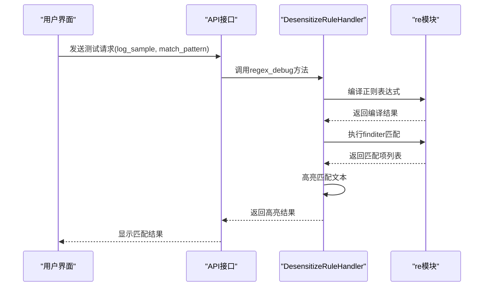
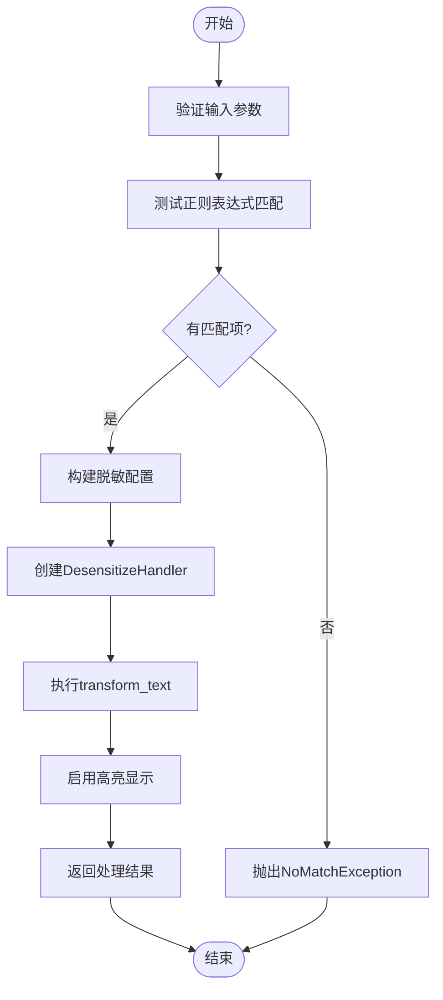
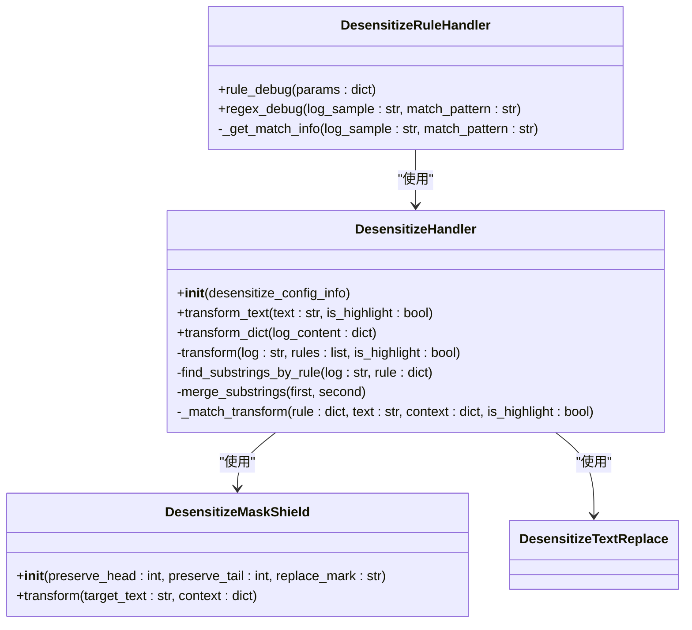
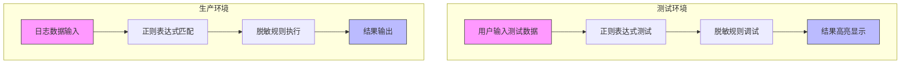

# 调试与测试功能

<cite>
**本文档引用文件**   
- [desensitize.py](file://bklog/apps/log_desensitize/handlers/desensitize.py)
- [desensitize_rule_views.py](file://bklog/apps/log_desensitize/views/desensitize_rule_views.py)
- [serializers.py](file://bklog/apps/log_desensitize/serializers.py)
- [utils.py](file://bklog/apps/log_desensitize/utils.py)
- [models.py](file://bklog/apps/log_desensitize/models.py)
- [mask_shield.py](file://bklog/apps/log_desensitize/handlers/desensitize_operator/mask_shield.py)
</cite>

## 目录
1. [调试功能概述](#调试功能概述)
2. [正则表达式测试](#正则表达式测试)
3. [规则调试功能](#规则调试功能)
4. [测试数据生成与边界处理](#测试数据生成与边界处理)
5. [一致性保证与准确性验证](#一致性保证与准确性验证)
6. [性能评估与优化建议](#性能评估与优化建议)
7. [实际操作示例](#实际操作示例)
8. [常见测试场景](#常见测试场景)

## 调试功能概述

日志脱敏系统的调试与测试功能为用户提供了一套完整的规则验证和测试工具，主要包括正则表达式调试和规则调试两大核心功能。这些功能允许用户在正式应用脱敏规则前，通过测试文本验证规则的正确性和有效性。

调试功能的设计目标是确保脱敏规则在生产环境中的准确执行，通过提供实时的匹配结果展示和性能评估，帮助用户优化正则表达式模式，提高规则匹配效率。系统通过高亮显示匹配结果，直观地展示规则的应用效果。

调试功能的实现基于`DesensitizeRuleHandler`类，该类提供了`regex_debug`和`rule_debug`两个核心方法，分别用于正则表达式测试和完整规则调试。这些功能通过REST API接口暴露给前端应用，支持跨平台使用。

**Section sources**
- [desensitize.py](file://bklog/apps/log_desensitize/handlers/desensitize.py#L461-L507)
- [desensitize_rule_views.py](file://bklog/apps/log_desensitize/views/desensitize_rule_views.py#L297-L347)

## 正则表达式测试

正则表达式测试功能允许用户验证正则表达式的正确性和匹配效果。该功能通过`regex_debug`接口实现，接收测试文本和正则表达式作为输入参数，返回匹配结果。



**Diagram sources**
- [desensitize.py](file://bklog/apps/log_desensitize/handlers/desensitize.py#L487-L507)
- [desensitize_rule_views.py](file://bklog/apps/log_desensitize/views/desensitize_rule_views.py#L297-L319)

正则表达式测试功能具有以下特性：
- **语法验证**：在执行匹配前，系统会验证正则表达式的语法合法性，防止无效表达式导致系统错误
- **匹配高亮**：匹配成功的文本片段会被`<mark>`标签包裹，实现可视化高亮显示
- **完整匹配**：使用`finditer`方法查找所有匹配项，确保不遗漏任何匹配结果
- **边界处理**：正确处理文本开头和结尾的匹配情况

当正则表达式无法匹配任何内容时，系统会抛出`DesensitizeRegexDebugNoMatchException`异常，提示用户调整表达式。

**Section sources**
- [desensitize.py](file://bklog/apps/log_desensitize/handlers/desensitize.py#L487-L507)
- [serializers.py](file://bklog/apps/log_desensitize/serializers.py#L102-L116)

## 规则调试功能

规则调试功能提供了完整的脱敏规则测试能力，不仅验证正则表达式匹配，还模拟实际的脱敏处理过程。该功能通过`rule_debug`接口实现，支持完整的脱敏算子参数配置。



**Diagram sources**
- [desensitize.py](file://bklog/apps/log_desensitize/handlers/desensitize.py#L461-L485)
- [desensitize_rule_views.py](file://bklog/apps/log_desensitize/views/desensitize_rule_views.py#L321-L347)

规则调试功能的核心流程包括：
1. **输入参数验证**：检查测试文本、正则表达式、脱敏算子和参数的完整性
2. **正则匹配测试**：使用`_get_match_info`方法查找所有匹配项
3. **无匹配处理**：如果没有匹配项，抛出异常提示用户
4. **脱敏配置构建**：根据输入参数创建临时的脱敏配置
5. **脱敏处理执行**：使用`DesensitizeHandler`执行实际的脱敏转换
6. **结果高亮显示**：将脱敏结果中的处理部分用`<mark>`标签高亮

该功能支持两种主要的脱敏算子：掩码屏蔽(`mask_shield`)和文本替换(`text_replace`)，用户可以在调试时选择合适的算子进行测试。

**Section sources**
- [desensitize.py](file://bklog/apps/log_desensitize/handlers/desensitize.py#L461-L485)
- [desensitize_rule_views.py](file://bklog/apps/log_desensitize/views/desensitize_rule_views.py#L321-L347)

## 测试数据生成与边界处理

系统在测试过程中采用了多种策略来处理边界情况和生成测试数据，确保调试功能的鲁棒性和准确性。

### 模拟数据生成机制

测试功能支持用户自定义测试文本，同时也内置了多种测试场景的示例数据。系统通过以下方式生成和处理测试数据：
- **用户输入验证**：对用户提供的测试文本和正则表达式进行严格验证
- **默认值处理**：为可选参数提供合理的默认值，确保测试的完整性
- **异常安全**：在正则表达式编译失败时捕获`re.error`异常，提供友好的错误提示



**Diagram sources**
- [desensitize.py](file://bklog/apps/log_desensitize/handlers/desensitize.py)
- [mask_shield.py](file://bklog/apps/log_desensitize/handlers/desensitize_operator/mask_shield.py)

### 边界情况处理策略

系统针对各种边界情况设计了专门的处理策略：
- **空输入处理**：当测试文本或正则表达式为空时，返回空的匹配信息
- **无匹配处理**：当正则表达式无法匹配任何内容时，抛出特定异常
- **重叠匹配处理**：使用`merge_substrings`方法处理重叠的匹配项，确保结果的准确性
- **特殊字符处理**：正确处理正则表达式中的转义字符和特殊符号

对于脱敏算子的边界情况，系统也进行了充分考虑：
- 当`preserve_head`和`preserve_tail`都为0时，替换所有字符
- 当保护的字符数超过文本长度时，不进行任何替换
- 支持自定义替换符号，满足不同场景的需求

**Section sources**
- [desensitize.py](file://bklog/apps/log_desensitize/handlers/desensitize.py#L439-L459)
- [mask_shield.py](file://bklog/apps/log_desensitize/handlers/desensitize_operator/mask_shield.py#L63-L69)

## 一致性保证与准确性验证

为确保测试功能与生产环境规则执行的一致性，系统采用了多种保证措施和验证方法。

### 一致性保证措施

系统通过以下方式确保测试结果与生产环境执行结果的一致性：
- **共享核心逻辑**：测试功能和生产环境使用相同的`DesensitizeHandler`核心类
- **相同处理流程**：无论是调试还是正式执行，都遵循相同的文本处理流程
- **统一算子实现**：脱敏算子在测试和生产环境中使用完全相同的实现代码



**Diagram sources**
- [desensitize.py](file://bklog/apps/log_desensitize/handlers/desensitize.py)
- [desensitize_rule_views.py](file://bklog/apps/log_desensitize/views/desensitize_rule_views.py)

### 测试结果准确性验证

系统通过多层次的验证机制确保测试结果的准确性：
- **输入验证**：在`DesensitizeRuleRegexDebugSerializer`和`DesensitizeRuleDebugSerializer`中对输入参数进行验证
- **正则语法检查**：使用`re.compile`预编译正则表达式，确保语法正确
- **结果完整性检查**：确保所有匹配项都被正确识别和处理
- **边界条件测试**：通过单元测试覆盖各种边界情况

系统还提供了`match_rule`方法用于批量测试多条日志的匹配情况，帮助用户验证规则在实际数据中的表现。

**Section sources**
- [desensitize.py](file://bklog/apps/log_desensitize/handlers/desensitize.py#L524-L588)
- [serializers.py](file://bklog/apps/log_desensitize/serializers.py#L102-L134)

## 性能评估与优化建议

调试功能不仅关注功能正确性，还提供了性能评估能力，帮助用户优化规则效率。

### 性能评估特性

系统通过以下方式支持性能评估：
- **匹配效率分析**：通过观察匹配速度评估正则表达式的效率
- **复杂度提示**：复杂的正则表达式可能导致性能下降，系统通过实际测试反映这一点
- **批量测试支持**：支持对多条日志进行批量测试，评估规则在实际负载下的表现

### 正则表达式优化建议

基于系统特性和最佳实践，提供以下正则表达式优化建议：

1. **避免过度回溯**
   - 使用原子组和占有量词减少回溯
   - 避免嵌套量词如`.*.*`

2. **合理使用锚点**
   - 在可能的情况下使用`^`和`$`锚定匹配位置
   - 使用单词边界`\b`提高精确度

3. **优化字符类**
   - 使用预定义字符类如`\d`、`\w`代替`[0-9]`、`[a-zA-Z0-9_]`
   - 合理使用否定字符类`[^...]`

4. **控制量词范围**
   - 使用限定范围的量词如`{3,5}`代替`*`或`+`
   - 避免贪婪匹配导致的性能问题

5. **分解复杂模式**
   - 将复杂的正则表达式分解为多个简单的规则
   - 使用非捕获组`(?:...)`减少内存开销

通过调试功能的反复测试和优化，用户可以找到性能和准确性之间的最佳平衡点。

**Section sources**
- [desensitize.py](file://bklog/apps/log_desensitize/handlers/desensitize.py#L176-L202)
- [mask_shield.py](file://bklog/apps/log_desensitize/handlers/desensitize_operator/mask_shield.py#L54-L77)

## 实际操作示例

本节提供实际操作示例，展示如何利用调试功能优化正则表达式模式。

### 示例1：手机号脱敏调试

**测试场景**：对日志中的手机号进行掩码屏蔽

```json
{
  "log_sample": "用户手机号13812345678已记录",
  "match_pattern": "1[3-9]\\d{9}",
  "operator": "mask_shield",
  "params": {
    "preserve_head": 3,
    "preserve_tail": 4,
    "replace_mark": "*"
  }
}
```

**预期结果**：
```
用户手机号138*****5678已记录
```

通过调试功能，用户可以验证正则表达式是否正确匹配手机号，并调整`preserve_head`和`preserve_tail`参数以达到理想的脱敏效果。

### 示例2：邮箱地址替换

**测试场景**：将日志中的邮箱地址替换为固定文本

```json
{
  "log_sample": "联系邮箱admin@example.com需要保密",
  "match_pattern": "[a-zA-Z0-9._%+-]+@[a-zA-Z0-9.-]+\\.[a-zA-Z]{2,}",
  "operator": "text_replace",
  "params": {
    "template_string": "[邮箱已脱敏]"
  }
}
```

**预期结果**：
```
联系邮箱[邮箱已脱敏]需要保密
```

此示例展示了如何使用文本替换算子将敏感信息替换为固定文本，保护隐私信息。

**Section sources**
- [desensitize.py](file://bklog/apps/log_desensitize/handlers/desensitize.py#L461-L485)
- [mask_shield.py](file://bklog/apps/log_desensitize/handlers/desensitize_operator/mask_shield.py#L54-L77)

## 常见测试场景

本节列举常见测试场景的参考用例，帮助用户快速上手调试功能。

### 场景1：身份证号脱敏

```json
{
  "log_sample": "用户身份证310115199003078888已验证",
  "match_pattern": "\\d{6}\\d{8}\\d{3}[\\dX]",
  "operator": "mask_shield",
  "params": {
    "preserve_head": 6,
    "preserve_tail": 1,
    "replace_mark": "*"
  }
}
```

### 场景2：IP地址替换

```json
{
  "log_sample": "来自192.168.1.100的访问被记录",
  "match_pattern": "(?:(?:25[0-5]|2[0-4][0-9]|[01]?[0-9][0-9]?)\\.){3}(?:25[0-5]|2[0-4][0-9]|[01]?[0-9][0-9]?)",
  "operator": "text_replace",
  "params": {
    "template_string": "[IP已脱敏]"
  }
}
```

### 场景3：银行卡号处理

```json
{
  "log_sample": "支付卡号6222081234567890完成交易",
  "match_pattern": "\\d{16}",
  "operator": "mask_shield",
  "params": {
    "preserve_head": 6,
    "preserve_tail": 4,
    "replace_mark": "*"
  }
}
```

### 场景4：多规则组合测试

```json
{
  "log_sample": "用户张三(身份证310115199003078888,手机13812345678)信息已更新",
  "match_pattern": "(\\d{17}[\\dX])|(1[3-9]\\d{9})",
  "operator": "mask_shield",
  "params": {
    "preserve_head": 4,
    "preserve_tail": 2,
    "replace_mark": "*"
  }
}
```

这些参考用例涵盖了常见的敏感信息类型，用户可以根据实际需求进行调整和扩展。

**Section sources**
- [desensitize.py](file://bklog/apps/log_desensitize/handlers/desensitize.py#L461-L485)
- [serializers.py](file://bklog/apps/log_desensitize/serializers.py#L119-L142)