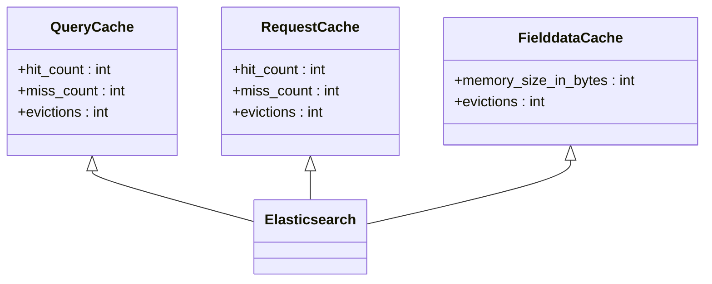
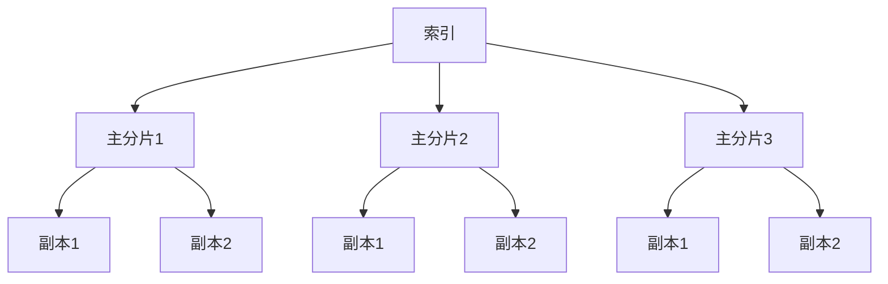
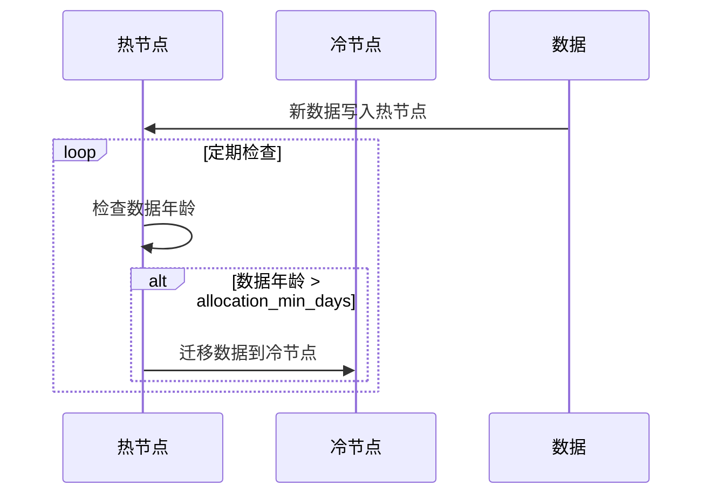
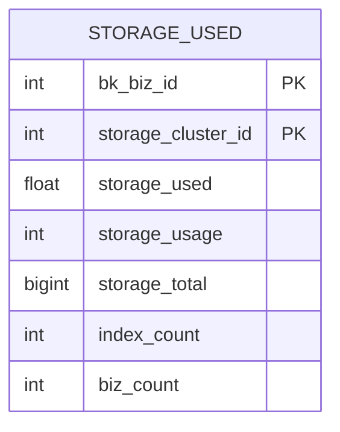
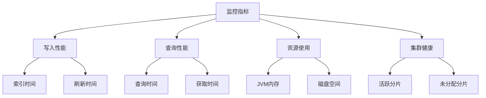
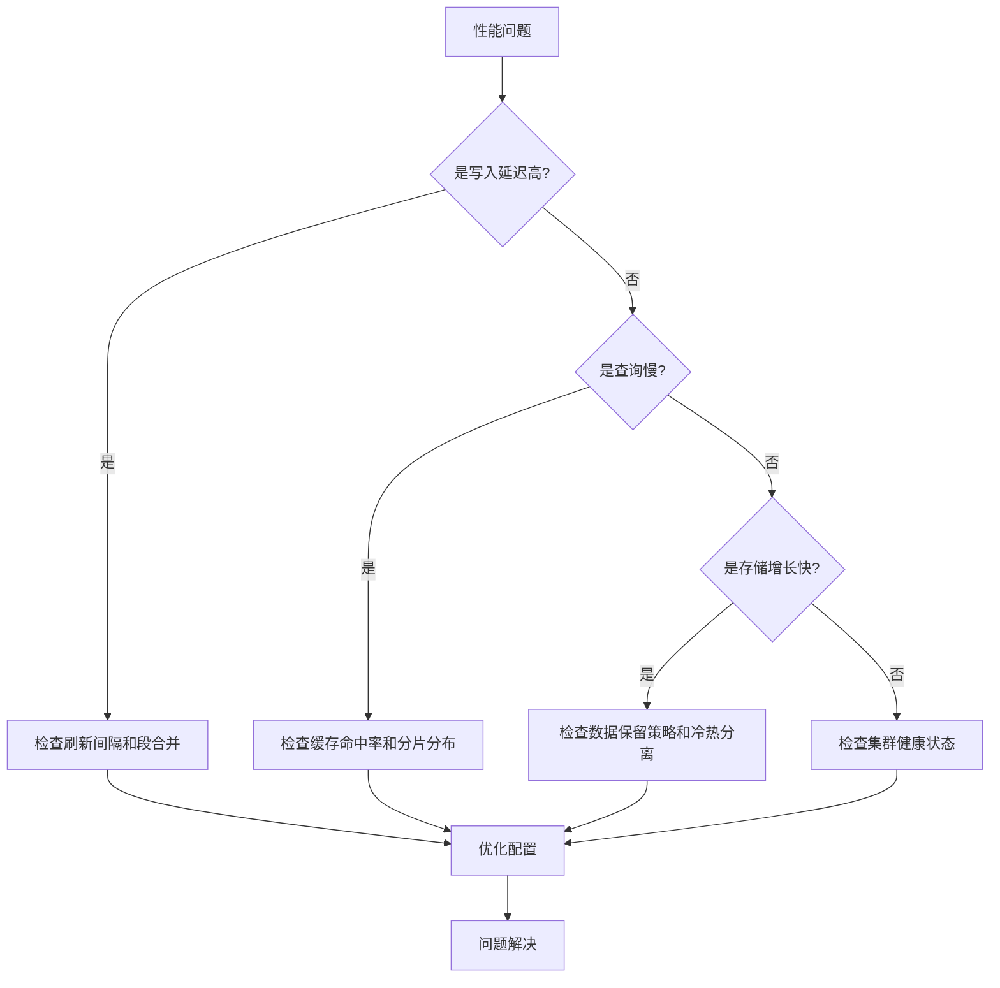

# 存储性能优化

<cite>
**本文档引用的文件**   
- [base.py](file://bklog/apps/log_databus/handlers/etl_storage/base.py)
- [storage.py](file://bklog/apps/log_databus/handlers/storage.py)
- [es.py](file://bklog/apps/log_measure/utils/es.py)
- [es_config.py](file://bklog/apps/log_databus/utils/es_config.py)
- [constants.py](file://bklog/apps/log_databus/constants.py)
</cite>

## 目录
1. [引言](#引言)
2. [写入性能优化](#写入性能优化)
3. [查询性能优化](#查询性能优化)
4. [存储资源利用率提升](#存储资源利用率提升)
5. [存储容量规划](#存储容量规划)
6. [监控与告警](#监控与告警)
7. [性能瓶颈诊断](#性能瓶颈诊断)
8. [常见问题解决方案](#常见问题解决方案)

## 引言
本文档系统性地介绍了日志存储性能调优方法，涵盖写入性能、查询性能和存储资源利用率的优化策略。文档详细说明了批量写入配置、刷新间隔设置、段合并策略等写入优化技术，解释了缓存配置、副本设置、分片策略对查询性能的影响，并提供了存储容量规划的计算公式和预估方法。同时，文档还涵盖了监控存储性能的关键指标、告警设置以及性能瓶颈的诊断方法。

## 写入性能优化

日志存储系统的写入性能是系统整体性能的关键指标之一。通过合理的配置和优化策略，可以显著提升数据写入效率，降低写入延迟。

### 批量写入配置
批量写入是提升写入性能的核心技术。系统通过配置`slice_size`（分片大小）和`slice_gap`（分片时间间隔）来控制数据的批量写入行为。`slice_size`定义了单个分片的大小阈值（单位：GB），当数据量达到该阈值时，会触发新的分片创建。`slice_gap`则定义了按时间分片的间隔（单位：分钟），确保数据按时间窗口进行组织。


**代码片段路径**
- [base.py](file://bklog/apps/log_databus/handlers/etl_storage/base.py#L792-L798)
- [es_config.py](file://bklog/apps/log_databus/utils/es_config.py#L26-L32)

### 刷新间隔设置
刷新间隔（refresh interval）控制着内存中的索引数据写入磁盘的频率。较短的刷新间隔可以提高数据的实时性，但会增加I/O开销；较长的间隔则能提升写入吞吐量，但会降低查询的实时性。系统通过`index_settings`中的配置来管理刷新行为。

### 段合并策略
段合并（merge）是Elasticsearch后台的重要操作，它将多个小的段文件合并成更大的段，以减少文件数量，提高查询效率。系统通过`merges`相关的监控指标来跟踪合并操作的性能，包括合并的文档数量、合并时间等。


**代码片段路径**
- [es.py](file://bklog/apps/log_measure/utils/es.py#L216-L230)

## 查询性能优化

查询性能直接影响用户体验和系统响应速度。通过合理的缓存、副本和分片策略，可以显著提升查询效率。

### 缓存配置
系统利用多种缓存机制来加速查询，包括查询缓存（query cache）、请求缓存（request cache）和字段数据缓存（fielddata cache）。这些缓存可以减少对磁盘的访问，提高查询响应速度。



**代码片段路径**
- [es.py](file://bklog/apps/log_measure/utils/es.py#L489-L513)

### 副本设置
副本（replica）是提升查询性能和系统可用性的关键。通过增加副本数量，可以实现查询请求的负载均衡，分散查询压力。系统通过`number_of_replicas`参数来配置副本数量，该值可以在`setup_config`中进行设置。

### 分片策略
分片（shard）是Elasticsearch中数据分布的基本单位。合理的分片策略可以平衡数据分布和查询负载。系统通过`es_shards`参数来配置分片数量，并支持通过`total_shards_per_node`限制每个节点上的分片总数，以避免单个节点过载。



**代码片段路径**
- [base.py](file://bklog/apps/log_databus/handlers/etl_storage/base.py#L834-L836)
- [storage.py](file://bklog/apps/log_databus/handlers/storage.py#L275-L276)

## 存储资源利用率提升

通过冷热数据分离和合理的存储配置，可以有效提升存储资源的利用率。

### 冷热数据分离
冷热数据分离策略将数据分为热数据（频繁访问）和冷数据（较少访问）。热数据存储在高性能节点上，冷数据则存储在成本较低的节点上。系统通过`hot_warm_config`配置来启用此功能，指定热节点和冷节点的属性名称及值。



**代码片段路径**
- [base.py](file://bklog/apps/log_databus/handlers/etl_storage/base.py#L1263-L1291)
- [storage.py](file://bklog/apps/log_databus/handlers/storage.py#L598-L605)

### 存储配置优化
系统通过`setup_config`提供了一系列存储配置选项，包括最大保留天数（`retention_days_max`）、默认保留天数（`retention_days_default`）、最大分片数（`es_shards_max`）等，以优化存储资源的使用。

## 存储容量规划

合理的存储容量规划对于系统的长期稳定运行至关重要。

### 容量计算公式
存储容量的预估需要考虑以下几个因素：
- 日均数据量（GB/day）
- 数据保留周期（days）
- 副本数量（replicas）
- 预留空间（通常为20%）

计算公式为：
```
总存储容量 = 日均数据量 × 保留周期 × (1 + 副本数量) × 1.2
```

### 容量监控
系统通过`StorageUsed`模型来跟踪各业务的存储使用情况，包括已用容量、总容量、容量使用率、索引数量和业务数量等指标。



**代码片段路径**
- [constants.py](file://bklog/apps/log_databus/constants.py#L474-L489)
- [es.py](file://bklog/apps/log_measure/utils/es.py#L335-L337)

## 监控与告警

有效的监控和告警机制是保障系统稳定运行的基础。

### 关键监控指标
系统监控以下关键性能指标：
- **写入性能**: `elasticsearch.indexing.index.time`, `elasticsearch.refresh.total.time`
- **查询性能**: `elasticsearch.search.query.time`, `elasticsearch.search.fetch.time`
- **资源使用**: `jvm.mem.heap_used`, `elasticsearch.fs.total.available_in_bytes`
- **集群健康**: `elasticsearch.active_shards`, `elasticsearch.unassigned_shards`



**代码片段路径**
- [es.py](file://bklog/apps/log_measure/utils/es.py#L144-L338)

### 告警设置
基于上述监控指标，可以设置相应的告警规则，例如：
- 当`elasticsearch.refresh.total.time`持续升高时，告警写入性能下降
- 当`elasticsearch.search.query.time`超过阈值时，告警查询性能问题
- 当`elasticsearch.fs.total.available_in_bytes`低于安全水位时，告警存储空间不足

## 性能瓶颈诊断

当系统出现性能问题时，需要系统性地进行诊断。

### 诊断流程


### 诊断工具
系统提供了`connectivity_detect`等工具来检测集群的连接状态和版本信息，帮助快速定位问题。

## 常见问题解决方案

### 写入延迟高
- **原因**: 刷新间隔过短、段合并压力大、I/O瓶颈
- **解决方案**: 
  - 适当延长刷新间隔
  - 优化段合并策略
  - 检查磁盘I/O性能

### 存储空间增长过快
- **原因**: 数据保留周期过长、副本数量过多、未启用冷热分离
- **解决方案**:
  - 调整数据保留策略
  - 优化副本数量
  - 启用冷热数据分离