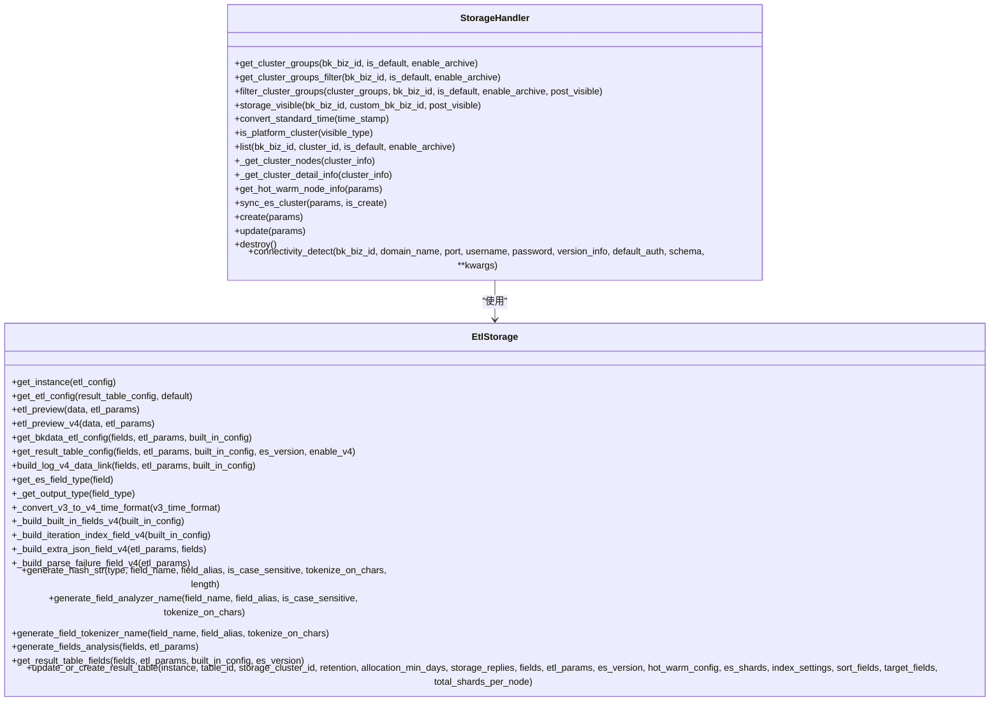
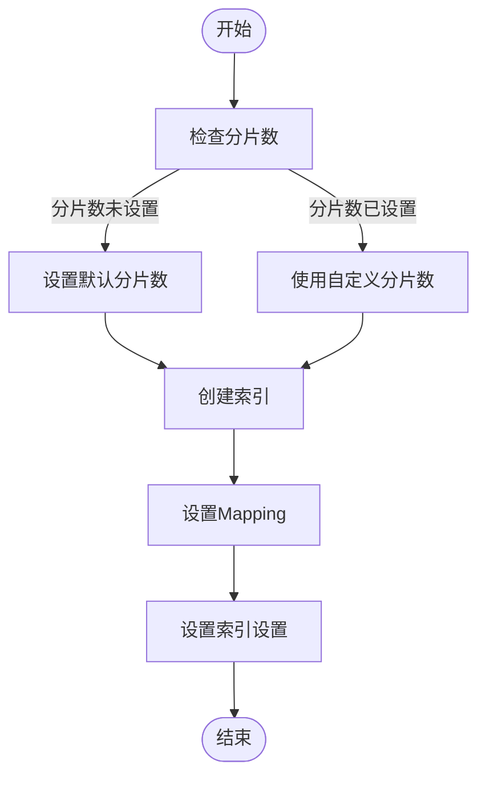
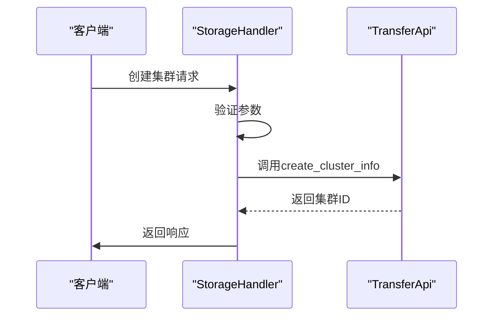
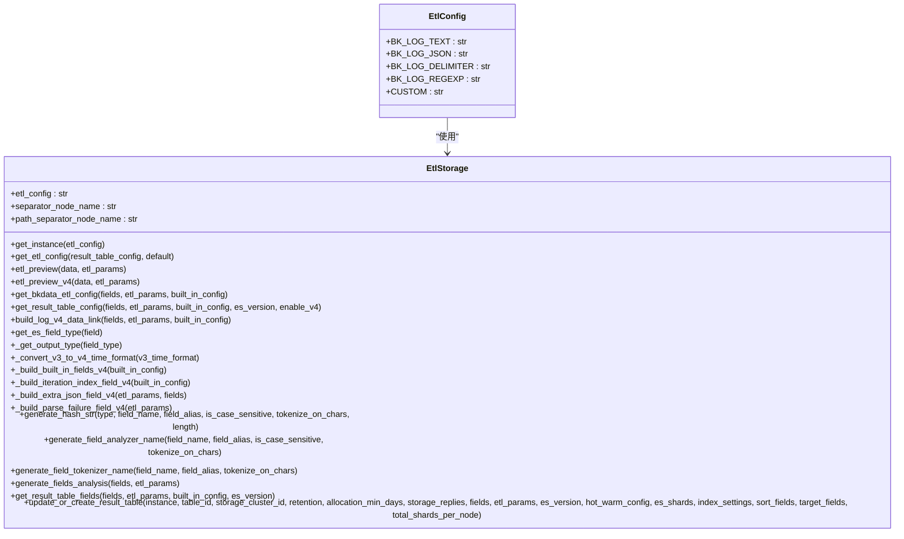
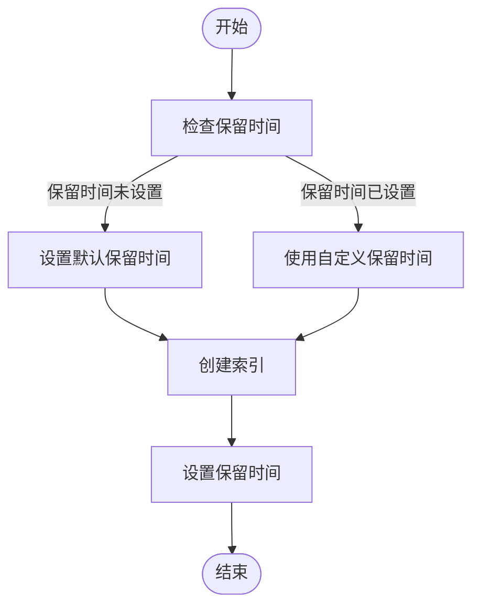
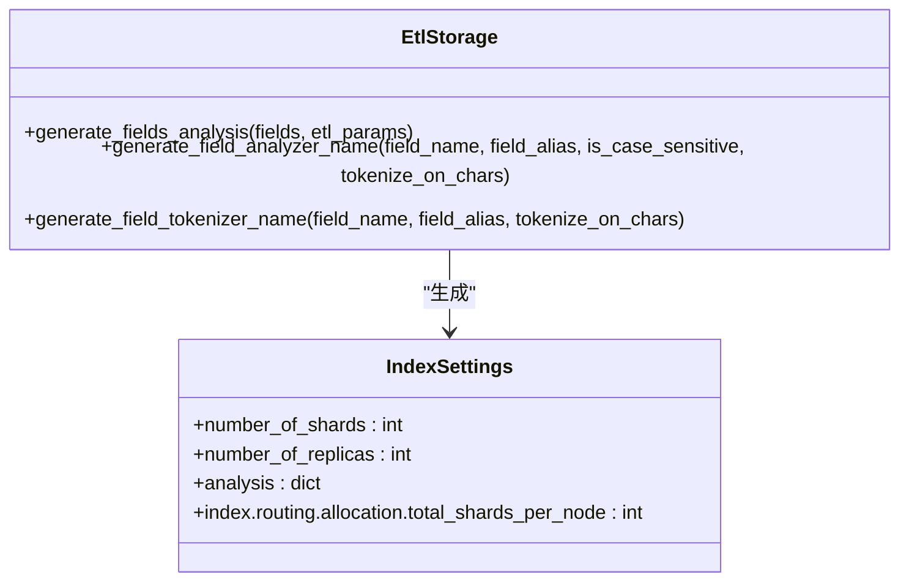
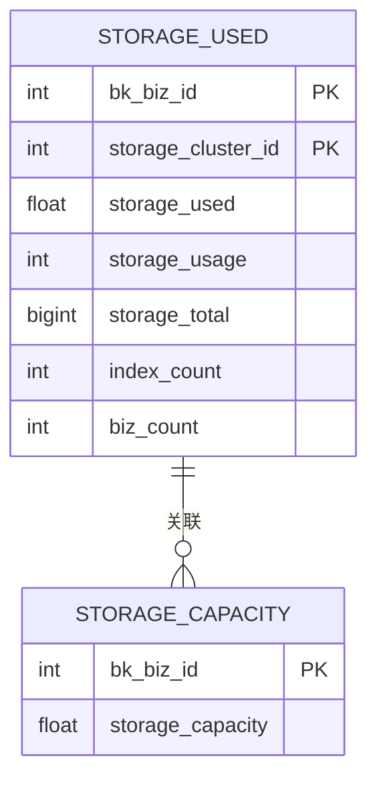
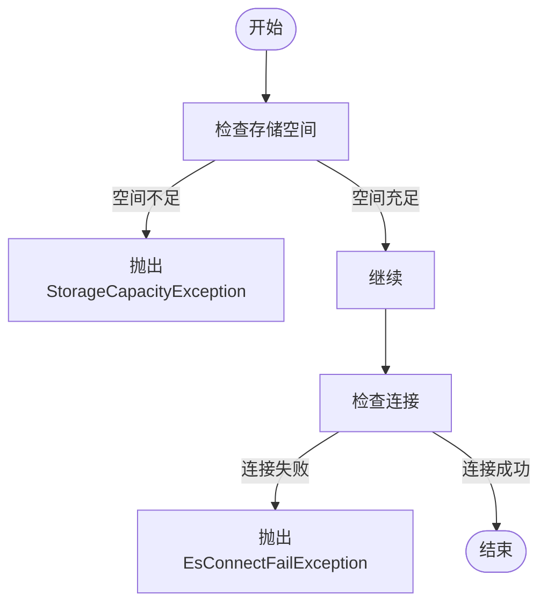

# 存储策略

<cite>
**本文档引用的文件**   
- [storage.py](file://bklog/apps/log_databus/handlers/storage.py)
- [base.py](file://bklog/apps/log_databus/handlers/etl_storage/base.py)
- [es_config.py](file://bklog/apps/log_databus/utils/es_config.py)
- [constants.py](file://bklog/apps/log_databus/constants.py)
- [archive.py](file://bklog/apps/log_databus/handlers/archive.py)
- [index_set.py](file://bklog/apps/log_search/handlers/index_set.py)
- [query_time_builder.py](file://bklog/apps/log_esquery/esquery/builder/query_time_builder.py)
- [models.py](file://bklog/apps/log_databus/models.py)
</cite>

## 目录
1. [存储配置概述](#存储配置概述)
2. [ES集群选择与配置](#es集群选择与配置)
3. [索引策略与分片设置](#索引策略与分片设置)
4. [副本设置](#副本设置)
5. [存储模式配置](#存储模式配置)
6. [存储周期管理](#存储周期管理)
7. [存储性能优化](#存储性能优化)
8. [存储容量规划](#存储容量规划)
9. [存储异常处理](#存储异常处理)

## 存储配置概述

存储策略功能是蓝鲸日志平台的核心组件，负责管理日志数据的存储配置。该功能通过ES集群管理、索引策略配置、存储周期管理等机制，确保日志数据的高效存储和检索。系统通过`storage.py`中的`StorageHandler`类实现存储集群的管理，包括集群的创建、更新、删除和查询操作。存储配置参数通过`es_config.py`中的`get_es_config`函数获取，该函数根据业务ID返回相应的ES配置。

**Section sources**
- [storage.py](file://bklog/apps/log_databus/handlers/storage.py#L83-L810)
- [es_config.py](file://bklog/apps/log_databus/utils/es_config.py#L26-L32)

## ES集群选择与配置

ES集群选择是存储策略的基础，系统支持多种ES集群类型，包括公共集群和第三方集群。在`storage.py`中，`StorageHandler`类的`get_cluster_groups`方法负责获取集群列表，并根据业务ID和权限进行过滤。集群配置参数包括集群名称、域名、端口、认证信息、版本号等，这些参数在创建或更新集群时通过`create`和`update`方法进行设置。

集群的可见性通过`can_visible`方法进行控制，支持全业务可见、当前租户可见、多业务可见和业务属性可见四种模式。公共集群的配置信息在`setup_config`中定义，包括最大保留天数、默认保留天数、最大副本数、默认副本数、默认分片数和最大分片数等。

**Diagram sources **
- [storage.py](file://bklog/apps/log_databus/handlers/storage.py#L83-L810)
- [base.py](file://bklog/apps/log_databus/handlers/etl_storage/base.py#L62-L1457)

**Section sources**
- [storage.py](file://bklog/apps/log_databus/handlers/storage.py#L144-L198)
- [constants.py](file://bklog/apps/log_databus/constants.py#L87-L105)

## 索引策略与分片设置

索引策略和分片设置是存储性能的关键因素。在`base.py`中，`EtlStorage`类的`update_or_create_result_table`方法负责创建或更新结果表，其中包含索引策略和分片设置。分片数通过`es_shards`参数设置，该参数在`es_config.py`中定义。分片大小通过`storage_shards_size`参数设置，该参数在`CollectorConfig`模型中定义。

索引的分片时间间隔通过`ES_SLICE_GAP`参数设置，该参数在`es_config.py`中定义。索引的mapping设置通过`param_mapping`参数设置，该参数在`base.py`中定义。对于ES 5.x版本，需要启用`_all`字段，而对于更高版本，则不需要。

**Diagram sources **
- [base.py](file://bklog/apps/log_databus/handlers/etl_storage/base.py#L778-L800)
- [es_config.py](file://bklog/apps/log_databus/utils/es_config.py#L26-L32)

**Section sources**
- [base.py](file://bklog/apps/log_databus/handlers/etl_storage/base.py#L778-L800)
- [es_config.py](file://bklog/apps/log_databus/utils/es_config.py#L26-L32)

## 副本设置

副本设置是确保数据高可用性的关键。在`storage.py`中，`StorageHandler`类的`setup_config`参数包含副本设置，包括最大副本数和默认副本数。这些参数在创建或更新集群时通过`create`和`update`方法进行设置。副本数通过`number_of_replicas`参数设置，该参数在`index_settings`中定义。

**Diagram sources **
- [storage.py](file://bklog/apps/log_databus/handlers/storage.py#L623-L667)
- [base.py](file://bklog/apps/log_databus/handlers/etl_storage/base.py#L833-L836)

**Section sources**
- [storage.py](file://bklog/apps/log_databus/handlers/storage.py#L271-L274)
- [base.py](file://bklog/apps/log_databus/handlers/etl_storage/base.py#L833-L836)

## 存储模式配置

存储模式配置支持多种数据处理方式，包括文本存储、JSON存储和正则存储。在`base.py`中，`EtlStorage`类的`get_etl_config`方法根据结果表配置返回ETL配置类型。`EtlConfig`类定义了不同的ETL配置类型，包括`BK_LOG_TEXT`、`BK_LOG_JSON`、`BK_LOG_DELIMITER`和`BK_LOG_REGEXP`。

**Diagram sources **
- [base.py](file://bklog/apps/log_databus/handlers/etl_storage/base.py#L378-L394)
- [constants.py](file://bklog/apps/log_databus/constants.py#L377-L382)

**Section sources**
- [base.py](file://bklog/apps/log_databus/handlers/etl_storage/base.py#L91-L94)
- [constants.py](file://bklog/apps/log_databus/constants.py#L377-L382)

## 存储周期管理

存储周期管理包括数据保留时间、归档策略和清理规则。在`storage.py`中，`StorageHandler`类的`setup_config`参数包含保留天数设置，包括最大保留天数和默认保留天数。这些参数在创建或更新集群时通过`create`和`update`方法进行设置。

归档策略通过`archive.py`中的`ArchiveHandler`类实现，支持对采集项、采集插件和索引集进行归档。归档配置包括开始时间、结束时间和到期时间，这些参数在`models.py`中的`ArchiveConfig`模型中定义。

**Diagram sources **
- [storage.py](file://bklog/apps/log_databus/handlers/storage.py#L271-L272)
- [archive.py](file://bklog/apps/log_databus/handlers/archive.py#L94-L113)
- [models.py](file://bklog/apps/log_databus/models.py#L474-L489)

**Section sources**
- [storage.py](file://bklog/apps/log_databus/handlers/storage.py#L271-L272)
- [archive.py](file://bklog/apps/log_databus/handlers/archive.py#L94-L113)
- [models.py](file://bklog/apps/log_databus/models.py#L474-L489)

## 存储性能优化

存储性能优化包括索引模板配置和写入性能调优。在`base.py`中，`EtlStorage`类的`generate_fields_analysis`方法负责生成字段的分词器配置，包括analyzer和tokenizer。这些配置通过`index_settings`参数传递给ES，以优化查询性能。

写入性能调优通过`total_shards_per_node`参数实现，该参数控制每个节点的分片总数，避免单个节点分片过多导致性能下降。此外，通过`hot_warm_config`参数实现冷热数据分离，将热点数据存储在高性能节点上，冷数据存储在低成本节点上。

**Diagram sources **
- [base.py](file://bklog/apps/log_databus/handlers/etl_storage/base.py#L465-L541)
- [base.py](file://bklog/apps/log_databus/handlers/etl_storage/base.py#L847-L850)

**Section sources**
- [base.py](file://bklog/apps/log_databus/handlers/etl_storage/base.py#L465-L541)
- [base.py](file://bklog/apps/log_databus/handlers/etl_storage/base.py#L847-L850)

## 存储容量规划

存储容量规划帮助用户合理预估存储需求。在`models.py`中，`StorageUsed`模型记录了每个业务的存储使用情况，包括已用容量、总容量、索引数量和业务数量。这些信息通过`collector.py`中的定时任务定期更新。

**Diagram sources **
- [models.py](file://bklog/apps/log_databus/models.py#L474-L489)
- [collector.py](file://bklog/apps/log_databus/tasks/collector.py#L141-L183)

**Section sources**
- [models.py](file://bklog/apps/log_databus/models.py#L474-L489)
- [collector.py](file://bklog/apps/log_databus/tasks/collector.py#L141-L183)

## 存储异常处理

存储异常处理包括存储空间不足、写入延迟等场景。在`exceptions.py`中，定义了多种存储相关的异常，如`StorageNotExistException`、`StorageNotPermissionException`和`EsConnectFailException`。这些异常在`storage.py`中的`create`、`update`和`destroy`方法中被抛出。

对于存储空间不足的情况，系统通过`get_all_biz_storage_capacity`方法获取集群下所有业务的存储容量，并在创建或更新集群时进行检查。对于写入延迟的情况，系统通过`connectivity_detect`方法检测ES集群的连接状态和版本信息，确保集群的可用性。

**Diagram sources **
- [exceptions.py](file://bklog/apps/log_measure/exceptions.py#L36-L48)
- [collector.py](file://bklog/apps/log_databus/tasks/collector.py#L278-L306)
- [storage.py](file://bklog/apps/log_databus/handlers/storage.py#L782-L800)

**Section sources**
- [exceptions.py](file://bklog/apps/log_measure/exceptions.py#L36-L48)
- [collector.py](file://bklog/apps/log_databus/tasks/collector.py#L278-L306)
- [storage.py](file://bklog/apps/log_databus/handlers/storage.py#L782-L800)