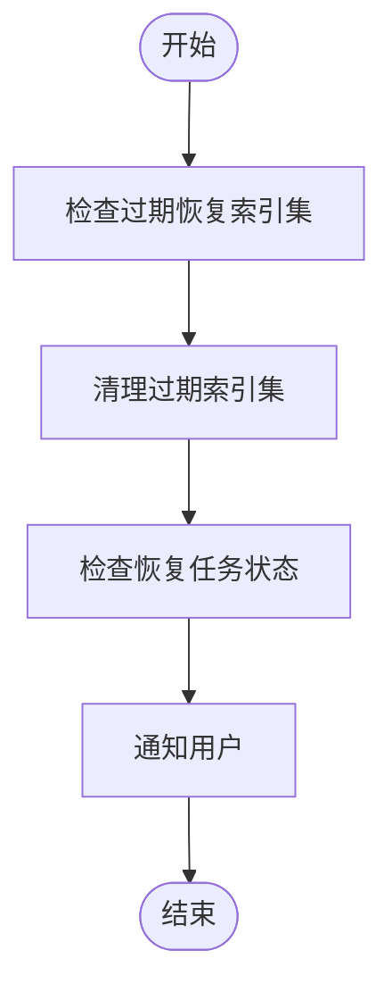

# 生命周期管理

<cite>
**本文档引用的文件**   
- [archive.py](file://bklog/apps/log_databus/tasks/archive.py)
- [archive_views.py](file://bklog/apps/log_databus/views/archive_views.py)
- [constants.py](file://bklog/apps/log_databus/constants.py)
- [models.py](file://bklog/apps/log_databus/models.py)
- [restore_views.py](file://bklog/apps/log_databus/views/restore_views.py)
- [storage.py](file://bklog/apps/log_databus/handlers/storage.py)
- [handlers.py](file://bklog/apps/log_databus/handlers/archive.py)
</cite>

## 目录
1. [生命周期管理概述](#生命周期管理概述)
2. [数据保留时间设置](#数据保留时间设置)
3. [自动归档策略](#自动归档策略)
4. [归档配置流程](#归档配置流程)
5. [数据恢复流程](#数据恢复流程)
6. [性能影响与资源消耗](#性能影响与资源消耗)
7. [生命周期策略优化](#生命周期策略优化)
8. [异常处理方法](#异常处理方法)

## 生命周期管理概述

日志数据的生命周期管理是蓝鲸日志平台的核心功能之一，旨在帮助用户有效管理日志数据的存储、归档和清理。该功能通过设置数据保留时间、自动归档策略和数据清理规则，确保日志数据在满足业务需求的同时，合理控制存储成本。生命周期管理功能主要包括数据保留时间设置、自动归档策略、数据清理规则、归档配置流程、数据恢复流程、性能影响与资源消耗评估、生命周期策略优化以及异常处理方法。

**Section sources**
- [models.py](file://bklog/apps/log_databus/models.py#L547-L574)
- [constants.py](file://bklog/apps/log_databus/constants.py#L595-L604)

## 数据保留时间设置

数据保留时间设置是生命周期管理的基础，通过配置数据的保留天数，确保日志数据在指定时间内可用。在蓝鲸日志平台中，数据保留时间通过`ArchiveConfig`模型中的`snapshot_days`字段进行配置，该字段表示快照存储天数，0表示永久存储。用户可以在创建或更新归档配置时设置`snapshot_days`值，以控制日志数据的保留时间。

**Diagram sources **
- [models.py](file://bklog/apps/log_databus/models.py#L547-L574)

**Section sources**
- [models.py](file://bklog/apps/log_databus/models.py#L547-L574)
- [constants.py](file://bklog/apps/log_databus/constants.py#L595-L604)

## 自动归档策略

自动归档策略通过定期将日志数据从主存储迁移到归档存储，释放主存储空间，降低存储成本。蓝鲸日志平台的自动归档策略基于Elasticsearch的快照功能实现，通过`TransferApi.create_result_table_snapshot`接口创建快照，并将快照存储在指定的快照仓库中。归档任务由`ArchiveHandler`类的`create_or_update`方法触发，该方法根据归档配置中的`snapshot_days`和`target_snapshot_repository_name`参数，调用`TransferApi`接口创建或更新快照。

**Diagram sources **
- [handlers.py](file://bklog/apps/log_databus/handlers/archive.py#L164-L241)
- [archive_views.py](file://bklog/apps/log_databus/views/archive_views.py#L193-L218)

**Section sources**
- [handlers.py](file://bklog/apps/log_databus/handlers/archive.py#L164-L241)
- [archive_views.py](file://bklog/apps/log_databus/views/archive_views.py#L193-L218)

## 归档配置流程

归档配置流程包括归档目标存储选择、归档触发条件和归档任务调度等参数设置。用户首先选择需要归档的采集项或索引集，然后配置归档目标存储（即快照仓库），设置归档触发条件（如数据保留时间），并调度归档任务。归档配置通过`CreateArchiveSerlalizer`和`UpdateArchiveSerlalizer`序列化器进行验证，确保配置参数的正确性。

**Diagram sources **
- [serializers.py](file://bklog/apps/log_databus/serializers.py#L1073-L1083)

**Section sources**
- [serializers.py](file://bklog/apps/log_databus/serializers.py#L1073-L1083)
- [handlers.py](file://bklog/apps/log_databus/handlers/archive.py#L164-L241)

## 数据恢复流程

数据恢复流程允许用户从归档存储中恢复指定时间范围内的日志数据。用户首先选择需要恢复的归档配置，然后指定恢复的时间范围和索引集名称，最后触发恢复任务。恢复任务由`ArchiveHandler`类的`restore`方法执行，该方法调用`TransferApi.restore_result_table_snapshot`接口，将指定时间范围内的快照数据恢复到新的索引集中。

**Diagram sources **
- [restore_views.py](file://bklog/apps/log_databus/views/restore_views.py#L92-L125)
- [handlers.py](file://bklog/apps/log_databus/handlers/archive.py#L266-L365)

**Section sources**
- [restore_views.py](file://bklog/apps/log_databus/views/restore_views.py#L92-L125)
- [handlers.py](file://bklog/apps/log_databus/handlers/archive.py#L266-L365)

## 性能影响与资源消耗

生命周期管理功能对系统性能和资源消耗有一定影响。归档和恢复任务会占用网络带宽和存储资源，特别是在大规模数据迁移时，可能会影响系统的响应速度。为了评估性能影响，平台提供了`StorageHandler`类的`get_cluster_groups_filter`方法，用于获取集群的使用情况和容量配额，帮助用户监控资源消耗。

**Diagram sources **
- [storage.py](file://bklog/apps/log_databus/handlers/storage.py#L200-L234)

**Section sources**
- [storage.py](file://bklog/apps/log_databus/handlers/storage.py#L200-L234)

## 生命周期策略优化

生命周期策略优化旨在帮助用户平衡存储成本和数据可用性需求。通过合理设置数据保留时间和归档策略，用户可以在满足业务需求的同时，最大限度地降低存储成本。平台建议用户根据日志数据的重要性和访问频率，制定不同的生命周期策略。例如，对于高频访问的日志数据，可以设置较长的保留时间；对于低频访问的日志数据，可以设置较短的保留时间并及时归档。

**Section sources**
- [models.py](file://bklog/apps/log_databus/models.py#L547-L574)
- [constants.py](file://bklog/apps/log_databus/constants.py#L595-L604)

## 异常处理方法

生命周期管理功能在执行过程中可能会遇到各种异常情况，如归档任务失败、数据清理异常等。平台提供了相应的异常处理机制，确保系统的稳定性和数据的完整性。例如，`clean_expired_restore_index_set`任务会定期清理过期的恢复索引集，防止存储空间被无效数据占用。此外，`check_restore_is_done_and_notice_user`任务会检查恢复任务的状态，并在任务完成后通知用户。

**Diagram sources **
- [archive.py](file://bklog/apps/log_databus/tasks/archive.py#L32-L68)

**Section sources**
- [archive.py](file://bklog/apps/log_databus/tasks/archive.py#L32-L68)