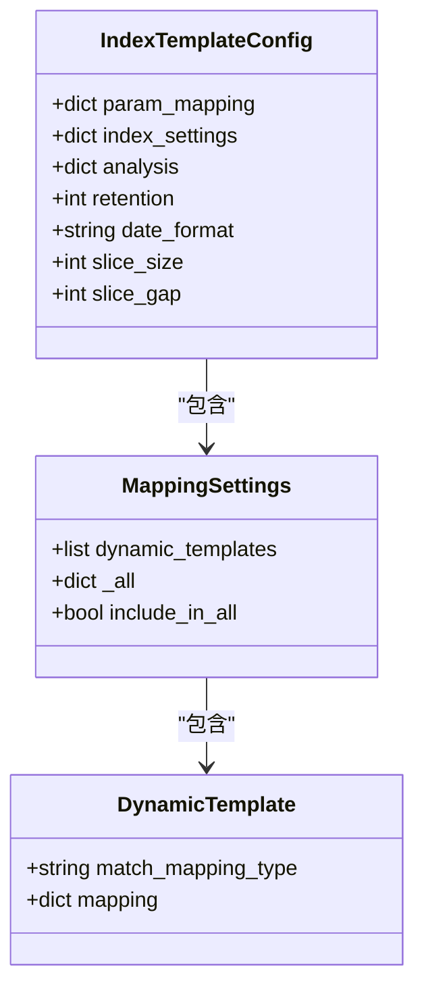
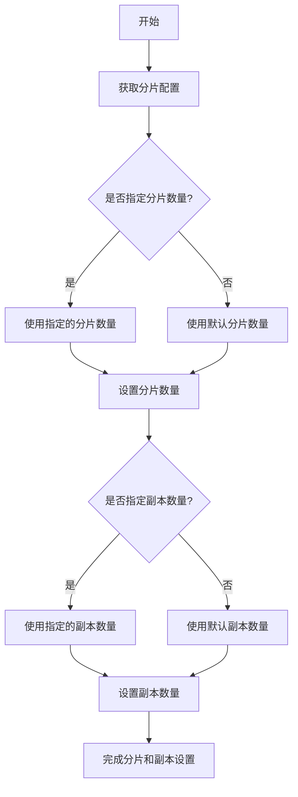
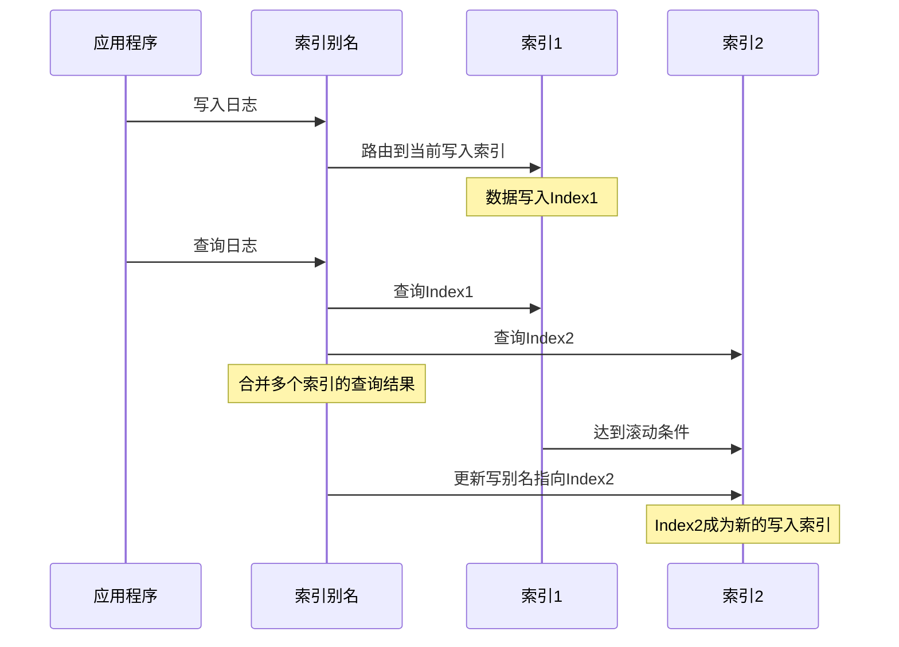
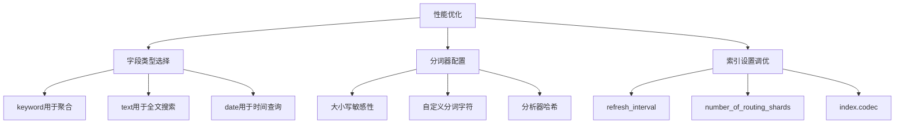
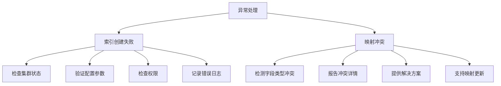

# 索引策略

<cite>
**本文档引用的文件**   
- [base.py](file://bklog/apps/log_databus/handlers/etl_storage/base.py)
- [index_set.py](file://bklog/apps/log_search/handlers/index_set.py)
- [es_checker.py](file://bklog/apps/log_databus/handlers/check_collector/checker/es_checker.py)
- [constants.py](file://bklog/apps/log_databus/constants.py)
</cite>

## 目录
1. [索引创建机制](#索引创建机制)
2. [索引模板配置](#索引模板配置)
3. [分片和副本设置](#分片和副本设置)
4. [存储模式映射配置](#存储模式映射配置)
5. [索引生命周期管理](#索引生命周期管理)
6. [索引性能优化](#索引性能优化)
7. [索引异常处理](#索引异常处理)

## 索引创建机制

日志数据在Elasticsearch中的索引创建机制主要通过采集配置和结果表配置来实现。系统通过`CollectorConfig`对象管理采集配置，当创建或更新采集项时，会调用`update_or_create_result_table`方法来创建或更新Elasticsearch中的索引。

索引名称的生成遵循特定规则，通常基于业务ID和表ID构建。在`base.py`文件中，通过`CollectorHandler.build_result_table_id`方法生成结果表ID，该ID作为索引名称的基础。索引名称的生成还考虑了存储集群ID、保留时间、分片大小和分片时间间隔等参数。

索引创建过程中，系统会根据采集场景和存储配置生成相应的索引设置。这些设置包括分片数量、副本数量、保留时间、日期格式、切片大小和切片时间间隔等。索引设置通过`params`字典传递给Transfer API，由底层系统负责实际的索引创建。

**Section sources**
- [base.py](file://bklog/apps/log_databus/handlers/etl_storage/base.py#L742-L926)

## 索引模板配置

索引模板配置是索引策略的重要组成部分，它定义了索引的映射设置和索引设置。系统通过`param_mapping`字典来配置ES兼容的映射设置，其中包含动态模板配置。

动态模板配置允许系统自动为字符串类型的字段创建关键字映射，这通过设置`norms`为`false`和类型为`keyword`来实现。对于Elasticsearch 5.x版本，还需要额外配置`_all`和`include_in_all`字段以保持兼容性。



**Diagram sources**
- [base.py](file://bklog/apps/log_databus/handlers/etl_storage/base.py#L803-L815)

## 分片和副本设置

分片和副本设置是影响Elasticsearch性能和可用性的关键因素。系统提供了灵活的分片和副本配置选项，允许用户根据数据量和查询需求进行调整。

分片数量通过`storage_shards_nums`属性设置，该值可以从实例配置中获取，也可以使用默认值。副本数量通过`storage_replies`属性设置，用于提高数据的可用性和查询性能。



**Diagram sources**
- [base.py](file://bklog/apps/log_databus/handlers/etl_storage/base.py#L787-L790)

## 存储模式映射配置

系统支持多种存储模式，包括文本、JSON和正则表达式模式，每种模式都有相应的映射配置方法。

### 文本存储模式
文本存储模式适用于直接入库的日志数据。在这种模式下，系统会保留原始文本字段，并根据配置决定是否进行分词处理。文本字段的映射配置包括`es_type`设置为`text`，并根据需要配置`es_analyzer`。

### JSON存储模式
JSON存储模式适用于结构化日志数据。系统会解析JSON数据并创建相应的字段映射。对于JSON对象字段，`es_type`设置为`object`，并启用`es_doc_values`以提高聚合性能。

### 正则表达式存储模式
正则表达式存储模式适用于需要从日志中提取特定字段的场景。系统使用正则表达式来分割日志，并为提取的字段创建映射。这种模式允许用户定义复杂的字段提取规则。

```mermaid
classDiagram
class StorageMode {
<<enumeration>>
TEXT
JSON
REGEXP
}
class FieldMapping {
+string field_name
+string field_type
+string es_type
+string es_analyzer
+bool es_doc_values
+bool es_include_in_all
}
class TextMapping : FieldMapping {
+bool retain_original_text
+string original_text_tokenize_on_chars
+bool original_text_is_case_sensitive
}
class JsonMapping : FieldMapping {
+bool flatten_object
}
class RegexpMapping : FieldMapping {
+string separator_regexp
}
StorageMode --> FieldMapping : "决定"
FieldMapping <|-- TextMapping
FieldMapping <|-- JsonMapping
FieldMapping <|-- RegexpMapping
```

**Diagram sources**
- [base.py](file://bklog/apps/log_databus/handlers/etl_storage/base.py#L134-L138)
- [constants.py](file://bklog/apps/log_databus/constants.py#L377-L382)

## 索引生命周期管理

索引生命周期管理策略包括滚动策略和索引别名使用，这些策略有助于高效管理大量日志数据。

### 滚动策略
系统实现了基于时间和大小的滚动策略。索引可以根据预设的时间间隔（如每天）或大小阈值进行滚动。滚动策略通过`slice_gap`（时间间隔）和`slice_size`（大小阈值）参数进行配置。

### 索引别名使用
索引别名是管理索引生命周期的重要工具。系统使用读写别名来简化索引管理：
- 写别名（以`write_`开头）指向当前正在写入的索引
- 读别名（以`_read`结尾）指向可用于查询的索引

通过别名，应用程序可以透明地访问最新的日志数据，而无需关心底层索引的实际名称。



**Diagram sources**
- [es_checker.py](file://bklog/apps/log_databus/handlers/check_collector/checker/es_checker.py#L162-L163)
- [constants.py](file://bklog/apps/log_databus/constants.py#L545-L546)

## 索引性能优化

索引性能优化涉及字段类型选择、分词器配置和索引设置调优等多个方面。

### 字段类型选择
正确的字段类型选择对性能至关重要：
- 使用`keyword`类型用于聚合、排序和精确匹配
- 使用`text`类型用于全文搜索
- 使用`date`类型用于时间字段，以便进行时间范围查询
- 使用`long`或`integer`类型用于数值字段

### 分词器配置
系统支持自定义分词器配置，允许用户根据具体需求优化文本字段的索引和搜索性能。分词器配置包括：
- 大小写敏感性设置
- 自定义分词字符
- 分析器名称生成

分词器名称通过哈希算法生成，确保配置变更时能触发索引分裂。

### 索引设置调优
索引设置调优包括：
- 调整`refresh_interval`以平衡写入性能和搜索延迟
- 配置`number_of_routing_shards`以支持未来索引分裂
- 设置`index.codec`为`best_compression`以减少存储空间



**Diagram sources**
- [base.py](file://bklog/apps/log_databus/handlers/etl_storage/base.py#L442-L464)
- [base.py](file://bklog/apps/log_databus/handlers/etl_storage/base.py#L465-L541)

## 索引异常处理

索引异常处理机制包括索引创建失败和映射冲突等常见问题的解决方案。

### 索引创建失败
索引创建失败可能由多种原因引起，包括：
- 存储集群不可用
- 配置参数无效
- 权限不足

系统通过异常捕获和日志记录来诊断创建失败的原因，并提供相应的错误信息。

### 映射冲突
映射冲突发生在同一字段在不同索引中有不同的数据类型时。系统通过以下方式处理映射冲突：
- 在创建索引前验证字段映射的一致性
- 提供映射冲突检测和报告功能
- 支持映射更新和兼容性处理



**Diagram sources**
- [base.py](file://bklog/apps/log_databus/handlers/etl_storage/base.py#L858-L860)
- [index_set.py](file://bklog/apps/log_search/handlers/index_set.py#L1446-L1456)