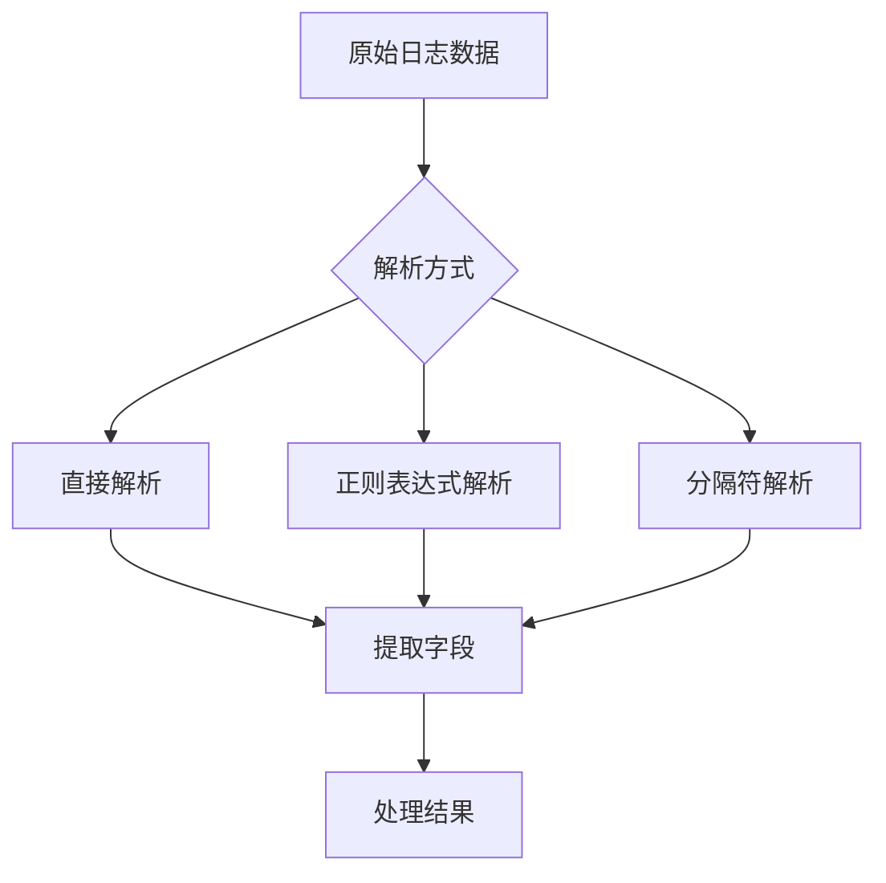
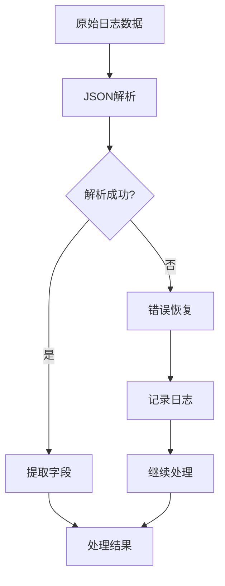

# JSON提取

<cite>
**本文档引用的文件**   
- [bk_log_json.py](file://bklog/apps/log_databus/handlers/etl_storage/bk_log_json.py)
- [base.py](file://bklog/apps/log_databus/handlers/etl_storage/base.py)
- [constants.py](file://bklog/apps/log_databus/constants.py)
- [bk_log_regexp.py](file://bklog/apps/log_databus/handlers/etl_storage/bk_log_regexp.py)
- [bk_log_delimiter.py](file://bklog/apps/log_databus/handlers/etl_storage/bk_log_delimiter.py)
</cite>

## 目录
1. [简介](#简介)
2. [JSON解析机制](#json解析机制)
3. [核心功能](#核心功能)
4. [实现原理](#实现原理)
5. [配置选项](#配置选项)
6. [复杂JSON结构处理](#复杂json结构处理)
7. [常见问题解决方案](#常见问题解决方案)
8. [与其他提取方式的兼容性](#与其他提取方式的兼容性)
9. [总结](#总结)

## 简介
JSON提取功能是蓝鲸日志平台的核心组件之一，负责解析和提取JSON格式日志中的关键信息。该功能支持多种提取方式，包括JSON路径表达式、嵌套字段提取和数组处理等，能够高效地处理复杂的JSON结构。通过灵活的配置选项和强大的错误恢复机制，确保日志数据的准确性和完整性。

**本文档引用的文件**
- [bk_log_json.py](file://bklog/apps/log_databus/handlers/etl_storage/bk_log_json.py#L1-L428)
- [base.py](file://bklog/apps/log_databus/handlers/etl_storage/base.py#L1-L1457)
- [constants.py](file://bklog/apps/log_databus/constants.py#L1-L745)

## JSON解析机制
JSON解析机制是JSON提取功能的基础，通过解析JSON格式的日志数据，提取出所需的字段信息。该机制支持多种解析方式，包括直接解析、正则表达式解析和分隔符解析等。

**图源**
- [bk_log_json.py](file://bklog/apps/log_databus/handlers/etl_storage/bk_log_json.py#L1-L428)
- [bk_log_regexp.py](file://bklog/apps/log_databus/handlers/etl_storage/bk_log_regexp.py#L1-L421)
- [bk_log_delimiter.py](file://bklog/apps/log_databus/handlers/etl_storage/bk_log_delimiter.py#L1-L506)

**本文档引用的文件**
- [bk_log_json.py](file://bklog/apps/log_databus/handlers/etl_storage/bk_log_json.py#L1-L428)
- [bk_log_regexp.py](file://bklog/apps/log_databus/handlers/etl_storage/bk_log_regexp.py#L1-L421)
- [bk_log_delimiter.py](file://bklog/apps/log_databus/handlers/etl_storage/bk_log_delimiter.py#L1-L506)

## 核心功能
### JSON路径表达式
JSON路径表达式用于从JSON数据中提取特定字段。支持多种路径表达式，如`$.field`、`$..field`等，能够灵活地定位和提取所需数据。

### 嵌套字段提取
嵌套字段提取功能支持从多层嵌套的JSON结构中提取字段。通过递归解析，能够处理复杂的嵌套结构，确保数据的完整性和准确性。

### 数组处理
数组处理功能支持从JSON数组中提取数据。通过迭代数组元素，能够提取每个元素中的字段信息，并进行相应的处理。

**本文档引用的文件**
- [bk_log_json.py](file://bklog/apps/log_databus/handlers/etl_storage/bk_log_json.py#L1-L428)
- [base.py](file://bklog/apps/log_databus/handlers/etl_storage/base.py#L1-L1457)

## 实现原理
### JSON解析器选择
JSON解析器选择是JSON提取功能的关键。系统支持多种解析器，包括内置解析器和第三方解析器，能够根据实际需求选择合适的解析器。

### 性能优化
性能优化是确保JSON提取功能高效运行的重要措施。通过缓存机制、并行处理等技术，显著提升了数据处理速度和系统响应时间。

### 错误恢复
错误恢复机制确保在解析过程中遇到错误时，系统能够自动恢复并继续处理后续数据。通过日志记录和异常处理，提高了系统的稳定性和可靠性。

**图源**
- [bk_log_json.py](file://bklog/apps/log_databus/handlers/etl_storage/bk_log_json.py#L1-L428)
- [base.py](file://bklog/apps/log_databus/handlers/etl_storage/base.py#L1-L1457)

**本文档引用的文件**
- [bk_log_json.py](file://bklog/apps/log_databus/handlers/etl_storage/bk_log_json.py#L1-L428)
- [base.py](file://bklog/apps/log_databus/handlers/etl_storage/base.py#L1-L1457)

## 配置选项
### 严格模式
严格模式下，系统会对JSON数据进行严格的校验，确保数据的完整性和准确性。任何不符合规范的数据都会被拒绝。

### 宽松模式
宽松模式下，系统会尽量解析和提取数据，即使数据存在轻微的格式错误。适用于对数据完整性要求不高的场景。

### 时间字段自动识别
时间字段自动识别功能能够自动识别和提取JSON数据中的时间字段，并进行相应的格式转换和处理。

**本文档引用的文件**
- [bk_log_json.py](file://bklog/apps/log_databus/handlers/etl_storage/bk_log_json.py#L1-L428)
- [base.py](file://bklog/apps/log_databus/handlers/etl_storage/base.py#L1-L1457)
- [constants.py](file://bklog/apps/log_databus/constants.py#L1-L745)

## 复杂JSON结构处理
### 多层嵌套
多层嵌套的JSON结构处理通过递归解析实现。系统能够逐层解析嵌套结构，提取每一层的字段信息。

### 动态字段
动态字段提取功能支持从JSON数据中提取动态生成的字段。通过模式匹配和正则表达式，能够灵活地处理动态字段。

**本文档引用的文件**
- [bk_log_json.py](file://bklog/apps/log_databus/handlers/etl_storage/bk_log_json.py#L1-L428)
- [base.py](file://bklog/apps/log_databus/handlers/etl_storage/base.py#L1-L1457)

## 常见问题解决方案
### JSON格式错误
当遇到JSON格式错误时，系统会记录详细的错误日志，并尝试恢复。通过日志分析，可以快速定位和解决问题。

### 特殊字符处理
特殊字符处理功能能够正确解析和提取包含特殊字符的JSON数据。通过转义和编码，确保数据的完整性和准确性。

### 性能瓶颈
性能瓶颈问题通过优化算法和增加硬件资源解决。通过性能监控和调优，确保系统在高负载下仍能稳定运行。

**本文档引用的文件**
- [bk_log_json.py](file://bklog/apps/log_databus/handlers/etl_storage/bk_log_json.py#L1-L428)
- [base.py](file://bklog/apps/log_databus/handlers/etl_storage/base.py#L1-L1457)

## 与其他提取方式的兼容性
JSON提取功能与其他提取方式（如正则表达式提取、分隔符提取）具有良好的兼容性。通过统一的接口和配置，能够灵活地组合使用不同的提取方式，满足多样化的数据处理需求。

**本文档引用的文件**
- [bk_log_json.py](file://bklog/apps/log_databus/handlers/etl_storage/bk_log_json.py#L1-L428)
- [bk_log_regexp.py](file://bklog/apps/log_databus/handlers/etl_storage/bk_log_regexp.py#L1-L421)
- [bk_log_delimiter.py](file://bklog/apps/log_databus/handlers/etl_storage/bk_log_delimiter.py#L1-L506)

## 总结
JSON提取功能是蓝鲸日志平台的重要组成部分，通过高效的解析机制和灵活的配置选项，能够处理复杂的JSON数据。通过性能优化和错误恢复机制，确保了系统的稳定性和可靠性。未来将继续优化和扩展功能，以满足更多应用场景的需求。

**本文档引用的文件**
- [bk_log_json.py](file://bklog/apps/log_databus/handlers/etl_storage/bk_log_json.py#L1-L428)
- [base.py](file://bklog/apps/log_databus/handlers/etl_storage/base.py#L1-L1457)
- [constants.py](file://bklog/apps/log_databus/constants.py#L1-L745)