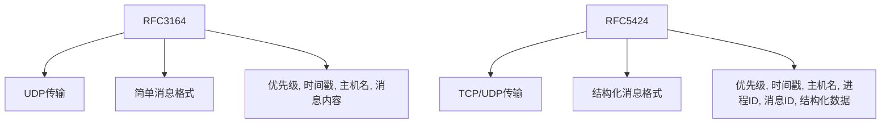
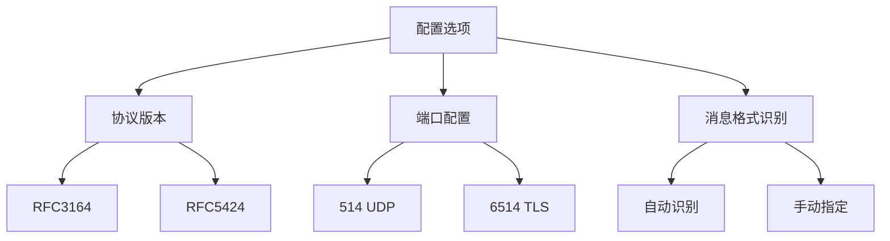
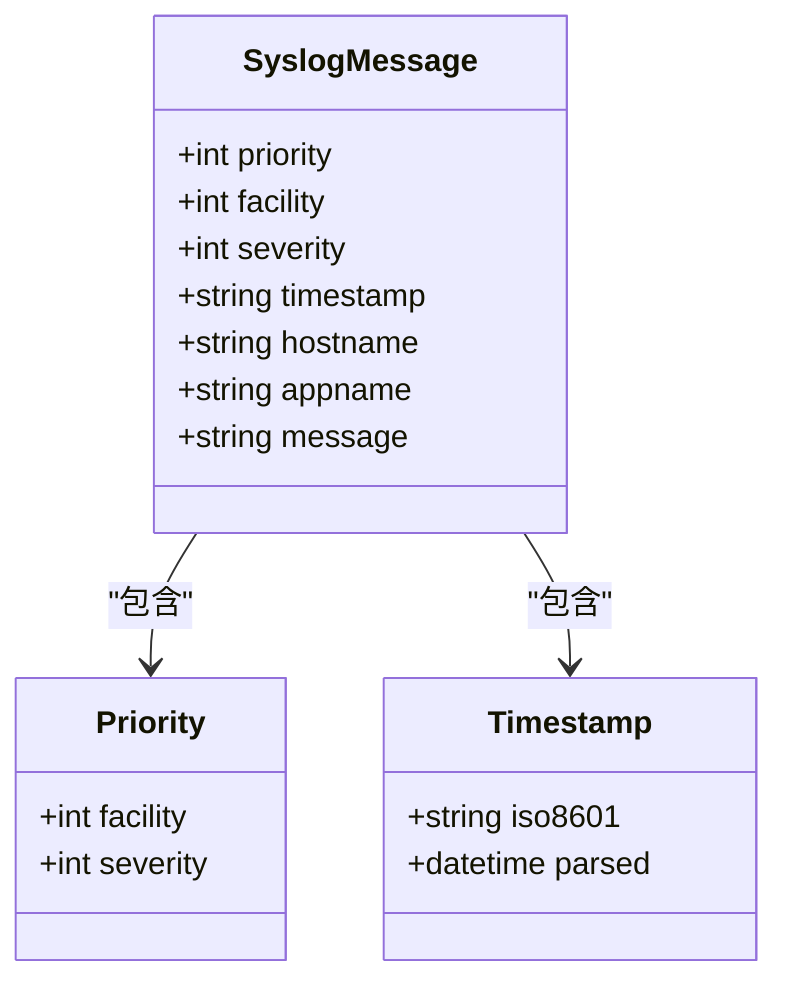
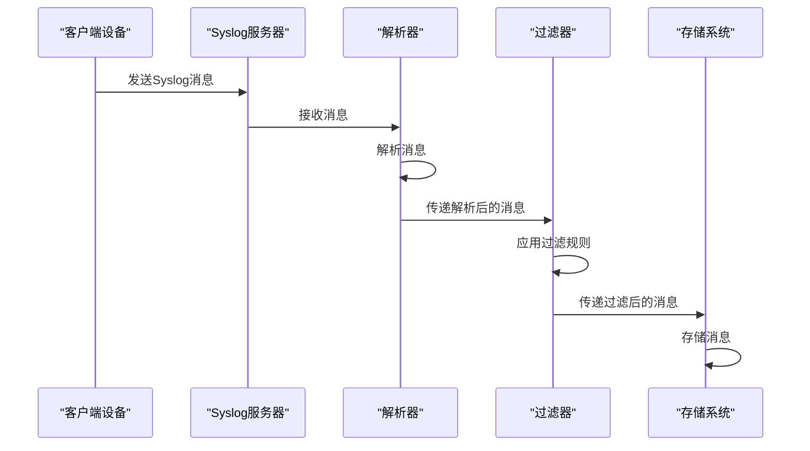
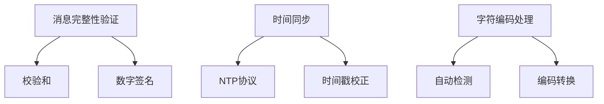
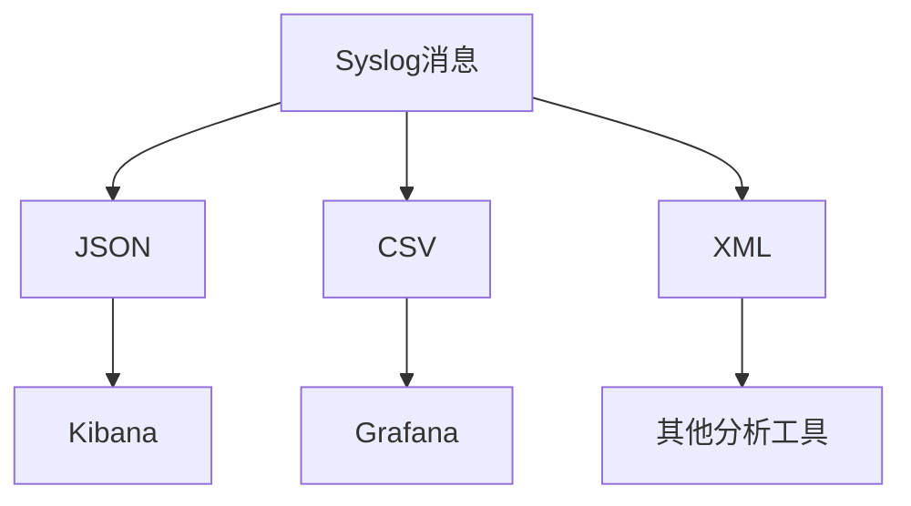

# Syslog提取

<cite>
**本文档引用的文件**
- [syslog.py](file://bklog/apps/log_databus/handlers/collector_scenario/syslog.py)
- [constants.py](file://bklog/apps/log_databus/constants.py)
- [base.py](file://bklog/apps/log_databus/handlers/collector_scenario/base.py)
</cite>

## 目录
1. [简介](#简介)
2. [Syslog协议支持](#syslog协议支持)
3. [配置选项](#配置选项)
4. [消息结构解析](#消息结构解析)
5. [处理流程](#处理流程)
6. [高级主题](#高级主题)
7. [集成与转换](#集成与转换)
8. [结论](#结论)

## 简介
Syslog提取功能是蓝鲸日志平台的重要组成部分，用于收集和处理来自各种设备和系统的Syslog协议日志。该功能支持RFC3164和RFC5424标准，能够解析和提取Syslog消息中的关键字段，如优先级、设施、严重性、时间戳、主机名、应用名等。通过灵活的配置选项，用户可以自定义采集行为，包括协议版本、端口配置和消息格式识别。此外，该功能还提供了高级特性，如消息完整性验证、时间同步和字符编码处理，确保日志数据的准确性和可靠性。

## Syslog协议支持
Syslog提取功能支持两种主要的Syslog协议标准：RFC3164和RFC5424。这两种标准定义了Syslog消息的格式和传输方式，确保了不同设备和系统之间的兼容性。

### RFC3164
RFC3164是较早的Syslog协议标准，定义了基本的Syslog消息格式。它使用UDP协议进行传输，消息格式较为简单，包含优先级、时间戳、主机名和消息内容等字段。

### RFC5424
RFC5424是更新的Syslog协议标准，提供了更丰富的消息格式和更强的安全性。它支持TCP和UDP协议，消息格式更加结构化，包含更多的元数据字段，如进程ID、消息ID和结构化数据等。

**图表来源**
- [constants.py](file://bklog/apps/log_databus/constants.py#L651-L659)

## 配置选项
Syslog提取功能提供了多种配置选项，允许用户根据具体需求进行定制。这些选项包括协议版本、端口配置、消息格式识别等。

### 协议版本
用户可以选择使用RFC3164或RFC5424协议版本。默认情况下，系统会自动识别消息格式，但也可以手动指定。

### 端口配置
Syslog消息通常通过特定端口传输，常见的端口包括514（UDP）和6514（TLS）。用户可以配置监听端口，以确保正确接收日志消息。

### 消息格式识别
系统支持自动识别和解析不同格式的Syslog消息。用户可以通过配置过滤规则，指定需要提取的字段和条件。

**图表来源**
- [syslog.py](file://bklog/apps/log_databus/handlers/collector_scenario/syslog.py#L34-L87)

## 消息结构解析
Syslog消息的结构解析是提取功能的核心部分。系统会解析消息中的各个字段，并将其转换为结构化的数据，以便后续处理和分析。

### 优先级
优先级字段表示消息的重要程度，由设施和严重性两个部分组成。设施表示消息的来源，严重性表示消息的紧急程度。

### 设施
设施字段表示消息的来源，常见的设施包括内核、用户级、邮件系统等。每个设施都有一个唯一的编号。

### 严重性
严重性字段表示消息的紧急程度，范围从0（紧急）到7（调试）。不同的严重性级别对应不同的处理策略。

### 时间戳
时间戳字段表示消息生成的时间，通常采用ISO 8601格式。系统会解析时间戳，并将其转换为统一的时间格式。

### 主机名
主机名字段表示生成消息的设备名称。系统会提取主机名，并将其作为元数据存储。

### 应用名
应用名字段表示生成消息的应用程序名称。系统会提取应用名，并将其作为元数据存储。

**图表来源**
- [syslog.py](file://bklog/apps/log_databus/handlers/collector_scenario/syslog.py#L127-L263)

## 处理流程
Syslog提取功能的处理流程包括消息接收、解析、过滤和存储。每个步骤都经过精心设计，确保高效和可靠地处理大量日志数据。

### 消息接收
系统通过配置的端口接收Syslog消息。支持UDP和TCP协议，确保不同设备和系统的兼容性。

### 解析
接收到的消息会被解析成结构化的数据。系统会提取优先级、设施、严重性、时间戳、主机名、应用名等字段，并进行验证。

### 过滤
用户可以配置过滤规则，指定需要保留或丢弃的消息。过滤规则基于消息的各个字段，支持逻辑运算符（AND、OR）。

### 存储
解析和过滤后的消息会被存储到指定的存储系统中，如Elasticsearch。系统会确保数据的完整性和一致性。

**图表来源**
- [syslog.py](file://bklog/apps/log_databus/handlers/collector_scenario/syslog.py#L34-L87)

## 高级主题
除了基本的Syslog提取功能，系统还提供了一些高级特性，以增强日志处理的灵活性和可靠性。

### 消息完整性验证
系统支持消息完整性验证，确保接收到的消息未被篡改。通过校验和或其他机制，可以检测和防止恶意修改。

### 时间同步
为了确保日志数据的准确性，系统支持时间同步。通过NTP协议，可以同步各个设备的时间，避免时间偏差。

### 字符编码处理
Syslog消息可能使用不同的字符编码，如UTF-8、GBK等。系统会自动检测和转换字符编码，确保日志内容的正确显示。

**图表来源**
- [syslog.py](file://bklog/apps/log_databus/handlers/collector_scenario/syslog.py#L127-L263)

## 集成与转换
Syslog提取功能可以与其他采集方式集成，实现数据的统一管理和分析。通过转换策略，可以将Syslog消息转换为其他格式，如JSON、CSV等，便于与其他系统对接。

### 集成
系统支持与多种数据源集成，如文件日志、网络日志、数据库日志等。通过统一的接口，可以方便地扩展采集能力。

### 转换
Syslog消息可以转换为其他格式，如JSON、CSV等。转换后的数据可以导入到不同的分析工具中，如Kibana、Grafana等。

**图表来源**
- [syslog.py](file://bklog/apps/log_databus/handlers/collector_scenario/syslog.py#L34-L87)

## 结论
Syslog提取功能是蓝鲸日志平台的关键组件，提供了强大的日志收集和处理能力。通过支持RFC3164和RFC5424标准，灵活的配置选项，以及高级特性，系统能够满足各种复杂场景的需求。未来，我们将继续优化和扩展该功能，提升日志处理的效率和可靠性。

**文档来源**
- [syslog.py](file://bklog/apps/log_databus/handlers/collector_scenario/syslog.py)
- [constants.py](file://bklog/apps/log_databus/constants.py)
- [base.py](file://bklog/apps/log_databus/handlers/collector_scenario/base.py)