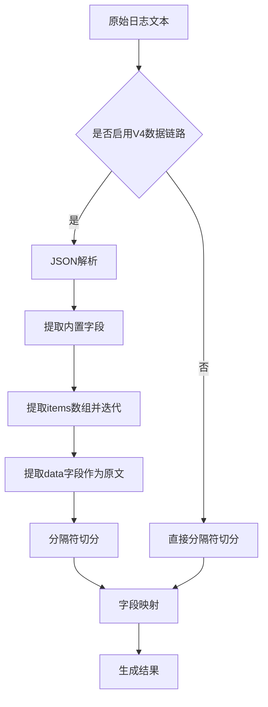
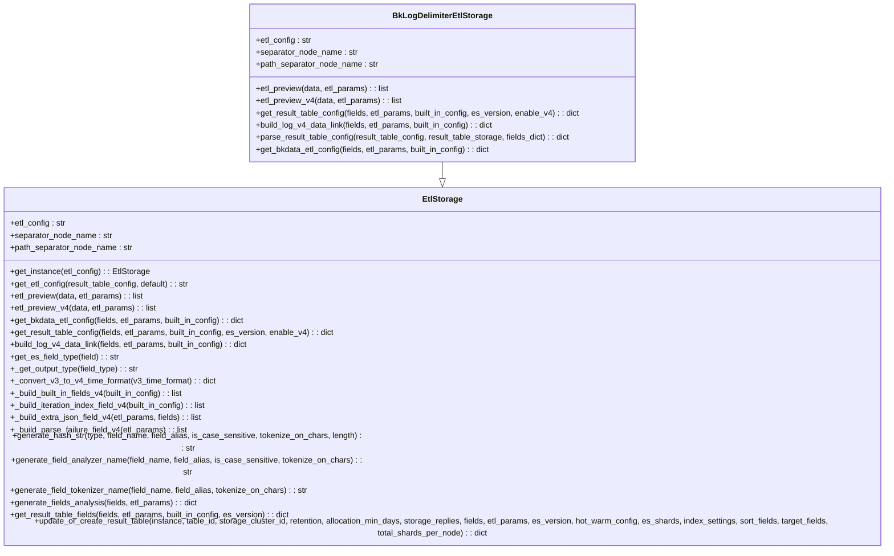
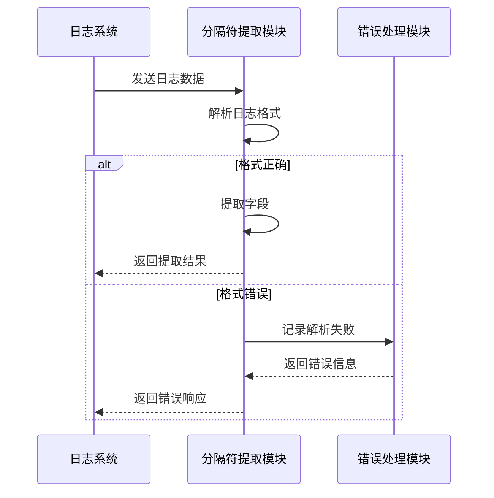

# 分隔符提取

<cite>
**本文档引用的文件**   
- [bk_log_delimiter.py](file://bklog/apps/log_databus/handlers/etl_storage/bk_log_delimiter.py)
- [base.py](file://bklog/apps/log_databus/handlers/etl_storage/base.py)
- [bk_log_regexp.py](file://bklog/apps/log_databus/handlers/etl_storage/bk_log_regexp.py)
- [constants.py](file://bklog/apps/log_databus/constants.py)
- [transfer.py](file://bklog/apps/log_databus/handlers/etl_storage/utils/transfer.py)
- [test_etl.py](file://bklog/apps/tests/log_databus/test_etl.py)
</cite>

## 目录
1. [简介](#简介)
2. [分隔符提取原理](#分隔符提取原理)
3. [配置参数详解](#配置参数详解)
4. [实现机制分析](#实现机制分析)
5. [配置示例](#配置示例)
6. [性能优化建议](#性能优化建议)
7. [错误处理机制](#错误处理机制)
8. [总结](#总结)

## 简介
分隔符提取是日志数据处理中的关键环节，用于从原始日志文本中提取结构化字段。本系统支持多种分隔符提取方式，包括字段分隔符、行分隔符等，能够处理CSV、TSV等常见格式的日志数据。通过灵活的配置选项，用户可以定义分隔符类型、引号处理、转义字符等参数，实现对日志数据的精确解析。

## 分隔符提取原理
分隔符提取基于预定义的分隔符将日志文本分割成多个字段。系统首先根据配置的分隔符对日志原文进行切分，然后将切分后的字段映射到相应的字段名称。对于复杂的日志格式，系统还支持嵌套对象的提取和路径信息的解析。



**图源**
- [bk_log_delimiter.py](file://bklog/apps/log_databus/handlers/etl_storage/bk_log_delimiter.py#L179-L324)

## 配置参数详解
分隔符提取功能提供了丰富的配置参数，以满足不同场景的需求。

### 基础配置
- **separator**: 分隔符，用于分割日志文本中的字段
- **retain_original_text**: 是否保留原始文本
- **etl_flat**: 是否启用扁平化处理
- **enable_retain_content**: 是否启用内容保留

### 高级配置
- **separator_node_action**: 分隔符节点操作类型
- **separator_node_name**: 分隔符节点名称
- **separator_field_list**: 分隔符字段列表
- **record_parse_failure**: 是否记录解析失败

### 路径配置
- **separator_configs**: 分隔符配置列表
- **separator_regexp**: 路径正则表达式

**参数说明表**
| 参数名称 | 类型 | 默认值 | 说明 |
|--------|------|-------|------|
| separator | string | 无 | 字段分隔符 |
| retain_original_text | boolean | false | 是否保留原始文本 |
| etl_flat | boolean | false | 是否启用扁平化处理 |
| enable_retain_content | boolean | false | 是否启用内容保留 |
| separator_node_action | string | delimiter | 分隔符节点操作类型 |
| separator_node_name | string | bk_separator_object | 分隔符节点名称 |
| record_parse_failure | boolean | false | 是否记录解析失败 |

**节源**
- [bk_log_delimiter.py](file://bklog/apps/log_databus/handlers/etl_storage/bk_log_delimiter.py#L124-L132)
- [constants.py](file://bklog/apps/log_databus/constants.py#L207-L209)

## 实现机制分析
分隔符提取的实现机制主要包括字段位置映射、字段类型转换和空值处理等关键环节。

### 字段位置映射
系统通过`separator_field_list`参数定义字段的位置映射关系。该列表中的每个元素对应一个字段，其值可以是字段名称、忽略标记(ETL_DELIMITER_IGNORE)或删除标记(ETL_DELIMITER_DELETE)。



**图源**
- [bk_log_delimiter.py](file://bklog/apps/log_databus/handlers/etl_storage/bk_log_delimiter.py#L43-L505)
- [base.py](file://bklog/apps/log_databus/handlers/etl_storage/base.py#L62-L800)

### 字段类型转换
系统支持多种字段类型，包括字符串、整数、浮点数、布尔值等。在提取过程中，系统会根据配置的字段类型进行相应的类型转换。

### 空值处理
对于缺失的字段，系统会使用忽略标记(ETL_DELIMITER_IGNORE)进行占位，确保字段位置的正确性。对于需要删除的字段，使用删除标记(ETL_DELIMITER_DELETE)。

**节源**
- [bk_log_delimiter.py](file://bklog/apps/log_databus/handlers/etl_storage/bk_log_delimiter.py#L137-L157)
- [constants.py](file://bklog/apps/log_databus/constants.py#L207-L209)

## 配置示例
以下是一些常见的分隔符提取配置示例。

### CSV格式日志
```json
{
  "separator": ",",
  "retain_original_text": true,
  "etl_flat": false,
  "enable_retain_content": false,
  "separator_field_list": ["timestamp", "level", "message", "ip", "url", "status", "duration", "user_data"]
}
```

### TSV格式日志
```json
{
  "separator": "\t",
  "retain_original_text": true,
  "etl_flat": false,
  "enable_retain_content": false,
  "separator_field_list": ["timestamp", "level", "message", "ip", "url", "status", "duration", "user_data"]
}
```

### 包含路径信息的日志
```json
{
  "separator": "|",
  "retain_original_text": true,
  "etl_flat": false,
  "enable_retain_content": false,
  "separator_field_list": ["timestamp", "level", "message", "ip", "url", "status", "duration", "user_data"],
  "separator_configs": [
    {
      "separator_regexp": "/var/log/(?<service>[^/]+)/(?<filename>[^/]+)\\.log"
    }
  ]
}
```

**节源**
- [test_etl.py](file://bklog/apps/tests/log_databus/test_etl.py#L302-L311)
- [bk_log_delimiter.py](file://bklog/apps/log_databus/handlers/etl_storage/bk_log_delimiter.py#L83-L98)

## 性能优化建议
为了提高分隔符提取的性能，建议采取以下措施：

### 分隔符预编译
对于频繁使用的分隔符，建议进行预编译处理，避免重复解析。

### 批量处理
尽量采用批量处理的方式，减少单条日志处理的开销。

### 字段列表优化
合理配置`separator_field_list`，避免不必要的字段映射。

### 缓存机制
利用缓存机制存储常用的配置信息，减少重复计算。

**节源**
- [bk_log_delimiter.py](file://bklog/apps/log_databus/handlers/etl_storage/bk_log_delimiter.py#L158-L159)
- [base.py](file://bklog/apps/log_databus/handlers/etl_storage/base.py#L420-L440)

## 错误处理机制
系统提供了完善的错误处理机制，能够应对各种异常情况。

### 格式错误处理
当日志格式不符合预期时，系统会记录解析失败，并提供详细的错误信息。

### 字段缺失处理
对于缺失的字段，系统会使用忽略标记进行占位，确保后续处理的正常进行。

### 异常捕获
系统通过异常捕获机制，能够及时发现并处理各种运行时异常。



**图源**
- [bk_log_delimiter.py](file://bklog/apps/log_databus/handlers/etl_storage/bk_log_delimiter.py#L53-L54)
- [bk_log_regexp.py](file://bklog/apps/log_databus/handlers/etl_storage/bk_log_regexp.py#L43-L49)

## 总结
分隔符提取功能是日志数据处理的核心组件，通过灵活的配置和高效的实现机制，能够满足各种复杂的日志解析需求。合理的配置和优化措施可以显著提升系统的性能和稳定性。