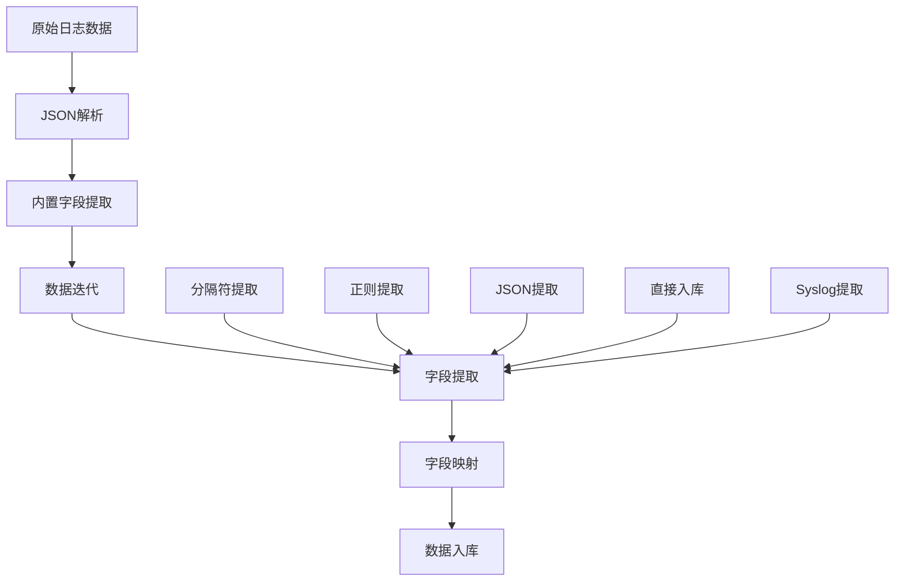
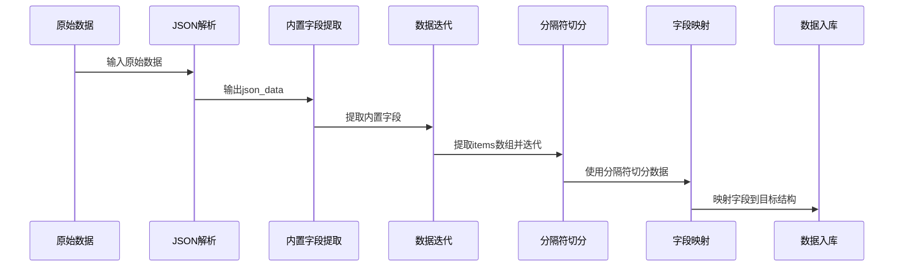
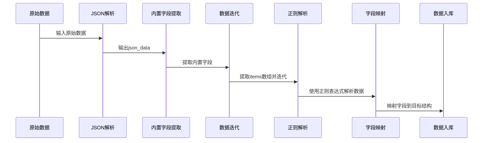
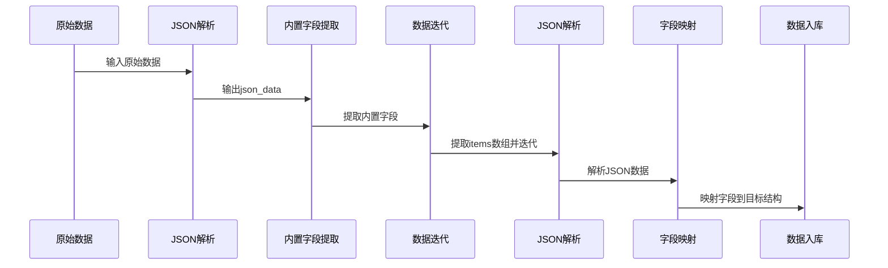
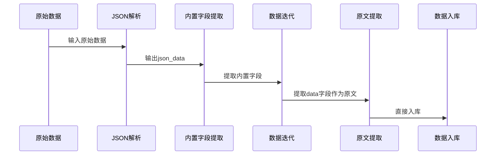
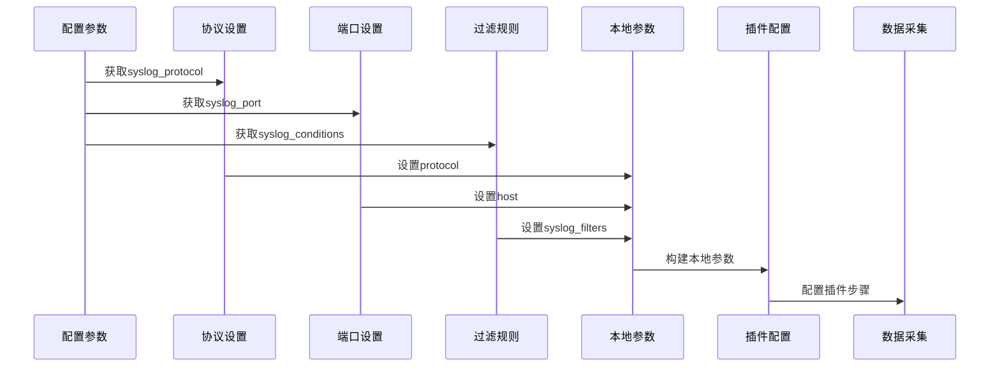
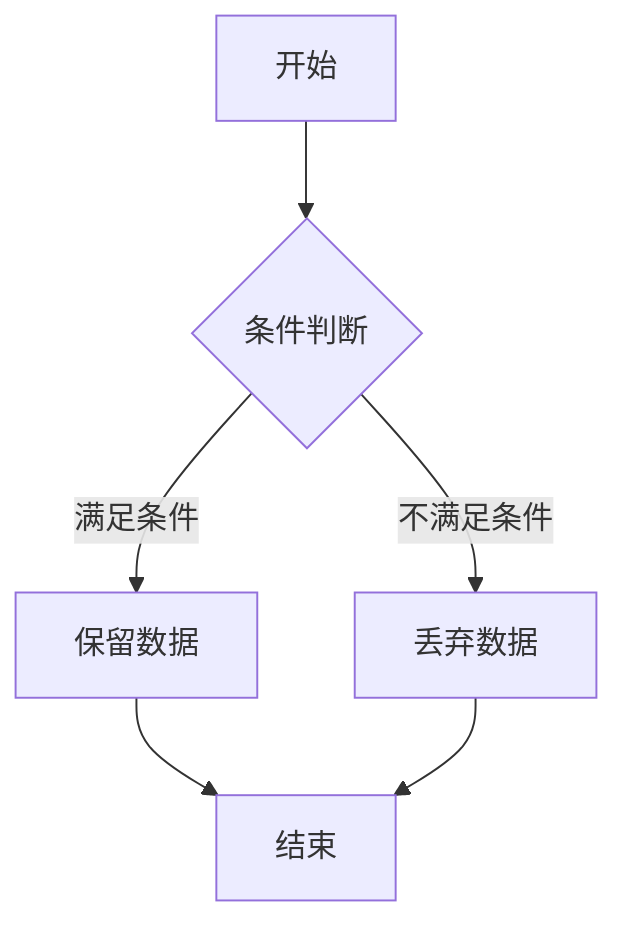

# 数据处理

<cite>
**本文档引用的文件**   
- [bk_log_regexp.py](file://bklog/apps/log_databus/handlers/etl_storage/bk_log_regexp.py)
- [bk_log_json.py](file://bklog/apps/log_databus/handlers/etl_storage/bk_log_json.py)
- [bk_log_delimiter.py](file://bklog/apps/log_databus/handlers/etl_storage/bk_log_delimiter.py)
- [bk_log_text.py](file://bklog/apps/log_databus/handlers/etl_storage/bk_log_text.py)
- [base.py](file://bklog/apps/log_databus/handlers/etl_storage/base.py)
- [constants.py](file://bklog/apps/log_databus/constants.py)
- [syslog.py](file://bklog/apps/log_databus/handlers/collector_scenario/syslog.py)
- [transfer.py](file://bklog/apps/log_databus/handlers/etl_storage/utils/transfer.py)
</cite>

## 目录
1. [引言](#引言)
2. [数据处理架构](#数据处理架构)
3. [核心ETL模式实现](#核心etl模式实现)
4. [数据清洗与转换规则](#数据清洗与转换规则)
5. [不同采集场景处理策略](#不同采集场景处理策略)
6. [性能优化技巧](#性能优化技巧)
7. [实际处理案例](#实际处理案例)
8. [错误排查指南](#错误排查指南)
9. [结论](#结论)

## 引言
本文档详细介绍了蓝鲸日志平台的数据处理功能，全面覆盖日志数据的提取（ETL）流程。文档涵盖了分隔符提取、JSON提取、正则提取、Syslog提取等多种模式的实现原理和配置方法。同时，详细描述了数据清洗和转换规则，包括字段提取、类型转换、数据过滤等处理步骤。文档还说明了不同采集场景下的数据处理策略，如行日志、段日志、自定义日志等的处理方式。此外，文档化了数据处理性能优化技巧，包括正则表达式优化、字段索引设置等，并提供了实际处理案例，展示复杂日志格式的解析方法。最后，包含数据处理错误排查指南和常见问题解决方案。

## 数据处理架构
蓝鲸日志平台的数据处理架构基于ETL（提取、转换、加载）流程，通过多种数据处理模式支持不同类型的日志数据。架构主要包括以下几个核心组件：采集器场景（Collector Scenario）、ETL存储处理器（EtlStorage）、内置配置管理（Built-in Config）和数据链路配置（Data Link Configuration）。



**图表来源**
- [base.py](file://bklog/apps/log_databus/handlers/etl_storage/base.py#L123-L131)
- [bk_log_regexp.py](file://bklog/apps/log_databus/handlers/etl_storage/bk_log_regexp.py#L164-L252)
- [bk_log_json.py](file://bklog/apps/log_databus/handlers/etl_storage/bk_log_json.py#L132-L226)
- [bk_log_delimiter.py](file://bklog/apps/log_databus/handlers/etl_storage/bk_log_delimiter.py#L182-L274)

**章节来源**
- [base.py](file://bklog/apps/log_databus/handlers/etl_storage/base.py#L62-L85)
- [constants.py](file://bklog/apps/log_databus/constants.py#L377-L383)

## 核心ETL模式实现
### 分隔符提取模式
分隔符提取模式通过指定的分隔符将日志数据切分为多个字段。该模式支持自定义分隔符，并能够处理复杂的分隔符组合。



**图表来源**
- [bk_log_delimiter.py](file://bklog/apps/log_databus/handlers/etl_storage/bk_log_delimiter.py#L180-L274)

**章节来源**
- [bk_log_delimiter.py](file://bklog/apps/log_databus/handlers/etl_storage/bk_log_delimiter.py#L43-L71)

### 正则提取模式
正则提取模式利用正则表达式从日志数据中提取特定字段。该模式支持复杂的正则表达式，并能够处理嵌套的字段结构。



**图表来源**
- [bk_log_regexp.py](file://bklog/apps/log_databus/handlers/etl_storage/bk_log_regexp.py#L162-L252)

**章节来源**
- [bk_log_regexp.py](file://bklog/apps/log_databus/handlers/etl_storage/bk_log_regexp.py#L36-L69)

### JSON提取模式
JSON提取模式专门用于处理JSON格式的日志数据。该模式能够解析嵌套的JSON结构，并提取其中的字段。



**图表来源**
- [bk_log_json.py](file://bklog/apps/log_databus/handlers/etl_storage/bk_log_json.py#L131-L226)

**章节来源**
- [bk_log_json.py](file://bklog/apps/log_databus/handlers/etl_storage/bk_log_json.py#L32-L39)

### 直接入库模式
直接入库模式将原始日志数据直接存储到目标系统中，不进行任何字段提取或转换。该模式适用于需要保留原始日志数据的场景。



**图表来源**
- [bk_log_text.py](file://bklog/apps/log_databus/handlers/etl_storage/bk_log_text.py#L95-L142)

**章节来源**
- [bk_log_text.py](file://bklog/apps/log_databus/handlers/etl_storage/bk_log_text.py#L35-L42)

### Syslog提取模式
Syslog提取模式专门用于处理Syslog协议的日志数据。该模式支持Syslog协议的各种特性，如协议类型、端口配置和过滤规则。



**图表来源**
- [syslog.py](file://bklog/apps/log_databus/handlers/collector_scenario/syslog.py#L34-L87)

**章节来源**
- [syslog.py](file://bklog/apps/log_databus/handlers/collector_scenario/syslog.py#L29-L33)

## 数据清洗与转换规则
### 字段提取与类型转换
数据清洗过程中，系统会根据配置的ETL模式提取字段，并进行类型转换。字段类型包括字符串、整数、浮点数、布尔值等。

**字段类型映射表**

| 字段类型 | ES类型 | 描述 |
|---------|-------|------|
| string | text/keyword | 字符串类型 |
| int | long | 整数类型 |
| float | double | 浮点数类型 |
| boolean | boolean | 布尔类型 |
| object | object | 对象类型 |

**章节来源**
- [base.py](file://bklog/apps/log_databus/handlers/etl_storage/base.py#L140-L156)

### 数据过滤与条件处理
系统支持基于条件的数据过滤，可以根据字段值、正则表达式等条件过滤日志数据。



**章节来源**
- [syslog.py](file://bklog/apps/log_databus/handlers/collector_scenario/syslog.py#L40-L67)

### 内置字段处理
系统提供了一系列内置字段，如时间戳、主机ID、云区域ID等，这些字段在数据处理过程中自动提取和处理。

**内置字段列表**

| 字段名称 | 别名 | 描述 |
|---------|-----|------|
| bk_host_id | bk_host_id | 主机ID |
| cloudId | cloudid | 云区域ID |
| serverIp | ip | IP地址 |
| gseIndex | gseindex | GSE索引 |
| iterationIndex | iterationindex | 迭代ID |
| dtEventTimeStamp | dtEventTimeStamp | 事件时间戳 |

**章节来源**
- [syslog.py](file://bklog/apps/log_databus/handlers/collector_scenario/syslog.py#L151-L199)

## 不同采集场景处理策略
### 行日志处理
行日志处理策略适用于每行一条日志记录的场景。系统会逐行读取日志文件，并对每行进行独立处理。

**章节来源**
- [test_e2e_collectorviewsetapi.py](file://bklog/apps/tests/log_databus/test_e2e_collectorviewsetapi.py#L59-L78)

### 段日志处理
段日志处理策略适用于多行组成一条完整日志记录的场景。系统会将多行日志合并为一个完整的记录进行处理。

**章节来源**
- [test_e2e_collectorviewsetapi.py](file://bklog/apps/tests/log_databus/test_e2e_collectorviewsetapi.py#L81-L99)

### 自定义日志处理
自定义日志处理策略允许用户定义自己的日志格式和处理规则。系统提供了灵活的配置选项，支持各种复杂的日志格式。

**章节来源**
- [custom.py](file://bklog/apps/log_databus/handlers/collector_scenario/custom_define/custom.py#L51-L56)

## 性能优化技巧
### 正则表达式优化
优化正则表达式可以显著提高数据处理性能。建议使用具体的字符类而不是点号（.），避免不必要的捕获组，并使用非贪婪匹配。

**章节来源**
- [bk_log_regexp.py](file://bklog/apps/log_databus/handlers/etl_storage/bk_log_regexp.py#L46-L49)

### 字段索引设置
合理设置字段索引可以提高查询性能。对于经常用于查询的字段，建议设置为`keyword`类型，并启用`doc_values`。

**章节来源**
- [base.py](file://bklog/apps/log_databus/handlers/etl_storage/base.py#L682-L684)

### 分片与副本配置
合理的分片和副本配置可以提高系统的可扩展性和容错性。建议根据数据量和查询负载调整分片数和副本数。

**章节来源**
- [base.py](file://bklog/apps/log_databus/handlers/etl_storage/base.py#L787-L790)

## 实际处理案例
### 复杂JSON日志解析
以下是一个复杂JSON日志的解析案例，展示了如何提取嵌套的字段结构。

```json
{
  "timestamp": "2023-06-20T10:00:00Z",
  "level": "INFO",
  "message": "User login successful",
  "user": {
    "id": 12345,
    "profile": {
      "email": "user@example.com",
      "name": "John Doe"
    }
  },
  "request": {
    "ip": "192.168.1.1",
    "method": "POST",
    "path": "/api/login"
  }
}
```

**章节来源**
- [test_etl.py](file://bklog/apps/tests/log_databus/test_etl.py#L988-L1004)

### 多行日志合并
以下是一个多行日志合并的案例，展示了如何将多行日志合并为一个完整的记录。

```
2023-06-20 10:00:00 ERROR Exception in thread "main"
java.lang.NullPointerException
    at com.example.MyClass.main(MyClass.java:10)
```

**章节来源**
- [test_e2e_collectorviewsetapi.py](file://bklog/apps/tests/log_databus/test_e2e_collectorviewsetapi.py#L81-L99)

## 错误排查指南
### 常见错误及解决方案
| 错误类型 | 可能原因 | 解决方案 |
|---------|--------|--------|
| 正则表达式无法匹配 | 正则表达式错误或日志格式不匹配 | 检查正则表达式和日志样本 |
| 分隔符为空 | 未配置分隔符 | 确保配置了有效的分隔符 |
| JSON解析失败 | 日志格式不是有效的JSON | 检查日志格式并确保是有效的JSON |
| 字段提取失败 | 字段名称或路径错误 | 检查字段名称和路径配置 |

**章节来源**
- [bk_log_regexp.py](file://bklog/apps/log_databus/handlers/etl_storage/bk_log_regexp.py#L43-L49)
- [bk_log_delimiter.py](file://bklog/apps/log_databus/handlers/etl_storage/bk_log_delimiter.py#L53-L55)
- [bk_log_json.py](file://bklog/apps/log_databus/handlers/etl_storage/bk_log_json.py#L39)

### 调试工具使用
系统提供了字段提取预览功能，可以帮助用户调试ETL配置。通过预览功能，可以查看字段提取的结果，快速定位问题。

**章节来源**
- [transfer.py](file://bklog/apps/log_databus/handlers/etl_storage/utils/transfer.py#L34-L103)

## 结论
本文档全面介绍了蓝鲸日志平台的数据处理功能，涵盖了ETL流程的各个方面。通过详细的实现原理和配置方法，用户可以更好地理解和使用数据处理功能。文档还提供了性能优化技巧和实际处理案例，帮助用户解决实际问题。希望本文档能为用户提供有价值的参考。