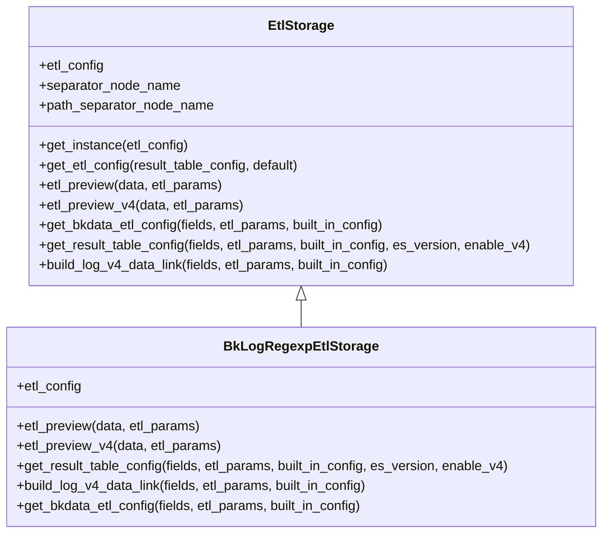
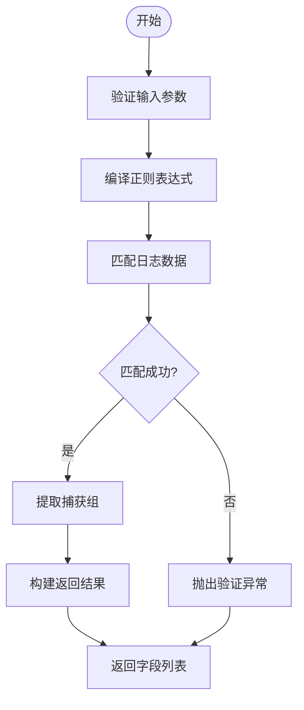

# 正则提取

<cite>
**本文档引用的文件**
- [bk_log_regexp.py](file://bklog/apps/log_databus/handlers/etl_storage/bk_log_regexp.py)
- [desensitize.py](file://bklog/apps/log_desensitize/handlers/desensitize.py)
- [base.py](file://bklog/apps/log_databus/handlers/etl_storage/base.py)
- [transfer.py](file://bklog/apps/log_databus/handlers/etl_storage/utils/transfer.py)
- [constants.py](file://bklog/apps/log_databus/constants.py)
</cite>

## 目录
1. [简介](#简介)
2. [正则提取核心概念](#正则提取核心概念)
3. [正则提取引擎实现机制](#正则提取引擎实现机制)
4. [配置参数与最佳实践](#配置参数与最佳实践)
5. [典型日志格式提取示例](#典型日志格式提取示例)
6. [调试技巧与性能优化](#调试技巧与性能优化)
7. [错误处理与异常应对](#错误处理与异常应对)

## 简介
正则提取功能是日志处理系统中的关键组件，用于从原始日志数据中提取结构化信息。该功能基于正则表达式技术，支持复杂的日志格式解析和字段提取。系统通过正则表达式匹配、捕获组使用和命名组配置等核心概念，实现高效的数据提取。正则提取引擎采用编译优化和回溯控制等关键技术，确保处理性能和稳定性。配置参数包括正则表达式测试、性能监控和安全限制等，提供了完整的最佳实践指南。系统支持Nginx访问日志、系统日志等典型格式的提取，并包含调试技巧和性能优化建议。

## 正则提取核心概念

正则提取功能基于正则表达式技术，通过模式匹配从日志数据中提取所需信息。系统支持捕获组和命名组配置，允许用户定义复杂的提取规则。正则表达式作为核心匹配模式，用于识别和提取日志中的特定字段。捕获组通过括号定义，可以提取匹配的子字符串。命名组使用`(?P<name>pattern)`语法，为捕获组提供可读性更强的名称。系统通过`re.compile()`方法编译正则表达式，提高匹配效率。匹配结果通过`groupdict()`方法获取，返回包含命名捕获组的字典。

**Section sources**
- [bk_log_regexp.py](file://bklog/apps/log_databus/handlers/etl_storage/bk_log_regexp.py#L46-L50)

## 正则提取引擎实现机制

正则提取引擎的实现基于`BkLogRegexpEtlStorage`类，该类继承自`EtlStorage`基类。引擎通过`etl_preview`方法实现字段提取预览功能，接收日志原文和提取参数作为输入。首先验证正则表达式参数是否为空，然后使用`re.compile()`编译正则表达式并进行匹配。如果匹配失败，抛出验证异常。匹配成功后，通过`groupdict()`获取命名捕获组的字典结果。引擎还支持V4版本的字段提取预览，通过调用`BkDataDatabusApi.databus_clean_debug` API实现。

**Diagram sources**
- [bk_log_regexp.py](file://bklog/apps/log_databus/handlers/etl_storage/bk_log_regexp.py#L33-L421)
- [base.py](file://bklog/apps/log_databus/handlers/etl_storage/base.py#L62-L800)

**Section sources**
- [bk_log_regexp.py](file://bklog/apps/log_databus/handlers/etl_storage/bk_log_regexp.py#L36-L119)
- [base.py](file://bklog/apps/log_databus/handlers/etl_storage/base.py#L96-L113)

## 配置参数与最佳实践

正则提取功能提供了一系列配置参数，包括正则表达式、保留原始文本、字段映射等。系统通过`get_result_table_config`方法配置清洗入库策略，验证字段是否在正则表达式中定义。配置选项包括保留原始文本、分隔符动作、正则表达式等。系统还支持V4数据链路的配置，构建完整的数据流转规则。最佳实践包括使用预编译的正则表达式、合理设置回溯限制、避免灾难性回溯等。性能监控通过API调用和响应解析实现，确保系统的稳定运行。

**Section sources**
- [bk_log_regexp.py](file://bklog/apps/log_databus/handlers/etl_storage/bk_log_regexp.py#L121-L158)
- [constants.py](file://bklog/apps/log_databus/constants.py#L377-L382)

## 典型日志格式提取示例

系统支持多种典型日志格式的正则提取，包括Nginx访问日志和系统日志。对于Nginx访问日志，可以使用类似`(?P<request_ip>[\\d\\.]+)[^[]+\\[(?P<request_time>[^]]+)\\]`的正则表达式提取IP地址和请求时间。系统日志可以通过定义适当的捕获组提取时间戳、日志级别和消息内容。配置时需要确保所有字段都在正则表达式中定义，并正确设置字段类型和分析选项。系统还支持路径字段的提取，通过`separator_configs`配置实现。

**Section sources**
- [bk_log_regexp.py](file://bklog/apps/log_databus/handlers/etl_storage/bk_log_regexp.py#L257-L302)
- [test_etl.py](file://bklog/apps/tests/log_databus/test_etl.py#L963-L982)

## 调试技巧与性能优化

正则提取功能提供了丰富的调试工具和性能优化建议。系统包含正则调试功能，通过`regex_debug`方法验证正则表达式的正确性。调试时可以使用日志样例测试正则表达式，查看匹配结果。性能优化建议包括使用原子组避免回溯、合理设置正则表达式的复杂度、避免使用贪婪匹配等。系统还提供了字段分析配置，通过`generate_fields_analysis`方法构建各个字段的分词器。对于复杂的正则表达式，建议分步测试和验证，确保匹配的准确性和效率。

**Diagram sources**
- [desensitize.py](file://bklog/apps/log_desensitize/handlers/desensitize.py#L487-L507)
- [bk_log_regexp.py](file://bklog/apps/log_databus/handlers/etl_storage/bk_log_regexp.py#L46-L50)

**Section sources**
- [desensitize.py](file://bklog/apps/log_desensitize/handlers/desensitize.py#L486-L507)
- [base.py](file://bklog/apps/log_databus/handlers/etl_storage/base.py#L545-L542)

## 错误处理与异常应对

正则提取功能实现了完善的错误处理机制。系统定义了多种异常类型，包括`ValidationError`、`RegexMatchException`等。当正则表达式为空或无法匹配时，抛出相应的验证异常。系统通过`try-catch`块捕获正则编译和匹配过程中的异常，提供详细的错误信息。对于正则表达式编译错误，系统捕获`re.error`异常并返回友好的错误提示。调试模式下，系统提供详细的匹配信息，包括匹配位置和内容。异常处理策略确保系统的健壮性，防止因单个日志条目问题影响整体处理流程。

**Section sources**
- [bk_log_regexp.py](file://bklog/apps/log_databus/handlers/etl_storage/bk_log_regexp.py#L43-L49)
- [desensitize.py](file://bklog/apps/log_desensitize/handlers/desensitize.py#L96-L101)