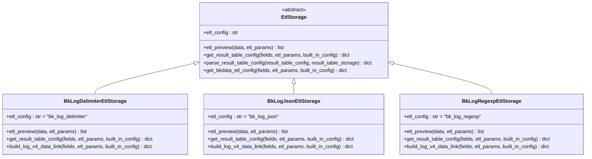
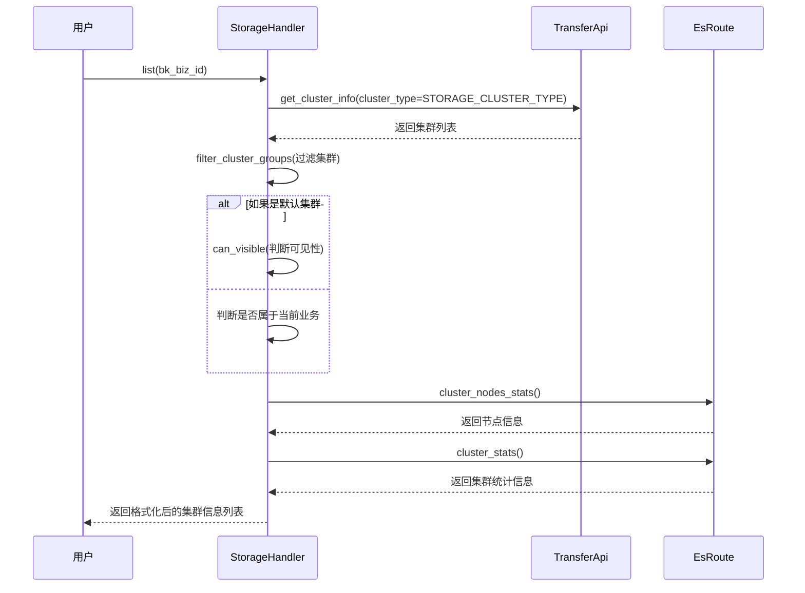

# 日志采集

<cite>
**本文档引用的文件**
- [models.py](file://bklog/apps/log_databus/models.py)
- [base.py](file://bklog/apps/log_databus/handlers/collector/base.py)
- [host.py](file://bklog/apps/log_databus/handlers/collector/host.py)
- [k8s.py](file://bklog/apps/log_databus/handlers/collector/k8s.py)
- [base.py](file://bklog/apps/log_databus/handlers/etl/base.py)
- [bkbase.py](file://bklog/apps/log_databus/handlers/etl/bkbase.py)
- [bk_log_delimiter.py](file://bklog/apps/log_databus/handlers/etl_storage/bk_log_delimiter.py)
- [bk_log_json.py](file://bklog/apps/log_databus/handlers/etl_storage/bk_log_json.py)
- [bk_log_regexp.py](file://bklog/apps/log_databus/handlers/etl_storage/bk_log_regexp.py)
- [storage.py](file://bklog/apps/log_databus/handlers/storage.py)
- [constants.py](file://bklog/apps/log_databus/constants.py)
</cite>

## 目录
1. [采集配置管理](#采集配置管理)
2. [采集器插件机制](#采集器插件机制)
3. [数据提取(ETL)流程](#数据提取etl流程)
4. [存储配置](#存储配置)
5. [采集任务生命周期](#采集任务生命周期)
6. [部署案例](#部署案例)
7. [性能调优与问题解决](#性能调优与问题解决)

## 采集配置管理

日志采集配置是整个日志采集系统的核心，它定义了从何处采集日志、如何采集以及采集后的处理方式。系统支持多种采集场景，包括主机采集、K8s容器采集和自定义采集。

采集配置的核心模型是`CollectorConfig`，它包含了采集项的名称、业务ID、采集场景、数据分类、采集目标、描述、是否可用等关键信息。对于主机采集，目标节点通过`target_nodes`字段定义，可以是具体的主机IP或业务拓扑中的模块、集群等。对于K8s容器采集，配置则通过`ContainerCollectorConfig`模型进行管理，支持按命名空间、工作负载、容器名称、标签等多种方式进行筛选。

创建和管理采集配置的流程如下：
1.  **创建采集配置**：通过`CollectorHandler`的`update_or_create`方法创建新的采集配置。该方法会首先验证采集项名称、数据ID（bk_data_id）和结果表ID（result_table_id）的唯一性，防止冲突。
2.  **配置采集目标**：根据`target_node_type`（实例、模块、集群等）和`target_nodes`来确定具体的采集目标。系统会通过节点管理（NodeApi）来订阅这些目标。
3.  **启动采集**：调用`start`方法启动采集。该方法会启用采集配置，并通过节点管理API启用订阅，从而在目标主机上部署采集器（如bkunifylogbeat）。
4.  **停止采集**：调用`stop`方法停止采集。该方法会禁用采集配置和节点管理订阅，停止日志采集。
5.  **删除采集**：调用`destroy`方法删除采集配置。该方法会先重命名采集项名称以防止重名，然后停止采集、删除索引集，并最终从数据库中删除记录。

**Section sources**
- [models.py](file://bklog/apps/log_databus/models.py#L101-L193)
- [base.py](file://bklog/apps/log_databus/handlers/collector/base.py#L124-L663)
- [host.py](file://bklog/apps/log_databus/handlers/collector/host.py#L81-L372)

## 采集器插件机制

采集器插件（Collector Plugin）是一种高级配置机制，允许用户创建可复用的采集模板。通过采集器插件，可以预定义采集场景、数据分类、清洗规则、存储配置等，从而简化多个相似采集项的创建过程。

核心模型是`CollectorPlugin`，它定义了插件的名称、采集场景、数据分类、是否允许独立的DATA ID、是否允许独立的清洗规则、是否允许独立的存储等。当用户创建一个采集项并关联到某个采集器插件时，该采集项会继承插件的大部分配置。

插件机制的关键在于`CollectorPluginHandler`。当通过插件创建采集项时，系统会调用`build_instance_params`方法，将插件的配置与用户输入的实例配置进行合并，生成最终的采集项配置。这使得用户可以在继承模板的基础上，对特定采集项进行微调。

插件的可见性由`is_display_collector`字段控制。管理员可以创建插件并设置其对用户的可见状态，从而实现对采集模板的统一管理和分发。

**Section sources**
- [models.py](file://bklog/apps/log_databus/models.py#L663-L736)
- [base.py](file://bklog/apps/log_databus/handlers/collector/base.py#L138-L161)

## 数据提取(ETL)流程

数据提取（Extract, Transform, Load, ETL）是日志采集过程中的关键环节，负责将原始日志文本解析为结构化的字段，以便于后续的存储和查询。系统支持多种ETL模式，包括分隔符提取、JSON提取和正则提取。

### ETL模式实现

ETL功能由`EtlStorage`基类和其具体实现类构成。不同的ETL模式对应不同的实现类，它们都继承自`EtlStorage`。

**Diagram sources**
- [bk_log_delimiter.py](file://bklog/apps/log_databus/handlers/etl_storage/bk_log_delimiter.py#L43-L506)
- [bk_log_json.py](file://bklog/apps/log_databus/handlers/etl_storage/bk_log_json.py#L29-L428)
- [bk_log_regexp.py](file://bklog/apps/log_databus/handlers/etl_storage/bk_log_regexp.py#L33-L421)

#### 分隔符提取
`BkLogDelimiterEtlStorage`类负责处理分隔符提取。用户需要提供一个分隔符（如空格、逗号、分号等），系统会根据该分隔符将日志行切分成多个字段。在`get_result_table_config`方法中，会生成一个`separator_field_list`，该列表定义了每个切分出的字段的处理方式（保留、删除或忽略）。

#### JSON提取
`BkLogJsonEtlStorage`类负责处理JSON提取。它会将日志原文解析为一个JSON对象，并将JSON中的键值对映射为日志平台的字段。用户可以选择保留原始日志文本或删除某些字段。

#### 正则提取
`BkLogRegexpEtlStorage`类负责处理正则提取。用户需要提供一个带有命名捕获组的正则表达式（如`(?P<time>\d{4}-\d{2}-\d{2}) (?P<level>\w+) (?P<message>.*)`），系统会根据正则表达式匹配日志，并将捕获组的名称作为字段名。

**Section sources**
- [bk_log_delimiter.py](file://bklog/apps/log_databus/handlers/etl_storage/bk_log_delimiter.py#L43-L506)
- [bk_log_json.py](file://bklog/apps/log_databus/handlers/etl_storage/bk_log_json.py#L29-L428)
- [bk_log_regexp.py](file://bklog/apps/log_databus/handlers/etl_storage/bk_log_regexp.py#L33-L421)

## 存储配置

日志数据的存储配置主要涉及ES（Elasticsearch）集群的选择、索引策略和存储周期的设置。

### ES集群管理

ES集群的管理由`StorageHandler`类负责。它通过`get_cluster_groups`方法获取用户有权限访问的集群列表。集群的可见性由`custom_option`中的`visible_config`字段控制，支持“当前业务”、“多业务”、“全业务”等多种可见范围。

**Diagram sources**
- [storage.py](file://bklog/apps/log_databus/handlers/storage.py#L83-L800)

### 索引策略与存储周期

在创建采集配置时，用户需要选择一个ES集群，并设置索引的存储周期（retention）、副本数（storage_replies）和分片数（storage_shards_nums）。这些配置会作为`result_table_config`的一部分，通过`TransferApi`传递给底层的传输服务，用于创建和管理ES索引。

**Section sources**
- [storage.py](file://bklog/apps/log_databus/handlers/storage.py#L83-L800)
- [base.py](file://bklog/apps/log_databus/handlers/etl/base.py#L72-L387)

## 采集任务生命周期

采集任务的生命周期管理涵盖了从创建、启动、监控到停止的完整流程。

1.  **创建**：通过`CollectorHandler.update_or_create`方法创建采集配置。
2.  **启动**：通过`CollectorHandler.start`方法启动采集。该方法会调用节点管理API启用订阅，部署采集器。
3.  **监控**：系统通过`get_subscription_status`和`get_task_status`等方法获取采集任务的运行状态。这些状态信息来源于节点管理的订阅任务详情。
4.  **停止**：通过`CollectorHandler.stop`方法停止采集。该方法会调用节点管理API禁用订阅。
5.  **删除**：通过`CollectorHandler.destroy`方法删除采集配置。

**Section sources**
- [base.py](file://bklog/apps/log_databus/handlers/collector/base.py#L408-L663)

## 部署案例

### 主机日志采集

1.  在Web界面选择“主机采集”场景。
2.  输入采集项名称和英文名。
3.  选择目标业务和采集目标（如特定主机或业务模块）。
4.  配置日志路径和采集规则（如文件编码、过滤条件）。
5.  选择数据分类和存储集群。
6.  选择ETL模式（如分隔符提取），并配置相应的参数。
7.  点击“保存”并“启动”采集。

### K8s容器日志采集

1.  在Web界面选择“K8s采集”场景。
2.  选择目标业务和K8s集群。
3.  配置采集规则，如选择命名空间、工作负载类型、容器名称或通过标签选择器。
4.  配置日志路径和文件编码。
5.  选择数据分类、存储集群和ETL模式。
6.  点击“保存”并“启动”采集。

**Section sources**
- [host.py](file://bklog/apps/log_databus/handlers/collector/host.py#L81-L372)
- [k8s.py](file://bklog/apps/log_databus/handlers/collector/k8s.py#L112-L800)

## 性能调优与问题解决

### 性能调优建议

-  **合理设置分片数**：避免单个索引的分片过多或过少。分片过多会增加集群开销，过少则可能导致单个分片过大，影响性能。
-  **利用冷热数据分离**：如果ES集群启用了冷热节点，应合理设置`allocation_min_days`，将历史数据迁移到成本更低的冷节点。
-  **优化ETL规则**：复杂的正则表达式或大量的字段提取会增加处理开销，应尽量简化ETL规则。

### 常见问题解决方案

-  **数据延迟**：检查采集器（bkunifylogbeat）在目标主机上的运行状态和日志，确认网络连接是否正常。检查ES集群的负载情况，确认是否有写入瓶颈。
-  **采集失败**：首先通过`get_subscription_status`检查节点管理的部署任务状态，定位是部署失败还是采集器运行失败。查看节点管理返回的详细日志，通常能发现具体原因（如权限不足、路径不存在等）。

**Section sources**
- [storage.py](file://bklog/apps/log_databus/handlers/storage.py#L83-L800)
- [base.py](file://bklog/apps/log_databus/handlers/collector/base.py#L547-L576)