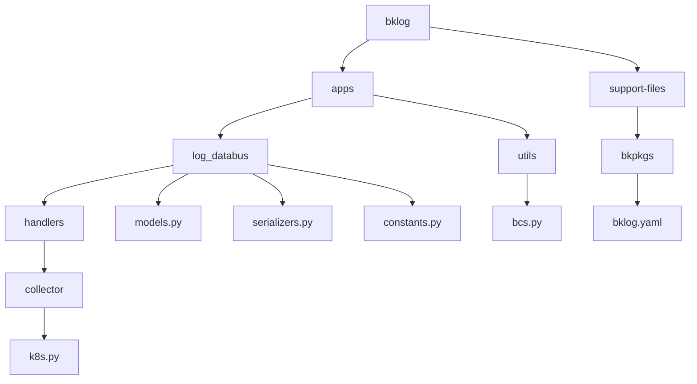
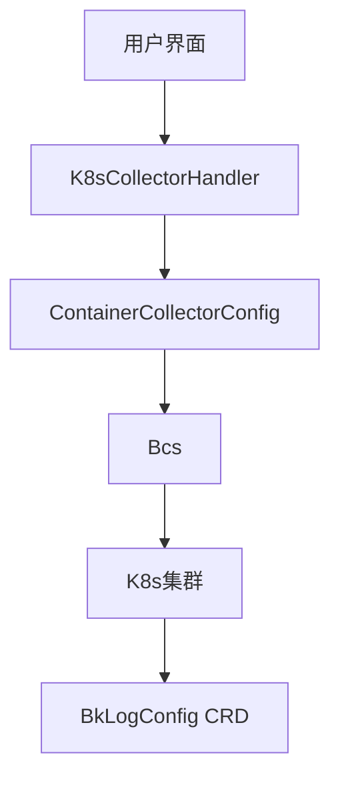
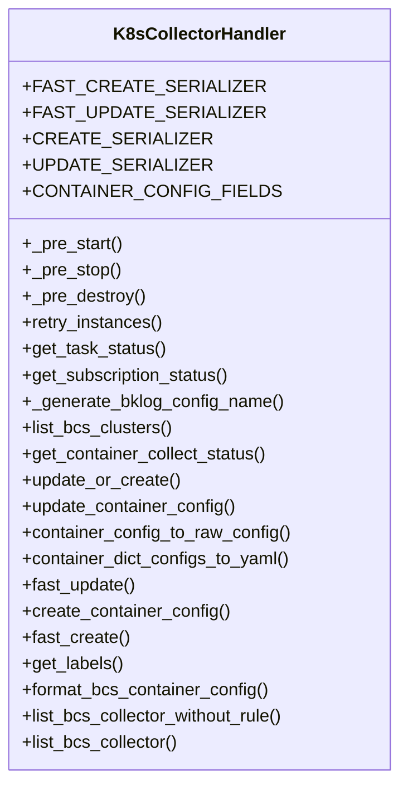
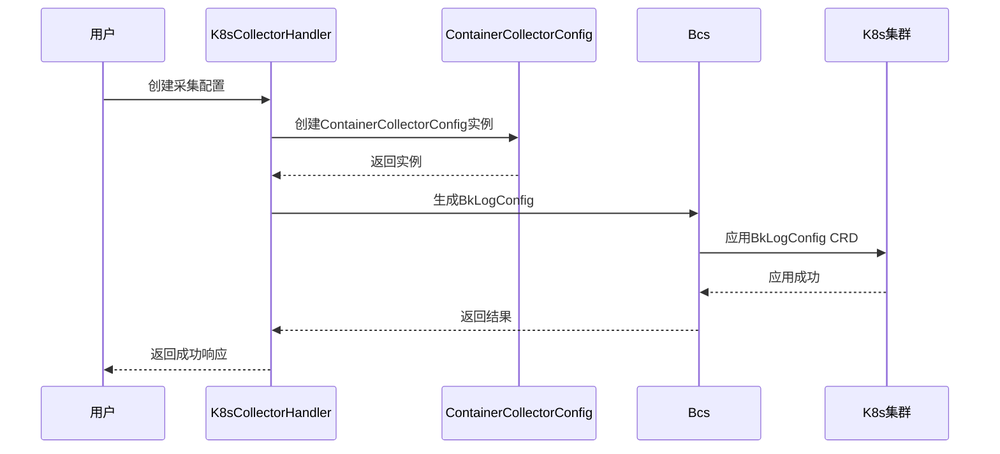
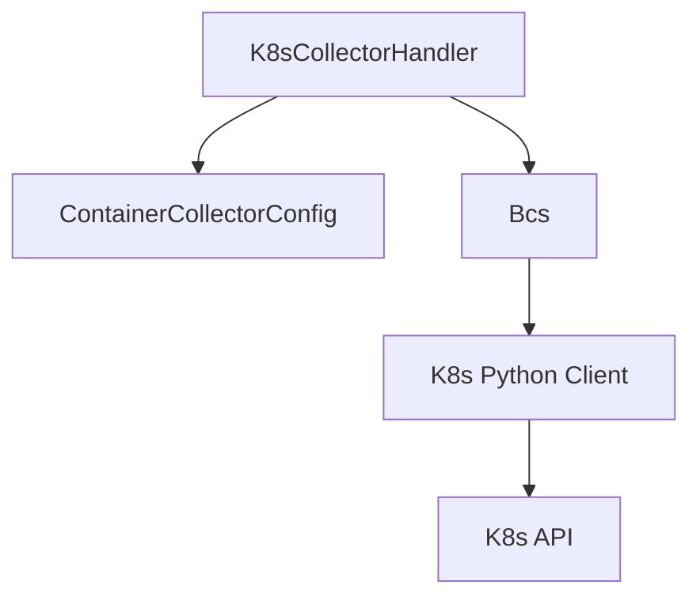

# K8s采集配置

<cite>
**本文档引用文件**   
- [k8s.py](file://bklog/apps/log_databus/handlers/collector/k8s.py)
- [models.py](file://bklog/apps/log_databus/models.py)
- [serializers.py](file://bklog/apps/log_databus/serializers.py)
- [constants.py](file://bklog/apps/log_databus/constants.py)
- [bcs.py](file://bklog/apps/utils/bcs.py)
</cite>

## 目录
1. [简介](#简介)
2. [项目结构](#项目结构)
3. [核心组件](#核心组件)
4. [架构概述](#架构概述)
5. [详细组件分析](#详细组件分析)
6. [依赖分析](#依赖分析)
7. [性能考虑](#性能考虑)
8. [故障排除指南](#故障排除指南)
9. [结论](#结论)

## 简介
本文档全面介绍在Kubernetes环境下配置日志采集的方法。重点涵盖命名空间选择、工作负载匹配、容器名称过滤和日志路径设置等核心功能。详细说明K8s元数据注入机制，包括如何将Pod名称、容器名称、标签等信息作为日志字段输出。文档还描述了容器日志格式解析配置，支持标准输出和文件输出等多种模式，并解释了K8s采集配置的动态发现机制和自适应能力。

## 项目结构
项目结构清晰地组织了与日志采集相关的各个模块。`bklog/apps/log_databus` 目录包含了处理日志采集的核心逻辑，包括处理器、序列化器和模型定义。`bklog/apps/utils` 目录提供了与BCS（蓝鲸容器服务）交互的工具类。`bklog/support-files` 目录包含了部署和配置所需的YAML文件。

**Diagram sources**
- [k8s.py](file://bklog/apps/log_databus/handlers/collector/k8s.py)
- [models.py](file://bklog/apps/log_databus/models.py)
- [serializers.py](file://bklog/apps/log_databus/serializers.py)
- [constants.py](file://bklog/apps/log_databus/constants.py)
- [bcs.py](file://bklog/apps/utils/bcs.py)
- [bklog.yaml](file://bklog/support-files/bkpkgs/bklog.yaml)

**Section sources**
- [k8s.py](file://bklog/apps/log_databus/handlers/collector/k8s.py)
- [models.py](file://bklog/apps/log_databus/models.py)
- [serializers.py](file://bklog/apps/log_databus/serializers.py)
- [constants.py](file://bklog/apps/log_databus/constants.py)
- [bcs.py](file://bklog/apps/utils/bcs.py)
- [bklog.yaml](file://bklog/support-files/bkpkgs/bklog.yaml)

## 核心组件
核心组件包括 `K8sCollectorHandler`，它负责处理K8s环境下的日志采集配置。`ContainerCollectorConfig` 模型定义了容器采集配置的结构，而 `ContainerCollectorYamlSerializer` 则负责将配置序列化为YAML格式。`Bcs` 工具类提供了与K8s集群交互的接口。

**Section sources**
- [k8s.py](file://bklog/apps/log_databus/handlers/collector/k8s.py)
- [models.py](file://bklog/apps/log_databus/models.py)
- [serializers.py](file://bklog/apps/log_databus/serializers.py)
- [bcs.py](file://bklog/apps/utils/bcs.py)

## 架构概述
系统架构基于微服务设计，通过 `K8sCollectorHandler` 与K8s集群进行交互，动态创建和管理日志采集配置。配置通过 `ContainerCollectorConfig` 模型持久化，并通过 `Bcs` 工具类应用到K8s集群中的 `BkLogConfig` CRD。

**Diagram sources**
- [k8s.py](file://bklog/apps/log_databus/handlers/collector/k8s.py)
- [models.py](file://bklog/apps/log_databus/models.py)
- [bcs.py](file://bklog/apps/utils/bcs.py)

## 详细组件分析
### K8s采集处理器分析
`K8sCollectorHandler` 是处理K8s日志采集的核心类。它负责创建、更新和删除容器采集配置，并与K8s集群进行交互。

#### 类图

**Diagram sources**
- [k8s.py](file://bklog/apps/log_databus/handlers/collector/k8s.py)

#### 序列图

**Diagram sources**
- [k8s.py](file://bklog/apps/log_databus/handlers/collector/k8s.py)
- [models.py](file://bklog/apps/log_databus/models.py)
- [bcs.py](file://bklog/apps/utils/bcs.py)

**Section sources**
- [k8s.py](file://bklog/apps/log_databus/handlers/collector/k8s.py)
- [models.py](file://bklog/apps/log_databus/models.py)
- [bcs.py](file://bklog/apps/utils/bcs.py)

## 依赖分析
系统依赖于K8s API和BCS服务进行集群管理。`Bcs` 类通过K8s Python客户端与集群交互，而 `K8sCollectorHandler` 则依赖于 `ContainerCollectorConfig` 模型来持久化配置。

**Diagram sources**
- [k8s.py](file://bklog/apps/log_databus/handlers/collector/k8s.py)
- [models.py](file://bklog/apps/log_databus/models.py)
- [bcs.py](file://bklog/apps/utils/bcs.py)

**Section sources**
- [k8s.py](file://bklog/apps/log_databus/handlers/collector/k8s.py)
- [models.py](file://bklog/apps/log_databus/models.py)
- [bcs.py](file://bklog/apps/utils/bcs.py)

## 性能考虑
在大规模K8s集群中，频繁创建和删除采集配置可能会影响性能。建议使用批量操作来减少API调用次数，并合理设置采集配置的更新频率。

## 故障排除指南
常见问题包括K8s API连接失败、CRD未正确应用等。检查 `Bcs` 类的日志以获取详细的错误信息，并确保K8s集群的API服务器可访问。

**Section sources**
- [k8s.py](file://bklog/apps/log_databus/handlers/collector/k8s.py)
- [bcs.py](file://bklog/apps/utils/bcs.py)

## 结论
本文档详细介绍了K8s日志采集配置的实现机制。通过 `K8sCollectorHandler` 和 `Bcs` 工具类，系统能够动态地管理K8s集群中的日志采集配置，确保日志数据的高效采集和处理。