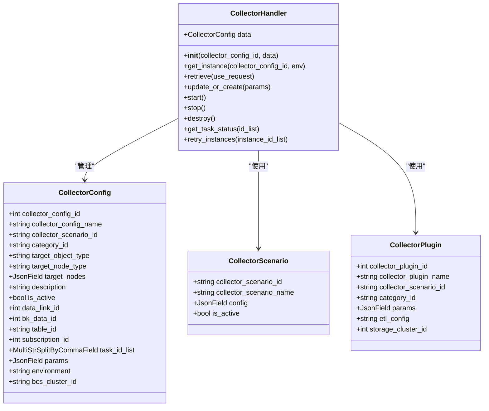
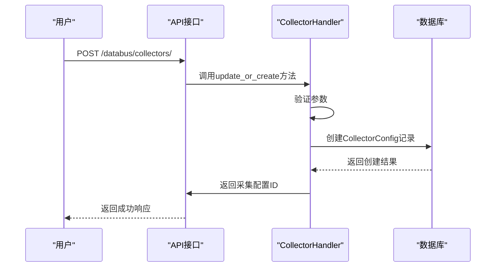
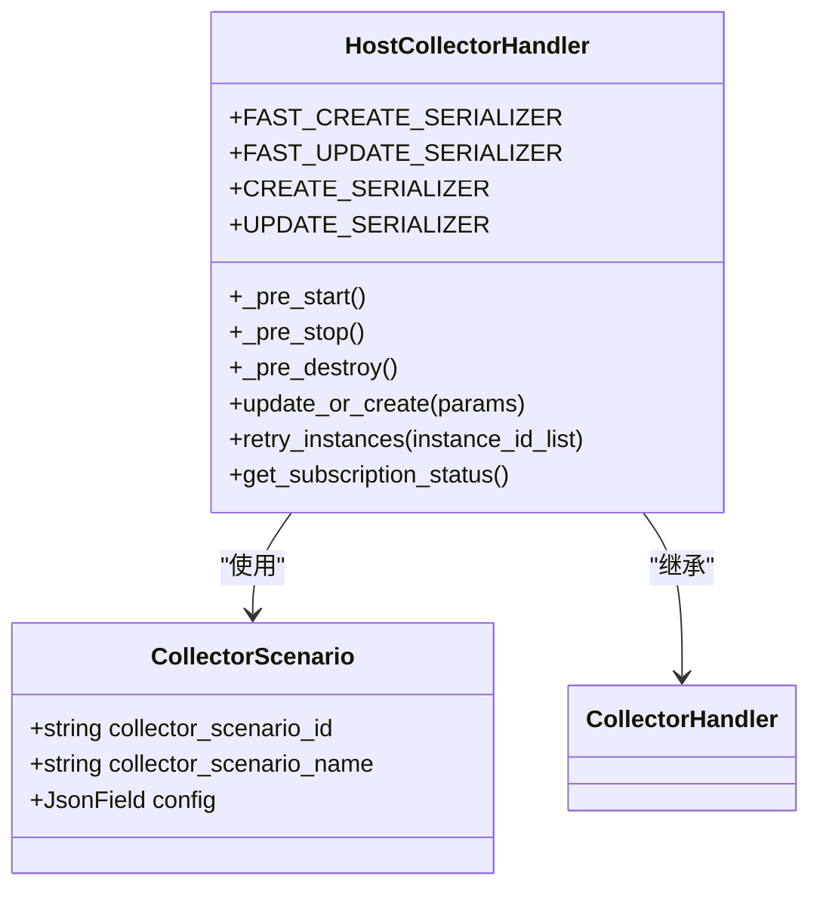
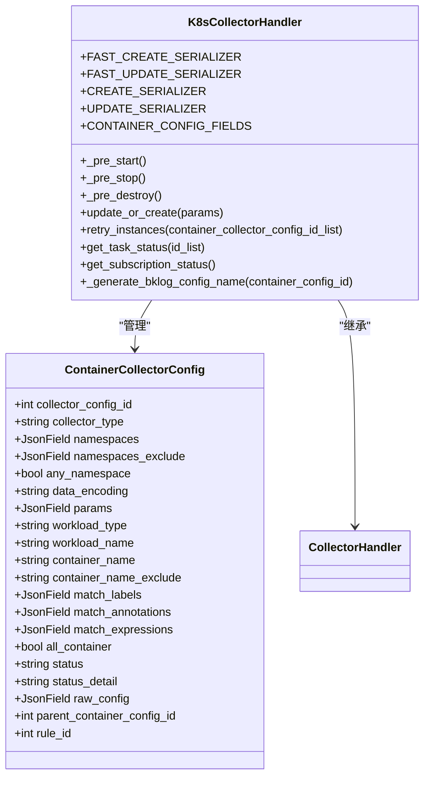
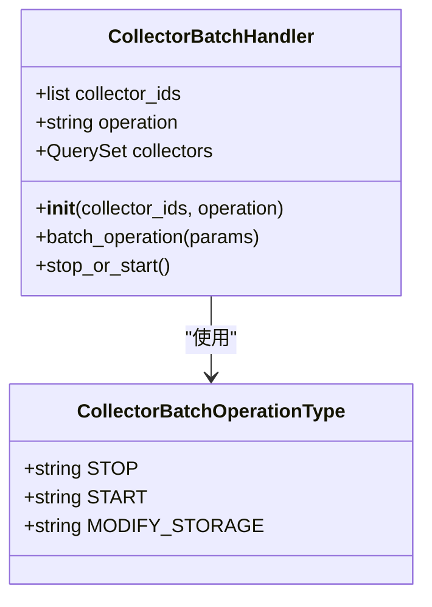

# 采集配置

<cite>
**本文档引用的文件**
- [collector_views.py](file://bklog/apps/log_databus/views/collector_views.py)
- [models.py](file://bklog/apps/log_databus/models.py)
- [serializers.py](file://bklog/apps/log_databus/serializers.py)
- [base.py](file://bklog/apps/log_databus/handlers/collector/base.py)
- [host.py](file://bklog/apps/log_databus/handlers/collector/host.py)
- [k8s.py](file://bklog/apps/log_databus/handlers/collector/k8s.py)
- [constants.py](file://bklog/apps/log_databus/constants.py)
</cite>

## 目录
1. [采集配置概述](#采集配置概述)
2. [采集配置操作流程](#采集配置操作流程)
3. [主机采集模式](#主机采集模式)
4. [K8s采集模式](#k8s采集模式)
5. [采集配置生命周期管理](#采集配置生命周期管理)
6. [批量操作功能](#批量操作功能)
7. [配置案例与最佳实践](#配置案例与最佳实践)
8. [配置验证与问题解决](#配置验证与问题解决)

## 采集配置概述

采集配置是日志平台的核心功能，用于定义和管理日志采集任务。系统支持两种主要的采集模式：主机采集和K8s容器采集。每种模式都提供了丰富的配置选项，包括采集路径、日志格式、采集策略等参数设置。采集配置通过采集项（CollectorConfig）模型进行管理，该模型定义了采集任务的所有属性和状态。

采集配置的核心组件包括采集处理器（CollectorHandler）、采集场景（CollectorScenario）和采集插件（CollectorPlugin）。采集处理器负责处理采集配置的创建、修改、删除和查询等操作，而采集场景定义了不同类型的日志采集方式，如行日志、段日志等。



**Diagram sources**
- [models.py](file://bklog/apps/log_databus/models.py#L101-L297)
- [base.py](file://bklog/apps/log_databus/handlers/collector/base.py#L124-L667)

**Section sources**
- [models.py](file://bklog/apps/log_databus/models.py#L101-L297)
- [base.py](file://bklog/apps/log_databus/handlers/collector/base.py#L124-L667)

## 采集配置操作流程

采集配置的创建、修改、删除和查询操作通过REST API接口实现。系统提供了完整的CRUD（创建、读取、更新、删除）操作支持，确保用户能够灵活管理采集任务。

### 创建采集配置

创建采集配置通过POST请求实现，需要提供必要的参数，包括业务ID、采集项名称、采集场景ID、数据分类ID、目标对象类型、目标节点类型、采集目标、日志字符集和插件参数等。系统会验证参数的合法性，并在数据库中创建相应的采集配置记录。



**Diagram sources**
- [collector_views.py](file://bklog/apps/log_databus/views/collector_views.py#L535-L657)
- [base.py](file://bklog/apps/log_databus/handlers/collector/base.py#L182-L613)

**Section sources**
- [collector_views.py](file://bklog/apps/log_databus/views/collector_views.py#L535-L657)
- [base.py](file://bklog/apps/log_databus/handlers/collector/base.py#L182-L613)

### 修改采集配置

修改采集配置通过PUT请求实现，需要提供采集配置ID和要更新的字段。系统会根据采集配置的环境类型（主机或容器）选择相应的处理器进行更新操作。更新操作包括修改采集项名称、目标节点、日志字符集和插件参数等。

### 删除采集配置

删除采集配置通过DELETE请求实现，系统会执行一系列清理操作，包括停止采集任务、删除索引集、删除采集配置记录等。为了防止误操作，系统会在删除前重命名采集项名称，并将其标记为已删除状态。

### 查询采集配置

查询采集配置通过GET请求实现，支持分页查询和条件过滤。系统会返回采集配置的详细信息，包括采集场景名称、数据分类名称、目标节点、任务状态等。查询结果还可以包含存储集群信息和标签信息。

**Section sources**
- [collector_views.py](file://bklog/apps/log_databus/views/collector_views.py#L371-L533)
- [base.py](file://bklog/apps/log_databus/handlers/collector/base.py#L481-L499)

## 主机采集模式

主机采集模式用于采集物理机或虚拟机上的日志文件。该模式支持多种日志类型，包括行日志、段日志、Windows事件日志和Syslog等。用户可以通过配置采集路径、过滤方式和采集策略来定制采集任务。

### 采集路径配置

采集路径配置允许用户指定要采集的日志文件路径。支持通配符匹配和正则表达式，可以灵活地选择需要采集的日志文件。例如，可以配置`/var/log/*.log`来采集所有以`.log`结尾的日志文件。

### 日志格式配置

日志格式配置定义了如何解析采集到的日志内容。系统支持多种日志格式，包括直接入库、JSON、分隔符和正则表达式等。用户可以根据日志的结构选择合适的格式进行解析。

### 采集策略配置

采集策略配置包括采集频率、文件扫描间隔、FD关联间隔等参数。这些参数控制了采集器的行为，确保日志能够及时、高效地被采集和处理。



**Diagram sources**
- [host.py](file://bklog/apps/log_databus/handlers/collector/host.py#L81-L800)
- [base.py](file://bklog/apps/log_databus/handlers/collector/base.py#L124-L667)

**Section sources**
- [host.py](file://bklog/apps/log_databus/handlers/collector/host.py#L81-L800)

## K8s采集模式

K8s采集模式用于采集Kubernetes集群中的容器日志。该模式支持通过命名空间、工作负载类型、容器名称等多种方式选择要采集的容器。用户可以通过YAML配置模式或结构化配置模式来定义采集任务。

### 容器选择配置

容器选择配置允许用户通过多种条件筛选要采集的容器。支持的条件包括命名空间、工作负载类型（如Deployment、DaemonSet）、容器名称、标签选择器和注解选择器等。这些条件可以组合使用，实现精确的容器选择。

### 采集配置模式

系统提供了两种采集配置模式：YAML配置模式和结构化配置模式。YAML配置模式允许用户直接编辑YAML文件来定义采集任务，适合高级用户使用。结构化配置模式提供了图形化界面，通过表单填写的方式配置采集任务，更适合普通用户使用。

### 标签注入配置

标签注入配置允许用户将容器的标签和注解作为日志的元数据上报。这有助于在后续的日志分析中进行更精细的过滤和聚合。用户可以选择是否自动添加Pod中的标签和注解，也可以手动添加额外的标签。



**Diagram sources**
- [k8s.py](file://bklog/apps/log_databus/handlers/collector/k8s.py#L112-L800)
- [models.py](file://bklog/apps/log_databus/models.py#L394-L417)

**Section sources**
- [k8s.py](file://bklog/apps/log_databus/handlers/collector/k8s.py#L112-L800)
- [models.py](file://bklog/apps/log_databus/models.py#L394-L417)

## 采集配置生命周期管理

采集配置的生命周期管理涵盖了配置预检查、任务部署、状态监控和异常处理等环节。系统通过一系列机制确保采集任务的稳定运行和故障恢复。

### 配置预检查

在创建或更新采集配置时，系统会执行配置预检查，验证参数的合法性和完整性。预检查包括检查采集路径是否存在、过滤条件是否有效、目标节点是否可达等。如果预检查失败，系统会返回详细的错误信息，帮助用户修正配置。

### 任务部署

任务部署是将采集配置下发到目标节点的过程。系统通过节点管理订阅功能，将采集配置推送到目标节点的采集器。部署过程包括生成采集器配置文件、重启采集器服务等步骤。系统会记录部署任务的ID，用于后续的状态查询和日志查看。

### 状态监控

状态监控提供了实时的采集任务状态信息。系统会定期查询采集任务的运行状态，包括准备中、运行中、成功、失败等。用户可以通过API接口或管理界面查看任务状态，及时发现和处理异常情况。

### 异常处理

异常处理机制确保了采集任务的可靠性和容错性。当采集任务失败时，系统会记录详细的错误日志，并提供重试功能。用户可以针对特定的实例或主机进行重试，而不需要重新部署整个采集任务。此外，系统还提供了任务详情查看功能，帮助用户分析失败原因。

**Section sources**
- [base.py](file://bklog/apps/log_databus/handlers/collector/base.py#L408-L479)
- [host.py](file://bklog/apps/log_databus/handlers/collector/host.py#L87-L113)
- [k8s.py](file://bklog/apps/log_databus/handlers/collector/k8s.py#L128-L140)

## 批量操作功能

系统提供了批量操作功能，支持批量启动、停止和删除采集配置。这些功能通过CollectorBatchHandler类实现，可以同时对多个采集配置执行相同的操作。

### 批量启动和停止

批量启动和停止功能允许用户一次性启动或停止多个采集配置。系统会遍历指定的采集配置列表，依次执行启动或停止操作。对于每个采集配置，系统会记录操作结果，包括成功或失败状态及描述信息。

### 批量删除

批量删除功能允许用户一次性删除多个采集配置。系统会按照删除流程，依次执行每个采集配置的删除操作。删除操作包括停止采集任务、删除索引集和删除配置记录等步骤。



**Diagram sources**
- [collector_batch_operation.py](file://bklog/apps/log_databus/handlers/collector_batch_operation.py#L28-L77)
- [constants.py](file://bklog/apps/log_databus/constants.py#L701-L710)

**Section sources**
- [collector_batch_operation.py](file://bklog/apps/log_databus/handlers/collector_batch_operation.py#L28-L77)

## 配置案例与最佳实践

### 主机日志采集案例

以下是一个典型的主机日志采集配置案例：

```json
{
    "bk_biz_id": 1,
    "collector_config_name": "应用日志采集",
    "collector_scenario_id": "row",
    "category_id": "application",
    "target_object_type": "HOST",
    "target_node_type": "INSTANCE",
    "target_nodes": [
        {
            "ip": "192.168.1.100",
            "bk_cloud_id": 0
        }
    ],
    "data_encoding": "UTF-8",
    "params": {
        "paths": ["/var/log/app/*.log"],
        "conditions": {
            "type": "match",
            "match_type": "include",
            "match_content": "ERROR"
        }
    }
}
```

该配置用于采集IP为`192.168.1.100`的主机上`/var/log/app/`目录下所有以`.log`结尾的日志文件中包含"ERROR"关键字的日志行。

### K8s容器日志采集案例

以下是一个典型的K8s容器日志采集配置案例：

```json
{
    "bk_biz_id": 1,
    "collector_config_name": "微服务日志采集",
    "collector_scenario_id": "custom",
    "category_id": "application",
    "environment": "container",
    "bcs_cluster_id": "BCS-K8S-10001",
    "add_pod_label": true,
    "configs": [
        {
            "namespaces": ["production"],
            "container": {
                "workload_type": "Deployment",
                "workload_name": "web-service"
            },
            "params": {
                "paths": ["/var/log/containers/*.log"],
                "conditions": {
                    "type": "match",
                    "match_type": "include",
                    "match_content": "exception"
                }
            },
            "data_encoding": "UTF-8"
        }
    ]
}
```

该配置用于采集`BCS-K8S-10001`集群中`production`命名空间下`web-service` Deployment的所有Pod中包含"exception"关键字的容器日志，并自动添加Pod的标签作为日志元数据。

**Section sources**
- [host.py](file://bklog/apps/log_databus/handlers/collector/host.py#L182-L613)
- [k8s.py](file://bklog/apps/log_databus/handlers/collector/k8s.py#L257-L638)

## 配置验证与问题解决

### 配置冲突处理

当存在相同英文名的采集配置时，系统会抛出`CollectorConfigNameENDuplicateException`异常。为了避免此类冲突，建议在创建采集配置时使用唯一的英文名。系统还提供了`build_bk_data_name`方法，用于生成基于业务ID和采集配置英文名的唯一数据名称。

### 参数错误处理

当参数配置错误时，系统会返回详细的错误信息。例如，如果采集路径为空，系统会抛出`ValidationError`异常。用户应根据错误信息检查和修正配置参数。对于复杂的参数验证，系统提供了专门的序列化器（如`CollectorCreateSerializer`）来确保参数的合法性。

### 常见问题解决方案

1. **采集任务无法启动**：检查目标节点是否可达，采集器服务是否正常运行，以及采集配置是否有语法错误。
2. **日志采集不完整**：检查采集路径是否正确，过滤条件是否过于严格，以及文件扫描间隔是否合适。
3. **性能问题**：优化采集策略，减少不必要的日志采集，合理设置采集频率和文件扫描间隔。
4. **存储空间不足**：调整数据保留天数，优化索引分片大小，或考虑使用独立的ES集群。

**Section sources**
- [base.py](file://bklog/apps/log_databus/handlers/collector/base.py#L182-L613)
- [serializers.py](file://bklog/apps/log_databus/serializers.py#L394-L515)
- [constants.py](file://bklog/apps/log_databus/constants.py#L69-L710)