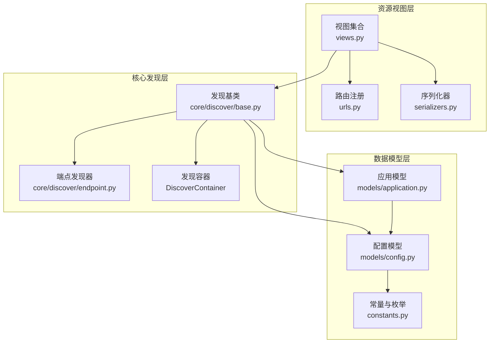
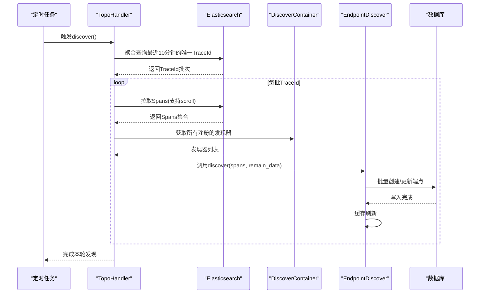
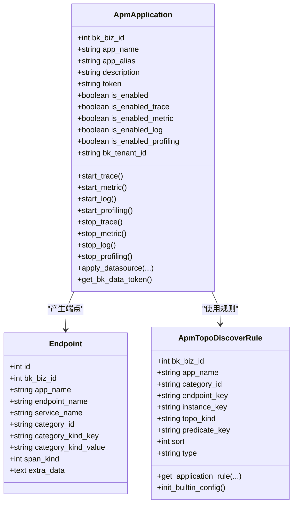
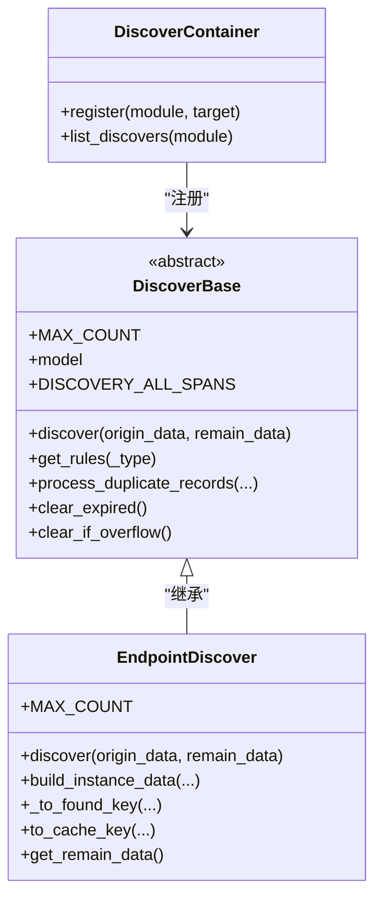
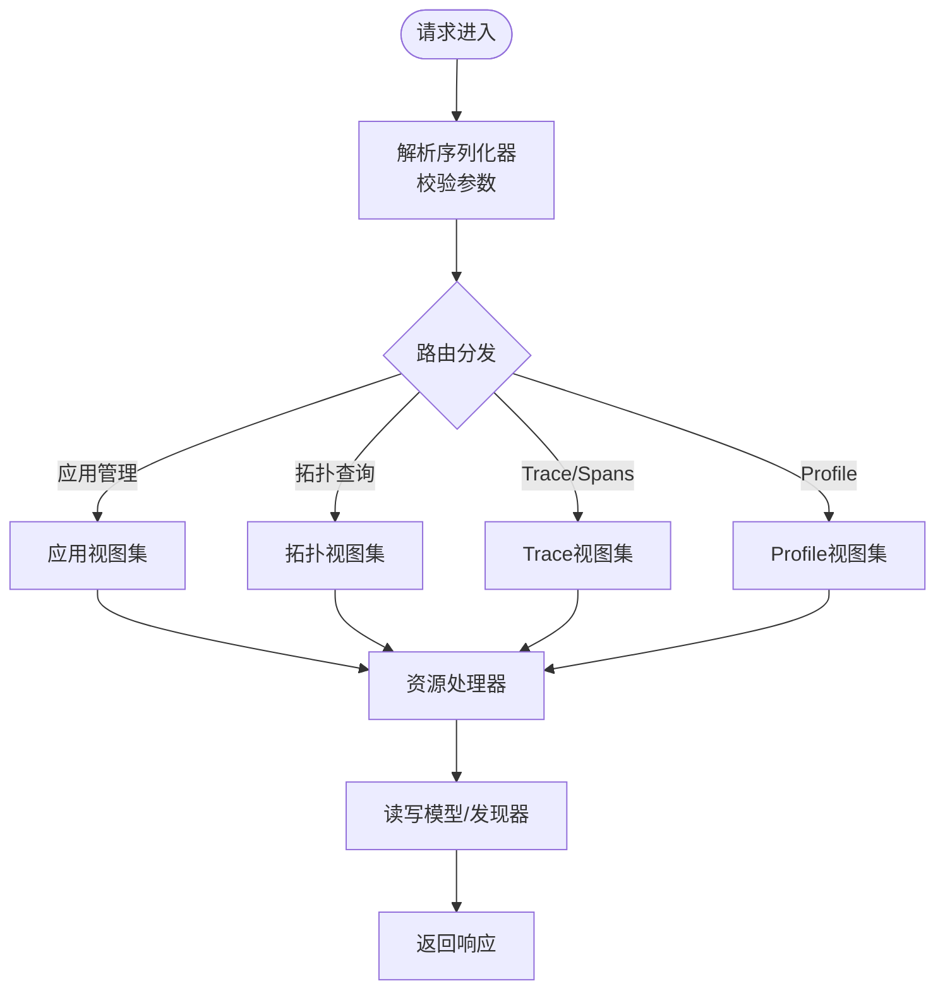
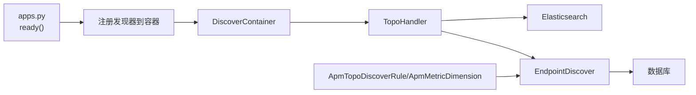
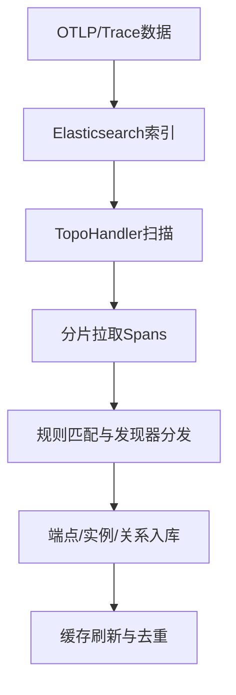

# APM监控模块

<cite>
**本文档引用的文件**
- [apps.py](file://bkmonitor/apm/apps.py)
- [constants.py](file://bkmonitor/apm/constants.py)
- [models/application.py](file://bkmonitor/apm/models/application.py)
- [models/config.py](file://bkmonitor/apm/models/config.py)
- [views.py](file://bkmonitor/apm/views.py)
- [urls.py](file://bkmonitor/apm/urls.py)
- [serializers.py](file://bkmonitor/apm/serializers.py)
- [core/discover/base.py](file://bkmonitor/apm/core/discover/base.py)
- [core/discover/endpoint.py](file://bkmonitor/apm/core/discover/endpoint.py)
</cite>

## 目录
1. [简介](#简介)
2. [项目结构](#项目结构)
3. [核心组件](#核心组件)
4. [架构总览](#架构总览)
5. [详细组件分析](#详细组件分析)
6. [依赖关系分析](#依赖关系分析)
7. [性能考虑](#性能考虑)
8. [故障排查指南](#故障排查指南)
9. [结论](#结论)
10. [附录](#附录)

## 简介
本文件面向蓝鲸智云监控平台的APM（应用性能监控）模块，系统化阐述其全栈监控设计理念、核心功能与技术实现。重点覆盖应用性能监控、链路追踪、拓扑发现、Profile分析等能力；解析APM核心模块的数据处理流程、模型定义与工具类实现；给出数据流图、监控指标体系与性能分析方法，帮助开发者快速理解并高效使用APM系统。

## 项目结构
APM模块采用“资源视图-核心发现-数据模型”三层组织方式：
- 资源视图层：通过DRF Resource封装对外API，统一暴露应用管理、拓扑查询、Trace/Spans查询、Profile查询等功能入口。
- 核心发现层：基于OpenTelemetry语义规范，实现Trace数据的拓扑发现（端点、实例、节点、关系、远程服务等），并支持预计算与缓存优化。
- 数据模型层：定义应用、数据源、拓扑规则、指标维度、采样配置等模型，并提供批量初始化与刷新能力。

**图表来源**
- [views.py:76-123](file://bkmonitor/apm/views.py#L76-L123)
- [urls.py:16-21](file://bkmonitor/apm/urls.py#L16-L21)
- [core/discover/base.py:138-150](file://bkmonitor/apm/core/discover/base.py#L138-L150)
- [core/discover/endpoint.py:27-65](file://bkmonitor/apm/core/discover/endpoint.py#L27-L65)
- [models/application.py:36-131](file://bkmonitor/apm/models/application.py#L36-L131)
- [models/config.py:36-277](file://bkmonitor/apm/models/config.py#L36-L277)
- [constants.py:11-17](file://bkmonitor/apm/constants.py#L11-L17)

**章节来源**
- [apps.py:25-68](file://bkmonitor/apm/apps.py#L25-L68)
- [views.py:76-123](file://bkmonitor/apm/views.py#L76-L123)
- [urls.py:16-21](file://bkmonitor/apm/urls.py#L16-L21)

## 核心组件
- 应用与数据源管理：负责应用生命周期、数据源开关与令牌生成，支持异步创建数据源与虚拟指标初始化。
- 拓扑发现引擎：基于规则集与Span属性，自动识别端点、实例、节点、关系及远程服务，支持缓存与去重。
- 配置与规则：内置全平台通用拓扑规则、指标维度配置、采样与Apdex配置，支持业务级覆盖与刷新。
- 查询与序列化：提供Trace/Spans查询、统计分析、字段Top-K、映射查询等API，配套严格校验的序列化器。

**章节来源**
- [models/application.py:36-288](file://bkmonitor/apm/models/application.py#L36-L288)
- [models/config.py:36-591](file://bkmonitor/apm/models/config.py#L36-L591)
- [core/discover/base.py:138-330](file://bkmonitor/apm/core/discover/base.py#L138-L330)
- [serializers.py:18-77](file://bkmonitor/apm/serializers.py#L18-L77)

## 架构总览
APM模块通过“发现容器+多发现器”的模式，将不同粒度的拓扑发现解耦为可插拔组件。TopoHandler作为调度器，周期性扫描Trace索引中的TraceId，分片拉取Spans，按规则分发给各发现器，完成端点、实例、关系等拓扑实体的增量更新与缓存刷新。

**图表来源**
- [core/discover/base.py:505-570](file://bkmonitor/apm/core/discover/base.py#L505-L570)
- [core/discover/endpoint.py:71-144](file://bkmonitor/apm/core/discover/endpoint.py#L71-L144)
- [apps.py:30-65](file://bkmonitor/apm/apps.py#L30-L65)

## 详细组件分析

### 应用与数据源模型
- ApmApplication：封装应用基本信息、数据源开关、令牌生成与异步数据源创建；提供启停各类数据源的能力。
- RootEndpoint/Endpoint：记录根端点与端点信息，支持按服务名、接口名、分类与Span类型组合去重。
- 配置模型：ApmTopoDiscoverRule、ApmMetricDimension、ApdexConfig、SamplerConfig等，支撑拓扑规则、指标维度与采样策略。

**图表来源**
- [models/application.py:36-288](file://bkmonitor/apm/models/application.py#L36-L288)
- [models/application.py:291-321](file://bkmonitor/apm/models/application.py#L291-L321)
- [models/config.py:36-277](file://bkmonitor/apm/models/config.py#L36-L277)

**章节来源**
- [models/application.py:36-288](file://bkmonitor/apm/models/application.py#L36-L288)
- [models/application.py:291-343](file://bkmonitor/apm/models/application.py#L291-L343)
- [models/config.py:36-591](file://bkmonitor/apm/models/config.py#L36-L591)

### 拓扑发现与缓存
- DiscoverContainer：集中注册与列举不同Telemetry类型（Trace/Metric/Profiling）对应的发现器。
- DiscoverBase：定义发现器通用接口、规则解析、重复数据处理、缓存键生成与过期清理等。
- EndpointDiscover：基于规则集与Span属性，识别端点并进行批量写入与缓存刷新。

**图表来源**
- [core/discover/base.py:138-330](file://bkmonitor/apm/core/discover/base.py#L138-L330)
- [core/discover/endpoint.py:27-144](file://bkmonitor/apm/core/discover/endpoint.py#L27-L144)

**章节来源**
- [core/discover/base.py:138-330](file://bkmonitor/apm/core/discover/base.py#L138-L330)
- [core/discover/endpoint.py:27-144](file://bkmonitor/apm/core/discover/endpoint.py#L27-L144)

### API与序列化
- 视图集合：统一暴露应用管理、拓扑查询、Trace/Spans查询、Profile查询、规则与指标维度查询等接口。
- 序列化器：对查询参数进行严格校验，如过滤条件、查询字符串、时间范围、统计属性等。

**图表来源**
- [views.py:76-141](file://bkmonitor/apm/views.py#L76-L141)
- [urls.py:16-21](file://bkmonitor/apm/urls.py#L16-L21)
- [serializers.py:18-77](file://bkmonitor/apm/serializers.py#L18-L77)

**章节来源**
- [views.py:76-141](file://bkmonitor/apm/views.py#L76-L141)
- [urls.py:16-21](file://bkmonitor/apm/urls.py#L16-L21)
- [serializers.py:18-77](file://bkmonitor/apm/serializers.py#L18-L77)

## 依赖关系分析
- 初始化阶段：应用ready时，注册各类拓扑发现器到DiscoverContainer，确保后续TopoHandler可按Telemetry类型调度。
- 运行阶段：TopoHandler通过ES聚合与Scroll机制拉取Spans，按规则分发给发现器，完成端点等拓扑实体的增删改查与缓存同步。
- 配置依赖：拓扑规则与指标维度由ApmTopoDiscoverRule与ApmMetricDimension提供，支持全局与业务级覆盖。

**图表来源**
- [apps.py:30-65](file://bkmonitor/apm/apps.py#L30-L65)
- [core/discover/base.py:505-570](file://bkmonitor/apm/core/discover/base.py#L505-L570)
- [models/config.py:36-277](file://bkmonitor/apm/models/config.py#L36-L277)

**章节来源**
- [apps.py:30-65](file://bkmonitor/apm/apps.py#L30-L65)
- [core/discover/base.py:505-570](file://bkmonitor/apm/core/discover/base.py#L505-L570)
- [models/config.py:36-277](file://bkmonitor/apm/models/config.py#L36-L277)

## 性能考虑
- 分片与限流：TopoHandler按索引max_result_window与DISCOVER_BATCH_SIZE动态拆分任务，避免单次查询过大；使用线程池并发拉取Spans并滚动清理。
- 缓存与去重：发现器支持缓存键模板与过期时间配置，批量写入前进行重复记录去重，降低数据库压力。
- 规则与过滤：仅对目标SpanKind进行过滤，减少无效数据处理；规则按类别与系统类型排序，命中优先级明确。

**章节来源**
- [core/discover/base.py:491-504](file://bkmonitor/apm/core/discover/base.py#L491-L504)
- [core/discover/base.py:331-330](file://bkmonitor/apm/core/discover/base.py#L331-L330)
- [constants.py:44-45](file://bkmonitor/apm/constants.py#L44-L45)

## 故障排查指南
- 应用不存在：当应用未在数据库中存在时，发现器会抛出异常提示业务下的应用不存在，需先创建应用并正确配置数据源。
- 数据源未初始化：TopoHandler在验证阶段若未检测到Trace数据源，会跳过该轮发现并记录警告日志。
- 规则缺失或冲突：检查ApmTopoDiscoverRule与ApmMetricDimension的初始化与刷新逻辑，确认全局与业务级规则生效顺序。
- 缓存与重复：若出现重复端点或实例，可通过process_duplicate_records进行去重并保留最新记录。

**章节来源**
- [core/discover/base.py:164-169](file://bkmonitor/apm/core/discover/base.py#L164-L169)
- [core/discover/base.py:356-362](file://bkmonitor/apm/core/discover/base.py#L356-L362)
- [models/config.py:254-277](file://bkmonitor/apm/models/config.py#L254-L277)

## 结论
APM模块通过“规则驱动+发现器插件化”的架构，实现了Trace数据的自动化拓扑发现与持久化；配合严格的序列化校验与缓存策略，在保证准确性的同时兼顾性能。开发者可基于现有模型与发现器扩展新的拓扑粒度或适配新场景，快速构建企业级全栈APM能力。

## 附录

### 数据流图（概览）

[本图为概念性示意，无需图表来源标注]

### 监控指标体系（示例）
- 指标维度：服务名、接口名、Span类型、分类（HTTP/RPC/DB/消息队列）、状态码、SDK语言/版本等。
- 统计属性：平均耗时、P95/P99、错误率、吞吐（RPS/QPS）、Apdex等级分布。
- 查询方法：支持按字段Top-K、统计信息、时间序列对齐等。

**章节来源**
- [models/config.py:341-591](file://bkmonitor/apm/models/config.py#L341-L591)
- [serializers.py:50-77](file://bkmonitor/apm/serializers.py#L50-L77)