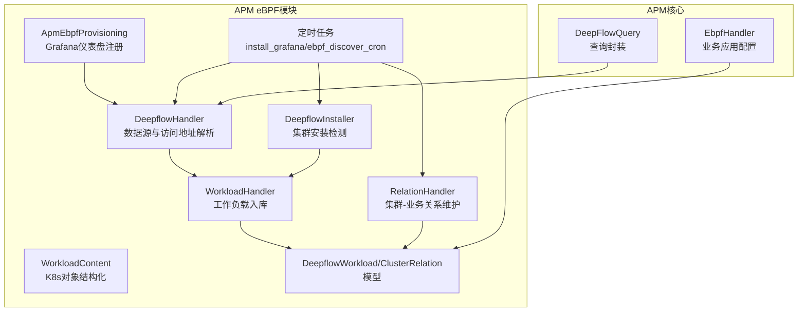
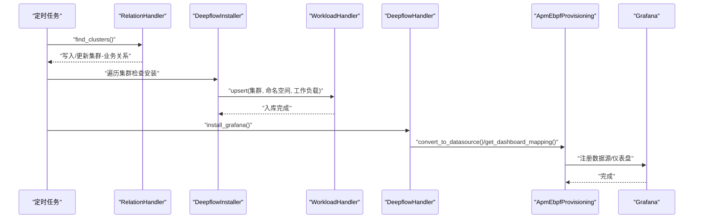
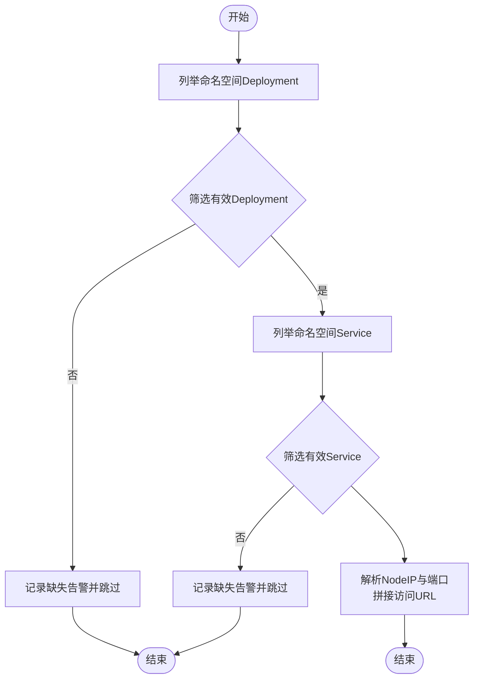
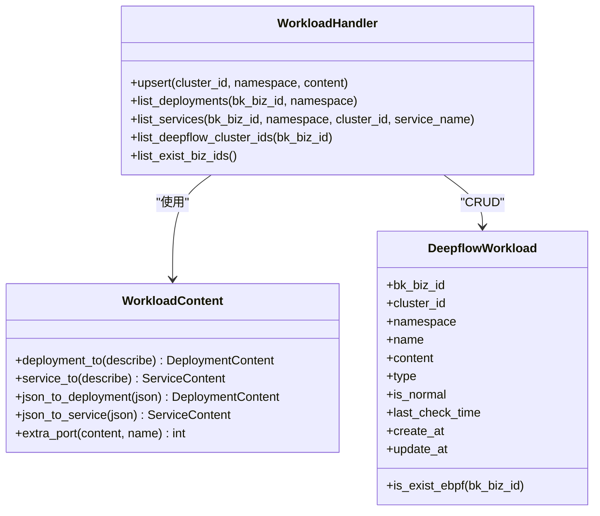
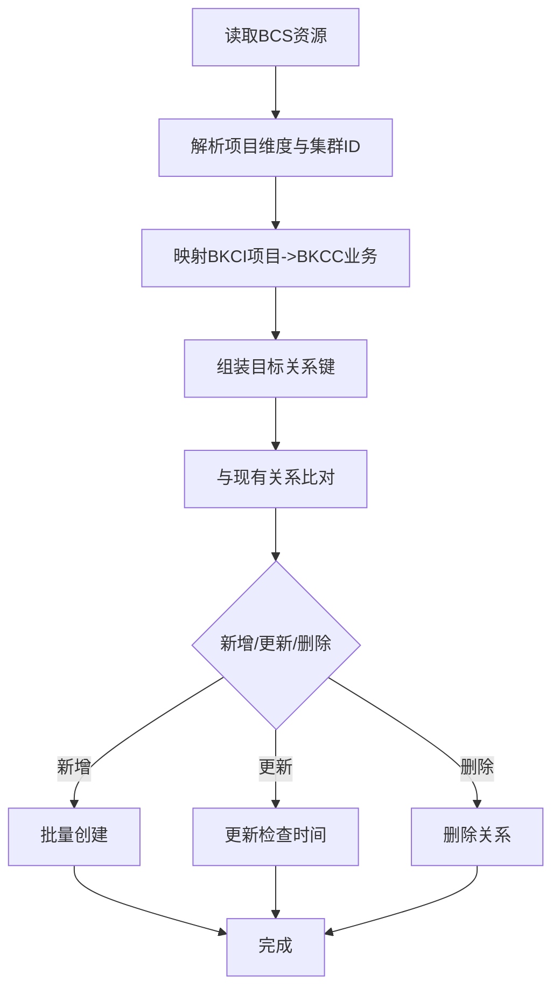
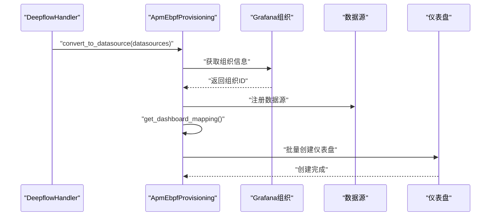
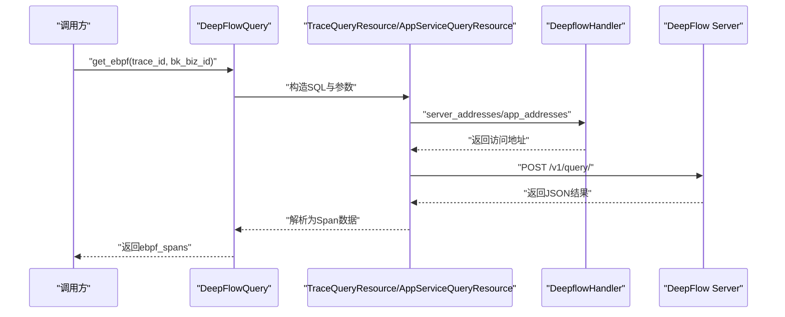
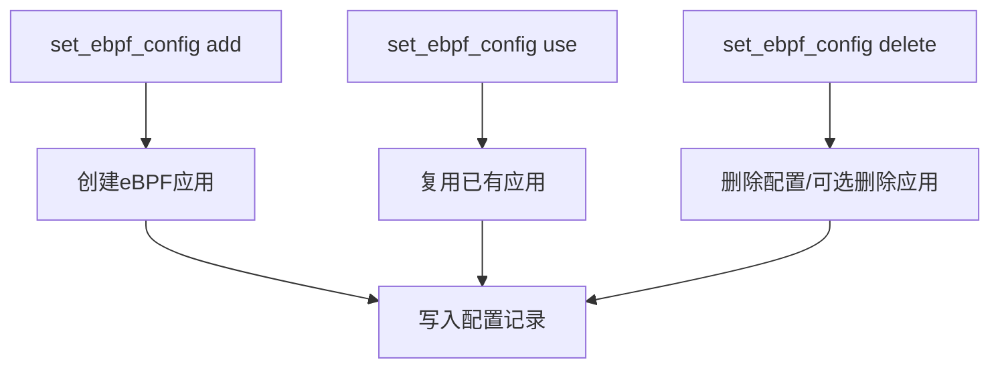
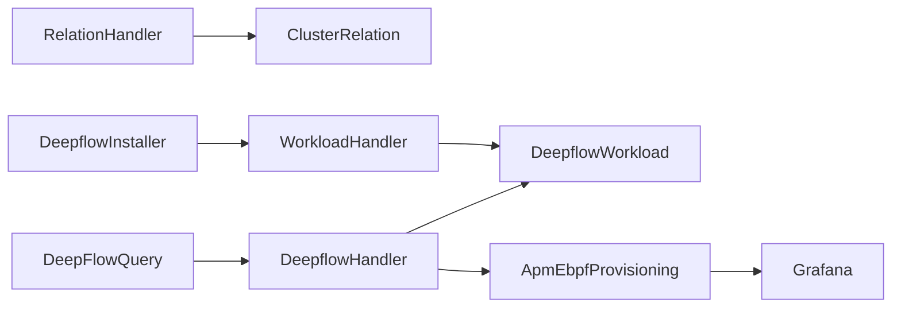

# eBPF集成模块

<cite>
**本文引用的文件**
- [apm_ebpf/handlers/deepflow.py](file://bkmonitor/apm_ebpf/handlers/deepflow.py)
- [apm_ebpf/handlers/workload.py](file://bkmonitor/apm_ebpf/handlers/workload.py)
- [apm_ebpf/handlers/relation.py](file://bkmonitor/apm_ebpf/handlers/relation.py)
- [apm_ebpf/models/workload.py](file://bkmonitor/apm_ebpf/models/workload.py)
- [apm_ebpf/constants.py](file://bkmonitor/apm_ebpf/constants.py)
- [apm_ebpf/handlers/provisioning.py](file://bkmonitor/apm_ebpf/handlers/provisioning.py)
- [apm_ebpf/resource.py](file://bkmonitor/apm_ebpf/resource.py)
- [apm_ebpf/task/tasks.py](file://bkmonitor/apm_ebpf/task/tasks.py)
- [apm_ebpf/migrations/0001_initial.py](file://bkmonitor/apm_ebpf/migrations/0001_initial.py)
- [apm_ebpf/migrations/0002_clusterrelation.py](file://bkmonitor/apm_ebpf/migrations/0002_clusterrelation.py)
- [apm/core/handlers/ebpf/base.py](file://bkmonitor/apm/core/handlers/ebpf/base.py)
- [apm/core/handlers/query/ebpf_query.py](file://bkmonitor/apm/core/handlers/query/ebpf_query.py)
- [apm/management/commands/set_ebpf_config.py](file://bkmonitor/apm/management/commands/set_ebpf_config.py)
</cite>

## 目录
1. [简介](#简介)
2. [项目结构](#项目结构)
3. [核心组件](#核心组件)
4. [架构总览](#架构总览)
5. [详细组件分析](#详细组件分析)
6. [依赖关系分析](#依赖关系分析)
7. [性能考虑](#性能考虑)
8. [故障排查指南](#故障排查指南)
9. [结论](#结论)
10. [附录](#附录)

## 简介
本文件面向APM eBPF集成模块，系统性阐述eBPF在APM监控中的应用，涵盖DeepFlow集成、资源关系处理、工作负载管理、配置管理、数据采集与查询、存储机制以及仪表盘注册等。文档以代码为依据，结合类图、序列图与流程图，帮助开发者理解并扩展eBPF在APM中的落地实践。

## 项目结构
eBPF集成模块主要分布在以下子系统：
- apm_ebpf：eBPF相关的核心处理、模型、任务与资源封装
- apm：APM核心能力，包含eBPF应用配置与查询接口
- apm/core/handlers/ebpf：业务侧的eBPF应用配置管理
- apm/core/handlers/query：与DeepFlow的查询对接
- apm/management/commands：命令行工具，支持对eBPF应用的增删改

图表来源
- [apm_ebf/handlers/deepflow.py:127-444](file://bkmonitor/apm_ebpf/handlers/deepflow.py#L127-L444)
- [apm_ebpf/handlers/workload.py:142-201](file://bkmonitor/apm_ebpf/handlers/workload.py#L142-L201)
- [apm_ebpf/handlers/relation.py:22-168](file://bkmonitor/apm_ebpf/handlers/relation.py#L22-L168)
- [apm_ebpf/handlers/provisioning.py:25-159](file://bkmonitor/apm_ebpf/handlers/provisioning.py#L25-L159)
- [apm_ebpf/models/workload.py:19-68](file://bkmonitor/apm_ebpf/models/workload.py#L19-L68)
- [apm/core/handlers/ebpf/base.py:30-140](file://bkmonitor/apm/core/handlers/ebpf/base.py#L30-L140)
- [apm/core/handlers/query/ebpf_query.py:30-88](file://bkmonitor/apm/core/handlers/query/ebpf_query.py#L30-L88)

章节来源
- [apm_ebpf/handlers/deepflow.py:127-444](file://bkmonitor/apm_ebpf/handlers/deepflow.py#L127-L444)
- [apm_ebpf/handlers/workload.py:142-201](file://bkmonitor/apm_ebpf/handlers/workload.py#L142-L201)
- [apm_ebpf/handlers/relation.py:22-168](file://bkmonitor/apm_ebpf/handlers/relation.py#L22-L168)
- [apm_ebpf/handlers/provisioning.py:25-159](file://bkmonitor/apm_ebpf/handlers/provisioning.py#L25-L159)
- [apm_ebpf/models/workload.py:19-68](file://bkmonitor/apm_ebpf/models/workload.py#L19-L68)
- [apm/core/handlers/ebpf/base.py:30-140](file://bkmonitor/apm/core/handlers/ebpf/base.py#L30-L140)
- [apm/core/handlers/query/ebpf_query.py:30-88](file://bkmonitor/apm/core/handlers/query/ebpf_query.py#L30-L88)

## 核心组件
- DeepflowHandler：负责业务下可用数据源的发现、访问地址解析、Grafana数据源与仪表盘注册
- DeepflowInstaller：扫描集群命名空间，识别DeepFlow组件的Deployment与Service，并入库
- WorkloadHandler/WorkloadContent：将K8s对象结构化并持久化，支持按业务与集群维度查询
- RelationHandler：基于空间与资源关系，维护集群-业务映射
- ApmEbpfProvisioning：Grafana仪表盘模板加载与注册，支持批量创建与去重
- DeepflowWorkload/ClusterRelation：工作负载与集群关系的数据库模型
- DeepFlowQuery/EbpfHandler：APM侧查询封装与业务应用配置管理
- 定时任务：周期性执行集群发现、关系同步与仪表盘安装

章节来源
- [apm_ebpf/handlers/deepflow.py:127-444](file://bkmonitor/apm_ebpf/handlers/deepflow.py#L127-L444)
- [apm_ebpf/handlers/workload.py:142-201](file://bkmonitor/apm_ebpf/handlers/workload.py#L142-L201)
- [apm_ebpf/handlers/relation.py:22-168](file://bkmonitor/apm_ebpf/handlers/relation.py#L22-L168)
- [apm_ebpf/handlers/provisioning.py:25-159](file://bkmonitor/apm_ebpf/handlers/provisioning.py#L25-L159)
- [apm_ebpf/models/workload.py:19-68](file://bkmonitor/apm_ebpf/models/workload.py#L19-L68)
- [apm/core/handlers/ebpf/base.py:30-140](file://bkmonitor/apm/core/handlers/ebpf/base.py#L30-L140)
- [apm/core/handlers/query/ebpf_query.py:30-88](file://bkmonitor/apm/core/handlers/query/ebpf_query.py#L30-L88)

## 架构总览
eBPF集成模块围绕“集群发现—工作负载入库—数据源解析—Grafana注册—查询对接”形成闭环。定时任务驱动集群与关系的同步，业务侧通过APM应用配置与查询接口对接DeepFlow。

图表来源
- [apm_ebpf/task/tasks.py:20-51](file://bkmonitor/apm_ebpf/task/tasks.py#L20-L51)
- [apm_ebpf/handlers/relation.py:22-168](file://bkmonitor/apm_ebpf/handlers/relation.py#L22-L168)
- [apm_ebpf/handlers/deepflow.py:402-444](file://bkmonitor/apm_ebpf/handlers/deepflow.py#L402-L444)
- [apm_ebpf/handlers/provisioning.py:25-159](file://bkmonitor/apm_ebpf/handlers/provisioning.py#L25-L159)

## 详细组件分析

### DeepFlow数据源与访问地址解析
- 功能要点
  - 发现业务下满足条件的Deployment与Service，生成数据源信息
  - 解析NodeIP与Service端口，拼接访问URL
  - 支持多集群、多数据源聚合
- 关键流程
  - 按集群分组过滤有效Deployment与Service
  - 从Service中提取深信服Server与App端口，拼接访问地址
  - 失败场景记录警告日志并跳过该集群

图表来源
- [apm_ebpf/handlers/deepflow.py:173-233](file://bkmonitor/apm_ebpf/handlers/deepflow.py#L173-L233)

章节来源
- [apm_ebpf/handlers/deepflow.py:173-233](file://bkmonitor/apm_ebpf/handlers/deepflow.py#L173-L233)

### 工作负载建模与入库
- 功能要点
  - 将K8s Deployment/Service结构化为统一内容模型
  - 按业务维度在指定集群命名空间内创建或更新工作负载记录
  - 提供按类型与集群过滤的查询接口
- 数据模型
  - DeepflowWorkload：记录业务ID、集群ID、命名空间、名称、类型、内容、状态与时间戳
  - ClusterRelation：记录集群与业务的关系
- 缓存策略
  - 某些查询使用缓存提升性能

图表来源
- [apm_ebpf/handlers/workload.py:63-201](file://bkmonitor/apm_ebpf/handlers/workload.py#L63-L201)
- [apm_ebpf/models/workload.py:19-68](file://bkmonitor/apm_ebpf/models/workload.py#L19-L68)

章节来源
- [apm_ebpf/handlers/workload.py:63-201](file://bkmonitor/apm_ebpf/handlers/workload.py#L63-L201)
- [apm_ebpf/models/workload.py:19-68](file://bkmonitor/apm_ebpf/models/workload.py#L19-L68)

### 集群-业务关系处理
- 功能要点
  - 基于空间与资源关系，构建集群与业务的映射
  - 支持BKCI项目到BKCC业务的映射，以及容器项目空间的负数业务ID
  - 增量更新：新增、更新、删除差异关系
- 关键点
  - 特殊集群ID映射可通过配置注入
  - 最终落库并更新检查时间

图表来源
- [apm_ebpf/handlers/relation.py:22-168](file://bkmonitor/apm_ebpf/handlers/relation.py#L22-L168)

章节来源
- [apm_ebpf/handlers/relation.py:22-168](file://bkmonitor/apm_ebpf/handlers/relation.py#L22-L168)

### Grafana仪表盘注册与数据源对接
- 功能要点
  - 将业务下有效数据源转换为Grafana数据源
  - 加载eBPF仪表盘模板，按业务组织创建
  - 并发安全：避免多用户同时访问导致的重复创建问题
- 流程
  - 获取组织信息
  - 注册数据源
  - 生成仪表盘输入映射并创建
  - 记录仪表盘安装记录，避免重复

图表来源
- [apm_ebpf/handlers/deepflow.py:402-444](file://bkmonitor/apm_ebpf/handlers/deepflow.py#L402-L444)
- [apm_ebpf/handlers/provisioning.py:25-159](file://bkmonitor/apm_ebpf/handlers/provisioning.py#L25-L159)

章节来源
- [apm_ebpf/handlers/deepflow.py:402-444](file://bkmonitor/apm_ebpf/handlers/deepflow.py#L402-L444)
- [apm_ebpf/handlers/provisioning.py:25-159](file://bkmonitor/apm_ebpf/handlers/provisioning.py#L25-L159)

### eBPF数据采集与查询
- 功能要点
  - 通过资源封装向DeepFlow发起查询，支持TraceID过滤与SQL定制
  - 批量查询与聚合，兼容多集群数据源
  - Profile数据查询，支持按服务、事件类型与时间窗口
- 查询封装
  - TraceQueryResource：通用查询资源
  - AppServiceQueryResource：集群-应用服务映射查询
  - DeepFlowProfileQueryResource：Profile追踪查询

图表来源
- [apm/core/handlers/query/ebpf_query.py:30-88](file://bkmonitor/apm/core/handlers/query/ebpf_query.py#L30-L88)
- [apm_ebpf/resource.py:25-183](file://bkmonitor/apm_ebpf/resource.py#L25-L183)
- [apm_ebpf/handlers/deepflow.py:348-399](file://bkmonitor/apm_ebpf/handlers/deepflow.py#L348-L399)

章节来源
- [apm/core/handlers/query/ebpf_query.py:30-88](file://bkmonitor/apm/core/handlers/query/ebpf_query.py#L30-L88)
- [apm_ebpf/resource.py:25-183](file://bkmonitor/apm_ebpf/resource.py#L25-L183)
- [apm_ebpf/handlers/deepflow.py:348-399](file://bkmonitor/apm_ebpf/handlers/deepflow.py#L348-L399)

### eBPF应用配置与管理
- 功能要点
  - 为业务创建专用eBPF应用，或复用已有应用
  - 删除业务下的eBPF应用配置，可选是否删除应用本身
  - 查询当前业务的eBPF应用
- 命令行支持
  - set_ebpf_config：add/use/delete三类操作

图表来源
- [apm/management/commands/set_ebpf_config.py:23-55](file://bkmonitor/apm/management/commands/set_ebpf_config.py#L23-L55)
- [apm/core/handlers/ebpf/base.py:57-126](file://bkmonitor/apm/core/handlers/ebpf/base.py#L57-L126)

章节来源
- [apm/management/commands/set_ebpf_config.py:23-55](file://bkmonitor/apm/management/commands/set_ebpf_config.py#L23-L55)
- [apm/core/handlers/ebpf/base.py:57-126](file://bkmonitor/apm/core/handlers/ebpf/base.py#L57-L126)

## 依赖关系分析
- 组件耦合
  - DeepflowHandler依赖WorkloadHandler与ApmEbpfProvisioning
  - WorkloadHandler依赖RelationHandler与模型层
  - 定时任务贯穿RelationHandler、DeepflowInstaller与DeepflowHandler
- 外部依赖
  - Kubernetes API（BCS客户端）
  - Grafana数据源与仪表盘注册
  - DeepFlow服务端查询接口
- 数据流
  - 关系发现 → 集群安装检测 → 工作负载入库 → 数据源解析 → Grafana注册 → 查询对接

图表来源
- [apm_ebpf/handlers/relation.py:22-168](file://bkmonitor/apm_ebpf/handlers/relation.py#L22-L168)
- [apm_ebpf/handlers/deepflow.py:127-444](file://bkmonitor/apm_ebpf/handlers/deepflow.py#L127-L444)
- [apm_ebpf/handlers/provisioning.py:25-159](file://bkmonitor/apm_ebpf/handlers/provisioning.py#L25-L159)
- [apm_ebpf/models/workload.py:19-68](file://bkmonitor/apm_ebpf/models/workload.py#L19-L68)
- [apm/core/handlers/query/ebpf_query.py:30-88](file://bkmonitor/apm/core/handlers/query/ebpf_query.py#L30-L88)

章节来源
- [apm_ebpf/handlers/relation.py:22-168](file://bkmonitor/apm_ebpf/handlers/relation.py#L22-L168)
- [apm_ebpf/handlers/deepflow.py:127-444](file://bkmonitor/apm_ebpf/handlers/deepflow.py#L127-L444)
- [apm_ebpf/handlers/provisioning.py:25-159](file://bkmonitor/apm_ebpf/handlers/provisioning.py#L25-L159)
- [apm_ebpf/models/workload.py:19-68](file://bkmonitor/apm_ebpf/models/workload.py#L19-L68)
- [apm/core/handlers/query/ebpf_query.py:30-88](file://bkmonitor/apm/core/handlers/query/ebpf_query.py#L30-L88)

## 性能考虑
- 异步与批处理
  - 批量查询使用线程池并发请求，降低整体延迟
  - 定时任务队列化，避免阻塞主线程
- 缓存
  - 模型层对存在性查询使用缓存，减少数据库压力
- 超时与降级
  - 请求超时控制与异常捕获，保证流程健壮性
- 资源限制
  - 仪表盘创建前检查已存在记录，避免重复创建带来的资源浪费

## 故障排查指南
- 无法获取集群节点IP
  - 检查BCS客户端与监控API的连通性
  - 观察日志中关于节点地址获取的警告信息
- 数据源无效
  - 确认命名空间下是否存在完整的Deployment与Service
  - 检查镜像名称与Service名称正则匹配
- Grafana仪表盘未显示
  - 确认数据源注册成功且仪表盘模板路径正确
  - 查看定时任务执行日志，确认安装流程完成
- 查询失败
  - 检查DeepFlow服务端返回状态码与错误信息
  - 核对SQL与参数构造逻辑

章节来源
- [apm_ebpf/handlers/deepflow.py:263-288](file://bkmonitor/apm_ebpf/handlers/deepflow.py#L263-L288)
- [apm_ebpf/handlers/deepflow.py:183-233](file://bkmonitor/apm_ebpf/handlers/deepflow.py#L183-L233)
- [apm_ebpf/handlers/deepflow.py:402-444](file://bkmonitor/apm_ebpf/handlers/deepflow.py#L402-L444)
- [apm_ebpf/resource.py:46-86](file://bkmonitor/apm_ebpf/resource.py#L46-L86)

## 结论
eBPF集成模块通过“关系发现—工作负载建模—数据源解析—仪表盘注册—查询对接”的完整链路，实现了对K8s集群中DeepFlow组件的自动化管理与可视化。模块采用定时任务与异步批处理提升性能，通过缓存与错误处理保障稳定性。开发者可在此基础上扩展更多集群与业务场景，完善查询与展示能力。

## 附录
- 数据模型迁移
  - 初始模型：DeepflowWorkload
  - 新增模型：ClusterRelation、DeepflowDashboardRecord
- 常量与约定
  - 工作负载类型：deployment/service
  - DeepFlow命名空间与组件正则
  - Grafana数据源类型名称

章节来源
- [apm_ebpf/migrations/0001_initial.py:12-39](file://bkmonitor/apm_ebpf/migrations/0001_initial.py#L12-L39)
- [apm_ebpf/migrations/0002_clusterrelation.py:11-27](file://bkmonitor/apm_ebpf/migrations/0002_clusterrelation.py#L11-L27)
- [apm_ebpf/constants.py:15-61](file://bkmonitor/apm_ebpf/constants.py#L15-L61)