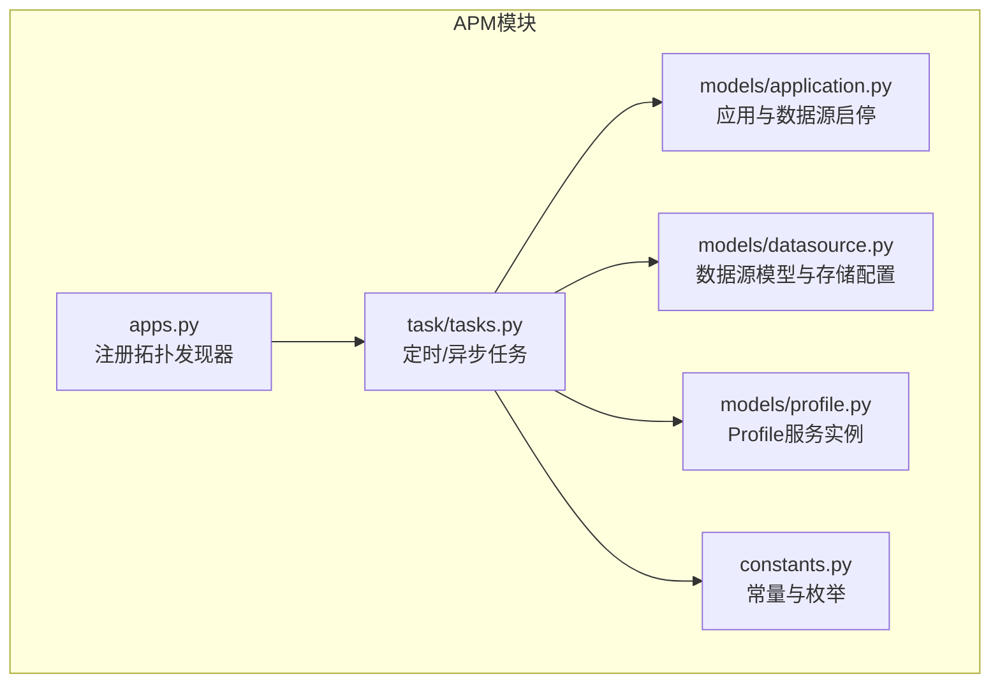
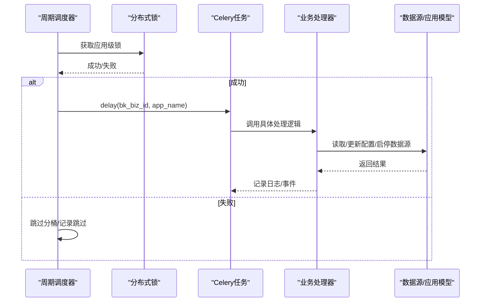
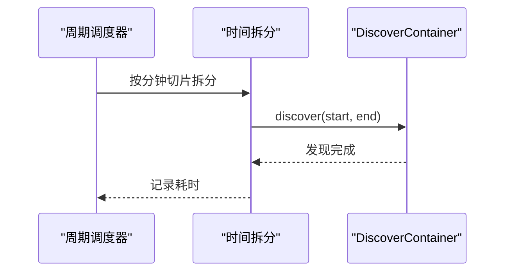
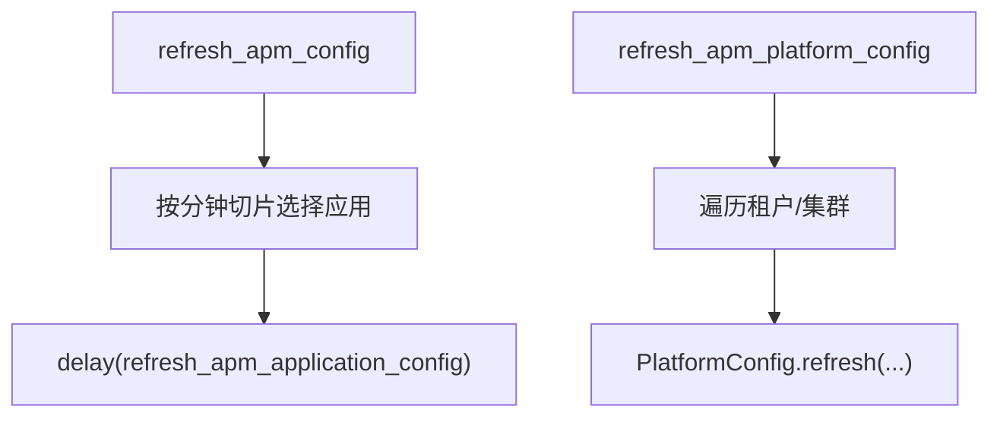
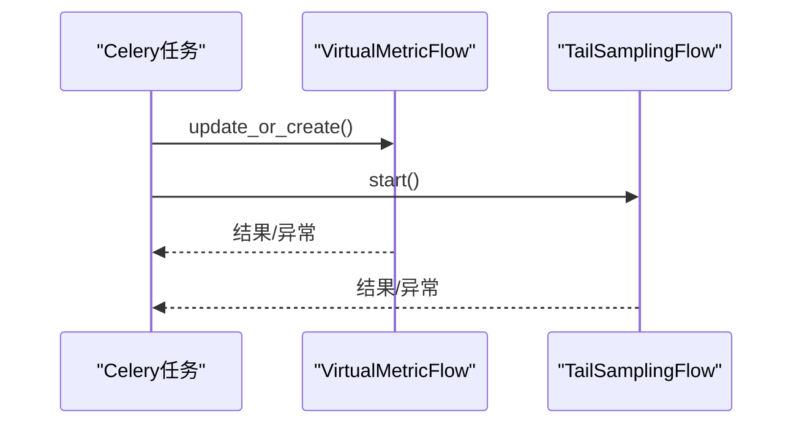
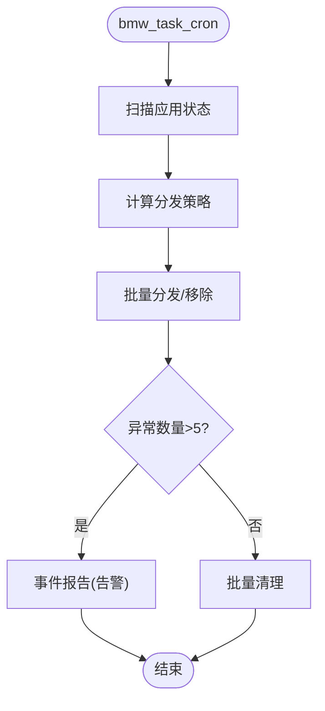
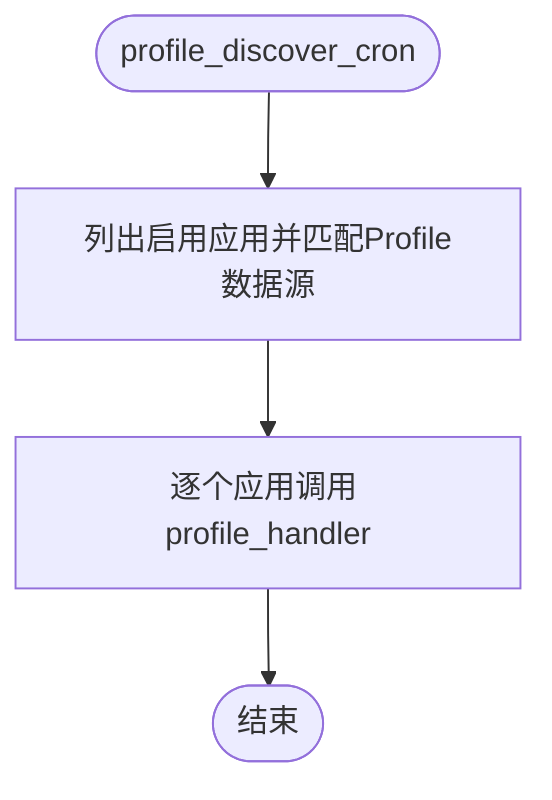
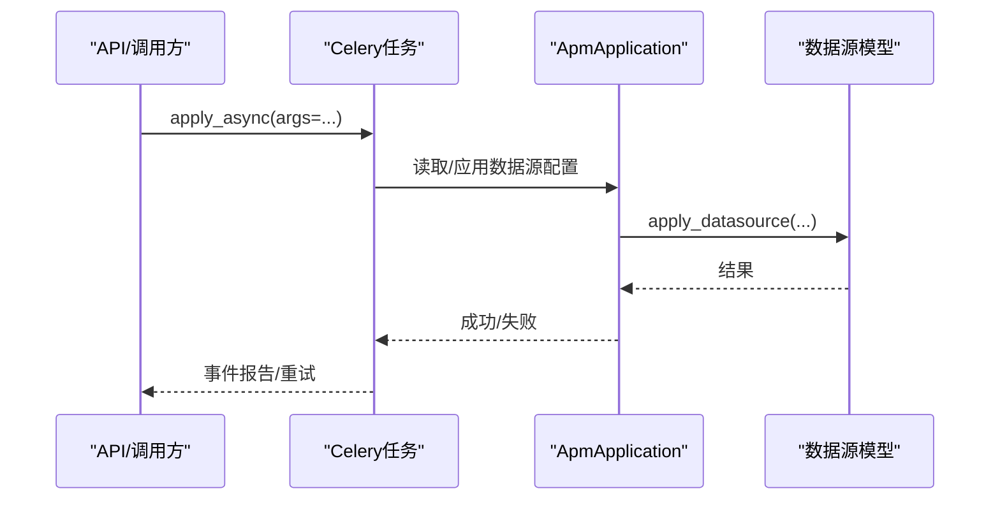
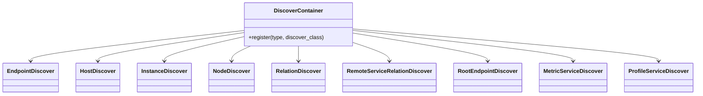
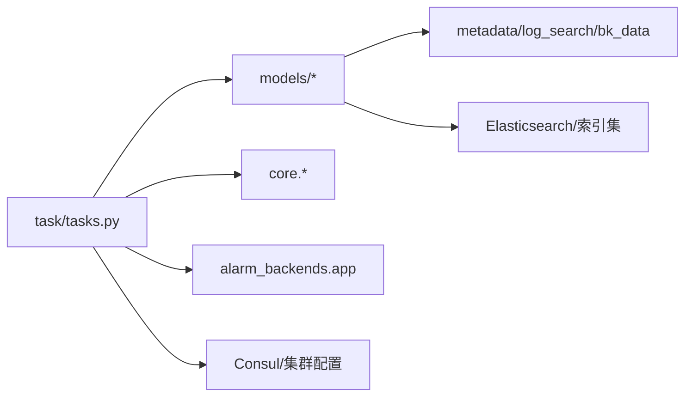

# 任务调度和管理

<cite>
**本文引用的文件**
- [tasks.py](file://bkmonitor/apm/task/tasks.py)
- [apps.py](file://bkmonitor/apm/apps.py)
- [constants.py](file://bkmonitor/apm/constants.py)
- [application.py](file://bkmonitor/apm/models/application.py)
- [datasource.py](file://bkmonitor/apm/models/datasource.py)
- [profile.py](file://bkmonitor/apm/models/profile.py)
- [__init__.py](file://bkmonitor/apm/__init__.py)
</cite>

## 目录
1. [简介](#简介)
2. [项目结构](#项目结构)
3. [核心组件](#核心组件)
4. [架构总览](#架构总览)
5. [详细组件分析](#详细组件分析)
6. [依赖分析](#依赖分析)
7. [性能考虑](#性能考虑)
8. [故障排查指南](#故障排查指南)
9. [结论](#结论)
10. [附录](#附录)

## 简介
本文件面向APM模块的任务调度与管理，系统性阐述异步任务的设计与实现，覆盖任务定义、调度机制、执行流程与错误处理；并详细说明各类APM任务的功能，如拓扑发现、数据源发现、配置刷新、Profile处理、虚拟指标与尾部采样、预计算任务等。同时提供Celery任务配置要点、任务优先级与队列策略、监控与调试建议以及性能优化思路，帮助开发者理解并维护APM任务体系。

## 项目结构
APM任务相关的核心代码集中在 apm/task/tasks.py，并通过 apm/apps.py 注册拓扑发现器，配合 models 层的数据源模型与常量配置，形成完整的任务编排与执行闭环。



**图表来源**
- [apps.py:30-69](file://bkmonitor/apm/apps.py#L30-L69)
- [tasks.py:53-378](file://bkmonitor/apm/task/tasks.py#L53-L378)
- [application.py:36-250](file://bkmonitor/apm/models/application.py#L36-L250)
- [datasource.py:56-200](file://bkmonitor/apm/models/datasource.py#L56-L200)
- [profile.py:14-30](file://bkmonitor/apm/models/profile.py#L14-L30)
- [constants.py:41-737](file://bkmonitor/apm/constants.py#L41-L737)

**章节来源**
- [apps.py:30-69](file://bkmonitor/apm/apps.py#L30-L69)
- [tasks.py:53-378](file://bkmonitor/apm/task/tasks.py#L53-L378)
- [application.py:36-250](file://bkmonitor/apm/models/application.py#L36-L250)
- [datasource.py:56-200](file://bkmonitor/apm/models/datasource.py#L56-L200)
- [profile.py:14-30](file://bkmonitor/apm/models/profile.py#L14-L30)
- [constants.py:41-737](file://bkmonitor/apm/constants.py#L41-L737)

## 核心组件
- Celery应用与队列
  - 任务统一注册在 alarm_backends.service.scheduler.app 上，使用队列 "celery_cron" 执行。
  - 任务装饰器 @app.task(ignore_result=True, queue="celery_cron") 明确任务的队列归属与结果忽略策略。
- 任务调度器
  - 通过 cron-like 的周期函数（如 topo_discover_cron、datasource_discover_cron、bmw_task_cron）按分钟切片与分桶，避免集中触发。
- 任务处理器
  - 各类 handler 与 create_* / refresh_* 任务封装具体业务逻辑，如拓扑发现、数据源发现、配置刷新、虚拟指标与尾部采样、Profile处理、应用生命周期管理等。
- 数据源与应用模型
  - ApmApplication 提供 start_* / stop_* 方法与 apply_datasource 流程，配合 MetricDataSource、TraceDataSource、LogDataSource、ProfileDataSource 实现数据源的创建、启停与存储配置。
- 缓存与分布式锁
  - 使用 ApmCacheHandler 的分布式锁避免同应用任务并发冲突，提升稳定性。

**章节来源**
- [tasks.py:53-378](file://bkmonitor/apm/task/tasks.py#L53-L378)
- [application.py:57-210](file://bkmonitor/apm/models/application.py#L57-L210)
- [datasource.py:113-190](file://bkmonitor/apm/models/datasource.py#L113-L190)

## 架构总览
APM任务体系围绕“定时扫描 + 分桶调度 + 分布式锁 + 业务处理器”的模式组织，Celery负责任务投递与执行，各任务按分钟切片均匀分布，避免热点与抖动。



**图表来源**
- [tasks.py:62-102](file://bkmonitor/apm/task/tasks.py#L62-L102)
- [tasks.py:120-149](file://bkmonitor/apm/task/tasks.py#L120-L149)
- [application.py:57-131](file://bkmonitor/apm/models/application.py#L57-L131)
- [datasource.py:113-133](file://bkmonitor/apm/models/datasource.py#L113-L133)

## 详细组件分析

### 拓扑发现任务
- 任务入口
  - topo_discover_cron：按分钟切片与快速刷新策略，对启用的应用进行拓扑发现。
  - handler：实际执行拓扑发现，调用 TopoHandler.discover()。
- 分桶与速率控制
  - 使用分钟级余数切分，结合快速刷新窗口与普通刷新窗口，降低并发压力。
- 锁与异常
  - 使用分布式锁避免重复执行；捕获 LockError 并记录跳过信息。

```mermaid
flowchart TD
Start(["开始 topo_discover_cron"]) --> Calc["计算分钟余数与快速刷新窗口"]
Calc --> ListApps["列出启用的应用(排除EBPF)"]
ListApps --> ForEach{"逐个应用"}
ForEach --> |新应用(Δt < 快速阈值)| Quick["按快速间隔分桶"]
ForEach --> |旧应用(Δt >= 阈值)| Normal["按常规间隔分桶"]
Quick --> Delay["delay(handler)"]
Normal --> Delay
Delay --> End(["结束"])
```

**图表来源**
- [tasks.py:62-102](file://bkmonitor/apm/task/tasks.py#L62-L102)

**章节来源**
- [tasks.py:53-102](file://bkmonitor/apm/task/tasks.py#L53-L102)

### 数据源发现任务
- 任务入口
  - datasource_discover_cron：筛选启用且已配置结果表的Metric数据源，按分钟切片分桶投递 datasource_discover_handler。
  - datasource_discover_handler：按固定时间窗口拆分为多个子区间，依次调用 DiscoverContainer.list_discovers() 执行发现。
- 任务特性
  - 支持多类型Telemetry数据源的发现器注册与轮询。
  - 通过 settings.APM_APPLICATION_METRIC_DISCOVER_SPLIT_DELTA 控制拆分粒度。



**图表来源**
- [tasks.py:120-150](file://bkmonitor/apm/task/tasks.py#L120-L150)
- [tasks.py:104-118](file://bkmonitor/apm/task/tasks.py#L104-L118)

**章节来源**
- [tasks.py:104-150](file://bkmonitor/apm/task/tasks.py#L104-L150)

### 配置刷新与平台配置
- 应用配置刷新
  - refresh_apm_config：按分钟切片均匀刷新启用应用的配置。
  - refresh_apm_application_config：调用 ApplicationConfig.refresh() 刷新单个应用配置。
- 平台配置刷新
  - refresh_apm_platform_config：遍历租户与集群，调用 PlatformConfig.refresh() 下发平台配置。
- Kubernetes配置批量刷新
  - refresh_apm_config_to_k8s：批量下发K8s配置，简化下发流程。



**图表来源**
- [tasks.py:152-196](file://bkmonitor/apm/task/tasks.py#L152-L196)
- [tasks.py:180-190](file://bkmonitor/apm/task/tasks.py#L180-L190)

**章节来源**
- [tasks.py:152-196](file://bkmonitor/apm/task/tasks.py#L152-L196)
- [tasks.py:180-190](file://bkmonitor/apm/task/tasks.py#L180-L190)

### 虚拟指标与尾部采样
- 虚拟指标
  - create_virtual_metric：在满足条件时为应用创建计算平台的虚拟指标Flow。
- 尾部采样
  - create_or_update_tail_sampling：创建或更新尾部采样Flow，并记录事件报告。



**图表来源**
- [tasks.py:198-225](file://bkmonitor/apm/task/tasks.py#L198-L225)

**章节来源**
- [tasks.py:198-225](file://bkmonitor/apm/task/tasks.py#L198-L225)

### 预计算与Consul配置检查
- 预计算任务
  - bmw_task_cron：检测并分发预计算任务，移除异常任务并进行告警。
- Consul配置检查
  - check_apm_consul_config：遍历应用检查Consul配置是否需要更新。
- 字段更新检查
  - check_pre_calculate_fields_update：检查预计算字段更新。



**图表来源**
- [tasks.py:324-340](file://bkmonitor/apm/task/tasks.py#L324-L340)
- [tasks.py:227-240](file://bkmonitor/apm/task/tasks.py#L227-L240)

**章节来源**
- [tasks.py:227-240](file://bkmonitor/apm/task/tasks.py#L227-L240)
- [tasks.py:324-340](file://bkmonitor/apm/task/tasks.py#L324-L340)

### Profile处理任务
- 任务入口
  - profile_discover_cron：遍历启用应用并匹配Profile数据源，逐个调用 profile_handler。
  - profile_handler：调用 ProfileDiscoverHandler 执行Profile服务发现。
- 作用
  - 保障Profile数据源的拓扑与服务发现及时更新。



**图表来源**
- [tasks.py:252-267](file://bkmonitor/apm/task/tasks.py#L252-L267)

**章节来源**
- [tasks.py:242-267](file://bkmonitor/apm/task/tasks.py#L242-L267)

### 应用生命周期管理（异步）
- 创建应用
  - create_application_async：异步创建应用数据源，包含重试机制与事件报告。
- 删除应用
  - delete_application_async：停止应用各项能力（trace/metric/log/profiling），刷新配置并删除记录，记录事件报告与异常。



**图表来源**
- [tasks.py:290-322](file://bkmonitor/apm/task/tasks.py#L290-L322)
- [application.py:140-210](file://bkmonitor/apm/models/application.py#L140-L210)

**章节来源**
- [tasks.py:290-322](file://bkmonitor/apm/task/tasks.py#L290-L322)
- [application.py:140-210](file://bkmonitor/apm/models/application.py#L140-L210)

### 拓扑发现器注册
- 在 ready() 中注册多种Telemetry类型的发现器，包括Trace、Metric、Profile等，确保任务执行时可按类型选择合适的处理器。



**图表来源**
- [apps.py:33-65](file://bkmonitor/apm/apps.py#L33-L65)

**章节来源**
- [apps.py:30-69](file://bkmonitor/apm/apps.py#L30-L69)

## 依赖分析
- 组件耦合
  - 任务层依赖 models 层的数据源与应用模型，用于启停与配置刷新。
  - 任务层依赖 core 层的 DiscoverContainer、TopoHandler、ProfileDiscoverHandler 等处理类。
  - 任务层依赖 alarm_backends 的 Celery app，统一队列与执行环境。
- 外部依赖
  - 计算平台/数据平台API：用于创建/修改数据源、结果表与虚拟指标。
  - Elasticsearch/索引集：Trace数据源的存储与查询。
  - Consul/集群管理：平台配置与集群下发。



**图表来源**
- [tasks.py:23-48](file://bkmonitor/apm/task/tasks.py#L23-L48)
- [datasource.py:135-190](file://bkmonitor/apm/models/datasource.py#L135-L190)

**章节来源**
- [tasks.py:23-48](file://bkmonitor/apm/task/tasks.py#L23-L48)
- [datasource.py:135-190](file://bkmonitor/apm/models/datasource.py#L135-L190)

## 性能考虑
- 分桶与限流
  - 使用分钟级余数切分与快速/普通刷新窗口，避免任务在同一时刻集中执行。
- 任务拆分
  - 数据源发现按固定时间窗口拆分，降低单次任务耗时与内存占用。
- 分布式锁
  - 避免重复执行，减少无效工作与资源竞争。
- 存储与查询
  - Trace数据源采用索引集与冷热分层配置，合理设置切分与保留策略，降低查询成本。
- 重试与退避
  - 异步创建应用支持最多3次重试，每次延迟递增，缓解瞬时失败。

[本节为通用指导，无需特定文件引用]

## 故障排查指南
- 常见问题定位
  - 任务未执行：检查 Celery worker 是否启动、队列 "celery_cron" 是否正确消费。
  - 任务频繁跳过：确认分布式锁是否被占用，查看日志中的跳过记录。
  - 数据源创建失败：核对计算平台/数据平台API连通性与权限，查看事件报告。
  - Trace查询异常：检查索引集是否存在、切分与保留策略是否合理。
- 日志与事件
  - 任务执行日志包含耗时统计与关键参数，便于定位瓶颈。
  - 事件报告用于记录异常与人工干预提示，便于运维追踪。
- 调试建议
  - 在开发环境使用本地Celery执行器验证任务逻辑。
  - 对高耗时任务（如数据源发现）增加拆分粒度与日志埋点，逐步缩小范围。

**章节来源**
- [tasks.py:53-118](file://bkmonitor/apm/task/tasks.py#L53-L118)
- [tasks.py:198-225](file://bkmonitor/apm/task/tasks.py#L198-L225)
- [tasks.py:290-322](file://bkmonitor/apm/task/tasks.py#L290-L322)
- [tasks.py:324-340](file://bkmonitor/apm/task/tasks.py#L324-L340)

## 结论
APM任务体系通过“周期扫描 + 分桶调度 + 分布式锁 + 业务处理器”的组合，实现了拓扑发现、数据源发现、配置刷新、Profile处理、虚拟指标与尾部采样、预计算与平台配置下发等核心能力。该设计兼顾了稳定性与扩展性，适合在大规模应用与多租户环境下持续演进。建议在生产环境中结合监控与告警完善任务可观测性，并根据业务规模调整分桶策略与重试机制。

[本节为总结，无需特定文件引用]

## 附录

### Celery任务配置与优先级
- 队列与路由
  - 所有任务使用队列 "celery_cron"，可通过Celery路由规则将不同类型任务分配到不同worker实例。
- 优先级与并发
  - 可通过任务路由与worker并发数控制高优先级任务（如配置刷新）的执行速度。
- 结果与回传
  - 当前任务均设置 ignore_result=True，避免结果堆积；如需结果回调，可在任务装饰器中调整。

[本节为通用指导，无需特定文件引用]

### 任务监控与调试
- 监控指标
  - 任务执行耗时、成功率、重试次数、队列积压。
- 调试手段
  - 使用 Celery Flower 或管理命令查看任务状态与历史。
  - 在任务中增加结构化日志，记录关键参数与中间结果。

[本节为通用指导，无需特定文件引用]