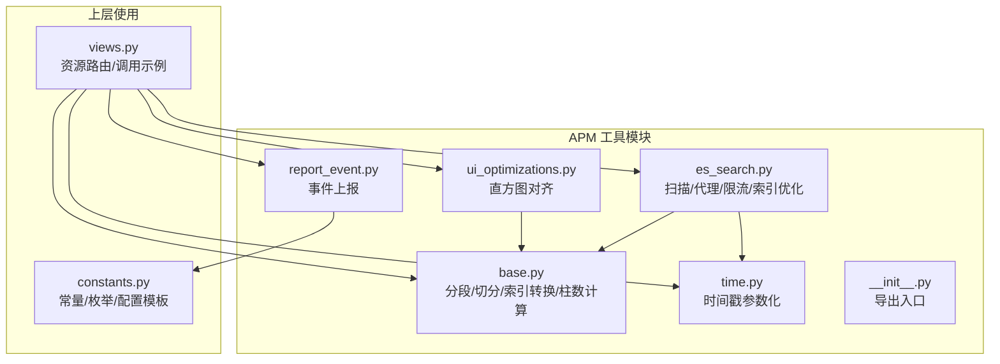
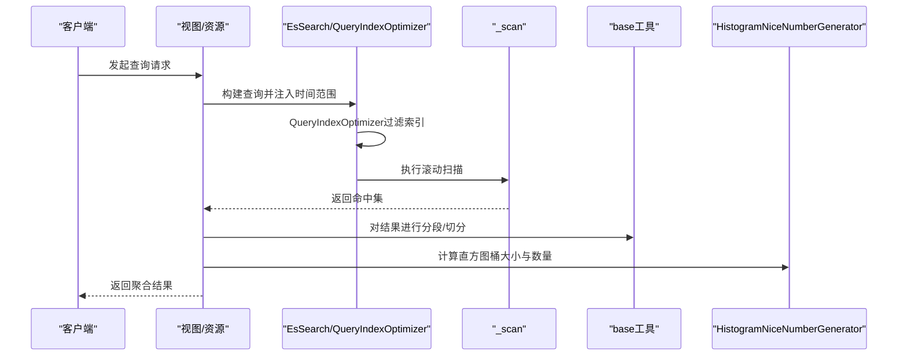
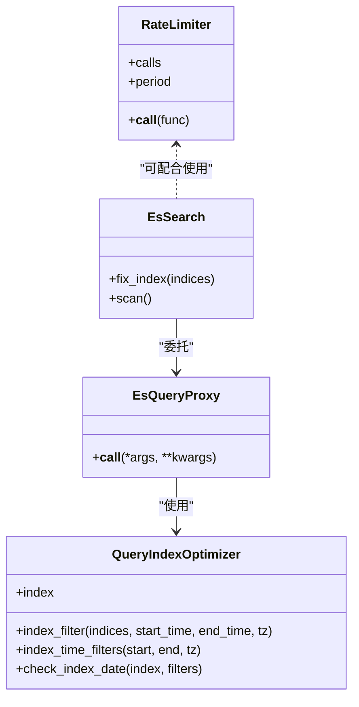
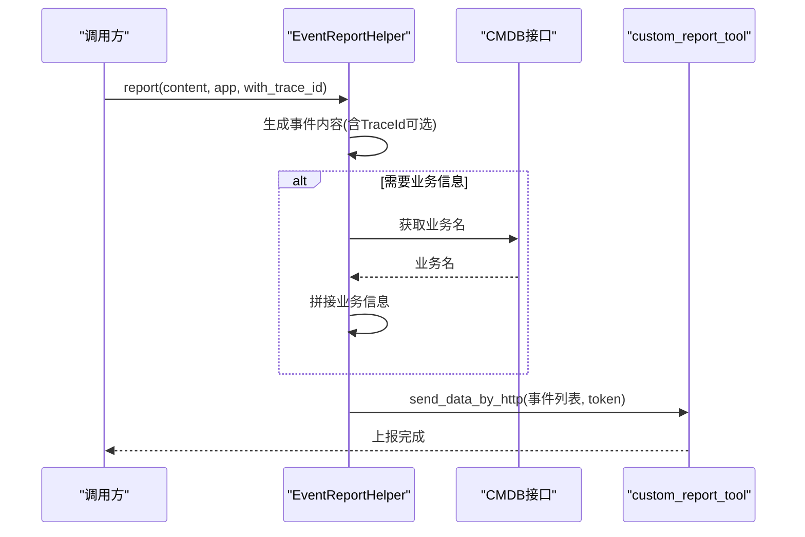
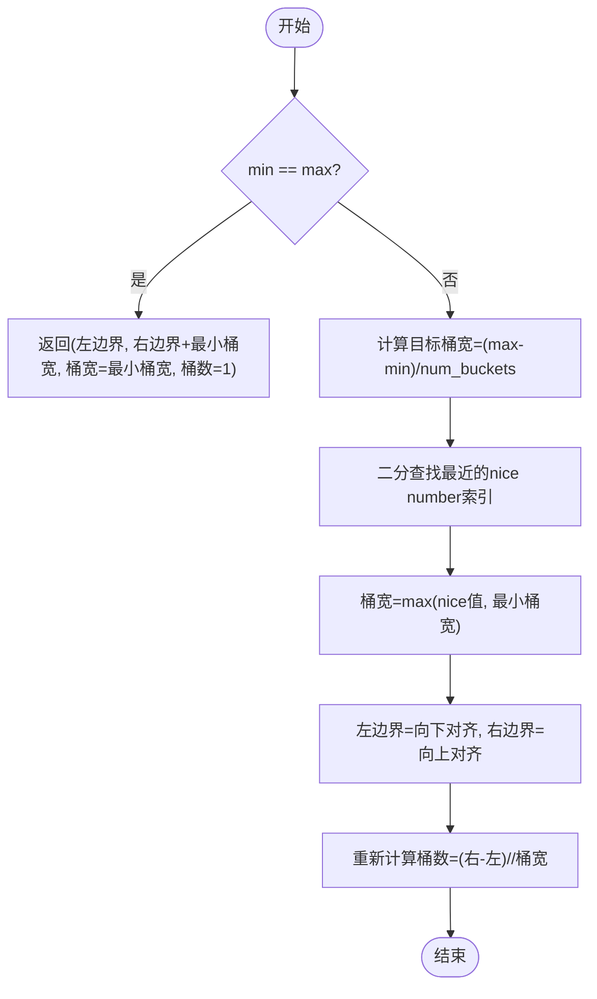
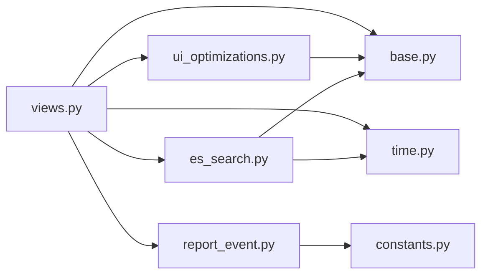

# 工具类和实用程序

<cite>
**本文引用的文件**
- [bkmonitor/apm/utils/base.py](file://bkmonitor/apm/utils/base.py)
- [bkmonitor/apm/utils/es_search.py](file://bkmonitor/apm/utils/es_search.py)
- [bkmonitor/apm/utils/report_event.py](file://bkmonitor/apm/utils/report_event.py)
- [bkmonitor/apm/utils/time.py](file://bkmonitor/apm/utils/time.py)
- [bkmonitor/apm/utils/ui_optimizations.py](file://bkmonitor/apm/utils/ui_optimizations.py)
- [bkmonitor/apm/utils/__init__.py](file://bkmonitor/apm/utils/__init__.py)
- [bkmonitor/apm/constants.py](file://bkmonitor/apm/constants.py)
- [bkmonitor/apm/views.py](file://bkmonitor/apm/views.py)
</cite>

## 目录
1. [简介](#简介)
2. [项目结构](#项目结构)
3. [核心组件](#核心组件)
4. [架构总览](#架构总览)
5. [详细组件分析](#详细组件分析)
6. [依赖分析](#依赖分析)
7. [性能考虑](#性能考虑)
8. [故障排查指南](#故障排查指南)
9. [结论](#结论)
10. [附录](#附录)

## 简介
本章节面向APM工具类与实用程序，系统梳理基础工具、ES搜索优化、事件上报、时间处理与UI直方图优化等模块，明确各工具类的职责、核心方法、参数与返回值、典型用法与最佳实践，帮助开发者在APM数据处理流程中正确使用这些工具，并理解其设计原则与扩展方向。

## 项目结构
APM工具模块位于 apm/utils 下，包含多个独立的工具文件，分别负责不同领域的通用能力：
- 基础工具：分段、均衡切分、索引名转换、柱状图固定柱数计算
- ES搜索：扫描遍历、查询代理与索引优化、限流装饰器、查询索引优化器
- 事件上报：APM后端事件上报辅助类
- 时间处理：时间戳转为可查询参数
- UI优化：直方图nice number对齐与桶划分

**图表来源**
- [bkmonitor/apm/utils/base.py:1-52](file://bkmonitor/apm/utils/base.py#L1-L52)
- [bkmonitor/apm/utils/es_search.py:1-282](file://bkmonitor/apm/utils/es_search.py#L1-L282)
- [bkmonitor/apm/utils/report_event.py:1-61](file://bkmonitor/apm/utils/report_event.py#L1-L61)
- [bkmonitor/apm/utils/time.py:1-16](file://bkmonitor/apm/utils/time.py#L1-L16)
- [bkmonitor/apm/utils/ui_optimizations.py:1-56](file://bkmonitor/apm/utils/ui_optimizations.py#L1-L56)
- [bkmonitor/apm/utils/__init__.py:1-12](file://bkmonitor/apm/utils/__init__.py#L1-L12)
- [bkmonitor/apm/views.py:1-142](file://bkmonitor/apm/views.py#L1-L142)
- [bkmonitor/apm/constants.py:1-737](file://bkmonitor/apm/constants.py#L1-L737)

**章节来源**
- [bkmonitor/apm/utils/__init__.py:1-12](file://bkmonitor/apm/utils/__init__.py#L1-L12)
- [bkmonitor/apm/views.py:1-142](file://bkmonitor/apm/views.py#L1-L142)

## 核心组件
- 基础工具（base.py）
  - divide_biscuit：按固定步长切片迭代器
  - balanced_biscuit：尽量均分的切分算法
  - rt_id_to_index：将点号分隔的rt_id转换为下划线分隔的索引名
  - get_bar_interval_number：基于起止时间与目标柱数，计算柱状图固定柱数（最小粒度为分钟）

- ES搜索工具（es_search.py）
  - _scan：封装Elasticsearch滚动扫描，自动清理scroll_id
  - EsSearch：重写Search，支持fix_index与scan
  - EsQueryProxy：查询代理，注入时间范围优化索引选择
  - RateLimiter/limits：基于信号量的限流装饰器
  - QueryIndexOptimizer：根据时间范围过滤索引集合，生成正则过滤器

- 事件上报（report_event.py）
  - EventReportHelper：APM API侧事件上报，支持TraceId附加、业务信息拼接、CMDB业务名获取、HTTP上报

- 时间处理（time.py）
  - time_range_filter_args：将毫秒级时间戳转换为datetime对象列表，供查询参数使用

- UI优化（ui_optimizations.py）
  - HistogramNiceNumberGenerator：使用nice number序列对齐直方图桶大小与数量，保证视觉友好

**章节来源**
- [bkmonitor/apm/utils/base.py:19-52](file://bkmonitor/apm/utils/base.py#L19-L52)
- [bkmonitor/apm/utils/es_search.py:27-282](file://bkmonitor/apm/utils/es_search.py#L27-L282)
- [bkmonitor/apm/utils/report_event.py:23-61](file://bkmonitor/apm/utils/report_event.py#L23-L61)
- [bkmonitor/apm/utils/time.py:14-16](file://bkmonitor/apm/utils/time.py#L14-L16)
- [bkmonitor/apm/utils/ui_optimizations.py:5-56](file://bkmonitor/apm/utils/ui_optimizations.py#L5-L56)

## 架构总览
APM工具体系围绕“数据查询—结果处理—可视化呈现—可观测事件”四个环节展开：
- 查询阶段：通过EsSearch与EsQueryProxy结合QueryIndexOptimizer，缩小索引范围，提升扫描效率
- 扫描阶段：_scan统一处理滚动扫描与错误处理，避免内存膨胀
- 结果处理：使用base工具进行分段/切分，配合UI优化生成友好的直方图参数
- 上报与追踪：通过EventReportHelper将关键事件与TraceId上报，便于问题定位

**图表来源**
- [bkmonitor/apm/utils/es_search.py:112-136](file://bkmonitor/apm/utils/es_search.py#L112-L136)
- [bkmonitor/apm/utils/es_search.py:27-86](file://bkmonitor/apm/utils/es_search.py#L27-L86)
- [bkmonitor/apm/utils/base.py:19-37](file://bkmonitor/apm/utils/base.py#L19-L37)
- [bkmonitor/apm/utils/ui_optimizations.py:31-55](file://bkmonitor/apm/utils/ui_optimizations.py#L31-L55)

## 详细组件分析

### 基础工具（base.py）
- divide_biscuit(iterator, interval)
  - 功能：将任意可迭代对象按固定步长切片输出
  - 参数：iterator（可迭代）、interval（步长）
  - 返回：迭代器，逐块产出子序列
  - 使用场景：批量处理、分页扫描、流式处理
- balanced_biscuit(input_list, num_splits)
  - 功能：将列表尽量均分给num_splits份，余数均匀分配
  - 参数：input_list（列表）、num_splits（份数）
  - 返回：列表的列表，每份长度尽可能接近
  - 使用场景：负载均衡、并行任务拆分
- rt_id_to_index(rt_id: str) -> str
  - 功能：将“.”替换为“_”，适配索引命名规范
  - 参数：rt_id（字符串）
  - 返回：转换后的字符串
- get_bar_interval_number(start_time, end_time, size=30) -> int
  - 功能：根据起止时间与目标柱数size，计算最终柱数（最小粒度为分钟）
  - 参数：start_time、end_time（时间戳或可比较对象）、size（目标柱数）
  - 返回：整数，柱状图固定柱数
  - 使用场景：前端直方图渲染时的列数确定

**章节来源**
- [bkmonitor/apm/utils/base.py:19-52](file://bkmonitor/apm/utils/base.py#L19-L52)

### ES搜索工具（es_search.py）
- _scan(client, query, scroll, size, request_timeout, clear_scroll, ...)
  - 功能：执行滚动扫描，自动处理shards统计与错误，最后清理scroll_id
  - 参数：client（连接）、query（查询体）、scroll（滚动窗口）、size（每批条数）、request_timeout、clear_scroll等
  - 返回：命中项迭代器
  - 异常：当部分shards失败且raise_on_error为True时抛出ScanError
- EsSearch
  - 功能：扩展elasticsearch_dsl.Search，新增fix_index与scan方法
  - 方法：fix_index(indices)，scan()
  - 使用场景：限定查询索引范围、大批量扫描
- EsQueryProxy
  - 功能：拦截query/post_filter调用，若存在时间范围过滤器，则通过QueryIndexOptimizer动态修正索引
  - 关键逻辑：从filter中提取结束时间的gt/gte与lt/lte，构造optimizer并更新索引
- RateLimiter/limits(calls, period)
  - 功能：基于信号量实现周期内最大调用次数限制
  - 使用：@limits(calls, period)装饰器包装函数
- QueryIndexOptimizer
  - 功能：根据起止时间生成索引过滤正则，仅保留可能包含数据的索引
  - 方法：index_filter、index_time_filters、_generate_filter_list、check_index_date
  - 策略：按日/月粒度生成覆盖范围，针对不同时间跨度采用不同策略（单日、跨月等）

**图表来源**
- [bkmonitor/apm/utils/es_search.py:88-136](file://bkmonitor/apm/utils/es_search.py#L88-L136)
- [bkmonitor/apm/utils/es_search.py:168-282](file://bkmonitor/apm/utils/es_search.py#L168-L282)
- [bkmonitor/apm/utils/es_search.py:138-166](file://bkmonitor/apm/utils/es_search.py#L138-L166)

**章节来源**
- [bkmonitor/apm/utils/es_search.py:27-282](file://bkmonitor/apm/utils/es_search.py#L27-L282)

### 事件上报（report_event.py）
- EventReportHelper
  - _get_content(content, app=None)
    - 功能：拼装事件上报内容，包含事件名、目标主机IP、时间戳、维度与事件详情；若传入app，额外拼接业务信息与CMDB业务名
    - 返回：包含一个事件对象的列表
  - report(content, application=None, with_trace_id=True)
    - 功能：读取配置中的data_id与token，可选附加当前链路的TraceId，通过custom_report_tool发送HTTP上报
    - 配置来源：settings.APM_CUSTOM_EVENT_REPORT_CONFIG

**图表来源**
- [bkmonitor/apm/utils/report_event.py:23-61](file://bkmonitor/apm/utils/report_event.py#L23-L61)

**章节来源**
- [bkmonitor/apm/utils/report_event.py:23-61](file://bkmonitor/apm/utils/report_event.py#L23-L61)

### 时间处理（time.py）
- time_range_filter_args(start_time_timestamp: int, end_time_timestamp: int) -> list
  - 功能：将毫秒时间戳转换为datetime对象，返回[start, end]列表，便于查询参数绑定
  - 使用场景：与EsSearch/Elasticsearch DSL查询参数绑定

**章节来源**
- [bkmonitor/apm/utils/time.py:14-16](file://bkmonitor/apm/utils/time.py#L14-L16)

### UI优化（ui_optimizations.py）
- HistogramNiceNumberGenerator
  - align_histogram_bounds(min_value, max_value, num_buckets, min_bucket_size=1) -> tuple[left_x, right_x, bucket_size, num_buckets]
  - 功能：使用nice number序列对齐桶大小与边界，确保视觉连续性与可读性
  - 算法要点：计算目标桶宽，二分查找最近的nice number作为桶大小，对齐左右边界，计算新桶数
  - 使用场景：直方图/热力图的X轴区间与分桶计算

**图表来源**
- [bkmonitor/apm/utils/ui_optimizations.py:31-55](file://bkmonitor/apm/utils/ui_optimizations.py#L31-L55)

**章节来源**
- [bkmonitor/apm/utils/ui_optimizations.py:5-56](file://bkmonitor/apm/utils/ui_optimizations.py#L5-L56)

## 依赖分析
- 模块内依赖
  - es_search.py依赖arrow、dateutil、elasticsearch_dsl、common.log等外部库
  - report_event.py依赖django settings、opentelemetry、cmdb接口与自定义上报工具
  - ui_optimizations.py依赖bisect与math
- 模块间耦合
  - base与ui_optimizations共同服务于结果分桶与可视化
  - es_search与base在批量处理与扫描阶段形成协作
  - time与es_search在时间参数化方面配合
- 外部依赖
  - Elasticsearch DSL、Arrow时间库、OpenTelemetry链路追踪

**图表来源**
- [bkmonitor/apm/utils/es_search.py:1-282](file://bkmonitor/apm/utils/es_search.py#L1-L282)
- [bkmonitor/apm/utils/base.py:1-52](file://bkmonitor/apm/utils/base.py#L1-L52)
- [bkmonitor/apm/utils/time.py:1-16](file://bkmonitor/apm/utils/time.py#L1-L16)
- [bkmonitor/apm/utils/ui_optimizations.py:1-56](file://bkmonitor/apm/utils/ui_optimizations.py#L1-L56)
- [bkmonitor/apm/utils/report_event.py:1-61](file://bkmonitor/apm/utils/report_event.py#L1-L61)
- [bkmonitor/apm/constants.py:1-737](file://bkmonitor/apm/constants.py#L1-L737)
- [bkmonitor/apm/views.py:1-142](file://bkmonitor/apm/views.py#L1-L142)

**章节来源**
- [bkmonitor/apm/utils/es_search.py:1-282](file://bkmonitor/apm/utils/es_search.py#L1-L282)
- [bkmonitor/apm/utils/base.py:1-52](file://bkmonitor/apm/utils/base.py#L1-L52)
- [bkmonitor/apm/utils/time.py:1-16](file://bkmonitor/apm/utils/time.py#L1-L16)
- [bkmonitor/apm/utils/ui_optimizations.py:1-56](file://bkmonitor/apm/utils/ui_optimizations.py#L1-L56)
- [bkmonitor/apm/utils/report_event.py:1-61](file://bkmonitor/apm/utils/report_event.py#L1-L61)
- [bkmonitor/apm/constants.py:1-737](file://bkmonitor/apm/constants.py#L1-L737)
- [bkmonitor/apm/views.py:1-142](file://bkmonitor/apm/views.py#L1-L142)

## 性能考虑
- ES扫描与索引裁剪
  - 使用QueryIndexOptimizer按日/月粒度裁剪索引，显著减少扫描范围
  - _scan统一处理滚动与错误，避免内存峰值与重复扫描
- 并发与限流
  - RateLimiter通过信号量限制单位时间内的调用次数，防止ES压力过大
- 结果分桶与可视化
  - HistogramNiceNumberGenerator确保桶宽为nice number，提升图表可读性，同时避免过度细分导致的渲染开销
- 时间参数化
  - time_range_filter_args将毫秒时间戳标准化为datetime，便于查询绑定与缓存

[本节为通用指导，无需列出具体文件来源]

## 故障排查指南
- ES扫描异常
  - 现象：部分shards失败或响应不完整
  - 排查：检查QueryIndexOptimizer是否正确过滤索引；确认时间范围是否合理；查看日志warning与ScanError
  - 处理：适当放宽时间范围或调整索引策略
- 限流触发
  - 现象：请求被阻塞或超时
  - 排查：确认RateLimiter的calls与period配置；观察并发调用情况
  - 处理：增大period或减少calls，或在调用方做退避重试
- 事件上报失败
  - 现象：上报无响应或失败
  - 排查：确认settings.APM_CUSTOM_EVENT_REPORT_CONFIG配置；校验token有效性；检查TraceId附加逻辑
  - 处理：补齐配置项；验证CMDB业务名获取接口可用性

**章节来源**
- [bkmonitor/apm/utils/es_search.py:58-86](file://bkmonitor/apm/utils/es_search.py#L58-L86)
- [bkmonitor/apm/utils/report_event.py:55-61](file://bkmonitor/apm/utils/report_event.py#L55-L61)

## 结论
APM工具类与实用程序围绕“高效查询—稳定扫描—友好展示—可观测上报”的闭环设计，既保证了查询性能与稳定性，又提升了用户体验与问题定位能力。通过合理组合base、es_search、report_event、time与ui_optimizations模块，可在复杂APM数据处理流程中实现高可靠与高可维护性。

[本节为总结性内容，无需列出具体文件来源]

## 附录

### 使用示例与最佳实践
- ES查询与索引优化
  - 在构建查询时，优先传入时间范围过滤器，使EsQueryProxy自动触发QueryIndexOptimizer，缩小索引范围
  - 对于大批量数据，使用EsSearch.scan配合_rate_limit装饰器，控制并发与吞吐
- 结果分桶与可视化
  - 使用HistogramNiceNumberGenerator对直方图边界与桶宽进行对齐，确保图表美观与一致
  - 若数据极值差异较大，建议先做分箱或分位处理，再交由该工具对齐
- 事件上报
  - 在关键路径（如配置发布、应用启停）调用EventReportHelper.report，可选附加TraceId，便于端到端追踪
  - 若涉及业务上下文，传入application参数以自动拼接业务信息
- 时间参数化
  - 将毫秒时间戳统一转换为datetime列表，便于与查询DSL绑定

[本节为通用指导，无需列出具体文件来源]