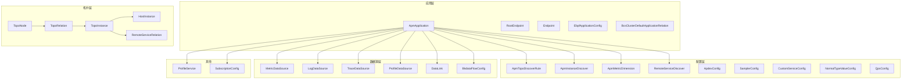
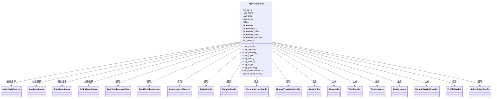
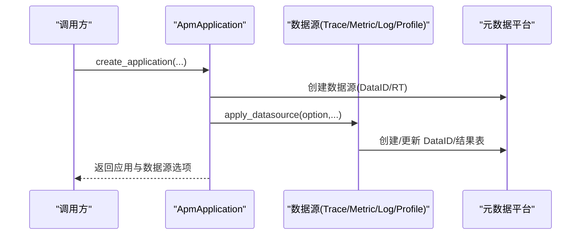
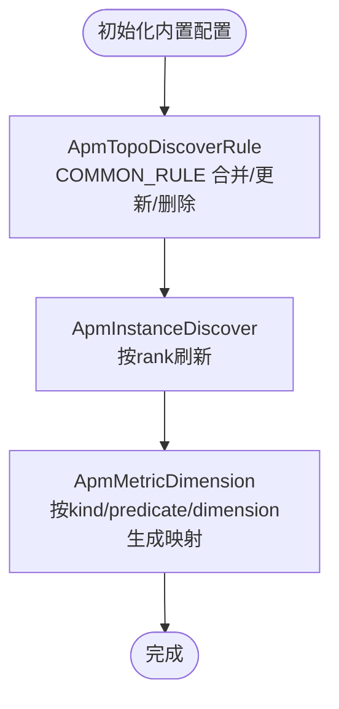
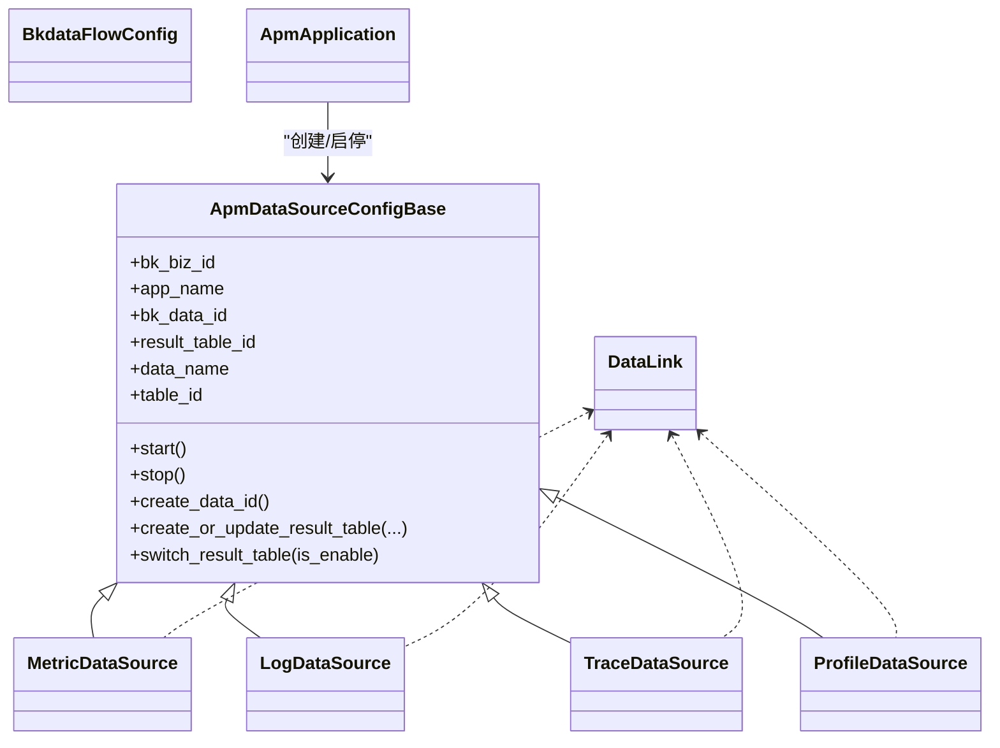
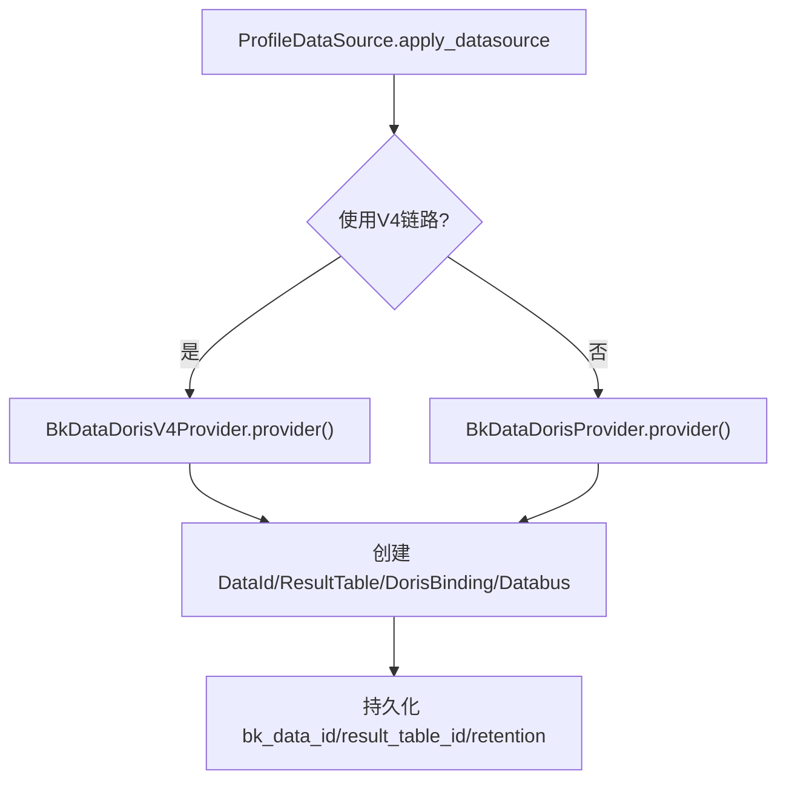
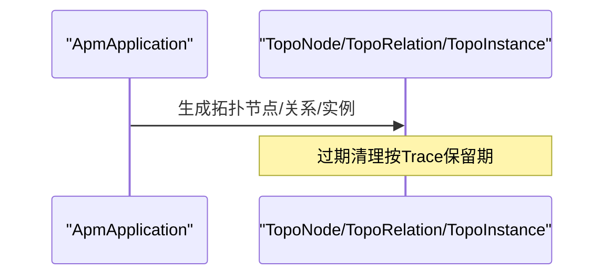
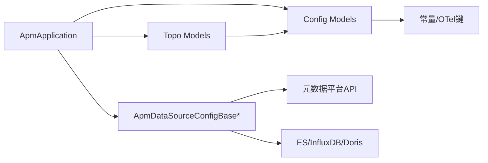

# 数据模型定义

<cite>
**本文引用的文件**
- [models/__init__.py](file://bkmonitor/apm/models/__init__.py)
- [models/application.py](file://bkmonitor/apm/models/application.py)
- [models/config.py](file://bkmonitor/apm/models/config.py)
- [models/datasource.py](file://bkmonitor/apm/models/datasource.py)
- [models/doris.py](file://bkmonitor/apm/models/doris.py)
- [models/profile.py](file://bkmonitor/apm/models/profile.py)
- [models/subscription_config.py](file://bkmonitor/apm/models/subscription_config.py)
- [models/topo.py](file://bkmonitor/apm/models/topo.py)
- [migrations/0002_initbuilt_config.py](file://bkmonitor/apm/migrations/0002_initbuilt_config.py)
- [migrations/0014_initbuilt_metric_dimensions.py](file://bkmonitor/apm/migrations/0014_initbuilt_metric_dimensions.py)
- [constants.py](file://bkmonitor/apm/constants.py)
- [apps.py](file://bkmonitor/apm/apps.py)
- [utils/base.py](file://bkmonitor/apm/utils/base.py)
</cite>

## 目录
1. [简介](#简介)
2. [项目结构](#项目结构)
3. [核心组件](#核心组件)
4. [架构总览](#架构总览)
5. [详细组件分析](#详细组件分析)
6. [依赖分析](#依赖分析)
7. [性能考量](#性能考量)
8. [故障排查指南](#故障排查指南)
9. [结论](#结论)
10. [附录](#附录)

## 简介
本文件系统化梳理 APMSDK 所涉及的数据模型，覆盖应用、配置、数据源、Doris、Profile、订阅配置及拓扑等核心模型，并阐明它们之间的关联关系、索引与约束设计、内置配置初始化机制、配置项管理方式、数据验证与业务规则、生命周期管理、迁移策略与版本兼容处理。文档同时提供关键流程的时序与类图，帮助读者快速理解与落地使用。

## 项目结构
APM 数据模型集中于 apm/models 目录，入口导出位于 __init__.py；核心模型包括：
- 应用层：ApmApplication、RootEndpoint、Endpoint、EbpfApplicationConfig、BcsClusterDefaultApplicationRelation
- 配置层：ApmTopoDiscoverRule、ApmInstanceDiscover、ApmMetricDimension、RemoteServiceDiscover、ApdexConfig、SamplerConfig、CustomServiceConfig、NormalTypeValueConfig、QpsConfig
- 数据源层：MetricDataSource、LogDataSource、TraceDataSource、ProfileDataSource、DataLink、BkdataFlowConfig
- 拓扑层：TopoNode、TopoRelation、TopoInstance、HostInstance、RemoteServiceRelation
- 其他：ProfileService、SubscriptionConfig

图表来源
- [models/application.py:36-343](file://bkmonitor/apm/models/application.py#L36-L343)
- [models/config.py:36-800](file://bkmonitor/apm/models/config.py#L36-L800)
- [models/datasource.py:56-1377](file://bkmonitor/apm/models/datasource.py#L56-L1377)
- [models/doris.py:126-1067](file://bkmonitor/apm/models/doris.py#L126-L1067)
- [models/profile.py:14-30](file://bkmonitor/apm/models/profile.py#L14-L30)
- [models/subscription_config.py:21-37](file://bkmonitor/apm/models/subscription_config.py#L21-L37)
- [models/topo.py:23-143](file://bkmonitor/apm/models/topo.py#L23-L143)

章节来源
- [models/__init__.py:11-17](file://bkmonitor/apm/models/__init__.py#L11-L17)

## 核心组件
- Application：应用实体，负责数据源启停、Token生成、应用校验与创建、缓存数据源属性等。
- Config：拓扑发现规则、实例发现、指标维度、Apdex、采样、自定义服务、类型值、QPS等配置模型。
- Datasource：Metric/Log/Trace/Profile 四类数据源抽象与实现，负责 DataID、结果表、索引集、存储集群、启停与查询。
- Doris：Profile 数据接入的 BkData V3/V4 提供者与命名策略、清洗规则、存储配置。
- Profile：Profile 服务实例表，记录采样周期、频率、类型等。
- SubscriptionConfig：订阅ID记录，支持平台与应用两级配置。
- Topo：拓扑节点、关系、实例、主机与远端服务关系，支持过期清理与缓存。

章节来源
- [models/application.py:36-343](file://bkmonitor/apm/models/application.py#L36-L343)
- [models/config.py:36-800](file://bkmonitor/apm/models/config.py#L36-L800)
- [models/datasource.py:56-1377](file://bkmonitor/apm/models/datasource.py#L56-L1377)
- [models/doris.py:126-1067](file://bkmonitor/apm/models/doris.py#L126-L1067)
- [models/profile.py:14-30](file://bkmonitor/apm/models/profile.py#L14-L30)
- [models/subscription_config.py:21-37](file://bkmonitor/apm/models/subscription_config.py#L21-L37)
- [models/topo.py:23-143](file://bkmonitor/apm/models/topo.py#L23-L143)

## 架构总览
APM 数据模型围绕“应用”为中心，向上承载配置与拓扑，向下对接四类数据源与Doris存储。应用模型通过数据源模型与外部元数据平台交互，创建/更新 DataID 与结果表；配置模型提供内置规则与应用级覆盖；拓扑模型基于规则与数据源发现能力生成可视化拓扑。

图表来源
- [models/application.py:36-343](file://bkmonitor/apm/models/application.py#L36-L343)
- [models/config.py:36-800](file://bkmonitor/apm/models/config.py#L36-L800)
- [models/datasource.py:56-1377](file://bkmonitor/apm/models/datasource.py#L56-L1377)
- [models/topo.py:23-143](file://bkmonitor/apm/models/topo.py#L23-L143)
- [models/profile.py:14-30](file://bkmonitor/apm/models/profile.py#L14-L30)
- [models/subscription_config.py:21-37](file://bkmonitor/apm/models/subscription_config.py#L21-L37)

## 详细组件分析

### Application 模型
- 字段与含义
  - 业务ID、应用名、别名、描述、Token、启用状态、各数据源开关、租户ID
- 关键行为
  - 启停各类数据源：start_trace/start_metric/start_profiling/start_log、stop_trace/stop_metric/stop_log/stop_profiling
  - 应用创建与数据源批量创建：create_application、apply_datasource
  - Token生成：优先使用模型内token，否则回退到历史生成逻辑
  - 缓存数据源属性：trace/metric/profile/log_datasource
- 约束与索引
  - 唯一约束：(app_name, bk_biz_id)
  - 辅助索引：Endpoint/RootEndpoint/TopoBase 的复合索引
- 业务规则
  - 应用重名校验
  - Profile/Log 数据源缺失时自动创建
  - 虚拟指标创建异步触发

图表来源
- [models/application.py:224-250](file://bkmonitor/apm/models/application.py#L224-L250)
- [models/datasource.py:175-191](file://bkmonitor/apm/models/datasource.py#L175-L191)

章节来源
- [models/application.py:36-343](file://bkmonitor/apm/models/application.py#L36-L343)

### Config 模型族
- ApmTopoDiscoverRule：拓扑发现规则，支持分类/系统/平台/SDK四类规则，内置通用规则，支持按应用与全局合并缓存
- ApmInstanceDiscover：实例发现键配置，支持rank排序与刷新
- ApmMetricDimension：指标维度配置，按span_kind与谓词键生成维度组合，支持内置初始化与增量刷新
- RemoteServiceDiscover：远端服务发现规则
- ApdexConfig：Apdex阈值配置
- SamplerConfig：采样类型与百分比
- CustomServiceConfig：自定义服务匹配规则
- NormalTypeValueConfig：类型-值配置，按应用维度读取
- QpsConfig：应用QPS配置

图表来源
- [models/config.py:254-278](file://bkmonitor/apm/models/config.py#L254-L278)
- [models/config.py:300-326](file://bkmonitor/apm/models/config.py#L300-L326)
- [models/config.py:486-545](file://bkmonitor/apm/models/config.py#L486-L545)

章节来源
- [models/config.py:36-800](file://bkmonitor/apm/models/config.py#L36-L800)
- [migrations/0002_initbuilt_config.py:19-23](file://bkmonitor/apm/migrations/0002_initbuilt_config.py#L19-L23)
- [migrations/0014_initbuilt_metric_dimensions.py:19-21](file://bkmonitor/apm/migrations/0014_initbuilt_metric_dimensions.py#L19-L21)
- [apps.py:19-23](file://bkmonitor/apm/apps.py#L19-L23)

### Datasource 模型族
- ApmDataSourceConfigBase：抽象基类，统一字段与行为（bk_biz_id、app_name、bk_data_id、result_table_id），提供数据名/表名生成、启停、DataID创建、结果表创建/更新、JSON序列化
- MetricDataSource：时序数据源，创建时间序列分组与字段定义
- LogDataSource：日志数据源，创建/更新自定义上报、索引集与采集器启停
- TraceDataSource：Trace数据源，创建结果表、索引集、索引名解析、字段映射、查询构建、事件与端点查询、聚合统计
- ProfileDataSource：Profile数据源，支持V3/V4链路接入，创建DataHub/ResultTable/DorisBinding/Databus，启停与清理
- DataLink：数据链路配置，跨集群与Transfer集群
- BkdataFlowConfig：APM Flow管理（如尾部采样）

图表来源
- [models/datasource.py:56-191](file://bkmonitor/apm/models/datasource.py#L56-L191)
- [models/datasource.py:192-295](file://bkmonitor/apm/models/datasource.py#L192-L295)
- [models/datasource.py:297-405](file://bkmonitor/apm/models/datasource.py#L297-L405)
- [models/datasource.py:407-800](file://bkmonitor/apm/models/datasource.py#L407-L800)
- [models/datasource.py:1135-1300](file://bkmonitor/apm/models/datasource.py#L1135-L1300)
- [models/datasource.py:1301-1377](file://bkmonitor/apm/models/datasource.py#L1301-L1377)

章节来源
- [models/datasource.py:56-1377](file://bkmonitor/apm/models/datasource.py#L56-L1377)

### Doris 与 Profile
- 命名策略：DataId/ResultTable/DorisBinding/Databus 名称清洗与截断，保证长度限制
- 清洗规则：Profile 数据清洗流程（JSON解析、迭代、base64/pprof解码、字段抽取）
- 存储配置：DorisStorageConfig，支持集群、过期时间、存储类型与Kafka配置
- V3/V4 提供者：BkDataDorisProvider/BkDataDorisV4Provider，分别对接命令式与声明式链路
- ProfileService：记录采样周期、频率、类型、是否大数据量等

图表来源
- [models/datasource.py:1164-1240](file://bkmonitor/apm/models/datasource.py#L1164-L1240)
- [models/doris.py:229-567](file://bkmonitor/apm/models/doris.py#L229-L567)
- [models/doris.py:576-800](file://bkmonitor/apm/models/doris.py#L576-L800)

章节来源
- [models/doris.py:126-1067](file://bkmonitor/apm/models/doris.py#L126-L1067)
- [models/datasource.py:1135-1300](file://bkmonitor/apm/models/datasource.py#L1135-L1300)

### SubscriptionConfig 与 Topo
- SubscriptionConfig：记录订阅ID与配置，支持平台与应用两级
- Topo：节点、关系、实例、主机与远端服务关系，支持过期清理与缓存

图表来源
- [models/topo.py:38-53](file://bkmonitor/apm/models/topo.py#L38-L53)

章节来源
- [models/subscription_config.py:21-37](file://bkmonitor/apm/models/subscription_config.py#L21-L37)
- [models/topo.py:23-143](file://bkmonitor/apm/models/topo.py#L23-L143)

## 依赖分析
- 模块耦合
  - Application 依赖四类数据源与配置模型
  - 配置模型依赖常量与OTel语义键
  - 数据源模型依赖元数据平台API与存储集群配置
  - Topo 模型依赖配置与数据源
- 外部依赖
  - 元数据平台：创建/修改 DataID、结果表、索引集、启停清洗
  - 存储：ES、InfluxDB、Doris
  - 计算平台：Flow管理与清洗配置

图表来源
- [models/application.py:36-343](file://bkmonitor/apm/models/application.py#L36-L343)
- [models/config.py:36-800](file://bkmonitor/apm/models/config.py#L36-L800)
- [models/datasource.py:56-1377](file://bkmonitor/apm/models/datasource.py#L56-L1377)
- [models/topo.py:23-143](file://bkmonitor/apm/models/topo.py#L23-L143)
- [constants.py:17-737](file://bkmonitor/apm/constants.py#L17-L737)

章节来源
- [constants.py:17-737](file://bkmonitor/apm/constants.py#L17-L737)

## 性能考量
- 查询优化
  - TraceDataSource 使用 UnifyQuerySet 与 QueryConfigBuilder 构建查询，支持时间对齐、字段选择与限制
  - 聚合统计采用多聚合方法并行池化，减少多次往返
- 缓存策略
  - 拓扑发现规则内存缓存，避免频繁DB访问
  - TopoNode/TopoInstance 等使用缓存装饰器
- 索引与分区
  - Trace 索引按日期切分，支持热温节点路由
  - 复合索引加速应用/业务维度查询

章节来源
- [models/datasource.py:800-1069](file://bkmonitor/apm/models/datasource.py#L800-L1069)
- [models/config.py:233-251](file://bkmonitor/apm/models/config.py#L233-L251)
- [models/topo.py:73-99](file://bkmonitor/apm/models/topo.py#L73-L99)
- [utils/base.py:19-52](file://bkmonitor/apm/utils/base.py#L19-L52)

## 故障排查指南
- 数据源创建失败
  - 检查元数据平台返回错误，关注 DataID/结果表创建异常
  - Profile V4 链路需确认轮询完成与资源名称持久化
- Trace 查询异常
  - 检查索引集是否存在、索引名解析是否正确、时间范围与字段映射
- 拓扑节点过期
  - 确认应用是否仍存在，节点过期按Trace保留期清理
- 配置未生效
  - 确认内置配置迁移是否执行，或手动触发初始化

章节来源
- [models/datasource.py:135-168](file://bkmonitor/apm/models/datasource.py#L135-L168)
- [models/datasource.py:1123-1133](file://bkmonitor/apm/models/datasource.py#L1123-L1133)
- [models/topo.py:38-53](file://bkmonitor/apm/models/topo.py#L38-L53)
- [apps.py:19-23](file://bkmonitor/apm/apps.py#L19-L23)

## 结论
APM 数据模型以应用为核心，通过配置与拓扑驱动发现，借助四类数据源与Doris存储实现可观测数据的采集、清洗与呈现。内置配置初始化与迁移机制确保平台与应用配置的一致性与可维护性。遵循本文的字段语义、业务规则与生命周期管理建议，可有效支撑大规模场景下的稳定性与性能。

## 附录

### 模型使用示例（路径指引）
- 创建应用并异步创建数据源
  - [models/application.py:224-250](file://bkmonitor/apm/models/application.py#L224-L250)
- 初始化内置配置
  - [migrations/0002_initbuilt_config.py:19-23](file://bkmonitor/apm/migrations/0002_initbuilt_config.py#L19-L23)
  - [migrations/0014_initbuilt_metric_dimensions.py:19-21](file://bkmonitor/apm/migrations/0014_initbuilt_metric_dimensions.py#L19-L21)
- 启停数据源
  - [models/datasource.py:113-134](file://bkmonitor/apm/models/datasource.py#L113-L134)
  - [models/datasource.py:1123-1133](file://bkmonitor/apm/models/datasource.py#L1123-L1133)
- Profile V4 链路接入
  - [models/datasource.py:1164-1240](file://bkmonitor/apm/models/datasource.py#L1164-L1240)
  - [models/doris.py:576-800](file://bkmonitor/apm/models/doris.py#L576-L800)

### 数据验证与业务规则
- 应用重名校验与Token生成回退
  - [models/application.py:217-222](file://bkmonitor/apm/models/application.py#L217-L222)
  - [models/application.py:268-289](file://bkmonitor/apm/models/application.py#L268-L289)
- 配置覆盖与删除策略
  - [models/config.py:254-278](file://bkmonitor/apm/models/config.py#L254-L278)
  - [models/config.py:486-545](file://bkmonitor/apm/models/config.py#L486-L545)
- Trace 查询过滤与聚合
  - [models/datasource.py:785-799](file://bkmonitor/apm/models/datasource.py#L785-L799)
  - [models/datasource.py:964-1019](file://bkmonitor/apm/models/datasource.py#L964-L1019)

### 生命周期管理与迁移
- 迁移脚本与内置配置初始化
  - [migrations/0002_initbuilt_config.py:19-23](file://bkmonitor/apm/migrations/0002_initbuilt_config.py#L19-L23)
  - [migrations/0014_initbuilt_metric_dimensions.py:19-21](file://bkmonitor/apm/migrations/0014_initbuilt_metric_dimensions.py#L19-L21)
- 应用启动时触发初始化
  - [apps.py:19-23](file://bkmonitor/apm/apps.py#L19-L23)