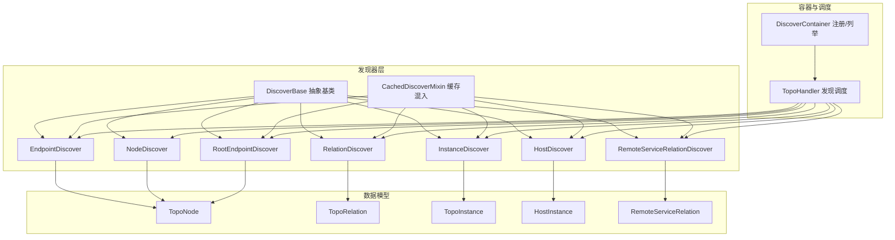
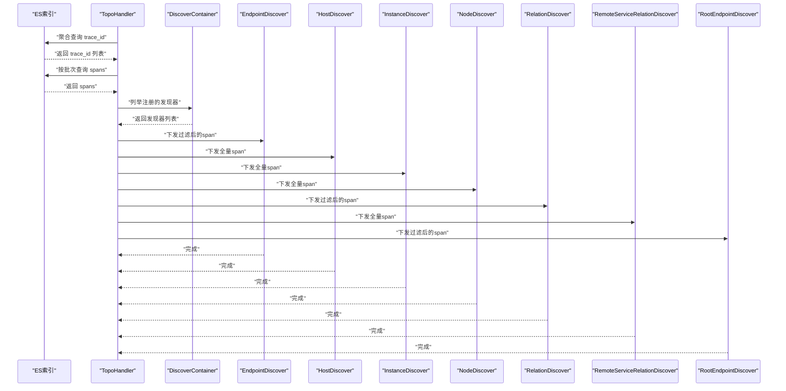
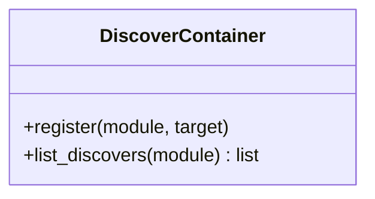
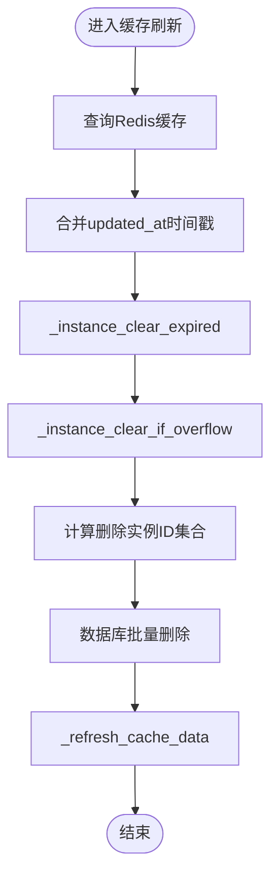
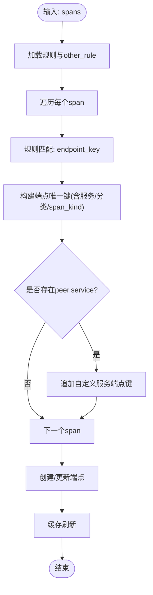
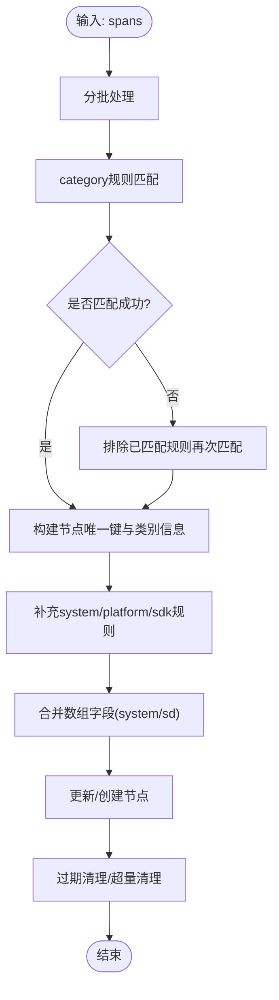
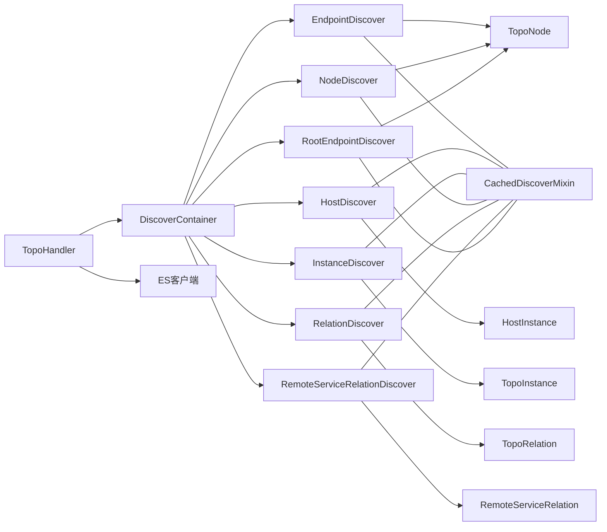

# 核心发现模块

<cite>
**本文引用的文件**
- [discover/base.py](file://bkmonitor/apm/core/discover/base.py)
- [discover/endpoint.py](file://bkmonitor/apm/core/discover/endpoint.py)
- [discover/host.py](file://bkmonitor/apm/core/discover/host.py)
- [discover/instance.py](file://bkmonitor/apm/core/discover/instance.py)
- [discover/node.py](file://bkmonitor/apm/core/discover/node.py)
- [discover/relation.py](file://bkmonitor/apm/core/discover/relation.py)
- [discover/remote_service_relation.py](file://bkmonitor/apm/core/discover/remote_service_relation.py)
- [discover/root_endpoint.py](file://bkmonitor/apm/core/discover/root_endpoint.py)
- [discover/cached_mixin.py](file://bkmonitor/apm/core/discover/cached_mixin.py)
- [discover/instance_data.py](file://bkmonitor/apm/core/discover/instance_data.py)
- [models/topo.py](file://bkmonitor/apm/models/topo.py)
</cite>

## 目录
1. [简介](#简介)
2. [项目结构](#项目结构)
3. [核心组件](#核心组件)
4. [架构总览](#架构总览)
5. [详细组件分析](#详细组件分析)
6. [依赖分析](#依赖分析)
7. [性能考量](#性能考量)
8. [故障排查指南](#故障排查指南)
9. [结论](#结论)
10. [附录](#附录)

## 简介
本文件面向APM核心发现模块，系统化阐述拓扑发现器的设计原理与实现机制，涵盖EndpointDiscover、HostDiscover、InstanceDiscover、NodeDiscover、RelationDiscover、RemoteServiceRelationDiscover、RootEndpointDiscover等各类发现器的功能边界、数据流角色与协作方式；同时深入解析DiscoverContainer容器的注册与调度机制，以及CachedDiscoverMixin带来的缓存与去重治理能力。文档还结合链路追踪、指标监控、Profile分析等场景，给出数据发现与处理的关键流程图与最佳实践，帮助开发者快速理解并扩展APM的拓扑发现能力。

## 项目结构
APM核心发现模块位于apm/core/discover目录，围绕DiscoverBase抽象基类与CachedDiscoverMixin混入类，形成统一的发现器开发范式。各具体发现器负责不同拓扑实体的识别与落库，并通过DiscoverContainer集中注册与调度；模型层由models/topo.py提供TopoNode、TopoRelation、TopoInstance、HostInstance、RemoteServiceRelation等实体支撑。

图表来源
- [discover/base.py:138-571](file://bkmonitor/apm/core/discover/base.py#L138-L571)
- [discover/cached_mixin.py:25-224](file://bkmonitor/apm/core/discover/cached_mixin.py#L25-L224)
- [discover/endpoint.py:27-145](file://bkmonitor/apm/core/discover/endpoint.py#L27-L145)
- [discover/host.py:26-133](file://bkmonitor/apm/core/discover/host.py#L26-L133)
- [discover/instance.py:25-174](file://bkmonitor/apm/core/discover/instance.py#L25-L174)
- [discover/node.py:40-404](file://bkmonitor/apm/core/discover/node.py#L40-L404)
- [discover/relation.py:26-331](file://bkmonitor/apm/core/discover/relation.py#L26-L331)
- [discover/remote_service_relation.py:26-121](file://bkmonitor/apm/core/discover/remote_service_relation.py#L26-L121)
- [discover/root_endpoint.py:25-126](file://bkmonitor/apm/core/discover/root_endpoint.py#L25-L126)
- [models/topo.py:55-143](file://bkmonitor/apm/models/topo.py#L55-L143)

章节来源
- [discover/base.py:138-571](file://bkmonitor/apm/core/discover/base.py#L138-L571)
- [models/topo.py:55-143](file://bkmonitor/apm/models/topo.py#L55-L143)

## 核心组件
- DiscoverBase：所有发现器的抽象基类，提供规则加载、规则匹配、重复数据处理、过期清理、实例构建等通用能力。
- CachedDiscoverMixin：缓存混入类，封装Redis缓存的查询、合并、过期与超量清理、批量刷新等逻辑，统一治理缓存与数据库的一致性。
- DiscoverContainer：发现器注册容器，以模块维度维护发现器列表，TopoHandler通过该容器动态获取待执行的发现器集合。
- TopoHandler：拓扑发现调度器，负责从ES拉取trace_id、分批拉取span、按轮次计算并发粒度、选择性下发给不同发现器，并记录耗时与统计信息。
- 各发现器：EndpointDiscover、HostDiscover、InstanceDiscover、NodeDiscover、RelationDiscover、RemoteServiceRelationDiscover、RootEndpointDiscover，分别负责端点、主机、实例、节点、关系、远程服务关系、根端点的发现与落库。

章节来源
- [discover/base.py:138-571](file://bkmonitor/apm/core/discover/base.py#L138-L571)
- [discover/cached_mixin.py:25-224](file://bkmonitor/apm/core/discover/cached_mixin.py#L25-L224)
- [discover/endpoint.py:27-145](file://bkmonitor/apm/core/discover/endpoint.py#L27-L145)
- [discover/host.py:26-133](file://bkmonitor/apm/core/discover/host.py#L26-L133)
- [discover/instance.py:25-174](file://bkmonitor/apm/core/discover/instance.py#L25-L174)
- [discover/node.py:40-404](file://bkmonitor/apm/core/discover/node.py#L40-L404)
- [discover/relation.py:26-331](file://bkmonitor/apm/core/discover/relation.py#L26-L331)
- [discover/remote_service_relation.py:26-121](file://bkmonitor/apm/core/discover/remote_service_relation.py#L26-L121)
- [discover/root_endpoint.py:25-126](file://bkmonitor/apm/core/discover/root_endpoint.py#L25-L126)

## 架构总览
APM拓扑发现的整体流程如下：TopoHandler从Trace数据源拉取trace_id，分批查询span，按轮次计算并发大小，将span分发给不同发现器。部分发现器需要全量span（如Host、Instance、Node），部分仅需过滤后的span（如Endpoint、Relation、RootEndpoint）。各发现器在本地维护“剩余实例”映射，用于去重与增量更新；完成后通过CachedDiscoverMixin刷新Redis缓存。

图表来源
- [discover/base.py:505-571](file://bkmonitor/apm/core/discover/base.py#L505-L571)
- [discover/base.py:522-563](file://bkmonitor/apm/core/discover/base.py#L522-L563)

章节来源
- [discover/base.py:505-571](file://bkmonitor/apm/core/discover/base.py#L505-L571)

## 详细组件分析

### DiscoverContainer 容器与注册机制
- 职责：以模块名为键，维护该模块下所有发现器类的列表；提供注册与列举方法。
- 使用：TopoHandler在每次发现轮次开始时，通过DiscoverContainer.list_discovers获取当前TelemetryDataType下的所有发现器类，构造参数模板并并行调度。

图表来源
- [discover/base.py:138-149](file://bkmonitor/apm/core/discover/base.py#L138-L149)

章节来源
- [discover/base.py:138-149](file://bkmonitor/apm/core/discover/base.py#L138-L149)

### DiscoverBase 抽象基类
- 规则体系：支持从ApmTopoDiscoverRule加载规则，拆解instance_key、predicate_key、endpoint_key等，区分category规则与其他规则（other_rule）。
- 匹配逻辑：get_match_rule根据predicate_key是否存在进行规则筛选，支持自定义条件过滤extra_cond。
- 重复与过期治理：process_duplicate_records按唯一键去重，支持保留首条或末条；clear_if_overflow与clear_expired分别按阈值与保留期清理。
- 实例构建：抽象方法build_instance_data与_to_found_key由子类实现，保证不同实体的唯一键与数据结构一致。

章节来源
- [discover/base.py:153-330](file://bkmonitor/apm/core/discover/base.py#L153-L330)

### CachedDiscoverMixin 缓存治理
- 缓存查询与合并：_query_cache_data获取Redis缓存，_merge_data将数据库updated_at与缓存时间戳合并，确保过期与超量清理的准确性。
- 过期与超量清理：_instance_clear_expired与_instance_clear_if_overflow分别按保留期与MAX_COUNT清理，返回需删除的实例键集合。
- 刷新缓存：_refresh_cache_data先剔除删除键，再合并新增/更新键，统一写回Redis并设置过期时间。

图表来源
- [discover/cached_mixin.py:179-224](file://bkmonitor/apm/core/discover/cached_mixin.py#L179-L224)

章节来源
- [discover/cached_mixin.py:25-224](file://bkmonitor/apm/core/discover/cached_mixin.py#L25-L224)

### EndpointDiscover（端点发现）
- 适用场景：识别服务下的端点（接口），支持普通端点与“自定义服务端点”（peer.service）两类。
- 关键点：基于规则匹配endpoint_key，结合服务名、分类、span_kind等构成唯一键；支持缓存键生成与刷新。

图表来源
- [discover/endpoint.py:71-145](file://bkmonitor/apm/core/discover/endpoint.py#L71-L145)

章节来源
- [discover/endpoint.py:27-145](file://bkmonitor/apm/core/discover/endpoint.py#L27-L145)

### HostDiscover（主机发现）
- 适用场景：从span资源属性中提取主机IP，尝试关联CMDB云区域与主机ID，生成主机实例。
- 关键点：DISCOVERY_ALL_SPANS=True，需全量span；通过list_bk_cloud_id从CMDB查询云区域与主机ID，去重后批量创建。

章节来源
- [discover/host.py:26-133](file://bkmonitor/apm/core/discover/host.py#L26-L133)

### InstanceDiscover（实例发现）
- 适用场景：识别服务实例与组件实例，支持bk_collector补充的service实例与规则推导的component实例。
- 关键点：区分服务实例与组件实例的instance_id生成方式；通过get_topo_instance_key拼接组件实例键；批量创建并刷新缓存。

章节来源
- [discover/instance.py:25-174](file://bkmonitor/apm/core/discover/instance.py#L25-L174)

### NodeDiscover（节点发现）
- 适用场景：构建TopoNode，聚合category/system/platform/sdk等多维信息；支持k8s工作负载与Pod映射。
- 关键点：按批次处理spans，先category规则推断服务/组件/自定义服务，再按system/platform/sdk规则补充；合并数组字段并批量更新/创建；支持过期清理与永久节点标记。

图表来源
- [discover/node.py:107-404](file://bkmonitor/apm/core/discover/node.py#L107-L404)

章节来源
- [discover/node.py:40-404](file://bkmonitor/apm/core/discover/node.py#L40-L404)

### RelationDiscover（关系发现）
- 适用场景：基于span的父子关系识别同步/异步调用，构建服务间关系。
- 关键点：get_relation_map按span_kind归集父子关系；find_relation_by_single_span处理客户端/生产者与消费者/服务端的双向映射；异步场景下识别中间件与消息服务节点。

章节来源
- [discover/relation.py:26-331](file://bkmonitor/apm/core/discover/relation.py#L26-L331)

### RemoteServiceRelationDiscover（远程服务关系发现）
- 适用场景：当span携带peer.service时，识别父span的端点与远程服务节点之间的关系。
- 关键点：按parent_span_id与with/without peer映射分组，匹配规则生成远程服务节点键与端点名。

章节来源
- [discover/remote_service_relation.py:26-121](file://bkmonitor/apm/core/discover/remote_service_relation.py#L26-L121)

### RootEndpointDiscover（根端点发现）
- 适用场景：从每个trace的第一个SERVER/PRODUCER span确定根端点，用于顶层入口端点识别。
- 关键点：group_by_trace_id按trace_id分组并排序，取首个合适span作为根端点候选；基于规则匹配endpoint_key与服务名。

章节来源
- [discover/root_endpoint.py:25-126](file://bkmonitor/apm/core/discover/root_endpoint.py#L25-L126)

### 数据模型与实体
- TopoNode：节点实体，包含topo_key、extra_data（类别/类型/谓词/语言）、platform（部署平台）、system（系统信息）、sdk（SDK信息）、source（数据源来源）等。
- TopoRelation：关系实体，from_topo_key、to_topo_key、kind（同步/异步）、目标节点类型与分类。
- TopoInstance：实例实体，instance_id、instance_topo_kind、component相关字段、sdk信息。
- HostInstance：主机实例，bk_cloud_id、bk_host_id、ip、topo_node_key。
- RemoteServiceRelation：远程服务关系，topo_node_key、from_endpoint_name、category。

章节来源
- [models/topo.py:55-143](file://bkmonitor/apm/models/topo.py#L55-L143)

## 依赖分析
- 组件耦合
  - DiscoverBase与各发现器：强依赖，提供规则、匹配、去重、清理等通用能力。
  - CachedDiscoverMixin与各发现器：可选依赖，统一缓存治理；提升性能与一致性。
  - DiscoverContainer与TopoHandler：调度依赖，TopoHandler通过容器动态发现发现器。
  - 发现器与模型：各发现器直接依赖对应模型进行批量创建与更新。
- 外部依赖
  - ES：TopoHandler通过ES客户端聚合与滚动查询span。
  - Redis：CachedDiscoverMixin通过ApmCacheHandler读写缓存。
  - CMDB：HostDiscover通过HostManager/HostIPManager查询云区域与主机ID。

图表来源
- [discover/base.py:505-571](file://bkmonitor/apm/core/discover/base.py#L505-L571)
- [discover/cached_mixin.py:25-224](file://bkmonitor/apm/core/discover/cached_mixin.py#L25-L224)
- [models/topo.py:55-143](file://bkmonitor/apm/models/topo.py#L55-L143)

章节来源
- [discover/base.py:505-571](file://bkmonitor/apm/core/discover/base.py#L505-L571)
- [discover/cached_mixin.py:25-224](file://bkmonitor/apm/core/discover/cached_mixin.py#L25-L224)
- [models/topo.py:55-143](file://bkmonitor/apm/models/topo.py#L55-L143)

## 性能考量
- 分批与并发
  - TopoHandler根据ES索引settings的max_result_window与DISCOVER_BATCH_SIZE动态计算per_trace_size，避免单次查询过大导致OOM。
  - 使用ThreadPool并行拉取span与执行发现器，提高吞吐。
- 过滤与选择性
  - Relation、Endpoint、RootEndpoint等仅使用FILTER_KIND过滤后的span，减少无关数据处理。
  - Node、Host、Instance等全量span处理，确保信息完整性。
- 缓存与去重
  - CachedDiscoverMixin在创建/更新后统一刷新Redis缓存，降低重复写入成本；同时按保留期与MAX_COUNT清理，避免缓存膨胀。
- 批量写入
  - 各发现器使用bulk_create批量入库，显著降低数据库压力。

章节来源
- [discover/base.py:491-504](file://bkmonitor/apm/core/discover/base.py#L491-L504)
- [discover/base.py:522-563](file://bkmonitor/apm/core/discover/base.py#L522-L563)
- [discover/cached_mixin.py:207-224](file://bkmonitor/apm/core/discover/cached_mixin.py#L207-L224)

## 故障排查指南
- 规则未生效
  - 检查ApmTopoDiscoverRule是否正确配置instance_key、predicate_key、endpoint_key与sort；确认DiscoverBase.get_rules解析正常。
- 重复数据与脏数据
  - 使用process_duplicate_records或各发现器的get_remain_data进行去重；必要时开启delete_duplicates与keep_last策略。
- 缓存不一致
  - 检查CachedDiscoverMixin的缓存键生成与刷新逻辑；确认Redis缓存过期时间与ApmCacheConfig一致。
- ES查询异常
  - 关注TopoHandler.list_trace_ids与list_span_by_trace_ids的异常分支；检查索引settings与scroll清理。
- 主机关联失败
  - HostDiscover.list_bk_cloud_id依赖CMDB，确认bk_tenant_id与业务ID映射正确，且主机在当前业务下存在。

章节来源
- [discover/base.py:181-210](file://bkmonitor/apm/core/discover/base.py#L181-L210)
- [discover/base.py:283-330](file://bkmonitor/apm/core/discover/base.py#L283-L330)
- [discover/cached_mixin.py:58-104](file://bkmonitor/apm/core/discover/cached_mixin.py#L58-L104)
- [discover/base.py:383-441](file://bkmonitor/apm/core/discover/base.py#L383-L441)
- [discover/host.py:118-133](file://bkmonitor/apm/core/discover/host.py#L118-L133)

## 结论
APM核心发现模块通过DiscoverBase与CachedDiscoverMixin提供统一的发现范式与缓存治理，DiscoverContainer与TopoHandler实现灵活的调度与并发控制。各发现器针对不同拓扑实体进行精准识别，并在链路追踪、指标监控、Profile分析等场景中协同工作，形成完整的拓扑视图。建议在扩展新发现器时遵循现有抽象与混入模式，确保规则、缓存与批量写入的一致性与可维护性。

## 附录
- 配置要点
  - 规则配置：在ApmTopoDiscoverRule中定义instance_key、predicate_key、endpoint_key、type、category_id、topo_kind、sort等字段。
  - 缓存配置：通过ApmCacheConfig设置各类缓存的过期时间；确保Redis可用。
  - 并发与批大小：根据ES索引settings与业务规模调整PER_ROUND_TRACE_ID_MAX_SIZE与DISCOVER_BATCH_SIZE。
- 开发建议
  - 新增发现器：继承DiscoverBase或CachedDiscoverMixin，实现build_instance_data、_to_found_key、discover与get_remain_data。
  - 注册发现器：在合适模块下通过DiscoverContainer.register完成注册，TopoHandler将自动调度。
  - 场景适配：根据是否需要全量span决定DISCOVERY_ALL_SPANS；对高基数实体合理设置MAX_COUNT与清理策略。