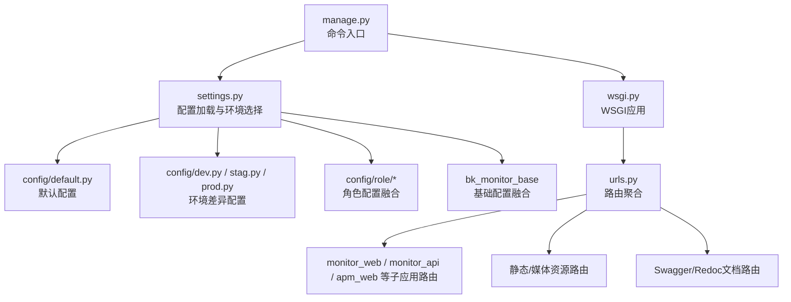
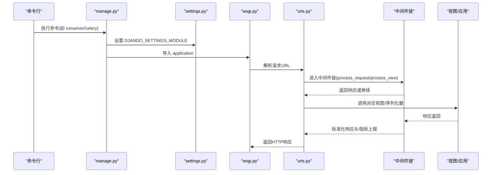
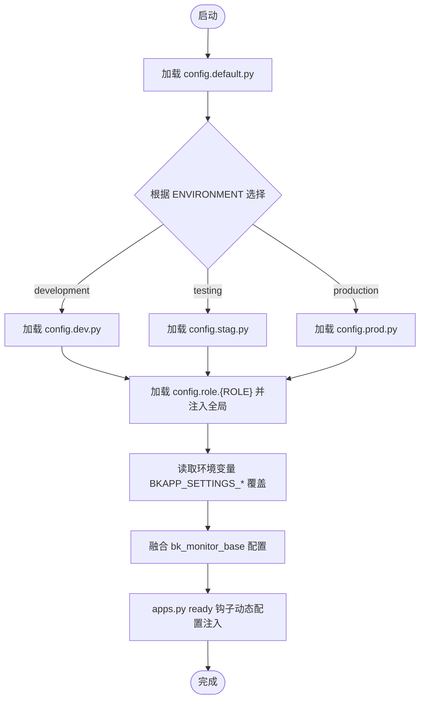
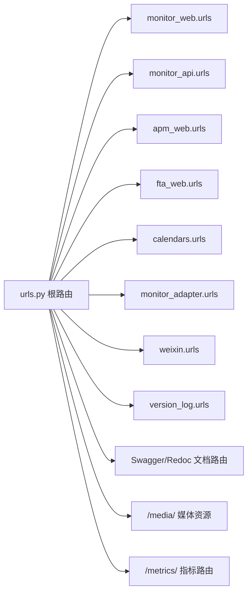
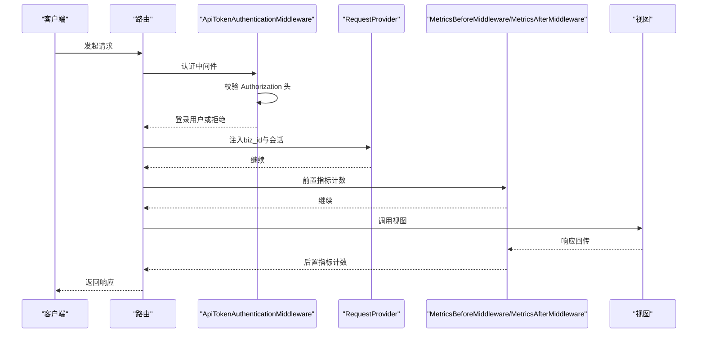
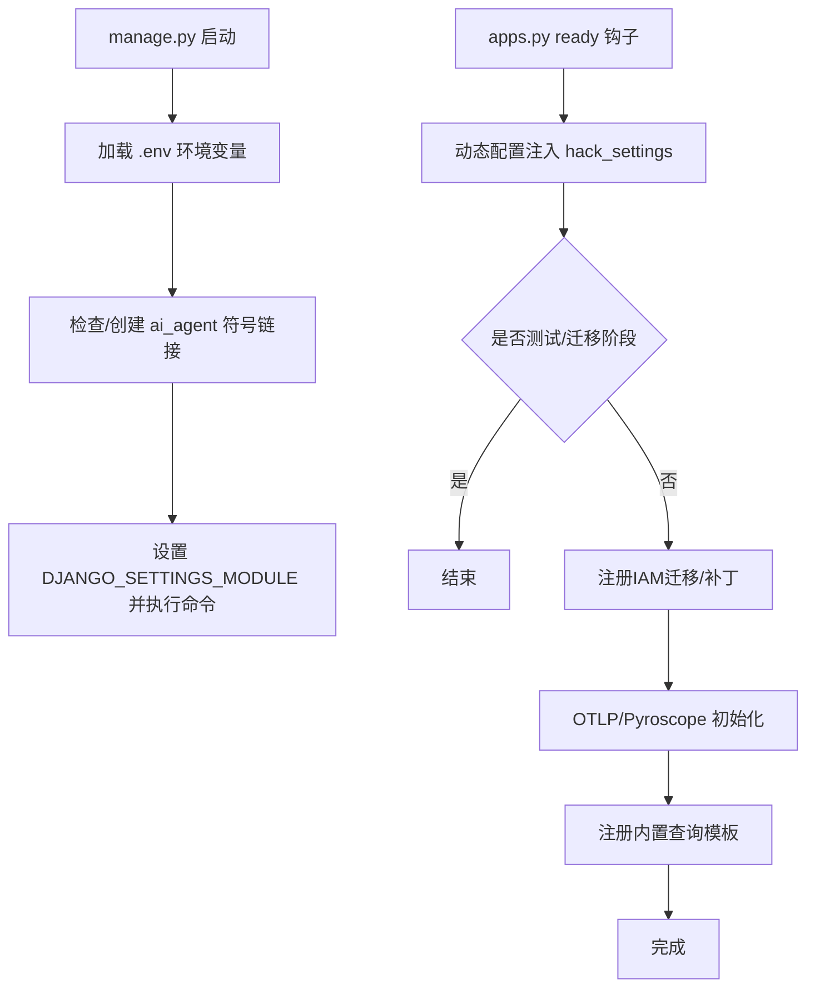
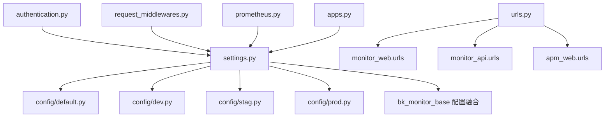

# Django应用架构

<cite>
**本文引用的文件**
- [settings.py](file://bkmonitor/settings.py)
- [urls.py](file://bkmonitor/urls.py)
- [wsgi.py](file://bkmonitor/wsgi.py)
- [manage.py](file://bkmonitor/manage.py)
- [default.py](file://bkmonitor/config/default.py)
- [dev.py](file://bkmonitor/config/dev.py)
- [stag.py](file://bkmonitor/config/stag.py)
- [prod.py](file://bkmonitor/config/prod.py)
- [authentication.py](file://bkmonitor/bkmonitor/middlewares/authentication.py)
- [request_middlewares.py](file://bkmonitor/bkmonitor/middlewares/request_middlewares.py)
- [prometheus.py](file://bkmonitor/bkmonitor/middlewares/prometheus.py)
- [apps.py](file://bkmonitor/bkmonitor/apps.py)
</cite>

## 目录
1. [简介](#简介)
2. [项目结构](#项目结构)
3. [核心组件](#核心组件)
4. [架构总览](#架构总览)
5. [详细组件分析](#详细组件分析)
6. [依赖分析](#依赖分析)
7. [性能考虑](#性能考虑)
8. [故障排查指南](#故障排查指南)
9. [结论](#结论)
10. [附录](#附录)

## 简介
本文件面向蓝鲸智云监控平台的Django应用，系统化梳理其架构设计、配置管理策略、路由组织方式与中间件机制，并结合实际代码路径给出可操作的参考。重点覆盖以下方面：
- settings配置的层次结构、环境切换机制与动态配置加载
- URL路由组织、静态资源与媒体资源管理
- 中间件链路与认证授权扩展
- 应用启动流程与初始化钩子
- 可观测性与性能指标采集

## 项目结构
该项目采用“蓝鲸基础配置 + 多环境配置 + 应用路由聚合”的分层组织方式：
- settings入口按环境动态加载配置模块，随后融合角色配置与环境变量覆盖
- config子包提供默认配置与多环境差异配置
- urls聚合各子应用路由，统一暴露REST API与静态/媒体资源
- 中间件在请求生命周期中完成认证、租户/业务上下文注入与指标采集
- apps.py在ready钩子中完成动态配置、IAM迁移与可观测性初始化

图表来源
- [settings.py:1-110](file://bkmonitor/settings.py#L1-L110)
- [default.py:1-120](file://bkmonitor/config/default.py#L1-L120)
- [dev.py:1-67](file://bkmonitor/config/dev.py#L1-L67)
- [stag.py:1-15](file://bkmonitor/config/stag.py#L1-L15)
- [prod.py:1-15](file://bkmonitor/config/prod.py#L1-L15)
- [urls.py:58-97](file://bkmonitor/urls.py#L58-L97)
- [wsgi.py:17-20](file://bkmonitor/wsgi.py#L17-L20)

章节来源
- [settings.py:1-110](file://bkmonitor/settings.py#L1-L110)
- [urls.py:1-97](file://bkmonitor/urls.py#L1-L97)
- [wsgi.py:1-20](file://bkmonitor/wsgi.py#L1-L20)
- [manage.py:1-49](file://bkmonitor/manage.py#L1-L49)

## 核心组件
- 配置加载与环境选择
  - settings入口根据环境变量选择config.{env}模块，随后加载角色配置与环境变量覆盖，最后融合bk_monitor_base的基础配置
  - 环境变量覆盖键前缀为BKAPP_SETTINGS_，自动注入到settings命名空间
- 路由组织
  - 顶层urls聚合各业务子应用路由，支持API子路径前缀动态注入
  - 提供Swagger/Redoc文档路由（非生产环境）
  - 提供metrics聚合指标路由与媒体资源路由
- 中间件链
  - 认证与API Token校验、业务ID注入、CSRF与安全响应头、Prometheus指标采集
- WSGI与命令入口
  - wsgi.py使用WhiteNoise提供静态资源服务
  - manage.py负责环境变量加载、软链接处理与命令执行

章节来源
- [settings.py:26-110](file://bkmonitor/settings.py#L26-L110)
- [urls.py:58-97](file://bkmonitor/urls.py#L58-L97)
- [wsgi.py:17-20](file://bkmonitor/wsgi.py#L17-L20)
- [manage.py:16-49](file://bkmonitor/manage.py#L16-L49)

## 架构总览
下图展示了从命令行到WSGI、再到路由与中间件的整体调用链：

图表来源
- [manage.py:44-48](file://bkmonitor/manage.py#L44-L48)
- [settings.py:41-43](file://bkmonitor/settings.py#L41-L43)
- [wsgi.py:17-20](file://bkmonitor/wsgi.py#L17-L20)
- [urls.py:58-97](file://bkmonitor/urls.py#L58-L97)

## 详细组件分析

### 配置加载与环境切换
- 层次结构
  - config.default.py：默认配置与公共常量
  - config.{env}.py：开发/预发布/正式环境差异
  - 角色配置：config.role.{role}，按角色注入额外设置
  - 环境变量覆盖：BKAPP_SETTINGS_* 注入settings命名空间
  - 基础配置融合：bk_monitor_base配置与主项目合并，补齐缺失项
- 环境选择
  - settings根据ENVIRONMENT映射到config.dev/stag/prod
  - 通过ROLE加载角色配置并注入全局命名空间
- 动态配置
  - apps.py在ready钩子中通过hack_settings将动态配置写入settings
  - celery worker进程跳过部分初始化，避免重复注册

图表来源
- [settings.py:26-110](file://bkmonitor/settings.py#L26-L110)
- [default.py:137-146](file://bkmonitor/config/default.py#L137-L146)
- [dev.py:21-67](file://bkmonitor/config/dev.py#L21-L67)
- [stag.py:13-15](file://bkmonitor/config/stag.py#L13-L15)
- [prod.py:13-15](file://bkmonitor/config/prod.py#L13-L15)
- [apps.py:30-46](file://bkmonitor/bkmonitor/apps.py#L30-L46)

章节来源
- [settings.py:26-110](file://bkmonitor/settings.py#L26-L110)
- [default.py:137-146](file://bkmonitor/config/default.py#L137-L146)
- [apps.py:30-46](file://bkmonitor/bkmonitor/apps.py#L30-L46)

### URL路由与静态资源管理
- 路由组织
  - 顶层路由include多个子应用命名空间，如monitor_web、monitor_api、apm_web等
  - 支持API子路径前缀API_SUB_PATH动态注入
  - Swagger/Redoc仅在非生产环境开放
  - 提供metrics聚合指标路由与媒体资源路由
- 静态与媒体
  - STATIC_ROOT/STATIC_URL/MEDIA_ROOT/MEDIA_URL在default配置中定义
  - wsgi.py使用WhiteNoise提供静态资源服务

图表来源
- [urls.py:58-97](file://bkmonitor/urls.py#L58-L97)
- [default.py:156-166](file://bkmonitor/config/default.py#L156-L166)
- [wsgi.py:17-20](file://bkmonitor/wsgi.py#L17-L20)

章节来源
- [urls.py:58-97](file://bkmonitor/urls.py#L58-L97)
- [default.py:156-166](file://bkmonitor/config/default.py#L156-L166)
- [wsgi.py:17-20](file://bkmonitor/wsgi.py#L17-L20)

### 中间件机制与认证扩展
- 认证与API Token
  - ApiTokenAuthenticationMiddleware支持Bearer Token鉴权，按令牌类型替换用户或保留原用户上下文
  - ApiTokenAuthBackend支持按tenant_id与用户名创建/获取用户
- 请求上下文
  - RequestProvider注入biz_id到request，支持monitor_web与monitor_adapter命名空间的业务上下文
  - 设置X-Content-Type-Options响应头增强安全性
- 指标采集
  - Prometheus中间件在请求前后记录总量、响应量与延迟，并上报自定义指标

图表来源
- [authentication.py:49-124](file://bkmonitor/bkmonitor/middlewares/authentication.py#L49-L124)
- [request_middlewares.py:25-57](file://bkmonitor/bkmonitor/middlewares/request_middlewares.py#L25-L57)
- [prometheus.py:40-71](file://bkmonitor/bkmonitor/middlewares/prometheus.py#L40-L71)

章节来源
- [authentication.py:30-124](file://bkmonitor/bkmonitor/middlewares/authentication.py#L30-L124)
- [request_middlewares.py:25-57](file://bkmonitor/bkmonitor/middlewares/request_middlewares.py#L25-L57)
- [prometheus.py:28-71](file://bkmonitor/bkmonitor/middlewares/prometheus.py#L28-L71)

### 应用启动流程与初始化钩子
- manage.py
  - 加载环境变量(.env)
  - 自动处理ai_agent软链接
  - 设置DJANGO_SETTINGS_MODULE并执行命令
- apps.py ready钩子
  - 初始化动态配置与缓存节点
  - 条件执行IAM迁移
  - 可观测性初始化（OTLP/Pyroscope）
  - 注册内置查询模板

图表来源
- [manage.py:16-49](file://bkmonitor/manage.py#L16-L49)
- [apps.py:30-113](file://bkmonitor/bkmonitor/apps.py#L30-L113)

章节来源
- [manage.py:16-49](file://bkmonitor/manage.py#L16-L49)
- [apps.py:30-113](file://bkmonitor/bkmonitor/apps.py#L30-L113)

## 依赖分析
- 配置依赖
  - settings依赖config.default与config.{env}，并通过角色配置与环境变量覆盖增强
  - 最终融合bk_monitor_base配置，确保主项目优先、仅补齐缺失项
- 路由依赖
  - 顶层urls依赖各子应用urls命名空间
  - API子路径通过settings.API_SUB_PATH动态注入
- 中间件依赖
  - 认证中间件依赖ApiGateway JWT与自定义令牌模型
  - Prometheus中间件依赖django-prometheus与自定义指标注册
- 启动依赖
  - manage.py依赖dotenv与系统平台能力
  - apps.py依赖Django信号(post_migrate)与环境变量

图表来源
- [settings.py:26-110](file://bkmonitor/settings.py#L26-L110)
- [urls.py:58-97](file://bkmonitor/urls.py#L58-L97)
- [authentication.py:11-140](file://bkmonitor/bkmonitor/middlewares/authentication.py#L11-L140)
- [request_middlewares.py:14-57](file://bkmonitor/bkmonitor/middlewares/request_middlewares.py#L14-L57)
- [prometheus.py:13-71](file://bkmonitor/bkmonitor/middlewares/prometheus.py#L13-L71)
- [apps.py:15-113](file://bkmonitor/bkmonitor/apps.py#L15-L113)

章节来源
- [settings.py:26-110](file://bkmonitor/settings.py#L26-L110)
- [urls.py:58-97](file://bkmonitor/urls.py#L58-L97)
- [authentication.py:11-140](file://bkmonitor/bkmonitor/middlewares/authentication.py#L11-L140)
- [request_middlewares.py:14-57](file://bkmonitor/bkmonitor/middlewares/request_middlewares.py#L14-L57)
- [prometheus.py:13-71](file://bkmonitor/bkmonitor/middlewares/prometheus.py#L13-L71)
- [apps.py:15-113](file://bkmonitor/bkmonitor/apps.py#L15-L113)

## 性能考虑
- 数据库连接
  - 支持CONN_MAX_AGE与自动清理间隔，减少连接开销
- 静态资源
  - 使用WhiteNoise提供静态资源服务，适合轻量部署
- 指标采集
  - Prometheus中间件在请求前后计数与延迟观测，建议在生产环境谨慎启用高开销观测
- 并发与Celery
  - 通过环境变量BK_CELERYD_CONCURRENCY控制并发数，结合容器资源限制合理配置

## 故障排查指南
- 配置未生效
  - 检查环境变量前缀BKAPP_SETTINGS_是否正确
  - 确认ENVIRONMENT与ROLE是否指向正确的配置模块
- 路由访问异常
  - 确认API_SUB_PATH是否正确设置
  - 非生产环境才开放Swagger/Redoc
- 认证失败
  - 检查Authorization头格式与ApiAuthToken有效性
  - 确认租户ID与命名空间匹配
- 静态资源404
  - 确认STATIC_ROOT与STATIC_URL配置
  - 检查WhiteNoise中间件是否启用

章节来源
- [settings.py:57-63](file://bkmonitor/settings.py#L57-L63)
- [urls.py:90-97](file://bkmonitor/urls.py#L90-L97)
- [authentication.py:49-124](file://bkmonitor/bkmonitor/middlewares/authentication.py#L49-L124)
- [default.py:156-166](file://bkmonitor/config/default.py#L156-L166)

## 结论
本项目通过“默认配置 + 环境差异 + 角色配置 + 环境变量覆盖 + 基础配置融合”的多层配置体系，实现了灵活的环境切换与动态配置加载；通过顶层路由聚合与中间件链，提供了清晰的请求处理路径与可观测性支撑；配合manage.py与apps.py的启动钩子，确保了初始化流程的可控与可扩展。

## 附录
- 关键配置键示例
  - BKAPP_SETTINGS_*：用于覆盖任意settings键
  - BKAPP_API_SUB_PATH：API子路径前缀
  - BKAPP_METRIC_AGG_GATEWAY_URL：指标聚合网关地址
  - BK_CELERYD_CONCURRENCY：Celery并发数
- 命令入口
  - python manage.py runserver/celery等

章节来源
- [settings.py:57-63](file://bkmonitor/settings.py#L57-L63)
- [default.py:682-682](file://bkmonitor/config/default.py#L682-L682)
- [default.py:705-706](file://bkmonitor/config/default.py#L705-L706)
- [default.py:114-114](file://bkmonitor/config/default.py#L114-L114)
- [manage.py:18-49](file://bkmonitor/manage.py#L18-L49)