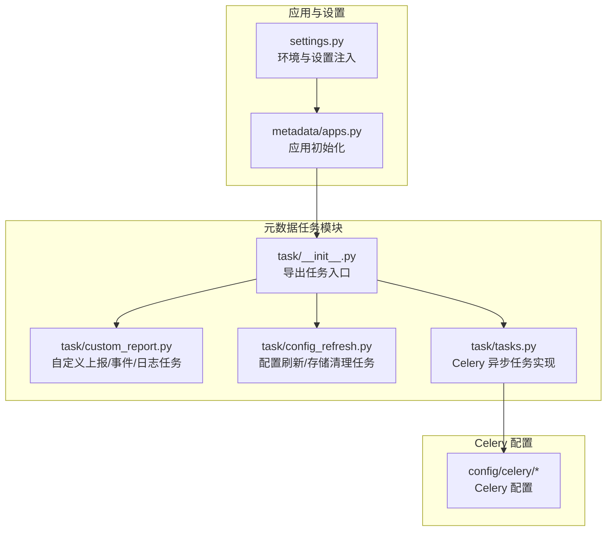
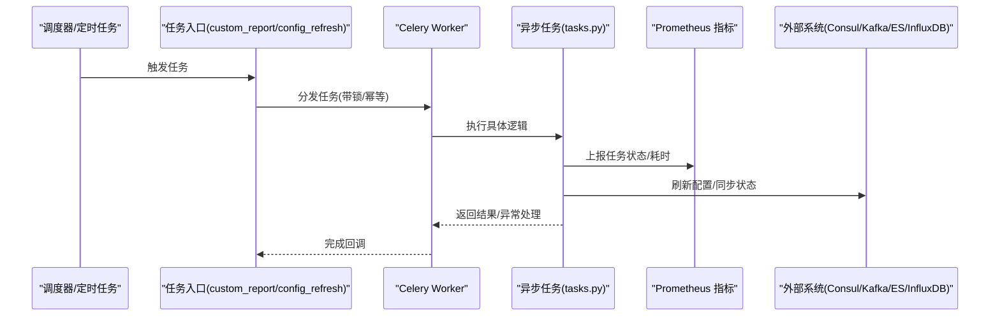
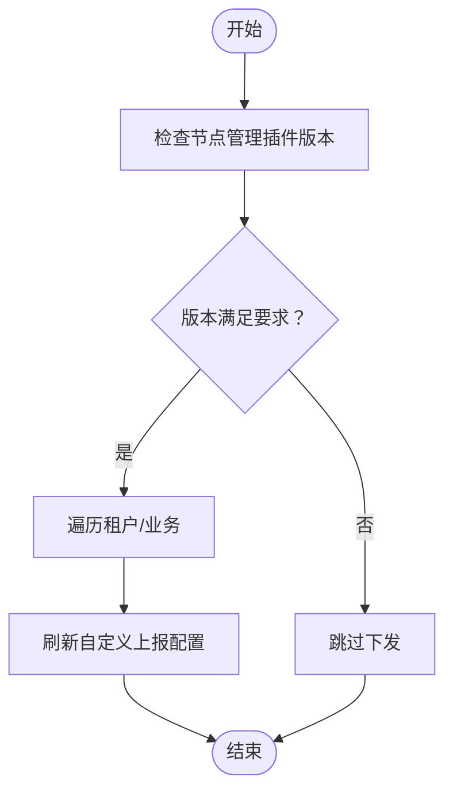
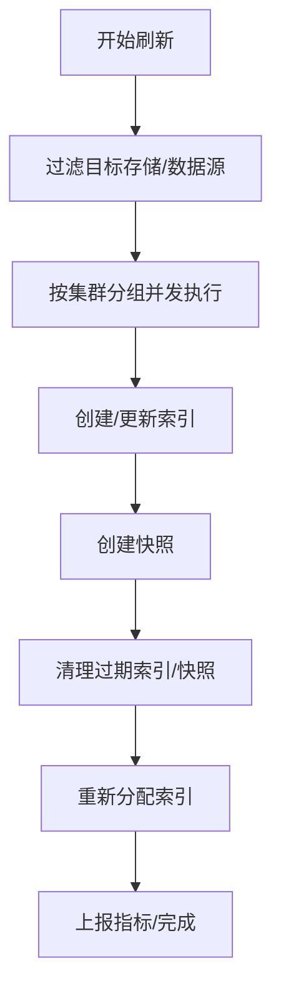
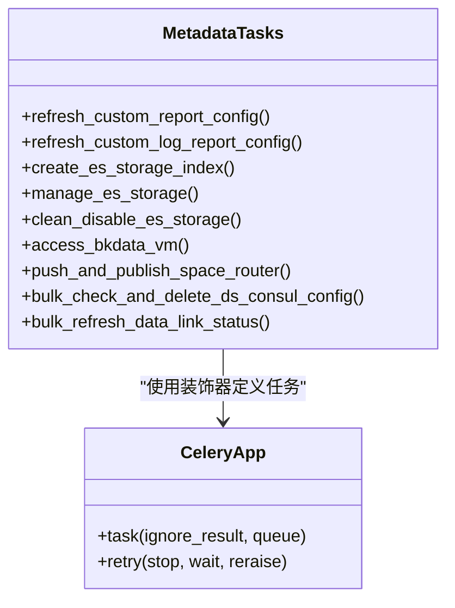
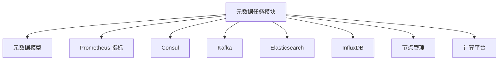

# 元数据任务调度

<cite>
**本文引用的文件**
- [bkmonitor/metadata/task/custom_report.py](file://bkmonitor/metadata/task/custom_report.py)
- [bkmonitor/metadata/task/config_refresh.py](file://bkmonitor/metadata/task/config_refresh.py)
- [bkmonitor/metadata/task/tasks.py](file://bkmonitor/metadata/task/tasks.py)
- [bkmonitor/metadata/task/__init__.py](file://bkmonitor/metadata/task/__init__.py)
- [bkmonitor/config/celery/](file://bkmonitor/config/celery/)
- [bkmonitor/settings.py](file://bkmonitor/settings.py)
- [bkmonitor/metadata/apps.py](file://bkmonitor/metadata/apps.py)
</cite>

## 目录
1. [简介](#简介)
2. [项目结构](#项目结构)
3. [核心组件](#核心组件)
4. [架构总览](#架构总览)
5. [详细组件分析](#详细组件分析)
6. [依赖分析](#依赖分析)
7. [性能考虑](#性能考虑)
8. [故障排查指南](#故障排查指南)
9. [结论](#结论)
10. [附录](#附录)

## 简介
本文件面向元数据管理模块的任务调度系统，围绕 Celery 任务的定义、执行与监控展开，覆盖自动部署代理、自定义上报、数据链路、迁移等后台任务的实现原理。文档同时阐述任务生命周期管理、重试策略与错误处理机制，并提供调度配置、性能监控与故障排查的方法与工具。

## 项目结构
元数据任务调度相关代码主要位于以下位置：
- 元数据任务入口与导出：bkmonitor/metadata/task/__init__.py
- 自定义上报与事件/日志配置任务：bkmonitor/metadata/task/custom_report.py
- 配置刷新与存储管理任务：bkmonitor/metadata/task/config_refresh.py
- Celery 异步任务实现：bkmonitor/metadata/task/tasks.py
- Celery 配置目录：bkmonitor/config/celery/
- 应用初始化与模型绑定：bkmonitor/metadata/apps.py
- Django 设置与环境注入：bkmonitor/settings.py

图表来源
- [bkmonitor/metadata/task/__init__.py:12-14](file://bkmonitor/metadata/task/__init__.py#L12-L14)
- [bkmonitor/metadata/task/custom_report.py:1-348](file://bkmonitor/metadata/task/custom_report.py#L1-L348)
- [bkmonitor/metadata/task/config_refresh.py:1-631](file://bkmonitor/metadata/task/config_refresh.py#L1-L631)
- [bkmonitor/metadata/task/tasks.py:1-800](file://bkmonitor/metadata/task/tasks.py#L1-L800)
- [bkmonitor/config/celery/](file://bkmonitor/config/celery/)
- [bkmonitor/metadata/apps.py:16-42](file://bkmonitor/metadata/apps.py#L16-L42)
- [bkmonitor/settings.py:1-110](file://bkmonitor/settings.py#L1-L110)

章节来源
- [bkmonitor/metadata/task/__init__.py:12-14](file://bkmonitor/metadata/task/__init__.py#L12-L14)
- [bkmonitor/metadata/task/custom_report.py:1-348](file://bkmonitor/metadata/task/custom_report.py#L1-L348)
- [bkmonitor/metadata/task/config_refresh.py:1-631](file://bkmonitor/metadata/task/config_refresh.py#L1-L631)
- [bkmonitor/metadata/task/tasks.py:1-800](file://bkmonitor/metadata/task/tasks.py#L1-L800)
- [bkmonitor/config/celery/](file://bkmonitor/config/celery/)
- [bkmonitor/metadata/apps.py:16-42](file://bkmonitor/metadata/apps.py#L16-L42)
- [bkmonitor/settings.py:1-110](file://bkmonitor/settings.py#L1-L110)

## 核心组件
- 任务定义与导出
  - 通过 task/__init__.py 导出自定义上报与配置刷新相关任务，作为任务入口。
- 自定义上报与事件/日志任务
  - 提供事件维度同步、自定义上报配置下发、日志配置刷新与K8s配置批量下发、事件组休眠检测与索引清理、指标上报等能力。
- 配置刷新与存储管理任务
  - 提供 Consul 存储/ES/InfluxDB 路由刷新、Kafka Topic 分区确认、ES 索引轮转与停用采集项清理、BCS 信息刷新、快照恢复状态刷新、代理存储关系维护、Consul 数据源一致性清理、ES 集群关键配置检查等。
- Celery 异步任务实现
  - 定义大量 @app.task 异步任务，包括 ES 索引轮转、停用采集项清理、接入计算平台 VM、空间路由推送、并发检查并删除 V4 数据源 Consul 配置、并发刷新数据链路状态等。
- Celery 配置与调度
  - 通过 config/celery/ 目录下的配置文件定义 Celery 实例、队列、时钟任务与持久化策略；结合 Django settings 注入环境变量与角色配置。
- 应用初始化
  - metadata/apps.py 在 ready() 中绑定模型类，确保任务执行时模型可用。

章节来源
- [bkmonitor/metadata/task/__init__.py:12-14](file://bkmonitor/metadata/task/__init__.py#L12-L14)
- [bkmonitor/metadata/task/custom_report.py:1-348](file://bkmonitor/metadata/task/custom_report.py#L1-L348)
- [bkmonitor/metadata/task/config_refresh.py:1-631](file://bkmonitor/metadata/task/config_refresh.py#L1-L631)
- [bkmonitor/metadata/task/tasks.py:1-800](file://bkmonitor/metadata/task/tasks.py#L1-L800)
- [bkmonitor/config/celery/](file://bkmonitor/config/celery/)
- [bkmonitor/metadata/apps.py:16-42](file://bkmonitor/metadata/apps.py#L16-L42)

## 架构总览
Celery 任务在元数据模块中的执行路径如下：
- 业务层触发：通过定时任务或管理命令触发任务入口。
- 任务封装：在 custom_report.py 与 config_refresh.py 中定义带锁装饰器的任务，保证并发安全与幂等。
- 异步执行：tasks.py 中的 @app.task 定义具体异步实现，按需分发到不同队列（如 celery_metadata_task_worker、celery_long_task_cron）。
- 监控与指标：任务中通过 Prometheus 指标上报任务状态与耗时，便于观测与告警。
- 外部系统交互：与 Consul、Kafka、ES、InfluxDB、节点管理、计算平台等系统进行配置刷新与状态同步。

图表来源
- [bkmonitor/metadata/task/custom_report.py:84-140](file://bkmonitor/metadata/task/custom_report.py#L84-L140)
- [bkmonitor/metadata/task/config_refresh.py:42-112](file://bkmonitor/metadata/task/config_refresh.py#L42-L112)
- [bkmonitor/metadata/task/tasks.py:65-150](file://bkmonitor/metadata/task/tasks.py#L65-L150)

## 详细组件分析

### 自定义上报与事件/日志任务
- 事件维度同步
  - 以 ES 集群为单位分组，使用多进程并行更新事件维度，避免重复执行与数据库连接问题。
  - 通过共享锁装饰器保证同一任务不会重叠执行。
- 自定义上报配置下发
  - 检测节点管理插件版本，满足条件后向节点管理下发自定义上报配置。
  - 支持按业务或全局下发。
- 日志配置刷新
  - 单条日志配置刷新与批量 K8s 配置刷新，支持按分钟切片均匀分布任务。
- 事件组休眠检测与索引清理
  - 基于事件组使用情况与索引统计，将长期无数据的事件组置为休眠并可选删除索引。
- 指标上报
  - 任务完成后统一上报 Prometheus 指标，便于监控。

图表来源
- [bkmonitor/metadata/task/custom_report.py:142-172](file://bkmonitor/metadata/task/custom_report.py#L142-L172)

章节来源
- [bkmonitor/metadata/task/custom_report.py:84-172](file://bkmonitor/metadata/task/custom_report.py#L84-L172)
- [bkmonitor/metadata/task/custom_report.py:175-348](file://bkmonitor/metadata/task/custom_report.py#L175-L348)

### 配置刷新与存储管理任务
- Consul 路由与存储刷新
  - 刷新 ES/InfluxDB/TSDB 路由与标签配置，确保查询层可见性。
- Kafka Topic 分区确认
  - 通过 AdminClient 获取 Topic 分区数，必要时更新并刷新 Consul。
- ES 索引轮转与停用采集项清理
  - 按 ES 集群分组并发执行索引轮转；对停用采集项执行清理流程。
- BCS 信息与快照恢复
  - 刷新 PodMonitor 信息并清理过期快照；周期性刷新 ES 快照恢复进度。
- 代理存储关系与额外配置
  - 维护 InfluxDB 代理与真实存储映射；刷新查询层附加配置。
- Consul 数据源一致性清理
  - 比对数据库与 Consul 差异，清理无效数据源与集群键。
- ES 集群关键配置检查
  - 检查 auto_create_index 等关键设置，发现问题及时告警。

图表来源
- [bkmonitor/metadata/task/config_refresh.py:313-359](file://bkmonitor/metadata/task/config_refresh.py#L313-L359)
- [bkmonitor/metadata/task/tasks.py:220-276](file://bkmonitor/metadata/task/tasks.py#L220-L276)

章节来源
- [bkmonitor/metadata/task/config_refresh.py:42-112](file://bkmonitor/metadata/task/config_refresh.py#L42-L112)
- [bkmonitor/metadata/task/config_refresh.py:224-311](file://bkmonitor/metadata/task/config_refresh.py#L224-L311)
- [bkmonitor/metadata/task/config_refresh.py:313-408](file://bkmonitor/metadata/task/config_refresh.py#L313-L408)
- [bkmonitor/metadata/task/config_refresh.py:410-480](file://bkmonitor/metadata/task/config_refresh.py#L410-L480)
- [bkmonitor/metadata/task/config_refresh.py:504-578](file://bkmonitor/metadata/task/config_refresh.py#L504-L578)
- [bkmonitor/metadata/task/config_refresh.py:581-631](file://bkmonitor/metadata/task/config_refresh.py#L581-L631)

### Celery 异步任务实现
- 任务类型与队列
  - 通过 @app.task 定义异步任务，指定队列（如 celery_metadata_task_worker、celery_long_task_cron）以隔离长耗时任务。
- ES 索引轮转与停用采集项清理
  - manage_es_storage 与 clean_disable_es_storage 并发处理多个 ESStorage，逐条执行生命周期操作并上报指标。
- 接入计算平台 VM
  - access_bkdata_vm 支持 V2/V1 数据链路接入，具备重试与异常处理。
- 空间路由推送
  - push_and_publish_space_router 批量推送空间路由并发布到 Redis。
- 并发检查与清理
  - bulk_check_and_delete_ds_consul_config 与 bulk_refresh_data_link_status 使用线程池并发处理。
- 重试策略
  - tenacity.retry 装饰器用于 ES 索引创建等场景，指数退避重试，避免瞬时异常导致失败。

图表来源
- [bkmonitor/metadata/task/tasks.py:65-150](file://bkmonitor/metadata/task/tasks.py#L65-L150)
- [bkmonitor/metadata/task/tasks.py:220-276](file://bkmonitor/metadata/task/tasks.py#L220-L276)
- [bkmonitor/metadata/task/tasks.py:278-331](file://bkmonitor/metadata/task/tasks.py#L278-L331)
- [bkmonitor/metadata/task/tasks.py:539-586](file://bkmonitor/metadata/task/tasks.py#L539-L586)
- [bkmonitor/metadata/task/tasks.py:605-636](file://bkmonitor/metadata/task/tasks.py#L605-L636)
- [bkmonitor/metadata/task/tasks.py:683-709](file://bkmonitor/metadata/task/tasks.py#L683-L709)

章节来源
- [bkmonitor/metadata/task/tasks.py:65-150](file://bkmonitor/metadata/task/tasks.py#L65-L150)
- [bkmonitor/metadata/task/tasks.py:220-331](file://bkmonitor/metadata/task/tasks.py#L220-L331)
- [bkmonitor/metadata/task/tasks.py:539-586](file://bkmonitor/metadata/task/tasks.py#L539-L586)
- [bkmonitor/metadata/task/tasks.py:605-709](file://bkmonitor/metadata/task/tasks.py#L605-L709)

### 任务生命周期管理、重试策略与错误处理
- 生命周期
  - 任务开始/结束均通过 Prometheus 指标上报状态与耗时，便于监控与告警。
- 重试策略
  - ES 索引创建任务使用 tenacity.retry，指数退避重试最多 4 次，避免 ESStorage 就绪前的瞬时异常。
- 错误处理
  - 任务内部广泛使用 try/except 捕获异常并记录日志，避免单点异常影响其他系统。
  - 对外部系统调用（如 Kafka、ES、Consul）进行容错处理与告警提示。

章节来源
- [bkmonitor/metadata/task/tasks.py:117-124](file://bkmonitor/metadata/task/tasks.py#L117-L124)
- [bkmonitor/metadata/task/tasks.py:437-446](file://bkmonitor/metadata/task/tasks.py#L437-L446)
- [bkmonitor/metadata/task/config_refresh.py:141-147](file://bkmonitor/metadata/task/config_refresh.py#L141-L147)

## 依赖分析
- 组件耦合
  - 任务模块依赖 Django ORM 与元数据模型，通过 apps.py 在 ready() 中绑定模型类，确保任务执行时模型可用。
  - 任务通过 core.prometheus 指标模块上报运行状态与耗时。
- 外部依赖
  - Consul：用于存储路由与配置。
  - Kafka：用于 Topic 分区确认与消息通道。
  - ES/InfluxDB：用于索引轮转、快照与存储管理。
  - 节点管理/计算平台：用于配置下发与接入。
- 队列与调度
  - 通过 config/celery/ 目录下的配置文件定义 Celery 实例与队列；Django settings 注入环境变量与角色配置。

图表来源
- [bkmonitor/metadata/task/tasks.py:24-61](file://bkmonitor/metadata/task/tasks.py#L24-L61)
- [bkmonitor/metadata/task/config_refresh.py:24-38](file://bkmonitor/metadata/task/config_refresh.py#L24-L38)
- [bkmonitor/metadata/apps.py:16-42](file://bkmonitor/metadata/apps.py#L16-L42)
- [bkmonitor/config/celery/](file://bkmonitor/config/celery/)
- [bkmonitor/settings.py:1-110](file://bkmonitor/settings.py#L1-L110)

章节来源
- [bkmonitor/metadata/task/tasks.py:24-61](file://bkmonitor/metadata/task/tasks.py#L24-L61)
- [bkmonitor/metadata/task/config_refresh.py:24-38](file://bkmonitor/metadata/task/config_refresh.py#L24-L38)
- [bkmonitor/metadata/apps.py:16-42](file://bkmonitor/metadata/apps.py#L16-L42)
- [bkmonitor/config/celery/](file://bkmonitor/config/celery/)
- [bkmonitor/settings.py:1-110](file://bkmonitor/settings.py#L1-L110)

## 性能考虑
- 并发与分组
  - ES 集群按分组并发执行索引轮转与清理，降低单集群压力。
  - 使用线程池并发检查与清理 Consul 配置、刷新数据链路状态。
- 任务队列隔离
  - 长耗时任务（如 ES 索引轮转）使用独立队列，避免阻塞其他任务。
- 指标监控
  - 通过 METADATA_CRON_TASK_STATUS_TOTAL 与 METADATA_CRON_TASK_COST_SECONDS 指标上报任务状态与耗时，便于容量规划与性能优化。
- 重试与退避
  - 对瞬时异常采用指数退避重试，减少抖动对系统的影响。

章节来源
- [bkmonitor/metadata/task/config_refresh.py:333-355](file://bkmonitor/metadata/task/config_refresh.py#L333-L355)
- [bkmonitor/metadata/task/tasks.py:605-636](file://bkmonitor/metadata/task/tasks.py#L605-L636)
- [bkmonitor/metadata/task/tasks.py:117-124](file://bkmonitor/metadata/task/tasks.py#L117-L124)

## 故障排查指南
- 任务未执行或重复执行
  - 检查任务是否被共享锁装饰器保护，确认锁标识与 TTL 是否合理。
  - 查看任务队列与 Worker 是否正常运行。
- 外部系统异常
  - Consul/Kafka/ES/InfluxDB 异常时，任务会捕获异常并记录日志，需检查对应系统健康状态与认证配置。
- 指标缺失
  - 确认 Prometheus 指标上报是否成功，检查任务中 metrics.report_all() 的调用。
- ES 索引轮转失败
  - 检查索引设置与映射是否有效，确认集群健康状态与权限配置。
- Kafka 分区确认失败
  - 检查 Topic 是否存在、分区数是否变化，确认 AdminClient 配置与认证参数。

章节来源
- [bkmonitor/metadata/task/config_refresh.py:581-631](file://bkmonitor/metadata/task/config_refresh.py#L581-L631)
- [bkmonitor/metadata/task/tasks.py:437-446](file://bkmonitor/metadata/task/tasks.py#L437-L446)
- [bkmonitor/metadata/task/tasks.py:247-261](file://bkmonitor/metadata/task/tasks.py#L247-L261)

## 结论
元数据任务调度系统通过 Celery 实现了对自定义上报、事件/日志配置、存储路由、索引轮转与清理、数据链路状态刷新等后台任务的高效管理。系统采用共享锁、队列隔离、指标上报与指数退避重试等机制，确保任务的幂等性、可观测性与稳定性。建议在生产环境中结合监控指标与日志进行持续优化，并定期检查外部系统健康状态与配置一致性。

## 附录
- 任务队列与实例
  - celery_metadata_task_worker：通用元数据任务队列
  - celery_long_task_cron：长耗时任务队列（如 ES 索引轮转）
- 关键配置
  - Celery 配置位于 config/celery/ 目录
  - Django settings 注入环境变量与角色配置，支持多环境部署

章节来源
- [bkmonitor/metadata/task/tasks.py:65-150](file://bkmonitor/metadata/task/tasks.py#L65-L150)
- [bkmonitor/metadata/task/tasks.py:220-276](file://bkmonitor/metadata/task/tasks.py#L220-L276)
- [bkmonitor/config/celery/](file://bkmonitor/config/celery/)
- [bkmonitor/settings.py:1-110](file://bkmonitor/settings.py#L1-L110)