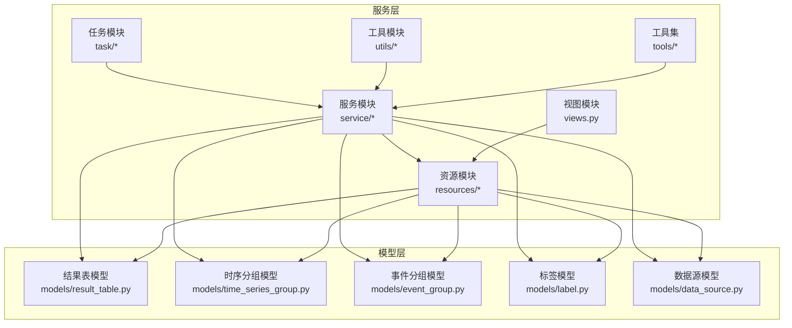
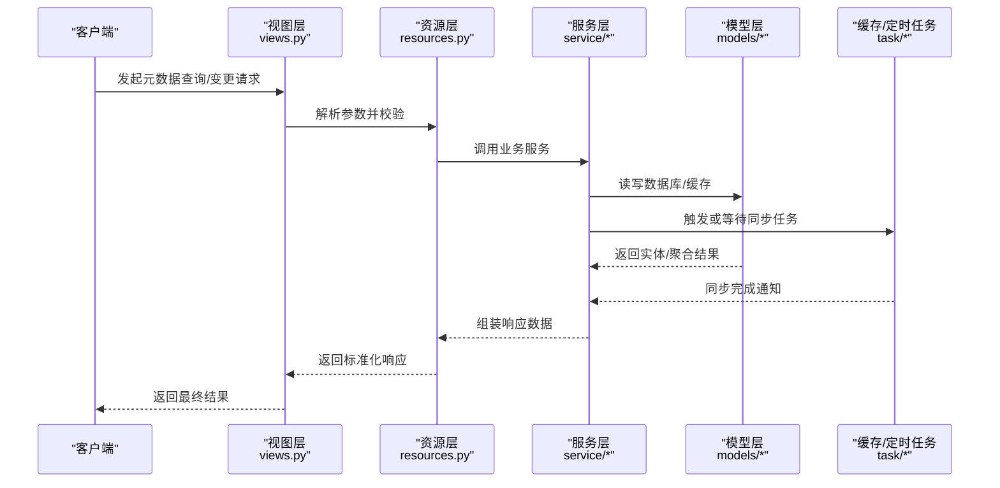
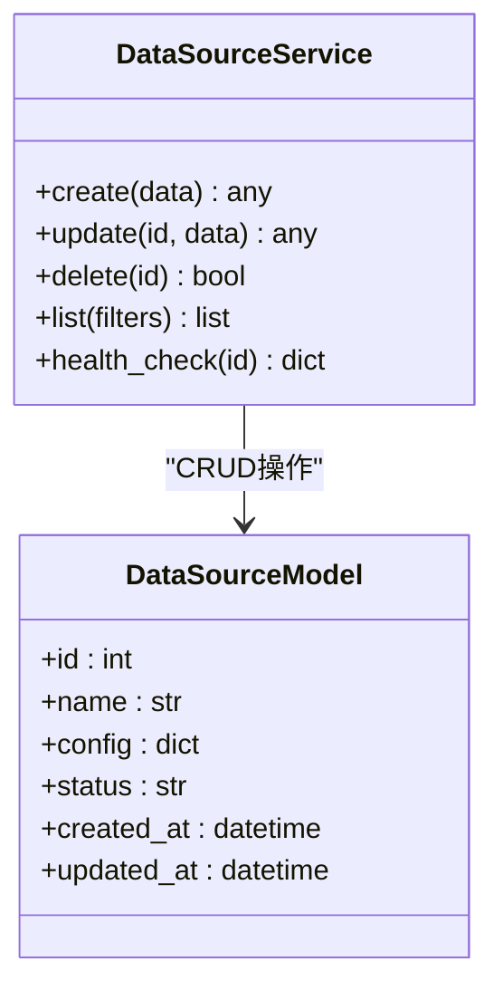
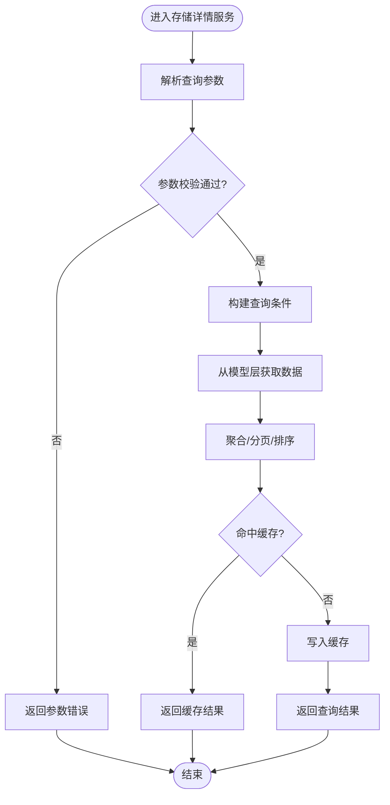
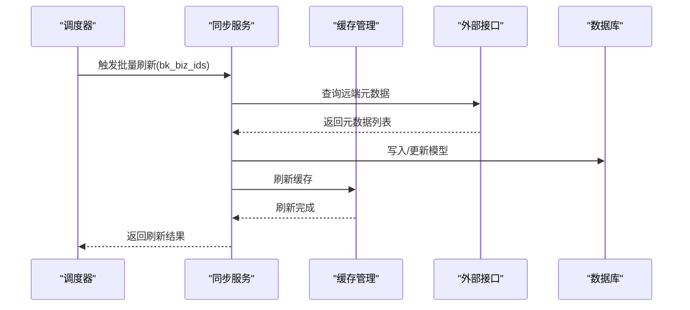
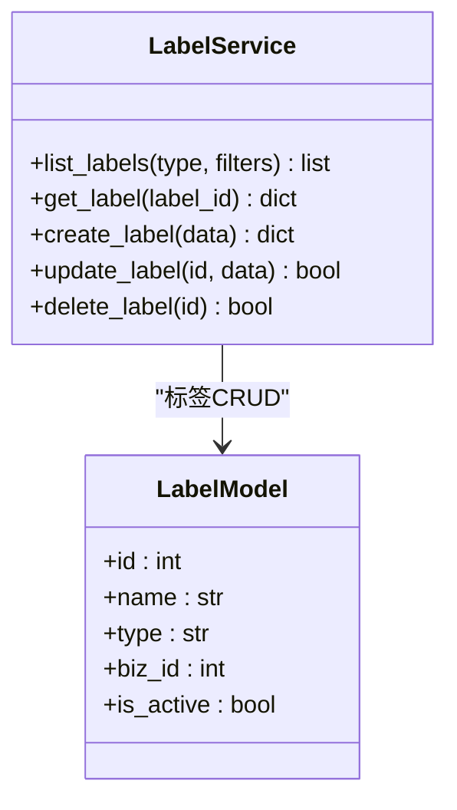
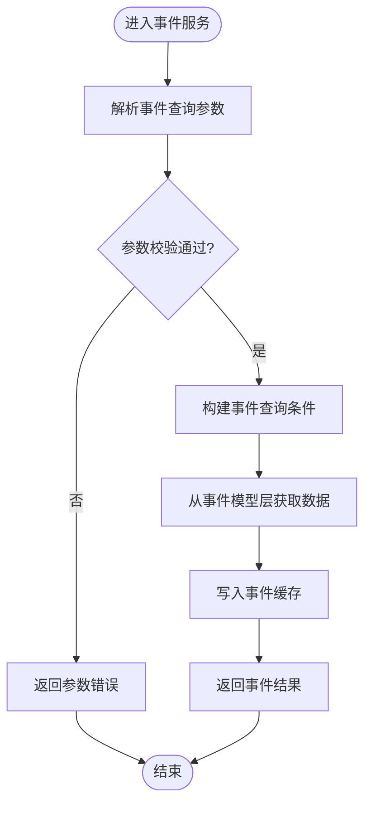
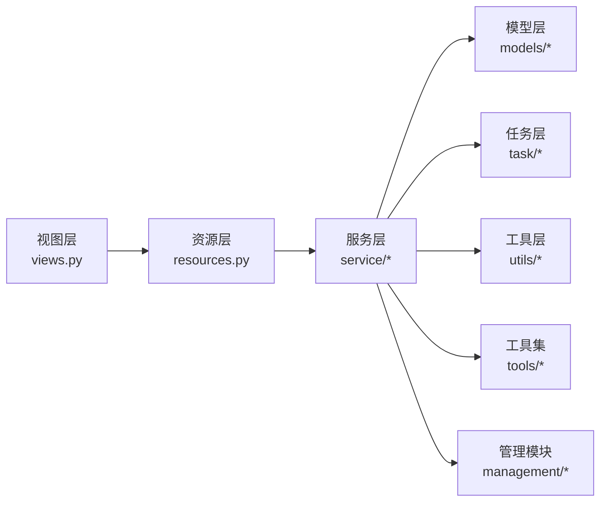

# 元数据服务层

<cite>
**本文档引用的文件**
- [metadata.py](file://bkmonitor/alarm_backends/core/api_cache/metadata.py)
- [result_table.py](file://bkmonitor/alarm_backends/core/cache/result_table.py)
- [custom_ts_group.py](file://bkmonitor/alarm_backends/core/cache/models/custom_ts_group.py)
- [mail_report.py](file://bkmonitor/alarm_backends/core/cache/mail_report.py)
- [event_group.py](file://bkmonitor/metadata/models/event_group.py)
- [time_series_group.py](file://bkmonitor/metadata/models/time_series_group.py)
- [result_table.py](file://bkmonitor/metadata/models/result_table.py)
- [label.py](file://bkmonitor/metadata/models/label.py)
- [data_source.py](file://bkmonitor/metadata/models/data_source.py)
- [metadata_views.py](file://bkmonitor/metadata/views.py)
- [metadata_resources.py](file://bkmonitor/metadata/resources.py)
- [metadata_service.py](file://bkmonitor/metadata/service/__init__.py)
- [metadata_task.py](file://bkmonitor/metadata/task/__init__.py)
- [metadata_utils.py](file://bkmonitor/metadata/utils/__init__.py)
- [metadata_tools.py](file://bkmonitor/metadata/tools/__init__.py)
- [metadata_management.py](file://bkmonitor/metadata/management/__init__.py)
- [metadata_admin.py](file://bkmonitor/metadata/admin.py)
- [metadata_apps.py](file://bkmonitor/metadata/apps.py)
- [metadata_health_check.py](file://bkmonitor/metadata/health_check.py)
- [metadata_signals.py](file://bkmonitor/metadata/signals.py)
- [metadata_config.py](file://bkmonitor/metadata/config.py)
- [metadata_migrations.py](file://bkmonitor/metadata/migrations/__init__.py)
- [metadata_models_init.py](file://bkmonitor/metadata/models/__init__.py)
- [metadata_resources_init.py](file://bkmonitor/metadata/resources/__init__.py)
- [metadata_service_init.py](file://bkmonitor/metadata/service/__init__.py)
- [metadata_task_init.py](file://bkmonitor/metadata/task/__init__.py)
- [metadata_utils_init.py](file://bkmonitor/metadata/utils/__init__.py)
- [metadata_tools_init.py](file://bkmonitor/metadata/tools/__init__.py)
- [metadata_management_init.py](file://bkmonitor/metadata/management/__init__.py)
</cite>

## 目录
1. [简介](#简介)
2. [项目结构](#项目结构)
3. [核心组件](#核心组件)
4. [架构总览](#架构总览)
5. [详细组件分析](#详细组件分析)
6. [依赖关系分析](#依赖关系分析)
7. [性能考虑](#性能考虑)
8. [故障排除指南](#故障排除指南)
9. [结论](#结论)

## 简介
本文件面向元数据管理模块的服务层，系统性梳理服务类的职责边界、调用关系与实现原理，重点覆盖数据源服务、存储详情服务、元数据同步服务等核心业务逻辑。文档同时阐述服务间依赖关系、事务处理与错误恢复机制，并给出接口设计、参数校验与返回值规范，以及服务调用示例与集成指南，帮助开发者快速理解并高效扩展元数据服务能力。

## 项目结构
元数据服务层位于 bkmonitor/metadata 子系统中，围绕“模型-资源-视图-服务-任务-工具-管理”分层组织，形成清晰的职责划分与可扩展架构。下图展示关键模块在服务层中的位置与交互关系：

图表来源
- [metadata_service.py](file://bkmonitor/metadata/service/__init__.py)
- [metadata_task.py](file://bkmonitor/metadata/task/__init__.py)
- [metadata_utils.py](file://bkmonitor/metadata/utils/__init__.py)
- [metadata_tools.py](file://bkmonitor/metadata/tools/__init__.py)
- [metadata_resources.py](file://bkmonitor/metadata/resources.py)
- [metadata_views.py](file://bkmonitor/metadata/views.py)
- [result_table.py](file://bkmonitor/metadata/models/result_table.py)
- [time_series_group.py](file://bkmonitor/metadata/models/time_series_group.py)
- [event_group.py](file://bkmonitor/metadata/models/event_group.py)
- [label.py](file://bkmonitor/metadata/models/label.py)
- [data_source.py](file://bkmonitor/metadata/models/data_source.py)

章节来源
- [metadata_apps.py](file://bkmonitor/metadata/apps.py)
- [metadata_health_check.py](file://bkmonitor/metadata/health_check.py)
- [metadata_admin.py](file://bkmonitor/metadata/admin.py)

## 核心组件
- 数据源服务：负责数据源的注册、配置与生命周期管理，支撑各类结果表与采集任务的数据来源。
- 存储详情服务：提供结果表、时序分组、事件分组等元数据的查询与聚合能力，支持多租户与多业务维度。
- 元数据同步服务：通过缓存与定时任务，确保元数据在各模块间的一致性与可用性，降低跨模块调用成本。
- 标签与分类服务：维护标签体系与分类规则，为元数据检索与权限控制提供基础。
- 事件与异常服务：围绕事件分组与异常记录，提供事件聚合、统计与上报能力。

章节来源
- [metadata_service.py](file://bkmonitor/metadata/service/__init__.py)
- [metadata_resources.py](file://bkmonitor/metadata/resources.py)
- [metadata_views.py](file://bkmonitor/metadata/views.py)

## 架构总览
服务层采用“资源-服务-模型”三层架构，资源层封装对外接口，服务层编排业务流程，模型层承载数据持久化与关系定义。下图展示典型请求链路与模块交互：

图表来源
- [metadata_views.py](file://bkmonitor/metadata/views.py)
- [metadata_resources.py](file://bkmonitor/metadata/resources.py)
- [metadata_service.py](file://bkmonitor/metadata/service/__init__.py)
- [result_table.py](file://bkmonitor/metadata/models/result_table.py)
- [metadata_task.py](file://bkmonitor/metadata/task/__init__.py)

## 详细组件分析

### 数据源服务
职责边界
- 管理数据源的创建、更新、删除与状态变更。
- 提供数据源与结果表之间的映射关系维护。
- 支持数据源的健康检查与异常告警。

实现要点
- 通过资源层暴露REST接口，服务层进行参数校验与业务编排。
- 模型层定义数据源实体及其关联字段，确保数据一致性。
- 与存储详情服务协作，保证结果表配置与数据源一致。

图表来源
- [data_source.py](file://bkmonitor/metadata/models/data_source.py)
- [metadata_service.py](file://bkmonitor/metadata/service/__init__.py)

章节来源
- [data_source.py](file://bkmonitor/metadata/models/data_source.py)
- [metadata_service.py](file://bkmonitor/metadata/service/__init__.py)

### 存储详情服务
职责边界
- 提供结果表、时序分组、事件分组的查询与聚合。
- 支持按业务、租户、标签等维度过滤与排序。
- 输出标准化的数据结构，便于上层策略与告警引擎消费。

实现要点
- 资源层统一参数解析与校验，服务层执行复杂查询与聚合。
- 模型层定义实体关系，确保查询性能与一致性。
- 结合缓存与定时任务，保障高频查询的低延迟。

图表来源
- [metadata_resources.py](file://bkmonitor/metadata/resources.py)
- [result_table.py](file://bkmonitor/metadata/models/result_table.py)
- [time_series_group.py](file://bkmonitor/metadata/models/time_series_group.py)
- [event_group.py](file://bkmonitor/metadata/models/event_group.py)

章节来源
- [metadata_resources.py](file://bkmonitor/metadata/resources.py)
- [result_table.py](file://bkmonitor/metadata/models/result_table.py)
- [time_series_group.py](file://bkmonitor/metadata/models/time_series_group.py)
- [event_group.py](file://bkmonitor/metadata/models/event_group.py)

### 元数据同步服务
职责边界
- 维护元数据在各模块间的同步，避免脏读与不一致。
- 通过定时任务批量刷新，减少实时调用带来的压力。
- 提供失败重试与回滚策略，确保最终一致性。

实现要点
- 使用进程池异步刷新，支持按业务维度分片。
- 缓存层集中管理，降低重复查询成本。
- 异常捕获与日志记录，便于问题定位与恢复。

图表来源
- [result_table.py](file://bkmonitor/alarm_backends/core/cache/result_table.py)
- [custom_ts_group.py](file://bkmonitor/alarm_backends/core/cache/models/custom_ts_group.py)
- [mail_report.py](file://bkmonitor/alarm_backends/core/cache/mail_report.py)

章节来源
- [result_table.py](file://bkmonitor/alarm_backends/core/cache/result_table.py)
- [custom_ts_group.py](file://bkmonitor/alarm_backends/core/cache/models/custom_ts_group.py)
- [mail_report.py](file://bkmonitor/alarm_backends/core/cache/mail_report.py)

### 标签与分类服务
职责边界
- 维护标签类型与标签项，支持结果表、事件分组等的标签化管理。
- 提供标签查询、过滤与统计能力，支撑权限与检索场景。

实现要点
- 模型层定义标签实体与关系，资源层提供查询接口。
- 服务层对标签类型进行枚举与校验，确保数据规范。

图表来源
- [label.py](file://bkmonitor/metadata/models/label.py)
- [metadata_service.py](file://bkmonitor/metadata/service/__init__.py)

章节来源
- [label.py](file://bkmonitor/metadata/models/label.py)
- [metadata_service.py](file://bkmonitor/metadata/service/__init__.py)

### 事件与异常服务
职责边界
- 管理事件分组与事件详情，支持事件聚合、统计与上报。
- 提供事件查询、过滤与导出能力，满足运营与审计需求。

实现要点
- 模型层定义事件分组与事件明细，资源层提供查询接口。
- 服务层结合缓存与定时任务，提升事件查询性能。

图表来源
- [event_group.py](file://bkmonitor/metadata/models/event_group.py)
- [metadata_resources.py](file://bkmonitor/metadata/resources.py)
- [metadata_service.py](file://bkmonitor/metadata/service/__init__.py)

章节来源
- [event_group.py](file://bkmonitor/metadata/models/event_group.py)
- [metadata_resources.py](file://bkmonitor/metadata/resources.py)
- [metadata_service.py](file://bkmonitor/metadata/service/__init__.py)

## 依赖关系分析
服务层内部依赖关系如下：
- 视图层依赖资源层；资源层依赖服务层；服务层依赖模型层。
- 服务层与任务层解耦，通过定时任务与缓存实现异步同步。
- 工具与管理模块为服务层提供通用能力与运维支持。

图表来源
- [metadata_views.py](file://bkmonitor/metadata/views.py)
- [metadata_resources.py](file://bkmonitor/metadata/resources.py)
- [metadata_service.py](file://bkmonitor/metadata/service/__init__.py)
- [metadata_task.py](file://bkmonitor/metadata/task/__init__.py)
- [metadata_utils.py](file://bkmonitor/metadata/utils/__init__.py)
- [metadata_tools.py](file://bkmonitor/metadata/tools/__init__.py)
- [metadata_management.py](file://bkmonitor/metadata/management/__init__.py)

章节来源
- [metadata_models_init.py](file://bkmonitor/metadata/models/__init__.py)
- [metadata_resources_init.py](file://bkmonitor/metadata/resources/__init__.py)
- [metadata_service_init.py](file://bkmonitor/metadata/service/__init__.py)
- [metadata_task_init.py](file://bkmonitor/metadata/task/__init__.py)
- [metadata_utils_init.py](file://bkmonitor/metadata/utils/__init__.py)
- [metadata_tools_init.py](file://bkmonitor/metadata/tools/__init__.py)
- [metadata_management_init.py](file://bkmonitor/metadata/management/__init__.py)

## 性能考虑
- 缓存优先：高频查询通过缓存层提供，降低数据库压力。
- 批量处理：同步服务采用批量刷新与异步任务，提升吞吐量。
- 参数校验前置：资源层严格校验输入参数，减少无效调用。
- 分片与限流：按业务维度分片与限流，避免热点导致的性能抖动。
- 监控与告警：结合健康检查与异常上报，及时发现性能瓶颈。

## 故障排除指南
常见问题与处理建议
- 接口参数错误：检查资源层参数校验逻辑，确保必填字段与格式正确。
- 缓存未命中：确认缓存键生成规则与过期时间，必要时触发手动刷新。
- 同步失败：查看定时任务日志与异常重试次数，修复上游接口异常后重新执行。
- 权限不足：核对标签与分类的权限控制，确保调用方具备相应权限。
- 数据不一致：通过健康检查与一致性校验工具定位问题，必要时回滚到最近一次成功快照。

章节来源
- [metadata_health_check.py](file://bkmonitor/metadata/health_check.py)
- [metadata_signals.py](file://bkmonitor/metadata/signals.py)
- [metadata_config.py](file://bkmonitor/metadata/config.py)

## 结论
元数据服务层以清晰的分层架构与完善的同步机制为核心，既满足高并发查询需求，又保障了跨模块数据一致性。通过标准化的接口设计、严格的参数校验与完善的错误恢复机制，服务层能够稳定支撑上层策略、告警与可视化等业务场景。建议在后续迭代中持续优化缓存策略、增强可观测性与自动化运维能力，进一步提升系统的可靠性与可扩展性。