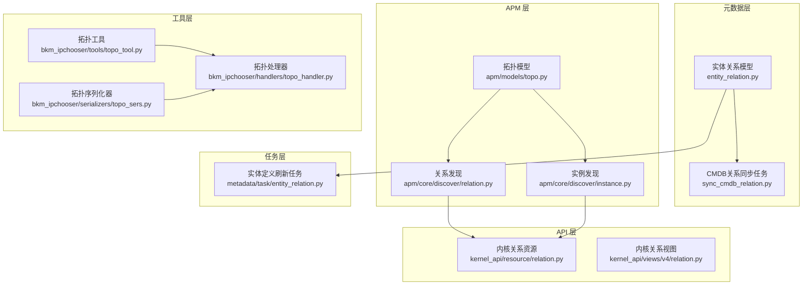
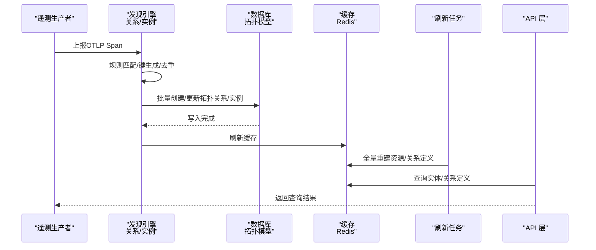
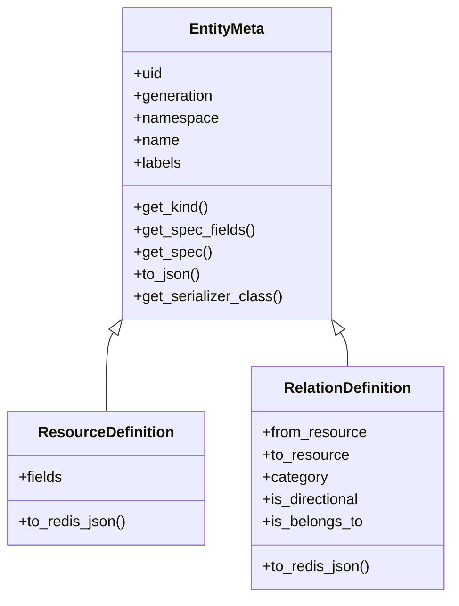
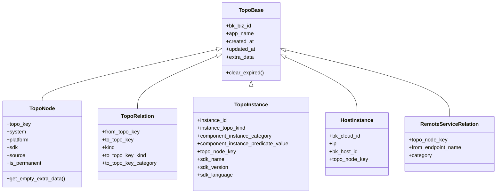
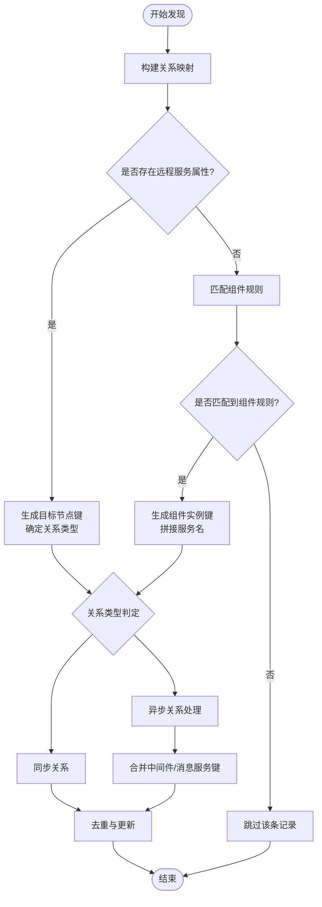
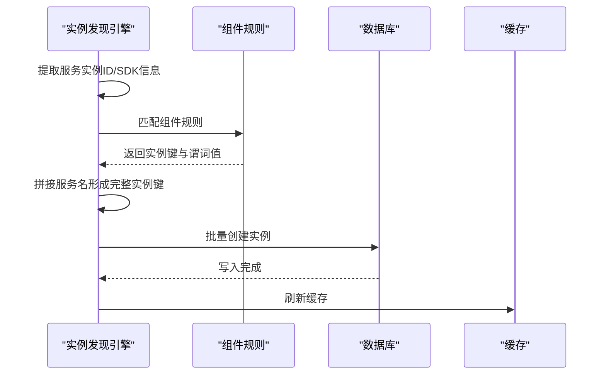
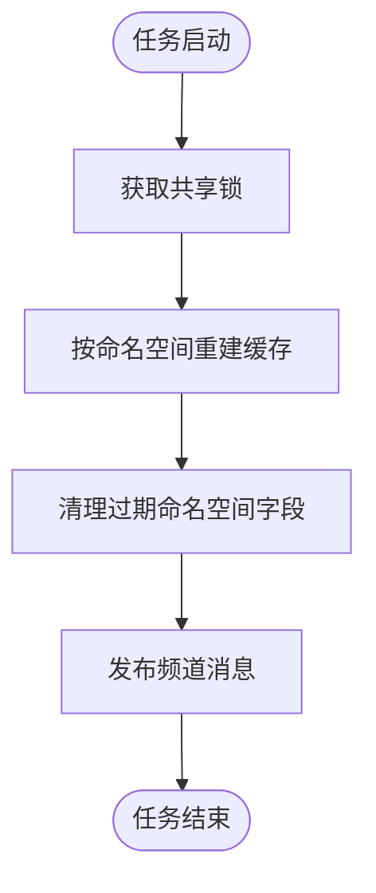
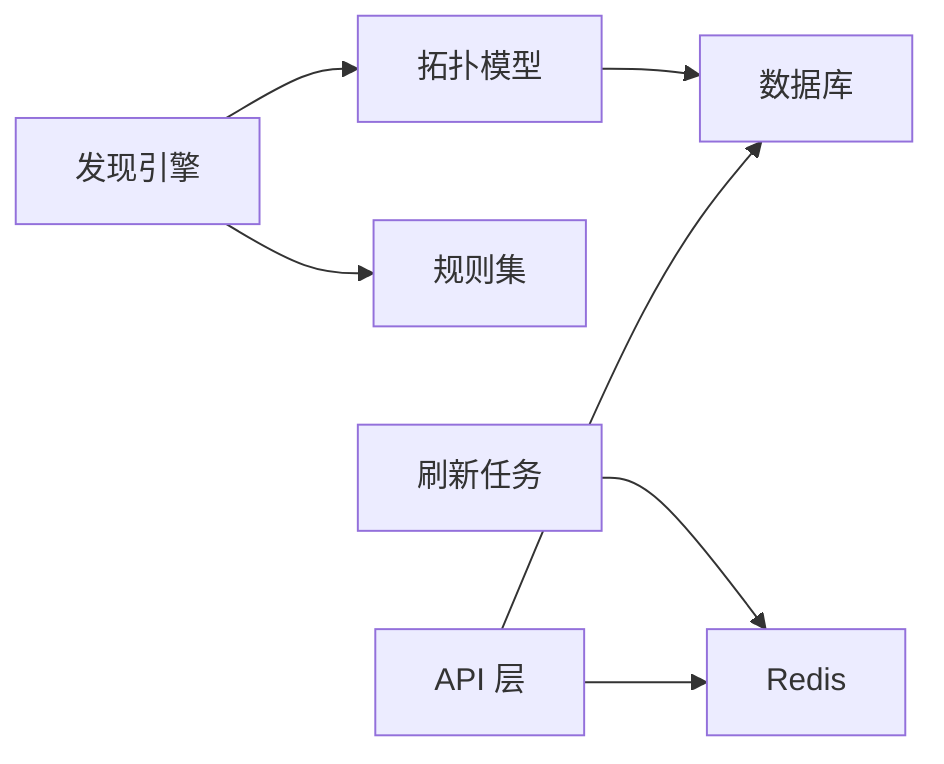

# 实体关系服务

<cite>
**本文引用的文件**
- [entity_relation.py](file://bkmonitor/metadata/models/entity_relation.py)
- [topo.py](file://bkmonitor/apm/models/topo.py)
- [relation.py](file://bkmonitor/apm/core/discover/relation.py)
- [instance.py](file://bkmonitor/apm/core/discover/instance.py)
- [entity_relation.py](file://bkmonitor/metadata/task/entity_relation.py)
- [sync_cmdb_relation.py](file://bkmonitor/metadata/task/sync_cmdb_relation.py)
- [relation.py](file://bkmonitor/kernel_api/resource/relation.py)
- [relation.py](file://bkmonitor/kernel_api/views/v4/relation.py)
- [topo.py](file://bkmonitor/bkm_ipchooser/tools/topo_tool.py)
- [topo_handler.py](file://bkmonitor/bkm_ipchooser/handlers/topo_handler.py)
- [topo_sers.py](file://bkmonitor/bkm_ipchooser/serializers/topo_sers.py)
</cite>

## 目录
1. [简介](#简介)
2. [项目结构](#项目结构)
3. [核心组件](#核心组件)
4. [架构总览](#架构总览)
5. [详细组件分析](#详细组件分析)
6. [依赖分析](#依赖分析)
7. [性能考虑](#性能考虑)
8. [故障排查指南](#故障排查指南)
9. [结论](#结论)
10. [附录](#附录)

## 简介
本技术文档围绕“实体关系管理服务”展开，系统性阐述监控系统中实体类型定义、关系映射与层级结构管理，以及实体关系的自动发现、手动配置与冲突解决策略。文档还覆盖缓存优化、批量操作与一致性保障机制，帮助读者全面理解实体关系在监控平台中的建模、发现与查询流程。

## 项目结构
实体关系服务横跨多个模块：
- 元数据层：定义实体类型、关系类型及持久化模型
- APM 层：拓扑节点、关系与实例的自动发现与落库
- 任务层：实体定义与关系数据的缓存同步与兜底刷新
- API 层：对外提供实体关系查询与接入能力
- 工具层：拓扑工具与序列化器，支撑上层查询与配置

图表来源
- [entity_relation.py:144-253](file://bkmonitor/metadata/models/entity_relation.py#L144-L253)
- [topo.py:55-143](file://bkmonitor/apm/models/topo.py#L55-L143)
- [relation.py:26-331](file://bkmonitor/apm/core/discover/relation.py#L26-L331)
- [instance.py:25-174](file://bkmonitor/apm/core/discover/instance.py#L25-L174)
- [entity_relation.py:25-104](file://bkmonitor/metadata/task/entity_relation.py#L25-L104)
- [sync_cmdb_relation.py:37-193](file://bkmonitor/metadata/task/sync_cmdb_relation.py#L37-L193)
- [relation.py](file://bkmonitor/kernel_api/resource/relation.py)
- [relation.py](file://bkmonitor/kernel_api/views/v4/relation.py)
- [topo_tool.py](file://bkmonitor/bkm_ipchooser/tools/topo_tool.py)
- [topo_handler.py](file://bkmonitor/bkm_ipchooser/handlers/topo_handler.py)
- [topo_sers.py](file://bkmonitor/bkm_ipchooser/serializers/topo_sers.py)

章节来源
- [entity_relation.py:144-253](file://bkmonitor/metadata/models/entity_relation.py#L144-L253)
- [topo.py:55-143](file://bkmonitor/apm/models/topo.py#L55-L143)
- [relation.py:26-331](file://bkmonitor/apm/core/discover/relation.py#L26-L331)
- [instance.py:25-174](file://bkmonitor/apm/core/discover/instance.py#L25-L174)
- [entity_relation.py:25-104](file://bkmonitor/metadata/task/entity_relation.py#L25-L104)
- [sync_cmdb_relation.py:37-193](file://bkmonitor/metadata/task/sync_cmdb_relation.py#L37-L193)
- [relation.py](file://bkmonitor/kernel_api/resource/relation.py)
- [relation.py](file://bkmonitor/kernel_api/views/v4/relation.py)
- [topo_tool.py](file://bkmonitor/bkm_ipchooser/tools/topo_tool.py)
- [topo_handler.py](file://bkmonitor/bkm_ipchooser/handlers/topo_handler.py)
- [topo_sers.py](file://bkmonitor/bkm_ipchooser/serializers/topo_sers.py)

## 核心组件
- 实体元数据与定义
  - 实体元数据基类统一管理命名空间、名称、UID、代际号与标签，并提供序列化与规格提取能力
  - 资源类型定义：描述资源字段结构，支持 Redis 缓存格式输出
  - 关系类型定义：描述源/目标资源、类别（静态/动态）、方向性与归属关系标记
- 拓扑模型
  - 拓扑节点、关系与实例模型，承载自动发现结果与层级结构
- 自动发现引擎
  - 关系发现：基于 OTLP Span 的父子关系、组件规则与远程服务识别，生成去重后的创建/更新集合
  - 实例发现：基于服务实例 ID 与组件规则，生成实例键并批量入库
- 缓存与同步
  - 全量刷新任务：兜底重建 Redis 中的资源/关系定义缓存，并通过发布订阅通知消费者
  - CMDB 内置关系同步：按命名空间与业务维度同步内置关系数据，保证一致性

章节来源
- [entity_relation.py:23-127](file://bkmonitor/metadata/models/entity_relation.py#L23-L127)
- [entity_relation.py:144-253](file://bkmonitor/metadata/models/entity_relation.py#L144-L253)
- [topo.py:55-143](file://bkmonitor/apm/models/topo.py#L55-L143)
- [relation.py:26-331](file://bkmonitor/apm/core/discover/relation.py#L26-L331)
- [instance.py:25-174](file://bkmonitor/apm/core/discover/instance.py#L25-L174)
- [entity_relation.py:25-104](file://bkmonitor/metadata/task/entity_relation.py#L25-L104)
- [sync_cmdb_relation.py:37-193](file://bkmonitor/metadata/task/sync_cmdb_relation.py#L37-L193)

## 架构总览
实体关系服务采用“定义-发现-落库-缓存-查询”的闭环架构：
- 定义阶段：资源/关系定义由元数据模型承载，支持命名空间隔离与版本代际追踪
- 发现阶段：APM 自动发现引擎解析遥测数据，生成拓扑节点、关系与实例
- 落库阶段：批量写入数据库，结合缓存类型进行增量刷新
- 缓存阶段：全量刷新任务与发布订阅机制，确保消费者侧缓存一致性
- 查询阶段：API 层提供关系查询与接入能力，工具层提供拓扑工具与序列化器

图表来源
- [relation.py:273-331](file://bkmonitor/apm/core/discover/relation.py#L273-L331)
- [instance.py:76-174](file://bkmonitor/apm/core/discover/instance.py#L76-L174)
- [entity_relation.py:25-104](file://bkmonitor/metadata/task/entity_relation.py#L25-L104)
- [topo.py:55-143](file://bkmonitor/apm/models/topo.py#L55-L143)

## 详细组件分析

### 实体元数据与定义模型
- 实体元数据基类
  - 统一字段：命名空间、名称、UID、代际号、标签；提供规格字段提取与 JSON 序列化
  - 唯一约束：命名空间+名称组合唯一，空命名空间归一化为全局占位
- 资源类型定义
  - 字段定义列表：包含 namespace、name、required 等，支持 Redis 缓存格式输出
- 关系类型定义
  - 支持静态/动态两类，可声明方向性与归属关系，便于查询与展示

图表来源
- [entity_relation.py:23-127](file://bkmonitor/metadata/models/entity_relation.py#L23-L127)
- [entity_relation.py:144-253](file://bkmonitor/metadata/models/entity_relation.py#L144-L253)

章节来源
- [entity_relation.py:23-127](file://bkmonitor/metadata/models/entity_relation.py#L23-L127)
- [entity_relation.py:144-253](file://bkmonitor/metadata/models/entity_relation.py#L144-L253)

### 拓扑模型与层级结构
- 拓扑节点
  - 存储节点键、系统/平台/SDK信息、来源数据源、是否永久保存等
  - 提供空 extra_data 默认值，兼容不同数据源
- 拓扑关系
  - 表达节点间关系，区分同步/异步两类，记录目标节点类型与分类
- 拓扑实例
  - 实例 ID、实例类型、组件分类与谓词值、所属节点键、SDK 信息
- 主机实例与远程服务关系
  - 主机实例与远程服务关系扩展，支持接口名与分类

图表来源
- [topo.py:23-143](file://bkmonitor/apm/models/topo.py#L23-L143)

章节来源
- [topo.py:23-143](file://bkmonitor/apm/models/topo.py#L23-L143)

### 关系自动发现与冲突解决
- 关系映射
  - 基于 Span 的父子关系与种类，构建“from-to”映射，优先采用父 Span 的关系类型
- 规则匹配
  - 远程服务：当存在远端服务属性时，生成目标节点键并确定关系类型
  - 组件类：根据组件规则匹配实例键，拼接服务名形成完整实例键
- 异步关系处理
  - 识别中间件与消息队列，生成“中间件-消息服务”或“中间件-中间件”关系
- 冲突解决
  - 通过业务唯一键（from/to/类型/目标节点类型/分类）去重，优先保留最新更新时间
  - 对重复记录进行合并与更新，避免重复创建

图表来源
- [relation.py:69-160](file://bkmonitor/apm/core/discover/relation.py#L69-L160)
- [relation.py:165-240](file://bkmonitor/apm/core/discover/relation.py#L165-L240)
- [relation.py:273-331](file://bkmonitor/apm/core/discover/relation.py#L273-L331)

章节来源
- [relation.py:26-331](file://bkmonitor/apm/core/discover/relation.py#L26-L331)

### 实例自动发现与批量写入
- 服务实例
  - 通过资源字段提取实例 ID，结合服务名与 SDK 信息生成服务实例键
- 组件实例
  - 基于组件规则生成实例键与谓词值，拼接服务名形成完整实例键
- 批量写入
  - 生成待创建实例集合，使用批量插入减少数据库往返
  - 结合缓存类型进行增量刷新，降低查询延迟

图表来源
- [instance.py:76-174](file://bkmonitor/apm/core/discover/instance.py#L76-L174)

章节来源
- [instance.py:25-174](file://bkmonitor/apm/core/discover/instance.py#L25-L174)

### 缓存优化与一致性保障
- 全量刷新任务
  - 按命名空间分组重建 Redis 缓存，清理过期命名空间字段，发布频道消息通知消费者
- 锁机制与幂等
  - 使用共享锁避免并发刷新导致的资源竞争
- 事务与原子性
  - 在 CMDB 同步任务中使用事务，确保数据源与结果表的一致性
- 过期清理
  - 拓扑节点提供过期清理逻辑，结合应用保留周期控制数据规模

图表来源
- [entity_relation.py:25-104](file://bkmonitor/metadata/task/entity_relation.py#L25-L104)
- [sync_cmdb_relation.py:134-175](file://bkmonitor/metadata/task/sync_cmdb_relation.py#L134-L175)

章节来源
- [entity_relation.py:25-104](file://bkmonitor/metadata/task/entity_relation.py#L25-L104)
- [sync_cmdb_relation.py:37-193](file://bkmonitor/metadata/task/sync_cmdb_relation.py#L37-L193)
- [topo.py:38-53](file://bkmonitor/apm/models/topo.py#L38-L53)

### 手动配置与冲突解决策略
- 手动配置入口
  - 通过资源/关系定义模型进行手动配置，支持静态/动态关系与方向性声明
- 冲突解决
  - 业务唯一键去重：from/to/类型/目标节点类型/分类构成唯一键
  - 更新策略：保留最新更新时间，避免旧数据覆盖
- 可观测性
  - 通过指标与日志记录任务状态与耗时，便于问题定位

章节来源
- [entity_relation.py:188-253](file://bkmonitor/metadata/models/entity_relation.py#L188-L253)
- [relation.py:58-68](file://bkmonitor/apm/core/discover/relation.py#L58-L68)
- [relation.py:286-311](file://bkmonitor/apm/core/discover/relation.py#L286-L311)

### 查询与接入能力
- 内核关系资源与视图
  - 提供关系查询接口，支持按命名空间与资源类型检索
- 拓扑工具与序列化器
  - 提供拓扑查询与转换工具，配合序列化器进行参数校验与输出

章节来源
- [relation.py](file://bkmonitor/kernel_api/resource/relation.py)
- [relation.py](file://bkmonitor/kernel_api/views/v4/relation.py)
- [topo_tool.py](file://bkmonitor/bkm_ipchooser/tools/topo_tool.py)
- [topo_handler.py](file://bkmonitor/bkm_ipchooser/handlers/topo_handler.py)
- [topo_sers.py](file://bkmonitor/bkm_ipchooser/serializers/topo_sers.py)

## 依赖分析
- 组件耦合
  - 发现引擎依赖拓扑模型与规则集，输出批量写入数据库
  - 刷新任务依赖 Redis 工具与指标系统，保障缓存一致性
  - API 层依赖缓存与序列化器，提供稳定查询接口
- 外部依赖
  - Redis：缓存资源/关系定义与发布订阅
  - 指标系统：任务状态与耗时统计
  - 数据库：拓扑关系与实例持久化

图表来源
- [relation.py:26-331](file://bkmonitor/apm/core/discover/relation.py#L26-L331)
- [instance.py:25-174](file://bkmonitor/apm/core/discover/instance.py#L25-L174)
- [entity_relation.py:25-104](file://bkmonitor/metadata/task/entity_relation.py#L25-L104)

章节来源
- [relation.py:26-331](file://bkmonitor/apm/core/discover/relation.py#L26-L331)
- [instance.py:25-174](file://bkmonitor/apm/core/discover/instance.py#L25-L174)
- [entity_relation.py:25-104](file://bkmonitor/metadata/task/entity_relation.py#L25-L104)

## 性能考虑
- 批量写入
  - 关系与实例发现均采用批量创建，减少数据库往返开销
- 缓存类型
  - 使用缓存类型常量与装饰器，结合增量刷新策略，降低查询延迟
- 去重与合并
  - 通过业务唯一键去重，避免重复写入与查询抖动
- 过期清理
  - 拓扑节点提供过期清理逻辑，结合应用保留周期控制数据规模

章节来源
- [relation.py:312-331](file://bkmonitor/apm/core/discover/relation.py#L312-L331)
- [instance.py:151-174](file://bkmonitor/apm/core/discover/instance.py#L151-L174)
- [topo.py:38-53](file://bkmonitor/apm/models/topo.py#L38-L53)

## 故障排查指南
- 缓存不一致
  - 检查刷新任务是否执行成功，确认 Redis 中键前缀与命名空间是否正确
  - 查看任务日志与指标，定位耗时异常的任务
- 写入失败
  - 关注批量创建异常与事务回滚日志，检查规则匹配与实例键生成
- 查询异常
  - 核对 API 请求参数与命名空间，确认序列化器校验是否通过
- 过期数据
  - 检查拓扑节点过期清理逻辑与应用保留周期配置

章节来源
- [entity_relation.py:92-104](file://bkmonitor/metadata/task/entity_relation.py#L92-L104)
- [sync_cmdb_relation.py:176-193](file://bkmonitor/metadata/task/sync_cmdb_relation.py#L176-L193)
- [relation.py:312-331](file://bkmonitor/apm/core/discover/relation.py#L312-L331)
- [instance.py:151-174](file://bkmonitor/apm/core/discover/instance.py#L151-L174)

## 结论
实体关系服务通过“定义-发现-落库-缓存-查询”的闭环，实现了监控系统中实体类型与关系的自动化管理。借助批量写入、缓存优化与一致性保障机制，系统在高并发场景下仍能保持稳定与高效。手动配置与冲突解决策略进一步增强了灵活性与可靠性，满足复杂业务场景下的实体关系治理需求。

## 附录
- 关键流程参考
  - 关系发现流程：[关系发现实现:273-331](file://bkmonitor/apm/core/discover/relation.py#L273-L331)
  - 实例发现流程：[实例发现实现:76-174](file://bkmonitor/apm/core/discover/instance.py#L76-L174)
  - 全量刷新任务：[实体定义刷新:25-104](file://bkmonitor/metadata/task/entity_relation.py#L25-L104)
  - CMDB 同步任务：[内置关系同步:37-193](file://bkmonitor/metadata/task/sync_cmdb_relation.py#L37-L193)
- 查询与接入
  - 内核关系资源：[关系资源](file://bkmonitor/kernel_api/resource/relation.py)
  - 内核关系视图：[关系视图](file://bkmonitor/kernel_api/views/v4/relation.py)
  - 拓扑工具与序列化器：[拓扑工具](file://bkmonitor/bkm_ipchooser/tools/topo_tool.py)、[拓扑处理器](file://bkmonitor/bkm_ipchooser/handlers/topo_handler.py)、[拓扑序列化器](file://bkmonitor/bkm_ipchooser/serializers/topo_sers.py)