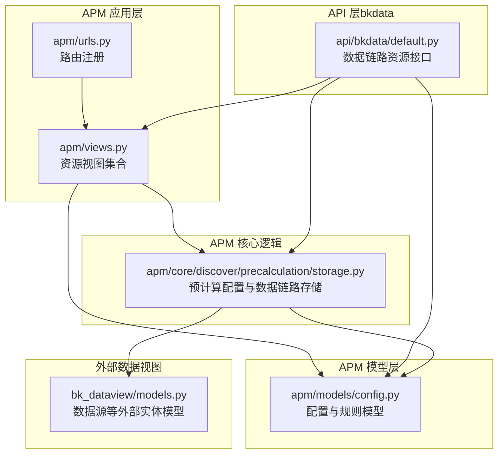
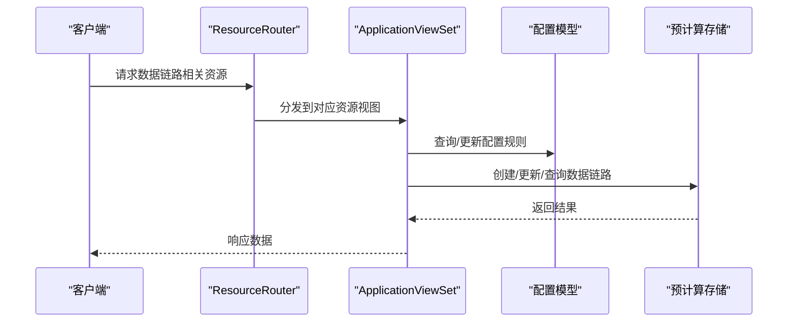
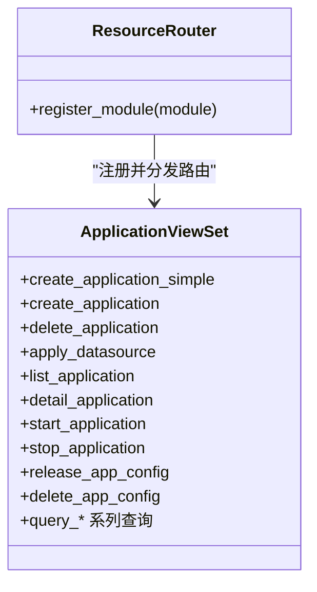
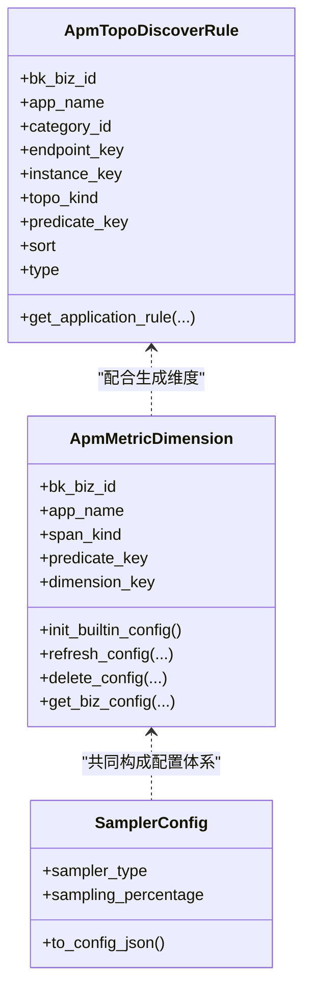
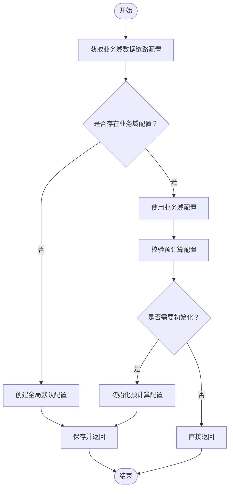
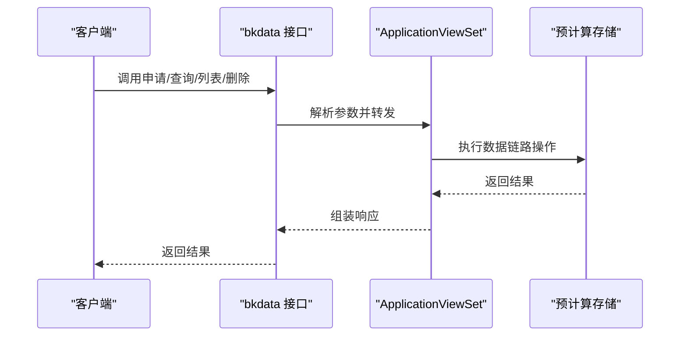
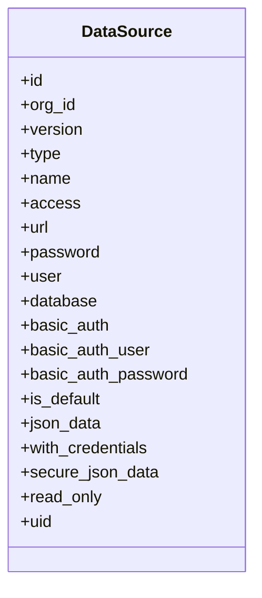
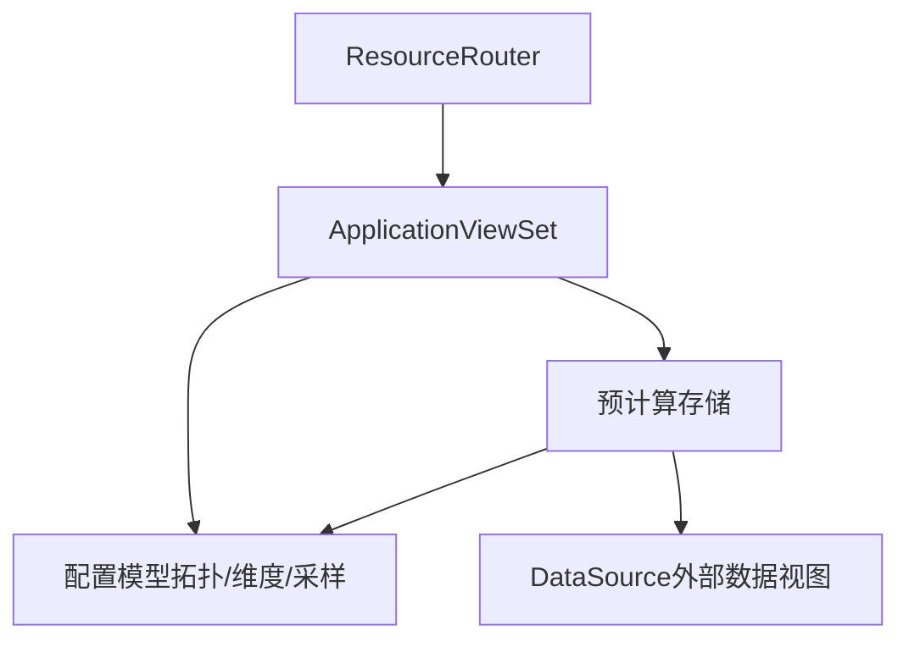

# 数据链路操作服务

<cite>
**本文引用的文件**
- [apm/views.py](file://bkmonitor/apm/views.py)
- [apm/urls.py](file://bkmonitor/apm/urls.py)
- [apm/models/config.py](file://bkmonitor/apm/models/config.py)
- [apm/core/discover/precalculation/storage.py](file://bkmonitor/apm/core/discover/precalculation/storage.py)
- [apm/admin.py](file://bkmonitor/apm/admin.py)
- [api/bkdata/default.py](file://bkmonitor/api/bkdata/default.py)
- [bk_dataview/models.py](file://bkmonitor/bk_dataview/models.py)
</cite>

## 目录
1. [简介](#简介)
2. [项目结构](#项目结构)
3. [核心组件](#核心组件)
4. [架构总览](#架构总览)
5. [详细组件分析](#详细组件分析)
6. [依赖分析](#依赖分析)
7. [性能考虑](#性能考虑)
8. [故障排查指南](#故障排查指南)
9. [结论](#结论)
10. [附录](#附录)

## 简介
本技术文档聚焦于“数据链路操作服务”，围绕数据链路的创建、修改、删除与查询等核心能力，系统阐述其在监控平台中的实现方式与运行机制。重点包括：
- 数据链路与存储后端的绑定关系
- 传输配置与路由规则
- 状态管理、健康检查与故障恢复
- 权限控制、审计日志与性能优化策略

文档以实际源码为依据，结合架构图与流程图，帮助读者快速理解并高效运维该能力。

## 项目结构
数据链路能力主要分布在以下模块：
- APM 应用层：提供资源路由与视图集合，承载数据链路相关接口
- APM 模型层：定义拓扑发现规则、指标维度、采样配置等核心模型
- APM 核心逻辑：预计算配置与数据链路对象的持久化与检索
- API 层（bkdata）：对外暴露数据链路的申请、查询、列表与删除接口
- 外部数据视图（bk_dataview）：提供数据源等外部实体模型支撑

图表来源
- [apm/views.py:1-142](file://bkmonitor/apm/views.py#L1-L142)
- [apm/urls.py:16-21](file://bkmonitor/apm/urls.py#L16-L21)
- [apm/models/config.py:1-800](file://bkmonitor/apm/models/config.py#L1-L800)
- [apm/core/discover/precalculation/storage.py:141-185](file://bkmonitor/apm/core/discover/precalculation/storage.py#L141-L185)
- [api/bkdata/default.py:1159-1206](file://bkmonitor/api/bkdata/default.py#L1159-L1206)
- [bk_dataview/models.py:97-128](file://bkmonitor/bk_dataview/models.py#L97-L128)

章节来源
- [apm/views.py:70-123](file://bkmonitor/apm/views.py#L70-L123)
- [apm/urls.py:16-21](file://bkmonitor/apm/urls.py#L16-L21)

## 核心组件
- 资源视图集合：通过 ResourceViewSet 将数据链路相关接口统一注册到路由系统，便于集中管理与扩展
- 配置与规则模型：包含拓扑发现规则、指标维度、采样配置等，支撑数据链路的传输与路由行为
- 预计算配置存储：负责数据链路对象的创建、更新与查询，并与全局/业务域配置联动
- 对外接口：提供数据链路的申请、查询、列表与删除等 API，面向上层业务与工具使用

章节来源
- [apm/views.py:70-123](file://bkmonitor/apm/views.py#L70-L123)
- [apm/models/config.py:36-251](file://bkmonitor/apm/models/config.py#L36-L251)
- [apm/core/discover/precalculation/storage.py:141-185](file://bkmonitor/apm/core/discover/precalculation/storage.py#L141-L185)
- [api/bkdata/default.py:1159-1206](file://bkmonitor/api/bkdata/default.py#L1159-L1206)

## 架构总览
数据链路操作服务采用“路由-视图-模型-存储”的分层架构：
- 路由层：通过 ResourceRouter 注册 APM 视图集合，统一暴露 REST 风格接口
- 视图层：ResourceViewSet 定义各资源端点，如应用、拓扑、配置等
- 模型层：配置类模型负责规则与维度的持久化与检索
- 存储层：预计算配置与数据链路对象协同工作，支持全局与业务域配置

图表来源
- [apm/urls.py:16-21](file://bkmonitor/apm/urls.py#L16-L21)
- [apm/views.py:76-123](file://bkmonitor/apm/views.py#L76-L123)
- [apm/models/config.py:36-251](file://bkmonitor/apm/models/config.py#L36-L251)
- [apm/core/discover/precalculation/storage.py:141-185](file://bkmonitor/apm/core/discover/precalculation/storage.py#L141-L185)

## 详细组件分析

### 组件A：数据链路资源视图集合
- 职责：集中定义数据链路相关资源端点，包括应用生命周期、配置发布、拓扑查询等
- 关键点：
  - 使用 ResourceRoute 将 HTTP 方法与资源处理器绑定
  - 通过 ResourceRouter 注册到 Django URL 路由系统
- 影响范围：直接影响数据链路的创建、修改、删除与查询等操作入口

图表来源
- [apm/views.py:76-123](file://bkmonitor/apm/views.py#L76-L123)
- [apm/urls.py:16-21](file://bkmonitor/apm/urls.py#L16-L21)

章节来源
- [apm/views.py:70-123](file://bkmonitor/apm/views.py#L70-L123)
- [apm/urls.py:16-21](file://bkmonitor/apm/urls.py#L16-L21)

### 组件B：配置与规则模型
- 职责：定义数据链路的拓扑发现规则、指标维度、采样策略等
- 关键点：
  - 拓扑发现规则：支持类别、系统、平台、SDK 等多维度规则
  - 指标维度：区分服务端/客户端/生产者/消费者等不同 Span Kind 的维度集合
  - 采样配置：支持随机采样等策略
- 性能特性：提供内存缓存以降低频繁查询数据库的开销

图表来源
- [apm/models/config.py:36-251](file://bkmonitor/apm/models/config.py#L36-L251)
- [apm/models/config.py:471-591](file://bkmonitor/apm/models/config.py#L471-L591)
- [apm/models/config.py:734-746](file://bkmonitor/apm/models/config.py#L734-L746)

章节来源
- [apm/models/config.py:36-251](file://bkmonitor/apm/models/config.py#L36-L251)
- [apm/models/config.py:471-591](file://bkmonitor/apm/models/config.py#L471-L591)
- [apm/models/config.py:734-746](file://bkmonitor/apm/models/config.py#L734-L746)

### 组件C：预计算配置与数据链路存储
- 职责：封装数据链路对象的创建、更新与查询逻辑，并与全局/业务域配置联动
- 关键点：
  - 默认配置创建与回退：当业务域配置缺失时，自动回退到全局配置
  - 集合遍历与批量更新：支持对全量数据链路进行统一处理
- 与模型层的关系：依赖配置模型提供的规则与维度信息

图表来源
- [apm/core/discover/precalculation/storage.py:141-185](file://bkmonitor/apm/core/discover/precalculation/storage.py#L141-L185)

章节来源
- [apm/core/discover/precalculation/storage.py:141-185](file://bkmonitor/apm/core/discover/precalculation/storage.py#L141-L185)

### 组件D：对外数据链路接口（bkdata）
- 职责：提供数据链路的申请、查询、列表与删除等 API，供上层业务与工具调用
- 关键点：
  - 资源类命名规范：ApplyDataLink、GetDataLink、ListDataLink、DeleteDataLink
  - 与视图层的协作：通过 ResourceViewSet 提供的资源端点完成具体操作

图表来源
- [api/bkdata/default.py:1159-1206](file://bkmonitor/api/bkdata/default.py#L1159-L1206)
- [apm/views.py:76-123](file://bkmonitor/apm/views.py#L76-L123)
- [apm/core/discover/precalculation/storage.py:141-185](file://bkmonitor/apm/core/discover/precalculation/storage.py#L141-L185)

章节来源
- [api/bkdata/default.py:1159-1206](file://bkmonitor/api/bkdata/default.py#L1159-L1206)

### 组件E：外部数据视图（bk_dataview）
- 职责：提供数据源等外部实体模型，支撑数据链路与存储后端的绑定关系
- 关键点：
  - 数据源模型：包含类型、访问凭据、URL 等字段，用于与存储后端建立连接
  - 只读与安全字段：支持 basic auth、secure json data 等安全配置

图表来源
- [bk_dataview/models.py:97-128](file://bkmonitor/bk_dataview/models.py#L97-L128)

章节来源
- [bk_dataview/models.py:97-128](file://bkmonitor/bk_dataview/models.py#L97-L128)

## 依赖分析
- 路由与视图：ResourceRouter 依赖 ResourceViewSet 注册模块
- 视图与模型：视图层依赖配置模型进行规则与维度的读写
- 视图与存储：视图层通过预计算存储执行数据链路对象的创建/更新/查询
- 存储与模型：存储层依赖配置模型提供的规则与维度信息
- 存储与外部模型：存储层依赖外部数据视图模型（如数据源）进行后端绑定

图表来源
- [apm/urls.py:16-21](file://bkmonitor/apm/urls.py#L16-L21)
- [apm/views.py:76-123](file://bkmonitor/apm/views.py#L76-L123)
- [apm/models/config.py:36-251](file://bkmonitor/apm/models/config.py#L36-L251)
- [apm/core/discover/precalculation/storage.py:141-185](file://bkmonitor/apm/core/discover/precalculation/storage.py#L141-L185)
- [bk_dataview/models.py:97-128](file://bkmonitor/bk_dataview/models.py#L97-L128)

章节来源
- [apm/urls.py:16-21](file://bkmonitor/apm/urls.py#L16-L21)
- [apm/views.py:76-123](file://bkmonitor/apm/views.py#L76-L123)
- [apm/models/config.py:36-251](file://bkmonitor/apm/models/config.py#L36-L251)
- [apm/core/discover/precalculation/storage.py:141-185](file://bkmonitor/apm/core/discover/precalculation/storage.py#L141-L185)
- [bk_dataview/models.py:97-128](file://bkmonitor/bk_dataview/models.py#L97-L128)

## 性能考虑
- 内存缓存：拓扑发现规则采用本地内存缓存，减少数据库访问频率
- 批量操作：预计算存储支持批量创建与删除，降低数据库压力
- 配置初始化：内置配置一次性初始化，避免重复写入
- 读写分离：视图层与存储层解耦，便于横向扩展与缓存策略落地

章节来源
- [apm/models/config.py:233-251](file://bkmonitor/apm/models/config.py#L233-L251)
- [apm/core/discover/precalculation/storage.py:141-185](file://bkmonitor/apm/core/discover/precalculation/storage.py#L141-L185)

## 故障排查指南
- 数据链路创建失败
  - 检查业务域配置是否存在；若不存在，确认是否正确回退到全局配置
  - 校验预计算配置是否已初始化
- 查询异常
  - 确认 ResourceViewSet 的端点是否正确注册到路由
  - 检查配置模型的缓存是否过期或损坏
- 删除/更新不生效
  - 确认批量删除/更新逻辑是否覆盖到目标记录
  - 核对唯一键与过滤条件，避免误删或遗漏

章节来源
- [apm/core/discover/precalculation/storage.py:141-185](file://bkmonitor/apm/core/discover/precalculation/storage.py#L141-L185)
- [apm/views.py:76-123](file://bkmonitor/apm/views.py#L76-L123)
- [apm/models/config.py:233-251](file://bkmonitor/apm/models/config.py#L233-L251)

## 结论
数据链路操作服务通过清晰的分层架构与完善的配置体系，实现了从路由、视图、模型到存储的全链路闭环。其具备良好的扩展性与性能特征，能够满足复杂场景下的数据链路管理需求。建议在生产环境中结合缓存与批量操作策略，持续优化查询与写入性能，并完善权限控制与审计日志以保障安全与可追溯性。

## 附录
- 权限控制与审计日志
  - 建议在视图层引入权限装饰器与审计中间件，记录关键操作（创建/修改/删除/查询）的时间、用户与参数
- 健康检查与故障恢复
  - 在存储层增加心跳检测与重试机制，确保数据链路状态一致性
  - 对外接口增加熔断与降级策略，避免级联故障