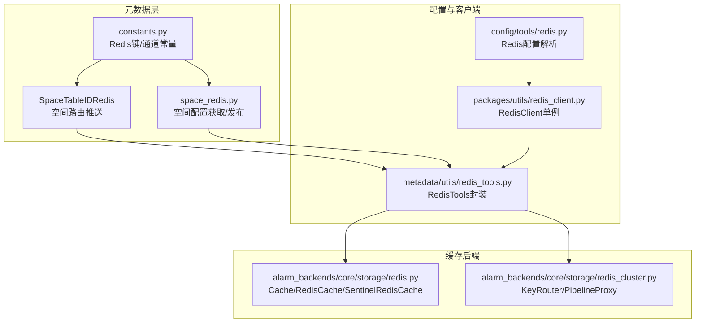
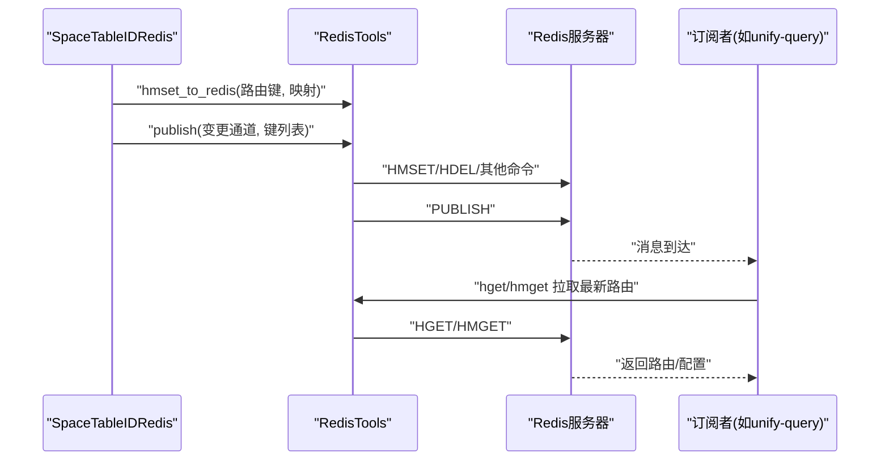
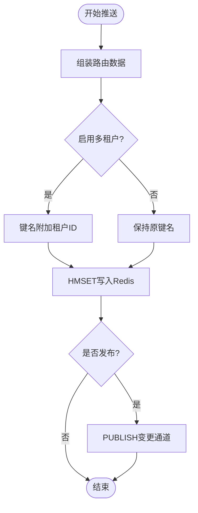
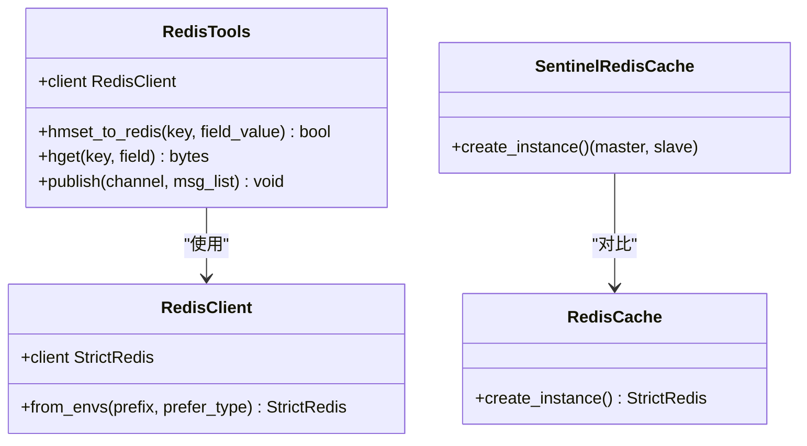
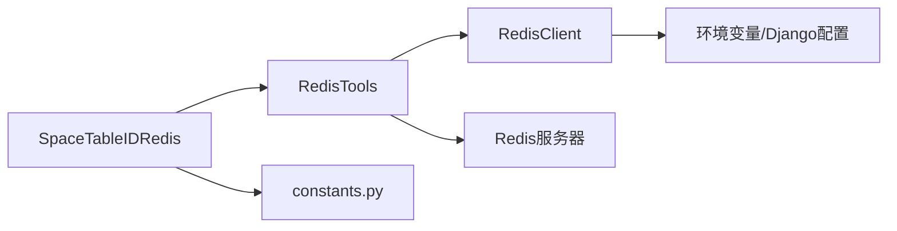

# 空间Redis服务

<cite>
**本文档引用的文件**
- [space_redis.py](file://bkmonitor/metadata/service/space_redis.py)
- [space_table_id_redis.py](file://bkmonitor/metadata/models/space/space_table_id_redis.py)
- [constants.py](file://bkmonitor/metadata/models/space/constants.py)
- [redis.py](file://bkmonitor/config/tools/redis.py)
- [redis_client.py](file://bkmonitor/packages/utils/redis_client.py)
- [redis_tools.py](file://bkmonitor/metadata/utils/redis_tools.py)
- [redis.py](file://bkmonitor/alarm_backends/core/storage/redis.py)
- [redis_cluster.py](file://bkmonitor/alarm_backends/core/storage/redis_cluster.py)
</cite>

## 目录
1. [简介](#简介)
2. [项目结构](#项目结构)
3. [核心组件](#核心组件)
4. [架构总览](#架构总览)
5. [详细组件分析](#详细组件分析)
6. [依赖分析](#依赖分析)
7. [性能考虑](#性能考虑)
8. [故障排查指南](#故障排查指南)
9. [结论](#结论)

## 简介
本技术文档面向“空间Redis管理服务”，聚焦于多租户场景下的空间路由与结果表元数据在Redis中的配置管理、连接池与客户端管理、缓存策略与一致性保障。文档详细阐述空间隔离机制、Redis集群配置与数据分区策略、高可用架构与故障切换、性能监控实现，以及空间配置的动态更新、缓存失效与一致性保证机制。

## 项目结构
围绕空间Redis服务的关键代码分布在以下模块：
- 元数据空间路由与推送：metadata/models/space/space_table_id_redis.py、metadata/service/space_redis.py
- Redis键空间与通道常量：metadata/models/space/constants.py
- Redis配置解析与客户端封装：config/tools/redis.py、packages/utils/redis_client.py、metadata/utils/redis_tools.py
- 缓存后端与集群路由：alarm_backends/core/storage/redis.py、alarm_backends/core/storage/redis_cluster.py

**图表来源**
- [space_table_id_redis.py:61-116](file://bkmonitor/metadata/models/space/space_table_id_redis.py#L61-L116)
- [space_redis.py:34-42](file://bkmonitor/metadata/service/space_redis.py#L34-L42)
- [constants.py:61-91](file://bkmonitor/metadata/models/space/constants.py#L61-L91)
- [redis.py:20-65](file://bkmonitor/config/tools/redis.py#L20-L65)
- [redis_client.py:35-85](file://bkmonitor/packages/utils/redis_client.py#L35-L85)
- [redis_tools.py:23-134](file://bkmonitor/metadata/utils/redis_tools.py#L23-L134)
- [redis.py:98-326](file://bkmonitor/alarm_backends/core/storage/redis.py#L98-L326)
- [redis_cluster.py:16-226](file://bkmonitor/alarm_backends/core/storage/redis_cluster.py#L16-L226)

**章节来源**
- [space_table_id_redis.py:61-116](file://bkmonitor/metadata/models/space/space_table_id_redis.py#L61-L116)
- [space_redis.py:34-42](file://bkmonitor/metadata/service/space_redis.py#L34-L42)
- [constants.py:61-91](file://bkmonitor/metadata/models/space/constants.py#L61-L91)
- [redis.py:20-65](file://bkmonitor/config/tools/redis.py#L20-L65)
- [redis_client.py:35-85](file://bkmonitor/packages/utils/redis_client.py#L35-L85)
- [redis_tools.py:23-134](file://bkmonitor/metadata/utils/redis_tools.py#L23-L134)
- [redis.py:98-326](file://bkmonitor/alarm_backends/core/storage/redis.py#L98-L326)
- [redis_cluster.py:16-226](file://bkmonitor/alarm_backends/core/storage/redis_cluster.py#L16-L226)

## 核心组件
- 空间路由推送器：SpaceTableIDRedis负责按空间类型与租户维度组装并推送空间-结果表映射、数据标签-结果表映射、结果表详情等至Redis，并通过发布订阅通知消费者。
- 空间配置获取器：提供从Redis读取空间配置的能力，支持多租户模式下的键拼接。
- Redis键空间与通道：集中定义空间路由、数据标签路由、结果表详情路由及其发布通道。
- Redis配置解析：根据运行角色与环境选择单实例或哨兵模式，解析主机、端口、密码、主节点名等。
- 客户端与工具：RedisClient单例封装，RedisTools统一提供HMSET/HGET/PUBLISH等常用操作。
- 缓存后端与集群路由：提供多种缓存后端类型与哨兵模式支持；通过KeyRouter与PipelineProxy实现按策略ID路由与管道化执行。

**章节来源**
- [space_table_id_redis.py:61-116](file://bkmonitor/metadata/models/space/space_table_id_redis.py#L61-L116)
- [space_redis.py:34-42](file://bkmonitor/metadata/service/space_redis.py#L34-L42)
- [constants.py:61-91](file://bkmonitor/metadata/models/space/constants.py#L61-L91)
- [redis.py:20-65](file://bkmonitor/config/tools/redis.py#L20-L65)
- [redis_client.py:35-85](file://bkmonitor/packages/utils/redis_client.py#L35-L85)
- [redis_tools.py:23-134](file://bkmonitor/metadata/utils/redis_tools.py#L23-L134)
- [redis.py:98-326](file://bkmonitor/alarm_backends/core/storage/redis.py#L98-L326)
- [redis_cluster.py:16-226](file://bkmonitor/alarm_backends/core/storage/redis_cluster.py#L16-L226)

## 架构总览
空间Redis服务采用“元数据推送 + 发布订阅”的解耦架构：
- 元数据侧：SpaceTableIDRedis与space_redis.py负责将空间路由、数据标签路由、结果表详情写入Redis哈希键，并通过通道发布变更消息。
- 消费侧：各服务监听相应通道，收到消息后拉取最新路由或配置。
- 连接侧：RedisTools封装底层连接，RedisClient提供单例与哨兵/单实例自动切换能力。
- 高可用：哨兵模式下，SentinelRedisCache自动发现主从并处理故障转移；单实例模式下，RedisCache提供基本连接能力。

**图表来源**
- [space_table_id_redis.py:103-115](file://bkmonitor/metadata/models/space/space_table_id_redis.py#L103-L115)
- [space_redis.py:34-42](file://bkmonitor/metadata/service/space_redis.py#L34-L42)
- [redis_tools.py:65-98](file://bkmonitor/metadata/utils/redis_tools.py#L65-L98)

**章节来源**
- [space_table_id_redis.py:103-115](file://bkmonitor/metadata/models/space/space_table_id_redis.py#L103-L115)
- [space_redis.py:34-42](file://bkmonitor/metadata/service/space_redis.py#L34-L42)
- [redis_tools.py:65-98](file://bkmonitor/metadata/utils/redis_tools.py#L65-L98)

## 详细组件分析

### 空间路由与结果表详情推送
- 空间路由推送：按空间类型与租户ID组装键名，写入空间-结果表映射，支持批量推送与发布。
- 数据标签路由推送：按数据标签聚合结果表ID列表，写入数据标签-结果表映射并发布。
- 结果表详情推送：ES/Doris/BkBase等存储类型分别组装详情，写入结果表详情键并发布。
- 多租户拼接：在启用多租户模式时，所有路由键均附加租户ID，确保跨租户隔离。

**图表来源**
- [space_table_id_redis.py:96-115](file://bkmonitor/metadata/models/space/space_table_id_redis.py#L96-L115)
- [space_table_id_redis.py:182-196](file://bkmonitor/metadata/models/space/space_table_id_redis.py#L182-L196)
- [space_table_id_redis.py:254-273](file://bkmonitor/metadata/models/space/space_table_id_redis.py#L254-L273)

**章节来源**
- [space_table_id_redis.py:67-115](file://bkmonitor/metadata/models/space/space_table_id_redis.py#L67-L115)
- [space_table_id_redis.py:135-198](file://bkmonitor/metadata/models/space/space_table_id_redis.py#L135-L198)
- [space_table_id_redis.py:200-281](file://bkmonitor/metadata/models/space/space_table_id_redis.py#L200-L281)
- [space_table_id_redis.py:322-395](file://bkmonitor/metadata/models/space/space_table_id_redis.py#L322-L395)
- [space_table_id_redis.py:509-617](file://bkmonitor/metadata/models/space/space_table_id_redis.py#L509-L617)

### Redis键空间与通道常量
- 空间路由键：SPACE_TO_RESULT_TABLE_KEY
- 数据标签路由键：DATA_LABEL_TO_RESULT_TABLE_KEY
- 结果表详情键：RESULT_TABLE_DETAIL_KEY
- 对应发布通道：SPACE_TO_RESULT_TABLE_CHANNEL、DATA_LABEL_TO_RESULT_TABLE_CHANNEL、RESULT_TABLE_DETAIL_CHANNEL
- 空间配置键：SPACE_REDIS_KEY
- 多租户拼接：键名中以“|租户ID”后缀区分不同租户

**章节来源**
- [constants.py:61-91](file://bkmonitor/metadata/models/space/constants.py#L61-L91)

### Redis配置解析与客户端
- 配置解析：根据运行角色与环境变量选择单实例或哨兵模式，解析主机、端口、密码、主节点名、哨兵密码。
- 客户端封装：RedisClient单例，支持从环境变量动态构造StrictRedis实例；哨兵模式下随机打散哨兵节点，提升可用性。
- 工具封装：RedisTools统一提供HMSET/HGET/PUBLISH等操作，具备重试初始化能力。

**图表来源**
- [redis_client.py:35-85](file://bkmonitor/packages/utils/redis_client.py#L35-L85)
- [redis_tools.py:23-134](file://bkmonitor/metadata/utils/redis_tools.py#L23-L134)
- [redis.py:245-291](file://bkmonitor/alarm_backends/core/storage/redis.py#L245-L291)
- [redis.py:223-243](file://bkmonitor/alarm_backends/core/storage/redis.py#L223-L243)

**章节来源**
- [redis.py:20-65](file://bkmonitor/config/tools/redis.py#L20-L65)
- [redis_client.py:35-85](file://bkmonitor/packages/utils/redis_client.py#L35-L85)
- [redis_tools.py:23-134](file://bkmonitor/metadata/utils/redis_tools.py#L23-L134)
- [redis.py:223-291](file://bkmonitor/alarm_backends/core/storage/redis.py#L223-L291)

### 缓存后端与集群路由
- 缓存后端类型：RedisCache（单实例）、SentinelRedisCache（哨兵）
- 连接配置：支持从环境变量解析哨兵/单实例参数，自动处理主从切换
- 集群路由：KeyRouterMixin按策略ID路由到具体节点；PipelineProxy支持跨节点管道化执行

**章节来源**
- [redis.py:98-326](file://bkmonitor/alarm_backends/core/storage/redis.py#L98-L326)
- [redis_cluster.py:16-226](file://bkmonitor/alarm_backends/core/storage/redis_cluster.py#L16-L226)

### 空间配置获取与一致性
- 配置获取：get_space_config_from_redis从SPACE_REDIS_KEY中按space_uid与table_id读取配置，返回JSON对象
- 一致性保障：通过发布订阅通道，消费者在收到变更后主动拉取最新配置，避免缓存不一致
- 多租户隔离：键名中包含租户ID，确保跨租户数据隔离

**章节来源**
- [space_redis.py:34-42](file://bkmonitor/metadata/service/space_redis.py#L34-L42)

## 依赖分析
- 组件耦合
  - SpaceTableIDRedis依赖RedisTools进行HMSET/PUBLISH；依赖常量定义键空间与通道
  - RedisTools依赖RedisClient；RedisClient依赖环境变量与Django配置
  - 缓存后端与集群路由为通用基础设施，供上层服务复用
- 外部依赖
  - Redis服务器（单实例或哨兵）
  - Django配置与环境变量
- 循环依赖
  - 未见明显循环依赖；各模块职责清晰

**图表来源**
- [space_table_id_redis.py:103-115](file://bkmonitor/metadata/models/space/space_table_id_redis.py#L103-L115)
- [constants.py:61-91](file://bkmonitor/metadata/models/space/constants.py#L61-L91)
- [redis_tools.py:23-134](file://bkmonitor/metadata/utils/redis_tools.py#L23-L134)
- [redis_client.py:35-85](file://bkmonitor/packages/utils/redis_client.py#L35-L85)

**章节来源**
- [space_table_id_redis.py:103-115](file://bkmonitor/metadata/models/space/space_table_id_redis.py#L103-L115)
- [constants.py:61-91](file://bkmonitor/metadata/models/space/constants.py#L61-L91)
- [redis_tools.py:23-134](file://bkmonitor/metadata/utils/redis_tools.py#L23-L134)
- [redis_client.py:35-85](file://bkmonitor/packages/utils/redis_client.py#L35-L85)

## 性能考虑
- 连接池与单例
  - RedisClient为单例，减少连接开销；哨兵模式下随机打散哨兵节点，降低热点风险
- 管道化与批量操作
  - RedisTools提供批量HMSET/HMGET；在需要时可结合PipelineProxy进行跨节点管道化执行
- 键空间设计
  - 使用哈希键存储路由映射，便于增量更新与删除；通道发布实现低延迟通知
- 缓存后端选择
  - 生产环境建议使用哨兵模式提升可用性；单实例模式适用于开发或测试

[本节为通用性能建议，无需特定文件引用]

## 故障排查指南
- 连接失败
  - 检查环境变量与Redis配置是否正确；确认哨兵节点可达与主节点名一致
  - 查看RedisClient初始化日志与异常栈
- 发布失败
  - 确认通道名称与订阅者一致；检查RedisTools.publish异常处理逻辑
- 数据不一致
  - 确认消费者收到发布消息后是否及时拉取最新配置；核对键名拼接是否包含租户ID
- 键空间异常
  - 检查常量定义的键空间与通道是否匹配；核对多租户模式开关

**章节来源**
- [redis.py:20-65](file://bkmonitor/config/tools/redis.py#L20-L65)
- [redis_client.py:35-85](file://bkmonitor/packages/utils/redis_client.py#L35-L85)
- [redis_tools.py:48-57](file://bkmonitor/metadata/utils/redis_tools.py#L48-L57)
- [constants.py:61-91](file://bkmonitor/metadata/models/space/constants.py#L61-L91)

## 结论
空间Redis管理服务通过明确的键空间与发布订阅机制，实现了多租户场景下的空间路由与结果表元数据的高效管理。结合哨兵模式与单例客户端，系统在高可用与性能方面具备良好表现。通过动态更新与一致性保障机制，确保消费者能够及时获取最新配置，满足复杂监控场景下的空间隔离与数据分区需求。