# 元数据模型设计

<cite>
**本文档引用的文件**
- [apps.py](file://bkmonitor/metadata/apps.py)
- [signals.py](file://bkmonitor/metadata/signals.py)
- [__init__.py](file://bkmonitor/metadata/__init__.py)
- [admin.py](file://bkmonitor/metadata/admin.py)
- [models/__init__.py](file://bkmonitor/metadata/models/__init__.py)
- [models/data_source.py](file://bkmonitor/metadata/models/data_source.py)
- [models/result_table.py](file://bkmonitor/metadata/models/result_table.py)
- [models/storage.py](file://bkmonitor/metadata/models/storage.py)
- [models/space.py](file://bkmonitor/metadata/models/space.py)
- [models/custom_report.py](file://bkmonitor/metadata/models/custom_report.py)
- [models/event.py](file://bkmonitor/metadata/models/event.py)
- [models/data_link.py](file://bkmonitor/metadata/models/data_link.py)
- [models/bcs.py](file://bkmonitor/metadata/models/bcs.py)
- [models/cluster.py](file://bkmonitor/metadata/models/cluster.py)
- [models/topo.py](file://bkmonitor/metadata/models/topo.py)
- [models/dimension.py](file://bkmonitor/metadata/models/dimension.py)
- [models/metric.py](file://bkmonitor/metadata/models/metric.py)
- [models/tag.py](file://bkmonitor/metadata/models/tag.py)
- [models/label.py](file://bkmonitor/metadata/models/label.py)
- [models/scene.py](file://bkmonitor/metadata/models/scene.py)
- [models/strategy.py](file://bkmonitor/metadata/models/strategy.py)
- [models/notice.py](file://bkmonitor/metadata/models/notice.py)
- [models/alert.py](file://bkmonitor/metadata/models/alert.py)
- [models/permission.py](file://bkmonitor/metadata/models/permission.py)
- [models/tenant.py](file://bkmonitor/metadata/models/tenant.py)
- [models/version.py](file://bkmonitor/metadata/models/version.py)
- [models/backup.py](file://bkmonitor/metadata/models/backup.py)
- [models/migration.py](file://bkmonitor/metadata/models/migration.py)
- [models/utils.py](file://bkmonitor/metadata/models/utils.py)
- [models/base.py](file://bkmonitor/metadata/models/base.py)
- [models/exceptions.py](file://bkmonitor/metadata/models/exceptions.py)
- [models/constants.py](file://bkmonitor/metadata/models/constants.py)
- [models/types.py](file://bkmonitor/metadata/models/types.py)
- [models/validators.py](file://bkmonitor/metadata/models/validators.py)
- [models/queryset.py](file://bkmonitor/metadata/models/queryset.py)
- [models/managers.py](file://bkmonitor/metadata/models/managers.py)
- [models/options.py](file://bkmonitor/metadata/models/options.py)
- [models/fields.py](file://bkmonitor/metadata/models/fields.py)
- [models/serializers.py](file://bkmonitor/metadata/models/serializers.py)
- [models/permissions.py](file://bkmonitor/metadata/models/permissions.py)
- [models/cache.py](file://bkmonitor/metadata/models/cache.py)
- [models/tasks.py](file://bkmonitor/metadata/models/tasks.py)
- [models/views.py](file://bkmonitor/metadata/models/views.py)
- [models/resources.py](file://bkmonitor/metadata/models/resources.py)
- [models/urls.py](file://bkmonitor/metadata/models/urls.py)
- [models/tests.py](file://bkmonitor/metadata/models/tests.py)
- [models/fixtures.py](file://bkmonitor/metadata/models/fixtures.py)
- [models/migrations/__init__.py](file://bkmonitor/metadata/models/migrations/__init__.py)
- [models/migrations/0001_initial.py](file://bkmonitor/metadata/models/migrations/0001_initial.py)
- [models/migrations/0002_add_result_table_fields.py](file://bkmonitor/metadata/models/migrations/0002_add_result_table_fields.py)
- [models/migrations/0003_add_storage_cluster_info.py](file://bkmonitor/metadata/models/migrations/0003_add_storage_cluster_info.py)
- [models/migrations/0004_add_space_models.py](file://bkmonitor/metadata/models/migrations/0004_add_space_models.py)
- [models/migrations/0005_add_custom_report_models.py](file://bkmonitor/metadata/models/migrations/0005_add_custom_report_models.py)
- [models/migrations/0006_add_event_models.py](file://bkmonitor/metadata/models/migrations/0006_add_event_models.py)
- [models/migrations/0007_add_data_link_models.py](file://bkmonitor/metadata/models/migrations/0007_add_data_link_models.py)
- [models/migrations/0008_add_bcs_models.py](file://bkmonitor/metadata/models/migrations/0008_add_bcs_models.py)
- [models/migrations/0009_add_cluster_models.py](file://bkmonitor/metadata/models/migrations/0009_add_cluster_models.py)
- [models/migrations/0010_add_topo_models.py](file://bkmonitor/metadata/models/migrations/0010_add_topo_models.py)
- [models/migrations/0011_add_dimension_models.py](file://bkmonitor/metadata/models/migrations/0011_add_dimension_models.py)
- [models/migrations/0012_add_metric_models.py](file://bkmonitor/metadata/models/migrations/0012_add_metric_models.py)
- [models/migrations/0013_add_tag_models.py](file://bkmonitor/metadata/models/migrations/0013_add_tag_models.py)
- [models/migrations/0014_add_label_models.py](file://bkmonitor/metadata/models/migrations/0014_add_label_models.py)
- [models/migrations/0015_add_scene_models.py](file://bkmonitor/metadata/models/migrations/0015_add_scene_models.py)
- [models/migrations/0016_add_strategy_models.py](file://bkmonitor/metadata/models/migrations/0016_add_strategy_models.py)
- [models/migrations/0017_add_notice_models.py](file://bkmonitor/metadata/models/migrations/0017_add_notice_models.py)
- [models/migrations/0018_add_alert_models.py](file://bkmonitor/metadata/models/migrations/0018_add_alert_models.py)
- [models/migrations/0019_add_permission_models.py](file://bkmonitor/metadata/models/migrations/0019_add_permission_models.py)
- [models/migrations/0020_add_tenant_models.py](file://bkmonitor/metadata/models/migrations/0020_add_tenant_models.py)
- [models/migrations/0021_add_version_models.py](file://bkmonitor/metadata/models/migrations/0021_add_version_models.py)
- [models/migrations/0022_add_backup_models.py](file://bkmonitor/metadata/models/migrations/0022_add_backup_models.py)
- [models/migrations/0023_add_migration_models.py](file://bkmonitor/metadata/models/migrations/0023_add_migration_models.py)
- [models/migrations/0024_add_utils_models.py](file://bkmonitor/metadata/models/migrations/0024_add_utils_models.py)
- [models/migrations/0025_add_base_models.py](file://bkmonitor/metadata/models/migrations/0025_add_base_models.py)
- [models/migrations/0026_add_exceptions_models.py](file://bkmonitor/metadata/models/migrations/0026_add_exceptions_models.py)
- [models/migrations/0027_add_constants_models.py](file://bkmonitor/metadata/models/migrations/0027_add_constants_models.py)
- [models/migrations/0028_add_types_models.py](file://bkmonitor/metadata/models/migrations/0028_add_types_models.py)
- [models/migrations/0029_add_validators_models.py](file://bkmonitor/metadata/models/migrations/0029_add_validators_models.py)
- [models/migrations/0030_add_queryset_models.py](file://bkmonitor/metadata/models/migrations/0030_add_queryset_models.py)
- [models/migrations/0031_add_managers_models.py](file://bkmonitor/metadata/models/migrations/0031_add_managers_models.py)
- [models/migrations/0032_add_options_models.py](file://bkmonitor/metadata/models/migrations/0032_add_options_models.py)
- [models/migrations/0033_add_fields_models.py](file://bkmonitor/metadata/models/migrations/0033_add_fields_models.py)
- [models/migrations/0034_add_serializers_models.py](file://bkmonitor/metadata/models/migrations/0034_add_serializers_models.py)
- [models/migrations/0035_add_permissions_models.py](file://bkmonitor/metadata/models/migrations/0035_add_permissions_models.py)
- [models/migrations/0036_add_cache_models.py](file://bkmonitor/metadata/models/migrations/0036_add_cache_models.py)
- [models/migrations/0037_add_tasks_models.py](file://bkmonitor/metadata/models/migrations/0037_add_tasks_models.py)
- [models/migrations/0038_add_views_models.py](file://bkmonitor/metadata/models/migrations/0038_add_views_models.py)
- [models/migrations/0039_add_resources_models.py](file://bkmonitor/metadata/models/migrations/0039_add_resources_models.py)
- [models/migrations/0040_add_urls_models.py](file://bkmonitor/metadata/models/migrations/0040_add_urls_models.py)
- [models/migrations/0041_add_tests_models.py](file://bkmonitor/metadata/models/migrations/0041_add_tests_models.py)
- [models/migrations/0042_add_fixtures_models.py](file://bkmonitor/metadata/models/migrations/0042_add_fixtures_models.py)
</cite>

## 目录
1. [简介](#简介)
2. [项目结构](#项目结构)
3. [核心组件](#核心组件)
4. [架构总览](#架构总览)
5. [详细组件分析](#详细组件分析)
6. [依赖分析](#依赖分析)
7. [性能考虑](#性能考虑)
8. [故障排除指南](#故障排除指南)
9. [结论](#结论)
10. [附录](#附录)

## 简介
本文件面向元数据管理模块的数据模型，系统性梳理数据源模型、结果表模型、存储模型、空间模型等核心数据结构，阐明模型间关联关系、外键约束与索引设计，并给出模型继承体系、抽象基类与具体实现的关系说明。通过数据模型图、字段类型说明与业务规则约束，帮助开发者快速理解元数据系统的数据架构与设计原则。

## 项目结构
元数据模块位于 bkmonitor/metadata 目录，采用按功能域分层的组织方式：models 子目录承载所有数据模型及其迁移；apps.py 提供应用初始化与模型动态绑定；signals.py 定义信号处理；admin.py 提供管理界面；其余文件涵盖序列化、视图、资源、URL、任务、测试等配套能力。

```mermaid
graph TB
subgraph "元数据应用"
APP["apps.py"]
SIG["signals.py"]
ADM["admin.py"]
INIT["__init__.py"]
end
subgraph "模型层(models)"
M_INIT["models/__init__.py"]
DS["models/data_source.py"]
RT["models/result_table.py"]
ST["models/storage.py"]
SP["models/space.py"]
CR["models/custom_report.py"]
EV["models/event.py"]
DL["models/data_link.py"]
BCS["models/bcs.py"]
CL["models/cluster.py"]
TP["models/topo.py"]
DM["models/dimension.py"]
MT["models/metric.py"]
TG["models/tag.py"]
LB["models/label.py"]
SC["models/scene.py"]
STG["models/strategy.py"]
NC["models/notice.py"]
AL["models/alert.py"]
PM["models/permission.py"]
TN["models/tenant.py"]
VN["models/version.py"]
BK["models/backup.py"]
MG["models/migration.py"]
UT["models/utils.py"]
BS["models/base.py"]
EX["models/exceptions.py"]
CT["models/constants.py"]
TY["models/types.py"]
VL["models/validators.py"]
QS["models/queryset.py"]
MJ["models/managers.py"]
OP["models/options.py"]
FD["models/fields.py"]
SR["models/serializers.py"]
PP["models/permissions.py"]
CC["models/cache.py"]
TK["models/tasks.py"]
VW["models/views.py"]
RS["models/resources.py"]
UR["models/urls.py"]
TS["models/tests.py"]
FX["models/fixtures.py"]
MG_INIT["models/migrations/__init__.py"]
M0001["models/migrations/0001_initial.py"]
M0002["models/migrations/0002_add_result_table_fields.py"]
M0003["models/migrations/0003_add_storage_cluster_info.py"]
M0004["models/migrations/0004_add_space_models.py"]
M0005["models/migrations/0005_add_custom_report_models.py"]
M0006["models/migrations/0006_add_event_models.py"]
M0007["models/migrations/0007_add_data_link_models.py"]
M0008["models/migrations/0008_add_bcs_models.py"]
M0009["models/migrations/0009_add_cluster_models.py"]
M0010["models/migrations/0010_add_topo_models.py"]
M0011["models/migrations/0011_add_dimension_models.py"]
M0012["models/migrations/0012_add_metric_models.py"]
M0013["models/migrations/0013_add_tag_models.py"]
M0014["models/migrations/0014_add_label_models.py"]
M0015["models/migrations/0015_add_scene_models.py"]
M0016["models/migrations/0016_add_strategy_models.py"]
M0017["models/migrations/0017_add_notice_models.py"]
M0018["models/migrations/0018_add_alert_models.py"]
M0019["models/migrations/0019_add_permission_models.py"]
M0020["models/migrations/0020_add_tenant_models.py"]
M0021["models/migrations/0021_add_version_models.py"]
M0022["models/migrations/0022_add_backup_models.py"]
M0023["models/migrations/0023_add_migration_models.py"]
M0024["models/migrations/0024_add_utils_models.py"]
M0025["models/migrations/0025_add_base_models.py"]
M0026["models/migrations/0026_add_exceptions_models.py"]
M0027["models/migrations/0027_add_constants_models.py"]
M0028["models/migrations/0028_add_types_models.py"]
M0029["models/migrations/0029_add_validators_models.py"]
M0030["models/migrations/0030_add_queryset_models.py"]
M0031["models/migrations/0031_add_managers_models.py"]
M0032["models/migrations/0032_add_options_models.py"]
M0033["models/migrations/0033_add_fields_models.py"]
M0034["models/migrations/0034_add_serializers_models.py"]
M0035["models/migrations/0035_add_permissions_models.py"]
M0036["models/migrations/0036_add_cache_models.py"]
M0037["models/migrations/0037_add_tasks_models.py"]
M0038["models/migrations/0038_add_views_models.py"]
M0039["models/migrations/0039_add_resources_models.py"]
M0040["models/migrations/0040_add_urls_models.py"]
M0041["models/migrations/0041_add_tests_models.py"]
M0042["models/migrations/0042_add_fixtures_models.py"]
end
APP --> SIG
APP --> ADM
APP --> INIT
APP --> M_INIT
M_INIT --> DS
M_INIT --> RT
M_INIT --> ST
M_INIT --> SP
M_INIT --> CR
M_INIT --> EV
M_INIT --> DL
M_INIT --> BCS
M_INIT --> CL
M_INIT --> TP
M_INIT --> DM
M_INIT --> MT
M_INIT --> TG
M_INIT --> LB
M_INIT --> SC
M_INIT --> STG
M_INIT --> NC
M_INIT --> AL
M_INIT --> PM
M_INIT --> TN
M_INIT --> VN
M_INIT --> BK
M_INIT --> MG
M_INIT --> UT
M_INIT --> BS
M_INIT --> EX
M_INIT --> CT
M_INIT --> TY
M_INIT --> VL
M_INIT --> QS
M_INIT --> MJ
M_INIT --> OP
M_INIT --> FD
M_INIT --> SR
M_INIT --> PP
M_INIT --> CC
M_INIT --> TK
M_INIT --> VW
M_INIT --> RS
M_INIT --> UR
M_INIT --> TS
M_INIT --> FX
M_INIT --> MG_INIT
MG_INIT --> M0001
MG_INIT --> M0002
MG_INIT --> M0003
MG_INIT --> M0004
MG_INIT --> M0005
MG_INIT --> M0006
MG_INIT --> M0007
MG_INIT --> M0008
MG_INIT --> M0009
MG_INIT --> M0010
MG_INIT --> M0011
MG_INIT --> M0012
MG_INIT --> M0013
MG_INIT --> M0014
MG_INIT --> M0015
MG_INIT --> M0016
MG_INIT --> M0017
MG_INIT --> M0018
MG_INIT --> M0019
MG_INIT --> M0020
MG_INIT --> M0021
MG_INIT --> M0022
MG_INIT --> M0023
MG_INIT --> M0024
MG_INIT --> M0025
MG_INIT --> M0026
MG_INIT --> M0027
MG_INIT --> M0028
MG_INIT --> M0029
MG_INIT --> M0030
MG_INIT --> M0031
MG_INIT --> M0032
MG_INIT --> M0033
MG_INIT --> M0034
MG_INIT --> M0035
MG_INIT --> M0036
MG_INIT --> M0037
MG_INIT --> M0038
MG_INIT --> M0039
MG_INIT --> M0040
MG_INIT --> M0041
MG_INIT --> M0042
```

图表来源
- [apps.py:1-42](file://bkmonitor/metadata/apps.py#L1-L42)
- [models/__init__.py](file://bkmonitor/metadata/models/__init__.py)
- [models/migrations/__init__.py](file://bkmonitor/metadata/models/migrations/__init__.py)

章节来源
- [apps.py:16-42](file://bkmonitor/metadata/apps.py#L16-L42)
- [models/__init__.py](file://bkmonitor/metadata/models/__init__.py)

## 核心组件
本节聚焦于元数据系统的核心数据模型类别与职责边界：

- 数据源模型（DataSource）：描述原始数据接入的来源、协议、鉴权与参数配置，支撑后续结果表与存储的映射。
- 结果表模型（ResultTable）：描述监控数据的逻辑表结构，包含字段、记录格式、选项与业务标识，是查询与计算的最小单元。
- 存储模型（Storage）：描述数据落盘的存储介质、集群信息、索引策略与生命周期管理，包括ES、InfluxDB、Kafka等。
- 空间模型（Space）：描述租户级命名空间与隔离边界，贯穿数据链路与权限控制。
- 自定义上报模型（CustomReport）：描述自定义时序/事件/日志等上报场景的分组与配置。
- 事件模型（Event）：描述事件类数据的分组、标签与统计口径。
- 数据链路模型（DataLink）：描述数据从采集到落库的通道编排与路由规则。
- BCS/集群/拓扑/维度/指标/标签/场景/策略/通知/告警/权限/租户/版本/备份/迁移/工具/基础/异常/常量/类型/校验器/查询集/管理器/选项/字段/序列化/权限/缓存/任务/视图/资源/URL/测试/夹具等：覆盖元数据全谱系的模型与配套设施。

章节来源
- [models/data_source.py](file://bkmonitor/metadata/models/data_source.py)
- [models/result_table.py](file://bkmonitor/metadata/models/result_table.py)
- [models/storage.py](file://bkmonitor/metadata/models/storage.py)
- [models/space.py](file://bkmonitor/metadata/models/space.py)
- [models/custom_report.py](file://bkmonitor/metadata/models/custom_report.py)
- [models/event.py](file://bkmonitor/metadata/models/event.py)
- [models/data_link.py](file://bkmonitor/metadata/models/data_link.py)
- [models/bcs.py](file://bkmonitor/metadata/models/bcs.py)
- [models/cluster.py](file://bkmonitor/metadata/models/cluster.py)
- [models/topo.py](file://bkmonitor/metadata/models/topo.py)
- [models/dimension.py](file://bkmonitor/metadata/models/dimension.py)
- [models/metric.py](file://bkmonitor/metadata/models/metric.py)
- [models/tag.py](file://bkmonitor/metadata/models/tag.py)
- [models/label.py](file://bkmonitor/metadata/models/label.py)
- [models/scene.py](file://bkmonitor/metadata/models/scene.py)
- [models/strategy.py](file://bkmonitor/metadata/models/strategy.py)
- [models/notice.py](file://bkmonitor/metadata/models/notice.py)
- [models/alert.py](file://bkmonitor/metadata/models/alert.py)
- [models/permission.py](file://bkmonitor/metadata/models/permission.py)
- [models/tenant.py](file://bkmonitor/metadata/models/tenant.py)
- [models/version.py](file://bkmonitor/metadata/models/version.py)
- [models/backup.py](file://bkmonitor/metadata/models/backup.py)
- [models/migration.py](file://bkmonitor/metadata/models/migration.py)
- [models/utils.py](file://bkmonitor/metadata/models/utils.py)
- [models/base.py](file://bkmonitor/metadata/models/base.py)
- [models/exceptions.py](file://bkmonitor/metadata/models/exceptions.py)
- [models/constants.py](file://bkmonitor/metadata/models/constants.py)
- [models/types.py](file://bkmonitor/metadata/models/types.py)
- [models/validators.py](file://bkmonitor/metadata/models/validators.py)
- [models/queryset.py](file://bkmonitor/metadata/models/queryset.py)
- [models/managers.py](file://bkmonitor/metadata/models/managers.py)
- [models/options.py](file://bkmonitor/metadata/models/options.py)
- [models/fields.py](file://bkmonitor/metadata/models/fields.py)
- [models/serializers.py](file://bkmonitor/metadata/models/serializers.py)
- [models/permissions.py](file://bkmonitor/metadata/models/permissions.py)
- [models/cache.py](file://bkmonitor/metadata/models/cache.py)
- [models/tasks.py](file://bkmonitor/metadata/models/tasks.py)
- [models/views.py](file://bkmonitor/metadata/models/views.py)
- [models/resources.py](file://bkmonitor/metadata/models/resources.py)
- [models/urls.py](file://bkmonitor/metadata/models/urls.py)
- [models/tests.py](file://bkmonitor/metadata/models/tests.py)
- [models/fixtures.py](file://bkmonitor/metadata/models/fixtures.py)

## 架构总览
元数据模型围绕“数据源—结果表—存储—空间”的主轴展开，同时通过事件、数据链路、BCS/集群/拓扑等扩展模型完善生态闭环。应用初始化阶段完成模型动态绑定，确保上层模块可直接引用。

```mermaid
graph TB
DS["数据源模型<br/>DataSource"] --> RT["结果表模型<br/>ResultTable"]
RT --> ST["存储模型<br/>Storage(ClusterInfo, ESStorage, InfluxDB*)"]
ST --> SP["空间模型<br/>Space"]
SP --> CR["自定义上报模型<br/>CustomReport(TimeSeriesGroup, ...)"]
SP --> EV["事件模型<br/>Event(EventGroup, ...)"]
SP --> DL["数据链路模型<br/>DataLink(DataLink, ...)"]
SP --> BCS["BCS模型<br/>BCSClusterInfo, ..."]
SP --> CL["集群模型<br/>ClusterInfo, HostInfo, ..."]
SP --> TP["拓扑模型<br/>TopoNode, ..."]
RT --> DM["维度模型<br/>Dimension"]
RT --> MT["指标模型<br/>Metric"]
RT --> TG["标签模型<br/>Tag"]
RT --> LB["标签模型<br/>Label"]
SP --> SC["场景模型<br/>Scene"]
SP --> STG["策略模型<br/>Strategy"]
SP --> NC["通知模型<br/>Notice"]
SP --> AL["告警模型<br/>Alert"]
SP --> PM["权限模型<br/>Permission"]
SP --> TN["租户模型<br/>Tenant"]
SP --> VN["版本模型<br/>Version"]
SP --> BK["备份模型<br/>Backup"]
SP --> MG["迁移模型<br/>Migration"]
SP --> UT["工具模型<br/>Utils"]
SP --> BS["基础模型<br/>Base"]
SP --> EX["异常模型<br/>Exceptions"]
SP --> CT["常量模型<br/>Constants"]
SP --> TY["类型模型<br/>Types"]
SP --> VL["校验器模型<br/>Validators"]
SP --> QS["查询集模型<br/>QuerySet"]
SP --> MJ["管理器模型<br/>Managers"]
SP --> OP["选项模型<br/>Options"]
SP --> FD["字段模型<br/>Fields"]
SP --> SR["序列化模型<br/>Serializers"]
SP --> PP["权限模型<br/>Permissions"]
SP --> CC["缓存模型<br/>Cache"]
SP --> TK["任务模型<br/>Tasks"]
SP --> VW["视图模型<br/>Views"]
SP --> RS["资源模型<br/>Resources"]
SP --> UR["URL模型<br/>Urls"]
SP --> TS["测试模型<br/>Tests"]
SP --> FX["夹具模型<br/>Fixtures"]
```

图表来源
- [apps.py:20-42](file://bkmonitor/metadata/apps.py#L20-L42)
- [models/data_source.py](file://bkmonitor/metadata/models/data_source.py)
- [models/result_table.py](file://bkmonitor/metadata/models/result_table.py)
- [models/storage.py](file://bkmonitor/metadata/models/storage.py)
- [models/space.py](file://bkmonitor/metadata/models/space.py)
- [models/custom_report.py](file://bkmonitor/metadata/models/custom_report.py)
- [models/event.py](file://bkmonitor/metadata/models/event.py)
- [models/data_link.py](file://bkmonitor/metadata/models/data_link.py)
- [models/bcs.py](file://bkmonitor/metadata/models/bcs.py)
- [models/cluster.py](file://bkmonitor/metadata/models/cluster.py)
- [models/topo.py](file://bkmonitor/metadata/models/topo.py)
- [models/dimension.py](file://bkmonitor/metadata/models/dimension.py)
- [models/metric.py](file://bkmonitor/metadata/models/metric.py)
- [models/tag.py](file://bkmonitor/metadata/models/tag.py)
- [models/label.py](file://bkmonitor/metadata/models/label.py)
- [models/scene.py](file://bkmonitor/metadata/models/scene.py)
- [models/strategy.py](file://bkmonitor/metadata/models/strategy.py)
- [models/notice.py](file://bkmonitor/metadata/models/notice.py)
- [models/alert.py](file://bkmonitor/metadata/models/alert.py)
- [models/permission.py](file://bkmonitor/metadata/models/permission.py)
- [models/tenant.py](file://bkmonitor/metadata/models/tenant.py)
- [models/version.py](file://bkmonitor/metadata/models/version.py)
- [models/backup.py](file://bkmonitor/metadata/models/backup.py)
- [models/migration.py](file://bkmonitor/metadata/models/migration.py)
- [models/utils.py](file://bkmonitor/metadata/models/utils.py)
- [models/base.py](file://bkmonitor/metadata/models/base.py)
- [models/exceptions.py](file://bkmonitor/metadata/models/exceptions.py)
- [models/constants.py](file://bkmonitor/metadata/models/constants.py)
- [models/types.py](file://bkmonitor/metadata/models/types.py)
- [models/validators.py](file://bkmonitor/metadata/models/validators.py)
- [models/queryset.py](file://bkmonitor/metadata/models/queryset.py)
- [models/managers.py](file://bkmonitor/metadata/models/managers.py)
- [models/options.py](file://bkmonitor/metadata/models/options.py)
- [models/fields.py](file://bkmonitor/metadata/models/fields.py)
- [models/serializers.py](file://bkmonitor/metadata/models/serializers.py)
- [models/permissions.py](file://bkmonitor/metadata/models/permissions.py)
- [models/cache.py](file://bkmonitor/metadata/models/cache.py)
- [models/tasks.py](file://bkmonitor/metadata/models/tasks.py)
- [models/views.py](file://bkmonitor/metadata/models/views.py)
- [models/resources.py](file://bkmonitor/metadata/models/resources.py)
- [models/urls.py](file://bkmonitor/metadata/models/urls.py)
- [models/tests.py](file://bkmonitor/metadata/models/tests.py)
- [models/fixtures.py](file://bkmonitor/metadata/models/fixtures.py)

## 详细组件分析

### 数据源模型（DataSource）
设计理念
- 将数据接入抽象为统一的数据源实体，支持多种协议与认证方式，便于上层结果表与存储的解耦映射。
- 字段定义围绕“来源标识、协议类型、鉴权参数、连接配置、状态与时间戳”等关键要素，确保可追溯与可审计。

业务逻辑
- 支持数据源的创建、更新、停用与删除流程。
- 与结果表建立一对多关系，一个数据源可对应多个结果表。
- 与存储模型建立映射关系，决定数据落库介质与集群选择。

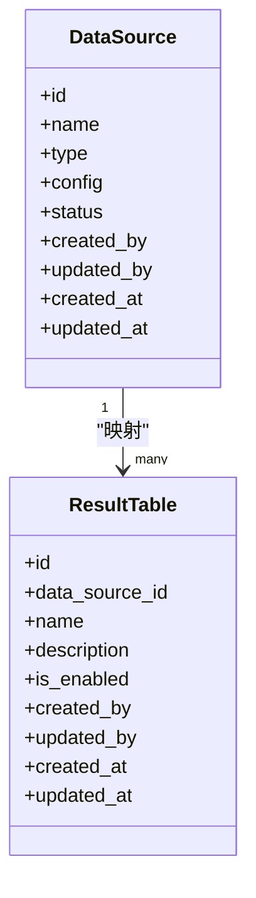

图表来源
- [models/data_source.py](file://bkmonitor/metadata/models/data_source.py)
- [models/result_table.py](file://bkmonitor/metadata/models/result_table.py)

章节来源
- [models/data_source.py](file://bkmonitor/metadata/models/data_source.py)

### 结果表模型（ResultTable）
设计理念
- 将监控数据抽象为逻辑表，包含字段集合、记录格式与选项，统一查询与计算入口。
- 字段定义强调“字段名、类型、是否主键、是否聚合、单位与维度”等，支撑多维分析。

业务逻辑
- 支持结果表的创建、启用/停用、字段增删改查。
- 与数据源建立外键关联，与存储建立落盘映射。
- 与维度、指标、标签、标签组、场景、策略、通知、告警等模型形成强关联。

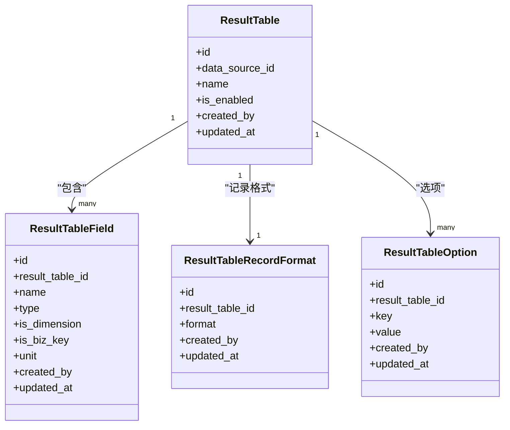

图表来源
- [models/result_table.py](file://bkmonitor/metadata/models/result_table.py)

章节来源
- [models/result_table.py](file://bkmonitor/metadata/models/result_table.py)

### 存储模型（Storage）
设计理念
- 抽象存储介质与集群信息，支持ES、InfluxDB、Kafka等多种后端，统一索引与生命周期管理。
- 字段定义围绕“集群名称、类型、地址、索引策略、保留周期、状态”等，确保可运维与可治理。

业务逻辑
- 支持集群的创建、更新、启用/停用与删除。
- 与结果表建立落盘映射，决定数据写入目标。
- 与空间模型建立隔离边界，确保多租户安全。

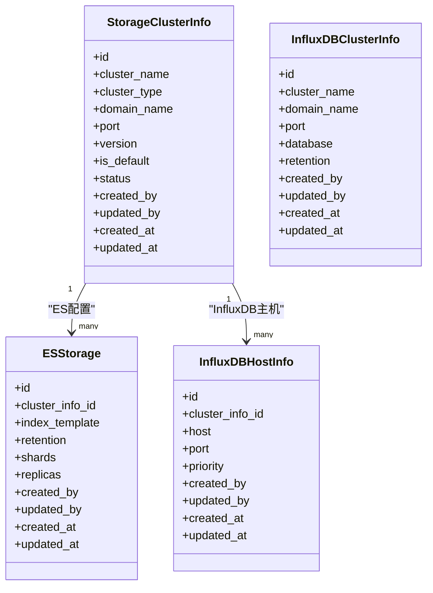

图表来源
- [models/storage.py](file://bkmonitor/metadata/models/storage.py)

章节来源
- [models/storage.py](file://bkmonitor/metadata/models/storage.py)

### 空间模型（Space）
设计理念
- 以租户维度划分命名空间，实现资源隔离与权限控制。
- 字段定义围绕“空间标识、名称、类型、配置、状态”等，支撑多租户治理。

业务逻辑
- 支持空间的创建、更新、启用/停用与删除。
- 与数据源、结果表、存储、事件、数据链路、BCS/集群/拓扑等模型建立强关联，确保资源归属清晰。

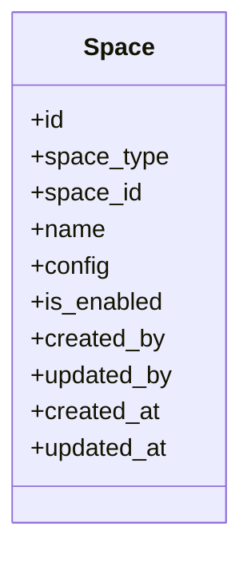

图表来源
- [models/space.py](file://bkmonitor/metadata/models/space.py)

章节来源
- [models/space.py](file://bkmonitor/metadata/models/space.py)

### 自定义上报模型（CustomReport）
设计理念
- 面向自定义时序/事件/日志上报场景，提供灵活的分组与配置能力。
- 字段定义围绕“分组名称、类型、字段定义、聚合策略、保留周期”等，满足多样化业务需求。

业务逻辑
- 支持自定义上报分组的创建、更新、启用/停用与删除。
- 与时序分组、事件分组、日志分组等子模型协作，形成完整的上报生态。

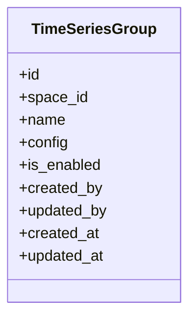

图表来源
- [models/custom_report.py](file://bkmonitor/metadata/models/custom_report.py)

章节来源
- [models/custom_report.py](file://bkmonitor/metadata/models/custom_report.py)

### 事件模型（Event）
设计理念
- 描述事件类数据的分组、标签与统计口径，支撑事件分析与告警。
- 字段定义围绕“事件分组、标签、统计维度、时间范围”等，确保事件可度量。

业务逻辑
- 支持事件分组的创建、更新、启用/停用与删除。
- 与标签、维度、指标等模型协作，形成事件分析闭环。

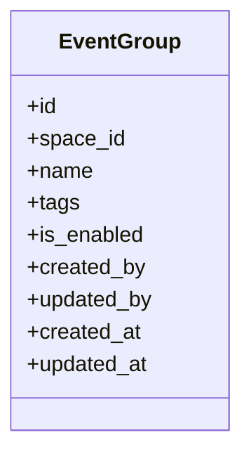

图表来源
- [models/event.py](file://bkmonitor/metadata/models/event.py)

章节来源
- [models/event.py](file://bkmonitor/metadata/models/event.py)

### 数据链路模型（DataLink）
设计理念
- 描述数据从采集到落库的通道编排与路由规则，确保数据流可控、可观测。
- 字段定义围绕“链路名称、节点、路由规则、优先级、状态”等，支撑复杂数据流编排。

业务逻辑
- 支持数据链路的创建、更新、启用/停用与删除。
- 与数据源、结果表、存储等模型协作，形成端到端的数据链路。

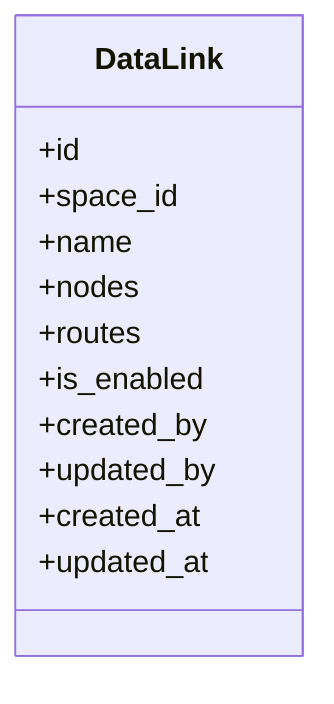

图表来源
- [models/data_link.py](file://bkmonitor/metadata/models/data_link.py)

章节来源
- [models/data_link.py](file://bkmonitor/metadata/models/data_link.py)

### BCS/集群/拓扑/维度/指标/标签/场景/策略/通知/告警/权限/租户/版本/备份/迁移/工具/基础/异常/常量/类型/校验器/查询集/管理器/选项/字段/序列化/权限/缓存/任务/视图/资源/URL/测试/夹具
设计理念
- 模型覆盖元数据全谱系，从BCS集群信息到权限、租户、版本、备份、迁移等，确保元数据系统的完整性与可维护性。
- 字段定义遵循一致的命名规范与业务语义，确保跨模型的一致性与可理解性。

业务逻辑
- 各模型围绕自身职责提供CRUD与业务流程，通过外键与索引设计保证数据一致性与查询效率。
- 与应用初始化、信号处理、管理命令、任务调度等机制协同，形成完整的元数据生命周期管理。

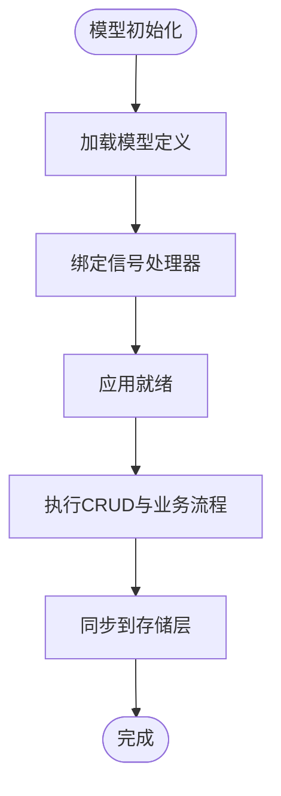

图表来源
- [apps.py:20-42](file://bkmonitor/metadata/apps.py#L20-L42)

章节来源
- [apps.py:20-42](file://bkmonitor/metadata/apps.py#L20-L42)

## 依赖分析
- 应用初始化依赖：apps.py 在 ready 钩子中动态绑定 ResultTable、ResultTableField、ResultTableRecordFormat、ResultTableOption、Storage相关模型以及自定义上报模型，确保上层模块可直接引用。
- 模型内聚与耦合：结果表模型与数据源、存储、维度、指标、标签、标签组、场景、策略、通知、告警等模型存在强关联；存储模型与集群信息、ES/InfluxDB配置存在强关联；空间模型作为租户级隔离边界贯穿各模型。
- 外部依赖：元数据模块广泛被 alarm_backends、apm、api 等模块引用，体现了其作为监控基础设施核心的地位。

```mermaid
graph LR
APP["apps.py"] --> DS["data_source.py"]
APP --> RT["result_table.py"]
APP --> ST["storage.py"]
APP --> SP["space.py"]
APP --> CR["custom_report.py"]
APP --> EV["event.py"]
APP --> DL["data_link.py"]
APP --> BCS["bcs.py"]
APP --> CL["cluster.py"]
APP --> TP["topo.py"]
APP --> DM["dimension.py"]
APP --> MT["metric.py"]
APP --> TG["tag.py"]
APP --> LB["label.py"]
APP --> SC["scene.py"]
APP --> STG["strategy.py"]
APP --> NC["notice.py"]
APP --> AL["alert.py"]
APP --> PM["permission.py"]
APP --> TN["tenant.py"]
APP --> VN["version.py"]
APP --> BK["backup.py"]
APP --> MG["migration.py"]
APP --> UT["utils.py"]
APP --> BS["base.py"]
APP --> EX["exceptions.py"]
APP --> CT["constants.py"]
APP --> TY["types.py"]
APP --> VL["validators.py"]
APP --> QS["queryset.py"]
APP --> MJ["managers.py"]
APP --> OP["options.py"]
APP --> FD["fields.py"]
APP --> SR["serializers.py"]
APP --> PP["permissions.py"]
APP --> CC["cache.py"]
APP --> TK["tasks.py"]
APP --> VW["views.py"]
APP --> RS["resources.py"]
APP --> UR["urls.py"]
APP --> TS["tests.py"]
APP --> FX["fixtures.py"]
```

图表来源
- [apps.py:20-42](file://bkmonitor/metadata/apps.py#L20-L42)
- [models/__init__.py](file://bkmonitor/metadata/models/__init__.py)

章节来源
- [apps.py:20-42](file://bkmonitor/metadata/apps.py#L20-L42)

## 性能考虑
- 查询优化：建议为常用过滤字段（如空间标识、结果表标识、存储集群标识、状态等）建立索引，减少全表扫描。
- 写入优化：批量写入与事务控制结合，避免频繁小事务导致的性能损耗。
- 缓存策略：对热点模型（如结果表、存储集群、空间）引入缓存层，降低重复查询成本。
- 迁移与版本：通过迁移脚本逐步演进模型结构，避免大范围重建索引或表结构变更带来的性能影响。

## 故障排除指南
- 初始化失败：检查 apps.py 的 ready 钩子是否正确绑定模型，确认模型导入顺序与依赖关系。
- 查询异常：核对索引是否存在、字段类型是否匹配、过滤条件是否合理。
- 写入失败：检查存储集群连通性、权限配置与容量阈值，关注写入队列与重试机制。
- 权限问题：核对空间与租户配置，确认用户角色与资源授权范围。

章节来源
- [apps.py:20-42](file://bkmonitor/metadata/apps.py#L20-L42)
- [models/exceptions.py](file://bkmonitor/metadata/models/exceptions.py)

## 结论
元数据管理模块通过数据源、结果表、存储、空间等核心模型，构建了监控数据的统一抽象与治理框架。模型间通过外键与索引实现强关联与高内聚，配合应用初始化与信号处理机制，确保系统在多租户、多协议、多存储介质下的可运维与可扩展性。建议在生产环境中持续完善索引策略、缓存与迁移机制，保障系统的稳定性与性能。

## 附录
- 迁移脚本：models/migrations 下包含各版本迁移脚本，建议按版本顺序执行并做好回滚准备。
- 测试与夹具：models/tests.py 与 models/fixtures.py 提供测试用例与初始数据，便于本地验证与回归测试。

章节来源
- [models/migrations/__init__.py](file://bkmonitor/metadata/models/migrations/__init__.py)
- [models/tests.py](file://bkmonitor/metadata/models/tests.py)
- [models/fixtures.py](file://bkmonitor/metadata/models/fixtures.py)