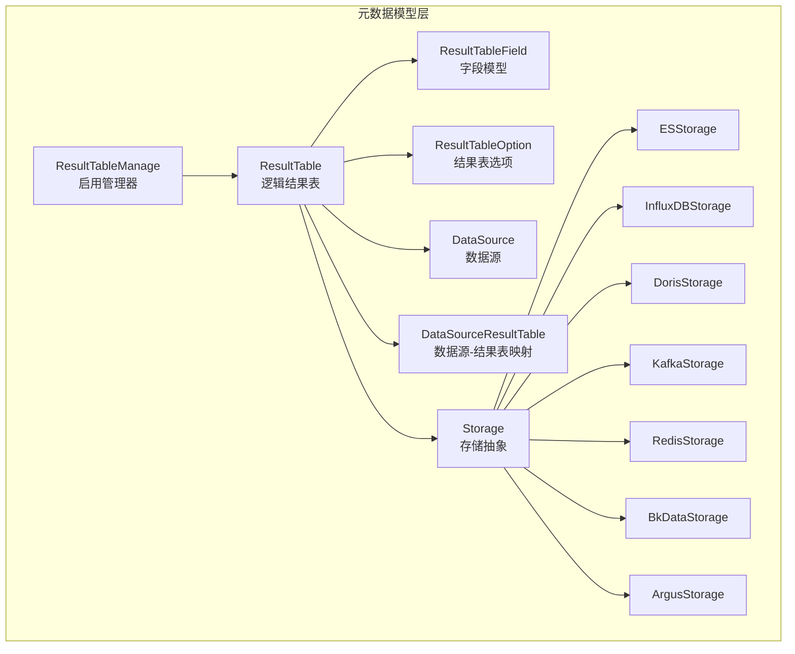
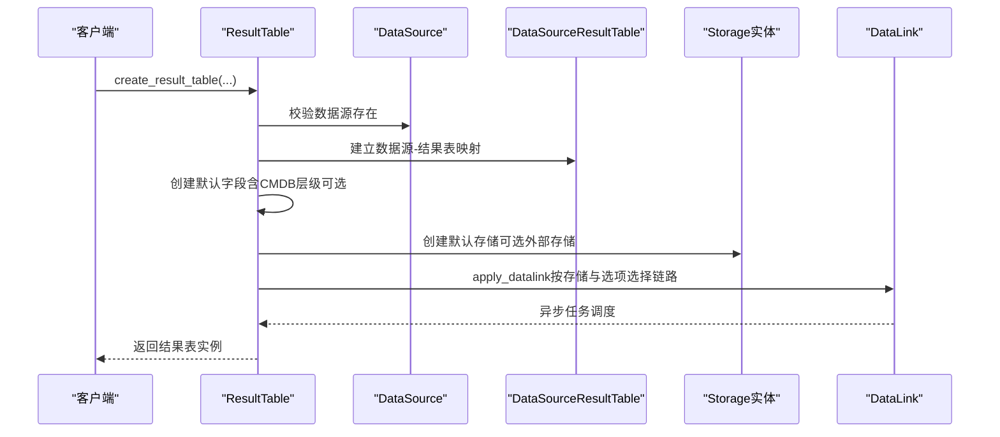
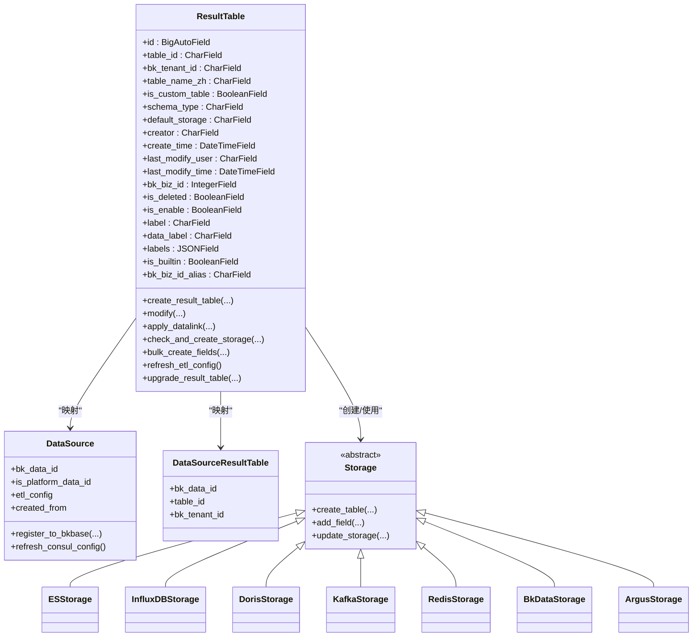
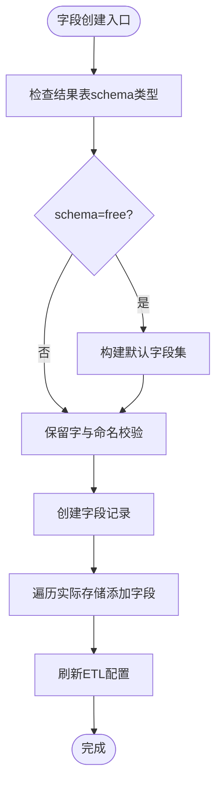
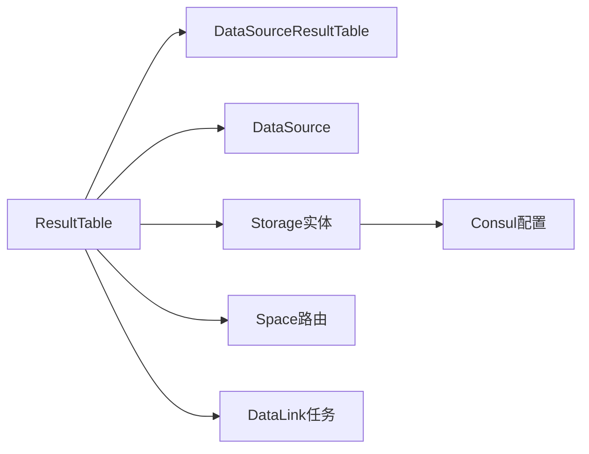

# 结果表模型

<cite>
**本文档引用的文件**
- [constants/result_table.py](file://bkmonitor/constants/result_table.py)
- [metadata/models/result_table.py](file://bkmonitor/metadata/models/result_table.py)
- [metadata/models/result_table_manage.py](file://bkmonitor/metadata/models/result_table_manage.py)
- [metadata/models/common.py](file://bkmonitor/metadata/models/common.py)
- [metadata/models/data_source.py](file://bkmonitor/metadata/models/data_source.py)
- [metadata/models/space.py](file://bkmonitor/metadata/models/space.py)
- [metadata/models/storage.py](file://bkmonitor/metadata/models/storage.py)
- [metadata/models/bkdata/result_table.py](file://bkmonitor/metadata/models/bkdata/result_table.py)
- [metadata/models/result_table_manage.py](file://bkmonitor/metadata/models/result_table_manage.py)
</cite>

## 目录
1. [简介](#简介)
2. [项目结构](#项目结构)
3. [核心组件](#核心组件)
4. [架构总览](#架构总览)
5. [详细组件分析](#详细组件分析)
6. [依赖分析](#依赖分析)
7. [性能考量](#性能考量)
8. [故障排查指南](#故障排查指南)
9. [结论](#结论)
10. [附录](#附录)

## 简介
本技术文档围绕结果表（ResultTable）及其相关模型（ResultTableField、ResultTableOption、ResultTableManage）展开，系统阐述其设计思想、数据结构、处理流程与集成关系。重点覆盖以下方面：
- 结果表的创建、配置、字段定义与选项管理
- 结果表与数据源的关联关系、字段映射规则与数据类型约束
- 结果表生命周期管理、版本控制与兼容性处理
- 实际存储（ES、InfluxDB、Doris、Kafka、Redis、BkData、Argus）的创建与维护
- ETL配置与数据链路（DataLink）的联动与刷新

## 项目结构
结果表相关的核心代码位于 metadata 子系统中，围绕逻辑结果表模型、字段模型、存储实体、数据源映射与管理器等模块协同工作。

图表来源
- [metadata/models/result_table.py:55-113](file://bkmonitor/metadata/models/result_table.py#L55-L113)
- [metadata/models/common.py](file://bkmonitor/metadata/models/common.py)
- [metadata/models/data_source.py](file://bkmonitor/metadata/models/data_source.py)
- [metadata/models/storage.py](file://bkmonitor/metadata/models/storage.py)

章节来源
- [metadata/models/result_table.py:55-113](file://bkmonitor/metadata/models/result_table.py#L55-L113)
- [metadata/models/common.py](file://bkmonitor/metadata/models/common.py)
- [metadata/models/data_source.py](file://bkmonitor/metadata/models/data_source.py)
- [metadata/models/storage.py](file://bkmonitor/metadata/models/storage.py)

## 核心组件
- ResultTable：逻辑结果表，负责结果表的创建、修改、生命周期管理、存储创建与ETL配置刷新、数据链路应用与删除等。
- ResultTableField：结果表字段模型，定义字段类型、标签（指标/维度/时间戳/分组）、保留字检查与默认字段创建。
- ResultTableOption：结果表选项模型，管理影响ETL与查询行为的配置项（如分段查询、插件V4链路、字段黑名单等）。
- ResultTableManage：启用管理器，提供筛选“启用”的结果表的便捷查询集。

章节来源
- [metadata/models/result_table.py:55-113](file://bkmonitor/metadata/models/result_table.py#L55-L113)
- [constants/result_table.py:13-34](file://bkmonitor/constants/result_table.py#L13-L34)
- [metadata/models/result_table_manage.py:16-19](file://bkmonitor/metadata/models/result_table_manage.py#L16-L19)

## 架构总览
结果表模型通过统一的逻辑层协调多个存储后端与数据源，形成“逻辑结果表 + 多存储实体 + 数据源映射 + 选项配置”的整体架构。创建流程中，逻辑结果表与数据源建立映射关系，根据 schema 类型与选项决定是否创建默认字段与实际存储，并在必要时应用数据链路。

图表来源
- [metadata/models/result_table.py:317-564](file://bkmonitor/metadata/models/result_table.py#L317-L564)
- [metadata/models/data_source.py](file://bkmonitor/metadata/models/data_source.py)
- [metadata/models/bkdata/result_table.py](file://bkmonitor/metadata/models/bkdata/result_table.py)

章节来源
- [metadata/models/result_table.py:317-564](file://bkmonitor/metadata/models/result_table.py#L317-L564)

## 详细组件分析

### ResultTable（逻辑结果表）
- 职责
  - 结果表创建：校验数据源、唯一性、命名规范、标签合法性；创建默认字段与存储；应用数据链路。
  - 配置修改：支持默认存储切换、字段重建（自由schema）、标签与选项更新、启用状态变更与存储联动。
  - 生命周期管理：支持升级为全业务结果表、删除数据链路、刷新ETL配置、Consul配置同步。
  - 存储管理：统一入口创建/获取/刷新存储，支持外部存储叠加与删除。
- 关键特性
  - schema 类型：无固定字段（free）、动态字段（dynamic）、固定字段（fixed），不同模式对字段变更有不同约束。
  - 存储映射：通过 REAL_STORAGE_DICT 统一映射 ES、Doris、InfluxDB、Redis、Kafka、BkData、Argus。
  - 数据链路：根据存储类型与选项（如插件V4链路、日志V4链路）选择不同接入路径。
  - Consul 集成：InfluxDB表信息刷新、ETL配置推送、版本号记录。
- 保留字与命名
  - 支持精确与模糊保留字列表，确保结果表命名与字段命名合规。
- 业务与租户
  - 支持多租户（bk_tenant_id），结果表唯一性在 (table_id, bk_tenant_id) 上约束。
  - 全业务结果表（bk_biz_id=0）命名规则与单业务不同，创建时进行严格校验。

图表来源
- [metadata/models/result_table.py:55-113](file://bkmonitor/metadata/models/result_table.py#L55-L113)
- [metadata/models/data_source.py](file://bkmonitor/metadata/models/data_source.py)
- [metadata/models/storage.py](file://bkmonitor/metadata/models/storage.py)

章节来源
- [metadata/models/result_table.py:55-113](file://bkmonitor/metadata/models/result_table.py#L55-L113)
- [metadata/models/result_table.py:317-564](file://bkmonitor/metadata/models/result_table.py#L317-L564)
- [metadata/models/result_table.py:898-953](file://bkmonitor/metadata/models/result_table.py#L898-L953)
- [metadata/models/result_table.py:1140-1497](file://bkmonitor/metadata/models/result_table.py#L1140-L1497)
- [metadata/models/result_table.py:1521-1596](file://bkmonitor/metadata/models/result_table.py#L1521-L1596)

### ResultTableField（结果表字段）
- 字段类型
  - 整数、长整型、浮点、字符串、布尔、对象、嵌套、时间戳等。
- 字段标签
  - 指标（metric）、维度（dimension）、时间戳（timestamp）、分组（group）等，用于TSDB与查询语义。
- 保留字检查
  - 对字段名进行精确与模糊保留字匹配，避免与SQL/查询语法冲突。
- 默认字段创建
  - 支持仅创建时间字段（适配日志检索）、包含CMDB层级字段等场景。
- 字段选项
  - 字段级别选项（如查询别名、单位、描述、别名等）与结果表选项配合使用。

图表来源
- [constants/result_table.py:13-34](file://bkmonitor/constants/result_table.py#L13-L34)
- [metadata/models/result_table.py:955-1013](file://bkmonitor/metadata/models/result_table.py#L955-L1013)

章节来源
- [constants/result_table.py:13-34](file://bkmonitor/constants/result_table.py#L13-L34)
- [metadata/models/result_table.py:955-1013](file://bkmonitor/metadata/models/result_table.py#L955-L1013)

### ResultTableOption（结果表选项）
- 作用
  - 控制ETL与查询行为的关键开关，如分段查询、插件V4数据链路、日志V4数据链路、字段黑名单、分片查询等。
- 生命周期
  - 创建时批量写入；修改时按需清理清洗类选项并重写；与数据链路强制更新条件联动。
- 与数据链路
  - 某些选项变更（如字段黑名单开关）触发强制更新数据链路，确保查询一致性。

章节来源
- [metadata/models/result_table.py:1369-1419](file://bkmonitor/metadata/models/result_table.py#L1369-L1419)

### ResultTableManage（启用管理器）
- 作用
  - 提供只查询启用结果表的便捷查询集，简化业务侧筛选逻辑。
- 实现
  - 继承 Django Manager，过滤 is_disable=False。

章节来源
- [metadata/models/result_table_manage.py:16-19](file://bkmonitor/metadata/models/result_table_manage.py#L16-L19)

## 依赖分析
- 与数据源的耦合
  - 通过 DataSourceResultTable 建立 (bk_data_id, table_id, bk_tenant_id) 的映射，确保结果表与数据源的一致性。
  - 数据源的 etl_config、created_from 等属性影响数据链路选择与VM接入策略。
- 与存储的耦合
  - 通过 REAL_STORAGE_DICT 统一管理存储实体，创建/刷新存储时按默认存储与外部存储配置执行。
- 与空间/路由的耦合
  - 启用结果表时，根据空间信息推送路由，确保查询路由正确下发。
- 与ETL/Consul的耦合
  - 刷新ETL配置与Consul版本信息，保证查询模块与存储一致。

图表来源
- [metadata/models/result_table.py:220-224](file://bkmonitor/metadata/models/result_table.py#L220-L224)
- [metadata/models/result_table.py:656-659](file://bkmonitor/metadata/models/result_table.py#L656-L659)
- [metadata/models/result_table.py:1469-1496](file://bkmonitor/metadata/models/result_table.py#L1469-L1496)

章节来源
- [metadata/models/result_table.py:220-224](file://bkmonitor/metadata/models/result_table.py#L220-L224)
- [metadata/models/result_table.py:656-659](file://bkmonitor/metadata/models/result_table.py#L656-L659)
- [metadata/models/result_table.py:1469-1496](file://bkmonitor/metadata/models/result_table.py#L1469-L1496)

## 性能考量
- 事务与异步
  - 关键写入操作采用原子事务包裹，确保一致性；数据链路与空间路由推送采用 on_commit 或延迟任务，避免事务未提交导致的竞态。
- 批量操作
  - 批量创建字段与选项、批量序列化输出，减少数据库往返次数。
- 存储创建策略
  - 默认存储与外部存储分离创建，避免重复同步与无效操作；ES存储在启用时按索引切片策略创建或更新。
- ETL刷新
  - 仅在必要时刷新ETL配置与Consul，降低频繁写入带来的压力。

章节来源
- [metadata/models/result_table.py:317-564](file://bkmonitor/metadata/models/result_table.py#L317-L564)
- [metadata/models/result_table.py:898-953](file://bkmonitor/metadata/models/result_table.py#L898-L953)
- [metadata/models/result_table.py:1469-1496](file://bkmonitor/metadata/models/result_table.py#L1469-L1496)

## 故障排查指南
- 创建失败
  - 数据源不存在：检查数据源ID与租户ID是否匹配。
  - 结果表ID重复：同一租户下 table_id 唯一，需更换或清理历史。
  - 命名不合法：全业务结果表不得以数字下划线开头。
- 修改失败
  - 存储类型不支持或不存在：确认默认存储类型与实际存储配置一致。
  - 字段不可变更：固定schema结果表不允许新增字段。
- 存储问题
  - 存储未创建：检查 is_sync_db 参数与存储配置；确认外部存储类型在支持列表内。
- 数据链路问题
  - 未生效：确认选项变更是否触发强制更新；检查空间路由推送是否成功。
- ETL/Consul问题
  - 配置不同步：手动触发 ETL 刷新或等待定时任务；检查 Consul 写入权限与网络。

章节来源
- [metadata/models/result_table.py:396-430](file://bkmonitor/metadata/models/result_table.py#L396-L430)
- [metadata/models/result_table.py:1191-1221](file://bkmonitor/metadata/models/result_table.py#L1191-L1221)
- [metadata/models/result_table.py:1369-1419](file://bkmonitor/metadata/models/result_table.py#L1369-L1419)

## 结论
结果表模型通过清晰的职责划分与严格的约束机制，实现了从逻辑定义到物理存储、从数据源映射到ETL与数据链路的完整闭环。其支持多存储后端、灵活的schema类型与选项配置，满足监控场景下对指标、事件与日志的多样化需求。建议在生产环境中：
- 明确 schema 类型与字段策略，避免频繁变更导致ETL与存储不一致。
- 合理使用选项开关，关注强制更新数据链路的成本与收益。
- 在启用/升级/删除等关键操作前后，及时刷新ETL与Consul配置，确保查询一致性。

## 附录
- 保留字与命名规范
  - 结果表与字段保留字列表详见常量文件，创建/修改时应进行严格校验。
- 命名规范与查询兼容
  - 支持多种命名风格（含带业务前缀与点号分隔），查询时自动兼容旧/新风格。

章节来源
- [constants/result_table.py:36-247](file://bkmonitor/constants/result_table.py#L36-L247)
- [metadata/models/result_table.py:726-807](file://bkmonitor/metadata/models/result_table.py#L726-L807)