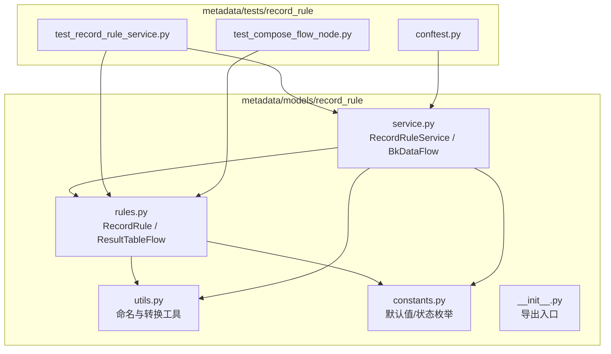
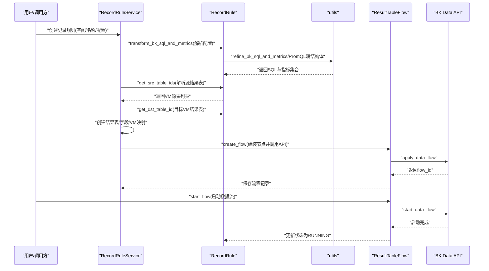
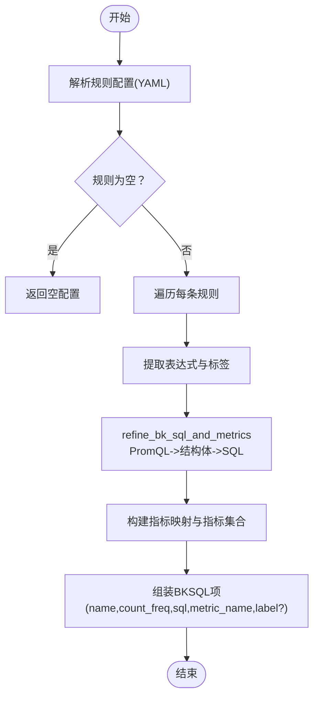
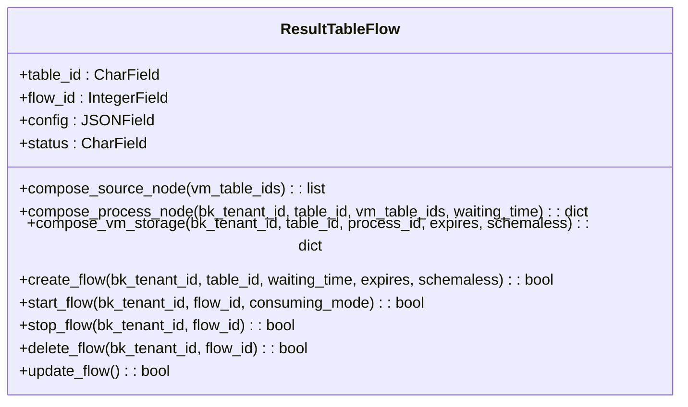
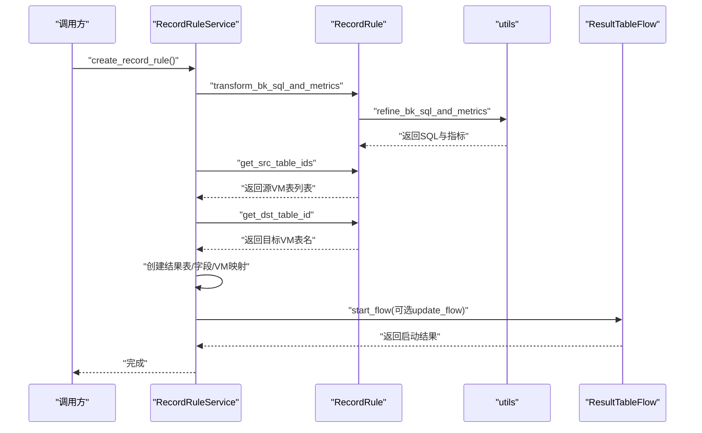
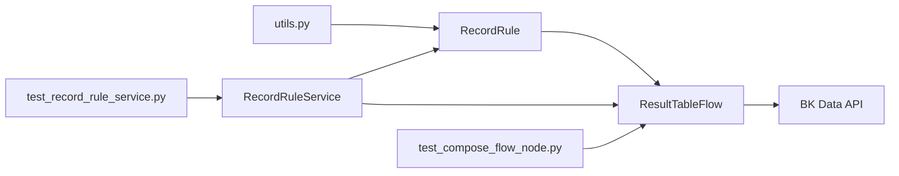

# 记录规则模型

<cite>
**本文引用的文件**
- [rules.py](file://bkmonitor/metadata/models/record_rule/rules.py)
- [constants.py](file://bkmonitor/metadata/models/record_rule/constants.py)
- [service.py](file://bkmonitor/metadata/models/record_rule/service.py)
- [utils.py](file://bkmonitor/metadata/models/record_rule/utils.py)
- [__init__.py](file://bkmonitor/metadata/models/record_rule/__init__.py)
- [test_compose_flow_node.py](file://bkmonitor/metadata/tests/record_rule/test_compose_flow_node.py)
- [test_record_rule_service.py](file://bkmonitor/metadata/tests/record_rule/test_record_rule_service.py)
- [conftest.py](file://bkmonitor/metadata/tests/record_rule/conftest.py)
</cite>

## 目录
1. [简介](#简介)
2. [项目结构](#项目结构)
3. [核心组件](#核心组件)
4. [架构总览](#架构总览)
5. [详细组件分析](#详细组件分析)
6. [依赖关系分析](#依赖关系分析)
7. [性能考量](#性能考量)
8. [故障排查指南](#故障排查指南)
9. [结论](#结论)

## 简介
本技术文档围绕“记录规则”相关模型展开，重点解释 RecordRule、ResultTableFlow、RecordRuleService 及其配套工具与常量的设计与实现，覆盖以下方面：
- 记录规则的配置解析与 SQL 转换
- 规则与数据源、存储的关联关系
- 规则匹配与执行逻辑
- 生命周期管理、状态监控与故障处理
- 与计算平台（BK Data）的对接流程

## 项目结构
记录规则相关代码位于 metadata 子系统中，采用按功能域分层组织：
- models/record_rule：记录规则核心模型与服务
  - rules.py：定义 RecordRule、ResultTableFlow 模型及流程编排方法
  - service.py：封装规则创建、数据流启动/更新/删除的服务类
  - utils.py：命名清洗、规则表 ID 组合、PromQL 转换等工具函数
  - constants.py：默认规则类型、评估间隔、状态枚举等常量
  - __init__.py：导出入口

图表来源
- [rules.py:39-395](file://bkmonitor/metadata/models/record_rule/rules.py#L39-L395)
- [service.py:27-202](file://bkmonitor/metadata/models/record_rule/service.py#L27-L202)
- [utils.py:20-118](file://bkmonitor/metadata/models/record_rule/utils.py#L20-L118)
- [constants.py:14-44](file://bkmonitor/metadata/models/record_rule/constants.py#L14-L44)
- [__init__.py:1-6](file://bkmonitor/metadata/models/record_rule/__init__.py#L1-L6)
- [test_record_rule_service.py:28-100](file://bkmonitor/metadata/tests/record_rule/test_record_rule_service.py#L28-L100)
- [test_compose_flow_node.py:20-188](file://bkmonitor/metadata/tests/record_rule/test_compose_flow_node.py#L20-L188)
- [conftest.py:87-134](file://bkmonitor/metadata/tests/record_rule/conftest.py#L87-L134)

章节来源
- [rules.py:39-395](file://bkmonitor/metadata/models/record_rule/rules.py#L39-L395)
- [service.py:27-202](file://bkmonitor/metadata/models/record_rule/service.py#L27-L202)
- [utils.py:20-118](file://bkmonitor/metadata/models/record_rule/utils.py#L20-L118)
- [constants.py:14-44](file://bkmonitor/metadata/models/record_rule/constants.py#L14-L44)
- [__init__.py:1-6](file://bkmonitor/metadata/models/record_rule/__init__.py#L1-L6)

## 核心组件
- RecordRule：记录规则实体，承载规则配置、源/目标结果表、状态、计算频率等元数据；提供 SQL 转换与源表解析能力
- ResultTableFlow：结果表计算流程记录，负责组装计算平台节点配置、调用 API 创建/启动/停止/删除数据流
- RecordRuleService：规则创建服务，串联结果表创建、规则记录落库、指标字段创建、VM 存储映射
- 工具与常量：命名清洗、规则表 ID 组合、PromQL 结构化转换、默认规则类型与状态枚举

章节来源
- [rules.py:39-162](file://bkmonitor/metadata/models/record_rule/rules.py#L39-L162)
- [rules.py:164-395](file://bkmonitor/metadata/models/record_rule/rules.py#L164-L395)
- [service.py:27-132](file://bkmonitor/metadata/models/record_rule/service.py#L27-L132)
- [utils.py:20-118](file://bkmonitor/metadata/models/record_rule/utils.py#L20-L118)
- [constants.py:14-44](file://bkmonitor/metadata/models/record_rule/constants.py#L14-L44)

## 架构总览
记录规则从“配置输入”到“计算平台执行”的整体流程如下：

图表来源
- [service.py:49-65](file://bkmonitor/metadata/models/record_rule/service.py#L49-L65)
- [rules.py:60-97](file://bkmonitor/metadata/models/record_rule/rules.py#L60-L97)
- [rules.py:100-156](file://bkmonitor/metadata/models/record_rule/rules.py#L100-L156)
- [rules.py:158-161](file://bkmonitor/metadata/models/record_rule/rules.py#L158-L161)
- [rules.py:277-352](file://bkmonitor/metadata/models/record_rule/rules.py#L277-L352)
- [rules.py:354-374](file://bkmonitor/metadata/models/record_rule/rules.py#L354-L374)

## 详细组件分析

### RecordRule 模型
职责与字段
- 元数据：space_type/space_id/table_id/record_name/rule_type/bk_tenant_id
- 配置与指标：rule_config/bk_sql_config/rule_metrics/src_vm_table_ids/dst_vm_table_id
- 执行与状态：status/count_freq
- 提供静态方法：
  - transform_bk_sql_and_metrics：将 YAML 规则解析为 BKSQL 列表与指标映射
  - get_src_table_ids：基于指标与空间定位源结果表，并结合时间序列维度进行筛选
  - get_dst_table_id：生成目标 VM 结果表名

处理逻辑要点
- SQL 转换：解析 YAML 中的 rules，逐条将 PromQL 表达式转换为 BKSQL，并提取指标集合与指标别名映射
- 源表解析：通过指标字段反查结果表，再结合时间序列组与最近修改时间进一步收敛
- 目标表生成：基于默认业务 ID 与规则表 ID 组合生成 VM 结果表名

图表来源
- [rules.py:60-97](file://bkmonitor/metadata/models/record_rule/rules.py#L60-L97)
- [utils.py:78-108](file://bkmonitor/metadata/models/record_rule/utils.py#L78-L108)

章节来源
- [rules.py:39-162](file://bkmonitor/metadata/models/record_rule/rules.py#L39-L162)
- [utils.py:70-108](file://bkmonitor/metadata/models/record_rule/utils.py#L70-L108)

### ResultTableFlow 模型
职责与方法
- 记录结果表对应的计算流程：table_id/flow_id/config/status
- 节点组装：
  - compose_source_node：为每个源VM结果表生成 stream_source 节点
  - compose_process_node：生成 promql_v2 计算节点，注入等待时间与 SQL 列表
  - compose_vm_storage：生成 vm_storage 存储节点，绑定集群与过期策略
- 流程生命周期：
  - create_flow：批量组装节点并调用 apply_data_flow，保存流程记录
  - start_flow/stop_flow/delete_flow：分别启动、停止、删除数据流
  - update_flow：先停止并删除，再重新创建（适用于节点变更）

图表来源
- [rules.py:164-395](file://bkmonitor/metadata/models/record_rule/rules.py#L164-L395)

章节来源
- [rules.py:164-395](file://bkmonitor/metadata/models/record_rule/rules.py#L164-L395)

### RecordRuleService 服务
职责与流程
- 初始化：接收空间类型/空间 ID/规则名称/规则类型/规则配置/计算频率/租户 ID
- create_record_rule：
  - 解析规则并获取源结果表
  - 生成目标 VM 结果表名
  - 创建自定义结果表、写入规则记录、创建指标字段、建立 VM 映射
- BkDataFlow：
  - start_flow：创建流程并启动，首次启动使用尾部消费模式
  - update_flow：停止并删除旧流程后重建

图表来源
- [service.py:49-65](file://bkmonitor/metadata/models/record_rule/service.py#L49-L65)
- [service.py:141-180](file://bkmonitor/metadata/models/record_rule/service.py#L141-L180)
- [service.py:182-202](file://bkmonitor/metadata/models/record_rule/service.py#L182-L202)

章节来源
- [service.py:27-132](file://bkmonitor/metadata/models/record_rule/service.py#L27-L132)
- [service.py:134-202](file://bkmonitor/metadata/models/record_rule/service.py#L134-L202)

### 工具与常量
- 命名与 ID 组合
  - sanitize：清理并校验名称，确保符合 Prometheus 标识规范
  - generate_pre_cal_table_id：生成预计算结果表 ID
  - compose_rule_table_id：生成 VM 存储节点名
- PromQL 转换
  - refine_bk_sql_and_metrics：移除注释与换行，替换 record 为指标名，调用统一查询接口进行结构化转换与回写
- 常量
  - DEFAULT_EVALUATION_INTERVAL/DEFAULT_RULE_TYPE：默认评估间隔与规则类型
  - RecordRuleStatus/BkDataFlowStatus：规则与流程状态枚举

章节来源
- [utils.py:20-118](file://bkmonitor/metadata/models/record_rule/utils.py#L20-L118)
- [constants.py:14-44](file://bkmonitor/metadata/models/record_rule/constants.py#L14-L44)

## 依赖关系分析
- RecordRule 依赖 utils（SQL 转换、命名清洗）、metadata 查询（结果表/时间序列组/字段）
- ResultTableFlow 依赖 RecordRule（读取规则配置）、vm 工具（集群信息）、BK Data API（apply/start/stop/delete）
- RecordRuleService 依赖 RecordRule/ResultTableFlow、utils、空间/结果表/字段/VM 映射模型
- 测试用例覆盖节点组装、流程创建、规则创建与指标缓存一致性

图表来源
- [rules.py:39-395](file://bkmonitor/metadata/models/record_rule/rules.py#L39-L395)
- [service.py:27-202](file://bkmonitor/metadata/models/record_rule/service.py#L27-L202)
- [utils.py:20-118](file://bkmonitor/metadata/models/record_rule/utils.py#L20-L118)
- [test_record_rule_service.py:28-100](file://bkmonitor/metadata/tests/record_rule/test_record_rule_service.py#L28-L100)
- [test_compose_flow_node.py:20-188](file://bkmonitor/metadata/tests/record_rule/test_compose_flow_node.py#L20-L188)

章节来源
- [rules.py:39-395](file://bkmonitor/metadata/models/record_rule/rules.py#L39-L395)
- [service.py:27-202](file://bkmonitor/metadata/models/record_rule/service.py#L27-L202)
- [utils.py:20-118](file://bkmonitor/metadata/models/record_rule/utils.py#L20-L118)
- [test_record_rule_service.py:28-100](file://bkmonitor/metadata/tests/record_rule/test_record_rule_service.py#L28-L100)
- [test_compose_flow_node.py:20-188](file://bkmonitor/metadata/tests/record_rule/test_compose_flow_node.py#L20-L188)

## 性能考量
- 源表解析阶段的数据库查询与过滤：通过时间序列组与最近修改时间进行二次过滤，降低结果表规模，提升后续流程效率
- 批量创建字段：使用 bulk_create 并设置批次大小，减少数据库往返
- SQL 转换链路：PromQL->结构体->SQL 的两步转换，建议在上游保证规则表达式的简洁性，避免复杂嵌套导致转换耗时增加
- 数据流等待时间：process 节点的 waiting_time 参数用于平衡实时性与稳定性，需根据业务延迟容忍度调整

## 故障排查指南
常见问题与处理
- 规则创建失败
  - 检查规则配置是否为空或格式错误
  - 确认源结果表解析是否返回空列表（可能由于指标不存在或过期）
  - 核对租户 ID 与空间映射是否正确
- 数据流创建失败
  - 核查权限授权是否成功（batch_add_permission）
  - 检查 BK Data API 返回的 flow_id 是否存在
- 数据流启动失败
  - 首次启动建议使用尾部消费模式，避免历史数据干扰
  - 若需重跑，使用 update_flow 先停止再删除后重建
- 状态不一致
  - 启动成功后应更新规则状态为 RUNNING
  - 如异常中断，需检查日志中的错误码与堆栈

章节来源
- [rules.py:277-352](file://bkmonitor/metadata/models/record_rule/rules.py#L277-L352)
- [rules.py:354-395](file://bkmonitor/metadata/models/record_rule/rules.py#L354-L395)
- [service.py:141-180](file://bkmonitor/metadata/models/record_rule/service.py#L141-L180)
- [service.py:182-202](file://bkmonitor/metadata/models/record_rule/service.py#L182-L202)

## 结论
RecordRule 与 ResultTableFlow 通过清晰的职责划分与工具化支持，实现了从规则配置到计算平台执行的闭环。RecordRuleService 将各环节串联，形成可维护、可观测的生命周期管理。配合完善的测试用例与状态枚举，系统具备良好的扩展性与稳定性。建议在生产环境中关注源表解析的准确性、SQL 转换的健壮性与数据流的监控告警，以保障规则的持续稳定运行。