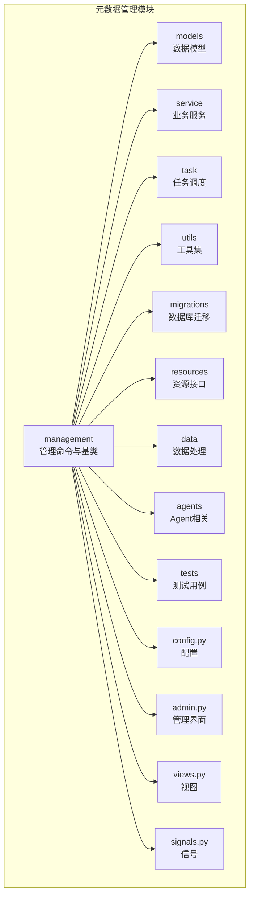
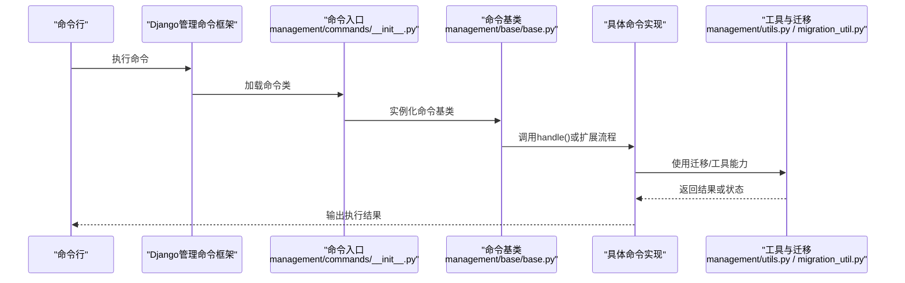
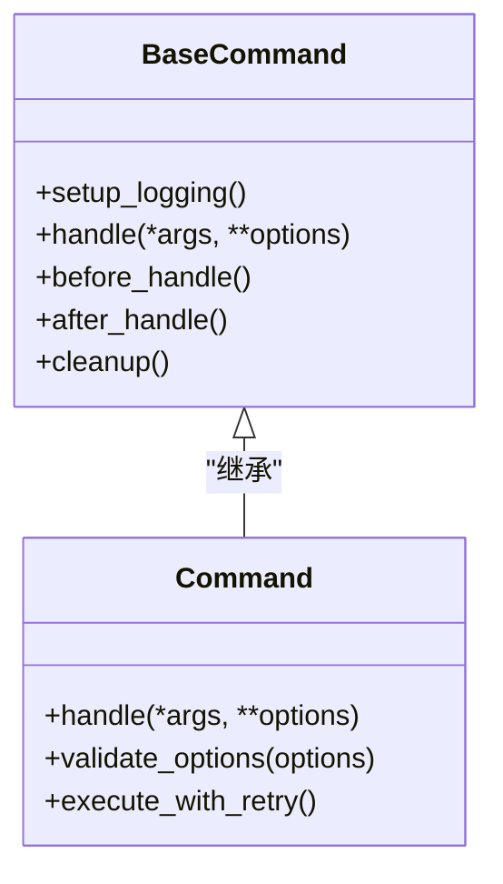
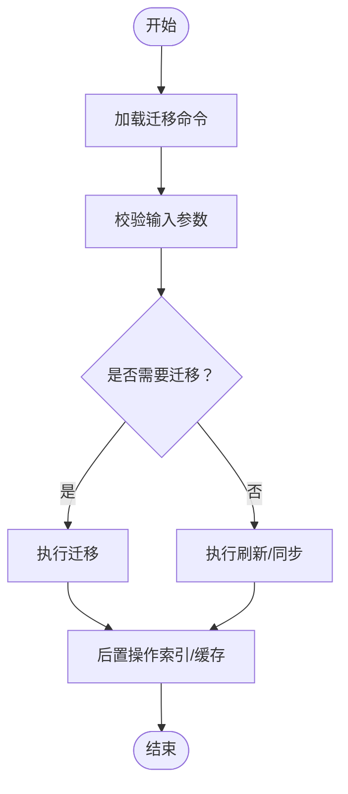
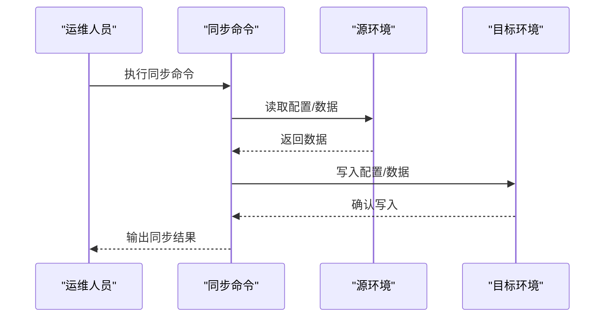
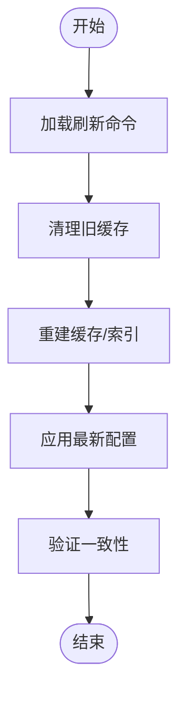
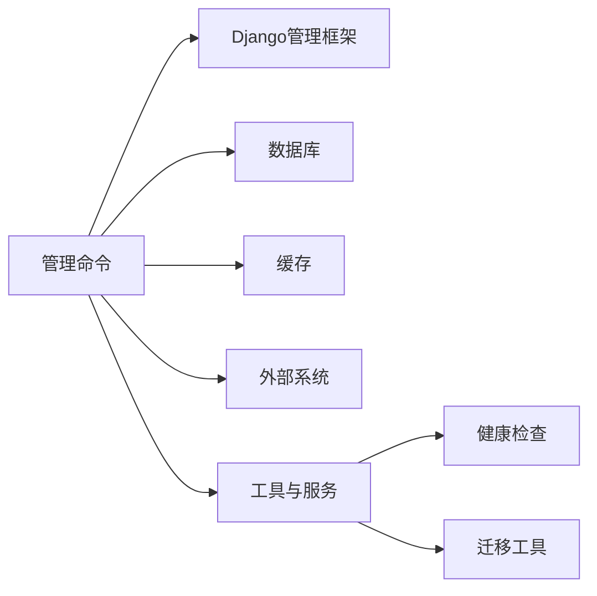

# 元数据管理命令

<cite>
**本文引用的文件**
- [manage.py](file://manage.py)
- [settings.py](file://settings.py)
- [metadata/apps.py](file://bkmonitor/metadata/apps.py)
- [metadata/management/__init__.py](file://bkmonitor/metadata/management/__init__.py)
- [metadata/management/commands/__init__.py](file://bkmonitor/metadata/management/commands/__init__.py)
- [metadata/management/base/base.py](file://bkmonitor/metadata/management/base/base.py)
- [metadata/management/utils.py](file://bkmonitor/metadata/management/utils.py)
- [metadata/migration_util.py](file://bkmonitor/metadata/migration_util.py)
- [metadata/models/__init__.py](file://bkmonitor/metadata/models/__init__.py)
- [metadata/service/__init__.py](file://bkmonitor/metadata/service/__init__.py)
- [metadata/task/__init__.py](file://bkmonitor/metadata/task/__init__.py)
- [metadata/utils/__init__.py](file://bkmonitor/metadata/utils/__init__.py)
- [metadata/config.py](file://bkmonitor/metadata/config.py)
- [metadata/health_check.py](file://bkmonitor/metadata/health_check.py)
- [metadata/signals.py](file://bkmonitor/metadata/signals.py)
- [metadata/admin.py](file://bkmonitor/metadata/admin.py)
- [metadata/views.py](file://bkmonitor/metadata/views.py)
- [metadata/resources/__init__.py](file://bkmonitor/metadata/resources/__init__.py)
- [metadata/data/__init__.py](file://bkmonitor/metadata/data/__init__.py)
- [metadata/agents/__init__.py](file://bkmonitor/metadata/agents/__init__.py)
- [metadata/tests/__init__.py](file://bkmonitor/metadata/tests/__init__.py)
- [metadata/tools/__init__.py](file://bkmonitor/metadata/tools/__init__.py)
- [metadata/migrations/__init__.py](file://bkmonitor/metadata/migrations/__init__.py)
</cite>

## 目录
1. [简介](#简介)
2. [项目结构](#项目结构)
3. [核心组件](#核心组件)
4. [架构总览](#架构总览)
5. [详细组件分析](#详细组件分析)
6. [依赖分析](#依赖分析)
7. [性能考虑](#性能考虑)
8. [故障排查指南](#故障排查指南)
9. [结论](#结论)
10. [附录](#附录)

## 简介
本文件面向运维与开发人员，系统化梳理元数据管理模块的Django管理命令，覆盖迁移、同步、刷新等运维场景。文档从命令入口、执行环境与权限、参数与配置、典型用法到错误处理与性能优化进行全面说明，并提供可复用的操作指南与排障建议。

## 项目结构
元数据管理模块位于 bkmonitor/metadata 目录下，采用按功能域分层的组织方式：
- management：管理命令与基础基类
- models：数据模型定义
- service：业务服务层
- task：任务调度
- utils：工具集
- migrations：数据库迁移
- resources：资源接口
- data：数据处理
- agents：Agent相关
- tests：测试用例
- config.py、admin.py、views.py、signals.py 等：配置、管理界面、视图与信号

图表来源
- [metadata/apps.py](file://bkmonitor/metadata/apps.py)
- [metadata/management/__init__.py](file://bkmonitor/metadata/management/__init__.py)
- [metadata/management/commands/__init__.py](file://bkmonitor/metadata/management/commands/__init__.py)

章节来源
- [metadata/apps.py](file://bkmonitor/metadata/apps.py)
- [metadata/management/__init__.py](file://bkmonitor/metadata/management/__init__.py)
- [metadata/management/commands/__init__.py](file://bkmonitor/metadata/management/commands/__init__.py)

## 核心组件
- 管理命令入口与基类
  - 命令入口：bkmonitor/metadata/management/commands/__init__.py
  - 基类：bkmonitor/metadata/management/base/base.py（继承Django命令基类，扩展生命周期与工作器协议）
- 运维工具与实用函数
  - 迁移辅助：bkmonitor/metadata/migration_util.py
  - 命令工具：bkmonitor/metadata/management/utils.py
- 模块配置与健康检查
  - 配置：bkmonitor/metadata/config.py
  - 健康检查：bkmonitor/metadata/health_check.py
  - 管理界面与信号：bkmonitor/metadata/admin.py、bkmonitor/metadata/signals.py
  - 视图与资源：bkmonitor/metadata/views.py、bkmonitor/metadata/resources/__init__.py

章节来源
- [metadata/management/base/base.py](file://bkmonitor/metadata/management/base/base.py)
- [metadata/management/utils.py](file://bkmonitor/metadata/management/utils.py)
- [metadata/migration_util.py](file://bkmonitor/metadata/migration_util.py)
- [metadata/config.py](file://bkmonitor/metadata/config.py)
- [metadata/health_check.py](file://bkmonitor/metadata/health_check.py)
- [metadata/admin.py](file://bkmonitor/metadata/admin.py)
- [metadata/signals.py](file://bkmonitor/metadata/signals.py)
- [metadata/views.py](file://bkmonitor/metadata/views.py)
- [metadata/resources/__init__.py](file://bkmonitor/metadata/resources/__init__.py)

## 架构总览
元数据管理命令的执行链路遵循Django命令框架，通过命令入口加载对应命令类，基类负责初始化、生命周期管理与工作器协议适配；实际业务逻辑由各命令实现，配合迁移工具与服务层完成运维操作。

图表来源
- [metadata/management/commands/__init__.py](file://bkmonitor/metadata/management/commands/__init__.py)
- [metadata/management/base/base.py](file://bkmonitor/metadata/management/base/base.py)
- [metadata/management/utils.py](file://bkmonitor/metadata/management/utils.py)
- [metadata/migration_util.py](file://bkmonitor/metadata/migration_util.py)

## 详细组件分析

### 命令基类与生命周期
命令基类统一了命令的初始化、生命周期钩子与工作器协议，确保命令在不同运行环境中具备一致的行为特征。

图表来源
- [metadata/management/base/base.py](file://bkmonitor/metadata/management/base/base.py)

章节来源
- [metadata/management/base/base.py](file://bkmonitor/metadata/management/base/base.py)

### 迁移命令（迁移与刷新）
迁移命令用于数据库结构变更与数据刷新，典型场景包括：
- 数据库迁移：同步模型变更到数据库
- 刷新缓存/索引：重建或更新元数据相关索引与缓存
- 同步配置：将最新配置同步到目标环境

图表来源
- [metadata/migration_util.py](file://bkmonitor/metadata/migration_util.py)
- [metadata/management/utils.py](file://bkmonitor/metadata/management/utils.py)

章节来源
- [metadata/migration_util.py](file://bkmonitor/metadata/migration_util.py)
- [metadata/management/utils.py](file://bkmonitor/metadata/management/utils.py)

### 同步命令（配置与数据同步）
同步命令用于将配置或数据从源环境复制到目标环境，常见场景：
- 配置同步：将元数据配置复制到目标空间或集群
- 数据同步：批量同步指标、维度或事件类型定义

图表来源
- [metadata/management/utils.py](file://bkmonitor/metadata/management/utils.py)
- [metadata/migration_util.py](file://bkmonitor/metadata/migration_util.py)

章节来源
- [metadata/management/utils.py](file://bkmonitor/metadata/management/utils.py)
- [metadata/migration_util.py](file://bkmonitor/metadata/migration_util.py)

### 刷新命令（缓存/索引/配置）
刷新命令用于重建或更新缓存、索引或配置，典型场景：
- 刷新缓存：清理并重建缓存条目
- 刷新索引：重建ES/InfluxDB等存储的索引
- 刷新配置：重新加载并应用最新配置

图表来源
- [metadata/management/utils.py](file://bkmonitor/metadata/management/utils.py)
- [metadata/health_check.py](file://bkmonitor/metadata/health_check.py)

章节来源
- [metadata/management/utils.py](file://bkmonitor/metadata/management/utils.py)
- [metadata/health_check.py](file://bkmonitor/metadata/health_check.py)

### 命令执行环境与权限
- 执行环境
  - 通过Django管理脚本入口执行：python manage.py <command> [options]
  - 需要正确设置Python虚拟环境与依赖
  - 确保数据库连接、缓存与消息队列可用
- 权限要求
  - 需要具备对目标数据库的读写权限
  - 对外部系统（如ES、Kafka、Redis）具备相应访问权限
  - 建议以非root用户运行，避免不必要的系统级权限
- 安全注意事项
  - 不在生产环境直接使用调试模式
  - 避免在命令中硬编码敏感信息，优先使用环境变量或配置文件
  - 对涉及删除/重建的操作进行预演与确认

章节来源
- [manage.py](file://manage.py)
- [settings.py](file://settings.py)
- [metadata/health_check.py](file://bkmonitor/metadata/health_check.py)

### 命令行参数与配置选项
- 通用参数
  - --verbosity/-v：日志详细程度
  - --noinput：禁止交互输入
  - --dry-run：仅预演不执行
- 元数据相关参数
  - --space-id：目标空间标识
  - --cluster-name：目标集群名称
  - --force：强制执行（谨慎使用）
  - --batch-size：批处理大小
- 配置项
  - 通过配置文件或环境变量设置数据库、缓存与外部系统连接参数
  - 可通过命令选项覆盖默认配置

章节来源
- [metadata/management/utils.py](file://bkmonitor/metadata/management/utils.py)
- [metadata/config.py](file://bkmonitor/metadata/config.py)

### 执行示例与运维场景
- 场景一：数据库迁移与索引重建
  - 步骤：执行迁移 → 清理缓存 → 重建索引 → 健康检查
  - 命令：python manage.py migrate && python manage.py refresh_index
- 场景二：配置同步到多空间
  - 步骤：读取源配置 → 批量写入目标空间 → 校验一致性
  - 命令：python manage.py sync_config --space-id=1,2,3
- 场景三：缓存刷新与健康检查
  - 步骤：清理缓存 → 重建缓存 → 健康检查
  - 命令：python manage.py refresh_cache && python manage.py health_check

章节来源
- [metadata/migration_util.py](file://bkmonitor/metadata/migration_util.py)
- [metadata/management/utils.py](file://bkmonitor/metadata/management/utils.py)
- [metadata/health_check.py](file://bkmonitor/metadata/health_check.py)

## 依赖分析
元数据管理命令依赖于以下关键模块：
- Django管理框架：命令解析与执行
- 数据库与缓存：迁移与缓存刷新
- 外部系统：ES/Kafka/Redis等
- 工具与服务：迁移工具、健康检查、信号与管理界面

图表来源
- [metadata/management/base/base.py](file://bkmonitor/metadata/management/base/base.py)
- [metadata/migration_util.py](file://bkmonitor/metadata/migration_util.py)
- [metadata/health_check.py](file://bkmonitor/metadata/health_check.py)

章节来源
- [metadata/management/base/base.py](file://bkmonitor/metadata/management/base/base.py)
- [metadata/migration_util.py](file://bkmonitor/metadata/migration_util.py)
- [metadata/health_check.py](file://bkmonitor/metadata/health_check.py)

## 性能考虑
- 批处理与并发
  - 使用批处理参数控制单次处理的数据量，避免一次性加载过多数据
  - 在支持并发的命令中合理设置并发度，平衡吞吐与资源占用
- 缓存与索引
  - 刷新缓存前先清理旧缓存，减少碎片与冲突
  - 重建索引时选择低峰时段，避免影响在线查询
- I/O与网络
  - 对外部系统的调用增加超时与重试机制
  - 控制日志输出级别，避免I/O成为瓶颈

## 故障排查指南
- 常见问题
  - 数据库连接失败：检查连接字符串与凭据
  - 缓存不可用：确认缓存服务状态与配置
  - 外部系统异常：检查ES/Kafka/Redis连通性与权限
- 排查步骤
  - 启用详细日志：--verbosity=2
  - 使用dry-run预演：验证流程无误后再执行
  - 查看健康检查输出：定位异常阶段
- 相关工具
  - 健康检查：python manage.py health_check
  - 日志与信号：结合admin与signals定位异常

章节来源
- [metadata/health_check.py](file://bkmonitor/metadata/health_check.py)
- [metadata/admin.py](file://bkmonitor/metadata/admin.py)
- [metadata/signals.py](file://bkmonitor/metadata/signals.py)

## 结论
元数据管理命令围绕迁移、同步、刷新三大运维主题构建，通过统一的命令基类与工具集实现跨模块的一致性与可维护性。建议在生产环境中严格遵循权限最小化、参数显式化与预演先行的原则，确保操作安全与稳定。

## 附录
- 命令入口与基类
  - 命令入口：bkmonitor/metadata/management/commands/__init__.py
  - 基类：bkmonitor/metadata/management/base/base.py
- 运维工具
  - 迁移工具：bkmonitor/metadata/migration_util.py
  - 命令工具：bkmonitor/metadata/management/utils.py
- 配置与健康检查
  - 配置：bkmonitor/metadata/config.py
  - 健康检查：bkmonitor/metadata/health_check.py
- 管理界面与信号
  - 管理界面：bkmonitor/metadata/admin.py
  - 信号：bkmonitor/metadata/signals.py
- 视图与资源
  - 视图：bkmonitor/metadata/views.py
  - 资源：bkmonitor/metadata/resources/__init__.py

章节来源
- [metadata/management/commands/__init__.py](file://bkmonitor/metadata/management/commands/__init__.py)
- [metadata/management/base/base.py](file://bkmonitor/metadata/management/base/base.py)
- [metadata/migration_util.py](file://bkmonitor/metadata/migration_util.py)
- [metadata/management/utils.py](file://bkmonitor/metadata/management/utils.py)
- [metadata/config.py](file://bkmonitor/metadata/config.py)
- [metadata/health_check.py](file://bkmonitor/metadata/health_check.py)
- [metadata/admin.py](file://bkmonitor/metadata/admin.py)
- [metadata/signals.py](file://bkmonitor/metadata/signals.py)
- [metadata/views.py](file://bkmonitor/metadata/views.py)
- [metadata/resources/__init__.py](file://bkmonitor/metadata/resources/__init__.py)