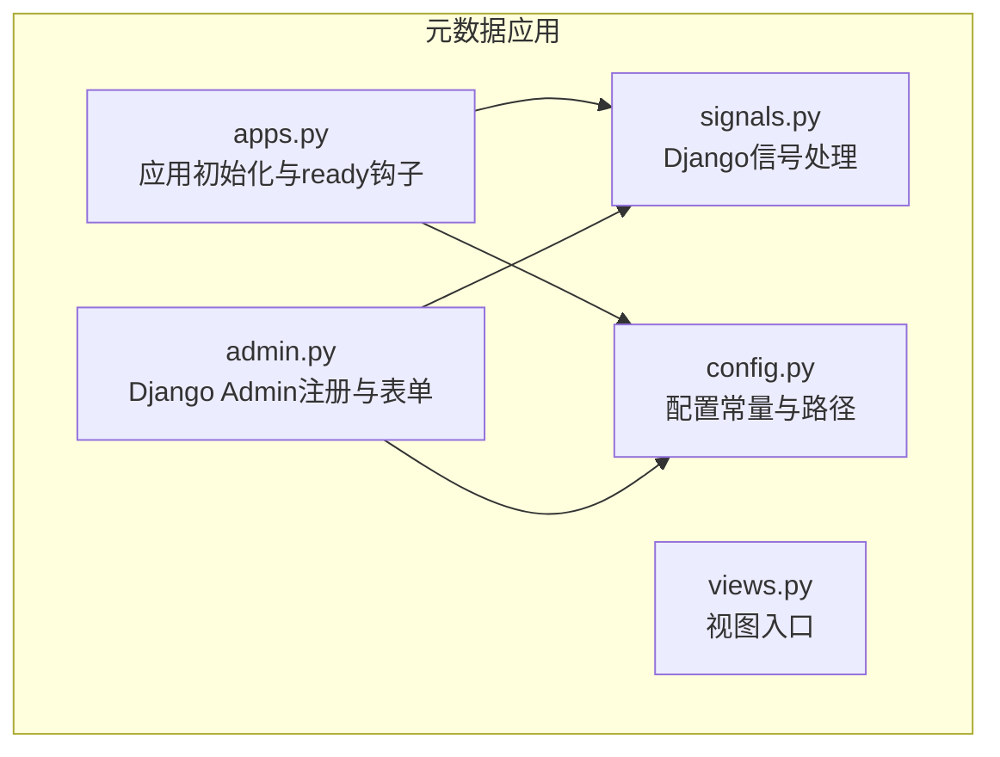
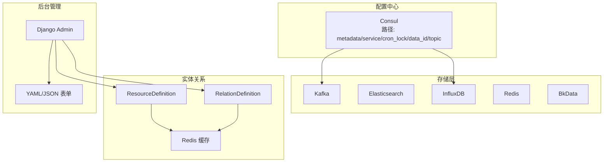
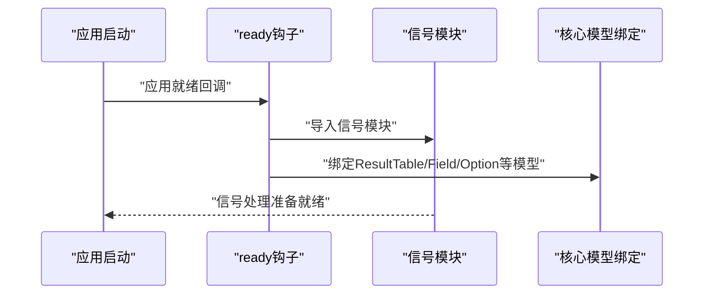
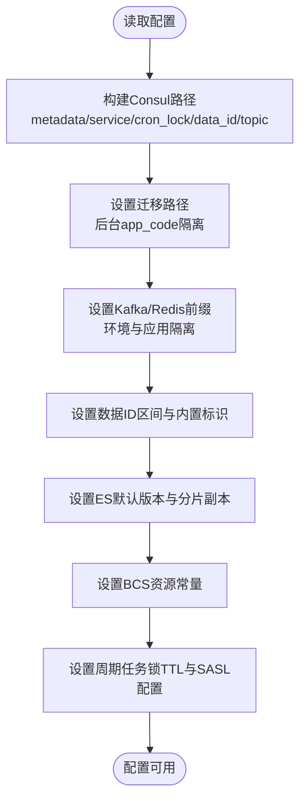
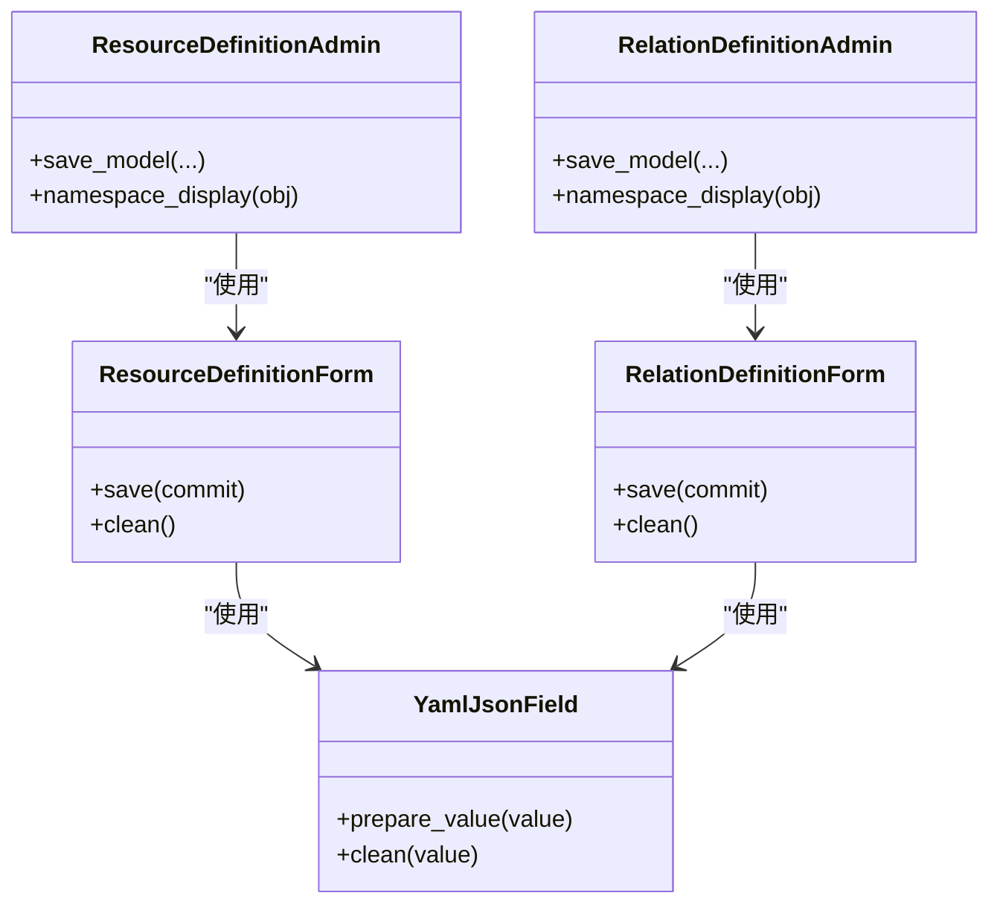
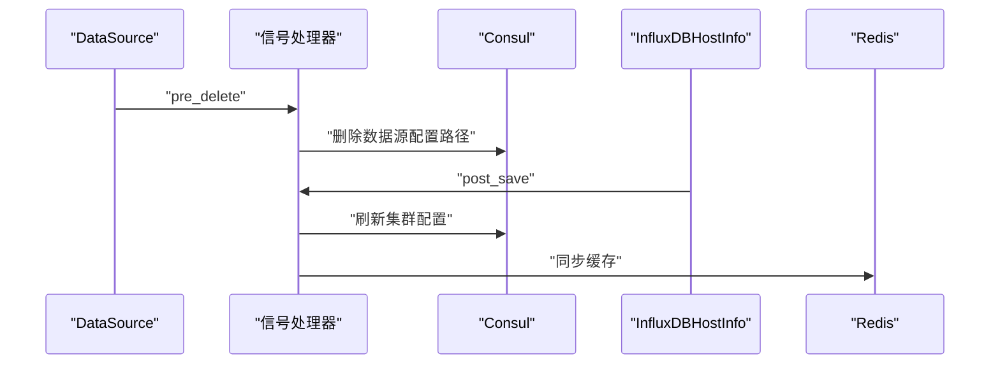
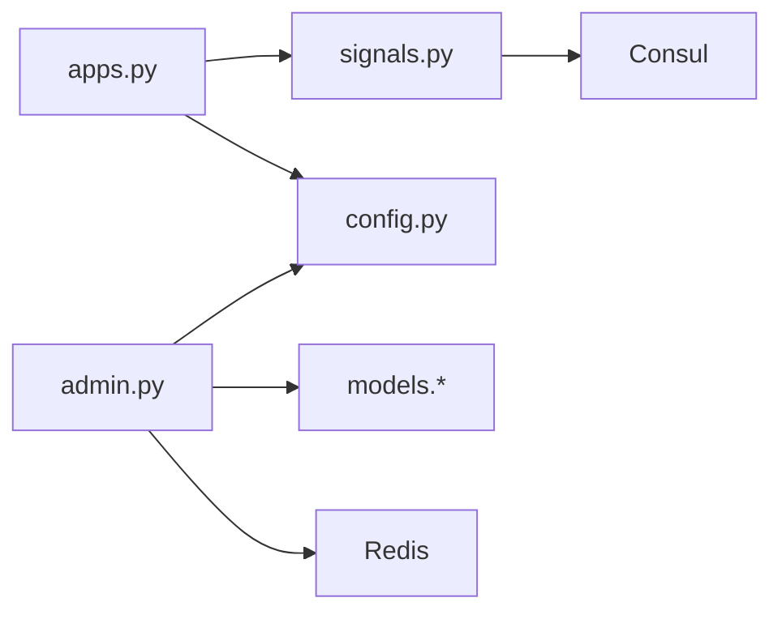

# 元数据管理模块

<cite>
**本文档引用的文件**
- [apps.py](file://bkmonitor/metadata/apps.py)
- [config.py](file://bkmonitor/metadata/config.py)
- [admin.py](file://bkmonitor/metadata/admin.py)
- [signals.py](file://bkmonitor/metadata/signals.py)
- [views.py](file://bkmonitor/metadata/views.py)
</cite>

## 目录
1. [简介](#简介)
2. [项目结构](#项目结构)
3. [核心组件](#核心组件)
4. [架构总览](#架构总览)
5. [详细组件分析](#详细组件分析)
6. [依赖分析](#依赖分析)
7. [性能考虑](#性能考虑)
8. [故障排查指南](#故障排查指南)
9. [结论](#结论)
10. [附录](#附录)

## 简介
本文件面向蓝鲸智云监控平台的元数据管理模块，系统性阐述其设计架构、数据模型与管理机制，覆盖数据源管理、存储配置、空间管理、实体关系等核心能力，并说明元数据同步、迁移与任务调度等后台服务的实现原理。文档通过可视化图表呈现元数据关系图、数据流转过程与配置管理策略，帮助开发者快速理解并维护元数据系统。

## 项目结构
元数据模块位于 bkmonitor/metadata 目录下，采用 Django 应用标准结构组织，关键文件包括：
- 应用初始化与启动：apps.py
- 配置常量与路径：config.py
- 后台管理界面：admin.py
- 数据变更信号处理：signals.py
- 视图入口：views.py

**图表来源**
- [apps.py:16-42](file://bkmonitor/metadata/apps.py#L16-L42)
- [config.py:1-121](file://bkmonitor/metadata/config.py#L1-L121)
- [admin.py:173-422](file://bkmonitor/metadata/admin.py#L173-L422)
- [signals.py:23-83](file://bkmonitor/metadata/signals.py#L23-L83)
- [views.py:11-14](file://bkmonitor/metadata/views.py#L11-L14)

**章节来源**
- [apps.py:16-42](file://bkmonitor/metadata/apps.py#L16-L42)
- [config.py:1-121](file://bkmonitor/metadata/config.py#L1-L121)
- [admin.py:173-422](file://bkmonitor/metadata/admin.py#L173-L422)
- [signals.py:23-83](file://bkmonitor/metadata/signals.py#L23-L83)
- [views.py:11-14](file://bkmonitor/metadata/views.py#L11-L14)

## 核心组件
- 应用配置与启动
  - 在 ready 钩子中加载信号模块，确保模型级事件处理生效；同时延迟绑定核心模型类，避免应用未就绪时的循环依赖。
- 配置常量与路径
  - 定义 Consul 路径、迁移路径、Kafka/Redis 前缀、数据 ID 区间、ES 存储默认参数、容器资源相关常量、周期任务锁 TTL、默认用户名、Kafka SASL 配置、VM 存储类型与白名单键等。
- Django Admin 管理
  - 注册大量模型的管理界面，提供搜索、过滤、列表展示等功能；自定义 YAML/JSON 字段表单，支持资源定义与关系定义的编辑。
- 信号处理
  - 处理数据源与 InfluxDB 存储的删除与主机信息变更事件，负责清理 Consul 配置与刷新集群配置。
- 视图入口
  - 提供空实现的视图入口，便于后续扩展。

**章节来源**
- [apps.py:20-42](file://bkmonitor/metadata/apps.py#L20-L42)
- [config.py:20-121](file://bkmonitor/metadata/config.py#L20-L121)
- [admin.py:21-99](file://bkmonitor/metadata/admin.py#L21-L99)
- [signals.py:23-83](file://bkmonitor/metadata/signals.py#L23-L83)
- [views.py:11-14](file://bkmonitor/metadata/views.py#L11-L14)

## 架构总览
元数据模块围绕“配置中心 + 存储路由 + 实体关系 + 后台管理”构建，关键交互如下：
- 配置中心（Consul）
  - 用于存放数据源、InfluxDB 路由、Transfer 集群、定时任务锁等配置，支持按环境与应用维度隔离。
- 存储层
  - 支持 Kafka、ES、InfluxDB、Redis、BkData 等多种存储类型，通过结果表与存储配置关联。
- 实体关系
  - 通过资源定义与关系定义模型，配合 Redis 缓存，实现实体与关系的动态查询与同步。
- 后台管理
  - 通过 Django Admin 提供可视化管理界面，支持批量导入导出、字段校验与缓存重建。

**图表来源**
- [config.py:20-37](file://bkmonitor/metadata/config.py#L20-L37)
- [config.py:51-61](file://bkmonitor/metadata/config.py#L51-L61)
- [admin.py:362-387](file://bkmonitor/metadata/admin.py#L362-L387)

**章节来源**
- [config.py:20-61](file://bkmonitor/metadata/config.py#L20-L61)
- [admin.py:362-387](file://bkmonitor/metadata/admin.py#L362-L387)

## 详细组件分析

### 应用初始化与模型绑定（apps.py）
- 功能要点
  - 在 ready 钩子中导入信号模块，确保模型保存/删除事件触发相应处理逻辑。
  - 延迟绑定核心模型类（结果表、字段、记录格式、选项、事件组、存储相关模型、自定义上报数据源等），避免应用未准备完成时的依赖问题。
- 设计意义
  - 保证模块启动顺序与依赖关系清晰，减少循环导入风险；为后续的信号处理与模型使用奠定基础。

**图表来源**
- [apps.py:20-42](file://bkmonitor/metadata/apps.py#L20-L42)

**章节来源**
- [apps.py:20-42](file://bkmonitor/metadata/apps.py#L20-L42)

### 配置常量与路径（config.py）
- 关键配置
  - Consul 路径与服务路径：按应用代码、平台、环境维度隔离，支持 metadata 与 service 两套路径。
  - 迁移路径：使用后台 app code，确保迁移任务在后台执行。
  - Data ID 路径模板与 Transfer 路径模板：用于生成具体配置键。
  - 定时任务锁路径与更新间隔：保障分布式环境下任务互斥与配置刷新频率。
  - Kafka/Redis 前缀：区分不同环境与应用，避免冲突。
  - 数据 ID 区间与内置标识：限定合法范围，识别内置数据 ID。
  - ES 存储默认版本与分片副本配置：支持通过环境变量调整。
  - 容器资源相关常量：BCS 资源组名、版本、资源类型与查询名。
  - 周期任务锁 TTL、默认用户名、Kafka SASL 配置、VM 存储类型与白名单键。
- 影响范围
  - 所有依赖配置中心与存储前缀的模块均受此影响，是跨模块共享的配置基线。

**图表来源**
- [config.py:20-121](file://bkmonitor/metadata/config.py#L20-L121)

**章节来源**
- [config.py:20-121](file://bkmonitor/metadata/config.py#L20-L121)

### Django Admin 管理（admin.py）
- 自定义表单字段
  - YamlJsonField：支持 YAML/JSON 输入，存储为 JSON；展示时转换为易读格式；清洗阶段统一空格字符，提升编辑体验。
  - ResourceDefinitionForm/RelationDefinitionForm：将 fields 字段映射到 fields_def，避免与 Model.Meta.fields 冲突。
- 模型注册与展示
  - 注册大量模型（如 DataSource、ResultTable、Storage、EntityDefinition 等），提供搜索、过滤、列表展示与排序。
  - ResourceDefinitionAdmin/RelationDefinitionAdmin：在保存时若 spec 或 labels 变化则递增 generation，并同步更新 Redis 缓存。
- 设计意义
  - 通过 Admin 提供可视化管理界面，结合自定义表单与缓存同步，降低配置错误率并提升运维效率。

**图表来源**
- [admin.py:21-99](file://bkmonitor/metadata/admin.py#L21-L99)
- [admin.py:362-387](file://bkmonitor/metadata/admin.py#L362-L387)

**章节来源**
- [admin.py:21-99](file://bkmonitor/metadata/admin.py#L21-L99)
- [admin.py:362-387](file://bkmonitor/metadata/admin.py#L362-L387)

### 信号处理（signals.py）
- 删除事件清理
  - DataSource 删除前清理 Consul 中对应配置路径。
  - InfluxDBStorage 删除前清理其集群配置路径。
- 主机信息变更刷新
  - InfluxDBHostInfo 保存后刷新 Consul 与 Redis 中的集群配置。
- 设计意义
  - 通过信号在模型生命周期关键节点执行清理与同步，保证配置中心与缓存的一致性，避免脏数据残留。

**图表来源**
- [signals.py:23-83](file://bkmonitor/metadata/signals.py#L23-L83)

**章节来源**
- [signals.py:23-83](file://bkmonitor/metadata/signals.py#L23-L83)

### 视图入口（views.py）
- 当前为空实现，保留扩展点以支持后续页面或接口接入。

**章节来源**
- [views.py:11-14](file://bkmonitor/metadata/views.py#L11-L14)

## 依赖分析
- 模块内聚与耦合
  - apps.py 作为启动入口，集中处理信号与模型绑定，降低其他模块对启动顺序的感知。
  - config.py 提供全局配置，被 Admin、信号处理与各业务模块共享，形成高内聚低耦合的配置中心。
  - admin.py 依赖 models 与自定义表单，通过注册机制统一管理界面。
  - signals.py 依赖配置中心与缓存，处理模型级事件。
- 外部依赖
  - Consul：用于配置存储与分布式锁。
  - Redis：用于实体关系缓存。
  - Kafka/ES/InfluxDB/Redis/BkData：作为存储后端，通过结果表与存储配置关联。

**图表来源**
- [apps.py:20-42](file://bkmonitor/metadata/apps.py#L20-L42)
- [config.py:20-37](file://bkmonitor/metadata/config.py#L20-L37)
- [admin.py:362-387](file://bkmonitor/metadata/admin.py#L362-L387)
- [signals.py:23-83](file://bkmonitor/metadata/signals.py#L23-L83)

**章节来源**
- [apps.py:20-42](file://bkmonitor/metadata/apps.py#L20-L42)
- [config.py:20-37](file://bkmonitor/metadata/config.py#L20-L37)
- [admin.py:362-387](file://bkmonitor/metadata/admin.py#L362-L387)
- [signals.py:23-83](file://bkmonitor/metadata/signals.py#L23-L83)

## 性能考虑
- 配置中心访问
  - 通过合理的路径前缀与更新间隔，减少频繁读写带来的压力；建议在批量操作时合并请求。
- 缓存同步
  - Admin 保存时同步 Redis 缓存，应避免在高频变更场景下重复触发；可考虑引入队列异步更新。
- 存储前缀隔离
  - Kafka/Redis 前缀按应用与环境隔离，有助于降低冲突与提升查询效率。

## 故障排查指南
- Consul 配置异常
  - 症状：删除数据源或 InfluxDB 存储后，配置未清理。
  - 排查：确认信号处理是否生效；检查环境变量与路径配置是否正确。
- Admin 表单保存失败
  - 症状：YAML/JSON 表单无法保存或显示格式异常。
  - 排查：检查输入格式是否符合 YAML/JSON 规范；确认空格字符是否被正确替换。
- 缓存未更新
  - 症状：实体关系查询结果陈旧。
  - 排查：确认保存时 generation 是否递增；检查 Redis 缓存重建流程。

**章节来源**
- [signals.py:23-83](file://bkmonitor/metadata/signals.py#L23-L83)
- [admin.py:21-99](file://bkmonitor/metadata/admin.py#L21-L99)
- [admin.py:330-360](file://bkmonitor/metadata/admin.py#L330-L360)

## 结论
元数据管理模块通过清晰的应用初始化、统一的配置常量、完善的 Admin 界面与信号处理机制，构建了稳定可靠的元数据管理体系。其以配置中心与缓存为核心，支撑多存储后端与实体关系的动态管理，适合在大规模监控场景中持续演进与维护。

## 附录
- 配置清单
  - Consul 路径与服务路径、迁移路径、Data ID 路径模板、Transfer 路径模板、定时任务锁路径与更新间隔、Kafka/Redis 前缀、数据 ID 区间、ES 默认版本与分片副本、BCS 资源常量、周期任务锁 TTL、默认用户名、Kafka SASL 配置、VM 存储类型与白名单键。
- 建议
  - 在生产环境中启用信号处理与缓存同步；对高频变更场景引入异步队列；定期校验配置中心与缓存一致性。