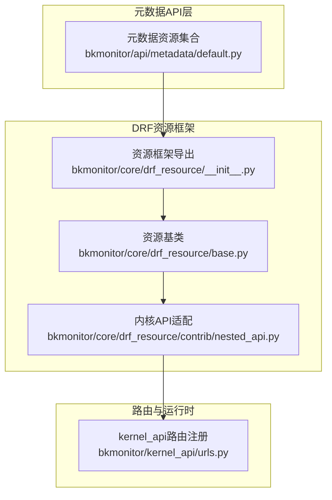
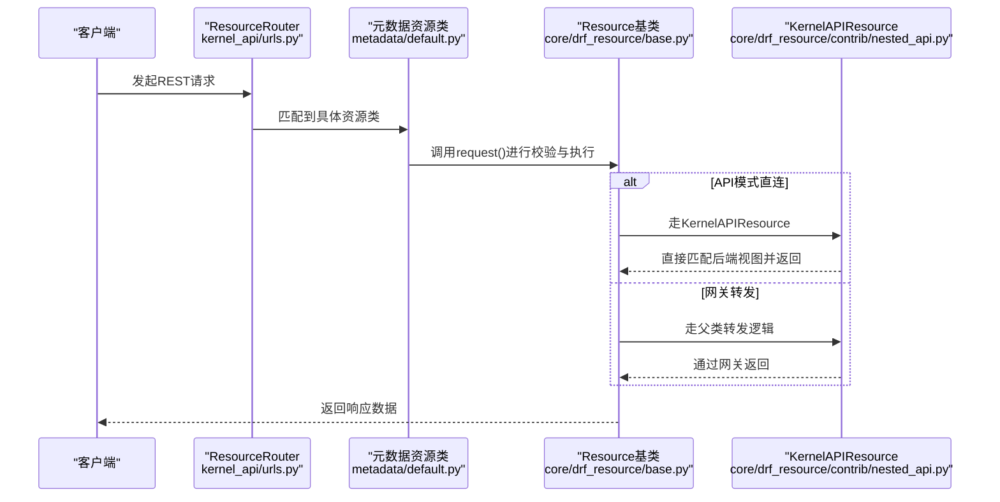
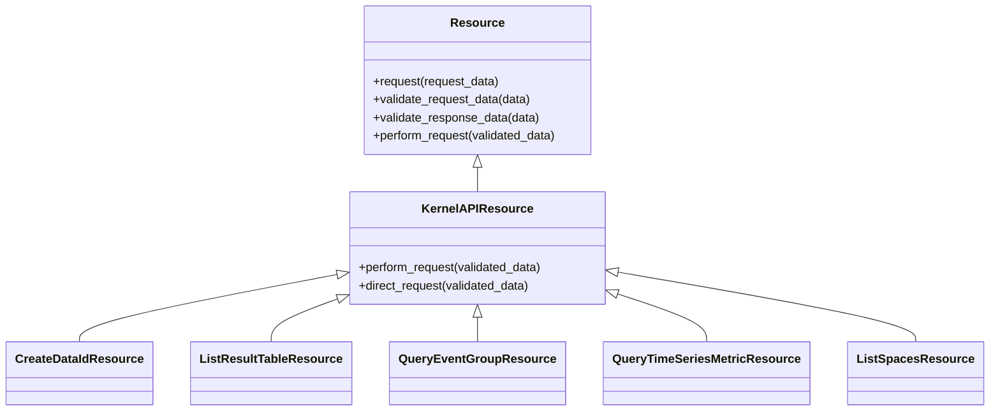

# 元数据资源接口

<cite>
**本文引用的文件**
- [bkmonitor/api/metadata/default.py](file://bkmonitor/api/metadata/default.py)
- [bkmonitor/core/drf_resource/__init__.py](file://bkmonitor/core/drf_resource/__init__.py)
- [bkmonitor/core/drf_resource/base.py](file://bkmonitor/core/drf_resource/base.py)
- [bkmonitor/core/drf_resource/contrib/nested_api.py](file://bkmonitor/core/drf_resource/contrib/nested_api.py)
- [bkmonitor/kernel_api/urls.py](file://bkmonitor/kernel_api/urls.py)
</cite>

## 目录
1. [简介](#简介)
2. [项目结构](#项目结构)
3. [核心组件](#核心组件)
4. [架构总览](#架构总览)
5. [详细组件分析](#详细组件分析)
6. [依赖分析](#依赖分析)
7. [性能考虑](#性能考虑)
8. [故障排查指南](#故障排查指南)
9. [结论](#结论)
10. [附录](#附录)

## 简介
本技术文档面向“元数据管理模块”的资源接口，系统性阐述基于 DRF 资源类（Resource）的实现与设计，覆盖数据源资源、空间资源、实体关系资源等 API 的请求/响应规范、认证与权限、分页与过滤、错误码与集成方式。文档同时给出关键流程的时序图与类图，帮助开发者快速理解与落地。

## 项目结构
元数据资源接口主要位于以下位置：
- 元数据资源定义：bkmonitor/api/metadata/default.py
- DRF 资源框架入口与导出：bkmonitor/core/drf_resource/__init__.py
- 资源基类与通用能力：bkmonitor/core/drf_resource/base.py
- 内部 API 转发与直连适配：bkmonitor/core/drf_resource/contrib/nested_api.py
- kernel_api 路由注册与版本化：bkmonitor/kernel_api/urls.py

图表来源
- [bkmonitor/api/metadata/default.py:1-120](file://bkmonitor/api/metadata/default.py#L1-L120)
- [bkmonitor/core/drf_resource/__init__.py:11-45](file://bkmonitor/core/drf_resource/__init__.py#L11-L45)
- [bkmonitor/core/drf_resource/base.py:79-166](file://bkmonitor/core/drf_resource/base.py#L79-L166)
- [bkmonitor/core/drf_resource/contrib/nested_api.py:56-120](file://bkmonitor/core/drf_resource/contrib/nested_api.py#L56-L120)
- [bkmonitor/kernel_api/urls.py:61-120](file://bkmonitor/kernel_api/urls.py#L61-L120)

章节来源
- [bkmonitor/api/metadata/default.py:1-120](file://bkmonitor/api/metadata/default.py#L1-L120)
- [bkmonitor/core/drf_resource/__init__.py:11-45](file://bkmonitor/core/drf_resource/__init__.py#L11-L45)
- [bkmonitor/core/drf_resource/base.py:79-166](file://bkmonitor/core/drf_resource/base.py#L79-L166)
- [bkmonitor/core/drf_resource/contrib/nested_api.py:56-120](file://bkmonitor/core/drf_resource/contrib/nested_api.py#L56-L120)
- [bkmonitor/kernel_api/urls.py:61-120](file://bkmonitor/kernel_api/urls.py#L61-L120)

## 核心组件
- 资源基类 Resource：统一请求/响应校验、MCP 元数据采集、OpenTelemetry 追踪、批量并发、异步任务等能力。
- 内核 API 适配 KernelAPIResource：在 API 模式下直连后端视图，避免 ESB 循环调用；否则走网关转发。
- 元数据资源集合：以 DRF 资源类形式定义各类元数据 API（数据源、结果表、事件/时序分组、空间、集群等）。

章节来源
- [bkmonitor/core/drf_resource/base.py:79-166](file://bkmonitor/core/drf_resource/base.py#L79-L166)
- [bkmonitor/core/drf_resource/contrib/nested_api.py:56-120](file://bkmonitor/core/drf_resource/contrib/nested_api.py#L56-L120)
- [bkmonitor/api/metadata/default.py:45-120](file://bkmonitor/api/metadata/default.py#L45-L120)

## 架构总览
元数据资源通过 DRF 资源类封装，请求经序列化器校验后进入 perform_request 执行业务逻辑；若为内核 API 模式，KernelAPIResource 可直接匹配到后端视图并返回数据，否则通过网关转发。整体链路如下：

图表来源
- [bkmonitor/kernel_api/urls.py:61-120](file://bkmonitor/kernel_api/urls.py#L61-L120)
- [bkmonitor/api/metadata/default.py:45-120](file://bkmonitor/api/metadata/default.py#L45-L120)
- [bkmonitor/core/drf_resource/base.py:321-389](file://bkmonitor/core/drf_resource/base.py#L321-L389)
- [bkmonitor/core/drf_resource/contrib/nested_api.py:66-119](file://bkmonitor/core/drf_resource/contrib/nested_api.py#L66-L119)

## 详细组件分析

### 数据源资源
- 创建数据源
  - 方法与路径：POST /app/metadata/create_data_id/
  - 请求参数（节选）：data_name、etl_config、operator、mq_cluster、data_description、is_custom_source、source_label、type_label、option、space_uid、bk_biz_id、is_platform_data_id
  - 响应：标准结果对象（包含创建后的数据源标识）
- 修改数据源
  - 方法与路径：POST /app/metadata/modify_data_id/
  - 请求参数（节选）：operator、data_name、data_id、data_description、option、is_enable
  - 响应：标准结果对象（包含修改后的数据源信息）
- 查询数据源
  - 方法与路径：GET /app/metadata/query_data_source/
  - 查询参数：bk_data_id、data_name、with_rt_info
  - 响应：数据源列表或详情
- 根据 space_uid 查询 data_source
  - 方法与路径：POST /app/metadata/query_data_source_by_space_uid/
  - 请求参数：space_uid_list、is_platform_data_id
  - 响应：数据源列表

章节来源
- [bkmonitor/api/metadata/default.py:62-90](file://bkmonitor/api/metadata/default.py#L62-L90)
- [bkmonitor/api/metadata/default.py:237-252](file://bkmonitor/api/metadata/default.py#L237-L252)
- [bkmonitor/api/metadata/default.py:965-978](file://bkmonitor/api/metadata/default.py#L965-L978)
- [bkmonitor/api/metadata/default.py:173-184](file://bkmonitor/api/metadata/default.py#L173-L184)

### 结果表资源
- 创建结果表
  - 方法与路径：POST /app/metadata/create_result_table/
  - 请求参数（节选）：bk_data_id、table_id、table_name_zh、is_custom_table、schema_type、operator、default_storage、default_storage_config、field_list、bk_biz_id、label、external_storage、option、is_time_field_only、time_option、data_label
  - 响应：标准结果对象（包含创建后的结果表标识）
- 修改结果表
  - 方法与路径：POST /app/metadata/modify_result_table/
  - 请求参数（节选）：table_id、operator、field_list、table_name_zh、default_storage、label、option、is_time_field_only、external_storage、is_enable、time_option、is_reserved_check、data_label
  - 响应：标准结果对象（包含修改后的结果表信息）
- 查询结果表
  - 方法与路径：GET /app/metadata/list_result_table/
  - 查询参数：bk_biz_id、datasource_type、is_public_include、page、page_size、with_option
  - 响应：结果表分页列表
- 获取结果表详情
  - 方法与路径：GET /app/metadata/get_result_table/
  - 查询参数：table_id
  - 响应：结果表详情
- 获取结果表存储信息
  - 方法与路径：GET /app/metadata/get_result_table_storage/
  - 查询参数：result_table_list、storage_type
  - 响应：存储配置详情

章节来源
- [bkmonitor/api/metadata/default.py:85-110](file://bkmonitor/api/metadata/default.py#L85-L110)
- [bkmonitor/api/metadata/default.py:133-155](file://bkmonitor/api/metadata/default.py#L133-L155)
- [bkmonitor/api/metadata/default.py:112-131](file://bkmonitor/api/metadata/default.py#L112-L131)
- [bkmonitor/api/metadata/default.py:186-196](file://bkmonitor/api/metadata/default.py#L186-L196)
- [bkmonitor/api/metadata/default.py:198-209](file://bkmonitor/api/metadata/default.py#L198-L209)

### 事件分组资源
- 创建事件分组
  - 方法与路径：POST /app/metadata/create_event_group/
  - 请求参数（节选）：operator、bk_data_id、bk_biz_id、event_group_name、label、event_info_list、data_label
  - 响应：标准结果对象（包含事件分组标识）
- 修改事件分组
  - 方法与路径：POST /app/metadata/modify_event_group/
  - 请求参数（节选）：operator、event_group_id、event_group_name、label、event_info_list、is_enable、data_label
  - 响应：标准结果对象（包含事件分组信息）
- 删除事件分组
  - 方法与路径：POST /app/metadata/delete_event_group/
  - 请求参数（节选）：operator、event_group_id
  - 响应：标准结果对象（包含删除结果）
- 获取事件分组
  - 方法与路径：GET /app/metadata/get_event_group/
  - 查询参数：event_group_id、with_result_table_info、need_refresh、event_infos_limit
  - 响应：事件分组详情
- 查询事件分组（单次）
  - 方法与路径：GET /app/metadata/query_event_group/
  - 查询参数：bk_biz_id、label、event_group_name、bk_data_ids、page、page_size
  - 响应：事件分组列表
- 批量查询事件分组
  - 方法与路径：GET /app/metadata/query_event_group/（批量）
  - 查询参数：bk_biz_id、label、event_group_name、bk_data_ids
  - 响应：事件分组列表（内部使用批量请求）

章节来源
- [bkmonitor/api/metadata/default.py:297-313](file://bkmonitor/api/metadata/default.py#L297-L313)
- [bkmonitor/api/metadata/default.py:315-331](file://bkmonitor/api/metadata/default.py#L315-L331)
- [bkmonitor/api/metadata/default.py:333-344](file://bkmonitor/api/metadata/default.py#L333-L344)
- [bkmonitor/api/metadata/default.py:346-360](file://bkmonitor/api/metadata/default.py#L346-L360)
- [bkmonitor/api/metadata/default.py:362-379](file://bkmonitor/api/metadata/default.py#L362-L379)
- [bkmonitor/api/metadata/default.py:381-398](file://bkmonitor/api/metadata/default.py#L381-L398)

### 自定义时序分组与指标资源
- 创建/更新时序分组
  - 方法与路径：POST /app/metadata/create_time_series_group/
  - 请求参数（节选）：operator、bk_data_id、bk_biz_id、time_series_group_name、label、metric_info_list、table_id、is_split_measurement、additional_options、data_label、metric_group_dimensions
  - 响应：标准结果对象（包含时序分组标识）
- 修改时序分组
  - 方法与路径：POST /app/metadata/modify_time_series_group/
  - 请求参数（节选）：operator、time_series_group_id、time_series_group_name、label、field_list、is_enable、enable_field_black_list、metric_info_list、data_label、options
  - 响应：标准结果对象（包含时序分组信息）
- 删除时序分组
  - 方法与路径：POST /app/metadata/delete_time_series_group/
  - 请求参数（节选）：operator、time_series_group_id
  - 响应：标准结果对象（包含删除结果）
- 获取时序分组
  - 方法与路径：GET /app/metadata/get_time_series_group/
  - 查询参数：time_series_group_id、with_result_table_info
  - 响应：时序分组详情
- 查询时序分组（单次）
  - 方法与路径：GET /app/metadata/query_time_series_group/
  - 查询参数：bk_biz_id、label、time_series_group_name、page、page_size
  - 响应：时序分组列表
- 批量查询时序分组
  - 方法与路径：GET /app/metadata/query_time_series_group/（批量）
  - 查询参数：bk_tenant_id、bk_biz_id、label、time_series_group_name
  - 响应：时序分组列表（内部使用批量请求）
- 批量创建/更新时序指标
  - 方法与路径：POST /app/metadata/create_or_update_time_series_metric/
  - 请求参数（节选）：group_id、metrics（含 field_id、field_name、field_scope、tag_list、field_config、label、scope_id）
  - 响应：标准结果对象（包含批量处理结果）
- 批量创建/更新时序指标分组
  - 方法与路径：POST /app/metadata/create_or_update_time_series_scope/
  - 请求参数（节选）：group_id、scopes（含 scope_id、scope_name、dimension_config、auto_rules）
  - 响应：标准结果对象（包含批量处理结果）
- 批量删除时序指标分组
  - 方法与路径：POST /app/metadata/delete_time_series_scope/
  - 请求参数（节选）：group_id、scopes（含 scope_name）
  - 响应：标准结果对象（包含批量处理结果）
- 查询时序指标分组
  - 方法与路径：POST /app/metadata/query_time_series_scope/
  - 请求参数（节选）：group_id、scope_ids、scope_name、include_metrics、mandatory_conditions
  - 响应：分组列表与可选指标数据
- 查询时序指标
  - 方法与路径：POST /app/metadata/query_time_series_metric/
  - 请求参数（节选）：bk_tenant_id、group_id、page、page_size、conditions、mandatory_conditions、condition_connector、order_by、count_only
  - 响应：指标列表与分页统计

章节来源
- [bkmonitor/api/metadata/default.py:400-420](file://bkmonitor/api/metadata/default.py#L400-L420)
- [bkmonitor/api/metadata/default.py:422-441](file://bkmonitor/api/metadata/default.py#L422-L441)
- [bkmonitor/api/metadata/default.py:443-454](file://bkmonitor/api/metadata/default.py#L443-L454)
- [bkmonitor/api/metadata/default.py:456-468](file://bkmonitor/api/metadata/default.py#L456-L468)
- [bkmonitor/api/metadata/default.py:470-484](file://bkmonitor/api/metadata/default.py#L470-L484)
- [bkmonitor/api/metadata/default.py:486-503](file://bkmonitor/api/metadata/default.py#L486-L503)
- [bkmonitor/api/metadata/default.py:505-534](file://bkmonitor/api/metadata/default.py#L505-L534)
- [bkmonitor/api/metadata/default.py:536-573](file://bkmonitor/api/metadata/default.py#L536-L573)
- [bkmonitor/api/metadata/default.py:558-573](file://bkmonitor/api/metadata/default.py#L558-L573)
- [bkmonitor/api/metadata/default.py:575-622](file://bkmonitor/api/metadata/default.py#L575-L622)
- [bkmonitor/api/metadata/default.py:624-713](file://bkmonitor/api/metadata/default.py#L624-L713)

### 空间资源
- 列举空间类型
  - 方法与路径：GET /app/metadata/list_space_types/
  - 响应：空间类型列表
- 列举空间
  - 方法与路径：GET /app/metadata/list_spaces/
  - 响应：空间列表
- 获取空间详情
  - 方法与路径：GET /app/metadata/get_space_detail/
  - 查询参数：space_uid（通过上下文推断）
  - 响应：空间详情
- 根据 space_uid 获取集群
  - 方法与路径：GET /app/metadata/get_clusters_by_space_uid/
  - 查询参数：space_uid
  - 响应：集群列表
- 列举粘性空间
  - 方法与路径：GET /app/metadata/list_sticky_spaces/
  - 查询参数：username（自动填充）
  - 响应：粘性空间列表
- 置顶空间
  - 方法与路径：POST /app/metadata/stick_space/
  - 请求参数：action、space_uid、username
  - 响应：置顶结果
- 创建空间
  - 方法与路径：POST /app/metadata/create_space/
  - 请求参数：space_name、space_type_id、space_id、username（自动映射为 creator）
  - 响应：空间创建结果

章节来源
- [bkmonitor/api/metadata/default.py:890-918](file://bkmonitor/api/metadata/default.py#L890-L918)
- [bkmonitor/api/metadata/default.py:931-947](file://bkmonitor/api/metadata/default.py#L931-L947)
- [bkmonitor/api/metadata/default.py:949-962](file://bkmonitor/api/metadata/default.py#L949-L962)

### 集群资源
- 列举集群
  - 方法与路径：GET /app/metadata/list_clusters/
  - 查询参数：cluster_type、page_size、page
  - 响应：集群列表
- 获取存储集群详情
  - 方法与路径：GET /app/metadata/get_storage_cluster_detail/
  - 查询参数：cluster_id
  - 响应：集群详情
- 注册集群
  - 方法与路径：POST /app/metadata/register_cluster/
  - 请求参数（节选）：cluster_name、cluster_type、domain、port、registered_system、operator、description、username、password、version、schema、is_ssl_verify、label
  - 响应：集群注册结果
- 更新已注册集群
  - 方法与路径：POST /app/metadata/update_registered_cluster/
  - 请求参数（节选）：cluster_id、operator、description、username、password、version、schema、is_ssl_verify、label、default_settings
  - 响应：更新结果
- 获取集群信息
  - 方法与路径：GET /app/metadata/get_cluster_info/
  - 查询参数：cluster_id、cluster_name、cluster_type、is_plain_text、registered_system
  - 响应：集群信息

章节来源
- [bkmonitor/api/metadata/default.py:980-996](file://bkmonitor/api/metadata/default.py#L980-L996)
- [bkmonitor/api/metadata/default.py:998-1016](file://bkmonitor/api/metadata/default.py#L998-L1016)
- [bkmonitor/api/metadata/default.py:1018-1032](file://bkmonitor/api/metadata/default.py#L1018-L1032)
- [bkmonitor/api/metadata/default.py:730-745](file://bkmonitor/api/metadata/default.py#L730-L745)

### BCS资源与指标
- 注册BCS集群
  - 方法与路径：POST /app/metadata/register_bcs_cluster/
  - 请求参数（节选）：bk_biz_id、cluster_id、project_id、creator、domain_name、port、api_key_type、api_key_prefix、is_skip_ssl_verify、transfer_cluster_id
  - 响应：注册结果
- 修改BCS资源信息
  - 方法与路径：POST /app/metadata/modify_bcs_resource_info/
  - 请求参数（节选）：cluster_id、resource_type、resource_name、data_id
  - 响应：修改结果
- 列举BCS资源信息
  - 方法与路径：POST /app/metadata/list_bcs_resource_info/
  - 请求参数（节选）：cluster_ids、resource_type
  - 响应：资源信息列表
- 列举BCS集群信息
  - 方法与路径：GET /app/metadata/list_bcs_cluster_info/
  - 查询参数：bk_biz_id、cluster_ids
  - 响应：集群信息列表
- 查询BCS指标
  - 方法与路径：GET /app/metadata/query_bcs_metrics/
  - 查询参数：bk_biz_ids、cluster_ids、dimension_name、dimension_value
  - 响应：指标数据

章节来源
- [bkmonitor/api/metadata/default.py:810-828](file://bkmonitor/api/metadata/default.py#L810-L828)
- [bkmonitor/api/metadata/default.py:831-844](file://bkmonitor/api/metadata/default.py#L831-L844)
- [bkmonitor/api/metadata/default.py:846-853](file://bkmonitor/api/metadata/default.py#L846-L853)
- [bkmonitor/api/metadata/default.py:855-862](file://bkmonitor/api/metadata/default.py#L855-L862)
- [bkmonitor/api/metadata/default.py:864-873](file://bkmonitor/api/metadata/default.py#L864-L873)

### 数据查询与辅助接口
- 时间序列数据查询
  - 方法与路径：POST /app/data_query/get_ts_data/
  - 请求参数：sql
  - 响应：时序数据
- ES数据查询
  - 方法与路径：POST /app/data_query/get_es_data/
  - 请求参数：table_id、query_body、use_full_index_names
  - 响应：ES查询结果
- 查询标签/维度值
  - 方法与路径：GET /app/metadata/query_tag_values/
  - 查询参数：table_id、tag_name
  - 响应：标签/维度值列表
- 自定义时序详情
  - 方法与路径：GET /app/custom_metric/detail/
  - 查询参数：bk_biz_id、time_series_group_id、model_only、empty_if_not_found
  - 响应：自定义时序详情
- 结果表存储详情
  - 方法与路径：GET /app/metadata/query_result_table_storage_detail/
  - 查询参数：bk_data_id、table_id、bcs_cluster_id
  - 响应：存储详情
- 数据标签映射
  - 方法与路径：POST /app/metadata/get_data_labels_map/
  - 请求参数：bk_biz_id、table_or_labels
  - 响应：标签映射

章节来源
- [bkmonitor/api/metadata/default.py:211-222](file://bkmonitor/api/metadata/default.py#L211-L222)
- [bkmonitor/api/metadata/default.py:223-235](file://bkmonitor/api/metadata/default.py#L223-L235)
- [bkmonitor/api/metadata/default.py:715-729](file://bkmonitor/api/metadata/default.py#L715-L729)
- [bkmonitor/api/metadata/default.py:1035-1046](file://bkmonitor/api/metadata/default.py#L1035-L1046)
- [bkmonitor/api/metadata/default.py:1048-1056](file://bkmonitor/api/metadata/default.py#L1048-L1056)
- [bkmonitor/api/metadata/default.py:1058-1067](file://bkmonitor/api/metadata/default.py#L1058-L1067)

### 认证、权限与分页过滤
- 认证与权限
  - kernel_api 在 API 模式下使用自定义认证中间件与渲染器，确保在后台模式下的安全与合规。
  - 权限控制通过中间件与白名单机制实现，具体以部署配置为准。
- 分页与过滤
  - 多数列表接口支持 page/page_size 参数进行分页。
  - 查询接口普遍支持多种过滤条件（如业务ID、标签、名称等），并提供排序与统计开关。
- 缓存策略
  - 部分资源类通过 backend_cache_type 或 cache_type 指定缓存类型，提升查询性能。

章节来源
- [bkmonitor/kernel_api/urls.py:61-120](file://bkmonitor/kernel_api/urls.py#L61-L120)
- [bkmonitor/api/metadata/default.py:112-131](file://bkmonitor/api/metadata/default.py#L112-L131)
- [bkmonitor/api/metadata/default.py:362-379](file://bkmonitor/api/metadata/default.py#L362-L379)
- [bkmonitor/api/metadata/default.py:486-503](file://bkmonitor/api/metadata/default.py#L486-L503)
- [bkmonitor/api/metadata/default.py:624-713](file://bkmonitor/api/metadata/default.py#L624-L713)

### 错误码说明
- 通用错误
  - 参数校验失败：请求参数格式错误，返回资源层自定义异常。
  - 网关/后端异常：通过 BKAPIError 抛出，包含系统名、URL 与消息。
  - 404：当 API 名称未在配置中定义时触发。
- 建议处理策略
  - 对于参数错误，前端需根据错误提示修正请求字段。
  - 对于网关异常，建议重试并记录日志以便定位问题。

章节来源
- [bkmonitor/core/drf_resource/base.py:184-194](file://bkmonitor/core/drf_resource/base.py#L184-L194)
- [bkmonitor/core/drf_resource/contrib/nested_api.py:107-115](file://bkmonitor/core/drf_resource/contrib/nested_api.py#L107-L115)
- [bkmonitor/core/drf_resource/contrib/nested_api.py:82-84](file://bkmonitor/core/drf_resource/contrib/nested_api.py#L82-L84)

### API调用示例（步骤说明）
- 示例A：创建数据源
  - 步骤1：准备请求参数（如 data_name、etl_config、operator 等）
  - 步骤2：调用 POST /app/metadata/create_data_id/
  - 步骤3：解析响应中的数据源标识
- 示例B：查询结果表列表
  - 步骤1：准备查询参数（如 bk_biz_id、page、page_size）
  - 步骤2：调用 GET /app/metadata/list_result_table/
  - 步骤3：解析分页数据与总数
- 示例C：批量查询事件分组
  - 步骤1：准备查询参数（如 bk_biz_id、label、event_group_name）
  - 步骤2：调用 GET /app/metadata/query_event_group/（批量）
  - 步骤3：解析返回的事件分组列表

章节来源
- [bkmonitor/api/metadata/default.py:62-90](file://bkmonitor/api/metadata/default.py#L62-L90)
- [bkmonitor/api/metadata/default.py:112-131](file://bkmonitor/api/metadata/default.py#L112-L131)
- [bkmonitor/api/metadata/default.py:381-398](file://bkmonitor/api/metadata/default.py#L381-L398)

## 依赖分析
- 资源类依赖关系
  - 元数据资源类均继承自 KernelAPIResource（间接或直接），从而具备 API 模式直连与网关转发的能力。
  - 资源基类提供统一的请求/响应校验、追踪与批量执行能力。
- 路由与运行时
  - kernel_api/urls.py 动态注册 v2/v3/v4 版本的资源路由，确保资源类可被正确匹配与调用。

图表来源
- [bkmonitor/core/drf_resource/base.py:79-166](file://bkmonitor/core/drf_resource/base.py#L79-L166)
- [bkmonitor/core/drf_resource/contrib/nested_api.py:56-120](file://bkmonitor/core/drf_resource/contrib/nested_api.py#L56-L120)
- [bkmonitor/api/metadata/default.py:62-90](file://bkmonitor/api/metadata/default.py#L62-L90)
- [bkmonitor/api/metadata/default.py:112-131](file://bkmonitor/api/metadata/default.py#L112-L131)
- [bkmonitor/api/metadata/default.py:381-398](file://bkmonitor/api/metadata/default.py#L381-L398)
- [bkmonitor/api/metadata/default.py:624-713](file://bkmonitor/api/metadata/default.py#L624-L713)
- [bkmonitor/api/metadata/default.py:890-918](file://bkmonitor/api/metadata/default.py#L890-L918)

章节来源
- [bkmonitor/core/drf_resource/base.py:79-166](file://bkmonitor/core/drf_resource/base.py#L79-L166)
- [bkmonitor/core/drf_resource/contrib/nested_api.py:56-120](file://bkmonitor/core/drf_resource/contrib/nested_api.py#L56-L120)
- [bkmonitor/api/metadata/default.py:62-90](file://bkmonitor/api/metadata/default.py#L62-L90)
- [bkmonitor/api/metadata/default.py:112-131](file://bkmonitor/api/metadata/default.py#L112-L131)
- [bkmonitor/api/metadata/default.py:381-398](file://bkmonitor/api/metadata/default.py#L381-L398)
- [bkmonitor/api/metadata/default.py:624-713](file://bkmonitor/api/metadata/default.py#L624-L713)
- [bkmonitor/api/metadata/default.py:890-918](file://bkmonitor/api/metadata/default.py#L890-L918)

## 性能考虑
- 批量请求：资源基类提供 bulk_request 并发执行能力，适合大批量场景。
- 缓存命中：部分资源类配置缓存类型，减少重复查询开销。
- API 模式直连：在 kernel_api 模式下，避免 ESB 序列化与转发，降低延迟。
- 分页与过滤：合理使用分页与过滤条件，避免一次性返回大量数据。

章节来源
- [bkmonitor/core/drf_resource/base.py:390-422](file://bkmonitor/core/drf_resource/base.py#L390-L422)
- [bkmonitor/core/drf_resource/contrib/nested_api.py:66-119](file://bkmonitor/core/drf_resource/contrib/nested_api.py#L66-L119)
- [bkmonitor/api/metadata/default.py:112-131](file://bkmonitor/api/metadata/default.py#L112-L131)

## 故障排查指南
- 参数校验失败
  - 现象：返回资源层自定义异常，包含字段校验错误详情。
  - 排查：对照请求序列化器字段要求，修正必填与类型。
- 网关/后端异常
  - 现象：BKAPIError，包含系统名、URL 与消息。
  - 排查：检查后端服务状态与网关配置，必要时重试。
- 404 未定义
  - 现象：API 名称未在配置中定义。
  - 排查：确认 monitor_v3.yaml 或 apigw 资源定义是否包含该路径。

章节来源
- [bkmonitor/core/drf_resource/base.py:184-194](file://bkmonitor/core/drf_resource/base.py#L184-L194)
- [bkmonitor/core/drf_resource/contrib/nested_api.py:107-115](file://bkmonitor/core/drf_resource/contrib/nested_api.py#L107-L115)
- [bkmonitor/core/drf_resource/contrib/nested_api.py:82-84](file://bkmonitor/core/drf_resource/contrib/nested_api.py#L82-L84)

## 结论
元数据资源接口以 DRF 资源类为核心，结合 KernelAPIResource 的直连/转发能力，形成稳定、可扩展的 API 体系。通过明确的请求/响应序列化器、统一的错误处理与缓存策略，开发者可以高效地对接数据源、结果表、事件/时序分组、空间与集群等元数据能力，并在 API 模式下获得更低的调用延迟与更高的吞吐。

## 附录
- 集成建议
  - 在 API 模式下优先使用直连路径，减少网关转发带来的额外开销。
  - 对高频查询接口启用缓存，合理设置分页与过滤条件。
  - 对批量场景使用 bulk_request 并发执行，提升吞吐。